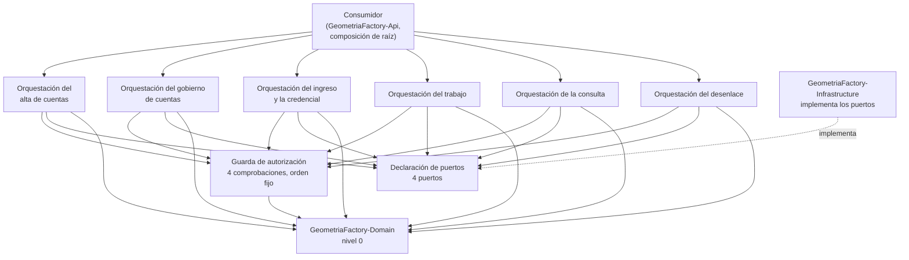

# Arquitectura técnica — GeometriaFactory-Application

**Producto:** Fábrica de Geometría
**Proyecto de código:** GeometriaFactory-Application
**Documento:** Arquitectura-Proyecto-Codigo.md
**Versión:** 1.0
**Estado:** Aprobado
**Fecha:** 2026-08-10
**Autor:** Arquitecto de Software Senior + API Designer (AG-05)
**Tipo de proyecto de código (D8):** `library`
**Trazabilidad upstream:** `PRODUCT-INTAKE-Fabrica-De-Geometria.md` **1.16** §4 y §4.1 (las **dieciséis** reglas `RN-01` a `RN-16`), §4.2 (modelo de estados del trabajo), §13 y §14 (composición del producto y las tres reglas de arquitectura `RA-01`, `RA-02`, `RA-03`), §15 (etapas y puertas técnicas), §16 (estructura de repositorio), §17.1.P.2 (los **nueve** invariantes `INV-01` a `INV-09`), §17.2 completo (P.1 a P.12), §20 E-1 (el texto semilla de tres piezas), §22 (asunciones A-3 y A-5); `PRODUCT-MANIFEST-Fabrica-De-Geometria.md` **1.2** §2, §3 y §5 (flags de este proyecto de código, con `tiene_auth` == true); [`../02-Especificacion-Funcional/Especificacion-Funcional.md`](../02-Especificacion-Funcional/Especificacion-Funcional.md) y los **once** casos de uso de [`../02-Especificacion-Funcional/Casos-De-Uso/`](../02-Especificacion-Funcional/Casos-De-Uso/); [`../03-UX-UI-DX/DX-Error-Messages.md`](../03-UX-UI-DX/DX-Error-Messages.md) y [`../03-UX-UI-DX/DX-Developer-Experience.md`](../03-UX-UI-DX/DX-Developer-Experience.md); la Fase C ya emitida de [`GeometriaFactory-Domain`](../../GeometriaFactory-Domain/05-Arquitectura-Tecnica/Arquitectura-Proyecto-Codigo.md), que es su única dependencia de compilación
**Trazabilidad downstream:** `06-Backlog-Tecnico`, `08-Calidad-Y-Pruebas`, `09-Devops` y `11-Documentacion` de GeometriaFactory-Application

---

## Tabla de contenido

- [1. Objetivo](#1-objetivo)
- [2. Estilo arquitectónico](#2-estilo-arquitectónico)
  - [2.1 Alternativas descartadas](#21-alternativas-descartadas)
  - [2.2 Qué hereda de la arquitectura de dominio y no reabre](#22-qué-hereda-de-la-arquitectura-de-dominio-y-no-reabre)
- [3. Vista lógica](#3-vista-lógica)
  - [3.1 Componentes](#31-componentes)
  - [3.2 Regla de dependencias interna](#32-regla-de-dependencias-interna)
  - [3.3 Cobertura de los once casos de uso](#33-cobertura-de-los-once-casos-de-uso)
  - [3.4 Los cuatro puertos como frontera](#34-los-cuatro-puertos-como-frontera)
- [4. Vista de procesos](#4-vista-de-procesos)
- [5. Vista de despliegue](#5-vista-de-despliegue)
- [6. Vista de datos](#6-vista-de-datos)
- [7. Cross-cutting concerns](#7-cross-cutting-concerns)
- [8. Quality attributes (NFR)](#8-quality-attributes-nfr)
- [9. Riesgos arquitectónicos](#9-riesgos-arquitectónicos)
- [10. Trazabilidad](#10-trazabilidad)
  - [10.1 Componente contra caso de uso](#101-componente-contra-caso-de-uso)
  - [10.2 Las dieciséis reglas contra el lugar que las ejerce acá](#102-las-dieciséis-reglas-contra-el-lugar-que-las-ejerce-acá)
  - [10.3 Los nueve invariantes contra lo que esta capa hace por ellos](#103-los-nueve-invariantes-contra-lo-que-esta-capa-hace-por-ellos)
  - [10.4 Las tres reglas de arquitectura del producto](#104-las-tres-reglas-de-arquitectura-del-producto)
- [11. Puntos abiertos](#11-puntos-abiertos)
- [12. Control de cambios](#12-control-de-cambios)

---

## 1. Objetivo

Documenta la arquitectura interna de `GeometriaFactory-Application`, la capa de casos de uso del producto: qué componentes tiene, cómo se reparten los **once** casos de uso, dónde se ejerce cada una de las **cuatro** comprobaciones de autorización y qué decisiones estructurales sostienen que un caso de uso entero se pueda probar con dobles, sin base de datos y sin frontera de proceso. Se dirige a quien implementa la biblioteca y a las categorías 06, 08 y 09.

No documenta el modelo de datos físico —este proyecto de código declara su persistencia como «no aplica directamente» (`PRODUCT-INTAKE` §17.2.P.4) y el flag `tiene_persistencia` es false (`PRODUCT-MANIFEST` §5)—, ni el mecanismo de autenticación, ni la interpretación efectiva del texto del alumno: las tres cosas viven detrás de los puertos, en `GeometriaFactory-Infrastructure`.

## 2. Estilo arquitectónico

**Estilo elegido: casos de uso con inversión de dependencias, como capa de aplicación de una arquitectura de capas con dependencias hacia adentro.** Es lo que `PRODUCT-INTAKE` §17.2.P.2 declara tomado aguas arriba y lo que [`ADR-01`](Adrs/ADR-01-Casos-De-Uso-Con-Inversion-De-Dependencias.md) registra con su contexto y sus consecuencias.

En términos de esta categoría, el estilo se concreta en cinco propiedades estructurales:

1. **Una sola dependencia saliente.** El proyecto de código referencia `GeometriaFactory-Domain` y nada más: ni biblioteca de persistencia, ni marco web, ni cliente de transporte (`PRODUCT-INTAKE` §17.2.P.1). Es nivel 1 del orden topológico del `PRODUCT-MANIFEST` §3.
2. **Los puertos son la frontera, y los declara esta capa.** Lo que acá se declara lo implementa `GeometriaFactory-Infrastructure`, y la composición de raíz de `GeometriaFactory-Api` los conecta ([`ADR-02`](Adrs/ADR-02-Cuatro-Puertos-Y-La-Frontera-Que-Declaran.md)).
3. **Acá se autoriza, no se autentica.** Las cuatro comprobaciones —pertenencia, facultad, alcance del administrador y cambio de contraseña pendiente— se ejercen sobre el pedido concreto, con un orden fijo ([`ADR-04`](Adrs/ADR-04-Orden-Fijo-De-Las-Cuatro-Comprobaciones.md)).
4. **Un caso de uso, una unidad de trabajo.** El alcance transaccional lo fija esta capa y no el adaptador de persistencia ([`ADR-05`](Adrs/ADR-05-Un-Caso-De-Uso-Una-Unidad-De-Trabajo.md)).
5. **Toda negativa prevista viaja como resultado tipado**, con su código tomado del catálogo cerrado de **36** condiciones de la categoría 03 ([`ADR-06`](Adrs/ADR-06-Resultado-Tipado-Y-Catalogo-Cerrado-De-Condiciones.md)).

### 2.1 Alternativas descartadas

Las dos primeras las descarta el intake y esta categoría no las reabre; la tercera la evalúa y la descarta esta categoría.

| Alternativa | A favor | En contra | Resolución |
| --- | --- | --- | --- |
| Servicios que consultan directamente el contexto de persistencia | Menos tipos, consultas a medida en cada caso de uso, sin mapeo intermedio | Haría imposible probar la autorización por pertenencia sin base de datos, que es justo lo que la fuente exige probar; y metería una biblioteca de persistencia en el nivel 1 | **Descartada** por `PRODUCT-INTAKE` §17.2.P.2 |
| Mediador con manejadores y canalización de comportamientos | Comportamientos transversales —autorización, registro, validación— resueltos una sola vez en la canalización | Sobre-ingeniería para el alcance que la fuente declara **básica**; además haría que la comprobación transversal viviera en una infraestructura de la que esta capa hoy no depende | **Descartada** por `PRODUCT-INTAKE` §17.2.P.2 |
| Un caso de uso por operación elemental, en lugar de los once del recorte de la categoría 02 | Contratos más chicos, cada uno con una sola postcondición | Multiplicaría los lugares donde repetir las cuatro comprobaciones y la unidad de trabajo. La categoría 02 ya resolvió el recorte por objeto y por sujeto, con sus fusiones y particiones declaradas, y rehacerlo acá cambiaría identificadores que otras categorías ya citan | **Descartada** por esta categoría, ver [`ADR-01`](Adrs/ADR-01-Casos-De-Uso-Con-Inversion-De-Dependencias.md) §4 |

### 2.2 Qué hereda de la arquitectura de dominio y no reabre

`GeometriaFactory-Domain` es la única dependencia de compilación de este proyecto de código, y su Fase C está emitida. Tres decisiones suyas condicionan a ésta y **se citan, no se rehacen**:

| Decisión del nivel 0 | Dónde está | Qué obliga acá |
| --- | --- | --- |
| El dominio no lee el reloj ni el conjunto de entidades: los dos entran por parámetro | [`Domain ADR-06`](../../GeometriaFactory-Domain/05-Arquitectura-Tecnica/Adrs/ADR-06-El-Dominio-No-Lee-El-Reloj-Ni-El-Conjunto.md) | Esta capa es **quien los aporta**: el momento por el puerto de reloj y la unicidad ya resuelta por el puerto de repositorio de cuentas. Es el origen de dos de los cuatro puertos |
| La admisibilidad es la puerta única de las guardas de acceso de la cuenta, y el dominio no puede impedir que exista un camino que la saltee | [`Domain ADR-05`](../../GeometriaFactory-Domain/05-Arquitectura-Tecnica/Adrs/ADR-05-Guarda-Unica-De-Admisibilidad.md) §6 punto 1 | Esa dependencia de disciplina **cae acá**. La cuarta comprobación de [`ADR-04`](Adrs/ADR-04-Orden-Fijo-De-Las-Cuatro-Comprobaciones.md) es la forma concreta que toma en esta capa, y es la razón por la que corta antes que las otras tres |
| La superficie pública del dominio son guardas con resultado tipado, no excepciones | [`Domain ADR-02`](../../GeometriaFactory-Domain/05-Arquitectura-Tecnica/Adrs/ADR-02-Superficie-Publica-De-Guardas-Y-Resultados-Tipados.md) | Esta capa **no puede** convertir un rechazo del dominio en excepción sin perder la propiedad que aquella ADR compró. [`ADR-06`](Adrs/ADR-06-Resultado-Tipado-Y-Catalogo-Cerrado-De-Condiciones.md) la continúa hacia arriba |

## 3. Vista lógica

### 3.1 Componentes

Un componente es acá un módulo con responsabilidad cohesiva, no una clase. Los **ocho** cubren los once casos de uso de la categoría 02; dos de ellos son transversales y se declaran como tales.

| Componente | Responsabilidad | Entradas | Salidas | Dependencias |
| --- | --- | --- | --- | --- |
| Guarda de autorización | Ejercer las **cuatro** comprobaciones —cambio de contraseña pendiente, pertenencia, facultad y alcance del administrador— en el orden fijo de [`ADR-04`](Adrs/ADR-04-Orden-Fijo-De-Las-Cuatro-Comprobaciones.md), sobre el dato ya recuperado y antes de escribir | Identidad ya resuelta afuera, papel, marca de cambio pendiente y la entidad pedida | Autorizado, o la condición que lo impidió | Declaración de puertos, `GeometriaFactory-Domain` |
| Declaración de puertos | Declarar la frontera que `GeometriaFactory-Infrastructure` implementa: repositorio de trabajos, validación de figuras, reloj del sistema y repositorio de cuentas | Ninguna: son declaraciones | Contratos que otro proyecto de código implementa | Ninguna |
| Orquestación del alta de cuentas | Los dos caminos de alta, con estados iniciales opuestos y credencial prohibida en uno y exigida en el otro | Datos de la cuenta pretendida | Cuenta constituida, o la condición | Guarda de autorización, Declaración de puertos, `GeometriaFactory-Domain` |
| Orquestación del gobierno de cuentas | Habilitar, bloquear, rehabilitar y dar de baja, con confirmación escrita y arrastre; y el reseteo, con la provisoria ya producida y la marca puesta | Operación pretendida sobre una cuenta ajena | Efecto aplicado, o la condición | Guarda de autorización, Declaración de puertos, `GeometriaFactory-Domain` |
| Orquestación del ingreso y la credencial | La consulta de admisibilidad con su motivo, la fijación de la credencial derivada dentro de la habilitación y su reemplazo por la propia cuenta, que es lo único que levanta la marca | Cuenta y credencial **ya derivada** | Admisible con su motivo, o efecto sobre la credencial | Guarda de autorización, Declaración de puertos, `GeometriaFactory-Domain` |
| Orquestación del trabajo | Constituir y reeditar el trabajo, enviarlo interpretando su texto por el puerto, y retirarlo con sus dos alcances opuestos | Texto original íntegro, papel del solicitante y estado vigente | Trabajo con su estado resuelto por el dominio, o la condición | Guarda de autorización, Declaración de puertos, `GeometriaFactory-Domain` |
| Orquestación de la consulta | Resolver las dos consultas con su predicado de alcance ya aplicado: la del alumno sobre lo propio y la del administrador sobre la comisión sin borradores; y el detalle, equivalente para los dos | Filtros y papel del solicitante | Proyección de listado sin componentes, o detalle completo | Guarda de autorización, Declaración de puertos, `GeometriaFactory-Domain` |
| Orquestación del desenlace | Aprobar o rechazar desde estado `Pendiente`, con comentario opcional, y propagar la terminalidad | Desenlace pretendido y comentario | Estado terminal alcanzado, o la condición | Guarda de autorización, Declaración de puertos, `GeometriaFactory-Domain` |

**Los ocho componentes son internos.** La superficie pública del proyecto de código es la que declara [`Contratos-Abstractions.md`](Contratos-Abstractions.md), y la partición de arriba es de responsabilidad y no de espacios de nombres, que quedan abiertos hasta el punto de control de la etapa `a` (`PRODUCT-INTAKE` §17.1.P.11, heredado por §17.2.P.7 al declararse idéntico).

### 3.2 Regla de dependencias interna

Las flechas son unidireccionales y el grafo es acíclico. Tres precisiones que la vista tiene que dejar dichas:

1. **Ningún orquestador depende de otro orquestador.** Los seis se apoyan en la guarda, en los puertos y en el dominio, y en nada más. Un caso de uso que necesitara a otro sería señal de que el recorte de la categoría 02 está mal, y ése no se reabre acá.
2. **La flecha de `GeometriaFactory-Infrastructure` es de implementación y va al revés que la de dependencia.** Es la inversión: la punteada del diagrama no es una dependencia de este proyecto de código, es otro proyecto de código cumpliendo un contrato que éste declara. Este proyecto de código no lo nombra ni lo referencia.
3. **La guarda de autorización no lee el conjunto ni escribe.** Trabaja sobre la entidad ya recuperada por el orquestador, que es lo que hace que se pueda ejercer con dobles y sin base de datos.

### 3.3 Cobertura de los once casos de uso

| Componente | Casos de uso que cubre |
| --- | --- |
| Guarda de autorización | **Los once**, de forma transversal: `CU-01` a `CU-11` |
| Declaración de puertos | **Los once**, de forma transversal: ningún caso de uso se ejerce sin al menos un puerto |
| Orquestación del alta de cuentas | CU-01, CU-10 |
| Orquestación del gobierno de cuentas | CU-02, CU-11 |
| Orquestación del ingreso y la credencial | CU-03 |
| Orquestación del trabajo | CU-04, CU-05, CU-09 |
| Orquestación de la consulta | CU-06, CU-07 |
| Orquestación del desenlace | CU-08 |

Los once casos de uso tienen componente y ningún componente queda sin caso de uso. Los dos transversales lo declaran como tales y no aparecen como cobertura exclusiva de ninguno.

### 3.4 Los cuatro puertos como frontera

Los cuatro son los de [`../02-Especificacion-Funcional/Especificacion-Funcional.md`](../02-Especificacion-Funcional/Especificacion-Funcional.md) §3, y esta tabla no los redefine: declara qué componente los consume y qué decisión de arquitectura los gobierna.

| Puerto | Identificador declarado en el intake | Componentes que lo consumen | ADR |
| --- | --- | --- | --- |
| Repositorio de trabajos | `IRepositorioTrabajos` (`PRODUCT-INTAKE` §17.2.P.1) | Gobierno de cuentas, Trabajo, Consulta, Desenlace | ADR-02, ADR-05 |
| Validación de figuras | `IValidadorFiguras` (`PRODUCT-INTAKE` §17.2.P.1) | Trabajo, sólo en el envío | ADR-02 |
| Reloj del sistema | `IRelojDelSistema` (`PRODUCT-INTAKE` §17.2.P.1) | Alta de cuentas, Gobierno de cuentas, Ingreso y credencial, Trabajo, Desenlace | ADR-02 |
| Repositorio de cuentas | **Ninguno**: el intake nombra tres puertos y no éste | Alta de cuentas, Gobierno de cuentas, Ingreso y credencial, Consulta | ADR-02 |

**El cuarto puerto no tiene identificador declarado aguas arriba, y esta categoría no lo inventa.** La categoría 02 lo elevó como punto abierto y lo derivó explícitamente a esta categoría; lo que esta categoría hace es **confirmar que el puerto existe y que su ausencia en el intake es una omisión de nombre y no de alcance**, y dejar el nombre en el punto de control de la etapa `a`. Ver `PA-01` en §11 y [`ADR-02`](Adrs/ADR-02-Cuatro-Puertos-Y-La-Frontera-Que-Declaran.md) §6.

## 4. Vista de procesos

- **Sin proceso propio.** El proyecto de código se carga dentro del proceso de `GeometriaFactory-Api`, que es la unidad desplegable que lo aloja. No arranca hilos, no programa temporizadores y no atiende peticiones (`PRODUCT-INTAKE` §17.2.P.3 declara «no aplica» hacia afuera del proceso).
- **Un caso de uso, una transacción.** El alcance de la unidad de trabajo lo fija esta capa: cada caso de uso abre a lo sumo una y no la reparte entre varias operaciones ([`../02-Especificacion-Funcional/Especificacion-Funcional.md`](../02-Especificacion-Funcional/Especificacion-Funcional.md) §3; `PRODUCT-INTAKE` §17.2.P.4). El caso que lo hace visible es la baja de cuenta: la confirmación escrita, el retiro de todos los trabajos de la cuenta y el cambio de situación ocurren en la misma unidad, o no ocurre ninguno.
- **Sin estado compartido entre invocaciones.** No hay caché, ni registro estático, ni estado de sesión. Cada caso de uso recibe lo que necesita y devuelve su resultado, lo que hace que el proyecto de código sea seguro frente a invocaciones concurrentes **siempre que dos hilos no compartan la misma instancia de entidad ni el mismo adaptador con estado**, condición que le corresponde garantizar a la composición de raíz.
- **Sin concurrencia interna.** El único paralelismo relevante es el de la batería de pruebas, que puede correr en paralelo porque ninguna prueba comparte estado ni base.
- **Terminación controlada.** Ninguna operación deja una entidad a medio modificar ni una unidad de trabajo a medio cerrar: o el efecto se aplica entero, o el estado queda como estaba y se devuelve la condición. Es la propiedad que hace verificable el catálogo de **36** condiciones de [`../03-UX-UI-DX/DX-Error-Messages.md`](../03-UX-UI-DX/DX-Error-Messages.md).
- **La indisponibilidad de un puerto es una condición y no una excepción que escapa.** Si la interpretación del texto no está disponible, el caso de uso de envío termina de forma controlada y el texto original queda intacto.

## 5. Vista de despliegue

| Aspecto | Decisión |
| --- | --- |
| Unidad de despliegue | Ninguna propia. El artefacto es una biblioteca que se compila dentro del artefacto de agrupación del producto y viaja embebida en la unidad desplegable del servidor propio, por la vía de `GeometriaFactory-Api` |
| Runtime objetivo | La plataforma común declarada para los seis proyectos de código no visores, sin sufijo de plataforma, sobre el sistema operativo del contenedor de desarrollo y del servidor del backend (`PRODUCT-INTAKE` §17.2.P.9) |
| Dependencias de infraestructura | Ninguna. No requiere base de datos, ni almacén de secretos, ni servicio externo: todo lo que necesita del exterior entra por los cuatro puertos |
| Ciclo de construcción | Dentro del contenedor de desarrollo, porque el equipo anfitrión no tiene el kit de desarrollo instalado (`PRODUCT-INTAKE`, encabezado de la Parte C) |
| Etapas del pipeline | `restore` → `build` → `test`, con las puertas bloqueantes que declara §8 |
| Puerta propia y bloqueante | **Ninguna prueba de esta capa toca la base de datos real.** Si una lo hace, está mal ubicada y pertenece a la batería de integración, que es de `GeometriaFactory-Api` (`PRODUCT-INTAKE` §17.2.P.8) |
| Versionado y release | Versionado semántico y convenciones de mensaje de confirmación, sin publicación en ningún repositorio de paquetes, con una rama y una etiqueta por etapa (`PRODUCT-INTAKE` §17.2.P.7, declarado idéntico a §17.1.P.7) |
| Reversión | La etiqueta de la etapa anterior, que permite volver a cualquier demostración ya aprobada |
| Publicación | No se publica: `redistribuible` es false (`PRODUCT-MANIFEST` §2) |

## 6. Vista de datos

- **Sin persistencia propia.** El flag `tiene_persistencia` es false y el intake declara «no aplica directamente» en §17.2.P.4. Por eso **`Modelo-Datos-Logico.md` se omite** en esta sección, según la regla de inclusión por tipo D8 `library`.
- **Lo que esta capa sí decide sobre los datos es la forma de la consulta**, y son dos decisiones que aguas abajo no se pueden invertir sin romper un NFR:
  - **Las consultas de listado nunca cargan los componentes de las piezas** (`PRODUCT-INTAKE` §17.2.P.10). Es una decisión de modelado con efecto directo en el tiempo de respuesta del listado del administrador, y coincide con la proyección de listado que `GeometriaFactory-Contracts` separó del detalle en su [`ADR-05`](../../GeometriaFactory-Contracts/05-Arquitectura-Tecnica/Adrs/ADR-05-Proyeccion-De-Listado-Separada-Del-Detalle.md).
  - **El predicado de alcance se traslada a la consulta y no se aplica después de traerla.** El administrador no ve borradores porque la consulta ya sale acotada, no porque se filtren en memoria.
- **Sin caché.** No hay lectura repetida que valga la pena memorizar dentro del alcance de un caso de uso, y una caché entre casos de uso reintroduciría estado compartido, que §4 descarta.
- **Los sellos de alta, de modificación y de desenlace son metadatos de orquestación de esta capa**, distintos de la «Fecha» que el alumno declara en su trabajo. El modelo del dominio no los declara como atributos, y la discrepancia está elevada al Product Owner. Esta categoría **no la resuelve**: la registra en `PA-04` de §11.
- **El modelo lógico que refleja estas entidades le corresponde a `GeometriaFactory-Infrastructure`**, y es su categoría 05 la que debe emitirlo, con trazabilidad hacia [`Definicion-Modelo-De-Dominio.md`](../../GeometriaFactory-Domain/02-Especificacion-Funcional/Definicion-Modelo-De-Dominio.md) §2. Es la misma asignación que la Fase C de `GeometriaFactory-Domain` ya hizo en su §6.

## 7. Cross-cutting concerns

Todas las decisiones transversales viven acá y no repartidas por componente.

| Preocupación | Decisión | Fundamento |
| --- | --- | --- |
| Autorización | **Cuatro comprobaciones con orden fijo**, ejercidas en un único componente y sobre el dato ya recuperado. La cuarta —cambio de contraseña pendiente— corta antes que las otras tres y tiene una sola excepción declarada | [`ADR-04`](Adrs/ADR-04-Orden-Fijo-De-Las-Cuatro-Comprobaciones.md) |
| Autenticación | **Ninguna acá.** No se comparan contraseñas, no se derivan claves y no se emiten accesos: quién es la persona llega ya resuelto desde afuera. La derivación y la emisión son de `GeometriaFactory-Infrastructure` | `PRODUCT-INTAKE` §17.2.P.5 |
| Manejo de errores | **Resultado tipado, no excepción.** Toda condición prevista viaja como valor de retorno con su código estable, tomado del catálogo cerrado de **36** condiciones de 03. Las excepciones quedan reservadas a defectos de programación del consumidor | [`ADR-06`](Adrs/ADR-06-Resultado-Tipado-Y-Catalogo-Cerrado-De-Condiciones.md) |
| Transacciones | **Un caso de uso, una unidad de trabajo.** El alcance lo fija esta capa; el mecanismo, el adaptador | [`ADR-05`](Adrs/ADR-05-Un-Caso-De-Uso-Una-Unidad-De-Trabajo.md) |
| Registro de eventos, trazas y métricas | **Ninguno propio.** Esta capa no instrumenta: `PRODUCT-INTAKE` §17.2.P.10 no declara observabilidad para este proyecto de código, y el flag `tiene_observabilidad_critica` es false. La correlación la lleva `GeometriaFactory-Api`, que es quien tiene petición que correlacionar | `PRODUCT-MANIFEST` §5 |
| Configuración | **Ninguna.** El proyecto de código no lee configuración: todo lo que necesita llega por parámetro o por puerto, incluidos el momento y la unicidad ya resuelta | [`ADR-02`](Adrs/ADR-02-Cuatro-Puertos-Y-La-Frontera-Que-Declaran.md) |
| Secretos | **Ninguno.** La contraseña llega **ya derivada**, y la provisoria llega **ya producida y ya derivada**. Esta capa no ve valores en claro y no los pide | `PRODUCT-INTAKE` §17.2.P.5; [`../02-Especificacion-Funcional/Especificacion-Funcional.md`](../02-Especificacion-Funcional/Especificacion-Funcional.md) §8 |
| Exposición de la infraestructura | **Ninguna posible.** Ninguna de las 36 condiciones lleva dirección de servicio, ruta de archivo de datos ni traza de implementación: esta capa no conoce ninguna de las tres. Es `RA-03` cumplida por ignorancia, y se declara para que no deje de ser cierto | `PRODUCT-INTAKE` §14 |
| Vocabulario | `Pendiente` se escribe **siempre calificado** —«cuenta `Pendiente`» o «trabajo en estado `Pendiente`»—; «repositorio» se escribe siempre calificado, porque nombra el puerto y también el repositorio de código; la marca de la contraseña provisoria se nombra siempre con la palabra «marca» | `PRODUCT-INTAKE` §4.2; [`../03-UX-UI-DX/Glosario-UX.md`](../03-UX-UI-DX/Glosario-UX.md) |
| Zona horaria y formato de fecha | **No se decide acá.** El momento llega por el puerto de reloj ya resuelto, de modo que la elección de zona y de precisión pertenece a su adaptador | [`ADR-02`](Adrs/ADR-02-Cuatro-Puertos-Y-La-Frontera-Que-Declaran.md) |

## 8. Quality attributes (NFR)

Los dos primeros vienen rotulados **[ASUNCIÓN]** desde `PRODUCT-INTAKE` §17.2.P.6 y §17.2.P.10, y su confirmación está pendiente del Product Owner en §22 del intake, asunciones **A-3** y **A-5**. Se usan como vigentes hasta entonces. Los demás los deriva esta categoría y se declaran como tales.

| NFR | Objetivo numérico | Mecanismo de medición | ADR relacionada |
| --- | --- | --- | --- |
| Tiempo del caso de uso más pesado | Menos de **500 ms** para el envío que interpreta el texto semilla de **3** piezas del escenario **E-1**, medido **sin acceso a base** [ASUNCIÓN del intake] | Medición sobre la batería unitaria con doble del puerto de validación, en la etapa de `test` del pipeline | [`ADR-01`](Adrs/ADR-01-Casos-De-Uso-Con-Inversion-De-Dependencias.md) |
| Cobertura de la biblioteca | **85 %** de líneas y **80 %** de ramas [ASUNCIÓN del intake] | Informe de cobertura del pipeline, bloqueante para fusionar | [`ADR-01`](Adrs/ADR-01-Casos-De-Uso-Con-Inversion-De-Dependencias.md) |
| Pruebas de esta capa que tocan la base de datos real | Exactamente **0** | Puerta propia y bloqueante del pipeline (`PRODUCT-INTAKE` §17.2.P.8): la pirámide del proyecto de código es **100 %** unitaria y la integración pertenece a `GeometriaFactory-Api` | [`ADR-02`](Adrs/ADR-02-Cuatro-Puertos-Y-La-Frontera-Que-Declaran.md) |
| Dependencias salientes del proyecto de código | Exactamente **1** referencia a otro proyecto de código del producto —`GeometriaFactory-Domain`— y **0** a bibliotecas de persistencia, transporte, serialización o marco web | Inspección del archivo de proyecto, bloqueante en revisión [derivado de `PRODUCT-INTAKE` §17.2.P.1] | [`ADR-01`](Adrs/ADR-01-Casos-De-Uso-Con-Inversion-De-Dependencias.md) |
| Componentes de pieza en las consultas de listado | Exactamente **0** cargados, en el listado del alumno y en el de la comisión | Inspección de la proyección que devuelve la consulta, y prueba que comprueba que la colección de componentes no viene materializada [derivado de `PRODUCT-INTAKE` §17.2.P.10] | [`ADR-05`](Adrs/ADR-05-Un-Caso-De-Uso-Una-Unidad-De-Trabajo.md) |
| Cobertura del catálogo de condiciones | **100 %** de las **36** condiciones de [`../03-UX-UI-DX/DX-Error-Messages.md`](../03-UX-UI-DX/DX-Error-Messages.md) alcanzadas por al menos una prueba, y **0** condiciones producidas por la biblioteca que no figuren en el catálogo | Prueba de inspección que compara el conjunto de códigos emitidos contra el catálogo, **en las dos direcciones** [derivado por esta categoría] | [`ADR-06`](Adrs/ADR-06-Resultado-Tipado-Y-Catalogo-Cerrado-De-Condiciones.md) |
| Ejercicio de las cuatro comprobaciones | **4 de 4** comprobaciones con al menos una prueba que verifique su negativa, **sin base de datos**, y **1** sola prueba que verifique que la cuarta corta antes que las otras tres | Matriz comprobación contra prueba en 08 [derivado por esta categoría] | [`ADR-04`](Adrs/ADR-04-Orden-Fijo-De-Las-Cuatro-Comprobaciones.md) |
| Unidades de trabajo por caso de uso | **A lo sumo 1**, y **0** casos de uso que repartan su efecto entre dos | Inspección de los once orquestadores, y prueba del arrastre de la baja como caso testigo [derivado de `PRODUCT-INTAKE` §17.2.P.4] | [`ADR-05`](Adrs/ADR-05-Un-Caso-De-Uso-Una-Unidad-De-Trabajo.md) |
| Advertencias de construcción | Exactamente **0** | Etapa de `build` del pipeline, puerta bloqueante para fusionar | [`ADR-03`](Adrs/ADR-03-Versionado-Y-Estabilidad-De-La-Superficie.md) |

**No hay NFR de throughput ni de disponibilidad, y es correcto que no los haya.** Este proyecto de código no atiende peticiones ni abre conexiones: quien tiene sujeto para esas dos métricas es `GeometriaFactory-Api`, único proyecto de código del producto con `tiene_observabilidad_critica` == true. El único NFR de tiempo que alcanza a esta capa es el del caso de uso más pesado, y el intake lo declara medido sin acceso a base precisamente para que sea atribuible a esta capa y no al adaptador.

## 9. Riesgos arquitectónicos

| Riesgo | Impacto | Probabilidad | Mitigación |
| --- | --- | --- | --- |
| Que un caso de uso consulte la base por su cuenta —una proyección a medida, una consulta «sólo para este listado»— y deje de ser probable con dobles | Alto: se pierde la propiedad que justifica el estilo entero y la autorización por pertenencia deja de poder verificarse sin base | Media: es la presión natural cuando una pantalla pide un dato que la proyección no trae | NFR de **0** pruebas que tocan la base y de **1** sola dependencia saliente (§8), con inspección del archivo de proyecto en cada revisión |
| Que aparezca un camino que ejerza una capacidad **sin** resolver antes la marca de cambio de contraseña pendiente | Muy alto: `INV-09` deja de valer, y una clave que el administrador conoce queda sirviendo para operar como el alumno | Media: es exactamente la dependencia de disciplina que [`Domain ADR-05`](../../GeometriaFactory-Domain/05-Arquitectura-Tecnica/Adrs/ADR-05-Guarda-Unica-De-Admisibilidad.md) §6 declaró que el dominio no puede impedir | Orden fijo de [`ADR-04`](Adrs/ADR-04-Orden-Fijo-De-Las-Cuatro-Comprobaciones.md), guarda en un único componente y NFR de las cuatro comprobaciones ejercitadas, con la prueba específica de que la cuarta corta primero |
| Que la negativa por pertenencia y la negativa por facultad se confundan, y un trabajo ajeno responda «no autorizado» en lugar de «no encontrado» | Alto: permite averiguar por tanteo qué identificadores existen, que es lo que `RN-03` viene a cerrar | Media: es un error de lectura fácil, y la categoría 03 lo declara «el error más caro que un consumidor puede cometer contra esta capa» | Tabla de traducciones prohibidas de [`../03-UX-UI-DX/DX-Error-Messages.md`](../03-UX-UI-DX/DX-Error-Messages.md) §2.4, y prueba que pide un trabajo ajeno y comprueba el motivo emitido |
| Que un caso de uso reparta su efecto entre dos unidades de trabajo y la baja deje trabajos huérfanos | Alto: `RN-07` deja de valer y el arrastre se vuelve parcial | Baja | NFR de unidades de trabajo por caso de uso (§8), con la baja como caso testigo |
| Que el consumidor trate el resultado tipado como si fuera una excepción y descarte los rechazos sin tratarlos | Medio: convierte un rechazo de la capa en un fallo silencioso, que es lo que el producto viene a eliminar | Media | [`ADR-06`](Adrs/ADR-06-Resultado-Tipado-Y-Catalogo-Cerrado-De-Condiciones.md) §7, y la prueba de cobertura del catálogo en las dos direcciones |
| Que el nombre del cuarto puerto se fije sin punto de control y después haya que renombrarlo en los cuatro componentes que lo consumen | Bajo: costo de retrabajo, no de corrección | Alta: hoy no tiene nombre declarado en ninguna fuente | `PA-01` de §11, atado al punto de control de la etapa `a`, y el nombramiento en lenguaje de dominio mientras tanto |

## 10. Trazabilidad

### 10.1 Componente contra caso de uso

| Dimensión | Referencia |
| --- | --- |
| CU cubiertos | CU-01 a CU-11, los **once** de [`../02-Especificacion-Funcional/Especificacion-Funcional.md`](../02-Especificacion-Funcional/Especificacion-Funcional.md) §5 |
| NB que sostiene | NB-01 a NB-07 y NB-09, **ocho** de las **nueve**. La restante, **NB-08**, no la toca este proyecto de código: su dolor es de acceso y de despliegue, y se cubre en 02 de `GeometriaFactory-Web` y de `GeometriaFactory-Api` y en `09-Devops` |
| RN aplicables | RN-01 a RN-16, las **dieciséis**, con el reparto de §10.2. **Quince** tienen tramo acá; RN-14 no |
| Invariantes | INV-01 a INV-09, los **nueve**, con el reparto de §10.3. Ninguno se enuncia acá: los enuncia `GeometriaFactory-Domain` |
| ADRs que lo gobiernan | ADR-01, ADR-02, ADR-03, ADR-04, ADR-05, ADR-06 |
| Contratos que expone | [`Contratos-Abstractions.md`](Contratos-Abstractions.md) |
| Tests previstos en 08 | Pruebas unitarias de los once casos de uso con dobles de los cuatro puertos, **sin base de datos**; matriz comprobación contra prueba para las cuatro negativas; prueba de inspección del catálogo de 36 condiciones en las dos direcciones; prueba de inspección de dependencias salientes; prueba del arrastre de la baja como testigo de la unidad de trabajo |

### 10.2 Las dieciséis reglas contra el lugar que las ejerce acá

Las dieciséis filas están, una por regla, y ninguna se agrupa. El tramo de cada una es el que [`../02-Especificacion-Funcional/Especificacion-Funcional.md`](../02-Especificacion-Funcional/Especificacion-Funcional.md) §6 le asigna; esta tabla lo refleja contra el componente que lo materializa y **no lo redefine**.

| Regla | Tramo en esta capa | Componente que lo ejerce | ADR |
| --- | --- | --- | --- |
| RN-01 Administrador único y papeles fijos | Ventana de alta y su negativa en CU-10; rechazo del papel `Administrador` en el auto-registro de CU-01; verificación de facultad en CU-02, CU-03, CU-07, CU-08 y CU-11, y el acotamiento del reseteo a cuentas de alumno | Alta de cuentas, Guarda de autorización, Gobierno de cuentas | ADR-04 |
| RN-02 Correo del alumno único | La verificación sobre el conjunto de cuentas, en los dos caminos de alta: CU-01 y CU-10 | Alta de cuentas, con la unicidad resuelta por el puerto de repositorio de cuentas | ADR-02 |
| RN-03 Trabajo ajeno indistinguible de inexistente | La verificación de pertenencia en CU-04, CU-05, CU-06 y CU-09, con un solo motivo para el trabajo ajeno y el identificador inexistente | Guarda de autorización | ADR-04, ADR-06 |
| RN-04 Eliminación acotada al borrador | CU-09 en sus dos alcances opuestos, y CU-02 en el arrastre de la baja | Trabajo, Gobierno de cuentas | ADR-05 |
| RN-05 No se pasa a estado `Pendiente` con errores de validación | CU-05, **con el tramo principal en el dominio**: esta capa entrega el conjunto de observaciones y el dominio resuelve el estado | Trabajo | ADR-01 |
| RN-06 Cuenta `Pendiente` o `Bloqueado` sin acceso | CU-03, la consulta de admisibilidad con su motivo; CU-01 y CU-10 en cuanto fijan estados iniciales opuestos | Ingreso y credencial, Alta de cuentas | ADR-04 |
| RN-07 Baja con arrastre y confirmación escrita | CU-02: la comparación del correo escrito y el retiro de todos los trabajos **en la misma unidad de trabajo**. **CU-11 por contraste**: el reseteo no la dispara | Gobierno de cuentas | ADR-05 |
| RN-08 Texto original conservado íntegro | CU-04 y CU-05: el texto se entrega tal cual y no se reescribe **ni cuando la interpretación falla** | Trabajo | ADR-01 |
| RN-09 Observación de error con posición y campo | CU-05, **con el tramo principal en el validador** detrás del puerto. Lo que esta capa aporta es la cantidad de figuras del conjunto raíz —el rango contra el que la posición se valida— y el rechazo del conjunto mal formado, que no llega al alumno | Trabajo, Declaración de puertos | ADR-02 |
| RN-10 Desenlace exclusivo del administrador y terminalidad | CU-08: la verificación de facultad y la propagación de la terminalidad | Desenlace, Guarda de autorización | ADR-04 |
| RN-11 El administrador no ve los borradores | CU-07, CU-08 y CU-09: el predicado de alcance **trasladado a la consulta** y no aplicado después | Consulta, Guarda de autorización | ADR-04 |
| RN-12 El reseteo conserva la cuenta y sus trabajos | CU-11: la postcondición que deja intactos estado de habilitación, papel, identidad y todos los trabajos con sus estados y comentarios, y la **ausencia deliberada** de todo retiro | Gobierno de cuentas | ADR-05 |
| RN-13 Cambio forzado antes de toda otra capacidad | La **cuarta** comprobación transversal, en los once casos de uso; CU-03 FA-06, donde la admisibilidad devuelve no admisible; CU-03 FA-05, único lugar donde la marca se levanta | Guarda de autorización, Ingreso y credencial | ADR-04 |
| RN-14 La provisoria la produce el sistema | **Ninguno: es la única de las dieciséis sin tramo en esta capa.** `CU-11` §10 la exige por escrito, pero el valor llega ya producido y ya derivado. La ejerce `GeometriaFactory-Infrastructure` y la verifica `GeometriaFactory-Contracts` en `CU-08` CA-10 | **Ninguno de este proyecto de código** | ADR-02 |
| RN-15 Resetear no exige cuenta habilitada | CU-11, **de forma negativa**: no se comprueba el estado de la cuenta y no se devuelve ningún motivo por ese concepto | Gobierno de cuentas, por la **ausencia** de precondición | ADR-04 |
| RN-16 Habilitar produce la provisoria | CU-02, en habilitar y rehabilitar: piden el valor al puerto, lo derivan afuera y solicitan fijar la credencial derivada provisoria, de modo que la cuenta queda con la marca puesta. **CU-03 por contraste**: FA-02 es donde la fijación se ejerce y FA-05 el único lugar donde la marca se levanta | Gobierno de cuentas, Ingreso y credencial | ADR-04 |

**Quince reglas con tramo acá y una sin él.** La única sin tramo es RN-14, y el motivo está declarado en su fila y en `Especificacion-Funcional.md` §6; esta tabla lo refleja y no lo redefine. **RN-12, RN-13 y RN-16 se apoyan en el mismo invariante INV-09**, con la lectura que la categoría 02 de `GeometriaFactory-Domain` adoptó de la columna de reglas sostenidas y que la Fase C de ese proyecto de código dejó como punto abierto. Esta categoría **hereda esa lectura y no afirma que la prosa del intake la respalde**.

### 10.3 Los nueve invariantes contra lo que esta capa hace por ellos

Los nueve están, `INV-01` a `INV-09`, sin agrupar. **Ninguno se enuncia acá**: los enuncia `GeometriaFactory-Domain` y esta tabla declara qué aporta esta capa a cada uno, que es una cosa distinta.

| Invariante | Qué aporta esta capa | Componente |
| --- | --- | --- |
| INV-01 Correo único | **Es suya la parte que el dominio no puede resolver**: la verificación sobre el conjunto, por el puerto de repositorio de cuentas | Alta de cuentas |
| INV-02 Acceso sólo a los trabajos propios | La verificación de **pertenencia** sobre el dato recuperado, antes de escribir. Es la razón declarada de que `tiene_auth` valga true | Guarda de autorización |
| INV-03 Eliminación por el alumno sólo en `Borrador` y sobre trabajo propio | La misma verificación de pertenencia, más el traslado del alcance del administrador a la consulta | Guarda de autorización, Trabajo |
| INV-04 Trabajo `Finalizado` sin errores de interpretación | Entregar al dominio el conjunto de observaciones completo, con su especie, para que resuelva el estado. **No decide el estado** | Trabajo |
| INV-05 Exactamente un administrador | Resolver, por el puerto de repositorio de cuentas, si ya existe una cuenta con papel `Administrador`, que es la precondición que el dominio exige resuelta | Alta de cuentas |
| INV-06 Cuenta `Pendiente` o `Bloqueado` sin acceso | Invocar la consulta de admisibilidad y propagar sus motivos sin colapsarlos | Ingreso y credencial |
| INV-07 Estado terminal sin salida ni cambio de contenido | Verificar la facultad **antes** de pedir la transición, de modo que el rechazo por facultad no se confunda con el rechazo por terminalidad | Desenlace, Guarda de autorización |
| INV-08 La cuenta de administrador está siempre `Habilitado` | **Nada propio, y es correcto**: es una condición permanente del dominio, y esta capa no tiene operación que pueda violarla. El acotamiento del reseteo a cuentas de alumno lo protege por el costado | **Ninguno**: por ausencia de operación |
| INV-09 Cuenta con la marca puesta sin ninguna otra capacidad | **Es el aporte más consecuente de esta capa.** El dominio declaró que no puede impedir que exista un camino que saltee la admisibilidad; la cuarta comprobación, en orden fijo y en un único componente, es ese camino cerrado | Guarda de autorización |

### 10.4 Las tres reglas de arquitectura del producto

| Regla | Enunciado | Cómo la trata este proyecto de código |
| --- | --- | --- |
| **RA-01** | Ningún JavaScript del navegador invoca la API | **No la alcanza.** Este proyecto de código no atiende peticiones, no abre conexiones y no cruza la frontera de proceso: no tiene superficie desde la que violarla ni desde la que sostenerla |
| **RA-02** | El bundle del visor es un visualizador puro: sin configuración, sin red, sin conocimiento del sistema | **No la alcanza.** Esta capa no conoce el bundle, no lo invoca y no le entrega nada. Lo que sí le entrega al front —por la vía de la Api y de los tipos de transferencia— es el texto original íntegro, que es lo que el bundle recibe ya del otro lado de la frontera |
| **RA-03** | Todo llega al navegador a través del front y ningún mensaje expone direcciones de servicios internos | **La cumple por ignorancia, no por disciplina**, y se declara para que no deje de ser cierto: ninguna de las 36 condiciones de esta capa lleva dirección de servicio, ruta de archivo de datos ni traza de implementación, porque esta capa no conoce ninguna de las tres |

## 11. Puntos abiertos

| Id | Punto abierto | Quién lo cierra | Cuándo |
| --- | --- | --- | --- |
| PA-01 | El **identificador del puerto de repositorio de cuentas**. El intake nombra tres puertos y no éste; la categoría 02 lo elevó y lo derivó a esta categoría. Esta categoría **confirma que el puerto existe** y deja el nombre abierto: no es una regla nueva ni una decisión de alcance, es un nombre | El equipo en el punto de control de la etapa `a` | Etapa `a` |
| PA-02 | Los **nombres definitivos de tipos y de espacios de nombres**. Declarados abiertos aguas arriba y atados al punto de control de la etapa `a` | El Product Owner y el equipo en el punto de control de la etapa `a` | Etapa `a` |
| PA-03 | El **criterio de comparación de dos correos** —tal cual o normalizados—, que la unicidad exige decidir. `GeometriaFactory-Domain` lo dejó abierto y la categoría 02 de esta capa no lo reabrió. Esta categoría **tampoco lo decide**: es el adaptador del puerto de repositorio de cuentas quien lo materializa, y la decisión le corresponde a la categoría 05 de `GeometriaFactory-Infrastructure`, junto con el índice que la sostenga | La categoría 05 de `GeometriaFactory-Infrastructure` | Al emitirse |
| PA-04 | Los **sellos de alta, de modificación y de desenlace**: el intake los sostiene como verificables en prueba, pero el modelo del dominio **no los declara como atributos**. Esta capa los trata como metadatos de orquestación y la discrepancia está elevada al Product Owner por `GeometriaFactory-Domain`. Esta categoría **no la resuelve** | El Product Owner, y `GeometriaFactory-Domain` si decide incorporarlos a su modelo | Sin fecha comprometida |
| PA-05 | Los dos valores rotulados **[ASUNCIÓN]** en §8 —los 500 ms del caso de uso más pesado y la cobertura mínima— siguen pendientes de confirmación del Product Owner en `PRODUCT-INTAKE` §22, asunciones A-3 y A-5. Se usan como vigentes | El Product Owner sobre su propio documento | Antes de fijar la puerta de cobertura en 09 |
| PA-06 | La **herramienta que calcula la versión** a partir de las convenciones de mensaje de confirmación no está elegida: §17.2.P.7 declara su estrategia idéntica a la de `GeometriaFactory-Domain`, que la ancla en la etapa `a` | El equipo en la etapa `a` | Etapa `a` |

## 12. Control de cambios

| Versión | Fecha | Descripción |
| --- | --- | --- |
| 1.0 | 2026-08-10 | Emisión inicial de la arquitectura técnica de `GeometriaFactory-Application`. Declara el estilo con sus tres alternativas evaluadas y las tres decisiones del nivel 0 que hereda sin reabrir, los ocho componentes con su regla de dependencias interna y su cobertura de los once casos de uso, los cuatro puertos como frontera —con el cuarto confirmado y su nombre declarado abierto—, las cuatro vistas mínimas —lógica, procesos, despliegue y datos, esta última con la omisión declarada del modelo lógico—, los cross-cutting concerns centralizados, nueve NFR con objetivo numérico y mecanismo de medición, seis riesgos con mitigación, la trazabilidad de las dieciséis reglas, de los nueve invariantes y de las tres reglas de arquitectura del producto, y seis puntos abiertos. Emite seis ADR individuales bajo `Adrs/` y el contrato de superficie pública en `Contratos-Abstractions.md`. |
