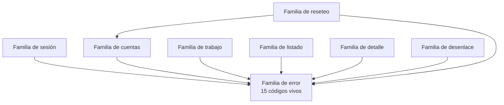

# Arquitectura técnica — GeometriaFactory-Contracts

**Producto:** Fábrica de Geometría
**Proyecto de código:** GeometriaFactory-Contracts
**Documento:** Arquitectura-Proyecto-Codigo.md
**Versión:** 1.1
**Estado:** Aprobado
**Fecha:** 2026-08-10
**Autor:** Arquitecto de Software Senior + API Designer (AG-05)
**Tipo de proyecto de código (D8):** `library`
**Trazabilidad upstream:** `PRODUCT-INTAKE-Fabrica-De-Geometria.md` **1.15** §4 y §4.1 (las **dieciséis** reglas `RN-01` a `RN-16`), §4.2 (modelo de estados del trabajo), §13 y §14 (composición y las tres reglas de arquitectura `RA-01`, `RA-02`, `RA-03`), §17.4 completo (P.1 a P.12), §17.5 P.3 y P.5 (qué existe del otro lado del contrato); `PRODUCT-MANIFEST-Fabrica-De-Geometria.md` **1.2** §2, §3 y §5; [`../02-Especificacion-Funcional/Especificacion-Funcional.md`](../02-Especificacion-Funcional/Especificacion-Funcional.md) y los ocho contratos de uso de [`../02-Especificacion-Funcional/Casos-De-Uso/`](../02-Especificacion-Funcional/Casos-De-Uso/); [`../03-UX-UI-DX/DX-Error-Messages.md`](../03-UX-UI-DX/DX-Error-Messages.md) y [`../03-UX-UI-DX/README.md`](../03-UX-UI-DX/README.md)
**Trazabilidad downstream:** `06-Backlog-Tecnico`, `08-Calidad-Y-Pruebas`, `09-Devops` y `11-Documentacion` de GeometriaFactory-Contracts

---

## Tabla de contenido

- [1. Objetivo](#1-objetivo)
- [2. Estilo arquitectónico](#2-estilo-arquitectónico)
  - [2.1 Alternativas descartadas](#21-alternativas-descartadas)
- [3. Vista lógica](#3-vista-lógica)
  - [3.1 Componentes](#31-componentes)
  - [3.2 La regla de exposición](#32-la-regla-de-exposición)
  - [3.3 Cobertura de los ocho contratos de uso](#33-cobertura-de-los-ocho-contratos-de-uso)
- [4. Vista de procesos](#4-vista-de-procesos)
- [5. Vista de despliegue](#5-vista-de-despliegue)
- [6. Vista de datos](#6-vista-de-datos)
- [7. Cross-cutting concerns](#7-cross-cutting-concerns)
- [8. Quality attributes (NFR)](#8-quality-attributes-nfr)
- [9. Riesgos arquitectónicos](#9-riesgos-arquitectónicos)
- [10. Trazabilidad](#10-trazabilidad)
  - [10.1 Componente contra contrato de uso](#101-componente-contra-contrato-de-uso)
  - [10.2 Las once restricciones transversales contra la decisión que las sostiene](#102-las-once-restricciones-transversales-contra-la-decisión-que-las-sostiene)
  - [10.3 Las dieciséis reglas contra este proyecto de código](#103-las-dieciséis-reglas-contra-este-proyecto-de-código)
- [11. Puntos abiertos](#11-puntos-abiertos)
- [12. Control de cambios](#12-control-de-cambios)

---

## 1. Objetivo

Documenta la arquitectura interna de `GeometriaFactory-Contracts`, el ensamblado de tipos que viajan entre las dos unidades desplegables del producto: qué familias de tipos tiene, qué decide y, sobre todo, **qué no puede cruzar la frontera**. Se dirige a quien implementa el ensamblado y a las categorías 06, 08 y 09.

Este proyecto de código es atípico en una cosa que conviene decir antes que nada: **no tiene comportamiento**. Son tipos de transferencia planos (`PRODUCT-INTAKE` §17.4.P.2). Su arquitectura no es una arquitectura de ejecución sino **una arquitectura de exposición**: lo que se decide acá es la forma de la frontera y la lista cerrada de lo que la atraviesa.

## 2. Estilo arquitectónico

**Estilo elegido: ensamblado compartido de tipos de transferencia planos, sin comportamiento y sin dependencias, con un único tipo de error transversal.** Lo registra [`ADR-01`](Adrs/ADR-01-Tipos-De-Transferencia-Planos-Sin-Dependencias.md).

Cuatro propiedades estructurales lo concretan:

1. **Cero dependencias, y en particular ninguna hacia `GeometriaFactory-Domain`.** El intake declara esa ausencia como **quality gate bloqueante** (§17.4.P.8), y es lo que impide que la unidad pública conozca las entidades del dominio.
2. **Compilación compartida en lugar de descripción formal de servicio.** Los dos consumidores compilan contra el mismo ensamblado, de modo que un cambio incompatible rompe la compilación antes que el tiempo de ejecución ([`ADR-03`](Adrs/ADR-03-Versionado-Por-Compilacion-Compartida.md)).
3. **Un solo tipo de error para las ocho familias**, con un conjunto cerrado de **quince** códigos vivos ([`ADR-02`](Adrs/ADR-02-Tipo-De-Error-Unico-Con-Conjunto-Cerrado.md)).
4. **Proyección de listado separada del detalle**, que es lo que evita que el listado arrastre el texto completo de cada trabajo ([`ADR-05`](Adrs/ADR-05-Proyeccion-De-Listado-Separada-Del-Detalle.md)).

### 2.1 Alternativas descartadas

Las dos primeras las descarta el intake; la tercera la evalúa y la descarta esta categoría.

| Alternativa | A favor | En contra | Resolución |
| --- | --- | --- | --- |
| Compartir las entidades de dominio entre las dos unidades desplegables | Un solo juego de tipos, cero duplicación | Acopla la unidad pública a cambios internos del dominio y **filtra al navegador campos que no le corresponden**, empezando por la credencial derivada | **Descartada** por `PRODUCT-INTAKE` §17.4.P.2 |
| Generar el cliente desde una descripción formal del servicio | Contrato explícito y verificable por herramienta; clientes generados | Costo de cadena de herramientas frente a un contrato que consumen **dos** proyectos de código de la misma solución, compilados juntos | **Descartada** por `PRODUCT-INTAKE` §17.4.P.2 |
| Un tipo de error por familia de tipos | Cada familia declararía exactamente sus condiciones | Multiplica por ocho los lugares donde se puede filtrar una dirección de servicio, que es exactamente lo que RA-03 evita; y obligaría a la unidad pública a ocho tratamientos distintos del mismo trabajo | **Descartada** por esta categoría, ver [`ADR-02`](Adrs/ADR-02-Tipo-De-Error-Unico-Con-Conjunto-Cerrado.md) §4 |

## 3. Vista lógica

### 3.1 Componentes

Un componente es acá una **familia de tipos de transferencia**, que es la unidad con la que un cambio incompatible se propaga y el criterio de recorte que la categoría 02 usó para sus ocho contratos de uso.

| Componente | Responsabilidad | Entradas | Salidas | Dependencias |
| --- | --- | --- | --- | --- |
| Familia de sesión | Transportar el canje de credenciales y la respuesta de sesión | Correo y contraseña presentada | Respuesta de sesión con cuatro campos y ninguno más | Familia de error |
| Familia de cuentas | Transportar el registro, el listado de cuentas, el cambio de situación, la confirmación escrita de la baja y el cambio de contraseña | Datos de la cuenta y la operación pretendida | Resultado de la operación sobre la cuenta | Familia de error |
| Familia de trabajo | Transportar el envío, la eliminación y el estado del trabajo, con el texto original como cadena no interpretada | Nombre, fecha, descripción y texto original | Estado resultante y observaciones | Familia de error |
| Familia de listado | Transportar la **proyección** de trabajos, con alcance distinto según el papel | Filtros de alumno y de estado | Colección de proyecciones, sin texto original, sin componentes y sin comentario | Familia de error |
| Familia de detalle | Transportar el trabajo interpretado: piezas, componentes, observaciones y el comentario del administrador como bloque propio | Identificador del trabajo | Detalle completo del trabajo | Familia de error |
| Familia de desenlace | Transportar la aprobación o el rechazo, con comentario opcional | Identificador y desenlace pretendido | Estado terminal alcanzado | Familia de error |
| Familia de reseteo | Transportar el reseteo por el administrador y el cambio obligatorio por la propia cuenta | Identificador de cuenta, y nada más, en el reseteo | Resultado que declara la situación conservada, el cambio pendiente y la provisoria producida | Familia de error, Familia de cuentas |
| Familia de error | Declarar el **único** tipo con el que un fallo cruza la frontera, y el conjunto cerrado de quince códigos | Código, texto neutro, detalles de ubicación y momento | El mismo tipo, para las siete familias anteriores | Ninguna |

**Las dependencias apuntan todas hacia la familia de error, que no depende de ninguna.** La única arista adicional es la de reseteo hacia cuentas, y tiene motivo declarado: el cambio obligatorio de contraseña **reutiliza el mismo tipo** que el cambio voluntario, en lugar de redeclararlo ([`../02-Especificacion-Funcional/Especificacion-Funcional.md`](../02-Especificacion-Funcional/Especificacion-Funcional.md) §3.1). El grafo es acíclico.

### 3.2 La regla de exposición

Es la decisión central del proyecto de código, y por eso vive en la vista lógica y no enterrada en cross-cutting: **qué se expone y qué no**. `PRODUCT-INTAKE` §17.4.P.5 la declara y [`ADR-04`](Adrs/ADR-04-Regla-De-Exposicion-De-La-Frontera.md) la registra.

| Nunca cruza la frontera | Fundamento |
| --- | --- |
| El hash de la contraseña, en ninguna de sus formas | `PRODUCT-INTAKE` §17.4.P.5 |
| La clave de firma | `PRODUCT-INTAKE` §17.4.P.5 |
| Cualquier dirección de servicio interno, en un campo o dentro de un texto | RA-03, `PRODUCT-INTAKE` §14 y §17.4.P.5 |
| Rutas de archivos de datos y trazas de la implementación | Postcondición de [`../02-Especificacion-Funcional/Casos-De-Uso/CU-06-Contrato-De-Respuesta-De-Error.md`](../02-Especificacion-Funcional/Casos-De-Uso/CU-06-Contrato-De-Respuesta-De-Error.md) §7 |
| Ninguna condición que impida operar, como campo de la respuesta de sesión | Restricción transversal `RT-10` de la categoría 02: las tres viajan como respuesta de error con código propio |

**Y una prohibición de forma, no de contenido**: ningún tipo de este ensamblado habilita a que el navegador invoque el servicio de datos. Todas las solicitudes las arma el servidor de la unidad pública y viajan servidor a servidor, **incluidas las que llevan credenciales en claro** —canje, cambio y reseteo—. Es `RA-01`, y la categoría 02 lo declara como `RT-11`.

### 3.3 Cobertura de los ocho contratos de uso

| Componente | Contrato de uso que cubre |
| --- | --- |
| Familia de sesión | CU-01 |
| Familia de cuentas | CU-02 |
| Familia de trabajo | CU-03 |
| Familia de listado | CU-04 |
| Familia de detalle | CU-05 |
| Familia de error | CU-06, y transversalmente los otros siete |
| Familia de desenlace | CU-07 |
| Familia de reseteo | CU-08 |

Los ocho contratos de uso tienen componente y ningún componente queda sin contrato de uso.

## 4. Vista de procesos

- **Sin proceso, sin hilos y sin estado.** Los tipos se cargan en los dos procesos desplegables del producto y no ejecutan nada: no hay concurrencia que gobernar.
- **Sin transacciones ni límite de consistencia.** Un tipo de transferencia no participa de ninguna unidad de trabajo.
- **Serialización.** El ensamblado **no declara ninguna biblioteca de serialización** —eso rompería las cero dependencias— y no impone formato: la elección del formato de intercambio y de su configuración le corresponde a `GeometriaFactory-Api` y a `GeometriaFactory-Web`. Lo que este proyecto de código sí impone es que **los tipos sean serializables sin comportamiento**: sin lógica en los descriptores de acceso, sin campos calculados y sin ciclos entre tipos.
- **Sin fallo silencioso posible en la frontera.** El código `CONTRATO_ERROR_NO_CLASIFICADO` cierra el conjunto: no hay camino por el que un fallo llegue a la persona sin representación en el contrato.

## 5. Vista de despliegue

| Aspecto | Decisión |
| --- | --- |
| Unidad de despliegue | Ninguna propia. **Se carga en los dos procesos**: el del hosting público y el del servidor propio (`PRODUCT-INTAKE` §17.4.P.9) |
| Runtime objetivo | La plataforma común declarada para los seis proyectos de código no visores, sin sufijo de plataforma, sobre el sistema operativo del contenedor y del servidor |
| Dependencias de infraestructura | Ninguna |
| Etapas del pipeline | `restore` → `build`. **No hay etapa de `test`**, y es correcto: el intake declara que este proyecto de código no tiene pruebas propias y se ejercita íntegramente desde las pruebas de integración que golpean el servicio real (§17.4.P.6) |
| Puertas bloqueantes | Compila **sin advertencias** y **sin ninguna referencia hacia `GeometriaFactory-Domain`**; una referencia de ese tipo se rechaza en revisión (`PRODUCT-INTAKE` §17.4.P.8) |
| Orden de despliegue | Un cambio incompatible obliga al **despliegue conjunto** de las dos unidades desplegables (`PRODUCT-INTAKE` §17.4.P.3) |
| Publicación | No se publica en ningún repositorio de paquetes: `redistribuible` es false |

## 6. Vista de datos

- **Sin persistencia.** El flag `tiene_persistencia` es false y el intake declara «no aplica» en §17.4.P.4. Por eso **`Modelo-Datos-Logico.md` se omite**.
- **Sin caché.** Un tipo de transferencia no cachea: si la unidad pública decide cachear una respuesta, esa decisión es suya y no del contrato.
- **La forma de los datos sí es una decisión de esta sección**, y tiene dos concreciones que aguas abajo no se pueden invertir:
  - **El texto original del trabajo viaja como cadena, sin interpretarse** (`PRODUCT-INTAKE` §17.4.P.11 punto 2). La interpretación es del backend y el dibujo, del bundle del visor.
  - **La proyección de listado no incluye el texto original, ni los componentes de las piezas, ni el comentario del administrador** ([`ADR-05`](Adrs/ADR-05-Proyeccion-De-Listado-Separada-Del-Detalle.md)).
- **El comentario del administrador viaja en el detalle como bloque propio y nunca como elemento de la colección de observaciones**: no comparten ni un campo. Es la restricción transversal `RT-09` de la categoría 02.

## 7. Cross-cutting concerns

| Preocupación | Decisión | Fundamento |
| --- | --- | --- |
| Manejo de errores | **Un único tipo de error** con cuatro campos —código, texto neutro, colección de detalles de ubicación y momento— y un conjunto cerrado de **quince** códigos vivos sobre **dieciocho** identificadores emitidos | [`ADR-02`](Adrs/ADR-02-Tipo-De-Error-Unico-Con-Conjunto-Cerrado.md) |
| Registro de eventos, trazas y métricas | **Ninguno propio.** El ensamblado no instrumenta. La correlación entre las dos unidades desplegables, si se decide, es de `GeometriaFactory-Api` y de `GeometriaFactory-Web` | `PRODUCT-INTAKE` §17.4.P.10 no declara observabilidad propia |
| Configuración | **Ninguna.** El ensamblado no lee configuración | Derivado de §17.4.P.2, tipos planos sin comportamiento |
| Secretos | **Ninguno, y es prohibición explícita**: ningún tipo transporta el hash de la contraseña ni la clave de firma | [`ADR-04`](Adrs/ADR-04-Regla-De-Exposicion-De-La-Frontera.md) |
| Vocabulario | `Pendiente` se escribe **siempre calificado** —«cuenta `Pendiente`» o «trabajo en estado `Pendiente`»—, porque los dos sentidos cruzan este mismo contrato. «Contrato» tiene tres referentes en la cadena y se escribe siempre en la forma que su glosario fija | `PRODUCT-INTAKE` §4.2; [`../02-Especificacion-Funcional/Glosario-Funcional.md`](../02-Especificacion-Funcional/Glosario-Funcional.md) |
| Momento | El tipo de error lleva un campo de momento. **Su zona horaria y su precisión no se deciden acá**: las fija quien lo produce | Punto abierto PA-02 de §11 |

## 8. Quality attributes (NFR)

El primero y el segundo vienen rotulados **[ASUNCIÓN]** desde `PRODUCT-INTAKE` §17.4.P.6 y §17.4.P.10, con confirmación pendiente en §22 del intake. Los demás los deriva esta categoría.

| NFR | Objetivo numérico | Mecanismo de medición | ADR relacionada |
| --- | --- | --- | --- |
| Tipos ejercitados por prueba de integración | **100 %** de los tipos de transferencia, con al menos una prueba cada uno [ASUNCIÓN del intake] | Matriz tipo contra prueba en 08, sobre la batería de integración que golpea el servicio real | [`ADR-03`](Adrs/ADR-03-Versionado-Por-Compilacion-Compartida.md) |
| Carga útil del listado | **0** ocurrencias del texto original, **0** de componentes de pieza y **0** del comentario del administrador en la proyección de listado [ASUNCIÓN derivada del intake §17.4.P.10] | Inspección de la superficie pública de la familia de listado | [`ADR-05`](Adrs/ADR-05-Proyeccion-De-Listado-Separada-Del-Detalle.md) |
| Referencias hacia `GeometriaFactory-Domain` | Exactamente **0** | Inspección del archivo de proyecto, puerta bloqueante de construcción | [`ADR-01`](Adrs/ADR-01-Tipos-De-Transferencia-Planos-Sin-Dependencias.md) |
| Campos capaces de transportar una dirección de servicio, una ruta de datos o un secreto | Exactamente **0** en los tipos de las ocho familias | Prueba de inspección de superficie pública, que es CA-01 de CU-06 | [`ADR-04`](Adrs/ADR-04-Regla-De-Exposicion-De-La-Frontera.md) |
| Códigos de error del conjunto cerrado | Exactamente **15** vivos, y **0** códigos producidos fuera del conjunto | Prueba de inspección del conjunto cerrado, que es CA-09 de CU-06 | [`ADR-02`](Adrs/ADR-02-Tipo-De-Error-Unico-Con-Conjunto-Cerrado.md) |
| Campos de la respuesta de sesión | Exactamente **4**, y **0** que transporten una condición que impida operar | Inspección de la superficie pública, restricción transversal `RT-10` | [`ADR-04`](Adrs/ADR-04-Regla-De-Exposicion-De-La-Frontera.md) |
| Advertencias de construcción | Exactamente **0** | Etapa de `build` del pipeline, bloqueante para fusionar | [`ADR-03`](Adrs/ADR-03-Versionado-Por-Compilacion-Compartida.md) |

**No hay NFR de latencia ni de throughput**, y es correcto: el ensamblado no ejecuta nada. El único atributo de rendimiento que este proyecto de código puede empeorar es el **tamaño de la carga útil**, y por eso la segunda fila es la que hay que mirar.

## 9. Riesgos arquitectónicos

| Riesgo | Impacto | Probabilidad | Mitigación |
| --- | --- | --- | --- |
| Que aparezca una referencia hacia `GeometriaFactory-Domain` y el acoplamiento vuelva por esa vía | Alto: la unidad pública pasaría a conocer las entidades y podría filtrar campos que no le corresponden | Media: el intake la nombra como «la vía por la que el acoplamiento vuelve» | Puerta bloqueante de construcción y rechazo en revisión (`PRODUCT-INTAKE` §17.4.P.8) |
| Que un campo nuevo de un tipo transporte una dirección de servicio o una traza, sin que nadie lo note porque compila | Alto: viola RA-03 y expone la topología del producto | Media: es la forma habitual en que este defecto entra, agregando un campo de diagnóstico | Prueba de inspección de superficie pública (CA-01 de CU-06) y cláusula de rechazo de §17 de ese contrato de uso |
| Que el listado incorpore un campo del detalle «porque hace falta en una pantalla» | Medio: el listado del administrador arrastraría el texto completo de cada trabajo | Alta: es la presión natural de la capa de presentación | NFR de carga útil del listado (§8) y [`ADR-05`](Adrs/ADR-05-Proyeccion-De-Listado-Separada-Del-Detalle.md), que declara que la proyección existe precisamente para **no** ser el detalle |
| Que un identificador de código retirado se recicle para otra condición | Medio: un consumidor viejo lo interpretaría con la causa anterior | Baja, pero con precedente cercano: ya hay **tres** identificadores retirados | Regla explícita de no reciclado en [`ADR-02`](Adrs/ADR-02-Tipo-De-Error-Unico-Con-Conjunto-Cerrado.md) §7 y CA-09 de CU-06 |
| Que una de las dos unidades desplegables se despliegue sin la otra tras un cambio incompatible | Alto: el contrato deja de ser el mismo de los dos lados | Media | Regla operativa de despliegue conjunto (`PRODUCT-INTAKE` §17.4.P.3), que 09 tiene que materializar |
| Que aparezca un tipo pensado para que el navegador invoque el servicio de datos | Alto: reabre contenido mixto, restricción de origen cruzado y exposición de la dirección del servidor propio | Baja | `RT-11` de la categoría 02 y [`ADR-04`](Adrs/ADR-04-Regla-De-Exposicion-De-La-Frontera.md), que declaran que **todas** las solicitudes las arma el servidor de la unidad pública |

## 10. Trazabilidad

### 10.1 Componente contra contrato de uso

| Dimensión | Referencia |
| --- | --- |
| CU cubiertos | CU-01 a CU-08, los ocho de [`../02-Especificacion-Funcional/Especificacion-Funcional.md`](../02-Especificacion-Funcional/Especificacion-Funcional.md) §3 |
| RN aplicables | Ninguna propia: este proyecto de código no las redacta. Las refiere por identificador a `GeometriaFactory-Domain`, ver §10.3 |
| ADRs que lo gobiernan | ADR-01, ADR-02, ADR-03, ADR-04, ADR-05 |
| Contratos que expone | [`Contratos-Abstractions.md`](Contratos-Abstractions.md) |
| Tests previstos en 08 | Pruebas de integración que golpean el servicio real, una por tipo como mínimo; prueba de inspección de superficie pública para los campos prohibidos; prueba de inspección del conjunto cerrado de quince códigos |

### 10.2 Las once restricciones transversales contra la decisión que las sostiene

Las once filas están, `RT-01` a `RT-11`, sin agrupar. Son las de [`../02-Especificacion-Funcional/Especificacion-Funcional.md`](../02-Especificacion-Funcional/Especificacion-Funcional.md) §6, y esta tabla declara qué decisión de arquitectura las materializa.

| Restricción | Qué exige, en una línea | ADR que la materializa |
| --- | --- | --- |
| RT-01 | Ningún tipo lleva hash de contraseña, clave de firma ni dirección de servicio interno | ADR-04 |
| RT-02 | La respuesta de error lleva texto neutro y, cuando corresponde, índice de figura y campo | ADR-02, ADR-04 |
| RT-03 | El texto original del trabajo viaja como cadena, sin interpretarse | ADR-01 |
| RT-04 | La proyección de listado no lleva texto original, ni componentes, ni comentario | ADR-05 |
| RT-05 | El ensamblado no declara ninguna referencia hacia `GeometriaFactory-Domain` | ADR-01 |
| RT-06 | Un cambio incompatible obliga al despliegue conjunto de las dos unidades | ADR-03 |
| RT-07 | Sin pruebas propias: el gate equivalente es el 100 % de tipos ejercitados por integración | ADR-03 |
| RT-08 | Cuatro estados del trabajo, dos terminales, y ningún tipo que permita salir de ellos | ADR-01 |
| RT-09 | El comentario viaja como bloque propio y nunca como observación | ADR-05 |
| RT-10 | Ninguna condición que impida operar viaja como campo de la respuesta de sesión | ADR-02, ADR-04 |
| RT-11 | Ningún tipo habilita a que el navegador invoque el servicio de datos | ADR-04 |

### 10.3 Las dieciséis reglas contra este proyecto de código

Este proyecto de código **no redacta ninguna regla de negocio**: es el caso que la regla de la categoría 02 nombra como proyecto de código sin estado ni invariantes. Lo que sí hace es **transportar** los datos sobre los que las reglas se ejercen, y la tabla declara cuál transporta cada una. Las dieciséis filas están; ninguna se agrupa.

| Regla | Qué transporta este proyecto de código de ella | Contrato de uso |
| --- | --- | --- |
| RN-01 Administrador único | El rechazo de configurar un segundo administrador, con código propio | CU-02 |
| RN-02 Correo único | El rechazo del registro con correo ya usado, con código propio | CU-02 |
| RN-03 Trabajo ajeno indistinguible de inexistente | Un solo código y un solo texto para los dos casos: nada permite distinguirlos | CU-03, CU-05 |
| RN-04 Eliminación acotada | La solicitud **única** de eliminación para los dos papeles, y el rechazo por estado en el camino del alumno | CU-03 |
| RN-05 Sin errores de validación no hay estado `Pendiente` | El estado resultante del envío y las observaciones con su especie | CU-03, CU-05 |
| RN-06 Cuenta `Pendiente` o `Bloqueado` sin acceso | El motivo de la situación de la cuenta, como respuesta de error y no como campo de sesión | CU-01 |
| RN-07 Baja con arrastre y confirmación escrita | La confirmación escrita como campo de la solicitud, y su rechazo si no coincide | CU-02 |
| RN-08 Texto original íntegro | El texto como cadena no interpretada, en las dos direcciones | CU-03, CU-05 |
| RN-09 Observación con posición y campo | El índice de figura y el campo señalado en la observación del detalle | CU-05 |
| RN-10 Desenlace exclusivo y terminal | El desenlace como conjunto cerrado de dos valores, el estado terminal, y dos códigos de rechazo propios | CU-07 |
| RN-11 El administrador no ve los borradores | El alcance del listado según el papel, y la causa ampliada del código de no encontrado | CU-04, CU-06 |
| RN-12 El reseteo conserva la cuenta y sus trabajos | Un resultado que **no declara ningún campo por el que los trabajos se pierdan** | CU-08 |
| RN-13 Cambio forzado antes de toda otra capacidad | Un **solo** código para todas las operaciones bloqueadas | CU-06, CU-08 |
| RN-14 La provisoria la produce el sistema | Una solicitud de reseteo **sin campo de contraseña**, y un resultado que lleva la provisoria producida | CU-08 |
| RN-15 Resetear no exige cuenta habilitada | La **ausencia** de un código por cuenta no habilitada: esa causa no existe y no recibe código | CU-06, CU-08 |
| RN-16 Habilitar produce la provisoria | El mismo código para los **dos orígenes** de la marca, y la ausencia de todo tipo de establecimiento anónimo de contraseña | CU-02, CU-06, CU-08 |

## 11. Puntos abiertos

| Id | Punto abierto | Quién lo cierra | Cuándo |
| --- | --- | --- | --- |
| PA-01 | Los **nombres definitivos de los tipos, de sus campos y de los espacios de nombres**. El intake no los fija y la categoría 02 tampoco: se anclan en la etapa que implementa el contrato | El equipo en el punto de control de la etapa correspondiente | Etapa `c` en adelante, según la familia |
| PA-02 | La **zona horaria y la precisión del campo de momento** del tipo de error. Ninguna fuente las declara | El equipo, junto con la elección de formato de intercambio | Etapa `a` o `c` |
| PA-03 | **RESUELTO.** El **formato de intercambio y su configuración** —cómo se nombran los campos al serializar, qué se hace con los valores ausentes— se reasignó a las categorías 05 de `GeometriaFactory-Api` y de `GeometriaFactory-Web`. **Las dos están emitidas**, y la decisión está tomada: [`Web`](../../GeometriaFactory-Web/05-Arquitectura-Tecnica/Arquitectura-Proyecto-Codigo.md) §11 `PA-03` declaró que **no la toma de un solo lado** —«los dos extremos tienen que coincidir o el contrato deja de ser el mismo»— y que la decisión pertenece al **productor**, que él **adopta**; y [`Api ADR-02`](../../GeometriaFactory-Api/05-Arquitectura-Tecnica/Adrs/ADR-02-Formato-De-Intercambio-Y-Su-Configuracion.md) la tomó, con **seis** reglas de formato que **obligan a los dos extremos** y con la verificación por la batería de integración que golpea el servicio real. **Lo que este proyecto de código exigía —que sus tipos sean serializables sin comportamiento— sigue valiendo y no cambia** | **Cerrado** por la categoría 05 de `GeometriaFactory-Api`, con `GeometriaFactory-Web` como consumidor | **Resuelto** el 2026-08-10, al emitirse las dos categorías 05 |
| PA-04 | Los dos valores rotulados **[ASUNCIÓN]** de §8 siguen pendientes de confirmación del Product Owner en `PRODUCT-INTAKE` §22 | El Product Owner sobre su propio documento | Antes de fijar la puerta en 09 |

**Cuatro filas: tres abiertas —`PA-01`, `PA-02` y `PA-04`— y una resuelta, `PA-03`.** La fila resuelta **se conserva en la tabla en lugar de retirarse**, porque retirarla dejaría un hueco de numeración sin declarar y porque su desenlace es una decisión que otros dos proyectos de código citan.

## 12. Control de cambios

| Versión | Fecha | Descripción |
| --- | --- | --- |
| 1.0 | 2026-08-10 | Emisión inicial de la arquitectura técnica de `GeometriaFactory-Contracts`. Declara el estilo con sus tres alternativas evaluadas, las ocho familias de tipos como componentes con su grafo acíclico, la regla de exposición en la vista lógica, las cuatro vistas mínimas, los cross-cutting centralizados, siete NFR con objetivo numérico, seis riesgos con mitigación, la trazabilidad de las once restricciones transversales y de las dieciséis reglas, y cuatro puntos abiertos. Emite cinco ADR individuales bajo `Adrs/` y el contrato de superficie pública en `Contratos-Abstractions.md`. |
| 1.1 | 2026-08-11 | **Corrige una afirmación de §11 que dejó de ser cierta y cierra el punto abierto que la contenía.** La fila `PA-03` declaraba que el formato de intercambio pertenece a las categorías 05 de `GeometriaFactory-Api` y de `GeometriaFactory-Web` y que **«ninguna de las dos está emitida todavía»**. **Hoy las dos lo están** —y con ellas las **siete** categorías 05 del producto—, y además **la decisión está tomada**: `GeometriaFactory-Web` §11 `PA-03` declaró que no la toma de un solo lado y que la adopta del productor, y `Api ADR-02` la tomó con seis reglas de formato que obligan a los dos extremos, con la coincidencia verificada por la batería de integración contra el servicio real. `PA-03` pasa a **fila resuelta**, con su desenlace, sus dos referencias y su fecha, y **se conserva en la tabla en lugar de retirarse** para no dejar un hueco de numeración sin declarar; §11 gana la línea de reparto **tres abiertas y una resuelta**. **Lo que este proyecto de código exigía sigue valiendo y no cambia**: que sus tipos sean serializables sin comportamiento. **Ninguna decisión de arquitectura, ninguna ADR, ningún NFR, ningún riesgo, ninguna restricción transversal y ningún otro punto abierto cambia.** Sube minor. |
