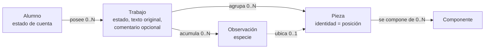
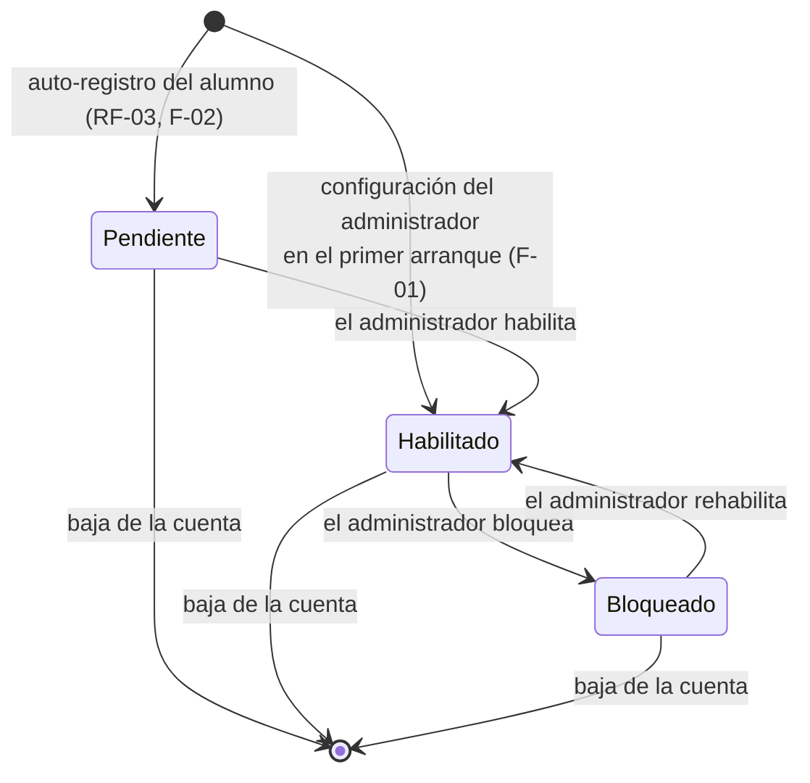
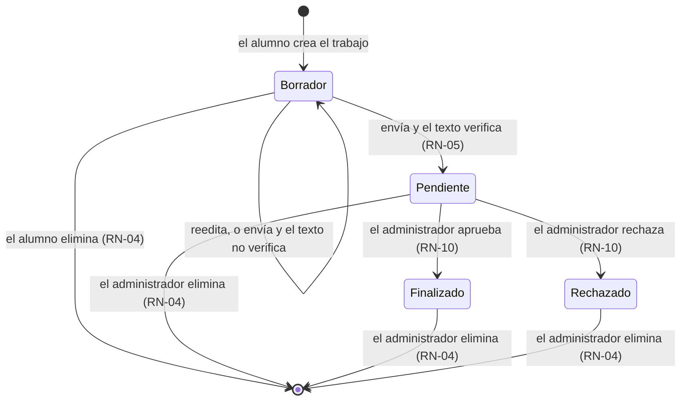

> **Artefacto archivado — estado `Superado`**
>
> Copia archivada de `Definicion-Modelo-De-Dominio.md` en su versión **1.2**, tomada el 2026-08-09 por el orquestador SDD **antes** de despachar la corrección, según `Master-Prompt.md` §8.
>
> - **Estado:** `Superado`
> - **Versión que preserva:** 1.2
> - **Fecha de archivado:** 2026-08-09
> - **Versión vigente:** [`Definicion-Modelo-De-Dominio.md`](../../Definicion-Modelo-De-Dominio.md)
>
> El cuerpo que sigue **no se modifica**. Este archivo no se renombra, no se reenlaza y no vuelve a tocarse.

---

# Definición del modelo de dominio

**Producto:** Fábrica de Geometría
**Proyecto de código:** GeometriaFactory-Domain
**Documento:** Definicion-Modelo-De-Dominio.md
**Versión:** 1.2
**Estado:** Propuesto
**Fecha:** 2026-08-09
**Autor:** Analista Funcional + API Designer (AG-02)
**Trazabilidad upstream:** `PRODUCT-INTAKE-Fabrica-De-Geometria.md` §4 (capacidades **F-01**, F-02, F-07, F-08, F-12, F-21, F-22, F-23 y F-24), §15 (etapa `c`), §4.1 (las once reglas de negocio con su enunciado), §4.2 (modelo de estados del trabajo y sus tres consecuencias aceptadas), §17.1.P.1, §17.1.P.2 (los siete invariantes con su enunciado), §17.1.P.3, §17.1.P.4, §17.1.P.5, §17.1.P.11, §14 (contratos entre proyectos de código), §6 (flujos 2 y 2.1), §7 (casos límite), §20 (escenarios E-1 a E-7); `00-Contexto/Vision-Producto.md` §9; `00-Contexto/Alcance-Producto.md` §4.1 y §5; `01-Necesidades-Negocio/Necesidades-Negocio.md` §2
**Trazabilidad downstream:** `05-Arquitectura-Tecnica` y `06-Backlog-Tecnico` de GeometriaFactory-Domain; `08-Calidad-Y-Pruebas`

---

## Tabla de contenido

- [1. Qué es este documento y qué no es](#1-qué-es-este-documento-y-qué-no-es)
- [2. Las cinco entidades del dominio](#2-las-cinco-entidades-del-dominio)
  - [2.1 Alumno](#21-alumno)
  - [2.2 Trabajo](#22-trabajo)
  - [2.3 Pieza](#23-pieza)
  - [2.4 Componente](#24-componente)
  - [2.5 Observación](#25-observación)
- [3. Relaciones y cardinalidades](#3-relaciones-y-cardinalidades)
- [4. Invariantes del dominio](#4-invariantes-del-dominio)
  - [4.1 Los siete invariantes](#41-los-siete-invariantes)
  - [4.2 Invariante candidato, propuesto y no adoptado](#42-invariante-candidato-propuesto-y-no-adoptado)
  - [4.3 Correspondencia con las once reglas de negocio](#43-correspondencia-con-las-once-reglas-de-negocio)
- [5. Transiciones de estado](#5-transiciones-de-estado)
  - [5.1 Estado de la cuenta del alumno](#51-estado-de-la-cuenta-del-alumno)
  - [5.2 Estado del trabajo](#52-estado-del-trabajo)
- [6. Semántica derivada y semántica guardada](#6-semántica-derivada-y-semántica-guardada)
- [7. Fronteras del dominio](#7-fronteras-del-dominio)
- [8. Referencia al glosario](#8-referencia-al-glosario)
- [9. Trazabilidad](#9-trazabilidad)
- [10. Control de cambios](#10-control-de-cambios)

---

## 1. Qué es este documento y qué no es

Este es el documento de concepto central de `GeometriaFactory-Domain`. Fija el vocabulario, la semántica y los elementos del modelo de dominio del producto: qué entidades existen, qué significa cada atributo, qué invariantes se sostienen siempre y qué transiciones de estado son admisibles.

**No es un modelo de persistencia.** Este proyecto de código no conoce el motor de datos, ni el protocolo de transporte, ni ninguna biblioteca de serialización: no tiene dependencias (PRODUCT-INTAKE §17.1.P.1) y su persistencia está declarada como «no aplica» (§17.1.P.4). El modelo de datos que refleja a estas entidades lo materializa `GeometriaFactory-Infrastructure`, y por eso `Modelo-Datos/Modelo-Conceptual.md` queda omitido en esta sección, según la regla de inclusión por tipo D8 `library` y el flag `tiene_persistencia` == false.

Tampoco fija nombres de tipos ni de espacios de nombres: el intake declara que quedan abiertos y se validan en el punto de control de la etapa `a` (§17.1.P.11). Acá los conceptos se nombran en lenguaje de dominio.

El estilo del modelo está decidido aguas arriba y no se rediscute: entidades con invariantes explícitas, con el modelo anémico y las entidades del proveedor de persistencia descartados como alternativas (§17.1.P.2).

## 2. Las cinco entidades del dominio

Las cinco entidades son las que el intake declara para este proyecto de código: Alumno, Trabajo, Pieza, Componente y Observación (§13, rol de `GeometriaFactory-Domain`).

### 2.1 Alumno

Persona de la comisión que obtiene identidad propia dentro del laboratorio y a la que pertenecen trabajos. El administrador del laboratorio es la cuenta única de la instancia y no es un alumno; el dominio lo distingue por su papel, no por una jerarquía de permisos configurables.

| Atributo | Semántica | Restricción conceptual |
| --- | --- | --- |
| Identificador | Identidad propia del alumno dentro de la instancia | Presente desde el alta; no se reutiliza |
| Correo | Dato con el que la persona se registra y con el que después se identifica al ingresar | Obligatorio y **único en todo el sistema** (INV-01, RN-02). Es además el texto que el administrador debe escribir para confirmar una baja (RN-07) |
| Nombre | Nombre de pila declarado en el registro | Obligatorio |
| Apellido | Apellido declarado en el registro | Obligatorio |
| Papel | `Alumno` o `Administrador`. Son dos papeles fijos, sin permisos configurables | Conjunto cerrado (RN-01, INV-05) |
| Estado de cuenta | `Pendiente`, `Habilitado` o `Bloqueado` | Conjunto cerrado. **El valor inicial depende del camino de alta**: `Pendiente` en el auto-registro del alumno y `Habilitado` en la configuración del administrador (§5.1) |
| Credencial derivada | Valor derivado de la contraseña, que el dominio recibe ya derivado y nunca en claro | En el auto-registro, sin valor hasta el primer ingreso efectivo, y sólo se fija estando `Habilitado`. En la configuración del administrador **nace con valor**, porque ese acto incluye su contraseña |
| Fecha de alta | Momento en que la cuenta se constituyó | La provee el consumidor: el dominio no lee el reloj |

**Ejemplo de instancia.** Una alumna se registra con su correo, su nombre y su apellido y no elige contraseña: queda con papel `Alumno`, cuenta `Pendiente`, credencial derivada sin valor y ningún trabajo (PRODUCT-INTAKE §6, flujo 1).

**Segundo ejemplo, el del otro camino.** En el primer arranque de la instancia, el docente configura su cuenta con su correo, su nombre, su apellido y su contraseña: queda con papel `Administrador`, cuenta **`Habilitado`**, credencial derivada con valor y ningún trabajo, y entra en el acto (PRODUCT-INTAKE §4, F-01, y §15, etapa `c`).

### 2.2 Trabajo

Unidad que el alumno carga y entrega en el laboratorio: nombre, fecha, descripción y el texto que produjo su Actividad 1. Tiene identificador propio, dueño y estado. No es una unidad de entrega en el sentido normativo del framework: es un registro de datos y no se despliega (`Vision-Producto.md` §9.1 y §9.3).

| Atributo | Semántica | Restricción conceptual |
| --- | --- | --- |
| Identificador | Identidad propia del trabajo | Presente desde la creación |
| Dueño | Alumno al que pertenece el trabajo | Obligatorio y no transferible (INV-02) |
| Nombre | Título que el alumno le da a su trabajo | Obligatorio |
| Fecha | Fecha que el alumno declara para el trabajo | Obligatoria; es dato del alumno, no del reloj del sistema |
| Descripción | Texto libre con el que el alumno explica qué modeló | Admite vacío |
| Texto original | El texto que el alumno pegó, tal como lo emitió su programa | Se conserva íntegro y nunca se reescribe (RN-08) |
| Estado | `Borrador`, `Pendiente`, `Finalizado` o `Rechazado` | Conjunto cerrado de cuatro valores, con `Finalizado` y `Rechazado` terminales (§5.2, INV-07) |
| Conjunto de piezas | Resultado de la interpretación del texto original | Vacío mientras el texto no haya sido interpretado. **Admite huecos**: una figura que no se pudo reconstruir deja su posición reservada |
| Cantidad de figuras del conjunto raíz | Cuántas figuras trae el texto interpretado, **incluidas las que no se pudieron reconstruir** | Es el rango de posiciones válidas del trabajo. Sin ella, una observación sobre una figura no reconstruida no tendría contra qué validarse (RN-09) |
| Observaciones | Lo que la interpretación y la verificación de valores emitieron sobre este trabajo | Vacío admisible |
| Comentario del administrador | Texto libre y opcional que el administrador deja al aprobar o al rechazar | A lo sumo uno, porque los dos desenlaces son terminales. **No es una observación y no es una calificación** (`Vision-Producto.md` §9.1) |

**Ejemplo de instancia.** Un trabajo con el texto del escenario E-2 —un `Ortoedro(7, 7, 21)` con la clave `Tapas` y dos comas finales— queda con una pieza, cuatro laterales, dos bases, una observación de especie advertencia por el volumen y, tras el envío, en estado `Pendiente` a la espera de la revisión del administrador (PRODUCT-INTAKE §20.E-2 y §6, flujo 2).

### 2.3 Pieza

Cada figura del conjunto raíz del trabajo. **Su identidad es su posición en ese conjunto**, porque el dato del alumno no trae identificador propio, y esa posición alcanza para seleccionarla y resaltarla (PRODUCT-INTAKE §17.1.P.11 punto 2).

| Atributo | Semántica | Restricción conceptual |
| --- | --- | --- |
| Posición | Lugar que la figura ocupa en el conjunto raíz del trabajo. **Es su identidad** | Obligatoria, estable, única y dentro del rango del conjunto raíz. **No se recalcula**: una pieza conserva la posición de su figura en el texto del alumno, aunque otras figuras del mismo conjunto no se hayan podido reconstruir |
| Tipo | Discriminante que el texto del alumno declara: `Cilindro`, `Cubo`, `Ortoedro`, `Rectangulo`, `Cuadrado`, `Circulo` | Un tipo fuera del conjunto conocido produce una observación de especie error de validación (RN-09) |
| Área declarada | El valor de área que trae el texto del alumno | Se guarda tal cual, sin corregir |
| Área derivada | El valor de área que se recalcula desde las dimensiones que el propio texto declara | Se guarda por separado del declarado |
| Volumen declarado | El valor de volumen que trae el texto del alumno | Se guarda tal cual, sin corregir. No aplica a las figuras planas |
| Volumen derivado | El valor de volumen recalculado desde las dimensiones | Se guarda por separado del declarado. No aplica a las figuras planas |
| Componentes | Figuras planas que forman la pieza | Vacío admisible en las piezas planas del conjunto raíz |

Guardar por separado el valor declarado y el derivado es una decisión tomada aguas arriba: es lo que hace verificable la comparación sin recalcularla en cada consulta (§17.1.P.11 punto 3).

**Ejemplo de instancia.** La pieza de posición 1 del escenario E-1 es un `Cubo` con área declarada 36.00 y área derivada 54.00, volumen declarado 27.00 y volumen derivado 27.00, y seis componentes de tipo `Cuadrado` (PRODUCT-INTAKE §20.E-1 y §20.E-3).

### 2.4 Componente

Figura plana que forma parte de una pieza: tapa, cara, base, lateral o lado. Es el término del glosario del dominio del cliente (`Vision-Producto.md` §9.1) y el dominio lo conserva sin renombrarlo.

| Atributo | Semántica | Restricción conceptual |
| --- | --- | --- |
| Posición | Lugar que ocupa dentro del conjunto de componentes de su pieza | Obligatoria y contigua desde 0 |
| Papel | Qué es el componente respecto de su pieza: tapa, cara, base, lateral o lado | Conjunto cerrado del vocabulario del emisor |
| Tipo | Discriminante que el texto declara: `Circulo`, `Cuadrado`, `Rectangulo`, `RectanguloDesarrollado` | Dos discriminantes distintos pueden nombrar la misma forma; el dominio no los unifica ni los corrige |
| Dimensiones declaradas | Los valores dimensionales que el texto trae para ese componente | Se comprueban por existencia, no por veracidad geométrica (PRODUCT-INTAKE §20.E-6) |
| Área declarada | El valor de área que trae el texto para ese componente | Se guarda tal cual |

**Ejemplo de instancia.** El componente de posición 0 del cilindro del escenario E-1 es un `Circulo` con papel de tapa, radio 3.00 y área declarada 28.27.

### 2.5 Observación

Término **superordinado** de lo que el producto emite al interpretar el texto del alumno y al verificar sus valores. Agrupa dos especies con efecto distinto sobre el envío del trabajo: la **advertencia**, que no impide que el trabajo pase a estado `Pendiente`, y el **error de validación**, que sí lo impide y lo deja en `Borrador` (`Vision-Producto.md` §9.1; PRODUCT-INTAKE §4.1, RN-05). Al modelarla como entidad, el superordinado es el término correcto: la entidad es una y su especie es un atributo.

| Atributo | Semántica | Restricción conceptual |
| --- | --- | --- |
| Especie | `Advertencia` o `Error de validación` | Conjunto cerrado. Sólo la segunda impide el paso a estado `Pendiente` (RN-05) |
| Posición de pieza | Figura del conjunto raíz sobre la que se emite la observación | Obligatoria cuando la observación es atribuible a una figura (RN-09). Es la posición **en el texto**, de modo que una figura que no se pudo reconstruir sigue siendo ubicable; debe pertenecer al rango del conjunto raíz |
| Campo | Campo del dato del alumno sobre el que se emite | Obligatorio en toda observación de especie error de validación (RN-09) |
| Valor declarado | El valor que trae el texto del alumno | Obligatorio en las advertencias de discrepancia de valor |
| Valor derivado | El valor recalculado desde las dimensiones | Obligatorio en las advertencias de discrepancia de valor |

**Ejemplo de instancia.** Sobre el escenario E-5, la observación es de especie error de validación, con posición de pieza 1 y campo `Tipo`; el trabajo queda en `Borrador` con su error localizado y el alumno corrige y vuelve a enviar (PRODUCT-INTAKE §20.E-5 y §6, flujo 2).

**La observación no se confunde con el comentario del administrador**, que es un atributo del trabajo: la observación la emite el producto al interpretar el texto y hay tantas como defectos; el comentario lo escribe una persona y hay a lo sumo uno.

## 3. Relaciones y cardinalidades

| Relación verbalizada | Cardinalidad |
| --- | --- |
| Un alumno posee ninguno, uno o muchos trabajos; todo trabajo pertenece a exactamente un alumno | Alumno (1) —— (0..N) Trabajo |
| Un trabajo agrupa ninguna, una o muchas piezas; toda pieza pertenece a exactamente un trabajo | Trabajo (1) —— (0..N) Pieza |
| Una pieza se compone de ninguno, uno o muchos componentes; todo componente pertenece a exactamente una pieza | Pieza (1) —— (0..N) Componente |
| Un trabajo acumula ninguna, una o muchas observaciones; toda observación pertenece a exactamente un trabajo | Trabajo (1) —— (0..N) Observación |
| Una observación puede referirse a la pieza de una posición del trabajo, o al trabajo entero cuando el defecto no es atribuible a una figura | Observación (0..N) —— (0..1) Pieza |
| Un trabajo lleva a lo sumo un comentario del administrador, que es un atributo suyo y no una entidad | Trabajo (1) —— (0..1) comentario |

Un trabajo sin piezas y sin observaciones es un estado normal: es el trabajo recién creado, antes de que su texto se haya interpretado (PRODUCT-INTAKE §4.2).

## 4. Invariantes del dominio

Un invariante es una afirmación que tiene que ser verdadera **siempre**, sin importar la operación ni quién la ejecute; es lo que el dominio hace cumplir aunque la petición llegue por fuera de la interfaz (PRODUCT-INTAKE §17.1.P.2). Su verificación sin infraestructura es exactamente lo que el intake declara como motivo para no adoptar un modelo anémico.

### 4.1 Los siete invariantes

Transcriptos de PRODUCT-INTAKE §17.1.P.2, que a su vez los toma de RT §7.3.

| Id | Enunciado | Regla que sostiene | Dónde se ejerce en esta categoría |
| --- | --- | --- | --- |
| INV-01 | El correo del alumno es único en todo el sistema | RN-02 | CU-01, CU-12 |
| INV-02 | Un alumno sólo accede a sus propios trabajos. No existe consulta que devuelva trabajos de otro alumno a un rol de alumno | RN-03 | CU-05, CU-09 |
| INV-03 | Un trabajo eliminado por un alumno estaba en `Borrador` y le pertenecía | RN-04 | CU-09 |
| INV-04 | Un trabajo `Finalizado` tiene el texto interpretado sin errores, y puede tener advertencias | RN-05 | CU-08, CU-10 |
| INV-05 | Existe exactamente un administrador configurado; su alta sólo es posible mientras no exista ninguno | RN-01 | CU-12, CU-02 |
| INV-06 | Un alumno con cuenta `Pendiente` o `Bloqueado` no obtiene acceso | RN-06 | CU-04 |
| INV-07 | Un trabajo en `Finalizado` o en `Rechazado` no cambia de estado ni de contenido | RN-10 | CU-08, CU-10 |

Dos precisiones de ubicación, para que ninguna capa busque en el lugar equivocado:

- **INV-01 es del sistema y el dominio no lo puede verificar solo.** La unicidad se afirma sobre el conjunto de alumnos, y una entidad no conoce a ese conjunto. El dominio declara la condición y exige que el consumidor la haya resuelto; quien la ejerce efectivamente es `GeometriaFactory-Application` con el puerto de repositorio.
- **INV-06 se cumple aunque el acceso se materialice afuera.** El dominio modela **la condición**; el mecanismo por el que el acceso se emite vive en `GeometriaFactory-Infrastructure` y en `GeometriaFactory-Api`.

INV-03 está deliberadamente acotado a la eliminación **por parte de un alumno**: el administrador elimina cualquier trabajo que ve, en cualquier estado, de modo que un enunciado sin ese recorte sería falso (PRODUCT-INTAKE §17.1.P.2, decisión del 2026-08-08).

### 4.2 Invariante candidato, propuesto y no adoptado

**INV-08 no existe en el intake.** Se propone acá y **no se cuenta entre los invariantes vigentes**, que siguen siendo los siete de §4.1. Se declara como candidato porque la corrección del P0 dejó ver que el modelo sostiene una propiedad permanente que ninguno de los siete enuncia, y que sin ella el defecto puede reaparecer:

| Id | Enunciado propuesto | Qué expresa | Estado |
| --- | --- | --- | --- |
| INV-08 | La única cuenta que nace `Habilitado` es la del administrador, y sólo mientras no exista ninguna cuenta con ese papel. Toda cuenta de alumno nace `Pendiente` | Que los dos caminos de alta tienen estado inicial propio y que ninguno de los dos puede tomar el del otro. Es lo que impide, a la vez, que una cuenta de alumno se auto-habilite y que la del administrador quede sin salida en el primer arranque | **Propuesto, no vigente.** Requiere decisión del Product Owner y su incorporación a `PRODUCT-INTAKE` §17.1.P.2 |

Mientras no se adopte, la propiedad se sostiene por las reglas de los casos de uso —CU-01 y CU-12 fijan cada uno su estado inicial y rechazan el del otro— y por la máquina de estados de §5.1, que declara las dos transiciones iniciales. No hace falta ningún invariante nuevo para que el modelo sea correcto; el candidato sólo lo haría verificable como condición permanente y no operación por operación.

### 4.3 Correspondencia con las once reglas de negocio

Los invariantes **no son reglas distintas** de las de PRODUCT-INTAKE §4.1: son las mismas vistas desde el dominio. La regla declara qué decidió el negocio; el invariante declara qué condición sobre los datos no puede romperse nunca.

| Regla | Invariante que la expresa como condición permanente |
| --- | --- |
| RN-01 | INV-05 |
| RN-02 | INV-01 |
| RN-03 | INV-02 |
| RN-04 | INV-03 |
| RN-05 | INV-04 |
| RN-06 | INV-06 |
| RN-10 | INV-07 |
| RN-07, RN-08, RN-09 | **Ninguno.** Describen comportamientos —la baja física, la conservación del texto, la ubicación del error— y no condiciones permanentes sobre el estado |
| RN-11 | **Ninguno.** Es una regla de alcance de consulta, no una condición sobre los datos |

## 5. Transiciones de estado

### 5.1 Estado de la cuenta del alumno

Los tres estados están declarados en PRODUCT-INTAKE §17.1.P.5. La baja no es un estado: es la desaparición de la cuenta y de sus trabajos (RN-07).

**Hay dos caminos de alta, con estados iniciales distintos**, y esa distinción es la que hace arrancable a la instancia. Las fuentes atan el estado inicial `Pendiente` al **auto-registro del alumno** —la transición inicial que declaran es «se registra (RF-03)»—, y declaran por separado la **configuración de la cuenta de administrador en el primer arranque** (F-01, con origen en RF-01 y RF-02), cuyo guion de la etapa `c` exige entrar inmediatamente después de configurar.

| Desde | Hacia | Quién es el sujeto de la regla | Condición |
| --- | --- | --- | --- |
| — | `Pendiente` | El alumno que se auto-registra | Estado inicial **del auto-registro**, no negociable en ese camino (CU-01) |
| — | `Habilitado` | El docente que configura la instancia | Estado inicial **de la configuración del administrador**, y sólo mientras no exista ninguna cuenta con ese papel (CU-12, RN-01). Nace habilitada porque es la cuenta que habilita a las demás: ninguna anterior podría habilitarla a ella |
| `Pendiente` | `Habilitado` | El administrador | Acto explícito. No hay habilitación automática **de una cuenta de alumno** |
| `Habilitado` | `Bloqueado` | El administrador | Acto explícito |
| `Bloqueado` | `Habilitado` | El administrador | Acto explícito de rehabilitación |
| Cualquiera | (deja de existir) | El administrador | Baja, que arrastra los trabajos del alumno (RN-07) |

Transiciones inadmisibles: de cuenta `Pendiente` a `Bloqueado` sin haber pasado por `Habilitado` no está declarada, y el dominio no la admite; ningún estado transiciona hacia `Pendiente`; y **ninguna cuenta de alumno nace `Habilitado`**, como ninguna cuenta de administrador nace `Pendiente`.

Consecuencia sobre la credencial: en el auto-registro, la credencial derivada sólo se fija estando `Habilitado`, que es lo que expresa «el primer ingreso efectivo» del flujo de alta (PRODUCT-INTAKE §6, flujo 1). En la configuración del administrador la credencial se aporta en el mismo acto, de modo que el camino de fijación por primera vez no le aplica y su cambio de contraseña entra por el reemplazo de CU-03.

**Por qué esta distinción no es un detalle.** Si la cuenta del administrador naciera `Pendiente`, la única transición que la sacaría de ahí es que un administrador la habilite, y por INV-06 ella misma no obtendría acceso: no habría ninguna cuenta capaz de habilitarla y la instancia quedaría inutilizable en el primer arranque, sin salida. La versión 1.1 de este documento tenía esa generalización y es el defecto que la corrección del P0 resuelve.

### 5.2 Estado del trabajo

Cuatro estados, declarados en PRODUCT-INTAKE §4.2 y en el glosario raíz (`Vision-Producto.md` §9.1, entrada «estado del trabajo»). Dos propiedades gobiernan todo lo demás:

1. **`Borrador` significa exactamente «el texto no verificó»**, o que el trabajo recién se creó. Guardar y enviar se unificaron en **una sola acción, enviar** (F-22): el alumno no puede conservar en borrador un trabajo cuyo texto sí verifica.
2. **`Finalizado` y `Rechazado` son terminales.** Ninguna transición sale de ellos, y corregir un rechazo significa cargar un trabajo nuevo (INV-07, RN-10).

| Desde | Hacia | Sujeto de la regla | Condición |
| --- | --- | --- | --- |
| — | `Borrador` | El alumno | Estado inicial de todo trabajo |
| `Borrador` | `Borrador` | El alumno | Reedición, o envío cuyo texto **no** verifica: quedan las observaciones de especie error de validación con su ubicación |
| `Borrador` | `Pendiente` | El alumno | Envío cuyo texto verifica: ninguna observación de especie error de validación. Las advertencias no lo impiden (RN-05) |
| `Pendiente` | `Finalizado` | El administrador | Aprobación, facultad exclusiva. Admite comentario opcional (RN-10) |
| `Pendiente` | `Rechazado` | El administrador | Rechazo, facultad exclusiva. Admite comentario opcional (RN-10) |
| `Borrador` | (deja de existir) | El alumno | Eliminación de un trabajo propio, admisible **sólo** en este estado (RN-04, INV-03) |
| `Pendiente`, `Finalizado` o `Rechazado` | (deja de existir) | El administrador | Eliminación de cualquier trabajo que ve, con borrado físico (RN-04) |

Quién puede qué en cada estado, tomado literal de PRODUCT-INTAKE §4.2:

| Estado | Qué significa | Lo edita el alumno | Lo elimina el alumno | Lo ve el administrador | Comentario |
| --- | --- | --- | --- | --- | --- |
| `Borrador` | El texto todavía no verifica, o el trabajo recién se creó | Sí | Sí | **No** (RN-11) | — |
| `Pendiente` | Enviado con el texto interpretado sin errores, a la espera de revisión | No | No | Sí | — |
| `Finalizado` | Aprobado por el administrador. Terminal | No | No | Sí | opcional |
| `Rechazado` | Rechazado por el administrador. Terminal | No | No | Sí | opcional |

Transiciones inadmisibles: cualquier salida de `Finalizado` o de `Rechazado` que no sea la eliminación por el administrador; el paso a estado `Pendiente` con al menos una observación de especie error de validación; la aprobación o el rechazo por parte de un alumno; la reedición o la eliminación por el alumno fuera de `Borrador`; y el retorno de `Pendiente` a `Borrador`, que ninguna fuente declara.

## 6. Semántica derivada y semántica guardada

Tres decisiones de modelado están tomadas aguas arriba y este documento las fija como semántica del dominio:

| Decisión | Qué implica en el modelo | Origen |
| --- | --- | --- |
| La identidad de la pieza es su posición en el conjunto raíz | No hay atributo identificador propio de la pieza. Reordenar el conjunto cambiaría la identidad de las piezas, de modo que el orden del texto del alumno es significativo. **La posición es la del texto y no la del conjunto de piezas adoptadas**: una figura que no se pudo reconstruir deja su posición reservada, el conjunto adoptado queda con un hueco y ninguna pieza se renumera. Es lo que permite que el escenario E-5 informe la posición 1 —la figura de tipo desconocido— sin haberla reconstruido, que es la forma de comprobar que el índice se calcula y no se informa siempre el primero | §17.1.P.11 punto 2, PRODUCT-INTAKE §20.E-5, RN-09 |
| El valor declarado y el derivado se guardan por separado | Son dos atributos distintos de la pieza y no uno calculado al vuelo. Es lo que permite verificar la discrepancia sin recalcularla en cada consulta, y lo que hace que la advertencia pueda mostrar los dos números | §17.1.P.11 punto 3 |
| La familia plana o volumétrica no se guarda | Es un atributo **derivado del tipo**. `Cilindro`, `Cubo` y `Ortoedro` son volumétricos; `Rectangulo`, `Cuadrado` y `Circulo` son planos. El dominio no admite que una pieza declare una familia que su tipo contradiga | §17.1.P.11 punto 4 |

La comparación entre valor declarado y valor derivado se decide con **tolerancia absoluta de 0.01** y nunca por igualdad exacta, porque el emisor del dato redondea a dos decimales. Ese número no es una asunción del intake: está declarado (§17.3.P.10). El cálculo del valor derivado y la interpretación del texto **no ocurren en el dominio**: los ejecuta el validador de figuras, que vive detrás de un puerto de `GeometriaFactory-Application` y se implementa en `GeometriaFactory-Infrastructure`.

## 7. Fronteras del dominio

Lo que este proyecto de código **no** hace, declarado acá para que ninguna categoría aguas abajo lo busque en el lugar equivocado:

| Responsabilidad | Dónde vive | Origen |
| --- | --- | --- |
| Interpretar el texto del alumno y tolerar sus particularidades de formato | `GeometriaFactory-Infrastructure`, detrás de un puerto de `GeometriaFactory-Application` | §17.2.P.11 punto 1, §17.3.P.11 punto 1 |
| Calcular el valor derivado de área y de volumen | `GeometriaFactory-Infrastructure` | §17.3.P.6 |
| Guardar, consultar y listar, incluido el listado del administrador que excluye los borradores | `GeometriaFactory-Application` y `GeometriaFactory-Infrastructure` | §17.1.P.4, §17.2.P.10, §17.3.P.4 |
| Verificar la unicidad del correo sobre el conjunto de alumnos | `GeometriaFactory-Application`, con el puerto de repositorio | §17.2.P.1 |
| Derivar la contraseña y emitir el acceso | `GeometriaFactory-Infrastructure` | §17.1.P.5, §17.3.P.5 |
| Exponer datos hacia afuera del proceso | `GeometriaFactory-Contracts` y `GeometriaFactory-Api` | §17.1.P.3, §17.4.P.3 |
| Dibujar las piezas | `GeometriaFactory-Visor` | §17.7.P.1 |
| Leer el reloj | `GeometriaFactory-Application`, con el reloj como puerto | §17.2.P.11 punto 3 |

## 8. Referencia al glosario

El vocabulario de esta categoría vive en [`Glosario-Funcional.md`](Glosario-Funcional.md) y no acá. Los términos del modelo que ese glosario declara o referencia son: alumno, trabajo, pieza, componente, observación, advertencia, error de validación, valor declarado, valor derivado, estado del trabajo, estado de cuenta, credencial derivada, texto original, posición de pieza, familia plana o volumétrica, papel, enviar, aprobar, rechazar y comentario.

Los términos que ya declara `00-Contexto/Vision-Producto.md` §9 se **referencian** y no se redefinen; entre ellos, los cuatro estados del trabajo, «enviar», «aprobar / rechazar», «comentario» y la forma calificada obligatoria de `Pendiente`.

## 9. Trazabilidad

| Entidad | Casos de uso que la consumen | Reglas de negocio que la restringen |
| --- | --- | --- |
| Alumno | CU-01, CU-02, CU-03, CU-04, CU-09, CU-12 | RN-01, RN-02, RN-06, RN-07 |
| Trabajo | CU-05, CU-06, CU-07, CU-08, CU-09, CU-10 | RN-03, RN-04, RN-05, RN-08, RN-10, RN-11 |
| Pieza | CU-06, CU-07 | RN-08, RN-09 |
| Componente | CU-06 | RN-08 |
| Observación | CU-07, CU-08 | RN-05, RN-09 |

| Necesidad de negocio | Elemento del modelo que la sostiene |
| --- | --- |
| NB-01 | Estado de cuenta, sus **dos transiciones iniciales** y el resto de su máquina; papel del administrador y la ventana única de su configuración |
| NB-02 | Alumno, correo único, credencial derivada, INV-06 |
| NB-03 | Trabajo, su dueño, su estado de cuatro valores y su identidad propia |
| NB-04 | Pieza, componente, observación de especie error de validación y la transición de envío |
| NB-05 | Valor declarado y valor derivado guardados por separado; observación de especie advertencia |
| NB-06 | Identidad posicional de la pieza, que es lo que permite seleccionarla y resaltarla |
| NB-09 | Desenlace del trabajo, terminalidad de `Finalizado` y `Rechazado`, comentario del administrador y eliminación en los estados que ve |

## 10. Control de cambios

| Versión | Fecha | Cambios |
| --- | --- | --- |
| 1.0 | 2026-08-08 | Emisión inicial. Declara las cinco entidades del dominio con sus atributos, su semántica y un ejemplo de instancia tomado de los escenarios del intake; las cinco relaciones con sus cardinalidades; los cuatro invariantes con enunciado declarado y los dos identificadores declarados sin enunciado, con su tratamiento; las dos máquinas de estado, de cuenta y de trabajo, con sus transiciones inadmisibles; las tres decisiones de semántica derivada y guardada; y las siete fronteras que separan a este proyecto de código de sus consumidores. |
| 1.1 | 2026-08-09 | Absorbe el circuito de revisión del administrador de `PRODUCT-INTAKE` 1.3 y la resolución de las dos ambigüedades que esta categoría había elevado. **Sube minor y archiva el estado anterior** porque el documento ya es citado como insumo por otras categorías (`Master-Prompt.md` §5). **§4 reescrita**: los invariantes pasan de cuatro enunciados y dos identificadores sin enunciado a **los siete transcriptos** de §17.1.P.2, y §4.2 pasa de registrar la ambigüedad a declarar la correspondencia con las once reglas y las cuatro que no tienen invariante. **Corrige la atribución de INV-04**, que el intake anterior daba como «el texto original se conserva íntegro»: INV-04 enuncia que un trabajo `Finalizado` tiene el texto interpretado sin errores y sostiene a RN-05; RN-08 queda sin invariante asociado. **§5.2 reescrita**: cuatro estados con `Rechazado`, envío como única acción de guardado, terminalidad de los dos desenlaces, eliminación por el alumno sólo en `Borrador` y por el administrador en los tres estados que ve, más la tabla de quién puede qué. **§2.2** suma el comentario del administrador y el estado de cuatro valores; **§2.1** suma la unicidad del correo; **§2.5** ajusta el efecto de las dos especies al momento del envío y distingue observación de comentario. **§3** suma la cardinalidad del comentario; **§7** suma las fronteras de la consulta y de la unicidad del correo; **§8** y **§9** incorporan los términos nuevos, CU-10 y NB-09. Toda ocurrencia de `Pendiente` queda calificada según `Vision-Producto.md` §9.2. **Corrección de la ronda r1 del audit, hallazgo P1-01**: §2.3 y §6 precisan que la posición de la pieza es la de su figura **en el texto** y no se recalcula, de modo que una figura no reconstruida deja su **posición reservada** y el conjunto de piezas adoptadas admite huecos; §2.2 suma el atributo «cantidad de figuras del conjunto raíz», que es el rango contra el que se valida una posición y sin el cual una observación sobre una figura no reconstruida no tendría contra qué comprobarse; y §2.5 precisa que la posición de la observación pertenece a ese rango. Es lo que hace consistente al escenario E-5, insignia de RN-09, con la reconstrucción parcial. |
| 1.2 | 2026-08-09 | **Corrección del P0** reportado por `B-02-03-GeometriaFactory-Application-r1.md`. La versión anterior declaraba un único estado inicial de cuenta —«Estado inicial, no negociable»— y «no hay habilitación automática» sin acotarlos al auto-registro, de modo que la cuenta del administrador nacía `Pendiente`, no obtenía acceso por INV-06 y no había ninguna cuenta capaz de habilitarla: la instancia quedaba inutilizable en el primer arranque. **§5.1 se reescribe con los dos caminos de alta**, el auto-registro del alumno que nace `Pendiente` (RF-03, F-02) y la configuración del administrador que nace `Habilitado` (F-01, con origen en RF-01 y RF-02), con las dos transiciones iniciales en el diagrama, el fundamento de cada una y el párrafo que explica por qué la distinción hace arrancable a la instancia. **§2.1** deja el estado inicial y la credencial condicionados al camino y suma el ejemplo de instancia del administrador. **§4.2 nueva** propone el invariante candidato **INV-08**, que **no viene del intake** y no se cuenta entre los siete vigentes; la correspondencia con las reglas pasa a §4.3. **§4.1** reasigna INV-05 e INV-01 a CU-12, y §9 incorpora CU-12. La cita de INV-05 como fundamento del estado inicial se retira: ese invariante habla de la unicidad del administrador y de su ventana de alta, no del estado con el que nace. |
