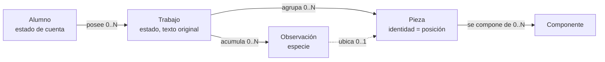
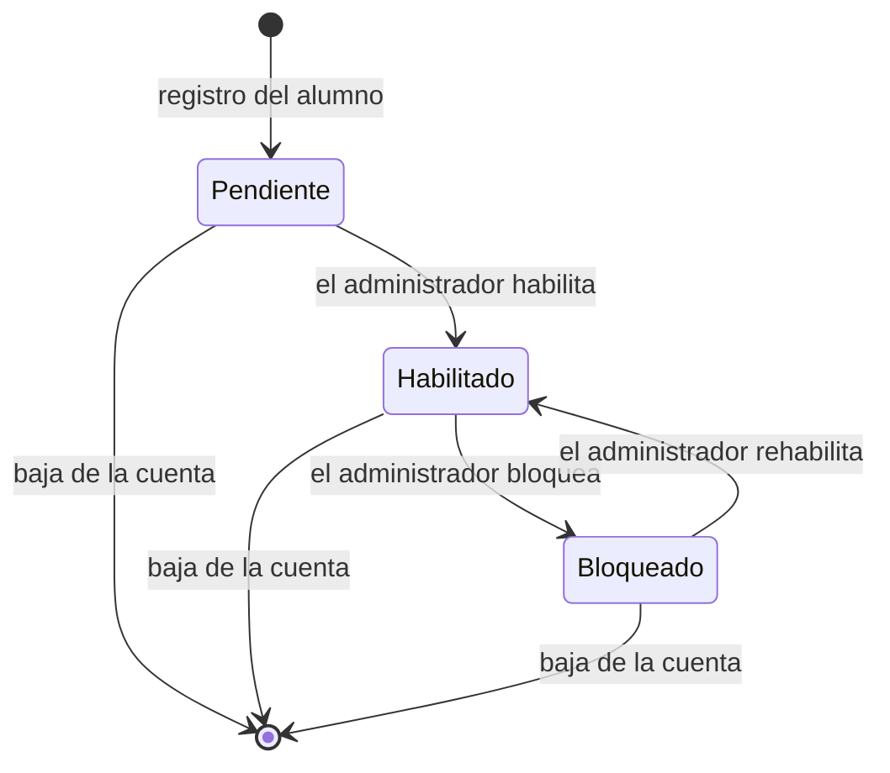
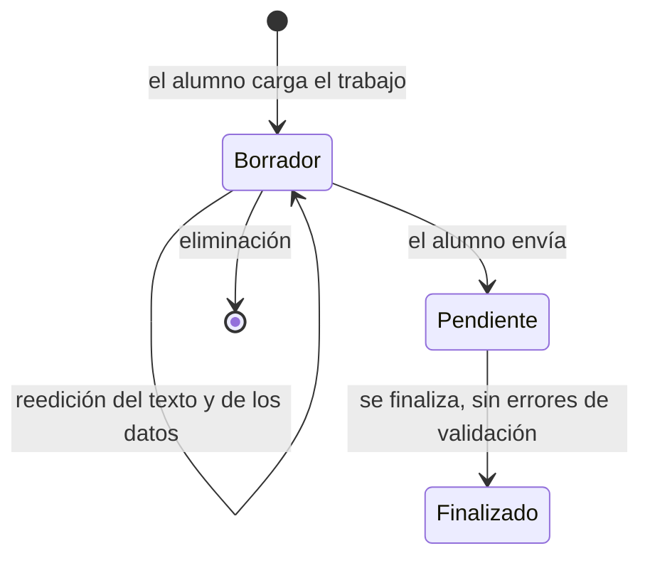

> **Artefacto archivado — estado `Superado`**
>
> Esta es una **copia archivada** del documento `Definicion-Modelo-De-Dominio.md` en su versión **1.0**, tomada el 2026-08-09 por el orquestador SDD antes de que la versión vigente la superara (`Master-Prompt.md` §5 y §5.1).
>
> - **Estado:** `Superado`
> - **Versión que preserva:** 1.0
> - **Fecha de archivado:** 2026-08-09
> - **Versión vigente:** [`Definicion-Modelo-De-Dominio.md`](../../Definicion-Modelo-De-Dominio.md)
>
> El cuerpo que sigue **no se modifica**: un registro que se corrige después deja de ser un registro. Este archivo no se renombra, no se reenlaza y no vuelve a tocarse.

---

# Definición del modelo de dominio

**Producto:** Fábrica de Geometría
**Proyecto de código:** GeometriaFactory-Domain
**Documento:** Definicion-Modelo-De-Dominio.md
**Versión:** 1.0
**Estado:** Propuesto
**Fecha:** 2026-08-08
**Autor:** Analista Funcional + API Designer (AG-02)
**Trazabilidad upstream:** `PRODUCT-INTAKE-Fabrica-De-Geometria.md` §17.1.P.1, §17.1.P.2, §17.1.P.3, §17.1.P.4, §17.1.P.5, §17.1.P.11, §14 (contratos entre proyectos de código), §12 (glosario del dominio del cliente), §7 (casos límite CL-3 a CL-6), §20 (escenarios E-1 a E-7); `00-Contexto/Vision-Producto.md` §9; `00-Contexto/Alcance-Producto.md` §4.1 y §5; `01-Necesidades-Negocio/Necesidades-Negocio.md` §2
**Trazabilidad downstream:** `05-Arquitectura-Tecnica` y `06-Backlog-Tecnico` de GeometriaFactory-Domain; `08-Calidad-Y-Pruebas`

---

## Tabla de contenido

- [1. Qué es este documento y qué no es](#1-qué-es-este-documento-y-qué-no-es)
- [2. Las cinco entidades del dominio](#2-las-cinco-entidades-del-dominio)
  - [2.1 Alumno](#21-alumno)
  - [2.2 Trabajo](#22-trabajo)
  - [2.3 Pieza](#23-pieza)
  - [2.4 Componente](#24-componente)
  - [2.5 Observación](#25-observación)
- [3. Relaciones y cardinalidades](#3-relaciones-y-cardinalidades)
- [4. Invariantes del dominio](#4-invariantes-del-dominio)
  - [4.1 Enunciados declarados](#41-enunciados-declarados)
  - [4.2 Identificadores declarados sin enunciado](#42-identificadores-declarados-sin-enunciado)
- [5. Transiciones de estado](#5-transiciones-de-estado)
  - [5.1 Estado de la cuenta del alumno](#51-estado-de-la-cuenta-del-alumno)
  - [5.2 Estado del trabajo](#52-estado-del-trabajo)
- [6. Semántica derivada y semántica guardada](#6-semántica-derivada-y-semántica-guardada)
- [7. Fronteras del dominio](#7-fronteras-del-dominio)
- [8. Referencia al glosario](#8-referencia-al-glosario)
- [9. Trazabilidad](#9-trazabilidad)
- [10. Control de cambios](#10-control-de-cambios)

---

## 1. Qué es este documento y qué no es

Este es el documento de concepto central de `GeometriaFactory-Domain`. Fija el vocabulario, la semántica y los elementos del modelo de dominio del producto: qué entidades existen, qué significa cada atributo, qué invariantes se sostienen siempre y qué transiciones de estado son admisibles.

**No es un modelo de persistencia.** Este proyecto de código no conoce el motor de datos, ni el protocolo de transporte, ni ninguna biblioteca de serialización: no tiene dependencias (PRODUCT-INTAKE §17.1.P.1) y su persistencia está declarada como «no aplica» (§17.1.P.4). El modelo de datos que refleja a estas entidades lo materializa `GeometriaFactory-Infrastructure`, y por eso `Modelo-Datos/Modelo-Conceptual.md` queda omitido en esta sección, según la regla de inclusión por tipo D8 `library` y el flag `tiene_persistencia` == false.

Tampoco fija nombres de tipos ni de espacios de nombres: el intake declara que quedan abiertos y se validan en el punto de control de la etapa `a` (§17.1.P.11). Acá los conceptos se nombran en lenguaje de dominio.

El estilo del modelo está decidido aguas arriba y no se rediscute: entidades con invariantes explícitas, con el modelo anémico y las entidades del proveedor de persistencia descartados como alternativas (§17.1.P.2).

## 2. Las cinco entidades del dominio

Las cinco entidades son las que el intake declara para este proyecto de código: Alumno, Trabajo, Pieza, Componente y Observación (§13, rol de `GeometriaFactory-Domain`).

### 2.1 Alumno

Persona de la comisión que obtiene identidad propia dentro del laboratorio y a la que pertenecen trabajos. El administrador del laboratorio es la cuenta única de la instancia y no es un alumno; el dominio lo distingue por su papel, no por una jerarquía de permisos configurables.

| Atributo | Semántica | Restricción conceptual |
| --- | --- | --- |
| Identificador | Identidad propia del alumno dentro de la instancia | Presente desde el alta; no se reutiliza |
| Correo | Dato con el que la persona se registra y con el que después se identifica al ingresar | Obligatorio. Es además el texto que el administrador debe escribir para confirmar una baja (RN-07) |
| Nombre | Nombre de pila declarado en el registro | Obligatorio |
| Apellido | Apellido declarado en el registro | Obligatorio |
| Papel | `Alumno` o `Administrador`. Son dos papeles fijos, sin permisos configurables | Conjunto cerrado (RN-01) |
| Estado de cuenta | `Pendiente`, `Habilitado` o `Bloqueado` | Conjunto cerrado. Valor inicial `Pendiente` (§5.1) |
| Credencial derivada | Valor derivado de la contraseña, que el dominio recibe ya derivado y nunca en claro | Sin valor hasta el primer ingreso efectivo; sólo se fija estando `Habilitado` |
| Fecha de alta | Momento en que la cuenta se constituyó | La provee el consumidor: el dominio no lee el reloj |

**Ejemplo de instancia.** Una alumna se registra con su correo, su nombre y su apellido y no elige contraseña: queda con papel `Alumno`, estado `Pendiente`, credencial derivada sin valor y ningún trabajo (PRODUCT-INTAKE §6, flujo 1).

### 2.2 Trabajo

Unidad que el alumno carga y entrega en el laboratorio: nombre, fecha, descripción y el texto que produjo su Actividad 1. Tiene identificador propio, dueño y estado. No es una unidad de entrega en el sentido normativo del framework: es un registro de datos y no se despliega (`Vision-Producto.md` §9.1 y §9.3).

| Atributo | Semántica | Restricción conceptual |
| --- | --- | --- |
| Identificador | Identidad propia del trabajo | Presente desde la creación |
| Dueño | Alumno al que pertenece el trabajo | Obligatorio y no transferible (INV-02) |
| Nombre | Título que el alumno le da a su trabajo | Obligatorio |
| Fecha | Fecha que el alumno declara para el trabajo | Obligatoria; es dato del alumno, no del reloj del sistema |
| Descripción | Texto libre con el que el alumno explica qué modeló | Admite vacío |
| Texto original | El texto que el alumno pegó, tal como lo emitió su programa | Se conserva íntegro y nunca se reescribe (RN-08, INV-04) |
| Estado | `Borrador`, `Pendiente` o `Finalizado` | Conjunto cerrado (§5.2) |
| Conjunto de piezas | Resultado de la interpretación del texto original | Vacío mientras el texto no haya sido interpretado |
| Observaciones | Lo que la interpretación y la verificación de valores emitieron sobre este trabajo | Vacío admisible |

**Ejemplo de instancia.** Un trabajo con el texto del escenario E-2 —un `Ortoedro(7, 7, 21)` con la clave `Tapas` y dos comas finales— queda con una pieza, cuatro laterales, dos bases, una observación de especie advertencia por el volumen y estado `Finalizado` (PRODUCT-INTAKE §20.E-2).

### 2.3 Pieza

Cada figura del conjunto raíz del trabajo. **Su identidad es su posición en ese conjunto**, porque el dato del alumno no trae identificador propio, y esa posición alcanza para seleccionarla y resaltarla (PRODUCT-INTAKE §17.1.P.11 punto 2).

| Atributo | Semántica | Restricción conceptual |
| --- | --- | --- |
| Posición | Lugar que la figura ocupa en el conjunto raíz del trabajo. **Es su identidad** | Obligatoria, estable y contigua desde 0 |
| Tipo | Discriminante que el texto del alumno declara: `Cilindro`, `Cubo`, `Ortoedro`, `Rectangulo`, `Cuadrado`, `Circulo` | Un tipo fuera del conjunto conocido produce una observación de especie error de validación (RN-09) |
| Área declarada | El valor de área que trae el texto del alumno | Se guarda tal cual, sin corregir |
| Área derivada | El valor de área que se recalcula desde las dimensiones que el propio texto declara | Se guarda por separado del declarado |
| Volumen declarado | El valor de volumen que trae el texto del alumno | Se guarda tal cual, sin corregir. No aplica a las figuras planas |
| Volumen derivado | El valor de volumen recalculado desde las dimensiones | Se guarda por separado del declarado. No aplica a las figuras planas |
| Componentes | Figuras planas que forman la pieza | Vacío admisible en las piezas planas del conjunto raíz |

Guardar por separado el valor declarado y el derivado es una decisión tomada aguas arriba: es lo que hace verificable la comparación sin recalcularla en cada consulta (§17.1.P.11 punto 3).

**Ejemplo de instancia.** La pieza de posición 1 del escenario E-1 es un `Cubo` con área declarada 36.00 y área derivada 54.00, volumen declarado 27.00 y volumen derivado 27.00, y seis componentes de tipo `Cuadrado` (PRODUCT-INTAKE §20.E-1 y §20.E-3).

### 2.4 Componente

Figura plana que forma parte de una pieza: tapa, cara, base, lateral o lado. Es el término del glosario del dominio del cliente (`Vision-Producto.md` §9.1) y el dominio lo conserva sin renombrarlo.

| Atributo | Semántica | Restricción conceptual |
| --- | --- | --- |
| Posición | Lugar que ocupa dentro del conjunto de componentes de su pieza | Obligatoria y contigua desde 0 |
| Papel | Qué es el componente respecto de su pieza: tapa, cara, base, lateral o lado | Conjunto cerrado del vocabulario del emisor |
| Tipo | Discriminante que el texto declara: `Circulo`, `Cuadrado`, `Rectangulo`, `RectanguloDesarrollado` | Dos discriminantes distintos pueden nombrar la misma forma; el dominio no los unifica ni los corrige |
| Dimensiones declaradas | Los valores dimensionales que el texto trae para ese componente | Se comprueban por existencia, no por veracidad geométrica (PRODUCT-INTAKE §20.E-6) |
| Área declarada | El valor de área que trae el texto para ese componente | Se guarda tal cual |

**Ejemplo de instancia.** El componente de posición 0 del cilindro del escenario E-1 es un `Circulo` con papel de tapa, radio 3.00 y área declarada 28.27.

### 2.5 Observación

Término **superordinado** de lo que el producto emite al interpretar el texto del alumno y al verificar sus valores. Agrupa dos especies con efecto distinto sobre la finalización del trabajo: la **advertencia**, que no impide finalizar, y el **error de validación**, que sí lo impide (`Vision-Producto.md` §9.1; PRODUCT-INTAKE §17.2.P.11 punto 2). Al modelarla como entidad, el superordinado es el término correcto: la entidad es una y su especie es un atributo.

| Atributo | Semántica | Restricción conceptual |
| --- | --- | --- |
| Especie | `Advertencia` o `Error de validación` | Conjunto cerrado. Sólo la segunda impide finalizar (RN-05) |
| Posición de pieza | Figura del conjunto raíz sobre la que se emite la observación | Obligatoria cuando la observación es atribuible a una figura (RN-09) |
| Campo | Campo del dato del alumno sobre el que se emite | Obligatorio en toda observación de especie error de validación (RN-09) |
| Valor declarado | El valor que trae el texto del alumno | Obligatorio en las advertencias de discrepancia de valor |
| Valor derivado | El valor recalculado desde las dimensiones | Obligatorio en las advertencias de discrepancia de valor |

**Ejemplo de instancia.** Sobre el escenario E-5, la observación es de especie error de validación, con posición de pieza 1 y campo `Tipo`; el trabajo se guarda como borrador y no se puede finalizar (PRODUCT-INTAKE §20.E-5).

## 3. Relaciones y cardinalidades

| Relación verbalizada | Cardinalidad |
| --- | --- |
| Un alumno posee ninguno, uno o muchos trabajos; todo trabajo pertenece a exactamente un alumno | Alumno (1) —— (0..N) Trabajo |
| Un trabajo agrupa ninguna, una o muchas piezas; toda pieza pertenece a exactamente un trabajo | Trabajo (1) —— (0..N) Pieza |
| Una pieza se compone de ninguno, uno o muchos componentes; todo componente pertenece a exactamente una pieza | Pieza (1) —— (0..N) Componente |
| Un trabajo acumula ninguna, una o muchas observaciones; toda observación pertenece a exactamente un trabajo | Trabajo (1) —— (0..N) Observación |
| Una observación puede referirse a la pieza de una posición del trabajo, o al trabajo entero cuando el defecto no es atribuible a una figura | Observación (0..N) —— (0..1) Pieza |

Un trabajo sin piezas y sin observaciones es un estado normal: es el borrador que el alumno guarda antes de que su texto se haya interpretado (PRODUCT-INTAKE §7, CL-3).

## 4. Invariantes del dominio

Los invariantes son atemporales: no describen una acción sino una restricción que se sostiene en todo momento. Su verificación sin infraestructura es exactamente lo que el intake declara como motivo para no adoptar un modelo anémico (§17.1.P.2).

### 4.1 Enunciados declarados

| Id | Enunciado | Origen declarado | Dónde se ejerce |
| --- | --- | --- | --- |
| INV-02 | Todo trabajo pertenece a un único alumno, y un alumno distinto de su dueño no obtiene de él ninguna información, ni siquiera la de su existencia | PRODUCT-INTAKE §7 (CL-5), §17.5.P.5 | CU-09; RN-03 |
| INV-04 | El texto original del alumno se conserva íntegro y nunca se reescribe | PRODUCT-INTAKE §21 (cobertura de invariantes), §9 (X-4) | CU-05, CU-06; RN-08 |
| INV-05 | Hay una sola instancia, un solo curso y un solo administrador: no hay separación por inquilinos ni múltiples administradores | PRODUCT-INTAKE §17.3.P.4, §9 (X-3) | CU-01, CU-02; RN-01 |
| INV-06 | Un alumno cuya cuenta está `Pendiente` o `Bloqueado` no obtiene acceso al laboratorio | PRODUCT-INTAKE §17.1.P.5 | CU-04 |

Sobre INV-06 hay una precisión de ubicación que conviene dejar escrita: el mecanismo por el que el acceso se materializa vive en `GeometriaFactory-Infrastructure` y en `GeometriaFactory-Api`. **El dominio modela la condición, no el mecanismo**: expone si la cuenta admite o no admite acceso, y el motivo por el que no lo admite.

### 4.2 Identificadores declarados sin enunciado

El intake nombra el rango completo **INV-01 a INV-06** en §14 y en §17.1.P.2, pero sólo transcribe el enunciado de cuatro de ellos.

| Id | Situación | Tratamiento |
| --- | --- | --- |
| INV-01 | El identificador aparece únicamente dentro del rango «INV-01 a INV-06». Ninguna sección del intake transcribe su enunciado | **No se enuncia acá.** Redactarlo sería inventar un invariante que el intake no declara. Queda registrado como ambigüedad elevada al Product Owner |
| INV-03 | Aparece siempre junto a INV-02, bajo el rótulo común de «verificación de pertenencia» (§17.2.P.5, §17.5.P.5). No se declara qué lo distingue de INV-02 | **No se enuncia acá.** El aspecto de la pertenencia que INV-02 no cubre no está declarado. Queda registrado como ambigüedad elevada al Product Owner |

Mientras la respuesta no llegue, la pertenencia se sostiene en el dominio con el enunciado de INV-02 y con RN-03, que sí están declarados, y ningún caso de uso queda sin restricción por este motivo.

## 5. Transiciones de estado

### 5.1 Estado de la cuenta del alumno

Los tres estados están declarados en PRODUCT-INTAKE §17.1.P.5. La baja no es un estado: es la desaparición de la cuenta y de sus trabajos (RN-07).

| Desde | Hacia | Quién es el sujeto de la regla | Condición |
| --- | --- | --- | --- |
| — | `Pendiente` | El alumno que se registra | Estado inicial, no negociable |
| `Pendiente` | `Habilitado` | El administrador | Acto explícito. No hay habilitación automática |
| `Habilitado` | `Bloqueado` | El administrador | Acto explícito |
| `Bloqueado` | `Habilitado` | El administrador | Acto explícito de rehabilitación |
| Cualquiera | (deja de existir) | El administrador | Baja, que arrastra los trabajos del alumno (RN-07) |

Transiciones inadmisibles: `Pendiente` a `Bloqueado` sin haber pasado por `Habilitado` no está declarada, y el dominio no la admite; ningún estado transiciona hacia `Pendiente`.

Consecuencia sobre la credencial: la credencial derivada sólo se fija estando `Habilitado`, que es lo que expresa «el primer ingreso efectivo» del flujo de alta (PRODUCT-INTAKE §6, flujo 1).

### 5.2 Estado del trabajo

Los tres estados están declarados en PRODUCT-INTAKE §4 (F-08) y en `NB-03` §5.

| Desde | Hacia | Condición |
| --- | --- | --- |
| — | `Borrador` | Estado inicial. Admite texto que todavía no se puede interpretar (CL-3) |
| `Borrador` | `Borrador` | Reedición: se reemplazan datos y texto original y se descarta la interpretación anterior |
| `Borrador` | `Pendiente` | El alumno envía el trabajo. El texto se interpreta en el envío |
| `Pendiente` | `Finalizado` | **Sólo si no hay observaciones de especie error de validación** (RN-05). Las advertencias no lo impiden |
| `Borrador` | (deja de existir) | Eliminación, admisible **sólo** en este estado (RN-04) |

Transiciones inadmisibles: eliminar en `Pendiente` o en `Finalizado`; finalizar con al menos una observación de especie error de validación; volver de `Finalizado` a cualquier otro estado, que ninguna fuente declara.

## 6. Semántica derivada y semántica guardada

Tres decisiones de modelado están tomadas aguas arriba y este documento las fija como semántica del dominio:

| Decisión | Qué implica en el modelo | Origen |
| --- | --- | --- |
| La identidad de la pieza es su posición en el conjunto raíz | No hay atributo identificador propio de la pieza. Reordenar el conjunto cambiaría la identidad de las piezas, de modo que el orden del texto del alumno es significativo | §17.1.P.11 punto 2 |
| El valor declarado y el derivado se guardan por separado | Son dos atributos distintos de la pieza y no uno calculado al vuelo. Es lo que permite verificar la discrepancia sin recalcularla en cada consulta, y lo que hace que la advertencia pueda mostrar los dos números | §17.1.P.11 punto 3 |
| La familia plana o volumétrica no se guarda | Es un atributo **derivado del tipo**. `Cilindro`, `Cubo` y `Ortoedro` son volumétricos; `Rectangulo`, `Cuadrado` y `Circulo` son planos. El dominio no admite que una pieza declare una familia que su tipo contradiga | §17.1.P.11 punto 4 |

La comparación entre valor declarado y valor derivado se decide con **tolerancia absoluta de 0.01** y nunca por igualdad exacta, porque el emisor del dato redondea a dos decimales. Ese número no es una asunción del intake: está declarado (§17.3.P.10). El cálculo del valor derivado y la interpretación del texto **no ocurren en el dominio**: los ejecuta el validador de figuras, que vive detrás de un puerto de `GeometriaFactory-Application` y se implementa en `GeometriaFactory-Infrastructure`.

## 7. Fronteras del dominio

Lo que este proyecto de código **no** hace, declarado acá para que ninguna categoría aguas abajo lo busque en el lugar equivocado:

| Responsabilidad | Dónde vive | Origen |
| --- | --- | --- |
| Interpretar el texto del alumno y tolerar sus particularidades de formato | `GeometriaFactory-Infrastructure`, detrás de un puerto de `GeometriaFactory-Application` | §17.2.P.11 punto 1, §17.3.P.11 punto 1 |
| Calcular el valor derivado de área y de volumen | `GeometriaFactory-Infrastructure` | §17.3.P.6 |
| Guardar, consultar y listar | `GeometriaFactory-Infrastructure` | §17.1.P.4, §17.3.P.4 |
| Derivar la contraseña y emitir el token de acceso | `GeometriaFactory-Infrastructure` | §17.1.P.5, §17.3.P.5 |
| Exponer datos hacia afuera del proceso | `GeometriaFactory-Contracts` y `GeometriaFactory-Api` | §17.1.P.3, §17.4.P.3 |
| Dibujar las piezas | `GeometriaFactory-Visor` | §17.7.P.1 |
| Leer el reloj | `GeometriaFactory-Application`, con el reloj como puerto | §17.2.P.11 punto 3 |

## 8. Referencia al glosario

El vocabulario de esta categoría vive en [`Glosario-Funcional.md`](Glosario-Funcional.md) y no acá. Los términos del modelo que ese glosario declara o referencia son: alumno, trabajo, pieza, componente, observación, advertencia, error de validación, valor declarado, valor derivado, estado de cuenta, estado del trabajo, credencial derivada, texto original, posición de pieza, familia plana o volumétrica y papel.

Los términos que ya declara `00-Contexto/Vision-Producto.md` §9 se **referencian** y no se redefinen. El glosario declara además los dos términos del corpus con más de un referente, «trabajo» y «pieza», con la forma que corresponde a cada uno.

## 9. Trazabilidad

| Entidad | Casos de uso que la consumen | Reglas de negocio que la restringen |
| --- | --- | --- |
| Alumno | CU-01, CU-02, CU-03, CU-04, CU-09 | RN-01, RN-07 |
| Trabajo | CU-05, CU-06, CU-07, CU-08, CU-09 | RN-03, RN-04, RN-05, RN-08 |
| Pieza | CU-06, CU-07 | RN-08, RN-09 |
| Componente | CU-06 | RN-08 |
| Observación | CU-07, CU-08 | RN-05, RN-09 |

| Necesidad de negocio | Elemento del modelo que la sostiene |
| --- | --- |
| NB-01 | Estado de cuenta y su máquina de transiciones; papel del administrador |
| NB-02 | Alumno, credencial derivada, INV-06 |
| NB-03 | Trabajo, su dueño, su estado y su identidad propia |
| NB-04 | Pieza, componente y observación de especie error de validación |
| NB-05 | Valor declarado y valor derivado guardados por separado; observación de especie advertencia |
| NB-06 | Identidad posicional de la pieza, que es lo que permite seleccionarla y resaltarla |

## 10. Control de cambios

| Versión | Fecha | Cambios |
| --- | --- | --- |
| 1.0 | 2026-08-08 | Emisión inicial. Declara las cinco entidades del dominio con sus atributos, su semántica y un ejemplo de instancia tomado de los escenarios del intake; las cinco relaciones con sus cardinalidades; los cuatro invariantes con enunciado declarado y los dos identificadores declarados sin enunciado, con su tratamiento; las dos máquinas de estado, de cuenta y de trabajo, con sus transiciones inadmisibles; las tres decisiones de semántica derivada y guardada; y las siete fronteras que separan a este proyecto de código de sus consumidores. |
