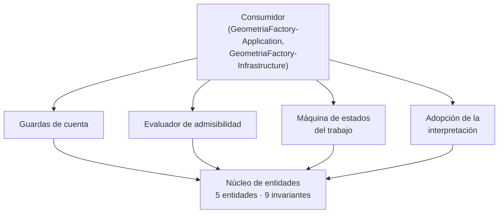

# Arquitectura técnica — GeometriaFactory-Domain

**Producto:** Fábrica de Geometría
**Proyecto de código:** GeometriaFactory-Domain
**Documento:** Arquitectura-Proyecto-Codigo.md
**Versión:** 1.0
**Estado:** Propuesto
**Fecha:** 2026-08-10
**Autor:** Arquitecto de Software Senior + API Designer (AG-05)
**Tipo de proyecto de código (D8):** `library`
**Trazabilidad upstream:** `PRODUCT-INTAKE-Fabrica-De-Geometria.md` **1.15** §4 y §4.1 (las **dieciséis** reglas `RN-01` a `RN-16`), §4.2 (modelo de estados del trabajo), §13 y §14 (composición del producto y las tres reglas de arquitectura `RA-01`, `RA-02`, `RA-03`), §15 (etapas y puertas técnicas), §16 (estructura de repositorio), §17.1 completo (P.1 a P.12, con los **nueve** invariantes `INV-01` a `INV-09`); `PRODUCT-MANIFEST-Fabrica-De-Geometria.md` **1.2** §2, §3 y §5 (flags de este proyecto de código); [`../02-Especificacion-Funcional/Especificacion-Funcional.md`](../02-Especificacion-Funcional/Especificacion-Funcional.md), [`../02-Especificacion-Funcional/Definicion-Modelo-De-Dominio.md`](../02-Especificacion-Funcional/Definicion-Modelo-De-Dominio.md) y los trece casos de uso de [`../02-Especificacion-Funcional/Casos-De-Uso/`](../02-Especificacion-Funcional/Casos-De-Uso/); [`../03-UX-UI-DX/DX-Error-Messages.md`](../03-UX-UI-DX/DX-Error-Messages.md) y [`../03-UX-UI-DX/DX-Developer-Experience.md`](../03-UX-UI-DX/DX-Developer-Experience.md)
**Trazabilidad downstream:** `06-Backlog-Tecnico`, `08-Calidad-Y-Pruebas`, `09-Devops` y `11-Documentacion` de GeometriaFactory-Domain

---

## Tabla de contenido

- [1. Objetivo](#1-objetivo)
- [2. Estilo arquitectónico](#2-estilo-arquitectónico)
  - [2.1 Alternativas descartadas](#21-alternativas-descartadas)
  - [2.2 Por qué no se evalúan los estilos de sistema distribuido](#22-por-qué-no-se-evalúan-los-estilos-de-sistema-distribuido)
- [3. Vista lógica](#3-vista-lógica)
  - [3.1 Componentes](#31-componentes)
  - [3.2 Regla de dependencias interna](#32-regla-de-dependencias-interna)
  - [3.3 Cobertura de los trece casos de uso](#33-cobertura-de-los-trece-casos-de-uso)
- [4. Vista de procesos](#4-vista-de-procesos)
- [5. Vista de despliegue](#5-vista-de-despliegue)
- [6. Vista de datos](#6-vista-de-datos)
- [7. Cross-cutting concerns](#7-cross-cutting-concerns)
- [8. Quality attributes (NFR)](#8-quality-attributes-nfr)
- [9. Riesgos arquitectónicos](#9-riesgos-arquitectónicos)
- [10. Trazabilidad](#10-trazabilidad)
  - [10.1 Componente contra caso de uso](#101-componente-contra-caso-de-uso)
  - [10.2 Las dieciséis reglas contra el lugar que las gobierna](#102-las-dieciséis-reglas-contra-el-lugar-que-las-gobierna)
  - [10.3 Los nueve invariantes contra el componente que los sostiene](#103-los-nueve-invariantes-contra-el-componente-que-los-sostiene)
- [11. Puntos abiertos](#11-puntos-abiertos)
- [12. Control de cambios](#12-control-de-cambios)

---

## 1. Objetivo

Documenta la arquitectura interna de `GeometriaFactory-Domain`: qué componentes tiene, cómo se reparten las **dieciséis** reglas de negocio y los **nueve** invariantes del producto, y qué decisiones estructurales sostienen que el dominio se pueda probar sin persistencia, sin red y sin marco de aplicación. Se dirige a quien implementa la biblioteca y a las categorías 06, 08 y 09, que derivan de acá su backlog, sus pruebas y sus puertas de construcción.

No documenta el modelo de datos físico —este proyecto de código declara su persistencia como «no aplica» (`PRODUCT-INTAKE` §17.1.P.4) y el flag `tiene_persistencia` es false (`PRODUCT-MANIFEST` §5)— ni el mecanismo de autenticación, que vive en `GeometriaFactory-Infrastructure` y en `GeometriaFactory-Api`.

## 2. Estilo arquitectónico

**Estilo elegido: modelo de dominio rico con invariantes explícitas, como núcleo de una arquitectura de capas con dependencias hacia adentro.** Es la decisión que `PRODUCT-INTAKE` §17.1.P.2 declara tomada aguas arriba y que [`ADR-01`](Adrs/ADR-01-Modelo-De-Dominio-Rico-Con-Invariantes-Explicitas.md) registra con su contexto y sus consecuencias.

En términos de esta categoría, el estilo se concreta en cuatro propiedades estructurales:

1. **Cero dependencias salientes.** El proyecto de código no referencia ningún otro proyecto de código del producto ni ninguna biblioteca de persistencia, de transporte o de serialización (`PRODUCT-INTAKE` §17.1.P.1). Es nivel 0 del orden topológico del `PRODUCT-MANIFEST` §3.
2. **Las guardas son la superficie pública.** Lo que el consumidor invoca son operaciones que aceptan o rechazan, y el rechazo es un valor de retorno tipado y no una excepción de control de flujo. Lo desarrolla [`Contratos-Abstractions.md`](Contratos-Abstractions.md).
3. **El tiempo y la unicidad entran por parámetro.** El dominio no lee el reloj ni consulta conjuntos de entidades: las dos cosas se las aporta el consumidor ([`ADR-06`](Adrs/ADR-06-El-Dominio-No-Lee-El-Reloj-Ni-El-Conjunto.md)).
4. **La admisibilidad es la puerta única de las guardas de cuenta.** `INV-06` e `INV-09` se ejercen en un solo lugar, y no repetidos en cada operación ([`ADR-05`](Adrs/ADR-05-Guarda-Unica-De-Admisibilidad.md)).

### 2.1 Alternativas descartadas

Las dos primeras las descarta el intake y esta categoría no las reabre; la tercera la evalúa y la descarta esta categoría.

| Alternativa | A favor | En contra | Resolución |
| --- | --- | --- | --- |
| Modelo anémico, con la lógica en los servicios de aplicación | Menos tipos, menos ceremonia, la lógica queda toda junta | Los invariantes y las transiciones —que son precisamente lo que hay que poder probar sin infraestructura— quedarían fuera del proyecto de código sin dependencias, y su verificación pasaría a exigir el resto de las capas | **Descartada** por `PRODUCT-INTAKE` §17.1.P.2 |
| Entidades del proveedor de persistencia como modelo de dominio | Un solo juego de tipos entre dominio y base de datos | Ata el dominio al proveedor y viola la regla de dependencias hacia adentro; además obligaría a referenciar una biblioteca de persistencia desde el nivel 0 | **Descartada** por `PRODUCT-INTAKE` §17.1.P.2 |
| Un agregado único que abarque cuenta y trabajo | Una sola puerta de consistencia, imposible de saltear | Las dos entidades raíz no comparten ninguna invariante: ninguna de las nueve liga el estado de una cuenta con el estado de un trabajo. El agregado único cargaría toda la cuenta en cada operación de trabajo sin comprar consistencia | **Descartada** por esta categoría, ver [`ADR-01`](Adrs/ADR-01-Modelo-De-Dominio-Rico-Con-Invariantes-Explicitas.md) §4 |

### 2.2 Por qué no se evalúan los estilos de sistema distribuido

La tabla de estilos contra criterios de elección de la regla de la categoría contempla pipeline, capas, hexagonal, microservicios y event-driven. Acá sólo los tres primeros son evaluables: este proyecto de código **no es una unidad de despliegue** —no tiene proceso, no atiende peticiones y no abre conexiones (`PRODUCT-INTAKE` §17.1.P.10)—, de modo que «deploy independiente» y «complejidad operativa» no tienen valor que comparar. La elección real es entre modelo rico y modelo anémico dentro de una arquitectura de capas, que es lo que §2.1 resuelve.

## 3. Vista lógica

### 3.1 Componentes

Un componente es acá un módulo con responsabilidad cohesiva, no una clase. Los cinco cubren los trece casos de uso de la categoría 02.

| Componente | Responsabilidad | Entradas | Salidas | Dependencias |
| --- | --- | --- | --- | --- |
| Núcleo de entidades | Constituir y sostener las cinco entidades del modelo —Alumno, Trabajo, Pieza, Componente y Observación— con sus atributos y su semántica | Datos ya verificados por forma, aportados por el consumidor | Entidades constituidas, o el rechazo tipado que impidió constituirlas | Ninguna |
| Guardas de cuenta | Ejercer las reglas de la cuenta: papeles, ventana de alta del administrador, ciclo de vida y credencial derivada | Estado vigente de la cuenta y la operación pretendida | Efecto aplicado, o rechazo con su condición | Núcleo de entidades |
| Evaluador de admisibilidad | Responder si una cuenta admite acceso y con qué motivo si no lo admite. Es la puerta única de `INV-06` y de `INV-09` | Estado de cuenta, credencial derivada y marca de cambio de contraseña pendiente | Admisible, o no admisible con sus motivos | Núcleo de entidades |
| Máquina de estados del trabajo | Resolver las transiciones del trabajo: envío, desenlace, terminalidad y quién elimina en qué estado | Estado vigente del trabajo, papel del solicitante y resultado de la interpretación aportado | Estado resultante, o rechazo con su condición | Núcleo de entidades |
| Adopción de la interpretación | Incorporar al trabajo el conjunto de piezas, sus componentes y las observaciones, comprobando que están bien formados | Conjunto de piezas y observaciones producido afuera | Trabajo con su conjunto adoptado, o rechazo por conjunto mal formado | Núcleo de entidades |

**Los cinco componentes son internos.** Ninguno se expone por separado: la superficie pública del proyecto de código es la que declara [`Contratos-Abstractions.md`](Contratos-Abstractions.md), y la partición de arriba es de responsabilidad, no de espacios de nombres, que quedan abiertos hasta la etapa `a` (`PRODUCT-INTAKE` §17.1.P.11).

### 3.2 Regla de dependencias interna

Las flechas del diagrama son unidireccionales y el grafo es acíclico: los cuatro componentes de comportamiento dependen del núcleo de entidades y ninguno depende de otro de su mismo nivel. En particular, **las guardas de cuenta no invocan al evaluador de admisibilidad**: habilitar, bloquear, rehabilitar y dar de baja son actos del administrador sobre una cuenta ajena, y no requieren que la cuenta operada sea admisible. Quien exige admisibilidad es el consumidor, sobre la cuenta que solicita, antes de llegar a cualquiera de los cuatro componentes.

### 3.3 Cobertura de los trece casos de uso

| Componente | Casos de uso que cubre |
| --- | --- |
| Núcleo de entidades | CU-01, CU-05, CU-06, CU-07, CU-12 |
| Guardas de cuenta | CU-01, CU-02, CU-03, CU-12, CU-13 |
| Evaluador de admisibilidad | CU-04 |
| Máquina de estados del trabajo | CU-08, CU-09, CU-10, CU-11 |
| Adopción de la interpretación | CU-06, CU-07 |

Los trece casos de uso tienen componente. Ninguno queda sin cubrir y ningún componente queda sin caso de uso.

## 4. Vista de procesos

- **Sin proceso propio.** El proyecto de código se carga dentro del proceso del consumidor. No arranca hilos, no programa temporizadores y no atiende peticiones (`PRODUCT-INTAKE` §17.1.P.10).
- **Sin transacciones.** El dominio no abre ni cierra unidades de trabajo: la atomicidad de una operación que toca varias entidades la establece el consumidor con el puerto de repositorio que declara `GeometriaFactory-Application` (`Definicion-Modelo-De-Dominio.md` §7).
- **Sin estado compartido entre invocaciones.** Cada operación recibe las entidades sobre las que trabaja y devuelve su resultado; no hay caché, ni registro estático, ni estado de sesión. La consecuencia práctica es que el proyecto de código es seguro frente a invocaciones concurrentes **siempre que dos hilos no compartan la misma instancia de entidad**, condición que le corresponde garantizar al consumidor.
- **Sin concurrencia interna.** El único paralelismo relevante es el de la batería de pruebas, que puede correr en paralelo porque ninguna prueba comparte estado.
- **Terminación controlada.** Ninguna operación deja una entidad a medio modificar: o el efecto se aplica entero, o la entidad queda como estaba y se devuelve la condición. Es la propiedad que hace verificable el catálogo de **42** condiciones de error de [`../03-UX-UI-DX/DX-Error-Messages.md`](../03-UX-UI-DX/DX-Error-Messages.md).

## 5. Vista de despliegue

| Aspecto | Decisión |
| --- | --- |
| Unidad de despliegue | Ninguna propia. El artefacto es una biblioteca que se compila dentro del artefacto de agrupación del producto y viaja embebida en las dos unidades desplegables del producto por la vía de sus consumidores |
| Runtime objetivo | La plataforma común declarada para los seis proyectos de código no visores, sin sufijo de plataforma, ejecutándose sobre el sistema operativo del contenedor de desarrollo y del servidor del backend (`PRODUCT-INTAKE` §17.1.P.9) |
| Dependencias de infraestructura | Ninguna. No requiere base de datos, ni almacén de secretos, ni servicio externo |
| Ciclo de construcción | Dentro del contenedor de desarrollo, porque el equipo anfitrión no tiene el kit de desarrollo instalado (`PRODUCT-INTAKE`, encabezado de la Parte C) |
| Etapas del pipeline | `restore` → `build` → `test`, con las puertas bloqueantes que declara §8 |
| Reversión | La etiqueta de la etapa anterior, que permite volver a cualquier demostración ya aprobada (`PRODUCT-INTAKE` §17.1.P.8) |
| Publicación | No se publica en ningún repositorio de paquetes: `redistribuible` es false (`PRODUCT-MANIFEST` §2) |

## 6. Vista de datos

- **Sin persistencia.** El flag `tiene_persistencia` es false y el intake declara «no aplica» en §17.1.P.4. Por eso **`Modelo-Datos-Logico.md` se omite** en esta sección, según la regla de inclusión por tipo D8 `library`.
- **Dónde vive el modelo lógico.** El esquema físico que refleja a estas cinco entidades lo materializa `GeometriaFactory-Infrastructure`, y es su categoría 05 la que debe emitir el modelo lógico con trazabilidad hacia [`../02-Especificacion-Funcional/Definicion-Modelo-De-Dominio.md`](../02-Especificacion-Funcional/Definicion-Modelo-De-Dominio.md) §2.
- **Sin caché y sin particionamiento.** No hay lectura repetida que valga la pena memorizar: cada operación recibe sus entidades ya materializadas.
- **Dos consecuencias de forma que el modelo lógico aguas abajo tiene que respetar**, y que no son de persistencia sino de semántica del dominio: el valor declarado y el valor derivado de cada pieza se guardan **por separado**, y la posición de una pieza es **la de su figura en el texto del alumno**, de modo que el conjunto de piezas adoptadas admite huecos y no se renumera (`Definicion-Modelo-De-Dominio.md` §6).

## 7. Cross-cutting concerns

Todas las decisiones transversales viven acá y no repartidas por componente.

| Preocupación | Decisión | Fundamento |
| --- | --- | --- |
| Registro de eventos | **Ninguno.** El dominio no registra ni instrumenta. Un rechazo se informa por su valor de retorno y quien decide si eso amerita una entrada de registro es el consumidor | `PRODUCT-INTAKE` §17.1.P.10 declara «sin observabilidad propia» |
| Trazas y métricas | **Ninguna propia.** No hay identificador de correlación que propagar dentro de la biblioteca: la correlación la lleva el consumidor | `PRODUCT-INTAKE` §17.1.P.10 |
| Manejo de errores | **Resultado tipado, no excepción.** Toda condición prevista viaja como valor de retorno con su código estable, tomado del catálogo de **42** condiciones de 03. Las excepciones quedan reservadas a defectos de programación del consumidor —un argumento nulo donde el contrato exige valor— y nunca a reglas de negocio | [`ADR-02`](Adrs/ADR-02-Superficie-Publica-De-Guardas-Y-Resultados-Tipados.md) |
| Configuración | **Ninguna.** El proyecto de código no lee configuración: todo lo que necesita llega por parámetro, incluidos el momento y la unicidad ya resuelta | [`ADR-06`](Adrs/ADR-06-El-Dominio-No-Lee-El-Reloj-Ni-El-Conjunto.md) |
| Secretos | **Ninguno.** La contraseña llega **ya derivada**; el dominio no ve valores en claro, no deriva y no compara credenciales por su cuenta | `PRODUCT-INTAKE` §17.1.P.5; [`ADR-04`](Adrs/ADR-04-Frontera-De-Autenticacion-Y-Autorizacion.md) |
| Vocabulario | `Pendiente` se escribe **siempre calificado** —«cuenta `Pendiente`» o «trabajo en estado `Pendiente`»—, y la marca de la contraseña provisoria se nombra siempre con la palabra «marca» | `PRODUCT-INTAKE` §4.2; `Definicion-Modelo-De-Dominio.md` §2.1 |
| Zona horaria y formato de fecha | **No se decide acá.** El momento entra como valor ya resuelto por el consumidor, de modo que la elección de zona y de precisión pertenece a quien lo aporta | [`ADR-06`](Adrs/ADR-06-El-Dominio-No-Lee-El-Reloj-Ni-El-Conjunto.md) |

## 8. Quality attributes (NFR)

Los dos primeros valores vienen rotulados **[ASUNCIÓN]** desde `PRODUCT-INTAKE` §17.1.P.6 y §17.1.P.10, y su confirmación está pendiente del Product Owner en §22 del intake. Se usan como vigentes hasta entonces. Los tres últimos los deriva esta categoría y se declaran como tales.

| NFR | Objetivo numérico | Mecanismo de medición | ADR relacionada |
| --- | --- | --- | --- |
| Tiempo de la batería de pruebas del dominio | Menos de **10 segundos** de punta a punta [ASUNCIÓN del intake] | Duración total reportada por el ejecutor de pruebas en la etapa de `test` del pipeline | [`ADR-01`](Adrs/ADR-01-Modelo-De-Dominio-Rico-Con-Invariantes-Explicitas.md) |
| Cobertura de la biblioteca | **90 %** de líneas y **85 %** de ramas [ASUNCIÓN del intake] | Informe de cobertura del pipeline, bloqueante para fusionar | [`ADR-01`](Adrs/ADR-01-Modelo-De-Dominio-Rico-Con-Invariantes-Explicitas.md) |
| Dependencias salientes del proyecto de código | Exactamente **0** referencias a otros proyectos de código del producto y **0** a bibliotecas de persistencia, transporte o serialización | Inspección del archivo de proyecto, bloqueante en revisión [derivado de `PRODUCT-INTAKE` §17.1.P.1] | [`ADR-01`](Adrs/ADR-01-Modelo-De-Dominio-Rico-Con-Invariantes-Explicitas.md) |
| Cobertura del catálogo de condiciones | **100 %** de las **42** condiciones de [`../03-UX-UI-DX/DX-Error-Messages.md`](../03-UX-UI-DX/DX-Error-Messages.md) alcanzadas por al menos una prueba, y **0** condiciones producidas por la biblioteca que no figuren en el catálogo | Prueba de inspección que compara el conjunto de códigos emitidos contra el catálogo, en las dos direcciones [derivado por esta categoría] | [`ADR-02`](Adrs/ADR-02-Superficie-Publica-De-Guardas-Y-Resultados-Tipados.md) |
| Ejercicio de los invariantes | **100 %** de los **nueve** invariantes con al menos una prueba que verifique su violación rechazada, sin dobles de prueba | Matriz invariante contra prueba en 08, verificada en la etapa de `test` [derivado por esta categoría] | [`ADR-05`](Adrs/ADR-05-Guarda-Unica-De-Admisibilidad.md) |
| Advertencias de construcción | Exactamente **0** advertencias | `scripts/build.sh` termina en 0 y sin advertencias, puerta bloqueante para fusionar (`PRODUCT-INTAKE` §17.1.P.8) | [`ADR-03`](Adrs/ADR-03-Versionado-Y-Estabilidad-De-La-Superficie.md) |

**No hay NFR de latencia, de throughput ni de disponibilidad, y es correcto que no los haya.** Este proyecto de código no atiende peticiones ni abre conexiones, de modo que esas tres métricas no tienen sujeto acá. El único NFR de tiempo que lo alcanza es el de construcción, que es el que la regla de no-regresión acumulativa del producto hace caro si crece (`PRODUCT-INTAKE` §15).

## 9. Riesgos arquitectónicos

| Riesgo | Impacto | Probabilidad | Mitigación |
| --- | --- | --- | --- |
| Que una dependencia se cuele en el nivel 0 —una anotación de mapeo, un atributo de serialización— y el dominio deje de ser probable sin infraestructura | Alto: se pierde la propiedad que justifica el estilo entero | Media: es la forma en que este defecto entra habitualmente, de a una anotación por vez | Puerta bloqueante de **0 dependencias salientes** (§8), verificada por inspección del archivo de proyecto en cada revisión |
| Que un invariante se ejerza en un componente y no en otro, y quede una puerta por la que se lo saltea | Alto: es exactamente la familia de defectos que abrió el P0 y su reincidencia por bloqueo de la cuenta de administrador | Media, y con precedente registrado en `B-02-03-GeometriaFactory-Domain-r3.md` | Puerta única de admisibilidad ([`ADR-05`](Adrs/ADR-05-Guarda-Unica-De-Admisibilidad.md)) y NFR de ejercicio de los nueve invariantes (§8) |
| Que el consumidor use el resultado tipado como si fuera una excepción, y descarte los rechazos sin tratarlos | Medio: convierte un rechazo del dominio en un fallo silencioso, que es lo que el producto viene a eliminar | Media | Que toda operación con rechazo posible devuelva un resultado que el consumidor no pueda ignorar sin que se note en revisión ([`ADR-02`](Adrs/ADR-02-Superficie-Publica-De-Guardas-Y-Resultados-Tipados.md) §7) |
| Que el momento lo lea el dominio «por comodidad» en alguna operación | Medio: rompe la reproducibilidad de las pruebas y mete una dependencia de entorno en el nivel 0 | Baja | [`ADR-06`](Adrs/ADR-06-El-Dominio-No-Lee-El-Reloj-Ni-El-Conjunto.md), con la inspección de que ninguna operación obtiene el momento por su cuenta |
| Que los nombres de tipos y de espacios de nombres, que el intake deja abiertos, se fijen sin punto de control y después haya que renombrarlos | Bajo: costo de retrabajo, no de corrección | Media | El intake ya lo declara punto abierto de la etapa `a` y lo ata a su punto de control (`PRODUCT-INTAKE` §17.1.P.11); esta categoría lo repite en §11 |

## 10. Trazabilidad

### 10.1 Componente contra caso de uso

| Dimensión | Referencia |
| --- | --- |
| CU cubiertos | CU-01 a CU-13, los trece de [`../02-Especificacion-Funcional/Especificacion-Funcional.md`](../02-Especificacion-Funcional/Especificacion-Funcional.md) §3 |
| RN aplicables | RN-01 a RN-16, las dieciséis, con el reparto de §10.2 |
| Invariantes sostenidos | INV-01 a INV-09, los nueve, con el reparto de §10.3 |
| ADRs que lo gobiernan | ADR-01, ADR-02, ADR-03, ADR-04, ADR-05, ADR-06 |
| Contratos que expone | [`Contratos-Abstractions.md`](Contratos-Abstractions.md) |
| Tests previstos en 08 | Pruebas unitarias puras, sin dobles, sobre los nueve invariantes y las tres máquinas de estado (`PRODUCT-INTAKE` §17.1.P.6); prueba de inspección del catálogo de condiciones en las dos direcciones; prueba de inspección de dependencias salientes |

### 10.2 Las dieciséis reglas contra el lugar que las gobierna

Las dieciséis filas están, una por regla, y ninguna se agrupa. El invariante de cada fila es el que [`../02-Especificacion-Funcional/Definicion-Modelo-De-Dominio.md`](../02-Especificacion-Funcional/Definicion-Modelo-De-Dominio.md) §4.3 le asigna.

| Regla | Invariante | Componente que la gobierna | ADR que la alcanza |
| --- | --- | --- | --- |
| RN-01 Administrador único y papeles fijos | INV-05 | Guardas de cuenta | ADR-01 |
| RN-02 Correo del alumno único | INV-01 | Núcleo de entidades, con la unicidad aportada | ADR-06 |
| RN-03 Trabajo ajeno indistinguible de inexistente | INV-02 | Máquina de estados del trabajo | ADR-02 |
| RN-04 Eliminación acotada al borrador para el alumno | INV-03 | Máquina de estados del trabajo | ADR-02 |
| RN-05 No se pasa a estado `Pendiente` con errores de validación | INV-04 | Máquina de estados del trabajo | ADR-02 |
| RN-06 Cuenta `Pendiente` o `Bloqueado` sin acceso | INV-06 | Evaluador de admisibilidad | ADR-04, ADR-05 |
| RN-07 Baja con arrastre y confirmación escrita | Ninguno | Guardas de cuenta | ADR-01 |
| RN-08 Texto original conservado íntegro | Ninguno | Núcleo de entidades | ADR-01 |
| RN-09 Observación de error con posición y campo | Ninguno | Adopción de la interpretación | ADR-02 |
| RN-10 Desenlace exclusivo del administrador y terminalidad | INV-07 | Máquina de estados del trabajo | ADR-02 |
| RN-11 El administrador no ve los borradores | Ninguno | Máquina de estados del trabajo, como predicado de alcance | ADR-02 |
| RN-12 El reseteo conserva la cuenta y sus trabajos | INV-09 | Guardas de cuenta | ADR-04, ADR-05 |
| RN-13 Cambio forzado antes de toda otra capacidad | INV-09 | Evaluador de admisibilidad | ADR-05 |
| RN-14 La provisoria la produce el sistema | Ninguno | **Ninguno de este proyecto de código**: el valor le llega ya derivado | ADR-04 |
| RN-15 Resetear no exige cuenta habilitada | Ninguno | Guardas de cuenta, por la **ausencia** de precondición | ADR-04 |
| RN-16 Habilitar produce la provisoria | INV-09 | Guardas de cuenta | ADR-04, ADR-05 |

**Diez reglas con invariante y seis sin él.** Las seis sin invariante son RN-07, RN-08, RN-09, RN-11, RN-14 y RN-15, y el motivo de cada una está declarado en `Definicion-Modelo-De-Dominio.md` §4.3; esta tabla lo refleja y no lo redefine. **RN-12, RN-13 y RN-16 comparten INV-09**, que es la lectura que la categoría 02 adoptó de la columna de reglas sostenidas del propio invariante, declarando que la prosa del intake es ambigua en ese punto. Esta categoría adopta la misma lectura y **no afirma que la prosa del intake la respalde**.

### 10.3 Los nueve invariantes contra el componente que los sostiene

| Invariante | Componente que lo sostiene | Observación |
| --- | --- | --- |
| INV-01 Correo único | Núcleo de entidades | El dominio **declara** la condición; la unicidad efectiva sobre el conjunto la resuelve el consumidor con el puerto de repositorio |
| INV-02 Acceso sólo a los trabajos propios | Máquina de estados del trabajo | Se ejerce como predicado de pertenencia sobre una entidad, no como consulta |
| INV-03 Eliminación por el alumno sólo en `Borrador` y sobre trabajo propio | Máquina de estados del trabajo | Deliberadamente acotado al alumno: el administrador elimina en cualquiera de los estados que ve |
| INV-04 Trabajo `Finalizado` sin errores de interpretación | Máquina de estados del trabajo | Las advertencias no lo impiden |
| INV-05 Exactamente un administrador | Guardas de cuenta | La ventana de alta es única y se cierra al constituirse la cuenta |
| INV-06 Cuenta `Pendiente` o `Bloqueado` sin acceso | Evaluador de admisibilidad | El dominio modela la condición; el acceso se materializa afuera |
| INV-07 Estado terminal sin salida ni cambio de contenido | Máquina de estados del trabajo | Alcanza a `Finalizado` y a `Rechazado` |
| INV-08 La cuenta de administrador está siempre `Habilitado` | Guardas de cuenta | Cierra la familia de defectos que se abrió dos veces: nacer `Pendiente` y poder ser bloqueada |
| INV-09 Cuenta con la marca puesta sin ninguna otra capacidad | Evaluador de admisibilidad | Puerta única, con la consecuencia declarada en [`ADR-05`](Adrs/ADR-05-Guarda-Unica-De-Admisibilidad.md) |

## 11. Puntos abiertos

| Id | Punto abierto | Quién lo cierra | Cuándo |
| --- | --- | --- | --- |
| PA-01 | Los **nombres definitivos de tipos y de espacios de nombres** de la biblioteca. El intake los declara abiertos y los ata al punto de control de la etapa `a` (`PRODUCT-INTAKE` §17.1.P.11) | El Product Owner en el punto de control de la etapa `a` | Etapa `a` |
| PA-02 | Los dos valores rotulados **[ASUNCIÓN]** en §8 —tiempo de la batería y cobertura mínima— siguen pendientes de confirmación del Product Owner en `PRODUCT-INTAKE` §22. Se usan como vigentes | El Product Owner sobre su propio documento | Antes de fijar la puerta de cobertura en 09 |
| PA-03 | La **ambigüedad del intake sobre RN-12 e INV-09**: su columna de reglas sostenidas y su prosa dicen cosas distintas. La categoría 02 adoptó la columna y elevó la consolidación; esta categoría hereda esa lectura sin resolverla | El Product Owner sobre `PRODUCT-INTAKE` §17.1.P.2 | Sin fecha comprometida |
| PA-04 | La **herramienta que calcula la versión** a partir de las convenciones de mensaje de confirmación no está elegida: el intake declara que se ancla en la etapa `a` (`PRODUCT-INTAKE` §17.1.P.7) | El equipo en la etapa `a` | Etapa `a` |

## 12. Control de cambios

| Versión | Fecha | Descripción |
| --- | --- | --- |
| 1.0 | 2026-08-10 | Emisión inicial de la arquitectura técnica de `GeometriaFactory-Domain`. Declara el estilo con sus tres alternativas evaluadas, los cinco componentes con su regla de dependencias interna y su cobertura de los trece casos de uso, las cuatro vistas mínimas —lógica, procesos, despliegue y datos, esta última con la omisión declarada del modelo lógico—, los cross-cutting concerns centralizados, seis NFR con objetivo numérico y mecanismo de medición, cinco riesgos con mitigación, la trazabilidad de las dieciséis reglas y de los nueve invariantes contra el componente que los gobierna, y cuatro puntos abiertos. Emite seis ADR individuales bajo `Adrs/` y el contrato de superficie pública en `Contratos-Abstractions.md`. |
