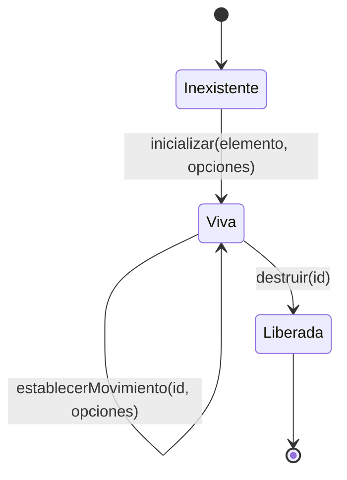

# Flujo de ejecución — GeometriaFactory-Visor

**Producto:** Fábrica de Geometría
**Proyecto de código:** GeometriaFactory-Visor
**Documento:** Flujo-Ejecucion.md
**Versión:** 1.0
**Estado:** Aprobado
**Fecha:** 2026-08-10
**Autor:** Arquitecto de Software Senior + API Designer (AG-05)

---

## Tabla de contenido

- [1. Objetivo y alcance](#1-objetivo-y-alcance)
- [2. Ciclo de vida de una instancia](#2-ciclo-de-vida-de-una-instancia)
- [3. La canalización de dibujo, paso a paso](#3-la-canalización-de-dibujo-paso-a-paso)
  - [3.1 Transformaciones de datos](#31-transformaciones-de-datos)
  - [3.2 Dónde se emite cada condición](#32-dónde-se-emite-cada-condición)
- [4. El bucle de dibujo](#4-el-bucle-de-dibujo)
- [5. La liberación de recursos](#5-la-liberación-de-recursos)
- [6. Trazabilidad](#6-trazabilidad)
- [7. Control de cambios](#7-control-de-cambios)

---

## 1. Objetivo y alcance

La regla de la categoría recomienda este documento para `library` **con motor de procesamiento**, y este proyecto de código lo tiene: `cargarJson` es una canalización que va del texto del alumno a un conjunto de mallas en una escena, con transformaciones y pérdidas declaradas en cada paso.

Documenta esa canalización, el bucle de dibujo que la sostiene en el tiempo y la liberación de recursos que la cierra. **No documenta la interpretación del texto que hace el backend**, que es otra cosa y vive en otros proyectos de código: acá el texto se lee **para dibujar**, no para decidir si el trabajo es válido.

## 2. Ciclo de vida de una instancia

| Transición | Qué la dispara | Qué cambia |
| --- | --- | --- |
| Inexistente → Viva | `inicializar` | Nace la escena con iluminación y cámara orbital, aislada de cualquier otra instancia, **sin ninguna pieza dibujada** y con los dos movimientos en el estado que las opciones fijen —apagados si están ausentes— |
| Viva → Viva, por `cargarJson` | Un texto de trabajo | **Reemplaza por completo** el contenido dibujado y libera lo que la carga anterior había creado. El estado de los movimientos **no** se toca |
| Viva → Viva, por `seleccionarPieza` | Un índice | Cambia el resaltado, que es exclusivo. No toca la disposición ni el resultado de dibujo |
| Viva → Viva, por `redimensionar` | El anfitrión, cuando el tamaño del elemento cambió | Recalcula la relación de aspecto. Conserva selección y disposición |
| Viva → Viva, por `establecerMovimiento` | El anfitrión | Cambia el estado de uno de los dos movimientos o de los dos. **No toca la escena más allá del movimiento** |
| Viva → Liberada | `destruir` | Libera geometrías, materiales y el contexto gráfico, y **corta el bucle**. El identificador deja de ser válido y no se reutiliza |

**Una instancia liberada no vuelve a la vida.** Para volver a dibujar sobre el mismo elemento, el anfitrión invoca `inicializar` otra vez.

## 3. La canalización de dibujo, paso a paso

Es lo que ocurre dentro de `cargarJson`.

| Paso | Componente | Qué hace | Qué puede fallar |
| --- | --- | --- | --- |
| 1 | Fachada | Resuelve el identificador contra el registro de instancias | `INSTANCIA_DESCONOCIDA`, y no se ejecuta ningún paso más |
| 2 | Servicio de dibujo | **Libera lo que la carga anterior había creado** | Nada: es incondicional, y es lo que sostiene el requerimiento de no degradar |
| 3 | Lector del texto | Obtiene del texto el conjunto raíz de figuras y su estructura jerárquica | `TEXTO_NO_LEGIBLE`: la instancia queda **viva y vacía** |
| 4 | Lector del texto | Recorre el conjunto raíz **por índice** y, para cada figura, resuelve su tipo | `TIPO_NO_DIBUJABLE`, **por pieza**: esa figura no se dibuja y las demás sí |
| 5 | Lector del texto | Para cada figura de tipo dibujable, lee su dimensión de sus componentes, tolerando las variantes de clave del emisor | `DIMENSION_NO_LEGIBLE`, **por pieza**, y sólo por **ausencia** de la clave o del componente: un valor de `0.00` es legible y esa pieza se dibuja |
| 6 | Servicio de dibujo | Construye la malla de cada pieza legible | — |
| 7 | Servicio de dibujo | Ubica cada malla en la escena, **en la celda que le asigna su índice** | — |
| 8 | Servicio de dibujo | Compone el resultado de dibujo: piezas dibujadas, piezas no dibujadas con su condición, y la estructura del texto | — |

**El paso 5 lee una dimensión; no valida un trabajo.** Aceptar las variantes de clave del emisor es lo que impide que haya piezas que el producto interpreta y la escena no dibuja, que es exactamente el defecto que el producto viene a eliminar. No contradice la prohibición de validar: son dos responsabilidades distintas sobre el mismo texto.

### 3.1 Transformaciones de datos

| Entrada | Transformación | Salida | Qué se pierde |
| --- | --- | --- | --- |
| Texto del trabajo | Lectura estructural | Conjunto raíz de figuras y estructura jerárquica | Nada: el texto no se conserva ni se reescribe, y la estructura se devuelve entera para el árbol |
| Figura del conjunto raíz | Resolución de tipo y lectura de dimensión | Pieza legible, con índice y medidas | Los valores declarados de área y volumen: **la fachada no los usa y no los recalcula**, porque verificar no es su responsabilidad |
| Pieza legible | Construcción de malla | Malla en la escena | La distinción entre valor declarado y derivado, que no llega hasta acá |
| Conjunto de piezas | Disposición por índice | Escena completa | Nada: **ninguna pieza desaparece sin quedar enumerada** (G-5) |

### 3.2 Dónde se emite cada condición

| Condición | Paso de la canalización | Alcance |
| --- | --- | --- |
| `INSTANCIA_DESCONOCIDA` | 1 | La invocación entera; no se ejecuta ningún paso más |
| `TEXTO_NO_LEGIBLE` | 3 | La invocación entera; la instancia queda viva y vacía |
| `TIPO_NO_DIBUJABLE` | 4 | Una pieza |
| `DIMENSION_NO_LEGIBLE` | 5 | Una pieza |

Las otras tres condiciones del contrato **no se emiten en esta canalización**: `CAPACIDAD_GRAFICA_AUSENTE` y el curso de creación de `ELEMENTO_DE_DIBUJO_INVALIDO` pertenecen a `inicializar`, el curso de ajuste pertenece a `redimensionar`, e `INDICE_FUERA_DE_RANGO` pertenece a `seleccionarPieza`.

## 4. El bucle de dibujo

Un bucle por instancia viva, en el único hilo del navegador.

| Aspecto | Decisión |
| --- | --- |
| Qué sostiene | La interacción de rotar y acercar, y los dos movimientos automáticos de la capacidad F-25 |
| Cuándo se detiene el movimiento automático | Mientras la persona **arrastra la cámara**, y mientras la **superficie de dibujo no está visible** |
| Qué pasa con el estado gobernado al detenerse | **No cambia.** El anfitrión no tiene que apagar su control porque el bucle se haya detenido solo |
| Qué no origina | **Ninguna petición de red**, ni siquiera con los dos movimientos prendidos y sostenidos. Es su peor caso, y es en esas condiciones que se mide |
| Qué no escribe | **Nada.** La preferencia de quien mira vive en el anfitrión |
| Qué pasa con la disposición | **No la altera.** El determinismo comprometido es de la posición de cada pieza, derivada de su índice, y no de su orientación en un instante |
| Qué pasa al apagar el giro de las figuras | **Cada pieza vuelve a su orientación de partida** |

Las dos condiciones de detención tienen motivos distintos: la primera evita pelearle el control a quien lo tomó; la segunda impide que un movimiento invisible siga consumiendo recursos.

## 5. La liberación de recursos

Ocurre en dos momentos y con el mismo alcance:

| Momento | Qué libera | Qué conserva |
| --- | --- | --- |
| Paso 2 de la canalización, en cada `cargarJson` | Las geometrías y los materiales de la carga anterior | La instancia, su identificador, el encuadre y el estado de los dos movimientos |
| `destruir` | Geometrías, materiales, el contexto gráfico y **el bucle** | Nada de esa instancia. **No toca otras instancias**, no borra el elemento de la página y no deja rastro en el almacenamiento del navegador |

**Un bucle que sobreviviera a `destruir` es exactamente la forma de degradación** que el requerimiento de diez recorridos de ida y vuelta tiene que descartar, y por eso esa medición se hace **con los dos movimientos prendidos**: con los movimientos apagados no se ejercitaría.

## 6. Trazabilidad

| Dimensión | Referencia |
| --- | --- |
| CU que recorre | `CU-12002` para la canalización; `CU-12001` y `CU-12005` para el ciclo de vida; `CU-12007` para el bucle de movimiento; `CU-12006` para el recorrido completo sin backend |
| Garantías que sostiene | G-1, G-2, G-4, G-5, G-6 y G-7 |
| ADR que lo gobiernan | ADR-12001, ADR-12003, ADR-12005 |
| NFR que verifica | Cero red, liberación de recursos, disposición determinista y ausencia de fallo silencioso, con las condiciones de medición de [`Arquitectura-Proyecto-Codigo.md`](Arquitectura-Proyecto-Codigo.md) §8 |
| Material de dibujo | Escenarios **E-1** —tres piezas, con el ortoedro dibujado— y **E-7** —seis piezas que cubren los seis tipos dibujables— |
| Tests previstos en 08 | Una prueba por paso con condición emisible; recorrido completo por el sample S-1; diez recorridos de ida y vuelta con los movimientos prendidos |

## 7. Control de cambios

| Versión | Fecha | Descripción |
| --- | --- | --- |
| 1.0 | 2026-08-10 | Emisión inicial. Documenta el ciclo de vida de una instancia con sus seis transiciones, la canalización de dibujo en ocho pasos con lo que puede fallar en cada uno, las cuatro transformaciones de datos con lo que se pierde en cada una, el mapa de en qué paso se emite cada condición y cuáles no pertenecen a esta canalización, el bucle de dibujo con sus dos condiciones de detención, y los dos momentos de liberación de recursos con su alcance. |
