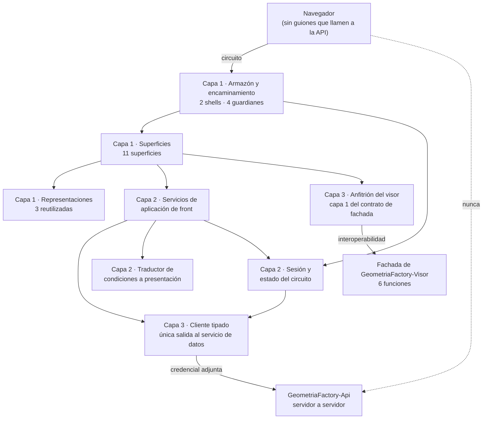

# Arquitectura técnica — GeometriaFactory-Web

**Producto:** Fábrica de Geometría
**Proyecto de código:** GeometriaFactory-Web
**Documento:** Arquitectura-Proyecto-Codigo.md
**Versión:** 1.0
**Estado:** Aprobado
**Fecha:** 2026-08-10
**Autor:** Arquitecto de Software Senior (AG-05)
**Tipo de proyecto de código (D8):** `web-monolith`
**Trazabilidad upstream:** `PRODUCT-INTAKE-Fabrica-De-Geometria.md` **1.16** §4 y §4.1 (las **dieciséis** reglas `RN-01` a `RN-16`), §4.2 (modelo de estados del trabajo), §7 (casos límite `CL-2`, `CL-7` y `CL-8`), §13 y §14 (composición del producto y las tres reglas de arquitectura `RA-01`, `RA-02`, `RA-03`), §15 (etapas y las puertas técnicas `PT-01` a `PT-03`), §16 y §16.1 (estructura de repositorio y ausencia de sample propio), §17.1.P.2 (`INV-09`), §17.6 completo (P.1 a P.12), §17.7 P.3 y P.10 (las **seis** funciones de la fachada y sus condiciones de medición), §22 (asunción A-4); `PRODUCT-MANIFEST-Fabrica-De-Geometria.md` **1.2** §2, §3 y §5 (flags de este proyecto de código, con `tiene_ui_final`, `tiene_auth` y `requiere_maqueta` en true); [`../02-Especificacion-Funcional/Especificacion-Funcional.md`](../02-Especificacion-Funcional/Especificacion-Funcional.md) y los **diez** casos de uso de [`../02-Especificacion-Funcional/Casos-De-Uso/`](../02-Especificacion-Funcional/Casos-De-Uso/); [`../03-UX-UI-DX/Experiencia-De-Uso.md`](../03-UX-UI-DX/Experiencia-De-Uso.md), los **once** wireframes, las **tres** representaciones y los **tres** artefactos de línea de base de la Fase B2; [`../08-Calidad-Y-Pruebas/Matriz-Sensado-Deriva.md`](../08-Calidad-Y-Pruebas/Matriz-Sensado-Deriva.md); las Fases C ya emitidas de [`GeometriaFactory-Contracts`](../../GeometriaFactory-Contracts/05-Arquitectura-Tecnica/Arquitectura-Proyecto-Codigo.md) y [`GeometriaFactory-Visor`](../../GeometriaFactory-Visor/05-Arquitectura-Tecnica/Arquitectura-Proyecto-Codigo.md), que son sus dos dependencias
**Trazabilidad downstream:** `06-Backlog-Tecnico`, `07-Plan-Sprint`, `08-Calidad-Y-Pruebas`, `09-Devops` y `11-Documentacion` de GeometriaFactory-Web

---

## Tabla de contenido

- [1. Objetivo](#1-objetivo)
- [2. Estilo arquitectónico](#2-estilo-arquitectónico)
  - [2.1 Alternativas descartadas](#21-alternativas-descartadas)
  - [2.2 Qué heredan de los dos proyectos de código de nivel 0 y no se reabre](#22-qué-heredan-de-los-dos-proyectos-de-código-de-nivel-0-y-no-se-reabre)
- [3. Vista lógica](#3-vista-lógica)
  - [3.1 Componentes](#31-componentes)
  - [3.2 Regla de dependencias interna](#32-regla-de-dependencias-interna)
  - [3.3 Cobertura de los diez casos de uso](#33-cobertura-de-los-diez-casos-de-uso)
  - [3.4 Las once superficies contra el componente que las aloja](#34-las-once-superficies-contra-el-componente-que-las-aloja)
- [4. Vista de procesos](#4-vista-de-procesos)
- [5. Vista de despliegue](#5-vista-de-despliegue)
- [6. Vista de datos](#6-vista-de-datos)
- [7. Cross-cutting concerns](#7-cross-cutting-concerns)
- [8. Quality attributes (NFR)](#8-quality-attributes-nfr)
- [9. Riesgos arquitectónicos](#9-riesgos-arquitectónicos)
- [10. Trazabilidad](#10-trazabilidad)
  - [10.1 Componente contra caso de uso](#101-componente-contra-caso-de-uso)
  - [10.2 Las trece restricciones transversales contra la decisión que las sostiene](#102-las-trece-restricciones-transversales-contra-la-decisión-que-las-sostiene)
  - [10.3 Las dieciséis reglas contra este proyecto de código](#103-las-dieciséis-reglas-contra-este-proyecto-de-código)
  - [10.4 Las tres reglas de arquitectura del producto](#104-las-tres-reglas-de-arquitectura-del-producto)
- [11. Puntos abiertos](#11-puntos-abiertos)
- [12. Control de cambios](#12-control-de-cambios)

---

## 1. Objetivo

Documenta la arquitectura interna de `GeometriaFactory-Web`, la **pieza pública** del producto: el único punto de contacto del navegador y el anfitrión del bundle del visor. Declara sus componentes, cómo se reparten las **once** superficies, dónde vive la credencial de sesión, cómo se sostiene que **ningún guion del navegador invoque el servicio de datos** y qué pasa cuando algo se corta. Se dirige a quien implementa el front y a las categorías 06, 07, 08 y 09.

No documenta el diseño de las pantallas, que es de [`../03-UX-UI-DX/`](../03-UX-UI-DX/) y ya está emitido y validado contra una maqueta aprobada; ni las reglas del dominio, que viven en `GeometriaFactory-Domain`; ni la forma de los puntos de acceso del servicio, que es de `GeometriaFactory-Api`.

**Este proyecto de código es el lugar donde las tres reglas de arquitectura del producto se pueden violar.** Los otros seis las sostienen por construcción o no las alcanzan; acá hay navegador, hay guiones y hay una dirección de servicio que podría filtrarse en un mensaje. Por eso §10.4 no es una formalidad.

## 2. Estilo arquitectónico

**Estilo elegido: monolito de presentación con render en el servidor y circuito interactivo, en tres capas internas, con un cliente tipado como única salida hacia el servicio de datos.** Es lo que `PRODUCT-INTAKE` §17.6.P.2 y §17.6.P.11 punto 1 declaran tomado aguas arriba, y lo registran [`ADR-01`](Adrs/ADR-01-Render-En-El-Servidor-Con-Circuito-Interactivo.md) y [`ADR-04`](Adrs/ADR-04-Tres-Capas-De-Presentacion.md).

Cinco propiedades estructurales lo concretan:

1. **La llamada al servicio de datos la hace el servidor de esta pieza, no el navegador.** Es lo que elimina contenido mixto, restricción de origen cruzado y exposición de la dirección del servidor propio, y es `RA-01` ([`ADR-01`](Adrs/ADR-01-Render-En-El-Servidor-Con-Circuito-Interactivo.md)).
2. **Sin estado propio y sin persistencia, y es deliberado.** No hay copia local, ni caché, ni réplica: cuando el servicio de datos no está, no hay nada que mostrar y se declara el estado degradado ([`ADR-02`](Adrs/ADR-02-Sin-Estado-Propio-Y-Sin-Persistencia.md)).
3. **La credencial de sesión vive en el estado del circuito, del lado del servidor, y nunca llega al navegador** ([`ADR-03`](Adrs/ADR-03-Credencial-De-Sesion-En-El-Estado-Del-Circuito.md)).
4. **Tres capas internas con dependencias unidireccionales**: superficies, servicios de aplicación de front, y las dos salidas —cliente tipado e interoperabilidad con la fachada del visor— ([`ADR-04`](Adrs/ADR-04-Tres-Capas-De-Presentacion.md)).
5. **El bundle del visor se opera exclusivamente por sus seis funciones**, y es esta pieza la que consulta el entorno del navegador y le manda el resultado ([`ADR-06`](Adrs/ADR-06-Aislamiento-Del-Visor-Tras-Su-Fachada.md)).

### 2.1 Alternativas descartadas

Las dos primeras las descarta el intake y esta categoría no las reabre; la tercera y la cuarta las evalúa y las descarta esta categoría.

| Alternativa | A favor | En contra | Resolución |
| --- | --- | --- | --- |
| Ejecutar la aplicación dentro del navegador, con las llamadas al servicio de datos hechas desde ahí | Menos carga en el servidor del hosting, sin circuito que sostener y sin reciclado de proceso que temer | **Reabre las tres propiedades de la topología** —contenido mixto, origen cruzado y exposición de la dirección del servidor propio— y obligaría a un certificado válido en un servidor de dirección dinámica | **Descartada** por `PRODUCT-INTAKE` §17.6.P.2. Queda registrada como la **salida preferente** si `PT-01.b` o `PT-01.c` dan rojo |
| Servir el front desde el mismo contenedor del servidor propio | Un solo despliegue, sin hosting externo y sin subida por transferencia de archivos | Pierde el motivo por el que existe esta topología: el bloqueo desde la red de la facultad | **Descartada** por `PRODUCT-INTAKE` §17.6.P.2 |
| Un servicio de estado compartido en el servidor del front —caché de listados, sesión replicada— para sobrevivir al reciclado de proceso | Mitigaría `R-06`, que la fuente declara **sin mitigación en el código** | Convertiría a la pieza pública en un segundo lugar donde vive el dato del producto, que es exactamente lo que la topología evita, y abriría la pregunta de qué pasa cuando las dos copias difieren. Además el reciclado no avisa: la caché no sobreviviría igual | **Descartada** por esta categoría, ver [`ADR-02`](Adrs/ADR-02-Sin-Estado-Propio-Y-Sin-Persistencia.md) §4 |
| Guardar la credencial de sesión en el navegador, en almacenamiento propio o en una marca legible | Sobreviviría al reciclado del proceso del hosting y evitaría re-autenticar | Rompe el criterio de aceptación verificable de que **la credencial no aparece en el navegador**, y la pone al alcance de cualquier guion que se agregue después. Es la decisión más consecuente del producto en términos de lo que la persona puede observar | **Descartada** por esta categoría, ver [`ADR-03`](Adrs/ADR-03-Credencial-De-Sesion-En-El-Estado-Del-Circuito.md) §4 |

### 2.2 Qué heredan de los dos proyectos de código de nivel 0 y no se reabre

Este proyecto de código compila contra `GeometriaFactory-Contracts` y contra el bundle de `GeometriaFactory-Visor`. Las dos Fases C están emitidas, y cuatro de sus decisiones condicionan a ésta. **Se citan, no se rehacen.**

| Decisión del nivel 0 | Dónde está | Qué obliga acá |
| --- | --- | --- |
| Ningún tipo del contrato habilita a que el navegador invoque el servicio de datos: **todas** las solicitudes las arma el servidor de la unidad pública, **incluidas las que llevan credenciales en claro** | [`Contracts ADR-04`](../../GeometriaFactory-Contracts/05-Arquitectura-Tecnica/Adrs/ADR-04-Regla-De-Exposicion-De-La-Frontera.md) y su restricción `RT-11` | El canje, el cambio de contraseña y el reseteo salen del **servidor** de esta pieza. Ningún formulario los envía directo |
| La proyección de listado no lleva texto original, ni componentes, ni comentario; el detalle sí | [`Contracts ADR-05`](../../GeometriaFactory-Contracts/05-Arquitectura-Tecnica/Adrs/ADR-05-Proyeccion-De-Listado-Separada-Del-Detalle.md) | Los dos listados **no pueden** mostrar el comentario ni el texto: pedirlos obligaría a traer el detalle de cada fila. La categoría 03 ya diseñó con esa restricción |
| El bundle es un visualizador puro: **no hace red, no lee configuración y no conoce identidad**, y no consulta la preferencia de movimiento reducido | [`Visor ADR-03`](../../GeometriaFactory-Visor/05-Arquitectura-Tecnica/Adrs/ADR-03-Visualizador-Puro-Sin-Red-Ni-Identidad.md) | **Es esta pieza la que consulta el entorno del navegador** y le manda dos valores de verdad por `establecerMovimiento`. La ignorancia del bundle es una obligación de esta pieza, no una comodidad |
| La superficie del bundle son **seis** funciones planas bajo un nombre propio, y el componente anfitrión —capa 1— **vive en este proyecto de código** | [`Visor ADR-02`](../../GeometriaFactory-Visor/05-Arquitectura-Tecnica/Adrs/ADR-02-Superficie-De-Seis-Funciones-Planas.md) y [`Visor Arquitectura-Proyecto-Codigo.md`](../../GeometriaFactory-Visor/05-Arquitectura-Tecnica/Arquitectura-Proyecto-Codigo.md) §3.1 | El anfitrión es un componente **de esta** arquitectura, y su ciclo de vida —incluida la liberación— es responsabilidad de acá ([`ADR-06`](Adrs/ADR-06-Aislamiento-Del-Visor-Tras-Su-Fachada.md)) |

## 3. Vista lógica

### 3.1 Componentes

Un componente es acá un módulo con responsabilidad cohesiva, no una página ni una clase. Los **ocho** cubren los diez casos de uso de la categoría 02 y las once superficies de la categoría 03.

| Componente | Capa | Responsabilidad | Entradas | Salidas | Dependencias |
| --- | --- | --- | --- | --- | --- |
| Armazón y encaminamiento | 1 | Los **dos** shells —acceso y trabajo—, el mapa de rutas y los **cuatro** guardianes: aprovisionamiento resuelto, sesión, papel y cambio de contraseña pendiente | Ruta pedida y estado de sesión | Superficie a mostrar, o desvío | Sesión y estado del circuito |
| Superficies | 1 | Las **once** superficies de la categoría 03, cada una con su nombre canónico, su mapa de estados y sus interacciones | Actos de la persona | Invocaciones a los servicios de aplicación de front | Servicios de aplicación de front, Representaciones, Armazón |
| Representaciones reutilizadas | 1 | Las **tres** piezas de presentación que varias superficies comparten: fila de trabajo con su insignia, lista de observaciones con el par declarado y derivado, y sello de versión | Datos ya traídos | Presentación consistente | Ninguna |
| Servicios de aplicación de front | 2 | Traducir un acto de la persona en una o más solicitudes al servicio de datos, componer el resultado para la superficie y decidir el estado a mostrar | Acto e identidad de la sesión | Datos compuestos, o condición ya traducida | Cliente tipado, Traductor de condiciones, Sesión |
| Sesión y estado del circuito | 2 | Custodiar la credencial de sesión **del lado del servidor**, resolver el papel vigente y sostener la marca de sesión del navegador | Resultado del canje | Identidad de la sesión para el resto | Cliente tipado |
| Cliente tipado del servicio de datos | 3 | **La única salida** hacia el servicio de datos: arma la solicitud en el servidor, adjunta la credencial y devuelve el tipo del contrato o su tipo de error | Solicitud del servicio de aplicación | Tipo de transferencia, o el tipo de error del contrato | `GeometriaFactory-Contracts`, Configuración de la dirección |
| Traductor de condiciones a presentación | 2 | Convertir cada uno de los **quince** códigos vivos del contrato en un mensaje de superficie, y **garantizar que ninguno lleve dirección de servicio, ruta de datos ni traza** | Tipo de error del contrato, o ausencia de respuesta | Mensaje de superficie con qué pasó, por qué y qué hacer | `GeometriaFactory-Contracts` |
| Anfitrión del visor | 3 | **Es la capa 1 del contrato de fachada del visor**: ciclo de vida de la instancia, referencia al elemento de dibujo, invocación de las **seis** funciones, controles de movimiento y consulta de la preferencia de movimiento reducido | Texto del trabajo, actos de la persona sobre la escena y el árbol | Invocaciones a la fachada, y su resultado de dibujo | Fachada de `GeometriaFactory-Visor`, y nada de su interior |

**Los ocho son internos.** Este proyecto de código **no expone contrato a nadie**: es hoja del grafo de dependencias y punto de entrada del usuario final (`PRODUCT-INTAKE` §14). Por eso esta sección no emite ningún `contratos-<area>.md`.

### 3.2 Regla de dependencias interna

Las flechas son unidireccionales y el grafo es acíclico. Cinco precisiones que la vista tiene que dejar dichas:

1. **Ninguna superficie invoca al cliente tipado.** Entre una superficie y la salida hay siempre un servicio de aplicación de front. Es lo que permite que una superficie se pueda maquetar y validar sin servicio de datos, y lo que ya hizo posible la Fase B2.
2. **Ninguna superficie invoca al interior del bundle.** Sólo el anfitrión del visor lo toca, y sólo por sus seis funciones. Ningún componente manipula el elemento de dibujo por su cuenta.
3. **El cliente tipado es la única salida.** Si aparece una segunda vía hacia el servicio de datos, `RA-01` deja de tener un lugar donde verificarse. El NFR de §8 lo cuenta.
4. **El traductor de condiciones no habla con el servicio de datos**: recibe el tipo de error ya traído. Es lo que permite ejercitarlo entero sin red.
5. **La flecha punteada del diagrama es la que nunca existe.** Se dibuja porque `RA-01` es una prohibición, y una prohibición que no se dibuja no se audita.

### 3.3 Cobertura de los diez casos de uso

| Componente | Casos de uso que cubre |
| --- | --- |
| Armazón y encaminamiento | CU-02, CU-03 —los guardianes de sesión y de cambio forzado—, CU-04 FA-03 —el guardián de aprovisionamiento—, y **de forma transversal los diez**, porque toda superficie se alcanza por una ruta |
| Superficies | **Los diez**: CU-01 a CU-10, con el reparto de §3.4 |
| Representaciones reutilizadas | CU-05, CU-06, CU-07, CU-08, CU-09, y el sello de versión en las once superficies |
| Servicios de aplicación de front | **Los diez**: ninguna superficie llega al servicio de datos sin pasar por acá |
| Sesión y estado del circuito | CU-02, CU-03, CU-04, y **de forma transversal los diez** por el papel vigente |
| Cliente tipado del servicio de datos | CU-01 a CU-09. **CU-10 no lo consume**: su superficie existe precisamente para cuando el cliente no obtiene respuesta |
| Traductor de condiciones a presentación | **Los diez**, y de manera decisiva CU-10 |
| Anfitrión del visor | CU-05 —previsualización previa al envío— y CU-07 —vista de trabajo—, que son los **dos** casos de uso que consumen la fachada |

Los diez casos de uso tienen componente y ningún componente queda sin caso de uso.

### 3.4 Las once superficies contra el componente que las aloja

Las once filas están, sin agrupar. Son las de [`../03-UX-UI-DX/Experiencia-De-Uso.md`](../03-UX-UI-DX/Experiencia-De-Uso.md) §3.1 y de [`../03-UX-UI-DX/Linea-Base-Visual.md`](../03-UX-UI-DX/Linea-Base-Visual.md) §2; esta tabla no las rediseña: declara su shell, su caso de uso y qué componente de §3.1 la aloja.

| Superficie | Shell | Caso de uso origen | Consume el visor |
| --- | --- | --- | --- |
| `Aprovisionamiento-Inicial` | Acceso | CU-04 FA-03 y FA-04 | No |
| `Registro-De-Cuenta` | Acceso | CU-01 | No |
| `Ingreso` | Acceso | CU-02 | No |
| `Credencial-Propia` | Acceso en establecimiento y en **cambio forzado**; trabajo en cambio voluntario | CU-03 | No |
| `Panel-De-Trabajos-Del-Alumno` | Trabajo | CU-06 | No |
| `Envio-De-Trabajo` | Trabajo | CU-05 | **Sí**, en la previsualización |
| `Vista-De-Trabajo` | Trabajo | CU-07 | **Sí**, con las seis funciones |
| `Resolucion-Del-Trabajo` | Trabajo, alojada en `Vista-De-Trabajo` | CU-09 | No |
| `Panel-De-Cuentas` | Trabajo | CU-04 flujo principal, FA-01, FA-02, FA-05, FA-06 y FA-07 | No |
| `Listado-De-La-Comision` | Trabajo | CU-08 | No |
| `Estado-Degradado-Y-Reconexion` | **Los dos**, por superposición | CU-10 | No |

**Las once son del componente Superficies**; la columna de shell dice cuál de los dos armazones las contiene, y la última cuáles pasan por el anfitrión del visor. **Sólo dos superficies de once tocan el bundle**, y eso es lo que hace que el aislamiento del visor sea barato de sostener.

## 4. Vista de procesos

- **Un proceso, en el hosting público.** Es una de las dos unidades desplegables del producto. El navegador no ejecuta lógica de la aplicación: lo único que corre ahí es el dibujo del visor.
- **Un circuito interactivo por persona conectada**, sostenido sobre una conexión persistente con repliegue a un transporte de mayor latencia. El circuito **termina en el servidor de esta pieza**: no llega al servicio de datos.
- **El estado de la sesión vive en la memoria del servidor del hosting**, dentro del circuito. Es donde reside la credencial, y es también lo que se pierde cuando el proceso recicla.
- **La comunicación con el servicio de datos es petición-respuesta, servidor a servidor.** No hay sondeo, no hay conexión persistente hacia el backend y no hay actualización parcial iniciada por el servicio de datos.
- **El bucle de dibujo corre en el navegador, en un único hilo**, y no genera tráfico de circuito durante el gesto. El texto del trabajo viaja del servidor al navegador **una sola vez por trabajo**.
- **Terminación controlada de la instancia del visor.** La liberación se invoca al descartar el componente que la aloja, y **no es opcional**: sin eso, recorrer trabajos acumula contextos gráficos en el navegador.
- **Sin optimismo de interfaz.** Ninguna superficie muestra el resultado antes de la confirmación del servidor: adelantar un estado obligaría a retirarlo.
- **La reconexión y la indisponibilidad son dos tramos independientes** y no se mezclan: uno es el circuito que se cortó, el otro es el servicio de datos que no responde. Confundirlos es el error de lectura más probable de toda la pieza, y por eso son superficie propia.

## 5. Vista de despliegue

| Aspecto | Decisión |
| --- | --- |
| Unidad de despliegue | **Una propia**: la publicación de la aplicación en el hosting público, con dominio y transporte seguro. Es una de las **dos** unidades desplegables del producto |
| Qué viaja adentro | La aplicación, los tipos de `GeometriaFactory-Contracts` compilados, y **el bundle del visor como recurso estático generado**, que se copia al directorio de recursos estáticos y **nunca se edita a mano** |
| Runtime objetivo | Servidor del hosting público. **La versión de plataforma que soporta el hosting está [A VERIFICAR]**: es `PT-01.a`, y si no pasa la salida es **bajar la versión objetivo del front, no la del backend** —son dos artefactos independientes— |
| Runtime del navegador | Cualquiera con capacidad gráfica tridimensional y con conexión persistente o su repliegue. La fuente **no fija versiones mínimas**: el requisito se declara por capacidad y no por número, y sin capacidad gráfica el visor no es soportado —el resto del producto sigue disponible— |
| Dependencias de infraestructura | El servicio de datos, por dirección tomada de configuración. **Ninguna base de datos, ningún almacén de secretos propio y ningún servicio adicional** |
| Etapas del pipeline | Obtención del código → preparación de las dos cadenas de herramientas → instalación reproducible y empaquetado del bundle, con copia al directorio de recursos estáticos → publicación → inyección de la dirección del servicio de datos desde secretos → subida → **verificación de que la dirección pública responde** |
| Puertas bloqueantes | Construcción **sin advertencias**; **el bundle se genera en el mismo flujo y nunca se toma de un artefacto viejo**; y **el flujo no termina en la subida, termina comprobando que la dirección pública responde** —una subida que deja la aplicación caída y se reporta como exitosa es peor que una falla visible— |
| Disparo | Manual y por fusión a la rama principal, restringido a los cambios de este proyecto de código y del visor |
| Reversión | Volver a publicar desde la etiqueta anterior |
| Riesgo asumido | **La subida no es transaccional** (`R-03`): se despliega fuera del horario de uso |
| Publicación como paquete | No se publica: `redistribuible` es false |
| Sample propio | **Ninguno.** El guion de demostración de cada etapa, ejecutado en el navegador del equipo anfitrión, cumple ese papel (`PRODUCT-INTAKE` §16.1) |

## 6. Vista de datos

- **Sin persistencia, y es deliberado.** «El front no guarda estado propio: es exactamente el problema que la topología evita». Por eso **`Modelo-Datos-Logico.md` se omite**, y la omisión **no es la que la regla admite para el tipo `web-monolith`**: la regla lo marca obligatorio para este tipo D8, y se omite igual como **decisión técnica declarada**, registrada en [`ADR-02`](Adrs/ADR-02-Sin-Estado-Propio-Y-Sin-Persistencia.md). La categoría 02 lo pidió explícitamente en su §9 y ésta es la respuesta.
- **Sin caché y sin réplica.** No hay copia local de los datos: cuando el servicio de datos no está, no hay nada que mostrar y se declara el estado degradado. Es lo que hace que el listado vacío se distinga del fallo **por el tipo recibido y no por el conteo**.
- **Lo único que vive del lado del front es el estado del circuito**, en memoria del servidor del hosting, donde reside la credencial de sesión. El navegador conserva sólo una marca de sesión que **no la transporta**.
- **El texto original del trabajo se envía carácter por carácter tal como la persona lo pegó**, y no se reescribe en ningún punto del recorrido —ni al enviarlo, ni al mostrarlo, ni al pasarlo a la fachada del visor—.
- **Los dos listados usan la proyección y no el detalle**, de modo que no llevan texto original, ni componentes de pieza, ni comentario del administrador. Es la decisión de [`Contracts ADR-05`](../../GeometriaFactory-Contracts/05-Arquitectura-Tecnica/Adrs/ADR-05-Proyeccion-De-Listado-Separada-Del-Detalle.md), y esta pieza la consume sin invertirla.
- **Los veintinueve campos que la maqueta exhibe** están inventariados en [`../03-UX-UI-DX/Contrato-Datos-Maqueta.md`](../03-UX-UI-DX/Contrato-Datos-Maqueta.md), con su tipo, su ejemplo, sus superficies y su correspondencia con el modelo conceptual del dominio. **Esa correspondencia es la vista de datos de este proyecto de código** y esta sección no la duplica: la referencia.
- **Configuración, no datos.** El único parámetro configurable es la dirección del servicio de datos, que es configuración de entorno inyectada al publicar y **no** configuración que la persona fije: por eso ninguna superficie la dibuja, ni siquiera deshabilitada.

## 7. Cross-cutting concerns

Todas las decisiones transversales viven acá y no repartidas por superficie.

| Preocupación | Decisión | Fundamento |
| --- | --- | --- |
| Salida hacia el servicio de datos | **Una sola**, el cliente tipado, que arma la solicitud **en el servidor** y adjunta la credencial. Ningún guion del navegador la invoca | [`ADR-01`](Adrs/ADR-01-Render-En-El-Servidor-Con-Circuito-Interactivo.md); `RA-01` |
| Autenticación y custodia de la credencial | La credencial de sesión vive **en el estado del circuito, del lado del servidor**; el navegador conserva sólo una marca de sesión que no la transporta y que no es legible por guion | [`ADR-03`](Adrs/ADR-03-Credencial-De-Sesion-En-El-Estado-Del-Circuito.md) |
| Autorización | **Acá se acota lo que se ofrece, no se hace cumplir nada.** Ninguna ruta del panel es accesible sin sesión y un alumno con sesión no alcanza ninguna ruta de administrador; la verificación de pertenencia y de papel la hace el servicio de datos en cada solicitud. **La pieza pública no puede ser la última defensa de ninguna regla, porque el navegador no es confiable** | [`ADR-03`](Adrs/ADR-03-Credencial-De-Sesion-En-El-Estado-Del-Circuito.md); [`../02-Especificacion-Funcional/Especificacion-Funcional.md`](../02-Especificacion-Funcional/Especificacion-Funcional.md) §5 |
| Manejo de errores | **Un traductor único** convierte los **quince** códigos vivos del contrato en mensaje de superficie con qué pasó, por qué y qué hacer. **Nunca una excepción sin manejar y nunca una pantalla rota** | [`ADR-05`](Adrs/ADR-05-Estado-Degradado-Como-Superficie.md) |
| Exposición de la infraestructura | **Ningún mensaje mostrado incluye una dirección de servicio interno, un nombre de archivo de datos ni una traza de la implementación.** El traductor es el único lugar por el que un mensaje llega a la persona, y por eso es también el único lugar donde esto se puede verificar | `RA-03`; [`ADR-05`](Adrs/ADR-05-Estado-Degradado-Como-Superficie.md) |
| Interoperabilidad con el bundle | **Exclusivamente por las seis funciones de la fachada**, desde el anfitrión del visor. Ningún componente accede al interior ni manipula el elemento de dibujo. **La preferencia de movimiento reducido la lee esta pieza** y la traduce a dos valores de verdad | [`ADR-06`](Adrs/ADR-06-Aislamiento-Del-Visor-Tras-Su-Fachada.md); `RA-02` |
| Configuración y secretos | La dirección del servicio de datos viene de configuración, **nunca embebida en el código**, y se inyecta al publicar desde secretos del repositorio. **La dirección real del servidor propio no se versiona** | [`ADR-07`](Adrs/ADR-07-Direccion-Del-Servicio-De-Datos-Desde-Configuracion.md) |
| Registro de eventos, trazas y métricas | **Ninguno propio.** `tiene_observabilidad_critica` es false y §17.6.P.10 no declara instrumentación: lo que la fuente sí exige es **manejo explícito** del cartel de reconexión y del estado degradado. Un registro del lado del front no tendría consumidor: no hay operador mirando el hosting | `PRODUCT-MANIFEST` §5; `PRODUCT-INTAKE` §17.6.P.10 |
| Accesibilidad | **Nivel AA de la pauta vigente es piso obligatorio, no mejora deseable**: es un producto educativo de una universidad pública. Todo estado se comunica por al menos **dos** canales, nunca sólo por color | [`../03-UX-UI-DX/Experiencia-De-Uso.md`](../03-UX-UI-DX/Experiencia-De-Uso.md) §5 |
| Internacionalización | Un solo idioma, sin infraestructura de traducción. Está desarrollado en 03 §6 y esta sección no lo reabre | [`../03-UX-UI-DX/Experiencia-De-Uso.md`](../03-UX-UI-DX/Experiencia-De-Uso.md) §6 |
| Vocabulario | «Vista» **no se reabre**: su polisemia está resuelta aguas arriba con forma calificada obligatoria. `Pendiente` va **siempre calificado** salvo en las enumeraciones del conjunto cerrado y en los identificadores literales. «Pieza» va calificada para las dos piezas desplegables. **El comentario del administrador no es una observación** | [`../03-UX-UI-DX/Glosario-UX.md`](../03-UX-UI-DX/Glosario-UX.md); [`../02-Especificacion-Funcional/Glosario-Funcional.md`](../02-Especificacion-Funcional/Glosario-Funcional.md) |

## 8. Quality attributes (NFR)

Los cuatro primeros son las **cuatro mediciones de `PT-01`**, que `PRODUCT-INTAKE` §17.6.P.10 declara como los requerimientos no funcionales de este proyecto de código y que se miden en la etapa `a`; esta tabla los toma como están y **no los redefine**. El quinto viene rotulado **[ASUNCIÓN]** en cuanto a expresarlo como puerta. Los demás los deriva esta categoría y se declaran como tales.

| NFR | Objetivo numérico | Mecanismo de medición | ADR relacionada |
| --- | --- | --- | --- |
| `PT-01.a` · El front publicado arranca y sirve la página inicial | Respuesta **200** en la dirección pública | Comprobación al final del flujo de publicación. Si no pasa, la salida es bajar la versión objetivo del front | [`ADR-01`](Adrs/ADR-01-Render-En-El-Servidor-Con-Circuito-Interactivo.md) |
| `PT-01.b` · Transporte del circuito | Semáforo: verde con conexión persistente; **amarillo aceptable** con el repliegue de mayor latencia, documentando la latencia percibida; rojo sin circuito. **Sólo el rojo obliga a cambiar el modelo de front** | Inspección del transporte negociado en la etapa `a` | [`ADR-01`](Adrs/ADR-01-Render-En-El-Servidor-Con-Circuito-Interactivo.md) |
| `PT-01.c` · Estabilidad del proceso | **20 minutos** de navegación continua sin que el proceso recicle el circuito, y reconexión funcional al cortar y restablecer la red | Recorrido cronometrado en la etapa `a`. **Es el peor escenario: no tiene mitigación en el código** (`R-06`) | [`ADR-02`](Adrs/ADR-02-Sin-Estado-Propio-Y-Sin-Persistencia.md) |
| `PT-01.d` · Salida hacia el backend | Una llamada de salud devuelve **datos reales** del servidor propio | Recorrido en la etapa `a`. Si no pasa, publicar el servicio de datos en un puerto convencional (`R-05`) | [`ADR-07`](Adrs/ADR-07-Direccion-Del-Servicio-De-Datos-Desde-Configuracion.md) |
| Pasos del guion de demostración | **100 %** de los pasos del guion de la etapa **y de todas las anteriores** se ejecutan y pasan antes del punto de control [ASUNCIÓN en cuanto a expresarlo como puerta; la regla acumulativa es de la fuente] | Ejecución del guion en el navegador del equipo anfitrión, bloqueante para el punto de control | [`ADR-04`](Adrs/ADR-04-Tres-Capas-De-Presentacion.md) |
| Peticiones del navegador hacia el servicio de datos | Exactamente **0** | Conteo en la pestaña de red durante un recorrido completo, **incluida la interacción con la escena y con los dos movimientos automáticos prendidos**, que es el peor caso declarado por la Fase C del visor | [`ADR-01`](Adrs/ADR-01-Render-En-El-Servidor-Con-Circuito-Interactivo.md) |
| Salidas del proyecto de código hacia el servicio de datos | Exactamente **1**, el cliente tipado, y **0** bibliotecas de guion agregadas que consulten servicios por su cuenta | Inspección del árbol de fuentes y de las dependencias de guion [derivado de `PRODUCT-INTAKE` §17.6.P.3] | [`ADR-01`](Adrs/ADR-01-Render-En-El-Servidor-Con-Circuito-Interactivo.md) |
| Apariciones de la credencial de sesión en el navegador | Exactamente **0**, verificable con las herramientas de desarrollo | Inspección del almacenamiento, de las marcas de sesión y del contenido servido, en la etapa `c` | [`ADR-03`](Adrs/ADR-03-Credencial-De-Sesion-En-El-Estado-Del-Circuito.md) |
| Mensajes que exponen una dirección de servicio, una ruta de datos o una traza | Exactamente **0** sobre los **quince** códigos vivos del contrato **y** sobre el camino de ausencia de respuesta | Inspección del traductor de condiciones, que es el único lugar por el que un mensaje llega a la persona [derivado de `RA-03`] | [`ADR-05`](Adrs/ADR-05-Estado-Degradado-Como-Superficie.md) |
| Tráfico de circuito durante la interacción con la escena | Exactamente **0**, y el texto del trabajo viaja del servidor al navegador **una sola vez por trabajo** | Conteo en la pestaña de red mientras se rota y se acerca | [`ADR-06`](Adrs/ADR-06-Aislamiento-Del-Visor-Tras-Su-Fachada.md) |
| Instancias del visor no liberadas | Exactamente **0** tras **10** recorridos de ida y vuelta entre trabajos, sin degradación | Puerta técnica `PT-02`, medida **con los dos movimientos prendidos**, que es su peor caso | [`ADR-06`](Adrs/ADR-06-Aislamiento-Del-Visor-Tras-Su-Fachada.md) |
| Invocaciones al interior del bundle | Exactamente **0**: **6 de 6** funciones de la fachada son la única vía, y **0** accesos al elemento de dibujo por fuera del anfitrión | Inspección del árbol de fuentes [derivado de `RA-02` y de `PRODUCT-INTAKE` §17.6.P.3] | [`ADR-06`](Adrs/ADR-06-Aislamiento-Del-Visor-Tras-Su-Fachada.md) |
| Estados de la línea de base demostrados | **74 de 74** estados, **11 de 11** superficies, **73 de 73** componentes y **24 de 24** rutas de la línea de base visual aprobada | Las **61** filas de [`../08-Calidad-Y-Pruebas/Matriz-Sensado-Deriva.md`](../08-Calidad-Y-Pruebas/Matriz-Sensado-Deriva.md), verificadas al cierre de cada sprint de codificación | [`ADR-04`](Adrs/ADR-04-Tres-Capas-De-Presentacion.md) |
| Advertencias de construcción | Exactamente **0** | Etapa de construcción del flujo de publicación, puerta bloqueante | [`ADR-07`](Adrs/ADR-07-Direccion-Del-Servicio-De-Datos-Desde-Configuracion.md) |

**No hay NFR de cobertura de líneas, y la fuente lo declara así.** Este proyecto de código **no tiene proyecto de pruebas propio** en el árbol del repositorio: su verificación es el guion de demostración de cada etapa, acumulativo por la regla de no-regresión, más las pruebas de integración que ejercitan el servicio que consume. Si en alguna etapa se agregan pruebas automatizadas de componentes, su cobertura mínima se fija en ese momento.

**No hay umbral numérico de latencia de respuesta, y esta categoría no lo inventa.** La fuente declara puertas técnicas medidas y tolerancias percibidas —**400 ms** para abrir un listado y para abrir la vista de trabajo, según [`../03-UX-UI-DX/Experiencia-De-Uso.md`](../03-UX-UI-DX/Experiencia-De-Uso.md) §7— pero **esas tolerancias son de diseño de la espera, no compromisos de tiempo de respuesta**: dicen a partir de cuándo se muestra un indicador, no cuánto puede tardar el servidor. Fijar acá un tiempo de respuesta sería inventar un compromiso sobre un hosting cuya latencia la propia fuente declara incógnita. Queda como `PA-04` de §11, por el mismo criterio con el que la Fase C de `GeometriaFactory-Visor` dejó abierto su umbral de fluidez en lugar de inventarlo.

## 9. Riesgos arquitectónicos

| Riesgo | Impacto | Probabilidad | Mitigación |
| --- | --- | --- | --- |
| Que aparezca un guion del navegador que llame al servicio de datos —una validación mientras se escribe, una actualización parcial, una biblioteca agregada que consulte por su cuenta— | **Muy alto**: reabre contenido mixto, restricción de origen cruzado y exposición de la dirección del servidor propio, y rompe `RA-01`, que es la regla que sostiene la topología entera | Media: es la forma habitual en que este defecto entra, y siempre por una comodidad de interfaz | NFR de **0** peticiones del navegador y de **1** sola salida (§8), con el conteo en la pestaña de red; y la regla de diseño de 03 de que **ninguna validación consulta al servidor mientras se escribe** |
| Que el proceso del hosting recicle y la persona pierda la sesión en mitad de un acto | Alto: es el peor escenario, y la fuente declara que **no tiene mitigación en el código** (`R-06`) | Media, y medida: es `PT-01.c` | No hay mitigación técnica que inventar. Lo que sí hay es tratamiento: el estado «sesión no restablecible» está diseñado como estado propio de la superficie de reconexión, y **el envío es la única acción de guardado**, de modo que un corte no deja un trabajo a medias |
| Que un mensaje mostrado a la persona lleve una dirección de servicio, una ruta de datos o una traza | Alto: viola `RA-03` y expone la topología, que es justamente lo que la partición del producto protege | Media: entra por el camino de excepción, que es el menos ensayado | Traductor de condiciones como **único** lugar por el que un mensaje llega a la persona, con su NFR de **0** en §8, y la regla de que ninguna excepción llega sin manejar |
| Que un componente termine tocando el interior del bundle porque la fachada no expone algo que una pantalla necesita | Alto: se pierde el punto de extensión declarado del producto y el motor de dibujo deja de ser reemplazable | Media: es la presión natural cuando una superficie necesita algo que las seis funciones no dan | [`ADR-06`](Adrs/ADR-06-Aislamiento-Del-Visor-Tras-Su-Fachada.md), el NFR de **0** invocaciones al interior, y el procedimiento que [`Visor Extensibilidad.md`](../../GeometriaFactory-Visor/05-Arquitectura-Tecnica/Extensibilidad.md) §5 declara para cuando falta algo en la fachada |
| Que la liberación de la instancia del visor no se invoque, y recorrer trabajos acumule contextos gráficos | Alto: degradación progresiva, que es lo que `PT-02` mide | Media: es la clase de omisión que no falla la primera vez | Restricción transversal `RT-05` de 02, que declara que **no es opcional**, y el NFR de 10 recorridos con los movimientos prendidos |
| Que una subida por transferencia de archivos deje la aplicación caída y se reporte como exitosa | Alto: el producto queda inaccesible sin que nadie se entere | Media: la subida **no es transaccional** (`R-03`) | La puerta que hace que el flujo **no termine en la subida sino en la comprobación de que la dirección pública responde**, y el despliegue fuera del horario de uso |
| Que un listado incorpore un campo del detalle «porque hace falta en la pantalla» y arrastre el texto completo de cada trabajo | Medio: el listado del administrador se vuelve pesado en el peor lugar | Alta: es la presión natural de la capa de presentación, y la Fase C de `GeometriaFactory-Contracts` ya la registró como riesgo de ese lado | [`Contracts ADR-05`](../../GeometriaFactory-Contracts/05-Arquitectura-Tecnica/Adrs/ADR-05-Proyeccion-De-Listado-Separada-Del-Detalle.md), que esta pieza consume sin invertir; y el diseño de 03, que ya ubicó el comentario **al abrir el trabajo** y no en el listado |

## 10. Trazabilidad

### 10.1 Componente contra caso de uso

| Dimensión | Referencia |
| --- | --- |
| CU cubiertos | CU-01 a CU-10, los **diez** de [`../02-Especificacion-Funcional/Especificacion-Funcional.md`](../02-Especificacion-Funcional/Especificacion-Funcional.md) §3 |
| NB que sostiene | NB-01 a NB-09, **las nueve**. Ninguna queda sin caso de uso acá, y el grado en que esta pieza sostiene cada una está declarado en [`../02-Especificacion-Funcional/Especificacion-Funcional.md`](../02-Especificacion-Funcional/Especificacion-Funcional.md) §4.1 |
| Superficies | Las **once** de 03, con el reparto de §3.4 |
| RN aplicables | RN-01 a RN-16, las **dieciséis**, con el reparto de §10.3. **Ninguna se hace cumplir acá**: esta pieza acota lo que ofrece |
| Restricciones transversales | RT-01 a RT-13, las **trece**, con el reparto de §10.2 |
| ADRs que lo gobiernan | ADR-01, ADR-02, ADR-03, ADR-04, ADR-05, ADR-06, ADR-07 |
| Contratos que expone | **Ninguno.** Es hoja del grafo y no expone contrato a nadie. Los contratos que **consume** son el de `GeometriaFactory-Contracts` y el de la fachada de `GeometriaFactory-Visor` |
| Tests previstos en 08 | El guion de demostración de cada etapa, acumulativo; las **61** filas de la matriz de sensado de deriva; el conteo de peticiones del navegador; la inspección de la credencial en el navegador; la inspección del traductor sobre los quince códigos; las puertas `PT-01`, `PT-02` y `PT-03` |

### 10.2 Las trece restricciones transversales contra la decisión que las sostiene

Las trece filas están, `RT-01` a `RT-13`, sin agrupar. Son las de [`../02-Especificacion-Funcional/Especificacion-Funcional.md`](../02-Especificacion-Funcional/Especificacion-Funcional.md) §6, y esta tabla declara qué componente y qué ADR las materializan.

| Restricción | Qué exige, en una línea | Componente que la sostiene | ADR |
| --- | --- | --- | --- |
| RT-01 | Ninguna llamada al servicio de datos se origina en el navegador | Cliente tipado, como única salida | ADR-01 |
| RT-02 | La credencial de sesión vive en el estado del circuito y no aparece nunca en el navegador | Sesión y estado del circuito | ADR-03 |
| RT-03 | Ningún mensaje mostrado incluye dirección de servicio, nombre de archivo de datos ni traza | Traductor de condiciones a presentación | ADR-05 |
| RT-04 | El bundle se invoca exclusivamente por sus **seis** funciones | Anfitrión del visor | ADR-06 |
| RT-05 | La liberación de la instancia se invoca al descartar el componente que la aloja, y **no es opcional** | Anfitrión del visor | ADR-06 |
| RT-06 | La pieza pública **no guarda estado propio**: ni copia local, ni caché, ni réplica | Servicios de aplicación de front | ADR-02 |
| RT-07 | La indisponibilidad se presenta como **estado degradado explícito**, y el listado vacío se distingue del fallo **por el tipo recibido y no por el conteo** | Traductor de condiciones, Superficies | ADR-05 |
| RT-08 | El texto original se envía carácter por carácter y no se reescribe en ningún punto del recorrido | Servicios de aplicación de front | ADR-02 |
| RT-09 | Ninguna ruta del panel es accesible sin sesión, y un alumno con sesión no alcanza ninguna ruta de administrador. **Acota lo que se ofrece**; quien lo hace cumplir es el servicio de datos | Armazón y encaminamiento | ADR-03 |
| RT-10 | Sin tráfico de circuito durante la interacción con la escena, y el texto viaja **una sola vez por trabajo** | Anfitrión del visor | ADR-06 |
| RT-11 | Sin capacidad gráfica tridimensional la escena no es soportada, y **el resto del producto sigue disponible** | Anfitrión del visor, Superficies | ADR-06 |
| RT-12 | Una cuenta con cambio de contraseña pendiente no llega a ninguna ruta que no sea el cambio de su propia contraseña, **y llega ahí sin sesión de trabajo** | Armazón y encaminamiento, con su cuarto guardián | ADR-03 |
| RT-13 | El anfitrión gobierna los dos movimientos automáticos mandando **dos valores de verdad**, y el bundle no consulta nada: **la preferencia de movimiento reducido la lee esta pieza** | Anfitrión del visor | ADR-06 |

### 10.3 Las dieciséis reglas contra este proyecto de código

Este proyecto de código **no hace cumplir ninguna regla de negocio, y no es una omisión sino la decisión declarada en la categoría 02**: el navegador no es confiable, de modo que ocultar un control, no armar una ruta o no ofrecer una acción **acotan lo que se ofrece y no hacen cumplir nada**. Lo que esta tabla declara es qué hace esta pieza por cada regla, que es una cosa distinta. Las dieciséis filas están; ninguna se agrupa.

| Regla | Qué hace esta pieza por ella | Superficie donde se observa |
| --- | --- | --- |
| RN-01 Administrador único y papeles fijos | Ofrece el aprovisionamiento **una sola vez en la vida de la instancia** y deja de armar el formulario para siempre; y no dibuja el destino del otro papel en ninguna barra lateral, ni siquiera deshabilitado | `Aprovisionamiento-Inicial`, y los dos shells |
| RN-02 Correo del alumno único | Presenta el rechazo del registro con un correo ya usado como error de operación, sin revelar de quién es | `Registro-De-Cuenta` |
| RN-03 Trabajo ajeno indistinguible de inexistente | Presenta el trabajo ajeno y el identificador inexistente con **el mismo mensaje**, y verifica la acotación **forzando la solicitud sin pasar por la pantalla** | `Vista-De-Trabajo`, `Panel-De-Trabajos-Del-Alumno` |
| RN-04 Eliminación acotada al borrador | **No dibuja el control** de eliminar cuando el estado no lo admite, en lugar de dibujarlo inhabilitado | `Panel-De-Trabajos-Del-Alumno`, `Resolucion-Del-Trabajo` |
| RN-05 No se pasa a estado `Pendiente` con errores de validación | Presenta el estado resultante del envío con sus observaciones, y declara que la previsualización **dibuja y no verifica** | `Envio-De-Trabajo` |
| RN-06 Cuenta `Pendiente` o `Bloqueado` sin acceso | Muestra el motivo de la situación de la cuenta al intentar ingresar, sin sesión | `Ingreso` |
| RN-07 Baja con arrastre y confirmación escrita | Exige el correo escrito como confirmación en la superficie, y declara antes del intento qué se va a arrastrar | `Panel-De-Cuentas` |
| RN-08 Texto original conservado íntegro | Envía el texto **carácter por carácter** tal como la persona lo pegó, y lo muestra sin reescribirlo | `Envio-De-Trabajo`, `Vista-De-Trabajo` |
| RN-09 Observación de error con posición y campo | Presenta cada observación con su índice de figura y su campo señalado, y **nunca** mezcla las piezas no dibujadas con las observaciones | `Vista-De-Trabajo`, `Envio-De-Trabajo` |
| RN-10 Desenlace exclusivo del administrador y terminalidad | No ofrece salida de los dos estados terminales a ningún papel, y aloja el bloque de decisión sólo cuando quien mira es el administrador y el trabajo está en estado `Pendiente` | `Resolucion-Del-Trabajo` |
| RN-11 El administrador no ve los borradores | No los pide: el listado de la comisión se trae ya acotado, y pedir un borrador por dirección directa devuelve «no encontrado» | `Listado-De-La-Comision` |
| RN-12 El reseteo conserva la cuenta y sus trabajos | Declara en la superficie, **antes del intento**, que el reseteo no pierde ningún trabajo, que es lo que corrige la fricción más cara que el producto tenía | `Panel-De-Cuentas`, `Ingreso` |
| RN-13 Cambio forzado antes de toda otra capacidad | El **cuarto guardián**: mientras la marca esté puesta, la única ruta alcanzable es el cambio de la propia contraseña, y se llega **sin sesión de trabajo**, en el shell de acceso y sin barra lateral | `Credencial-Propia`, curso de cambio forzado |
| RN-14 La provisoria la produce el sistema | **Ningún campo de contraseña en el formulario de reseteo**, y la provisoria producida se le muestra al administrador para que la comunique | `Panel-De-Cuentas` |
| RN-15 Resetear no exige cuenta habilitada | **Por ausencia**: la superficie no condiciona la operación de reseteo al estado de la cuenta y no declara ningún motivo por ese concepto | `Panel-De-Cuentas` |
| RN-16 Habilitar produce la provisoria | Muestra la provisoria **también al habilitar**, con el mismo tratamiento que en el reseteo, y por eso el curso de primer ingreso recorre **el mismo formulario de tres campos** que los otros dos | `Panel-De-Cuentas`, `Credencial-Propia` |

### 10.4 Las tres reglas de arquitectura del producto

| Regla | Enunciado | Cómo la trata este proyecto de código |
| --- | --- | --- |
| **RA-01** | Ningún JavaScript del navegador invoca la API | **Es la regla que este proyecto de código tiene que sostener activamente**, y el único del producto que puede violarla: es el que sirve el navegador. Se sostiene con una sola salida —el cliente tipado, que arma la solicitud en el servidor—, con la prohibición de agregar bibliotecas de guion que consulten servicios por su cuenta, y con el conteo de **0** peticiones del navegador |
| **RA-02** | El bundle del visor es un visualizador puro: sin configuración, sin red, sin conocimiento del sistema | **La sostiene desde el otro lado.** La pureza del bundle es una propiedad suya, pero **es esta pieza la que la hace posible**: consulta el entorno del navegador, lee la preferencia de movimiento reducido, la traduce a dos valores de verdad y se los manda. Si esta pieza dejara de hacerlo, el bundle tendría que consultar, y ahí `RA-02` se rompería |
| **RA-03** | Todo llega al navegador a través del front y ningún mensaje expone direcciones de servicios internos | **Es suya en las dos mitades.** La primera: descargas, archivos, imágenes y redirecciones se sirven desde el dominio del front, que a su vez los pide al servicio de datos con el cliente tipado. La segunda: **ningún mensaje mostrado incluye una dirección de servicio interno**, y el traductor de condiciones es el único lugar por el que un mensaje llega a la persona, lo que la hace verificable en un solo punto |

## 11. Puntos abiertos

| Id | Punto abierto | Quién lo cierra | Cuándo |
| --- | --- | --- | --- |
| PA-01 | La **versión exacta de la biblioteca de componentes de interfaz**. La fuente la deja explícitamente **[A VERIFICAR]** y declara que se ancla al crear el andamiaje y se registra en ese momento | El equipo, al crear el andamiaje | Etapa `a` |
| PA-02 | La **versión de plataforma que soporta el hosting**, **[A VERIFICAR]** en la fuente. Es `PT-01.a`, y si no pasa la salida es bajar la versión objetivo del front y no la del backend | La medición de `PT-01.a` | Etapa `a` |
| PA-03 | El **formato de intercambio y su configuración** —cómo se nombran los campos al serializar, qué se hace con los valores ausentes—. La Fase C de `GeometriaFactory-Contracts` lo derivó a las categorías 05 de `GeometriaFactory-Api` y de este proyecto de código, y **no se puede decidir de un solo lado**: los dos extremos tienen que coincidir o el contrato deja de ser el mismo. Esta categoría **no lo fija unilateralmente** y declara que la decisión pertenece a la categoría 05 de `GeometriaFactory-Api`, que es el productor, y que esta pieza la adopta | La categoría 05 de `GeometriaFactory-Api`, con esta pieza como consumidor | Al emitirse |
| PA-04 | El **umbral numérico de tiempo de respuesta**. Ninguna fuente lo declara: lo que hay son puertas técnicas medidas y **tolerancias percibidas de 400 ms** que dicen a partir de cuándo se muestra un indicador, no cuánto puede tardar el servidor. Esta categoría **no inventa uno**, porque un valor puesto acá se propagaría a 08 como si fuera del producto | El Product Owner, o la categoría 08 al fijar su guion de medición, después de `PT-01` | Después de la etapa `a` |
| PA-05 | El **punto de quiebre principal en 768 px** y la **proporción próxima a 4:3 de la escena**, los dos rotulados **[ASUNCIÓN]** por la categoría 03 y sujetos a la validación visual. La maqueta se aprobó, de modo que quedaron ejercidos; lo que sigue abierto es si se confirman como valores del producto | El Product Owner sobre la línea de base visual | Antes de cerrar la etapa `g` |
| PA-06 | El **volumen de la comisión**, **[A VERIFICAR]**: el diseño de los dos listados supone decenas y no cientos, y por eso **no incorpora paginación**. Si resultara mucho mayor, la superficie afectada es `Listado-De-La-Comision` y el cambio es acotado | El Product Owner | Antes de comprometer la etapa `e` |
| PA-07 | Si el **bundle generado se versiona en el repositorio o se ignora**. La Fase C de `GeometriaFactory-Visor` lo dejó abierto y lo derivó a 09; alcanza a esta pieza porque el bundle vive en su directorio de recursos estáticos | La categoría 09 | Al emitirse 09 |

## 12. Control de cambios

| Versión | Fecha | Descripción |
| --- | --- | --- |
| 1.0 | 2026-08-10 | Emisión inicial de la arquitectura técnica de `GeometriaFactory-Web`. Declara el estilo con sus cuatro alternativas evaluadas —dos descartadas por el intake y dos por esta categoría— y las cuatro decisiones de los dos proyectos de código de nivel 0 que hereda sin reabrir, los ocho componentes en tres capas con su regla de dependencias y su cobertura de los diez casos de uso, las once superficies contra su shell y su consumo del visor, las cuatro vistas mínimas —con la vista de datos declarando la omisión del modelo lógico como decisión técnica y no como omisión de la regla—, los cross-cutting concerns centralizados, catorce NFR con objetivo numérico y mecanismo, siete riesgos con mitigación, la trazabilidad de las trece restricciones transversales, de las dieciséis reglas y de las tres reglas de arquitectura del producto, y siete puntos abiertos, incluidos el umbral de tiempo de respuesta y el formato de intercambio que esta categoría deliberadamente no fija. Emite siete ADR individuales bajo `Adrs/`. |
