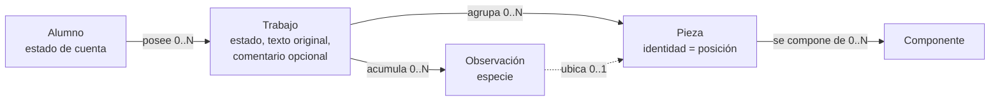
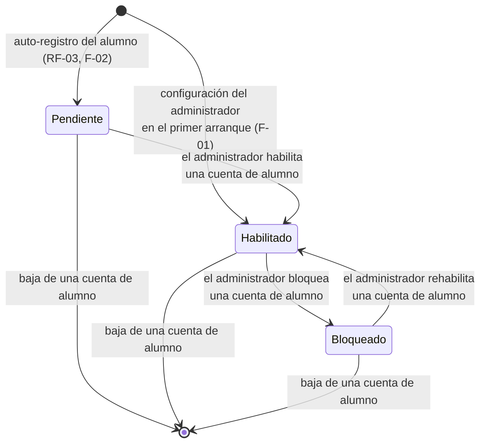
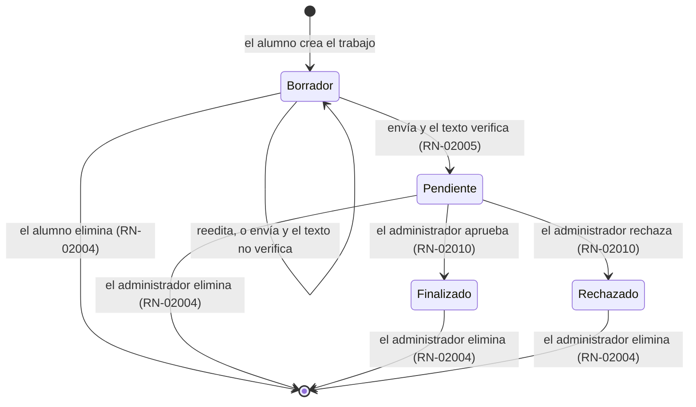
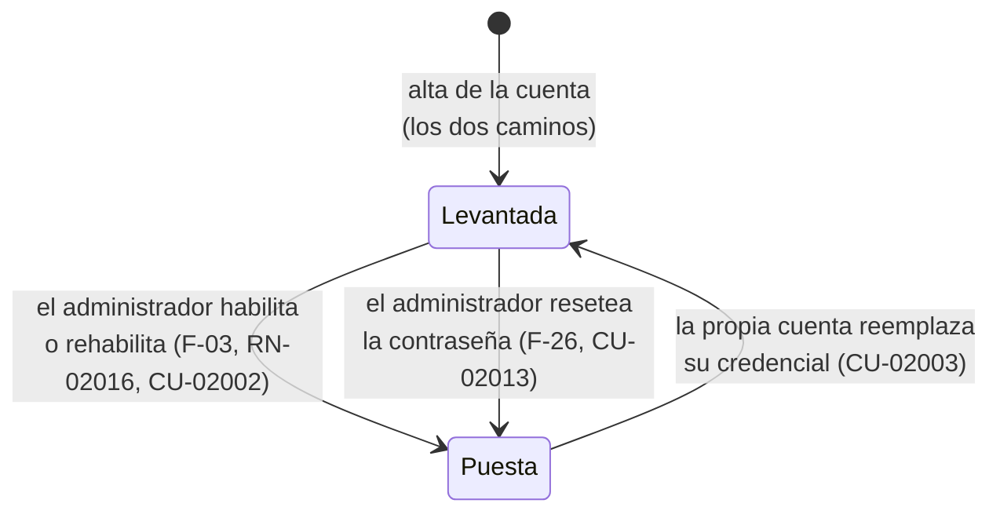

# Definición del modelo de dominio

**Producto:** Fábrica de Geometría
**Proyecto de código:** GeometriaFactory-Domain
**Documento:** Definicion-Modelo-De-Dominio.md
**Versión:** 1.10
**Estado:** Aprobado
**Fecha:** 2026-08-11
**Autor:** Analista Funcional + API Designer (AG-02)
**Trazabilidad upstream:** `PRODUCT-INTAKE-Fabrica-De-Geometria.md` **1.14** §4 (capacidades **F-01**, F-02, F-03, **F-04** precisada, F-07, F-08, F-12, F-21, F-22, F-23, F-24 y **F-26**), §15 (etapas `c` y `d`), §4.1 (las **dieciséis** reglas de negocio con su enunciado, con **RN-02016** nueva del intake 1.13), §17.1.P.4 · GeometriaFactory-Infrastructure (sellos de tiempo del trabajo), §7 (**CL-7** reescrito), §9 (**X-2** retirada), §4.2 (modelo de estados del trabajo y sus tres consecuencias aceptadas), §17.1.P.1 · GeometriaFactory-Domain, §17.1.P.2 · GeometriaFactory-Domain (los **nueve** invariantes con su enunciado, con **INV-08** adoptado e **INV-09** nuevo), §17.1.P.3 · GeometriaFactory-Domain, §17.1.P.4 · GeometriaFactory-Domain, §17.1.P.5 · GeometriaFactory-Domain, §17.1.P.11 · GeometriaFactory-Domain, §14 (contratos entre proyectos de código), §6 (flujos 2 y 2.1), §7 (casos límite), §20 (los **ocho** escenarios `E-1` a `E-8`); `00-Contexto/Vision-Producto.md` §9; `00-Contexto/Alcance-Producto.md` §4.1 y §5; `01-Necesidades-Negocio/Necesidades-Negocio.md` §2
**Trazabilidad downstream:** `05-Arquitectura-Tecnica` y `06-Backlog-Tecnico` de GeometriaFactory-Domain; `08-Calidad-Y-Pruebas`

---

## Tabla de contenido

- [1. Qué es este documento y qué no es](#1-qué-es-este-documento-y-qué-no-es)
- [2. Las cinco entidades del dominio](#2-las-cinco-entidades-del-dominio)
  - [2.1 Alumno](#21-alumno)
  - [2.2 Trabajo](#22-trabajo)
  - [2.3 Pieza](#23-pieza)
  - [2.4 Componente](#24-componente)
  - [2.5 Observación](#25-observación)
- [3. Relaciones y cardinalidades](#3-relaciones-y-cardinalidades)
- [4. Invariantes del dominio](#4-invariantes-del-dominio)
  - [4.1 Los nueve invariantes vigentes](#41-los-nueve-invariantes-vigentes)
  - [4.2 INV-08, del candidato de esta categoría al invariante adoptado](#42-inv-08-del-candidato-de-esta-categoría-al-invariante-adoptado)
  - [4.3 Correspondencia con las dieciséis reglas de negocio](#43-correspondencia-con-las-dieciséis-reglas-de-negocio)
- [5. Transiciones de estado](#5-transiciones-de-estado)
  - [5.1 Estado de la cuenta del alumno](#51-estado-de-la-cuenta-del-alumno)
  - [5.2 Estado del trabajo](#52-estado-del-trabajo)
  - [5.3 Marca de cambio de contraseña pendiente](#53-marca-de-cambio-de-contraseña-pendiente)
- [6. Semántica derivada y semántica guardada](#6-semántica-derivada-y-semántica-guardada)
- [7. Fronteras del dominio](#7-fronteras-del-dominio)
- [8. Referencia al glosario](#8-referencia-al-glosario)
- [9. Trazabilidad](#9-trazabilidad)
- [10. Control de cambios](#10-control-de-cambios)

---

## 1. Qué es este documento y qué no es

Este es el documento de concepto central de `GeometriaFactory-Domain`. Fija el vocabulario, la semántica y los elementos del modelo de dominio del producto: qué entidades existen, qué significa cada atributo, qué invariantes se sostienen siempre y qué transiciones de estado son admisibles.

**No es un modelo de persistencia.** Este proyecto de código no conoce el motor de datos, ni el protocolo de transporte, ni ninguna biblioteca de serialización: no tiene dependencias (PRODUCT-INTAKE §17.1.P.1 · GeometriaFactory-Domain) y su persistencia está declarada como «no aplica» (§17.1.P.4 · GeometriaFactory-Domain). El modelo de datos que refleja a estas entidades lo materializa `GeometriaFactory-Infrastructure`, y por eso `Modelo-Datos/Modelo-Conceptual.md` queda omitido en esta sección, según la regla de inclusión por tipo D8 `library` y el flag `tiene_persistencia` == false.

Tampoco fija nombres de tipos ni de espacios de nombres: el intake declara que quedan abiertos y se validan en el punto de control de la etapa `a` (§17.1.P.11 · GeometriaFactory-Domain). Acá los conceptos se nombran en lenguaje de dominio.

El estilo del modelo está decidido aguas arriba y no se rediscute: entidades con invariantes explícitas, con el modelo anémico y las entidades del proveedor de persistencia descartados como alternativas (§17.1.P.2 · GeometriaFactory-Domain).

## 2. Las cinco entidades del dominio

Las cinco entidades son las que el intake declara para este proyecto de código: Alumno, Trabajo, Pieza, Componente y Observación (§13, rol de `GeometriaFactory-Domain`).

### 2.1 Alumno

Persona de la comisión que obtiene identidad propia dentro del laboratorio y a la que pertenecen trabajos. El administrador del laboratorio es la cuenta única de la instancia y no es un alumno; el dominio lo distingue por su papel, no por una jerarquía de permisos configurables.

| Atributo | Semántica | Restricción conceptual |
| --- | --- | --- |
| Identificador | Identidad propia del alumno dentro de la instancia | Presente desde el alta; no se reutiliza |
| Correo | Dato con el que la persona se registra y con el que después se identifica al ingresar | Obligatorio y **único en todo el sistema** (INV-01, RN-02002). Es además el texto que el administrador debe escribir para confirmar una baja (RN-02007) |
| Nombre | Nombre de pila declarado en el registro | Obligatorio |
| Apellido | Apellido declarado en el registro | Obligatorio |
| Papel | `Alumno` o `Administrador`. Son dos papeles fijos, sin permisos configurables | Conjunto cerrado (RN-02001, INV-05) |
| Estado de cuenta | `Pendiente`, `Habilitado` o `Bloqueado` | Conjunto cerrado. **El valor inicial depende del camino de alta**: `Pendiente` en el auto-registro del alumno y `Habilitado` en la configuración del administrador (§5.1) |
| Credencial derivada | Valor derivado de la contraseña, que el dominio recibe ya derivado y nunca en claro | En el auto-registro, **sin valor mientras la cuenta está `Pendiente`, y con valor desde el acto de habilitación**, que la fija con la provisoria que el sistema produce (RN-02016). En la configuración del administrador **nace con valor**, porque ese acto incluye su contraseña |
| Cambio de contraseña pendiente | **Marca** que declara que la credencial vigente de la cuenta es una **contraseña provisoria** que el sistema produjo al **habilitarla** (RN-02016) o al **resetear su contraseña** (RN-02014) y que la cuenta todavía no reemplazó | Puesta o levantada, sin valores intermedios. Nace **levantada** en los dos caminos de alta. La ponen **las dos** operaciones que producen una contraseña provisoria —la **habilitación** (CU-02002, RN-02016) y el **reseteo** (CU-02013, RN-02014)— y la levanta **únicamente** el reemplazo hecho por la propia cuenta (CU-02003). Mientras está puesta, la cuenta no ejerce ninguna otra capacidad (INV-09, RN-02013) |
| Fecha de alta | Momento en que la cuenta se constituyó | La provee el consumidor: el dominio no lee el reloj |

**Sobre el nombre de la marca.** El intake la nombra en prosa —la cuenta «queda marcada como *con cambio de contraseña pendiente*» (§4.1, RN-02012)— y no le da nombre de atributo. **Decisión derivada de esta categoría**: se adopta como nombre del atributo la misma forma con la que la fuente la nombra, «cambio de contraseña pendiente», para no acuñar un término nuevo donde el producto ya tiene uno. Su forma calificada obligatoria es «marca de cambio de contraseña pendiente» cuando se habla del atributo, porque `Pendiente` a secas nombra un estado de cuenta y un estado de trabajo (`Vision-Producto.md` §9.2).

**Ejemplo de instancia.** Una alumna se registra con su correo, su nombre y su apellido y no elige contraseña: queda con papel `Alumno`, cuenta `Pendiente`, credencial derivada sin valor y ningún trabajo (PRODUCT-INTAKE §6, flujo 1).

**Segundo ejemplo, el del otro camino.** En el primer arranque de la instancia, el docente configura su cuenta con su correo, su nombre, su apellido y su contraseña: queda con papel `Administrador`, cuenta **`Habilitado`**, credencial derivada con valor, marca de cambio de contraseña pendiente levantada y ningún trabajo, y entra en el acto (PRODUCT-INTAKE §4, F-01, y §15, etapa `c`).

**Tercer ejemplo, el del reseteo.** Una alumna con cuenta `Habilitado` y tres trabajos —uno en `Borrador`, uno en `Rechazado` con su comentario y uno en `Finalizado`— olvida su contraseña. El administrador la resetea y **el sistema produce** una provisoria: la cuenta conserva su identificador, su correo, su nombre, su apellido, su papel, su estado `Habilitado` y **los tres trabajos con sus estados y sus comentarios**; lo único que cambia es la credencial derivada, que pasa a la provisoria, y la marca de cambio de contraseña pendiente, que queda puesta (PRODUCT-INTAKE §4, F-26; §4.1, RN-02012; §7, CL-7).

### 2.2 Trabajo

Unidad que el alumno carga y entrega en el laboratorio: nombre, fecha, descripción y el texto que produjo su Actividad 1. Tiene identificador propio, dueño y estado. No es una unidad de entrega en el sentido normativo del framework: es un registro de datos y no se despliega (`Vision-Producto.md` §9.1 y §9.3).

| Atributo | Semántica | Restricción conceptual |
| --- | --- | --- |
| Identificador | Identidad propia del trabajo | Presente desde la creación |
| Dueño | Alumno al que pertenece el trabajo | Obligatorio y no transferible (INV-02) |
| Nombre | Título que el alumno le da a su trabajo | Obligatorio |
| Fecha | Fecha que el alumno declara para el trabajo | Obligatoria; es dato del alumno, no del reloj del sistema |
| Fecha de creación | Momento en que el trabajo quedó constituido | Obligatoria y **no se reescribe**. La **aporta el consumidor**, como la fecha de alta del alumno: el dominio no lee ningún reloj (PRODUCT-INTAKE §17.1.P.4 · GeometriaFactory-Infrastructure) |
| Fecha de última modificación | Momento del último cambio sobre el trabajo | Obligatoria; nace igual a la de creación y la **aporta el consumidor** en cada cambio. **No se confunde con `Fecha`**, que la escribe el alumno (PRODUCT-INTAKE §17.1.P.4 · GeometriaFactory-Infrastructure) |
| Descripción | Texto libre con el que el alumno explica qué modeló | Admite vacío |
| Texto original | El texto que el alumno pegó, tal como lo emitió su programa | Se conserva íntegro y nunca se reescribe (RN-02008) |
| Estado | `Borrador`, `Pendiente`, `Finalizado` o `Rechazado` | Conjunto cerrado de cuatro valores, con `Finalizado` y `Rechazado` terminales (§5.2, INV-07) |
| Conjunto de piezas | Resultado de la interpretación del texto original | Vacío mientras el texto no haya sido interpretado. **Admite huecos**: una figura que no se pudo reconstruir deja su posición reservada |
| Cantidad de figuras del conjunto raíz | Cuántas figuras trae el texto interpretado, **incluidas las que no se pudieron reconstruir** | Es el rango de posiciones válidas del trabajo. Sin ella, una observación sobre una figura no reconstruida no tendría contra qué validarse (RN-02009) |
| Observaciones | Lo que la interpretación y la verificación de valores emitieron sobre este trabajo | Vacío admisible |
| Comentario del administrador | Texto libre y opcional que el administrador deja al aprobar o al rechazar | A lo sumo uno, porque los dos desenlaces son terminales. **No es una observación y no es una calificación** (`Vision-Producto.md` §9.1) |

**Ejemplo de instancia.** Un trabajo con el texto del escenario E-2 —un `Ortoedro(7, 7, 21)` con la clave `Tapas` y dos comas finales— queda con una pieza, cuatro laterales, dos bases, una observación de especie advertencia por el volumen y, tras el envío, en estado `Pendiente` a la espera de la revisión del administrador (PRODUCT-INTAKE §20.E-2 y §6, flujo 2).

### 2.3 Pieza

Cada figura del conjunto raíz del trabajo. **Su identidad es su posición en ese conjunto**, porque el dato del alumno no trae identificador propio, y esa posición alcanza para seleccionarla y resaltarla (PRODUCT-INTAKE §17.1.P.11 · GeometriaFactory-Domain punto 2).

| Atributo | Semántica | Restricción conceptual |
| --- | --- | --- |
| Posición | Lugar que la figura ocupa en el conjunto raíz del trabajo. **Es su identidad** | Obligatoria, estable, única y dentro del rango del conjunto raíz. **No se recalcula**: una pieza conserva la posición de su figura en el texto del alumno, aunque otras figuras del mismo conjunto no se hayan podido reconstruir |
| Tipo | Discriminante que el texto del alumno declara: `Cilindro`, `Cubo`, `Ortoedro`, `Rectangulo`, `Cuadrado`, `Circulo` | Un tipo fuera del conjunto conocido produce una observación de especie error de validación (RN-02009) |
| Área declarada | El valor de área que trae el texto del alumno | Se guarda tal cual, sin corregir |
| Área derivada | El valor de área que se recalcula desde las dimensiones que el propio texto declara | Se guarda por separado del declarado |
| Volumen declarado | El valor de volumen que trae el texto del alumno | Se guarda tal cual, sin corregir. No aplica a las figuras planas |
| Volumen derivado | El valor de volumen recalculado desde las dimensiones | Se guarda por separado del declarado. No aplica a las figuras planas |
| Componentes | Figuras planas que forman la pieza | Vacío admisible en las piezas planas del conjunto raíz |

Guardar por separado el valor declarado y el derivado es una decisión tomada aguas arriba: es lo que hace verificable la comparación sin recalcularla en cada consulta (§17.1.P.11 · GeometriaFactory-Domain punto 3).

**Ejemplo de instancia.** La pieza de posición 1 del escenario E-1 es un `Cubo` con área declarada 36.00 y área derivada 54.00, volumen declarado 27.00 y volumen derivado 27.00, y seis componentes de tipo `Cuadrado` (PRODUCT-INTAKE §20.E-1 y §20.E-3).

### 2.4 Componente

Figura plana que forma parte de una pieza: tapa, cara, base, lateral o lado. Es el término del glosario del dominio del cliente (`Vision-Producto.md` §9.1) y el dominio lo conserva sin renombrarlo.

| Atributo | Semántica | Restricción conceptual |
| --- | --- | --- |
| Posición | Lugar que ocupa dentro del conjunto de componentes de su pieza | Obligatoria y contigua desde 0 |
| Papel | Qué es el componente respecto de su pieza: tapa, cara, base, lateral o lado | Conjunto cerrado del vocabulario del emisor |
| Tipo | Discriminante que el texto declara: `Circulo`, `Cuadrado`, `Rectangulo`, `RectanguloDesarrollado` | Dos discriminantes distintos pueden nombrar la misma forma; el dominio no los unifica ni los corrige |
| Dimensiones declaradas | Los valores dimensionales que el texto trae para ese componente | Se comprueban por existencia, no por veracidad geométrica (PRODUCT-INTAKE §20.E-6) |
| Área declarada | El valor de área que trae el texto para ese componente | Se guarda tal cual |

**Ejemplo de instancia.** El componente de posición 0 del cilindro del escenario E-1 es un `Circulo` con papel de tapa, radio 3.00 y área declarada 28.27.

### 2.5 Observación

Término **superordinado** de lo que el producto emite al interpretar el texto del alumno y al verificar sus valores. Agrupa dos especies con efecto distinto sobre el envío del trabajo: la **advertencia**, que no impide que el trabajo pase a estado `Pendiente`, y el **error de validación**, que sí lo impide y lo deja en `Borrador` (`Vision-Producto.md` §9.1; PRODUCT-INTAKE §4.1, RN-02005). Al modelarla como entidad, el superordinado es el término correcto: la entidad es una y su especie es un atributo.

| Atributo | Semántica | Restricción conceptual |
| --- | --- | --- |
| Especie | `Advertencia` o `Error de validación` | Conjunto cerrado. Sólo la segunda impide el paso a estado `Pendiente` (RN-02005) |
| Posición de pieza | Figura del conjunto raíz sobre la que se emite la observación | Obligatoria cuando la observación es atribuible a una figura (RN-02009). Es la posición **en el texto**, de modo que una figura que no se pudo reconstruir sigue siendo ubicable; debe pertenecer al rango del conjunto raíz |
| Campo | Campo del dato del alumno sobre el que se emite | Obligatorio en toda observación de especie error de validación (RN-02009) |
| Valor declarado | El valor que trae el texto del alumno | Obligatorio en las advertencias de discrepancia de valor |
| Valor derivado | El valor recalculado desde las dimensiones | Obligatorio en las advertencias de discrepancia de valor |

**Ejemplo de instancia.** Sobre el escenario E-5, la observación es de especie error de validación, con posición de pieza 1 y campo `Tipo`; el trabajo queda en `Borrador` con su error localizado y el alumno corrige y vuelve a enviar (PRODUCT-INTAKE §20.E-5 y §6, flujo 2).

**La observación no se confunde con el comentario del administrador**, que es un atributo del trabajo: la observación la emite el producto al interpretar el texto y hay tantas como defectos; el comentario lo escribe una persona y hay a lo sumo uno.

## 3. Relaciones y cardinalidades

| Relación verbalizada | Cardinalidad |
| --- | --- |
| Un alumno posee ninguno, uno o muchos trabajos; todo trabajo pertenece a exactamente un alumno | Alumno (1) —— (0..N) Trabajo |
| Un trabajo agrupa ninguna, una o muchas piezas; toda pieza pertenece a exactamente un trabajo | Trabajo (1) —— (0..N) Pieza |
| Una pieza se compone de ninguno, uno o muchos componentes; todo componente pertenece a exactamente una pieza | Pieza (1) —— (0..N) Componente |
| Un trabajo acumula ninguna, una o muchas observaciones; toda observación pertenece a exactamente un trabajo | Trabajo (1) —— (0..N) Observación |
| Una observación puede referirse a la pieza de una posición del trabajo, o al trabajo entero cuando el defecto no es atribuible a una figura | Observación (0..N) —— (0..1) Pieza |
| Un trabajo lleva a lo sumo un comentario del administrador, que es un atributo suyo y no una entidad | Trabajo (1) —— (0..1) comentario |

Un trabajo sin piezas y sin observaciones es un estado normal: es el trabajo recién creado, antes de que su texto se haya interpretado (PRODUCT-INTAKE §4.2).

## 4. Invariantes del dominio

Un invariante es una afirmación que tiene que ser verdadera **siempre**, sin importar la operación ni quién la ejecute; es lo que el dominio hace cumplir aunque la petición llegue por fuera de la interfaz (PRODUCT-INTAKE §17.1.P.2 · GeometriaFactory-Domain). Su verificación sin infraestructura es exactamente lo que el intake declara como motivo para no adoptar un modelo anémico.

### 4.1 Los nueve invariantes vigentes

Transcriptos de PRODUCT-INTAKE §17.1.P.2 · GeometriaFactory-Domain, que a su vez toma los siete primeros de RT §7.3 y agrega los dos últimos por decisión del Product Owner del 2026-08-09.

| Id | Enunciado | Regla que sostiene | Dónde se ejerce en esta categoría |
| --- | --- | --- | --- |
| INV-01 | El correo del alumno es único en todo el sistema | RN-02002 | CU-02001, CU-02012 |
| INV-02 | Un alumno sólo accede a sus propios trabajos. No existe consulta que devuelva trabajos de otro alumno a un rol de alumno | RN-02003 | CU-02005, CU-02009 |
| INV-03 | Un trabajo eliminado por un alumno estaba en `Borrador` y le pertenecía | RN-02004 | CU-02009 |
| INV-04 | Un trabajo `Finalizado` tiene el texto interpretado sin errores, y puede tener advertencias | RN-02005 | CU-02008, CU-02010 |
| INV-05 | Existe exactamente un administrador configurado; su alta sólo es posible mientras no exista ninguno | RN-02001 | CU-02012, CU-02002 |
| INV-06 | Un alumno con cuenta `Pendiente` o `Bloqueado` no obtiene acceso | RN-02006 | CU-02004 |
| INV-07 | Un trabajo en `Finalizado` o en `Rechazado` no cambia de estado ni de contenido | RN-02010 | CU-02008, CU-02010 |
| INV-08 | La cuenta con papel `Administrador` está **siempre** `Habilitado`: nace habilitada, ninguna operación la lleva a `Pendiente` ni a `Bloqueado`, y no admite baja. Toda cuenta con papel `Alumno` nace `Pendiente` | RN-02001, RN-02006 | CU-02001, CU-02002, CU-02012, CU-02013 |
| INV-09 | Una cuenta con la marca de **cambio de contraseña pendiente** no ejerce ninguna capacidad del sistema salvo cambiar su propia contraseña. La ponen **la habilitación y el reseteo** del administrador, y la levanta **únicamente** el cambio efectivo hecho por la propia cuenta | RN-02012, RN-02013, **RN-02016** | CU-02013, **CU-02002**, CU-02003, CU-02004 |

Tres precisiones de ubicación, para que ninguna capa busque en el lugar equivocado:

- **INV-01 es del sistema y el dominio no lo puede verificar solo.** La unicidad se afirma sobre el conjunto de alumnos, y una entidad no conoce a ese conjunto. El dominio declara la condición y exige que el consumidor la haya resuelto; quien la ejerce efectivamente es `GeometriaFactory-Application` con el puerto de repositorio.
- **INV-06 se cumple aunque el acceso se materialice afuera.** El dominio modela **la condición**; el mecanismo por el que el acceso se emite vive en `GeometriaFactory-Infrastructure` y en `GeometriaFactory-Api`.
- **INV-09 se ejerce en un solo lugar del dominio, y es una decisión derivada declarada.** El enunciado alcanza a *todas* las capacidades del sistema, y el dominio no tiene una puerta única por la que pasen todas. La decisión de esta categoría es concentrar la guarda en **CU-02004**, la evaluación de admisibilidad: una cuenta con la marca puesta **no es admisible**, de modo que ninguna otra capacidad llega a ejercerse porque ninguna se ejerce sin admisión resuelta. El fundamento es el mismo con el que INV-06 vive en CU-02004 y no repetido en cada caso de uso. **Consecuencia para la capa que expone**: si alguna vez existiera un camino que ejerza una capacidad sin pasar por la admisibilidad, ese camino tendría que volver a comprobar la marca, y esa comprobación no sería del dominio.

**Traza del enunciado de INV-09, que esta tabla transcribe hoy sin ninguna diferencia con su fuente.** Hubo un desfase y está cerrado. `PRODUCT-INTAKE` §17.1.P.2 · GeometriaFactory-Domain decía, hasta su versión **1.13**, que la marca «la pone **únicamente** el reseteo del administrador»: era la redacción de la **1.7** y quedó desactualizada por la propia 1.13, cuando **RN-02016** —en §4.1 de esa misma versión— declaró que habilitar una cuenta la deja con cambio de contraseña pendiente y citó a INV-09 al hacerlo. Esta tabla transcribió entonces **la condición que la fuente decidió** y dejó constancia del desfase para que el orquestador lo cerrara aguas arriba. **Lo cerró: el intake `1.14`, del 2026-08-09, reescribió el enunciado de INV-09** —«la marca la ponen **únicamente** las dos operaciones que producen una contraseña provisoria: el **reseteo** (RN-02014) y la **habilitación** (RN-02016)»— y lo registró en la fila 1.14 de su control de cambios, corrección **(a)**. **Desde la 1.14 la letra de la fuente y la de esta tabla coinciden**, y ya no hay diferencia deliberada que declarar. Lo que el invariante prohíbe —que una cuenta marcada ejerza cualquier capacidad salvo cambiar su contraseña— no cambió en ningún momento.

INV-03 está deliberadamente acotado a la eliminación **por parte de un alumno**: el administrador elimina cualquier trabajo que ve, en cualquier estado, de modo que un enunciado sin ese recorte sería falso (PRODUCT-INTAKE §17.1.P.2 · GeometriaFactory-Domain, decisión del 2026-08-08).

### 4.2 INV-08, del candidato de esta categoría al invariante adoptado

**INV-08 lo propuso esta categoría y el Product Owner lo adoptó.** Nació acá como candidato, declarado no vigente y no proveniente de ninguna fuente, porque el modelo sostenía una propiedad permanente que ninguno de los siete invariantes de entonces enunciaba, y **la familia de defectos que esa ausencia habilitaba ya se había abierto dos veces por dos puertas distintas**: el P0, que dejaba nacer `Pendiente` a la cuenta de administrador, y el P1 de la ronda r3, que permitía bloquearla después. Los dos terminaban en la misma condición sin salida.

`PRODUCT-INTAKE` §17.1.P.2 · GeometriaFactory-Domain lo incorpora con su enunciado ampliado al ciclo de vida completo y lo rotula «**adoptado**», con la evidencia de las dos puertas como fundamento. **Desde esa incorporación es un invariante vigente y figura en la tabla de §4.1**; esta subsección se conserva —en lugar de borrarse— para dejar registrada la trazabilidad del recorrido, porque varias categorías aguas abajo todavía lo citan como «candidato no vigente» y la corrección tiene que poder verificarse contra un lugar concreto.

Lo que cambia en la práctica: la propiedad deja de sostenerse sólo operación por operación —CU-02001 y CU-02012 fijando cada uno su estado inicial y rechazando el del otro, y CU-02002 rechazando las cuatro operaciones sobre la cuenta de administrador— y pasa a ser una condición permanente que **cierra la familia entera en lugar de tapar cada puerta**. Las guardas de cada caso de uso no se retiran: siguen siendo el lugar donde el invariante se ejerce.

**Ningún invariante candidato queda abierto en esta versión.** Si esta categoría propusiera otro, iría acá con el mismo tratamiento: enunciado, qué expresa y estado.

### 4.3 Correspondencia con las dieciséis reglas de negocio

Los invariantes **no son reglas distintas** de las de PRODUCT-INTAKE §4.1: son las mismas vistas desde el dominio. La regla declara qué decidió el negocio; el invariante declara qué condición sobre los datos no puede romperse nunca.

| Regla | Invariante que la expresa como condición permanente |
| --- | --- |
| RN-02001 | INV-05 |
| RN-02002 | INV-01 |
| RN-02003 | INV-02 |
| RN-02004 | INV-03 |
| RN-02005 | INV-04 |
| RN-02006 | INV-06 |
| RN-02010 | INV-07 |
| RN-02012 | INV-09 |
| RN-02013 | INV-09 |
| RN-02016 | INV-09 |
| RN-02007, RN-02008, RN-02009, RN-02014 | **Ninguno.** Describen comportamientos —la baja física, la conservación del texto, la ubicación del error, la producción de la contraseña provisoria— y no condiciones permanentes sobre el estado. **RN-02014 además no se ejerce en este proyecto de código**: el valor le llega ya derivado |
| RN-02015 | **Ninguno.** Enuncia la **ausencia** de una precondición sobre una operación —resetear no exige cuenta habilitada—, y una ausencia no es una condición sobre los datos |
| RN-02011 | **Ninguno.** Es una regla de alcance de consulta, no una condición sobre los datos |

**Un invariante para tres reglas, y no es un error de la tabla.** INV-09 sostiene a RN-02012, a RN-02013 y —desde `PRODUCT-INTAKE` 1.13— a **RN-02016**. Las dos primeras son las dos mitades de una misma condición: RN-02012 dice qué **conserva** el reseteo —la cuenta, su habilitación, su papel y todos sus trabajos— y RN-02013 dice qué **no puede** la cuenta mientras la marca esté puesta. El invariante enuncia la segunda mitad como condición permanente, y la primera queda enunciada por diferencia: si lo único que la marca impide es ejercer capacidades, entonces nada más se pierde en el reseteo. **RN-02016 no agrega una mitad nueva: agrega un segundo origen** a la marca que las otras dos gobiernan, y por eso comparte invariante en lugar de estrenar uno.

**RN-02001 e INV-08.** La tabla asigna INV-05 a RN-02001 porque es el invariante que expresa su núcleo, la unicidad del administrador. INV-08 la sostiene también, en su otra mitad —el estado permanente de esa cuenta—, y `PRODUCT-INTAKE` §17.1.P.2 · GeometriaFactory-Domain lo declara sobre RN-02001 y RN-02006. Ninguna de las dos asignaciones desplaza a la otra.

## 5. Transiciones de estado

### 5.1 Estado de la cuenta del alumno

Los tres estados están declarados en PRODUCT-INTAKE §17.1.P.5 · GeometriaFactory-Domain. La baja no es un estado: es la desaparición de la cuenta y de sus trabajos (RN-02007).

**Hay dos caminos de alta, con estados iniciales distintos**, y esa distinción es la que hace arrancable a la instancia. Las fuentes atan el estado inicial `Pendiente` al **auto-registro del alumno**: la capacidad que lo declara es «F-02 · Registro de alumno con correo, nombre y apellido, sin elegir contraseña», y el flujo 1 de PRODUCT-INTAKE §6 lo recorre —el alumno se registra, el sistema le dice que su cuenta quedó pendiente de autorización, y el docente la habilita después—. Y declaran por separado la **configuración de la cuenta de administrador en el primer arranque** (F-01, con origen en RF-01 y RF-02), cuyo guion de la etapa `c` exige entrar inmediatamente después de configurar. La lectura es de esta categoría; ninguna fuente accesible transcribe una tabla de transiciones de cuenta de la que copiarla.

**Las cuatro operaciones sobre una cuenta alcanzan sólo a las cuentas con papel `Alumno`.** No es una restricción de este documento: es el enunciado literal de la capacidad, «F-03 · Habilitar, bloquear, rehabilitar y dar de baja física cuentas **de alumno** desde el panel del administrador» (PRODUCT-INTAKE §4). Las transiciones de abajo se leen todas con ese sujeto.

| Desde | Hacia | Sobre qué cuenta | Quién es el sujeto de la regla | Condición |
| --- | --- | --- | --- | --- |
| — | `Pendiente` | Papel `Alumno` | El alumno que se auto-registra | Estado inicial **del auto-registro**, no negociable en ese camino (CU-02001) |
| — | `Habilitado` | Papel `Administrador` | El docente que configura la instancia | Estado inicial **de la configuración del administrador**, y sólo mientras no exista ninguna cuenta con ese papel (CU-02012, RN-02001). Nace habilitada porque es la cuenta que habilita a las demás: ninguna anterior podría habilitarla a ella |
| `Pendiente` | `Habilitado` | **Papel `Alumno`** | El administrador | Acto explícito. No hay habilitación automática (F-03). **Fija la credencial derivada provisoria y pone la marca de §5.3** (RN-02016) |
| `Habilitado` | `Bloqueado` | **Papel `Alumno`** | El administrador | Acto explícito (F-03). **No procede sobre la cuenta de administrador** |
| `Bloqueado` | `Habilitado` | **Papel `Alumno`** | El administrador | Acto explícito de rehabilitación (F-03). **Fija una credencial derivada provisoria nueva y pone la marca** (RN-02016). **No procede sobre la cuenta de administrador**, que nunca puede estar en ese estado |
| Cualquiera | (deja de existir) | **Papel `Alumno`** | El administrador | Baja, que arrastra los trabajos del alumno (RN-02007, F-03). **No procede sobre la cuenta de administrador** (RN-02001) |

**El reseteo de contraseña no es una transición de esta máquina**, y conviene decirlo acá porque es donde se lo va a buscar. El administrador que resetea la contraseña de un alumno **no cambia su estado de cuenta**: la cuenta queda exactamente en el estado en que estaba —`Pendiente`, `Habilitado` o `Bloqueado`— y conserva su papel, su identidad y todos sus trabajos con sus estados y sus comentarios. Lo que el reseteo cambia son dos atributos de la cuenta y ninguno de esta máquina: la credencial derivada, que pasa a la provisoria, y la marca de cambio de contraseña pendiente, que queda puesta (RN-02012, F-26, CU-02013). **Resetear no es dar de baja y no dispara RN-02007**: ningún trabajo se elimina.

Transiciones inadmisibles: de cuenta `Pendiente` a `Bloqueado` sin haber pasado por `Habilitado` no está declarada, y el dominio no la admite; ningún estado transiciona hacia `Pendiente`; **ninguna cuenta de alumno nace `Habilitado`**, como ninguna cuenta de administrador nace `Pendiente`; y **ninguna de las cuatro operaciones procede sobre la cuenta de administrador**, que no se habilita porque ya lo está, no se bloquea, no se rehabilita y no se da de baja.

**Por qué el bloqueo de la cuenta de administrador es tan inadmisible como su baja.** Es la misma condición sin salida del primer arranque, alcanzada por otra puerta: una cuenta bloqueada no obtiene acceso por INV-06, el administrador es el único que puede desbloquear, y es único por RN-02001, de modo que la operación no tiene inversa posible. El daño no se agota en que una persona no entre: sin administrador nadie aprueba ni rechaza —CU-02010 y CU-02011 exigen ese papel—, así que **todos los trabajos quedan en estado `Pendiente` para siempre y el circuito de revisión completo se detiene**, que es la razón de ser del producto. Una cuenta única bloqueada equivale a ninguna.

Consecuencia sobre la credencial: en el auto-registro, la credencial derivada se fija **en el acto mismo de la habilitación**, con la contraseña provisoria que el sistema produce, y la cuenta queda con la marca de cambio de contraseña pendiente puesta (**RN-02016**, `PRODUCT-INTAKE` 1.13 §4.1). Hasta la 1.12 se fijaba después, en el primer ingreso del alumno, y ésa era la única escritura **de contraseña** del producto que ocurría sin credencial; la fijación no desapareció, cambió de momento y de sujeto. **El auto-registro en sí sigue siendo anónimo** y así debe seguir: lo que RN-02016 elimina es la escritura anónima de credencial (`PRODUCT-INTAKE` **1.15** §4.1). En la configuración del administrador la credencial se aporta en el mismo acto, de modo que el camino de fijación por primera vez no le aplica y su cambio de contraseña entra por el reemplazo de CU-02003.

**Por qué esta distinción no es un detalle.** Si la cuenta del administrador naciera `Pendiente`, la única transición que la sacaría de ahí es que un administrador la habilite, y por INV-06 ella misma no obtendría acceso: no habría ninguna cuenta capaz de habilitarla y la instancia quedaría inutilizable en el primer arranque, sin salida. La versión 1.1 de este documento tenía esa generalización y es el defecto que la corrección del P0 resuelve.

### 5.2 Estado del trabajo

Cuatro estados, declarados en PRODUCT-INTAKE §4.2 y en el glosario raíz (`Vision-Producto.md` §9.1, entrada «estado del trabajo»). Dos propiedades gobiernan todo lo demás:

1. **`Borrador` significa exactamente «el texto no verificó»**, o que el trabajo recién se creó. Guardar y enviar se unificaron en **una sola acción, enviar** (F-22): el alumno no puede conservar en borrador un trabajo cuyo texto sí verifica.
2. **`Finalizado` y `Rechazado` son terminales.** Ninguna transición sale de ellos, y corregir un rechazo significa cargar un trabajo nuevo (INV-07, RN-02010).

| Desde | Hacia | Sujeto de la regla | Condición |
| --- | --- | --- | --- |
| — | `Borrador` | El alumno | Estado inicial de todo trabajo |
| `Borrador` | `Borrador` | El alumno | Reedición, o envío cuyo texto **no** verifica: quedan las observaciones de especie error de validación con su ubicación |
| `Borrador` | `Pendiente` | El alumno | Envío cuyo texto verifica: ninguna observación de especie error de validación. Las advertencias no lo impiden (RN-02005) |
| `Pendiente` | `Finalizado` | El administrador | Aprobación, facultad exclusiva. Admite comentario opcional (RN-02010) |
| `Pendiente` | `Rechazado` | El administrador | Rechazo, facultad exclusiva. Admite comentario opcional (RN-02010) |
| `Borrador` | (deja de existir) | El alumno | Eliminación de un trabajo propio, admisible **sólo** en este estado (RN-02004, INV-03) |
| `Pendiente`, `Finalizado` o `Rechazado` | (deja de existir) | El administrador | Eliminación de cualquier trabajo que ve, con borrado físico (RN-02004) |

Quién puede qué en cada estado, tomado literal de PRODUCT-INTAKE §4.2:

| Estado | Qué significa | Lo edita el alumno | Lo elimina el alumno | Lo ve el administrador | Comentario |
| --- | --- | --- | --- | --- | --- |
| `Borrador` | El texto todavía no verifica, o el trabajo recién se creó | Sí | Sí | **No** (RN-02011) | — |
| `Pendiente` | Enviado con el texto interpretado sin errores, a la espera de revisión | No | No | Sí | — |
| `Finalizado` | Aprobado por el administrador. Terminal | No | No | Sí | opcional |
| `Rechazado` | Rechazado por el administrador. Terminal | No | No | Sí | opcional |

Transiciones inadmisibles: cualquier salida de `Finalizado` o de `Rechazado` que no sea la eliminación por el administrador; el paso a estado `Pendiente` con al menos una observación de especie error de validación; la aprobación o el rechazo por parte de un alumno; la reedición o la eliminación por el alumno fuera de `Borrador`; y el retorno de `Pendiente` a `Borrador`, que ninguna fuente declara.

### 5.3 Marca de cambio de contraseña pendiente

Es la tercera máquina del modelo y la más chica: dos valores y **tres transiciones**, dos de las cuales llevan al mismo destino desde el mismo origen y se distinguen sólo por el acto que las dispara. Se declara aparte de §5.1 porque **es ortogonal al estado de cuenta**: la marca se pone y se levanta sin que el estado de cuenta cambie, y el estado de cuenta cambia sin que la marca se toque.

| Desde | Hacia | Sujeto de la regla | Condición |
| --- | --- | --- | --- |
| — | Levantada | El alumno que se auto-registra, o el docente que configura la instancia | Valor inicial en los dos caminos de alta: ninguna cuenta nace con contraseña provisoria |
| Levantada | Puesta | El administrador | **Habilitación o rehabilitación** de una cuenta de alumno (F-03, **RN-02016**). Fija la provisoria que el sistema produce |
| Levantada | Puesta | El administrador | Reseteo de la contraseña de una **cuenta de alumno** (F-26, RN-02012) |
| Puesta | Levantada | La propia cuenta | Reemplazo efectivo de la credencial derivada, hecho por quien presenta la vigente (RN-02013, CU-02003). Es el único acto que la levanta |
| Puesta | Puesta | El administrador | Un segundo reseteo sobre una cuenta ya reseteada es admisible y sin efecto sobre la marca: cambia la contraseña provisoria y la marca sigue puesta. Lo mismo vale para la rehabilitación de una cuenta que ya la tenía puesta (CU-02002 FA-04) |

Transiciones inadmisibles, y las tres importan: **la marca no la levanta el administrador**, porque la contraseña nueva la elige el alumno y el administrador no la conoce (RN-02013); **no la levanta el paso del tiempo**, porque ninguna fuente declara vencimiento de la provisoria; y **no la ponen el bloqueo ni la baja** de CU-02002, que no tocan la credencial. Esta tercera cambió con `PRODUCT-INTAKE` 1.13: hasta la 1.12 ninguna de las cuatro operaciones de ciclo de vida la ponía, y **RN-02016** hizo que dos de ellas —habilitar y rehabilitar— sí la pongan. Lo que sigue siendo inadmisible es que la pongan las otras dos.

**Qué puede una cuenta con la marca puesta.** Exactamente una cosa: reemplazar su propia credencial derivada. Cualquier otra capacidad queda fuera de su alcance mientras la marca no se levante, y el dominio lo materializa devolviendo **no admisible** en CU-02004 (INV-09, §4.1).

## 6. Semántica derivada y semántica guardada

Tres decisiones de modelado están tomadas aguas arriba y este documento las fija como semántica del dominio:

| Decisión | Qué implica en el modelo | Origen |
| --- | --- | --- |
| La identidad de la pieza es su posición en el conjunto raíz | No hay atributo identificador propio de la pieza. Reordenar el conjunto cambiaría la identidad de las piezas, de modo que el orden del texto del alumno es significativo. **La posición es la del texto y no la del conjunto de piezas adoptadas**: una figura que no se pudo reconstruir deja su posición reservada, el conjunto adoptado queda con un hueco y ninguna pieza se renumera. Es lo que permite que el escenario E-5 informe la posición 1 —la figura de tipo desconocido— sin haberla reconstruido, que es la forma de comprobar que el índice se calcula y no se informa siempre el primero | §17.1.P.11 · GeometriaFactory-Domain punto 2, PRODUCT-INTAKE §20.E-5, RN-02009 |
| El valor declarado y el derivado se guardan por separado | Son dos atributos distintos de la pieza y no uno calculado al vuelo. Es lo que permite verificar la discrepancia sin recalcularla en cada consulta, y lo que hace que la advertencia pueda mostrar los dos números | §17.1.P.11 · GeometriaFactory-Domain punto 3 |
| La familia plana o volumétrica no se guarda | Es un atributo **derivado del tipo**. `Cilindro`, `Cubo` y `Ortoedro` son volumétricos; `Rectangulo`, `Cuadrado` y `Circulo` son planos. El dominio no admite que una pieza declare una familia que su tipo contradiga | §17.1.P.11 · GeometriaFactory-Domain punto 4 |

La comparación entre valor declarado y valor derivado se decide con **tolerancia absoluta de 0.01** y nunca por igualdad exacta, porque el emisor del dato redondea a dos decimales. Ese número no es una asunción del intake: está declarado (§17.1.P.10 · GeometriaFactory-Infrastructure). El cálculo del valor derivado y la interpretación del texto **no ocurren en el dominio**: los ejecuta el validador de figuras, que vive detrás de un puerto de `GeometriaFactory-Application` y se implementa en `GeometriaFactory-Infrastructure`.

## 7. Fronteras del dominio

Lo que este proyecto de código **no** hace, declarado acá para que ninguna categoría aguas abajo lo busque en el lugar equivocado:

| Responsabilidad | Dónde vive | Origen |
| --- | --- | --- |
| Interpretar el texto del alumno y tolerar sus particularidades de formato | `GeometriaFactory-Infrastructure`, detrás de un puerto de `GeometriaFactory-Application` | §17.1.P.11 · GeometriaFactory-Application punto 1, §17.1.P.11 · GeometriaFactory-Infrastructure punto 1 |
| Calcular el valor derivado de área y de volumen | `GeometriaFactory-Infrastructure` | §17.1.P.6 · GeometriaFactory-Infrastructure |
| Guardar, consultar y listar, incluido el listado del administrador que excluye los borradores | `GeometriaFactory-Application` y `GeometriaFactory-Infrastructure` | §17.1.P.4 · GeometriaFactory-Domain, §17.1.P.10 · GeometriaFactory-Application, §17.1.P.4 · GeometriaFactory-Infrastructure |
| Verificar la unicidad del correo sobre el conjunto de alumnos | `GeometriaFactory-Application`, con el puerto de repositorio | §17.1.P.1 · GeometriaFactory-Application |
| Derivar la contraseña y emitir el acceso | `GeometriaFactory-Infrastructure` | §17.1.P.5 · GeometriaFactory-Domain, §17.1.P.5 · GeometriaFactory-Infrastructure |
| Exponer datos hacia afuera del proceso | `GeometriaFactory-Contracts` y `GeometriaFactory-Api` | §17.1.P.3 · GeometriaFactory-Domain, §17.1.P.3 · GeometriaFactory-Contracts |
| Dibujar las piezas | `GeometriaFactory-Visor` | §17.2.P.1 · GeometriaFactory-Visor |
| Leer el reloj | `GeometriaFactory-Application`, con el reloj como puerto | §17.1.P.11 · GeometriaFactory-Application punto 3 |

## 8. Referencia al glosario

El vocabulario de esta categoría vive en [`Glosario-Funcional.md`](Glosario-Funcional.md) y no acá. Los términos del modelo que ese glosario declara o referencia son: alumno, trabajo, pieza, componente, observación, advertencia, error de validación, valor declarado, valor derivado, estado del trabajo, estado de cuenta, credencial derivada, **contraseña provisoria**, **marca de cambio de contraseña pendiente**, **reseteo de contraseña**, texto original, posición de pieza, familia plana o volumétrica, papel, enviar, aprobar, rechazar y comentario.

Los términos que ya declara `00-Contexto/Vision-Producto.md` §9 se **referencian** y no se redefinen; entre ellos, los cuatro estados del trabajo, «enviar», «aprobar / rechazar», «comentario» y la forma calificada obligatoria de `Pendiente`.

## 9. Trazabilidad

| Entidad | Casos de uso que la consumen | Reglas de negocio que la restringen |
| --- | --- | --- |
| Alumno | CU-02001, CU-02002, CU-02003, CU-02004, CU-02009, CU-02012, CU-02013 | RN-02001, RN-02002, RN-02006, RN-02007, RN-02012, RN-02013, RN-02014, RN-02015, **RN-02016** |
| Trabajo | CU-02005, CU-02006, CU-02007, CU-02008, CU-02009, CU-02010 | RN-02003, RN-02004, RN-02005, RN-02008, RN-02010, RN-02011 |
| Pieza | CU-02006, CU-02007 | RN-02008, RN-02009 |
| Componente | CU-02006 | RN-02008 |
| Observación | CU-02007, CU-02008 | RN-02005, RN-02009 |

| Necesidad de negocio | Elemento del modelo que la sostiene |
| --- | --- |
| NB-00001 | Estado de cuenta, sus **dos transiciones iniciales** y el resto de su máquina; papel del administrador y la ventana única de su configuración; el reseteo de contraseña como acto del administrador que **no** toca esa máquina |
| NB-00002 | Alumno, correo único, credencial derivada, marca de cambio de contraseña pendiente, INV-06, INV-09 |
| NB-00003 | Trabajo, su dueño, su estado de cuatro valores y su identidad propia |
| NB-00004 | Pieza, componente, observación de especie error de validación y la transición de envío |
| NB-00005 | Valor declarado y valor derivado guardados por separado; observación de especie advertencia |
| NB-00006 | Identidad posicional de la pieza, que es lo que permite seleccionarla y resaltarla |
| NB-00009 | Desenlace del trabajo, terminalidad de `Finalizado` y `Rechazado`, comentario del administrador y eliminación en los estados que ve |

## 10. Control de cambios

| Versión | Fecha | Cambios |
| --- | --- | --- |
| 1.10 | 2026-08-11 | **Unificación de nomenclatura del reseteo: se resetea la contraseña de la cuenta, no la cuenta.** Corrección pedida por el Product Owner —«ese resetear cuenta hay que corregirlo por resetear clave de cuenta de usuario alumno»— y corregida primero en la fuente, `PRODUCT-INTAKE-Fabrica-De-Geometria.md` **1.28**: leído literal, «resetear la cuenta» sugiere darla de baja y volver a darla de alta, que es exactamente el remedio que **F-26** vino a reemplazar. Acá se reescriben **1** ocurrencia a «resetear / reseteo **de la contraseña** de la cuenta» y «cuenta **con la contraseña reseteada**». No cambia ninguna regla ni su verificación, y **no se toca ningún identificador** de código de error ni de regla —`RESETEO_ACOTADO_A_CUENTAS_DE_ALUMNO` y `CONTRATO_RESETEO_NO_APLICABLE_A_LA_CUENTA_DE_ADMINISTRADOR` se conservan tal cual—. |
| 1.0 | 2026-08-08 | Emisión inicial. Declara las cinco entidades del dominio con sus atributos, su semántica y un ejemplo de instancia tomado de los escenarios del intake; las cinco relaciones con sus cardinalidades; los cuatro invariantes con enunciado declarado y los dos identificadores declarados sin enunciado, con su tratamiento; las dos máquinas de estado, de cuenta y de trabajo, con sus transiciones inadmisibles; las tres decisiones de semántica derivada y guardada; y las siete fronteras que separan a este proyecto de código de sus consumidores. |
| 1.1 | 2026-08-09 | Absorbe el circuito de revisión del administrador de `PRODUCT-INTAKE` 1.3 y la resolución de las dos ambigüedades que esta categoría había elevado. **Sube minor y archiva el estado anterior** porque el documento ya es citado como insumo por otras categorías (`Master-Prompt.md` §5). **§4 reescrita**: los invariantes pasan de cuatro enunciados y dos identificadores sin enunciado a **los siete transcriptos** de §17.1.P.2 · GeometriaFactory-Domain, y §4.2 pasa de registrar la ambigüedad a declarar la correspondencia con las once reglas y las cuatro que no tienen invariante. **Corrige la atribución de INV-04**, que el intake anterior daba como «el texto original se conserva íntegro»: INV-04 enuncia que un trabajo `Finalizado` tiene el texto interpretado sin errores y sostiene a RN-02005; RN-02008 queda sin invariante asociado. **§5.2 reescrita**: cuatro estados con `Rechazado`, envío como única acción de guardado, terminalidad de los dos desenlaces, eliminación por el alumno sólo en `Borrador` y por el administrador en los tres estados que ve, más la tabla de quién puede qué. **§2.2** suma el comentario del administrador y el estado de cuatro valores; **§2.1** suma la unicidad del correo; **§2.5** ajusta el efecto de las dos especies al momento del envío y distingue observación de comentario. **§3** suma la cardinalidad del comentario; **§7** suma las fronteras de la consulta y de la unicidad del correo; **§8** y **§9** incorporan los términos nuevos, CU-02010 y NB-00009. Toda ocurrencia de `Pendiente` queda calificada según `Vision-Producto.md` §9.2. **Corrección de la ronda r1 del audit, hallazgo P1-01**: §2.3 y §6 precisan que la posición de la pieza es la de su figura **en el texto** y no se recalcula, de modo que una figura no reconstruida deja su **posición reservada** y el conjunto de piezas adoptadas admite huecos; §2.2 suma el atributo «cantidad de figuras del conjunto raíz», que es el rango contra el que se valida una posición y sin el cual una observación sobre una figura no reconstruida no tendría contra qué comprobarse; y §2.5 precisa que la posición de la observación pertenece a ese rango. Es lo que hace consistente al escenario E-5, insignia de RN-02009, con la reconstrucción parcial. |
| 1.2 | 2026-08-09 | **Corrección del P0** reportado por `B-02-03-GeometriaFactory-Application-r1.md`. La versión anterior declaraba un único estado inicial de cuenta —«Estado inicial, no negociable»— y «no hay habilitación automática» sin acotarlos al auto-registro, de modo que la cuenta del administrador nacía `Pendiente`, no obtenía acceso por INV-06 y no había ninguna cuenta capaz de habilitarla: la instancia quedaba inutilizable en el primer arranque. **§5.1 se reescribe con los dos caminos de alta**, el auto-registro del alumno que nace `Pendiente` (RF-03, F-02) y la configuración del administrador que nace `Habilitado` (F-01, con origen en RF-01 y RF-02), con las dos transiciones iniciales en el diagrama, el fundamento de cada una y el párrafo que explica por qué la distinción hace arrancable a la instancia. **§2.1** deja el estado inicial y la credencial condicionados al camino y suma el ejemplo de instancia del administrador. **§4.2 nueva** propone el invariante candidato **INV-08**, que **no viene del intake** y no se cuenta entre los siete vigentes; la correspondencia con las reglas pasa a §4.3. **§4.1** reasigna INV-05 e INV-01 a CU-02012, y §9 incorpora CU-02012. La cita de INV-05 como fundamento del estado inicial se retira: ese invariante habla de la unicidad del administrador y de su ventana de alta, no del estado con el que nace. |
| 1.3 | 2026-08-09 | Correcciones de la ronda r3 del audit, informe `B-02-03-GeometriaFactory-Domain-r3.md`. **H-01**: §5.1 declaraba las transiciones de habilitación, bloqueo, rehabilitación y baja **sin acotar el papel de la cuenta sobre la que operan**, de modo que nada impedía bloquear la del administrador y llegar por otra puerta a la condición sin salida del P0. No era una decisión de diseño abierta sino una **transcripción incompleta**: la capacidad F-03 del intake ya dice «habilitar, bloquear, rehabilitar y dar de baja física cuentas **de alumno**». Se agrega la cita como fundamento, se acotan las cuatro transiciones —incluida la inversa `Bloqueado` → `Habilitado`, que estaba igual de desacotada—, y se declara el efecto completo: sin administrador nadie aprueba ni rechaza y el circuito de revisión entero se detiene. **H-01 / INV-08**: §4.2 amplía el enunciado propuesto del alta al ciclo de vida completo, con la evidencia de que la familia ya se abrió dos veces por puertas distintas. **H-06**: el párrafo de §5.1 dejaba entrecomillada como transcripción una transición que ninguna fuente accesible enuncia; se reapoya en F-02 y en el flujo 1 de §6, y se declara que la lectura es de esta categoría. |
| 1.4 | 2026-08-09 | Absorbe `PRODUCT-INTAKE` **1.7**: la capacidad **F-26**, reseteo de contraseña por el administrador; las reglas **RN-02012** y **RN-02013** de §4.1; el invariante **INV-09** de §17.1.P.2 · GeometriaFactory-Domain; el retiro de la exclusión **X-2** y la reescritura del caso límite **CL-7**. Sube minor porque agrega elementos al modelo sin invalidar ninguno de los declarados. **§2.1** da de alta el atributo **«cambio de contraseña pendiente»** de la cuenta, con su semántica de marca, su valor inicial levantado en los dos caminos de alta y los dos únicos actos que la mueven; declara como **decisión derivada** que el nombre del atributo se toma de la prosa con la que RN-02012 nombra la condición, en lugar de acuñar uno nuevo, y suma el tercer ejemplo de instancia, el del reseteo que conserva los tres trabajos con sus comentarios. **§4.1 pasa de siete a nueve invariantes vigentes**: entra **INV-09** con su enunciado transcripto, y entra **INV-08**, que esta categoría había propuesto y que `PRODUCT-INTAKE` §17.1.P.2 · GeometriaFactory-Domain rotula «adoptado». Suma la tercera precisión de ubicación, que declara como **decisión derivada** que INV-09 se ejerce en un solo lugar del dominio, la admisibilidad de CU-02004, con su fundamento y con la consecuencia para la capa que expone. **§4.2 se reescribe**: deja de declarar a INV-08 candidato no vigente y registra el recorrido de su adopción, para que la corrección sea verificable desde las categorías que todavía lo citan como propuesto. **§4.3** suma RN-02012 y RN-02013, las dos con INV-09, y explica por qué un invariante sostiene dos reglas y por qué INV-08 no desplaza a INV-05 sobre RN-02001. **§5.1** declara que el reseteo **no es una transición de la máquina de la cuenta**: no cambia el estado, no es una baja y no dispara RN-02007. **§5.3 nueva**: la máquina de la marca, con sus dos valores, sus dos transiciones, el segundo reseteo sin efecto sobre la marca y las tres transiciones inadmisibles —el administrador no la levanta, el tiempo no la levanta y las cuatro operaciones de CU-02002 no la ponen—. §8 y §9 incorporan el vocabulario nuevo, CU-02013 y las dos reglas nuevas. |
| 1.5 | 2026-08-09 | Absorbe el `PRODUCT-INTAKE` **1.10** y cierra el hallazgo `F26-17` del informe de auditoría `SDD/Docs/Audit/F26-Propagacion-r1.md` 1.0. **(a) Las reglas del producto pasan de trece a quince**: entran **RN-02014** —la contraseña provisoria la produce el sistema, no es adivinable y no se repite— y **RN-02015** —resetear no exige cuenta habilitada—. **§4.3** las incorpora a la correspondencia, las dos **sin invariante asociado**, con el motivo de cada una y con la constancia de que RN-02014 **no se ejerce en este proyecto de código**, porque el valor le llega ya derivado. El título de la sección pasa a nombrar quince reglas. **(b) `F26-17`, sellos de tiempo del trabajo**: `PRODUCT-INTAKE` **§17.1.P.4 · GeometriaFactory-Infrastructure** los declara rotulados **[DECISIÓN del Product Owner]** y **§2.2 no los tenía**. Se suman a `Trabajo` **fecha de creación** y **fecha de última modificación**, las dos **aportadas por el consumidor** como la fecha de alta del alumno, y las dos explícitamente distintas de la `Fecha` que el alumno escribe. **(c) §9** suma **RN-02014** y **RN-02015** a las reglas que restringen a `Alumno`, que es la entidad sobre la que el reseteo opera. **(d) Vocabulario de la provisoria.** Dos lugares —el atributo de la marca en **§2.1** y el tercer ejemplo de instancia— decían que la provisoria «la fijó el administrador»; pasan a decir que **el sistema la produce**, que es lo que RN-02014 declara. **Ningún invariante, ninguna transición de estado y ninguna frontera del dominio cambia.** Sube minor: suma dos atributos, dos filas de correspondencia y una corrección de vocabulario sobre un documento en estado `Propuesto`. |
| 1.6 | 2026-08-10 | **Absorbe `PRODUCT-INTAKE` 1.13**: la regla **RN-02016** —habilitar una cuenta produce su contraseña provisoria y la deja con cambio de contraseña pendiente— y la precisión de **F-04**. Las reglas del producto pasan de quince a **dieciséis**. **§2.1**: la credencial derivada del alumno pasa a fijarse **en el acto de habilitación** y no en el primer ingreso. **§4.1**: el enunciado de INV-09 pasa a declarar **dos** orígenes de la marca, con la columna de reglas sostenidas ampliada a RN-02016 y CU-02002 sumado a los lugares donde se ejerce; se agrega la **constancia** de que el intake 1.13 dejó la letra de INV-09 sin actualizar —sigue diciendo «únicamente el reseteo»— mientras RN-02016 decide lo contrario en su propia §4.1, y de que esta categoría transcribe la decisión y no la letra. **§4.3**: entra la fila RN-02016 → INV-09 y la nota pasa de «un invariante para dos reglas» a **tres**, con el motivo: RN-02016 no agrega una mitad nueva de la condición, agrega un segundo origen. **§5.1**: la consecuencia sobre la credencial se reescribe, y las dos transiciones hacia `Habilitado` declaran que fijan la provisoria y ponen la marca. **§5.3**: la máquina de la marca pasa de dos a **tres** transiciones, con la de habilitación; la fila de la transición sin efecto recoge la rehabilitación; y la tercera transición inadmisible se acota —la ponen dos de las cuatro operaciones de CU-02002 y no ninguna—. **§9**: RN-02016 entra en las reglas que restringen a `Alumno`. **Ningún invariante se retira, ningún estado de cuenta se agrega y ninguna frontera del dominio cambia.** Sube minor. |
| 1.7 | 2026-08-10 | **Cierra los hallazgos `C-01` (P0) y `C-03` (P1) del informe de auditoría `SDD/Docs/Audit/Coherencia-Corpus-r1.md` 1.0, contra `PRODUCT-INTAKE` 1.14.** **`C-01`**: la fila «Cambio de contraseña pendiente» de **§2.1** declaraba que la marca «la pone **únicamente** el reseteo del administrador», lo contrario de lo que dice **§4.1** de este mismo archivo y de lo que declaran **RN-02016** e **INV-09** en la fuente. Pasa a declarar que la ponen **las dos** operaciones que producen contraseña provisoria —la habilitación (CU-02002, RN-02016) y el reseteo (CU-02013, RN-02014)— y que la levanta únicamente el reemplazo hecho por la propia cuenta (CU-02003); la definición de la marca suma el origen por habilitación. **`C-03`**: la **constancia de §4.1** declaraba que el intake «sigue diciendo» que la marca la pone únicamente el reseteo, afirmación que dejó de ser cierta cuando la **1.14** reescribió INV-09. Se reemplaza por la traza: qué decía la fuente, en qué versión, cuándo se corrigió y que desde la 1.14 la letra de la fuente y la de esta tabla coinciden. **Ningún invariante, ninguna entidad, ninguna transición y ningún recuento cambia**: las dos correcciones alinean la letra con la decisión que este documento ya sostenía. Sube minor. |
| 1.8 | 2026-08-10 | **Absorbe la corrección de `PRODUCT-INTAKE` 1.15 §4.1 (RN-02016)**: la afirmación de 1.13 de que no queda ninguna escritura anónima **en el sistema** es falsa, porque el **auto-registro** de la cuenta es anónimo por diseño y debe seguir siéndolo. **§4.2** acota la consecuencia sobre la credencial: lo que dejó de existir fue la única escritura de **contraseña** sin credencial, y el registro sigue siendo anónimo. **Ninguna entidad, atributo, invariante ni correspondencia regla-invariante cambia.** Sube minor. |
| 1.9 | 2026-08-10 | **Cierra un residuo del hallazgo `N-4` (P3)** del informe de auditoría [`../../../Audit/F26-Propagacion-r2.md`](../../../Audit/F26-Propagacion-r2.md) 1.0 que aquel barrido no alcanzó, localizado al resolver el hallazgo `C-05-01` de [`../../../Audit/C-05-Arquitectura-Siete-Proyectos-r1.md`](../../../Audit/C-05-Arquitectura-Siete-Proyectos-r1.md) 1.0. La **trazabilidad de cabecera** citaba «§20 (escenarios **E-1 a E-7**)». El intake §20 tiene **ocho** desde su versión 1.7, con **E-8** incorporado para `DIMENSION_NO_LEGIBLE`, y su versión **1.18** corrigió los seis lugares de la propia fuente que seguían congelados en siete; contados `E-1` a `E-8` sobre la fuente viva. Pasa a **los ocho**, enumerando el rango para que el número no vuelva a quedar suelto. **Ninguna entidad, ningún invariante, ninguna regla y ningún estado del modelo cambia**: E-8 no aporta forma nueva al dominio. Sube minor: corrige un recuento derivado. |
