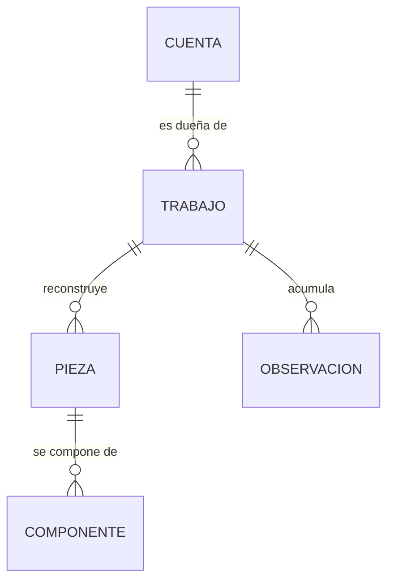

# Modelo conceptual de datos — GeometriaFactory-Infrastructure

**Producto:** Fábrica de Geometría
**Proyecto de código:** GeometriaFactory-Infrastructure
**Documento:** Modelo-Conceptual.md
**Versión:** 1.0
**Estado:** Propuesto
**Fecha:** 2026-08-10
**Autor:** Analista Funcional + API Designer (AG-02)
**Trazabilidad upstream:** `PRODUCT-INTAKE-Fabrica-De-Geometria.md` **1.11** §17.3.P.4 íntegro —tabla de persistencia, modelo de datos, ampliación del 2026-08-09 sobre los sellos y ampliación del 2026-08-08 por el circuito de revisión—, §17.3.P.11, §17.3.P.12, §4.1 y §4.2 (modelo de estados del trabajo), §17.1.P.2 (invariantes); `Proyectos/GeometriaFactory-Domain/02-Especificacion-Funcional/Definicion-Modelo-De-Dominio.md`, que es el modelo del dominio que éste materializa
**Trazabilidad downstream:** `03-UX-UI-DX`, `05-Arquitectura-Tecnica`, `06-Backlog-Tecnico`, `08-Calidad-Y-Pruebas` y `09-Devops` de GeometriaFactory-Infrastructure

---

## Tabla de contenido

- [1. Qué es este documento y qué no es](#1-qué-es-este-documento-y-qué-no-es)
- [2. Decisiones de almacenamiento](#2-decisiones-de-almacenamiento)
- [3. Las cinco entidades](#3-las-cinco-entidades)
  - [3.1 Diagrama](#31-diagrama)
  - [3.2 Cuenta](#32-cuenta)
  - [3.3 Trabajo](#33-trabajo)
  - [3.4 Pieza](#34-pieza)
  - [3.5 Componente](#35-componente)
  - [3.6 Observación](#36-observación)
- [4. Conjuntos cerrados](#4-conjuntos-cerrados)
- [5. Las siete reglas conceptuales de modelo](#5-las-siete-reglas-conceptuales-de-modelo)
- [6. Qué no está en este modelo, y dónde está](#6-qué-no-está-en-este-modelo-y-dónde-está)
- [7. Puntos abiertos de este modelo](#7-puntos-abiertos-de-este-modelo)
- [8. Control de cambios](#8-control-de-cambios)

---

## 1. Qué es este documento y qué no es

Es el modelo **conceptual** de lo que el producto guarda: qué entidades existen, qué atributos tienen y cómo se relacionan. **Es el único documento de la cadena documental que describe el dato guardado**, porque `GeometriaFactory-Infrastructure` es el proyecto de código que modela y ejerce la persistencia del producto: el `PRODUCT-MANIFEST` §5 declara ese flag true acá y también en `GeometriaFactory-Api`, que **delega en éste** y sólo toma de configuración la ruta y dispara la preparación al arrancar.

**No es un esquema físico.** No fija nombres de tablas, de columnas ni de tipos de dato, y no propone índices: eso es de `05-Arquitectura-Tecnica` y se materializa en las transformaciones de esquema que `CU-10` aplica al arrancar. Los conceptos se nombran acá en lenguaje de dominio, igual que en el resto de esta categoría.

**No es el modelo del dominio.** El dominio declara entidades, invariantes y máquinas de estado, y no conoce el motor de persistencia. Este documento declara cómo esas entidades **sobreviven a que el proceso se apague**. Cuando los dos digan cosas distintas, manda el modelo del dominio: acá se materializa, no se decide.

## 2. Decisiones de almacenamiento

Las nueve decisiones vienen del intake y se transcriben para que este documento se lea sin abrirlo.

| Aspecto | Definición |
| --- | --- |
| Motor | **SQLite**, archivo único, exclusivamente en la pieza de datos |
| Ubicación | Configurable. En producción, en un **volumen persistente**, nunca dentro de la imagen |
| Modo de diario | **WAL** |
| Concurrencia de escritura | **Escritor único**: el motor no admite escrituras concurrentes |
| Alcance de la unidad de trabajo | **Una por operación** |
| Versionado del esquema | **Transformaciones aplicadas automáticamente al arrancar**, sobre base inexistente o desactualizada ([`CU-10`](../../../Casos-De-Uso/CU-06010-Preparar-El-Almacen-Al-Arrancar.md)) |
| Almacenamiento del texto del alumno | **Como texto en la fila del trabajo.** No se consulta por su contenido |
| Instancias por despliegue | **Una instancia, un curso, un administrador.** El modelo **no** lleva ninguna columna de pertenencia a instancia |
| Respaldo | Copia del archivo con el diario activo, consistente. **Su frecuencia queda a definir por el docente** |

**Dos consecuencias de estas decisiones que el modelo hace visibles**, y que el intake declara como compromisos aceptados: se acepta el escritor único a cambio de un despliegue sin servicio de base de datos aparte; y se aceptan **los componentes redundantes** —un cubo de lado 3 guarda seis caras idénticas para expresar un solo número— porque **son parte del ejercicio**, compensándolo con no cargarlos nunca en las consultas de listado.

## 3. Las cinco entidades

### 3.1 Diagrama

**Cuatro relaciones y ninguna más.** En particular, la observación **cuelga del trabajo y no de la pieza**: designa una posición, que puede no tener pieza. Es lo que hace posible observar una figura que no se pudo reconstruir.

### 3.2 Cuenta

| Atributo | Qué guarda |
| --- | --- |
| Identidad propia | Identificador de la cuenta |
| Correo | **Único en todo el almacén.** Es la segunda línea de la unicidad, junto con la consulta previa del consumidor |
| Nombre y apellido | Datos del alta |
| Papel | `Alumno` o `Administrador`. **Una sola cuenta con papel `Administrador` en el almacén** |
| Estado de cuenta | `Pendiente`, `Habilitado` o `Bloqueado` |
| Credencial derivada | **Nula hasta el primer ingreso efectivo.** Nunca en claro, nunca con resumen simple |
| Marca de cambio de contraseña pendiente | Atributo propio, **que no es un estado de cuenta** (`RC-07`) |
| Fecha de alta | La aporta el consumidor. **No hay fecha de última modificación de la cuenta**, y el motivo está en `RC-06` |

### 3.3 Trabajo

| Atributo | Qué guarda |
| --- | --- |
| Identidad propia | Identificador del trabajo |
| Dueño | La cuenta a la que pertenece. **Un trabajo sin dueño no es un trabajo** |
| Nombre y descripción | Datos que el alumno escribe |
| `Fecha` | **La escribe el alumno.** No es un sello (`RC-06`) |
| Texto original | El texto que el alumno pegó, **conservado literal** (`RC-01`) |
| Cantidad de figuras del conjunto raíz | Cuántas trae el texto interpretado, **incluidas las no reconstruidas**. Es el rango de posiciones válidas (`RC-02`) |
| Estado | `Borrador`, `Pendiente`, `Finalizado` o `Rechazado` |
| Comentario del administrador | Texto libre y nulable, con la fecha y el identificador de quien lo dejó. **Campo, no entidad, y sin historial** (`RC-07`) |
| Fecha de creación y fecha de última modificación | Los dos sellos que produce el sistema por el puerto de reloj (`RC-06`) |

### 3.4 Pieza

| Atributo | Qué guarda |
| --- | --- |
| Trabajo al que pertenece | — |
| Posición en el conjunto raíz | **Es su identidad**, y no se compacta (`RC-02`) |
| Tipo | El discriminante que el texto del alumno declara |
| Dimensiones | Las que su tipo requiere |
| `Area` declarada y `Area` derivada | **Los dos, por separado** (`RC-03`) |
| `Volumen` declarado y `Volumen` derivado | Los dos, cuando la pieza es volumétrica |

**La familia plana o volumétrica no se guarda** (`RC-04`).

### 3.5 Componente

| Atributo | Qué guarda |
| --- | --- |
| Pieza a la que pertenece | — |
| Papel dentro de la pieza | Tapa, cara, base, lateral o lado |
| Tipo | Siempre una figura plana |
| Dimensiones y `Area` declarada | Las que el texto del alumno trae |

**Los componentes nunca se cargan en las consultas de listado.** Es una decisión de modelado con efecto directo en el tiempo de respuesta del listado del administrador.

### 3.6 Observación

| Atributo | Qué guarda |
| --- | --- |
| Trabajo al que pertenece | **No cuelga de la pieza**, y por eso puede designar una posición sin pieza |
| Especie | `Advertencia` o `Error de validación` |
| Posición de la figura y campo | La ubicación que el mensaje declara |
| Valor declarado y valor derivado | **Sólo en la advertencia**, y los dos (`RC-03`) |

## 4. Conjuntos cerrados

| Conjunto | Valores | Cuántos |
| --- | --- | --- |
| Papel de la cuenta | `Alumno`, `Administrador` | 2 |
| Estado de cuenta | `Pendiente`, `Habilitado`, `Bloqueado` | 3 |
| Estado del trabajo | `Borrador`, `Pendiente`, `Finalizado`, `Rechazado` | 4 |
| Especie de observación | `Advertencia`, `Error de validación` | 2 |

**`Pendiente` aparece en dos de los cuatro conjuntos y nombra dos cosas distintas.** Por eso en toda la documentación va calificado: «cuenta `Pendiente`» o «trabajo en estado `Pendiente`». Dentro de estas enumeraciones no se califica, porque el conjunto enunciado ya fija el referente.

## 5. Las siete reglas conceptuales de modelo

| RC | Enunciado en una línea | CU donde se hace cumplir |
| --- | --- | --- |
| [RC-01](../../reglas-conceptuales-de-modelo/RC-06001-Texto-Original-Escrito-Una-Sola-Vez.md) | El texto original se escribe una sola vez y no se reescribe | CU-03 |
| [RC-02](../../reglas-conceptuales-de-modelo/RC-06002-Identidad-Posicional-De-La-Pieza.md) | La identidad de la pieza es su posición, y las posiciones no se compactan | CU-01, CU-03 |
| [RC-03](../../reglas-conceptuales-de-modelo/RC-06003-Valor-Declarado-Y-Derivado-Por-Separado.md) | El valor declarado y el derivado se guardan por separado | CU-02, CU-03 |
| [RC-04](../../reglas-conceptuales-de-modelo/RC-06004-La-Familia-No-Se-Persiste.md) | La familia plana o volumétrica no se persiste | CU-01, CU-03 |
| [RC-05](../../reglas-conceptuales-de-modelo/RC-06005-Retiro-Fisico-Con-Arrastre.md) | El retiro es físico y la baja arrastra todo, en una sola unidad de trabajo | CU-04 |
| [RC-06](../../reglas-conceptuales-de-modelo/RC-06006-Tres-Sellos-De-Tiempo-Distintos.md) | Los tres tiempos del trabajo son distintos y no se confunden | CU-03, CU-09 |
| [RC-07](../../reglas-conceptuales-de-modelo/RC-06007-La-Marca-No-Es-Un-Estado-De-Cuenta.md) | La marca no es un estado de cuenta, y el comentario no es una observación | CU-03, CU-05 |

**Siete reglas conceptuales, cada una con archivo propio.** Ninguna redacta una regla de negocio: las quince del producto viven en `GeometriaFactory-Domain` y acá se **materializan**.

## 6. Qué no está en este modelo, y dónde está

| Lo que alguien podría buscar acá | Dónde está |
| --- | --- |
| Las quince reglas de negocio y los nueve invariantes | `GeometriaFactory-Domain`, su categoría 02 |
| Las máquinas de estado de la cuenta y del trabajo | `GeometriaFactory-Domain`, `Definicion-Modelo-De-Dominio.md` |
| La verificación de pertenencia y la de facultad | `GeometriaFactory-Application`, que las ejerce antes de pedirle nada al almacén |
| Los datos que cruzan la frontera del proceso | `GeometriaFactory-Contracts` |
| El nombre de las tablas, las columnas y los índices | `05-Arquitectura-Tecnica`, y las transformaciones de esquema |
| Una columna de pertenencia a instancia | **No existe y no va a existir**: una instancia, un curso, un administrador |
| Una marca de borrado lógico | **No existe**: el retiro es físico (`RC-05`) |
| Un historial de comentarios | **No existe**: los estados de cierre son terminales y el comentario es un campo (`RC-07`) |

## 7. Puntos abiertos de este modelo

| Punto | Situación | Quién lo resuelve |
| --- | --- | --- |
| Criterio de comparación de dos correos | La unicidad del correo exige decidir si dos correos se comparan tal cual o normalizados. Está declarado abierto por `GeometriaFactory-Domain` y por `GeometriaFactory-Application`, y **esta categoría no lo reabre**: la restricción de unicidad del almacén se define con el criterio que 05 fije | `05-Arquitectura-Tecnica` |
| Zona horaria y precisión de los sellos | Ninguna fuente los declara. Afecta a cómo se guardan las dos fechas del trabajo y la fecha de alta de la cuenta | `05-Arquitectura-Tecnica` |
| Frecuencia del respaldo | El intake la declara explícitamente «a definir por el docente». **No es una omisión de esta categoría**: es una decisión de operación que la fuente dejó abierta | Product Owner, y `09-Devops` |
| Fecha de última modificación de la cuenta | El modelo del dominio **no la declara** y el consumidor no la registra. Este modelo no la incorpora por su cuenta. Si el Product Owner la quisiera, entraría por el dominio y no por acá | Product Owner |

## 8. Control de cambios

| Versión | Fecha | Cambios |
| --- | --- | --- |
| 1.0 | 2026-08-10 | Emisión inicial. Declara las nueve decisiones de almacenamiento, las cinco entidades con sus atributos, las cuatro relaciones, los cuatro conjuntos cerrados, las siete reglas conceptuales de modelo con su archivo propio, la tabla de lo que no vive acá y los cuatro puntos abiertos. |
