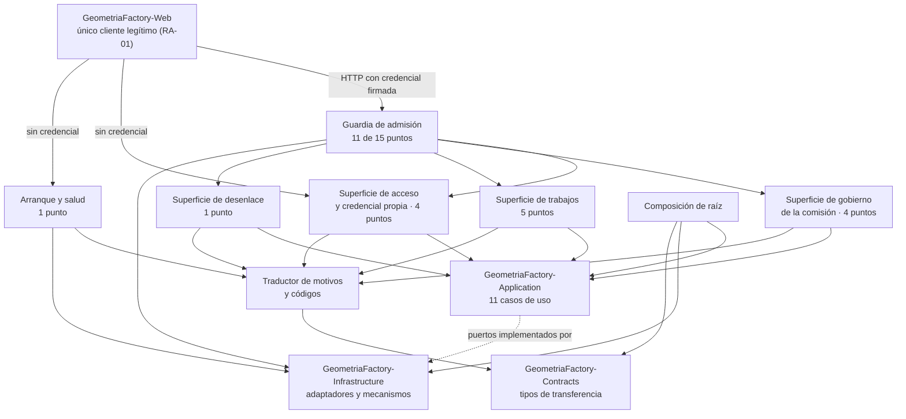

# Arquitectura técnica — GeometriaFactory-Api

**Producto:** Fábrica de Geometría
**Proyecto de código:** GeometriaFactory-Api
**Documento:** Arquitectura-Proyecto-Codigo.md
**Versión:** 1.3
**Estado:** Aprobado
**Fecha:** 2026-08-12
**Autor:** Arquitecto de Software Senior + API Designer (AG-05)
**Tipo de proyecto de código (D8):** `rest-api`
**Trazabilidad upstream:** `PRODUCT-INTAKE-Fabrica-De-Geometria.md` **1.28** §4 (F-04 precisada), §4.1 (las **dieciséis** reglas `RN-00001` a `RN-00016`), §4.2, §9 (X-9), §13 y §14 (composición del producto y las tres reglas de arquitectura `RA-01`, `RA-02`, `RA-03`), §15 (etapas y puertas técnicas), §16 y §16.1, §17.1.P.2 · GeometriaFactory-Domain (los **nueve** invariantes `INV-01` a `INV-09`), §17.5 completo (P.1 a P.12), §18 (S-2), §20 (los **ocho** escenarios), §21, §22 (asunciones A-3 y A-5); `PRODUCT-MANIFEST-Fabrica-De-Geometria.md` **1.2** §1, §2, §3 y §5 (proyecto de código **principal**, con `tiene_auth`, `tiene_persistencia` y `tiene_observabilidad_critica` en true); [`../02-Especificacion-Funcional/Especificacion-Funcional.md`](../02-Especificacion-Funcional/Especificacion-Funcional.md) y los **doce** casos de uso de [`../02-Especificacion-Funcional/Casos-De-Uso/`](../02-Especificacion-Funcional/Casos-De-Uso/); [`../02-Especificacion-Funcional/Definicion-Superficie-HTTP.md`](../02-Especificacion-Funcional/Definicion-Superficie-HTTP.md) (los **quince** puntos de acceso y los **diez** códigos de respuesta); [`../03-UX-UI-DX/DX-Error-Messages.md`](../03-UX-UI-DX/DX-Error-Messages.md); las Fases C ya emitidas de [`GeometriaFactory-Domain`](_fusion/Domain/Arquitectura-Proyecto-Codigo.md), [`GeometriaFactory-Contracts`](../../../_legacy/2026-08-15-migracion-8.2/GeometriaFactory-Contracts/05-Arquitectura-Tecnica/Arquitectura-Proyecto-Codigo.md), [`GeometriaFactory-Application`](_fusion/Application/Arquitectura-Proyecto-Codigo.md), [`GeometriaFactory-Infrastructure`](_fusion/Infrastructure/Arquitectura-Proyecto-Codigo.md) y [`GeometriaFactory-Web`](../../GeometriaFactory-Web/05-Arquitectura-Tecnica/Arquitectura-Proyecto-Codigo.md)
**Trazabilidad downstream:** `06-Backlog-Tecnico`, `08-Calidad-Y-Pruebas`, `09-Devops`, `10-Examples` y `11-Documentacion` de GeometriaFactory-Api

---

## Tabla de contenido

- [1. Objetivo](#1-objetivo)
- [2. Estilo arquitectónico](#2-estilo-arquitectónico)
  - [2.1 Alternativas descartadas](#21-alternativas-descartadas)
  - [2.2 Qué hereda de los cuatro proyectos de código que ensambla y no reabre](#22-qué-hereda-de-los-cuatro-proyectos-de-código-que-ensambla-y-no-reabre)
- [3. Vista lógica](#3-vista-lógica)
  - [3.1 Componentes](#31-componentes)
  - [3.2 Regla de dependencias interna](#32-regla-de-dependencias-interna)
  - [3.3 Cobertura de los doce casos de uso](#33-cobertura-de-los-doce-casos-de-uso)
  - [3.4 Los quince puntos de acceso contra su componente](#34-los-quince-puntos-de-acceso-contra-su-componente)
- [4. Vista de procesos](#4-vista-de-procesos)
- [5. Vista de despliegue](#5-vista-de-despliegue)
- [6. Vista de datos](#6-vista-de-datos)
- [7. Cross-cutting concerns](#7-cross-cutting-concerns)
- [8. Quality attributes (NFR)](#8-quality-attributes-nfr)
- [9. Riesgos arquitectónicos](#9-riesgos-arquitectónicos)
- [10. Trazabilidad](#10-trazabilidad)
  - [10.1 Componente contra caso de uso](#101-componente-contra-caso-de-uso)
  - [10.2 Las dieciséis reglas contra el lugar que las ejerce acá](#102-las-dieciséis-reglas-contra-el-lugar-que-las-ejerce-acá)
  - [10.3 Los nueve invariantes contra lo que esta capa hace por ellos](#103-los-nueve-invariantes-contra-lo-que-esta-capa-hace-por-ellos)
  - [10.4 Las tres reglas de arquitectura del producto](#104-las-tres-reglas-de-arquitectura-del-producto)
- [11. Puntos abiertos](#11-puntos-abiertos)
- [12. Control de cambios](#12-control-de-cambios)

---

## 1. Objetivo

Documenta la arquitectura interna de `GeometriaFactory-Api`, el **proyecto de código principal** del producto y el único que ensambla a los demás: qué componentes tiene, cómo se reparten los **doce** casos de uso de la categoría 02, cómo se conectan los **cuatro** puertos con sus adaptadores, cómo se traducen los **diecisiete** códigos vivos del contrato a los **diez** códigos de respuesta, y qué decisiones estructurales sostienen que ninguno de los **quince** puntos de acceso quede fuera de la guardia. Se dirige a quien implementa el servicio y a las categorías 06, 08, 09 y 10.

**Es la frontera del proceso, y por lo tanto el único lugar del backend donde una decisión ya tomada puede deshacerse sin que nadie lo note.** Dos reglas de negocio —`RN-00003` y `RN-00013`— se rompen hacia afuera desde acá, y ninguna capa de adentro se enteraría.

No documenta las reglas del producto, ni la orquestación, ni la interpretación del texto, ni el esquema del dato guardado: los cuatro viven en los proyectos de código que este ensambla, y §2.2 declara cuáles de sus decisiones hereda sin reabrir.

## 2. Estilo arquitectónico

**Estilo elegido: host delgado sobre una composición de raíz única.** Es lo que `PRODUCT-INTAKE` §17.1.P.2 · GeometriaFactory-Api declara tomado aguas arriba —«endpoints que traducen petición a caso de uso y resultado a tipo de transferencia, más la composición de raíz que conecta puertos con adaptadores»— y lo que [`ADR-00001`](Adrs/ADR-00001-Host-Delgado-Con-Composicion-De-Raiz-Unica.md) registra con su contexto y sus consecuencias.

En términos de esta categoría, el estilo se concreta en seis propiedades estructurales:

1. **Ningún punto de acceso contiene lógica de negocio.** Traduce petición a caso de uso, invoca, traduce resultado a tipo de transferencia y elige el código de respuesta. Lo que exceda eso está mal ubicado ([`ADR-00001`](Adrs/ADR-00001-Host-Delgado-Con-Composicion-De-Raiz-Unica.md)).
2. **Una sola composición de raíz, y es el único lugar donde los cuatro puertos se conectan con sus adaptadores** ([`ADR-00006`](Adrs/ADR-00006-Composicion-De-Raiz-Ciclos-De-Vida-Y-Configuracion.md)).
3. **La guardia es transversal y alcanza a los once puntos que exigen acceso, sin excepción declarada salvo una** ([`ADR-00003`](Adrs/ADR-00003-Credencial-Firmada-Papel-Por-Punto-Y-Guardia-Transversal.md)).
4. **Dos traducciones, en ese orden, y ninguna inventa códigos**: motivo interno a código del contrato, y código del contrato a código de respuesta ([`ADR-00004`](Adrs/ADR-00004-Dos-Traducciones-Con-Tabla-Unica-Y-Sin-Codigos-Inventados.md)).
5. **El formato de intercambio se fija acá, para los dos extremos** ([`ADR-00002`](Adrs/ADR-00002-Formato-De-Intercambio-Y-Su-Configuracion.md)).
6. **El arranque prepara el almacén antes de atender, y se detiene antes que atender mal** ([`ADR-00007`](Adrs/ADR-00007-Arranque-En-Dos-Fases-Y-Punto-De-Salud-Sin-Acceso.md)).

### 2.1 Alternativas descartadas

Las dos primeras las descarta el intake y esta categoría no las reabre; las dos siguientes las evalúa y las descarta esta categoría.

| Alternativa | A favor | En contra | Resolución |
| --- | --- | --- | --- |
| Servicio con lógica en los puntos de acceso | Menos capas, menos traducción, cada punto se lee entero en un archivo | Haría inseparable la verificación de pertenencia de la capa de transporte y volvería obligatoria una prueba de integración para cada regla | **Descartada** por `PRODUCT-INTAKE` §17.1.P.2 · GeometriaFactory-Api |
| Servicio de fachada que devuelva vistas ya armadas | Menos viajes y menos armado del lado del front | El front arma sus vistas en el servidor del hosting; una fachada agregaría un salto sin quitar ninguno | **Descartada** por `PRODUCT-INTAKE` §17.1.P.2 · GeometriaFactory-Api |
| Composición de raíz repartida en módulos, uno por área | Cada área declara lo suyo y el archivo de composición no crece | La frontera dejaría de ser contable en un solo lugar, y **el defecto característico de esta capa es de omisión**: un puerto sin adaptador o un punto sin guardia se detectan comparando contra una lista, no leyendo un módulo | **Descartada** por esta categoría, ver [`ADR-00006`](Adrs/ADR-00006-Composicion-De-Raiz-Ciclos-De-Vida-Y-Configuracion.md) §4 |
| Paginación en el listado de trabajos y en el de cuentas | Acota el tamaño de la respuesta y protege el tiempo de listado si la comisión crece | **Ninguna fuente la declara**, el caudal previsto es de una comisión durante una clase, y agregarla obliga a un tipo de transferencia nuevo en un ensamblado que dos extremos compilan juntos. La proyección sin componentes ya es lo que sostiene el requerimiento de tiempo | **Descartada** por esta categoría, con condición de reingreso declarada, ver [`ADR-00005`](Adrs/ADR-00005-Sin-Paginacion-Con-Condicion-De-Reingreso-Declarada.md) |

### 2.2 Qué hereda de los cuatro proyectos de código que ensambla y no reabre

Este proyecto de código depende por compilación de tres —`GeometriaFactory-Application`, `GeometriaFactory-Infrastructure` y `GeometriaFactory-Contracts`— y **es alcanzado por HTTP** por un cuarto, `GeometriaFactory-Web`, que no depende de él por compilación. Los cinco tienen su Fase C emitida. **Siete** decisiones suyas lo condicionan y **se citan, no se rehacen**.

| Decisión heredada | Dónde está | Qué obliga acá |
| --- | --- | --- |
| Los cuatro puertos son la frontera, y el cuarto no tiene identificador declarado | [`Application ADR-04002`](Adrs/ADR-04002-Cuatro-Puertos-Y-La-Frontera-Que-Declaran.md) | La composición de raíz conecta **exactamente cuatro** puertos con cuatro adaptadores. El nombre del cuarto se fija en el punto de control de la etapa `a` y **no acá** |
| Toda negativa prevista viaja como resultado tipado, con catálogo cerrado | [`Application ADR-04006`](Adrs/ADR-04006-Resultado-Tipado-Y-Catalogo-Cerrado-De-Condiciones.md) | Esta capa **recibe valores, no excepciones**, y traduce. Un motivo que llegue como excepción es un defecto del consumidor, no un camino |
| Un caso de uso, una unidad de trabajo | [`Application ADR-04005`](Adrs/ADR-04005-Un-Caso-De-Uso-Una-Unidad-De-Trabajo.md) | **Una petición ejerce a lo sumo un caso de uso**, y esta capa no abre ninguna unidad de trabajo por su cuenta |
| El conjunto cerrado de códigos del contrato, y la regla de exposición de la frontera | [`Contracts ADR-08002`](../../../Producto/Adrs/ADR-08002-Tipo-De-Error-Unico-Con-Conjunto-Cerrado.md) y [`Contracts ADR-08004`](../../../Producto/Adrs/ADR-08004-Regla-De-Exposicion-De-La-Frontera.md) | **Esta capa no agrega, no renombra y no traduce a texto ningún código del contrato**, y no agrega ni recorta campos de los tipos de transferencia |
| El ensamblado de contratos **no impone formato de intercambio**, y la elección le corresponde a esta capa y al front | [`Contracts ADR-08001`](../../../Producto/Adrs/ADR-08001-Tipos-De-Transferencia-Planos-Sin-Dependencias.md) y su `PA-03` | **Esta categoría lo fija**, para los dos extremos, en [`ADR-00002`](Adrs/ADR-00002-Formato-De-Intercambio-Y-Su-Configuracion.md) |
| La dirección del servicio de datos llega al front por configuración, y el front adopta el formato que esta capa fije | [`Web ADR-10007`](../../GeometriaFactory-Web/05-Arquitectura-Tecnica/Adrs/ADR-10007-Direccion-Del-Servicio-De-Datos-Desde-Configuracion.md) y `PA-03` de [`Web`](../../GeometriaFactory-Web/05-Arquitectura-Tecnica/Arquitectura-Proyecto-Codigo.md) §11 | La decisión de formato **no se puede tomar de un solo lado**, y `GeometriaFactory-Web` declaró que la toma esta categoría y que él la adopta |
| El motor de interpretación no impone límite de tamaño al texto, y exige que el borde **rechace y nunca trunque** | [`Infrastructure ADR-06006`](Adrs/ADR-06006-Lectura-Tolerante-Y-Tabla-De-Derivacion-Por-Tipo.md) §2 punto 3 | El límite de cuerpo lo fija esta categoría, con la forma de rechazo que aquella ADR le exige ([`ADR-00002`](Adrs/ADR-00002-Formato-De-Intercambio-Y-Su-Configuracion.md) §2 punto 6) |

## 3. Vista lógica

### 3.1 Componentes

Un componente es acá un módulo con responsabilidad cohesiva, no una clase. Los **ocho** cubren once de los doce casos de uso de la categoría 02; dos de ellos son transversales y se declaran como tales, y el caso de uso restante se declara aparte en §3.3.

| Componente | Responsabilidad | Entradas | Salidas | Dependencias |
| --- | --- | --- | --- | --- |
| Composición de raíz | Conectar los **cuatro** puertos con sus adaptadores, fijar los ciclos de vida y tomar de configuración lo que el despliegue provee: la ubicación del almacén, la clave de firma y la vigencia del acceso. **Transversal** | Configuración del despliegue | Grafo de dependencias construido, o fallo de construcción | Los tres proyectos de código que referencia |
| Guardia de admisión | Verificar la firma y la expiración del acceso, exigir el papel que cada punto declara y aplicar la guardia del cambio de contraseña pendiente. **Transversal a los once puntos que exigen acceso** | Petición con su cabecera de autorización | Petición admitida, o `401` o `403` | Mecanismo de acceso firmado de `GeometriaFactory-Infrastructure` |
| Traductor de motivos y códigos | Convertir el motivo de la capa de aplicación en código del contrato, y el código del contrato en código de respuesta. **Transversal a los quince puntos** | Resultado tipado, o condición de adaptador | Cuerpo de error del contrato y código de respuesta | `GeometriaFactory-Contracts` |
| Superficie de acceso y credencial propia | Los **cuatro** puntos que se ejercen sin acceso firmado o sobre la propia cuenta: canje de credenciales, registro de cuenta, configuración del administrador y cambio de la contraseña propia | Petición | Acceso firmado, cuenta constituida o credencial cambiada | Guardia de admisión, Traductor, `GeometriaFactory-Application` |
| Superficie de gobierno de la comisión | Los **cuatro** puntos del administrador sobre cuentas ajenas: listado, cambio de situación, baja con confirmación escrita y reseteo con la provisoria devuelta una sola vez | Petición admitida | Situación aplicada, o la provisoria | Guardia de admisión, Traductor, `GeometriaFactory-Application` |
| Superficie de trabajos | Los **cinco** puntos sobre trabajos: envío, reenvío, eliminación con sus dos alcances, listado y detalle | Petición admitida, con el texto original **sin normalizar** | Trabajo con su estado ya decidido, proyección o detalle | Guardia de admisión, Traductor, `GeometriaFactory-Application` |
| Superficie de desenlace | El punto de aprobar o rechazar desde el estado `Pendiente`, con comentario opcional | Petición admitida | Estado terminal alcanzado | Guardia de admisión, Traductor, `GeometriaFactory-Application` |
| Arranque y salud | Disparar la preparación del almacén antes de la primera petición, detener el arranque si no se puede, y exponer el punto de salud, que **no exige acceso** | Configuración; pedido de salud | Servicio en condiciones, o arranque detenido | Composición de raíz, `GeometriaFactory-Infrastructure` |

### 3.2 Regla de dependencias interna

Las flechas son unidireccionales y el grafo es acíclico. Cinco precisiones que la vista tiene que dejar dichas:

1. **Ninguna superficie depende de otra superficie.** Las cuatro se apoyan en la guardia, en el traductor y en la capa de aplicación, y en nada más. Un punto de acceso que invocara a otro sería una petición encadenada, y **una petición ejerce a lo sumo un caso de uso**.
2. **La guardia está antes de cuatro superficies y de once puntos, y no de quince.** Los cuatro puntos que no exigen acceso firmado —canje de credenciales, registro de cuenta, configuración del administrador y salud— la atraviesan por el costado, y §3.4 los declara uno por uno para que la ausencia sea contable.
3. **El traductor está después de las cinco superficies, incluidas las que no exigen acceso.** Es lo que hace que ningún camino de fallo salga sin pasar por la tabla única.
4. **La composición de raíz no atiende peticiones y ninguna superficie depende de ella en tiempo de ejecución.** Construye el grafo y desaparece: si falla, falla **en construcción** y no hay petición que responder.
5. **La flecha de `GeometriaFactory-Web` es de tiempo de ejecución y no de compilación.** El front no depende de este proyecto de código: comparte con él el ensamblado de tipos de transferencia, que es otra cosa. Es lo que hace que el grafo del producto siga siendo acíclico.

### 3.3 Cobertura de los doce casos de uso

| Componente | Casos de uso que cubre |
| --- | --- |
| Composición de raíz | CU-00010 |
| Guardia de admisión | CU-00002, y **transversalmente** los siete casos de uso de superficie que exigen acceso |
| Traductor de motivos y códigos | CU-00009, y **transversalmente** los ocho casos de uso de superficie |
| Superficie de acceso y credencial propia | CU-00001, CU-00003 |
| Superficie de gobierno de la comisión | CU-00004, CU-00005 |
| Superficie de trabajos | CU-00006, CU-00007 |
| Superficie de desenlace | CU-00008 |
| Arranque y salud | CU-00011 |

**Once de los doce casos de uso tienen componente. El doceavo, `CU-00012`, no tiene ninguno, y es correcto que no lo tenga.** La colección de peticiones reproducible **no implementa nada: demuestra**. No es un componente de tiempo de ejecución sino un artefacto que vive en el árbol de muestras del repositorio (`PRODUCT-INTAKE` §16.1), ejercita capacidades que los otros once casos de uso ya implementan, y su obligación propia es reproducirse en **cinco pasos o menos y no inventar ningún dato de prueba**. Darle un componente haría creer que hay código de producción detrás de un guion.

**Y ningún componente queda sin caso de uso.** Los dos transversales lo declaran como tales y no aparecen como cobertura exclusiva de ninguno de los de superficie.

### 3.4 Los quince puntos de acceso contra su componente

Los quince son los de [`../02-Especificacion-Funcional/Definicion-Superficie-HTTP.md`](../02-Especificacion-Funcional/Definicion-Superficie-HTTP.md) §3, y esta tabla **no los redefine**: declara qué componente los aloja y si están bajo la guardia. Las rutas siguen siendo la propuesta derivada que aquella categoría rotuló fila por fila, y su forma definitiva se valida en el punto de control de la etapa `a`.

| Punto | Intención | Componente | ¿Bajo la guardia? |
| --- | --- | --- | --- |
| A-01 | Canjear correo y contraseña por un acceso firmado | Superficie de acceso y credencial propia | **No**: es el punto que produce el acceso |
| A-02 | Registrar una cuenta de alumno, sin campo de contraseña | Superficie de acceso y credencial propia | **No**: el registro es anónimo por diseño, y así debe seguir |
| A-03 | Configurar la cuenta de administrador, sólo mientras no exista ninguna | Superficie de acceso y credencial propia | **No**: no hay todavía identidad que pueda autenticarse |
| A-05 | Cambiar la contraseña propia exigiendo la vigente | Superficie de acceso y credencial propia | **Sí**, y es **la única excepción de la guardia del cambio pendiente** |
| A-06 | Listar las cuentas de la comisión con su situación y su marca | Superficie de gobierno de la comisión | **Sí** |
| A-07 | Cambiar la situación de una cuenta; habilitar y rehabilitar devuelven la provisoria | Superficie de gobierno de la comisión | **Sí** |
| A-08 | Dar de baja una cuenta, con el correo escrito como confirmación | Superficie de gobierno de la comisión | **Sí** |
| A-09 | Resetear la contraseña de un alumno y devolver la provisoria | Superficie de gobierno de la comisión | **Sí** |
| A-10 | Enviar un trabajo nuevo | Superficie de trabajos | **Sí** |
| A-11 | Reenviar un trabajo que quedó en `Borrador` | Superficie de trabajos | **Sí** |
| A-12 | Eliminar un trabajo, con los dos alcances | Superficie de trabajos | **Sí** |
| A-13 | Listar trabajos, con el alcance que el papel determina | Superficie de trabajos | **Sí** |
| A-14 | Obtener el detalle de un trabajo interpretado | Superficie de trabajos | **Sí** |
| A-15 | Aprobar o rechazar un trabajo en estado `Pendiente` | Superficie de desenlace | **Sí** |
| A-16 | Responder por el estado del servicio | Arranque y salud | **No**: tiene que poder responder cuando nadie puede autenticarse |

**Quince puntos: cuatro sin acceso firmado y once bajo la guardia. Cuatro más once son quince.** El identificador `A-04` **quedó retirado y no se recicla**: establecía la contraseña del primer ingreso sin credencial, y `RN-00016` suprimió esa operación en lugar de resolverla. **De los cuatro que no exigen acceso firmado, ninguno fija una contraseña sobre una cuenta existente**, y ésa es la propiedad que hay que poder comprobar sobre esta tabla.

## 4. Vista de procesos

- **Un proceso, sin estado y sin afinidad.** El intake declara REST sin estado y sin sesiones persistentes: lo que se parece a una sesión vive en el circuito de la pieza pública, del lado del servidor del front. **Ningún punto de acceso depende de lo que ocurrió en la petición anterior.**
- **Una petición ejerce a lo sumo un caso de uso, y por lo tanto a lo sumo una unidad de trabajo.** El alcance lo fijó la capa de aplicación y esta capa no abre ninguna por su cuenta.
- **Concurrencia de lectura libre, escritura serializada por el almacén.** El motor de archivo único no admite escrituras concurrentes, y el adaptador termina en su condición degradada en lugar de esperar. Esta capa la traduce a un código de respuesta y **no reintenta**: reintentar, si corresponde, lo decide la pieza pública.
- **Sin conexiones sostenidas.** No hay canal bidireccional y no lo va a haber: el circuito interactivo del front **termina en el front** y no llega hasta acá, y eso es criterio de aceptación de la etapa `a`.
- **Arranque en dos fases.** Primero se construye el grafo de dependencias —si falla, falla en construcción y no hay servicio—, después se prepara el almacén —si falla, **el arranque se detiene** y ninguna petición se atiende—, y recién entonces el servicio escucha ([`ADR-00007`](Adrs/ADR-00007-Arranque-En-Dos-Fases-Y-Punto-De-Salud-Sin-Acceso.md)).
- **Terminación controlada de toda petición.** Ningún camino sale sin pasar por el traductor: una petición que falla devuelve **siempre** un código de respuesta y un cuerpo del tipo de error del contrato, o el `401` y el `400` de la guardia, que son los dos únicos casos declarados sin código del contrato.

## 5. Vista de despliegue

| Aspecto | Decisión |
| --- | --- |
| Unidad de despliegue | **Una imagen de contenedor**, y es la unidad desplegable del backend. Lleva embebidos los tres proyectos de código que referencia |
| Runtime objetivo | La plataforma común declarada, sobre el sistema operativo del contenedor de desarrollo, de la imagen de producción y del servidor propio, que son los tres el mismo (`PRODUCT-INTAKE` §17.1.P.9 · GeometriaFactory-Api) |
| Contenido de la imagen | **Sólo el entorno de ejecución**, sin kit de desarrollo ni depurador, y **sin linaje con la imagen del contenedor de desarrollo** (`PRODUCT-INTAKE` §17.1.P.9 · GeometriaFactory-Api) |
| Punto de entrada | **Un puerto publicado hacia el enrutador, y es el único punto de entrada al servidor propio.** Todo lo que este proyecto de código no exponga, no existe para nadie de afuera |
| Transporte en desarrollo | **Sin certificado**, para evitar la fricción del certificado de confianza dentro del contenedor (`PRODUCT-INTAKE` §17.1.P.1 · GeometriaFactory-Api) |
| Dependencias de infraestructura | El volumen persistente donde vive el almacén, y la clave de firma provista desde afuera. Ninguna otra |
| Secretos | **Clave de firma por variable de entorno o archivo montado, fuera del repositorio de código y fuera de la imagen.** En la integración continua, como secreto del repositorio; **nunca en el archivo del flujo de trabajo** (`PRODUCT-INTAKE` §17.1.P.5 · GeometriaFactory-Api) |
| Etapas del pipeline | `build` → `test` → cobertura → **imagen** → despliegue. La puerta de imagen exige que se construya con el archivo de construcción multietapa, arranque desde el contenedor de desarrollo, **aplique las transformaciones sobre un almacén vacío y responda salud** |
| Despliegue | **Manual, por el docente** (`PRODUCT-INTAKE` §17.1.P.8 · GeometriaFactory-Api). La construcción ocurre **en destino desde el repositorio**, sin publicar en ningún registro, y ese mecanismo lleva marca **[A VERIFICAR]** de la fuente: debe probarse una vez antes de depender de él |
| Reemplazo de versión | **Detener y arrancar, con ventana de indisponibilidad.** Sin proxy inverso no hay despliegue con solapamiento |
| Reversión | Volver a la etiqueta de la etapa anterior y reconstruir |
| Versionado | Versionado semántico y convenciones de mensaje de confirmación **sin excepciones**, una rama y un pedido de fusión por etapa, y **una etiqueta por etapa cerrada**, para poder volver a cualquier demostración |
| Publicación | No se publica: `redistribuible` es false (`PRODUCT-MANIFEST` §2) |

## 6. Vista de datos

- **Sin modelo de datos propio, y el flag en true no lo contradice.** `tiene_persistencia` vale true acá y también en `GeometriaFactory-Infrastructure`, y el `PRODUCT-MANIFEST` §5 declara por qué: acá vale porque **toma de configuración la ruta del archivo y dispara las transformaciones al arrancar**, no porque modele el dato. El intake lo dice en una línea: «delega en `GeometriaFactory.Infrastructure`».
- **Por eso `Modelo-Datos-Logico.md` se omite acá**, aunque la guía lo declare obligatorio para el tipo `rest-api`. **Es una omisión declarada y no un incumplimiento**: el modelo lógico del producto **está emitido**, en [`../../GeometriaFactory-Infrastructure/05-Arquitectura-Tecnica/Modelo-Datos-Logico.md`](Modelo-Datos-Logico.md), con sus cinco tablas, sus seis índices y sus quince restricciones. Redactarlo de nuevo acá crearía dos descripciones del mismo dato guardado, que es exactamente el defecto que la categoría 02 evitó con el mismo fundamento.
- **Lo que esta capa sí decide sobre los datos son dos cosas, y las dos son de frontera:**
  - **El texto original del alumno no se normaliza en el borde.** El borde del proceso es **el primer lugar donde el texto puede alterarse** —por codificación, por normalización o por recorte— y `RN-00008` se rompe ahí en silencio ([`ADR-00002`](Adrs/ADR-00002-Formato-De-Intercambio-Y-Su-Configuracion.md)).
  - **El listado no arrastra el texto original ni los componentes de las piezas.** La proyección llega ya separada del detalle desde el ensamblado de contratos y desde el adaptador, y esta capa **no la recompone**.
- **Sin caché de respuestas.** Ninguna respuesta de esta superficie se guarda para servirla de nuevo: el estado de un trabajo cambia por acciones de dos personas distintas y una respuesta vieja es indistinguible de una nueva para el consumidor.
- **Sin paginación**, con condición de reingreso declarada en [`ADR-00005`](Adrs/ADR-00005-Sin-Paginacion-Con-Condicion-De-Reingreso-Declarada.md).

## 7. Cross-cutting concerns

Todas las decisiones transversales viven acá y no repartidas por punto de acceso.

| Preocupación | Decisión | Fundamento |
| --- | --- | --- |
| Autenticación | **Canje de credenciales por un acceso firmado con clave simétrica**, con los **cuatro** reclamos. El mecanismo es de `GeometriaFactory-Infrastructure`; **exigirlo en cada punto es de acá** | [`ADR-00003`](Adrs/ADR-00003-Credencial-Firmada-Papel-Por-Punto-Y-Guardia-Transversal.md) |
| Autorización | **Papel exigido por punto, y nada más.** La verificación de pertenencia y la de facultad se hacen **sobre el dato recuperado** y son de la capa de aplicación. Que un punto exija `Administrador` **no exime** a la capa de adentro de comprobar, y duplicar la comprobación acá crearía un segundo lugar donde la regla puede decir otra cosa | [`ADR-00003`](Adrs/ADR-00003-Credencial-Firmada-Papel-Por-Punto-Y-Guardia-Transversal.md) |
| Guardia del cambio de contraseña pendiente | **Alcanza a los once puntos que exigen acceso, con una sola excepción declarada**: el cambio de la propia contraseña. La comprobación es de la capa de aplicación; **que ningún punto quede fuera es de acá**, y es la parte que se rompe agregando un punto nuevo y olvidándose | [`ADR-00003`](Adrs/ADR-00003-Credencial-Firmada-Papel-Por-Punto-Y-Guardia-Transversal.md) |
| Manejo de errores | **Dos traducciones en orden, con una tabla única y sin códigos inventados.** Donde el conjunto cerrado no tiene código, el que corresponde es el genérico y **el hueco se declara** en lugar de inventarse uno | [`ADR-00004`](Adrs/ADR-00004-Dos-Traducciones-Con-Tabla-Unica-Y-Sin-Codigos-Inventados.md) |
| Formato de intercambio | **Se fija acá, para los dos extremos**, porque no se puede decidir de un solo lado: nombres de campo tal como los declara el tipo, valores de conjunto cerrado por su **nombre** y no por su posición, nulos emitidos, números sin cultura y lectura estricta | [`ADR-00002`](Adrs/ADR-00002-Formato-De-Intercambio-Y-Su-Configuracion.md) |
| Configuración | **Todo lo que el despliegue provee entra por la composición de raíz**: ubicación del almacén, clave de firma, vigencia del acceso y límite de cuerpo. Ningún componente lee configuración por su cuenta | [`ADR-00006`](Adrs/ADR-00006-Composicion-De-Raiz-Ciclos-De-Vida-Y-Configuracion.md) |
| Secretos | **La clave de firma vive fuera del repositorio de código y fuera de la imagen**, y no entra a ninguna respuesta ni a ninguna traza. **Ningún secreto entra al repositorio, ni en la integración continua** | `PRODUCT-INTAKE` §17.1.P.5 · GeometriaFactory-Api |
| Registro de eventos y trazas | **Registro estructurado del lado del servidor de cada error y de cada intento de acceso rechazado.** Es la contracara obligatoria de `RA-03`: sin él, la prohibición de exponer se convierte en imposibilidad de diagnosticar, y el operador que despliega a mano se queda sin nada que mirar | `PRODUCT-INTAKE` §17.1.P.10 · GeometriaFactory-Api |
| Métricas | **Es el único proyecto de código del producto con `tiene_observabilidad_critica` en true**, y el único con métrica numérica de latencia hacia afuera. Lo que se mide está en §8 | `PRODUCT-MANIFEST` §5 |
| Exposición de la infraestructura | **Ninguna respuesta lleva la dirección de un servicio interno, la ruta del almacén, la clave de firma, una contraseña, la provisoria fuera del cuerpo del reseteo, ni trazas de la implementación.** Acá es **donde se puede violar hacia afuera**: es la última vez que un dato del backend es tocado antes de salir del servidor propio | `PRODUCT-INTAKE` §14; [`../03-UX-UI-DX/DX-Error-Messages.md`](../03-UX-UI-DX/DX-Error-Messages.md) §1.4 |
| Familias deliberadamente empobrecidas | **Tres respuestas dicen menos de lo que el servicio sabe, y en las tres es la decisión y no el defecto**: credenciales inválidas sin declarar qué campo falló, recurso que no se ve sin distinguir inexistente de ajeno de fuera de alcance, y correo ya registrado sin declarar la situación ni el papel de la cuenta que lo ocupa | [`ADR-00004`](Adrs/ADR-00004-Dos-Traducciones-Con-Tabla-Unica-Y-Sin-Codigos-Inventados.md) |
| Zona horaria y formato de fecha | **No se decide acá.** Los sellos llegan en tiempo universal coordinado desde el adaptador y viajan así; la conversión a la zona de quien lee es de la pieza pública | [`Infrastructure ADR-06002`](Adrs/ADR-06002-Un-Archivo-Escritor-Unico-Y-Una-Unidad-De-Trabajo-Por-Operacion.md) |
| Vocabulario | `Pendiente` se escribe **siempre calificado** —«cuenta `Pendiente`» o «trabajo en estado `Pendiente`»—, con las dos excepciones declaradas: los nombres literales de los códigos y las enumeraciones del conjunto cerrado | `PRODUCT-INTAKE` §4.2; [`../03-UX-UI-DX/Glosario-UX.md`](../03-UX-UI-DX/Glosario-UX.md) |

## 8. Quality attributes (NFR)

Los cinco primeros vienen rotulados **[ASUNCIÓN]** desde `PRODUCT-INTAKE` §17.1.P.6 · GeometriaFactory-Api y §17.1.P.10 · GeometriaFactory-Api, y su confirmación está pendiente del Product Owner en §22, asunciones **A-3** y **A-5**. Se usan como vigentes. Los demás los deriva esta categoría o los transcribe de una fuente que no los rotula como asunción, y cada fila lo declara.

| NFR | Objetivo numérico | Mecanismo de medición | ADR relacionada |
| --- | --- | --- | --- |
| Latencia del listado | **Percentil 99 por debajo de 500 ms**, medida **en el servidor**, sin contar el tramo de internet doméstico, que no está bajo control [ASUNCIÓN del intake] | Medición del servicio sobre el punto de listado, en la batería de integración | [`ADR-00005`](Adrs/ADR-00005-Sin-Paginacion-Con-Condicion-De-Reingreso-Declarada.md) |
| Caudal sostenido | **20 peticiones por minuto** [ASUNCIÓN del intake], derivado del uso previsto —una comisión operando durante una clase— y de la limitación de escritor único del almacén | Prueba de carga acotada en la batería de integración | [`ADR-00005`](Adrs/ADR-00005-Sin-Paginacion-Con-Condicion-De-Reingreso-Declarada.md) |
| Arranque en frío | **Menos de 30 segundos** para aplicar las transformaciones y responder salud [ASUNCIÓN del intake], para que la comprobación del despliegue sirva de algo | Medición desde el arranque del contenedor hasta la primera respuesta de salud | [`ADR-00007`](Adrs/ADR-00007-Arranque-En-Dos-Fases-Y-Punto-De-Salud-Sin-Acceso.md) |
| Cobertura del proyecto de código | **75 %** de líneas y **70 %** de ramas [ASUNCIÓN del intake] | Informe de cobertura del pipeline, bloqueante para fusionar | [`ADR-00001`](Adrs/ADR-00001-Host-Delgado-Con-Composicion-De-Raiz-Unica.md) |
| Forma de la pirámide de pruebas | **60 %** de integración y **40 %** unitarias [ASUNCIÓN del intake]. **Invertida a propósito**: lo que este proyecto de código aporta es cableado, y el cableado se verifica ejerciéndolo | Recuento de pruebas por clase en el informe de 08 | [`ADR-00001`](Adrs/ADR-00001-Host-Delgado-Con-Composicion-De-Raiz-Unica.md) |
| Puntos de acceso fuera de la guardia | Exactamente **4**, y son los declarados en §3.4. **Ni uno más** [derivado de `RN-00013` y de la superficie de 02] | Prueba de inspección que recorre los **15** puntos y compara contra la lista, en las dos direcciones | [`ADR-00003`](Adrs/ADR-00003-Credencial-Firmada-Papel-Por-Punto-Y-Guardia-Transversal.md) |
| Puntos que fijan una contraseña sobre una cuenta existente sin credencial | Exactamente **0** [transcrito de `RN-00016`] | Inspección de los cuatro puntos que no exigen acceso | [`ADR-00003`](Adrs/ADR-00003-Credencial-Firmada-Papel-Por-Punto-Y-Guardia-Transversal.md) |
| Códigos del contrato con traducción declarada | **16 de 17**, con **1** declarado **sin destino** y con su motivo. **0** códigos inventados y **0** renombrados [derivado del conjunto cerrado de `GeometriaFactory-Contracts`] | Prueba de inspección que recorre el conjunto cerrado contra la tabla de [`Contratos-REST.md`](Contratos-REST.md) §5, **en las dos direcciones** | [`ADR-00004`](Adrs/ADR-00004-Dos-Traducciones-Con-Tabla-Unica-Y-Sin-Codigos-Inventados.md) |
| Respuestas indistinguibles de las tres familias empobrecidas | **3 de 3** comparaciones dan idénticas, cuerpo y código | Prueba que compara dos respuestas que deben ser indistinguibles: trabajo ajeno contra inexistente, correo inválido contra contraseña inválida, correo ocupado por cuenta habilitada contra ocupado por cuenta bloqueada | [`ADR-00004`](Adrs/ADR-00004-Dos-Traducciones-Con-Tabla-Unica-Y-Sin-Codigos-Inventados.md) |
| Respuestas que exponen dirección, ruta, secreto o traza | Exactamente **0** [derivado de `RA-03`] | Prueba de inspección sobre las respuestas de fallo de los quince puntos, y sobre el registro del servidor | [`ADR-00004`](Adrs/ADR-00004-Dos-Traducciones-Con-Tabla-Unica-Y-Sin-Codigos-Inventados.md) |
| Configuraciones de intercambio declaradas en el producto | Exactamente **1**, compartida por los dos extremos [derivado de `Contracts PA-03` y de `Web PA-03`] | Inspección de la composición de raíz y del cliente del front | [`ADR-00002`](Adrs/ADR-00002-Formato-De-Intercambio-Y-Su-Configuracion.md) |
| Textos originales alterados en el borde | Exactamente **0** caracteres de diferencia entre lo enviado y lo guardado, y **0** truncamientos silenciosos [derivado de `RN-00008`] | Prueba que envía el texto de `E-1` y compara byte a byte lo guardado; y prueba que envía un cuerpo por encima del límite y comprueba que **se rechaza y no se trunca** | [`ADR-00002`](Adrs/ADR-00002-Formato-De-Intercambio-Y-Su-Configuracion.md) |
| Puertos conectados a su adaptador | **4 de 4**, y **0** puertos sin adaptador o con más de uno | Prueba de arranque que resuelve las cuatro dependencias, y falla en construcción si falta alguna | [`ADR-00006`](Adrs/ADR-00006-Composicion-De-Raiz-Ciclos-De-Vida-Y-Configuracion.md) |
| Peticiones atendidas con la preparación del almacén incompleta | Exactamente **0** [derivado de `Infrastructure ADR-00007`] | Prueba de arranque fallido contra el punto de salud | [`ADR-00007`](Adrs/ADR-00007-Arranque-En-Dos-Fases-Y-Punto-De-Salud-Sin-Acceso.md) |
| Eliminaciones fuera de alcance aceptadas al forzar la petición | Exactamente **0**. **Es el único criterio de verificación del producto que la fuente exige ejercer forzando la petición contra esta superficie** | Prueba de integración que fuerza la eliminación de un trabajo que no está en `Borrador` y de uno que no pertenece al solicitante | [`ADR-00003`](Adrs/ADR-00003-Credencial-Firmada-Papel-Por-Punto-Y-Guardia-Transversal.md) |
| Advertencias de construcción | Exactamente **0** | Etapa de `build` del pipeline, puerta bloqueante para fusionar | [`ADR-00001`](Adrs/ADR-00001-Host-Delgado-Con-Composicion-De-Raiz-Unica.md) |
| Pasos de la colección de peticiones reproducible | **5 o menos**, con **0** datos de prueba inventados | Ejecución de la colección en la demostración de etapa | [`ADR-00008`](Adrs/ADR-00008-Sin-Versionado-De-Rutas-Y-Despliegue-Conjunto.md) |

**No hay NFR de disponibilidad, y es correcto que no lo haya.** El intake declara «sin SLO»: el servidor es domiciliario, su caída es un riesgo aceptado y se responde con **estado degradado en el front**, no con redundancia.

## 9. Riesgos arquitectónicos

| Riesgo | Impacto | Probabilidad | Mitigación |
| --- | --- | --- | --- |
| Que un punto de acceso nuevo quede fuera de la guardia del cambio de contraseña pendiente | **Muy alto**: `RN-00013` e `INV-09` dejan de valer y **nada falla**. Una cuenta con la marca puesta ejercería una capacidad, y ninguna capa de adentro se enteraría | **Alta**: es un defecto de omisión, y los defectos de omisión no se ven leyendo el punto nuevo | Guardia transversal por diseño y **NFR de exactamente 4 puntos fuera de ella**, con prueba de inspección que recorre los quince en las dos direcciones ([`ADR-00003`](Adrs/ADR-00003-Credencial-Firmada-Papel-Por-Punto-Y-Guardia-Transversal.md)) |
| Que el trabajo ajeno responda «no autorizado» en lugar de «no encontrado» | **Muy alto**: confirma la existencia de un recurso ajeno y permite averiguar por tanteo qué identificadores existen, que es lo que `RN-00003` viene a cerrar. **Ninguna capa de adentro puede repararlo** | Media: es la traducción que parece más informativa y por eso es la tentadora | Fila única en la tabla de traducción, y prueba que compara las **dos** respuestas y verifica que son indistinguibles en cuerpo y en código |
| Que el límite de tamaño del cuerpo trunque el texto de un alumno en lugar de rechazarlo | Alto: **rompe `RN-00008` en silencio**. El trabajo se guarda, el texto queda mutilado y el alumno lo descubre al ver el dibujo | Media: truncar es el comportamiento por defecto de varias capas de transporte | [`ADR-00002`](Adrs/ADR-00002-Formato-De-Intercambio-Y-Su-Configuracion.md) §2 punto 6: **rechazar, nunca truncar**, con NFR de 0 truncamientos y prueba propia |
| Que los dos extremos serialicen distinto y el contrato deje de ser el mismo | Alto: el fallo aparece en tiempo de ejecución y **no lo detecta la compilación**, que es la única red que este producto tiene | Media, y **es exactamente el trade-off que `Contracts ADR-00001` aceptó por escrito** al no imponer formato | [`ADR-00002`](Adrs/ADR-00002-Formato-De-Intercambio-Y-Su-Configuracion.md): **una sola configuración declarada, compartida por los dos extremos**, con NFR de exactamente 1 y con la batería de integración golpeando el servicio real |
| Que un envío cuyo texto no verifica responda con un código de fallo | Medio: le diría a la persona que su petición estaba mal cuando lo que pasa es que su programa emitió algo que no se puede interpretar —y el trabajo, mientras tanto, quedó guardado— | Media: es la lectura intuitiva de «no verificó» | Declarado en la superficie de 02 y en [`Contratos-REST.md`](Contratos-REST.md) §4: **es una respuesta exitosa**, con el estado `Borrador` y las observaciones en el cuerpo |
| Que se agregue un punto de acceso pensado para el navegador, o se configure el intercambio de origen cruzado | **Muy alto**: reabre las tres propiedades de la topología —contenido mixto, intercambio de origen cruzado y exposición de la dirección del servidor propio— y rompe `RA-01`, que es regla de nivel producto | Baja, pero el costo de equivocarse es de rediseño | Ausencia declarada en la superficie de 02, con lo que la repone escrito; y el hecho de que el único cliente legítimo esté declarado en el manifiesto y en el grafo |
| Que la composición de raíz deje un puerto sin adaptador y el fallo aparezca en la primera petición | Medio: el servicio arranca y falla al primer uso, en producción y sin nadie mirando | Media | [`ADR-00006`](Adrs/ADR-00006-Composicion-De-Raiz-Ciclos-De-Vida-Y-Configuracion.md): **composición única y resolución verificada en el arranque**, con NFR de 4 de 4 y fallo en construcción |
| Que el listado de la comisión crezca por encima de lo que el requerimiento de tiempo sostiene | Medio: la pantalla más pesada del producto deja de cumplir su percentil | Baja en el alcance declarado —una comisión durante una clase— | [`ADR-00005`](Adrs/ADR-00005-Sin-Paginacion-Con-Condicion-De-Reingreso-Declarada.md), con **condición de reingreso escrita**: cuando la medición del percentil 99 deje de cumplirse, entra paginación, y es cambio del ensamblado de contratos |
| Que el mecanismo de construcción de la imagen en destino no funcione y el despliegue quede sin camino | Alto: es el único canal de entrega declarado | Media, **y la fuente lo rotula [A VERIFICAR]** por su cuenta | Probarlo **una vez antes de depender de él**, tal como el intake exige; la salida documentada y no adoptada es el túnel saliente |

## 10. Trazabilidad

### 10.1 Componente contra caso de uso

| Dimensión | Referencia |
| --- | --- |
| CU cubiertos | CU-00001 a CU-00012, los **doce** de [`../02-Especificacion-Funcional/Especificacion-Funcional.md`](../02-Especificacion-Funcional/Especificacion-Funcional.md) §5. **Once tienen componente; `CU-00012` no lo tiene y §3.3 declara por qué** |
| Puntos de acceso | A-01 a A-03, A-05 a A-16: **quince**. `A-04` está retirado y **no se recicla** |
| NB que sostiene | NB-00001 a NB-00009, **las nueve**, con `NB-00005`, `NB-00006` y `NB-00007` en forma parcial. **`NB-00008` recibe acá su primer tramo propio y no parcial**: es donde el producto se vuelve alcanzable |
| RN aplicables | RN-00001 a RN-00016, las **dieciséis**, con el reparto de §10.2. **Trece** tienen tramo acá; RN-00005, RN-00014 y RN-00016 no. **Dos** se rompen desde acá sin que ninguna capa de adentro se entere: RN-00003 y RN-00013 |
| Invariantes | INV-01 a INV-09, los **nueve**, con el reparto de §10.3. Ninguno se enuncia acá |
| CU de la capa de aplicación orquestados | Los **once**, con el reparto de [`../02-Especificacion-Funcional/Especificacion-Funcional.md`](../02-Especificacion-Funcional/Especificacion-Funcional.md) §7.4. Ninguno queda sin orquestar, y **cuatro** de los doce casos de uso de acá no orquestan ninguno: la guardia, la traducción, la composición y el arranque |
| ADRs que lo gobiernan | ADR-00001 a ADR-00008, las **ocho** |
| Contratos que expone | [`Contratos-REST.md`](Contratos-REST.md) |
| Tests previstos en 08 | Batería de integración que golpea el servicio real contra el almacén real, con **60 %** del total; prueba de inspección de los quince puntos contra la guardia en las dos direcciones; prueba de inspección del conjunto cerrado de diecisiete códigos contra la tabla de traducción en las dos direcciones; las tres comparaciones de respuestas indistinguibles; prueba de texto original byte a byte y de rechazo sin truncamiento; prueba de eliminación forzada en sus dos alcances; prueba de arranque fallido contra el punto de salud |

### 10.2 Las dieciséis reglas contra el lugar que las ejerce acá

Las dieciséis filas están, una por regla, y ninguna se agrupa. El tramo de cada una es el que [`../02-Especificacion-Funcional/Especificacion-Funcional.md`](../02-Especificacion-Funcional/Especificacion-Funcional.md) §6 le asigna; esta tabla lo refleja contra el componente que lo materializa y **no lo redefine**.

| Regla | Tramo en esta capa | Componente que lo ejerce | ADR |
| --- | --- | --- | --- |
| RN-00001 Administrador único y papeles fijos | El punto de configuración del administrador con su negativa cuando ya existe una; y el papel que llega en el acceso, con cada punto declarando cuál exige | Superficie de acceso y credencial propia, Guardia de admisión | ADR-00003 |
| RN-00002 Correo del alumno único | La traducción del correo ocupado a una respuesta que **no declara la situación ni el papel** de la cuenta que lo ocupa | Superficie de acceso y credencial propia, Traductor | ADR-00004 |
| **RN-00003** Trabajo ajeno indistinguible de inexistente | **Tramo de traducción, y es el que esta capa puede romper sola.** El trabajo ajeno, el inexistente y el que está fuera de lo que el solicitante ve reciben **el mismo código de respuesta y el mismo cuerpo** | Traductor, Superficie de trabajos, Superficie de desenlace | ADR-00004 |
| RN-00004 Eliminación acotada al borrador | Los dos alcances sobre el mismo punto. **Es la única regla del producto con un criterio de verificación que exige forzar la petición contra esta superficie** | Superficie de trabajos | ADR-00003 |
| RN-00005 No se pasa a estado `Pendiente` con errores de validación | **Ninguno: sin tramo acá.** El estado llega decidido por el dominio y viaja en una respuesta **exitosa**: un envío cuyo texto no verifica **no es un fallo de protocolo** | **Ninguno de este proyecto de código** | ADR-00004 |
| RN-00006 Cuenta `Pendiente` o `Bloqueado` sin acceso | La respuesta **con motivo** del punto de canje, distinta de la respuesta genérica de credenciales inválidas | Superficie de acceso y credencial propia | ADR-00003, ADR-00004 |
| RN-00007 Baja con arrastre y confirmación escrita | El punto de baja **transporta el correo escrito** como confirmación y no procede sin él. La comparación y el arrastre son de las capas de adentro | Superficie de gobierno de la comisión | ADR-00004 |
| RN-00008 Texto original conservado íntegro | **El borde del proceso es el primer lugar donde el texto puede alterarse**: no se normaliza, no se recodifica y **el cuerpo que excede el límite se rechaza, nunca se trunca** | Superficie de trabajos | ADR-00002 |
| RN-00009 Observación de error con posición y campo | La ubicación del defecto **cruza la frontera sin recortarse**. Producirla es de las capas de adentro; **no perderla al traducir es de acá** | Traductor, Superficie de trabajos | ADR-00002, ADR-00004 |
| RN-00010 Desenlace exclusivo del administrador y terminalidad | El papel exigido en el punto, y la traducción del estado que no admite desenlace, **incluido el terminal** | Superficie de desenlace, Guardia de admisión | ADR-00003, ADR-00004 |
| RN-00011 El administrador no ve los borradores | **De forma negativa**: la superficie **no declara ningún parámetro** con el que el administrador pueda pedir borradores. El alcance llega decidido y acá no se ofrece la puerta por la que la regla se rompería | Superficie de trabajos | ADR-00005 |
| RN-00012 El reseteo conserva la cuenta y sus trabajos | El reseteo y la baja son **dos puntos distintos, con verbos distintos**, y el del reseteo **no toca ninguna ruta de retiro** | Superficie de gobierno de la comisión | ADR-00003 |
| **RN-00013** Cambio forzado antes de toda otra capacidad | **Tramo transversal, y es el otro que esta capa puede romper sola.** La guardia alcanza a **todos** los puntos que exigen acceso salvo el cambio de la propia contraseña. Un punto nuevo fuera de la guardia la rompe **sin que nada falle** | Guardia de admisión | ADR-00003 |
| RN-00014 La provisoria la produce el sistema | **Ninguno: sin tramo acá.** El valor llega producido y derivado. Lo que esta capa sí declara es **lo que no hace con él**: no se registra en ninguna traza y se devuelve **una sola vez** | **Ninguno de este proyecto de código** | ADR-00004 |
| RN-00015 Resetear no exige cuenta habilitada | **De forma estructural**: el punto **no declara ningún parámetro de situación** y su tabla de respuestas **no tiene ninguna fila por cuenta no habilitada**, porque esa causa no existe | Superficie de gobierno de la comisión | ADR-00004 |
| RN-00016 Habilitar produce la provisoria | **Sin tramo propio acá, y con dos efectos estructurales sobre esta superficie.** El primero es un **retiro**: `A-04` deja de existir, porque la escritura anónima de contraseña que exponía dejó de existir. El segundo es que `A-07` devuelve la provisoria en su resultado. Lo que esta capa aporta es **no exponer ningún punto que la contradiga** | **Ninguno propio**; el efecto es de la Superficie de gobierno y de la ausencia declarada | ADR-00003 |

**Trece reglas con tramo acá y tres sin él.** Las tres sin tramo son RN-00005, RN-00014 y RN-00016, y el motivo está declarado en sus filas y en `Especificacion-Funcional.md` §6; esta tabla lo refleja y no lo redefine.

### 10.3 Los nueve invariantes contra lo que esta capa hace por ellos

Los nueve están, `INV-01` a `INV-09`, sin agrupar. **Ninguno se enuncia acá**: los enuncia `GeometriaFactory-Domain`.

| Invariante | Qué aporta esta capa | Componente |
| --- | --- | --- |
| INV-01 Correo único | Traducir la colisión a una respuesta que **no revela nada** de la cuenta que ocupa el correo. La unicidad la sostienen la capa de aplicación y el almacén | Traductor |
| INV-02 Acceso sólo a los trabajos propios | **Traducir la negativa de pertenencia sin distinguirla de la inexistencia.** Es el aporte más delicado de esta capa: la comprobación es de adentro, pero **la propiedad observable se decide acá** | Traductor |
| INV-03 Eliminación por el alumno sólo en `Borrador` y sobre trabajo propio | Lo mismo, más el criterio de verificación que la fuente exige ejercer **forzando la petición** contra esta superficie | Superficie de trabajos, Traductor |
| INV-04 Trabajo `Finalizado` sin errores de interpretación | **Nada propio, y es correcto**: el estado llega decidido y viaja en una respuesta exitosa. Lo que esta capa hace es **no convertirlo en un fallo** | **Ninguno**: por ausencia de decisión |
| INV-05 Exactamente un administrador | Exponer el punto de configuración del administrador **con su ventana**: sólo procede mientras no exista ninguna, y traducir la negativa a conflicto de estado | Superficie de acceso y credencial propia |
| INV-06 Cuenta `Pendiente` o `Bloqueado` sin acceso | Responder **con motivo** en el canje, distinto de la respuesta genérica de credencial inválida, para que la pieza pública pueda decirle a la persona en qué situación está su cuenta | Superficie de acceso y credencial propia |
| INV-07 Estado terminal sin salida ni cambio de contenido | Traducir el estado que no admite desenlace **incluido el terminal**, y **no sugerir ninguna forma de revertirlo** | Superficie de desenlace, Traductor |
| INV-08 La cuenta de administrador está siempre `Habilitado` | **Nada propio, y es correcto**: no hay punto de acceso que pueda cambiar la situación de la cuenta de administrador ni darla de baja. El acotamiento lo ejerce la capa de aplicación y esta superficie no ofrece una puerta alternativa | **Ninguno**: por ausencia de punto |
| INV-09 Cuenta con la marca puesta sin ninguna otra capacidad | **Es el aporte más consecuente de esta capa.** La comprobación es de la capa de aplicación; lo que acá se garantiza es que **ningún punto quede fuera de ella**, que es la parte que se rompe agregando un punto y olvidándose | Guardia de admisión |

### 10.4 Las tres reglas de arquitectura del producto

Es la única de las siete Fases C del producto donde **las tres tienen tratamiento y ninguna se declara fuera de alcance por completo**, porque acá está la frontera.

| Regla | Enunciado | Cómo la trata este proyecto de código |
| --- | --- | --- |
| **RA-01** | Ningún JavaScript del navegador invoca la API | **La sostiene, y es el único proyecto de código que puede romperla.** Su único cliente legítimo es `GeometriaFactory-Web`, servidor a servidor. De ahí salen **tres ausencias que no son olvidos**: no hay intercambio de origen cruzado, no hay canal bidireccional y **no hay ningún punto de acceso pensado para que lo invoque un navegador**. Romperla reabre las tres propiedades de la topología |
| **RA-02** | El bundle del visor es un visualizador puro: sin configuración, sin red, sin conocimiento del sistema | **No tiene tramo acá, y se declara.** Esta capa **no compone el bundle, no lo sirve y no lo configura**. Su contribución es negativa y estructural: al no existir ningún punto pensado para el navegador, **no hay nada que el bundle pudiera llamar aunque quisiera**. No tener tramo no es incumplirla |
| **RA-03** | Todo llega al navegador a través del front y ningún mensaje expone direcciones de servicios internos | **Es donde se puede violar hacia afuera**: es la última vez que un dato del backend es tocado antes de salir del servidor propio. Ninguna respuesta lleva dirección de servicio, ruta del almacén, clave de firma, contraseña, provisoria fuera del cuerpo del reseteo ni traza de implementación, **y todas quedan registradas del lado del servidor** junto con todo intento de acceso rechazado |

## 11. Puntos abiertos

| Id | Punto abierto | Quién lo cierra | Cuándo |
| --- | --- | --- | --- |
| PA-01 | **Las rutas y los verbos definitivos.** Las **dos** únicas cosas que una fuente declara de la superficie son el punto de canje de credenciales, con su ruta, y la **existencia** de un punto de salud, cuya ruta la fuente no da. Las **quince** filas de la superficie son propuesta derivada rotulada fila por fila, y su forma definitiva se valida en el punto de control de la etapa `a`. **Esta categoría las adopta sin cambiarlas** y no las fija por su cuenta | El equipo en el punto de control de la etapa `a` | Etapa `a` |
| PA-02 | **RESUELTO.** **Qué código del contrato recibe una operación de administrador pedida por quien no lo es**, fuera del desenlace. El conjunto cerrado tenía **un solo** código de facultad y su enunciado estaba acotado al desenlace; el gobierno de cuentas, el reseteo y la revisión de la comisión no tenían ninguno, y esta categoría usaba el genérico con respuesta `403` **sin inventar un código**. El Product Owner incorporó `CONTRATO_OPERACION_EXCLUSIVA_DEL_ADMINISTRADOR` al conjunto cerrado y `GeometriaFactory-Contracts` lo emite en su `Contratos-Abstractions.md` §5.1; su fila de traducción con destino `403` está en [`Contratos-REST.md`](Contratos-REST.md) §5 | **Cerrado** por el Product Owner, `PRODUCT-INTAKE` **1.29** §17.4 P.3 | **Resuelto** el **2026-08-12** |
| PA-03 | **RESUELTO.** **Qué código del contrato recibe un envío o una reedición forzados fuera de `Borrador`.** El código análogo del conjunto cerrado estaba acotado **a la eliminación y al camino del alumno**, y esta categoría usaba el genérico con respuesta `409`. El Product Owner incorporó `CONTRATO_ESTADO_NO_PERMITE_MODIFICAR`; su fila de traducción con destino `409` está en [`Contratos-REST.md`](Contratos-REST.md) §5, y `CONTRATO_ESTADO_NO_PERMITE_ELIMINAR` **no cambia de enunciado** | **Cerrado** por el Product Owner, `PRODUCT-INTAKE` **1.29** §17.4 P.3 | **Resuelto** el **2026-08-12** |
| PA-04 | **La vigencia exacta del acceso firmado.** El intake declara «corta» y sin acceso de refresco, y no fija número. [`ADR-00003`](Adrs/ADR-00003-Credencial-Firmada-Papel-Por-Punto-Y-Guardia-Transversal.md) fija el **criterio** —que caduque dentro de la sesión de trabajo de una clase y que la renovación sea reingreso— y toma el número de configuración | El equipo en la etapa `a`, y el Product Owner si quisiera fijarlo | Etapa `a` |
| PA-05 | **El valor del límite de tamaño del cuerpo de una petición.** [`ADR-00002`](Adrs/ADR-00002-Formato-De-Intercambio-Y-Su-Configuracion.md) §2 punto 6 fija **la forma** —un solo límite para todo el producto, tomado de configuración, que **rechaza y nunca trunca**— y deja el número en la etapa `a`, calibrado sobre el texto más grande que la fuente documenta. Es el hueco que `GeometriaFactory-Infrastructure` reasignó acá | El equipo en la etapa `a`, y el Product Owner si quisiera un valor propio | Etapa `a` |
| PA-06 | **RESUELTO.** **El alcance de la colección de peticiones, que la fuente declaraba en dos lugares con alcances distintos**: §16.1 decía «con los escenarios **E-1 a E-8** como cuerpo» —**los ocho**— y §18 `S-2` decía «con los cuerpos de **E-2 y E-5**» —**dos**—, y ninguno de los dos declaraba cuál mandaba. El Product Owner resolvió la divergencia **a favor de los ocho**, con el fundamento de que con dos la colección demuestra que la API responde y con ocho ejercita el validador contra todos los datos reales **por HTTP**. La categoría 02 ya había adoptado los ocho y esta categoría heredaba esa lectura: **la decisión la confirma y no cambia ningún artefacto** | **Cerrado** por el Product Owner, `PRODUCT-INTAKE` **1.29** §18 | **Resuelto** el **2026-08-12** |
| PA-07 | Los **nombres definitivos de tipos y de espacios de nombres**, y las **versiones exactas de los paquetes**. Declarados abiertos aguas arriba y anclados en la etapa `a` | El equipo en la etapa `a` | Etapa `a` |
| PA-08 | La **construcción de la imagen en destino desde el repositorio**. El intake la rotula **[A VERIFICAR]** y exige probarla una vez antes de depender del mecanismo. **No es una asunción de esta categoría** | `09-Devops`, midiendo | Antes de la etapa de despliegue real |
| PA-09 | Los valores rotulados **[ASUNCIÓN]** en §8 —latencia, caudal, arranque en frío, cobertura y forma de la pirámide— siguen pendientes de confirmación del Product Owner en `PRODUCT-INTAKE` §22, asunciones **A-3** y **A-5**. Se usan como vigentes | El Product Owner sobre su propio documento | Antes de fijar la puerta de cobertura en 09 |
| PA-10 | **RESUELTO.** Los recuentos congelados de [`../03-UX-UI-DX/DX-Error-Messages.md`](../03-UX-UI-DX/DX-Error-Messages.md) §2.1, §3.6, §6.1 y §6.2 **están corregidos desde su emisión 1.3**: el catálogo declara hoy **dieciocho** entradas con el reparto 3-2-2-2-2-6-1, **dieciséis** con código del contrato más **dos** sin él, y el conjunto cerrado **diecisiete** con **dieciséis** con destino. Coincide punto por punto con lo que esta categoría publica en [`Contratos-REST.md`](Contratos-REST.md) §5, que la corrección de 03 cita como su cuadre | **Cerrado** por la categoría 03 de este proyecto de código | **Resuelto** en `DX-Error-Messages.md` **1.3**, 2026-08-10 |

**Diez filas: seis abiertas —`PA-01`, `PA-04`, `PA-05`, `PA-07`, `PA-08` y `PA-09`— y cuatro resueltas, `PA-02`, `PA-03`, `PA-06` y `PA-10`.** Las tres que cierra `PRODUCT-INTAKE` **1.29** el 2026-08-12 son las dos de códigos del contrato y la del alcance de la colección; **ninguna de las tres la resolvió esta categoría por su cuenta**, que era la condición con la que las declaró abiertas. Las filas resueltas se conservan en la tabla en lugar de retirarse, porque retirarlas dejaría huecos de numeración sin declarar.

**Y dos que quedaron resueltos aguas arriba y se registran para que nadie los vuelva a abrir**: la **identidad en el establecimiento de la contraseña del primer ingreso**, que `RN-00016` cerró suprimiendo la operación anónima y retirando `A-04`; y el **desenlace del envío del escenario `E-8`**, que el intake fija como error con el trabajo en `Borrador` y que para esta capa significa que **ese envío responde con éxito**: lo que no verifica es el texto, no la petición.

## 12. Control de cambios

| Versión | Fecha | Descripción |
| --- | --- | --- |
| 1.0 | 2026-08-10 | Emisión inicial de la arquitectura técnica de `GeometriaFactory-Api`, proyecto de código principal del producto. Declara el estilo con sus cuatro alternativas evaluadas —dos descartadas por el intake y dos por esta categoría— y las siete decisiones de los cuatro proyectos de código que ensambla y no reabre, los ocho componentes con su regla de dependencias y su cobertura de once de los doce casos de uso —con el doceavo declarado sin componente y con su motivo—, los quince puntos de acceso contra su componente y contra la guardia, las cuatro vistas mínimas con la de datos declarando la omisión del modelo lógico por delegación, los cross-cutting concerns centralizados, diecisiete NFR con objetivo numérico y mecanismo, nueve riesgos con mitigación, la trazabilidad de las dieciséis reglas, de los nueve invariantes y de las tres reglas de arquitectura del producto, y diez puntos abiertos. Emite ocho ADR individuales bajo `Adrs/` y el contrato de la superficie HTTP en `Contratos-REST.md`, que **fija el formato de intercambio para los dos extremos** y publica la tabla de traducción de los quince códigos vivos del contrato a los diez códigos de respuesta. |
| 1.1 | 2026-08-10 | **Cierra los hallazgos `C-05-02` (P1) y `C-05-05` (P2) del informe de auditoría [`../../../Audit/C-05-Arquitectura-Siete-Proyectos-r1.md`](../../../Audit/C-05-Arquitectura-Siete-Proyectos-r1.md) 1.0.** **`C-05-02`**: la fila `PA-06` de §11 fundaba el punto abierto en una cita entrecomillada de `PRODUCT-INTAKE` §16.1 —«los escenarios **E-1 a E-7** como cuerpo»— y en la afirmación de que «ninguna se actualizó». **Las dos eran falsas**: §16.1 dice desde el intake **1.18** «con los escenarios **E-1 a E-8** como cuerpo», y es uno de los seis lugares que esa versión corrigió. §18 **S-2** sí dice «con los cuerpos de **E-2 y E-5**», y eso verifica. **El punto abierto no desaparece, se refunda**: lo que subsiste no es un recuento envejecido sino una **divergencia de alcance entre dos textos vivos** —ocho escenarios en §16.1 contra dos en §18 S-2—, y la fuente no declara cuál manda; lo que se pide al Product Owner deja de ser «actualizar» y pasa a ser «declarar cuál alcance rige y alinear los dos lugares». **`C-05-05`**: `PA-10` elevaba los recuentos congelados de la categoría 03 de este proyecto de código; corregidos en `DX-Error-Messages.md` **1.3**, pasa a **fila resuelta** con su desenlace y su fecha, y §11 declara el reparto **nueve abiertas y una resuelta** sobre sus diez filas. La trazabilidad de cabecera pasa a citar el intake **1.18**, que es la versión contra la que se reverificaron las dos citas. **Ninguna decisión de arquitectura, ninguna ADR, ningún NFR, ningún riesgo y ninguna fila de la superficie cambia.** Sube minor. |
| 1.2 | 2026-08-11 | **Reverifica `PA-06` contra el texto vivo del intake, hoy 1.28, y corrige su enunciado.** La fila declaraba haberlo verificado contra `PRODUCT-INTAKE` **1.18**, y desde entonces la fuente subió diez versiones. Las dos citas **siguen verificando palabra por palabra**: §16.1 dice «con los escenarios **E-1 a E-8** como cuerpo» y §18 `S-2` dice «con los cuerpos de **E-2 y E-5**». **Lo que sí cambió es el contexto**: §18 ganó en **1.25** —y corrigió su propio recuento en **1.26**— la precisión de que `S-1`, `S-2` y `S-3` **no son el conjunto de las carpetas de `/samples`** sino las tres demostraciones nombradas por su papel, y que las carpetas de §16.1 las contienen «además de otras». Esa precisión **ofrece una lectura bajo la cual los dos alcances dejan de contradecirse** —los ocho como contenido de la carpeta, los dos como cuerpo de la muestra nombrada— pero **no nombra a la fila de la API y se emitió para cerrar otras contradicciones entre las mismas dos secciones**, de modo que esta categoría **no la da por aplicada** y lo declara. La fila pasa a citar **1.28**, a registrar la precisión de 1.25 y a pedirle al Product Owner algo más preciso que antes: **declarar si esa precisión alcanza a esta divergencia**, o alinear los dos lugares. La trazabilidad de cabecera pasa a citar el intake **1.28**, que es la versión contra la que se reverificaron las dos citas. **Ningún recuento, ninguna decisión de arquitectura, ninguna ADR, ningún NFR, ningún riesgo, ninguna fila de la superficie y ningún otro punto abierto cambia**: §11 sigue declarando nueve abiertas y una resuelta. Sube minor. |
| 1.3 | 2026-08-12 | **Absorbe la decisión (a) del Product Owner** (`PRODUCT-INTAKE` **1.29** §17.4 P.3): entran al conjunto cerrado del contrato `CONTRATO_OPERACION_EXCLUSIVA_DEL_ADMINISTRADOR` —el papel no alcanza **fuera del desenlace**: gobernar cuentas (F-03), resetear la contraseña de una cuenta de alumno (F-26) y ver el listado de la comisión (F-12)— y `CONTRATO_ESTADO_NO_PERMITE_MODIFICAR` —enviar o reeditar un trabajo en `Pendiente`, `Finalizado` o `Rechazado`—. El conjunto pasa de **quince a diecisiete vivos** sobre **veinte** identificadores emitidos, con los **tres retirados intactos y ninguno reciclado**; `GeometriaFactory-Contracts` los emite formalmente en su `Contratos-Abstractions.md` §5.1. `CONTRATO_DESENLACE_EXCLUSIVO_DEL_ADMINISTRADOR` y `CONTRATO_ESTADO_NO_PERMITE_ELIMINAR` **no cambian de enunciado**. Acá se actualizan los recuentos que citaban el conjunto, y **ninguna otra decisión, contrato o caso de prueba cambia**. **Absorbe la decisión (b) del Product Owner** (`PRODUCT-INTAKE` **1.29** §18): el alcance de la colección de peticiones (`S-2`) son los **ocho escenarios `E-1` a `E-8`**, y la divergencia entre §16.1 y §18 queda resuelta a favor de los ocho. La lectura que este proyecto de código ya había adoptado **queda confirmada**: no cambia ningún paso, ningún criterio ni ningún recuento. Se cierran con su fila, su desenlace y su fecha los puntos abiertos que estas decisiones resolvían. **Alcance de la búsqueda de propagación**: `grep` sobre todo el árbol vivo de `SDD/Docs/` —excluidos `Audit/` y `_legacy/`— por «quince», «dieciocho», «catorce», «15», «18» y «14» en contexto de código del contrato, más `CONJUNTO_DE_PIEZAS_NO_RECONSTRUIDO`, `PA-XX` y «E-2 y E-5». Alcanzó **167 documentos** y **420 lugares**; en este documento, **8**. Sube minor. |
