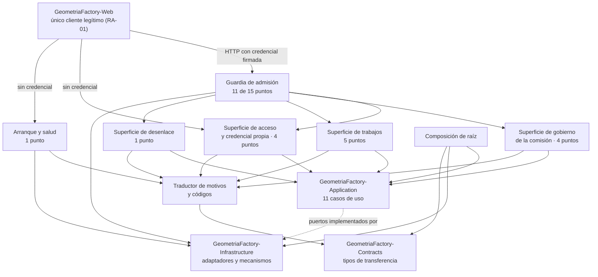
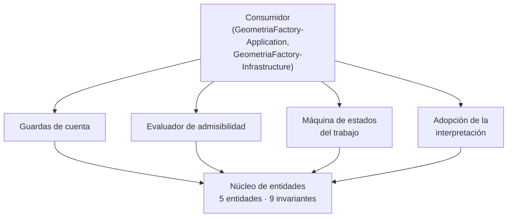
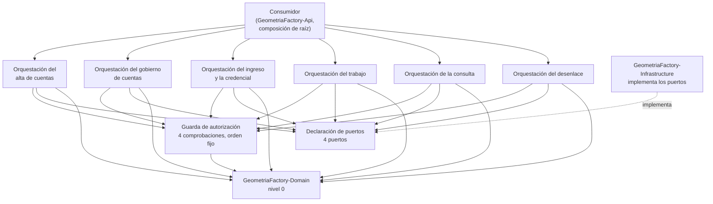
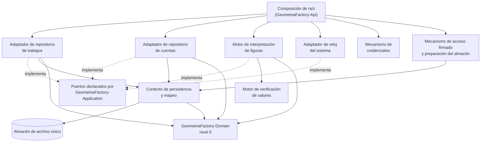

# Arquitectura de la unidad de entrega — GeometriaFactory-Api

**Producto:** Fábrica de Geometría
**Unidad de entrega:** GeometriaFactory-Api
**Documento:** Arquitectura-Unidad-Entrega.md
**Versión:** 3.0
**Estado:** Propuesto
**Fecha:** 2026-08-16
**`tipo_unidad_entrega` (D8):** `rest-api` · **Unidad de entrega principal del producto**
**Proyectos de código que la componen:** `GeometriaFactory-Api`, `GeometriaFactory-Domain`, `GeometriaFactory-Application`, `GeometriaFactory-Infrastructure` y `GeometriaFactory-Contracts`
**Trazabilidad upstream:** [`../../../../Intake/PRODUCT-INTAKE-Fabrica-De-Geometria.md`](../../../../Intake/PRODUCT-INTAKE-Fabrica-De-Geometria.md) **2.1**
**Consolida a:** los documentos homónimos de las capas que componen la unidad, por `Audit/Migracion-M10-Consolidacion-Fusion.md` 1.2 §4

---

## 0. Cómo leer este documento

**La unidad de entrega tiene un solo documento de esta clase.** Cada sección lleva **una subsección
por proyecto de código**, con su texto **transpuesto sin reescritura**.

**Las once secciones son comunes a las cuatro capas**, y ésa es la señal de que la arquitectura de la
unidad es genuinamente una: las cuatro responden las mismas preguntas sobre partes distintas del mismo
proceso desplegado. Es el documento **más grande del inventario de la fusión** —732 líneas únicas— y
el que más se degradaba leído por capas: la composición de raíz del host y los puertos que la capa de
aplicación declara **son los dos extremos del mismo cable**, y hasta ahora vivían en documentos que no
se citaban entre sí.

---

## 1. Objetivo

### 1.1 `GeometriaFactory-Api`

Documenta la arquitectura interna de `GeometriaFactory-Api`, el **proyecto de código principal** del producto y el único que ensambla a los demás: qué componentes tiene, cómo se reparten los **doce** casos de uso de la categoría 02, cómo se conectan los **cuatro** puertos con sus adaptadores, cómo se traducen los **diecisiete** códigos vivos del contrato a los **diez** códigos de respuesta, y qué decisiones estructurales sostienen que ninguno de los **quince** puntos de acceso quede fuera de la guardia. Se dirige a quien implementa el servicio y a las categorías 06, 08, 09 y 10.

**Es la frontera del proceso, y por lo tanto el único lugar del backend donde una decisión ya tomada puede deshacerse sin que nadie lo note.** Dos reglas de negocio —`RN-00003` y `RN-00013`— se rompen hacia afuera desde acá, y ninguna capa de adentro se enteraría.

No documenta las reglas del producto, ni la orquestación, ni la interpretación del texto, ni el esquema del dato guardado: los cuatro viven en los proyectos de código que este ensambla, y §2.2 declara cuáles de sus decisiones hereda sin reabrir.

### 1.2 `GeometriaFactory-Domain`

Documenta la arquitectura interna de `GeometriaFactory-Domain`: qué componentes tiene, cómo se reparten las **dieciséis** reglas de negocio y los **nueve** invariantes del producto, y qué decisiones estructurales sostienen que el dominio se pueda probar sin persistencia, sin red y sin marco de aplicación. Se dirige a quien implementa la biblioteca y a las categorías 06, 08 y 09, que derivan de acá su backlog, sus pruebas y sus puertas de construcción.

No documenta el modelo de datos físico —este proyecto de código declara su persistencia como «no aplica» (`PRODUCT-INTAKE` §17.1.P.4 · GeometriaFactory-Domain) y el flag `tiene_persistencia` es false (`PRODUCT-MANIFEST` §5)— ni el mecanismo de autenticación, que vive en `GeometriaFactory-Infrastructure` y en `GeometriaFactory-Api`.

### 1.3 `GeometriaFactory-Application`

Documenta la arquitectura interna de `GeometriaFactory-Application`, la capa de casos de uso del producto: qué componentes tiene, cómo se reparten los **once** casos de uso, dónde se ejerce cada una de las **cuatro** comprobaciones de autorización y qué decisiones estructurales sostienen que un caso de uso entero se pueda probar con dobles, sin base de datos y sin frontera de proceso. Se dirige a quien implementa la biblioteca y a las categorías 06, 08 y 09.

No documenta el modelo de datos físico —este proyecto de código declara su persistencia como «no aplica directamente» (`PRODUCT-INTAKE` §17.1.P.4 · GeometriaFactory-Application) y el flag `tiene_persistencia` es false (`PRODUCT-MANIFEST` §5)—, ni el mecanismo de autenticación, ni la interpretación efectiva del texto del alumno: las tres cosas viven detrás de los puertos, en `GeometriaFactory-Infrastructure`.

### 1.4 `GeometriaFactory-Infrastructure`

Documenta la arquitectura interna de `GeometriaFactory-Infrastructure`, la capa donde el producto **toca el mundo**: qué componentes tiene, cómo se reparten los **diez** casos de uso de la categoría 02, cómo se materializan los **cuatro** puertos que `GeometriaFactory-Application` declara, y qué decisiones estructurales sostienen que el validador de figuras —la pieza de más riesgo del producto— se pueda ejercer entero sin almacén y sin red. Se dirige a quien implementa los adaptadores y a las categorías 06, 08 y 09.

No documenta las reglas del producto —viven en `GeometriaFactory-Domain`—, ni la orquestación ni la autorización —viven en `GeometriaFactory-Application`—, ni la traducción a respuesta de protocolo, que es de `GeometriaFactory-Api`. Sí documenta, y es el único documento de la cadena que lo hace, el **modelo lógico del dato guardado**, en [`Modelo-Datos-Logico.md`](Modelo-Datos-Logico.md).

## 2. Estilo arquitectónico

### 2.1 `GeometriaFactory-Api`

**Estilo elegido: host delgado sobre una composición de raíz única.** Es lo que `PRODUCT-INTAKE` §17.1.P.2 · GeometriaFactory-Api declara tomado aguas arriba —«endpoints que traducen petición a caso de uso y resultado a tipo de transferencia, más la composición de raíz que conecta puertos con adaptadores»— y lo que [`ADR-00001`](Adrs/ADR-00001-Host-Delgado-Con-Composicion-De-Raiz-Unica.md) registra con su contexto y sus consecuencias.

En términos de esta categoría, el estilo se concreta en seis propiedades estructurales:

1. **Ningún punto de acceso contiene lógica de negocio.** Traduce petición a caso de uso, invoca, traduce resultado a tipo de transferencia y elige el código de respuesta. Lo que exceda eso está mal ubicado ([`ADR-00001`](Adrs/ADR-00001-Host-Delgado-Con-Composicion-De-Raiz-Unica.md)).
2. **Una sola composición de raíz, y es el único lugar donde los cuatro puertos se conectan con sus adaptadores** ([`ADR-00006`](Adrs/ADR-00006-Composicion-De-Raiz-Ciclos-De-Vida-Y-Configuracion.md)).
3. **La guardia es transversal y alcanza a los once puntos que exigen acceso, sin excepción declarada salvo una** ([`ADR-00003`](Adrs/ADR-00003-Credencial-Firmada-Papel-Por-Punto-Y-Guardia-Transversal.md)).
4. **Dos traducciones, en ese orden, y ninguna inventa códigos**: motivo interno a código del contrato, y código del contrato a código de respuesta ([`ADR-00004`](Adrs/ADR-00004-Dos-Traducciones-Con-Tabla-Unica-Y-Sin-Codigos-Inventados.md)).
5. **El formato de intercambio se fija acá, para los dos extremos** ([`ADR-00002`](Adrs/ADR-00002-Formato-De-Intercambio-Y-Su-Configuracion.md)).
6. **El arranque prepara el almacén antes de atender, y se detiene antes que atender mal** ([`ADR-00007`](Adrs/ADR-00007-Arranque-En-Dos-Fases-Y-Punto-De-Salud-Sin-Acceso.md)).

### 2.1 Alternativas descartadas

Las dos primeras las descarta el intake y esta categoría no las reabre; las dos siguientes las evalúa y las descarta esta categoría.

| Alternativa | A favor | En contra | Resolución |
| --- | --- | --- | --- |
| Servicio con lógica en los puntos de acceso | Menos capas, menos traducción, cada punto se lee entero en un archivo | Haría inseparable la verificación de pertenencia de la capa de transporte y volvería obligatoria una prueba de integración para cada regla | **Descartada** por `PRODUCT-INTAKE` §17.1.P.2 · GeometriaFactory-Api |
| Servicio de fachada que devuelva vistas ya armadas | Menos viajes y menos armado del lado del front | El front arma sus vistas en el servidor del hosting; una fachada agregaría un salto sin quitar ninguno | **Descartada** por `PRODUCT-INTAKE` §17.1.P.2 · GeometriaFactory-Api |
| Composición de raíz repartida en módulos, uno por área | Cada área declara lo suyo y el archivo de composición no crece | La frontera dejaría de ser contable en un solo lugar, y **el defecto característico de esta capa es de omisión**: un puerto sin adaptador o un punto sin guardia se detectan comparando contra una lista, no leyendo un módulo | **Descartada** por esta categoría, ver [`ADR-00006`](Adrs/ADR-00006-Composicion-De-Raiz-Ciclos-De-Vida-Y-Configuracion.md) §4 |
| Paginación en el listado de trabajos y en el de cuentas | Acota el tamaño de la respuesta y protege el tiempo de listado si la comisión crece | **Ninguna fuente la declara**, el caudal previsto es de una comisión durante una clase, y agregarla obliga a un tipo de transferencia nuevo en un ensamblado que dos extremos compilan juntos. La proyección sin componentes ya es lo que sostiene el requerimiento de tiempo | **Descartada** por esta categoría, con condición de reingreso declarada, ver [`ADR-00005`](Adrs/ADR-00005-Sin-Paginacion-Con-Condicion-De-Reingreso-Declarada.md) |

### 2.2 Qué hereda de los cuatro proyectos de código que ensambla y no reabre

Este proyecto de código depende por compilación de tres —`GeometriaFactory-Application`, `GeometriaFactory-Infrastructure` y `GeometriaFactory-Contracts`— y **es alcanzado por HTTP** por un cuarto, `GeometriaFactory-Web`, que no depende de él por compilación. Los cinco tienen su Fase C emitida. **Siete** decisiones suyas lo condicionan y **se citan, no se rehacen**.

| Decisión heredada | Dónde está | Qué obliga acá |
| --- | --- | --- |
| Los cuatro puertos son la frontera, y el cuarto no tiene identificador declarado | [`Application ADR-04002`](Adrs/ADR-04002-Cuatro-Puertos-Y-La-Frontera-Que-Declaran.md) | La composición de raíz conecta **exactamente cuatro** puertos con cuatro adaptadores. El nombre del cuarto se fija en el punto de control de la etapa `a` y **no acá** |
| Toda negativa prevista viaja como resultado tipado, con catálogo cerrado | [`Application ADR-04006`](Adrs/ADR-04006-Resultado-Tipado-Y-Catalogo-Cerrado-De-Condiciones.md) | Esta capa **recibe valores, no excepciones**, y traduce. Un motivo que llegue como excepción es un defecto del consumidor, no un camino |
| Un caso de uso, una unidad de trabajo | [`Application ADR-04005`](Adrs/ADR-04005-Un-Caso-De-Uso-Una-Unidad-De-Trabajo.md) | **Una petición ejerce a lo sumo un caso de uso**, y esta capa no abre ninguna unidad de trabajo por su cuenta |
| El conjunto cerrado de códigos del contrato, y la regla de exposición de la frontera | [`Contracts ADR-08002`](../../../Producto/Adrs/ADR-08002-Tipo-De-Error-Unico-Con-Conjunto-Cerrado.md) y [`Contracts ADR-08004`](../../../Producto/Adrs/ADR-08004-Regla-De-Exposicion-De-La-Frontera.md) | **Esta capa no agrega, no renombra y no traduce a texto ningún código del contrato**, y no agrega ni recorta campos de los tipos de transferencia |
| El ensamblado de contratos **no impone formato de intercambio**, y la elección le corresponde a esta capa y al front | [`Contracts ADR-08001`](../../../Producto/Adrs/ADR-08001-Tipos-De-Transferencia-Planos-Sin-Dependencias.md) y su `PA-03` | **Esta categoría lo fija**, para los dos extremos, en [`ADR-00002`](Adrs/ADR-00002-Formato-De-Intercambio-Y-Su-Configuracion.md) |
| La dirección del servicio de datos llega al front por configuración, y el front adopta el formato que esta capa fije | [`Web ADR-10007`](../../GeometriaFactory-Web/05-Arquitectura-Tecnica/Adrs/ADR-10007-Direccion-Del-Servicio-De-Datos-Desde-Configuracion.md) y `PA-03` de [`Web`](../../GeometriaFactory-Web/05-Arquitectura-Tecnica/Arquitectura-Unidad-Entrega.md) §11 | La decisión de formato **no se puede tomar de un solo lado**, y `GeometriaFactory-Web` declaró que la toma esta categoría y que él la adopta |
| El motor de interpretación no impone límite de tamaño al texto, y exige que el borde **rechace y nunca trunque** | [`Infrastructure ADR-06006`](Adrs/ADR-06006-Lectura-Tolerante-Y-Tabla-De-Derivacion-Por-Tipo.md) §2 punto 3 | El límite de cuerpo lo fija esta categoría, con la forma de rechazo que aquella ADR le exige ([`ADR-00002`](Adrs/ADR-00002-Formato-De-Intercambio-Y-Su-Configuracion.md) §2 punto 6) |

### 2.2 `GeometriaFactory-Domain`

**Estilo elegido: modelo de dominio rico con invariantes explícitas, como núcleo de una arquitectura de capas con dependencias hacia adentro.** Es la decisión que `PRODUCT-INTAKE` §17.1.P.2 · GeometriaFactory-Domain declara tomada aguas arriba y que [`ADR-02001`](Adrs/ADR-02001-Modelo-De-Dominio-Rico-Con-Invariantes-Explicitas.md) registra con su contexto y sus consecuencias.

En términos de esta categoría, el estilo se concreta en cuatro propiedades estructurales:

1. **Cero dependencias salientes.** El proyecto de código no referencia ningún otro proyecto de código del producto ni ninguna biblioteca de persistencia, de transporte o de serialización (`PRODUCT-INTAKE` §17.1.P.1 · GeometriaFactory-Domain). Es nivel 0 del orden topológico del `PRODUCT-MANIFEST` §3.
2. **Las guardas son la superficie pública.** Lo que el consumidor invoca son operaciones que aceptan o rechazan, y el rechazo es un valor de retorno tipado y no una excepción de control de flujo. Lo desarrolla [`Contratos-Abstractions.md`](Contratos-Abstractions.md).
3. **El tiempo y la unicidad entran por parámetro.** El dominio no lee el reloj ni consulta conjuntos de entidades: las dos cosas se las aporta el consumidor ([`ADR-02006`](Adrs/ADR-02006-El-Dominio-No-Lee-El-Reloj-Ni-El-Conjunto.md)).
4. **La admisibilidad es la puerta única de las guardas de cuenta.** `INV-06` e `INV-09` se ejercen en un solo lugar, y no repetidos en cada operación ([`ADR-02005`](Adrs/ADR-02005-Guarda-Unica-De-Admisibilidad.md)).

### 2.1 Alternativas descartadas

Las dos primeras las descarta el intake y esta categoría no las reabre; la tercera la evalúa y la descarta esta categoría.

| Alternativa | A favor | En contra | Resolución |
| --- | --- | --- | --- |
| Modelo anémico, con la lógica en los servicios de aplicación | Menos tipos, menos ceremonia, la lógica queda toda junta | Los invariantes y las transiciones —que son precisamente lo que hay que poder probar sin infraestructura— quedarían fuera del proyecto de código sin dependencias, y su verificación pasaría a exigir el resto de las capas | **Descartada** por `PRODUCT-INTAKE` §17.1.P.2 · GeometriaFactory-Domain |
| Entidades del proveedor de persistencia como modelo de dominio | Un solo juego de tipos entre dominio y base de datos | Ata el dominio al proveedor y viola la regla de dependencias hacia adentro; además obligaría a referenciar una biblioteca de persistencia desde el nivel 0 | **Descartada** por `PRODUCT-INTAKE` §17.1.P.2 · GeometriaFactory-Domain |
| Un agregado único que abarque cuenta y trabajo | Una sola puerta de consistencia, imposible de saltear | Las dos entidades raíz no comparten ninguna invariante: ninguna de las nueve liga el estado de una cuenta con el estado de un trabajo. El agregado único cargaría toda la cuenta en cada operación de trabajo sin comprar consistencia | **Descartada** por esta categoría, ver [`ADR-02001`](Adrs/ADR-02001-Modelo-De-Dominio-Rico-Con-Invariantes-Explicitas.md) §4 |

### 2.2 Por qué no se evalúan los estilos de sistema distribuido

La tabla de estilos contra criterios de elección de la regla de la categoría contempla pipeline, capas, hexagonal, microservicios y event-driven. Acá sólo los tres primeros son evaluables: este proyecto de código **no es una unidad de despliegue** —no tiene proceso, no atiende peticiones y no abre conexiones (`PRODUCT-INTAKE` §17.1.P.10 · GeometriaFactory-Domain)—, de modo que «deploy independiente» y «complejidad operativa» no tienen valor que comparar. La elección real es entre modelo rico y modelo anémico dentro de una arquitectura de capas, que es lo que §2.1 resuelve.

### 2.3 `GeometriaFactory-Application`

**Estilo elegido: casos de uso con inversión de dependencias, como capa de aplicación de una arquitectura de capas con dependencias hacia adentro.** Es lo que `PRODUCT-INTAKE` §17.1.P.2 · GeometriaFactory-Application declara tomado aguas arriba y lo que [`ADR-04001`](Adrs/ADR-04001-Casos-De-Uso-Con-Inversion-De-Dependencias.md) registra con su contexto y sus consecuencias.

En términos de esta categoría, el estilo se concreta en cinco propiedades estructurales:

1. **Una sola dependencia saliente.** El proyecto de código referencia `GeometriaFactory-Domain` y nada más: ni biblioteca de persistencia, ni marco web, ni cliente de transporte (`PRODUCT-INTAKE` §17.1.P.1 · GeometriaFactory-Application). Es nivel 1 del orden topológico del `PRODUCT-MANIFEST` §3.
2. **Los puertos son la frontera, y los declara esta capa.** Lo que acá se declara lo implementa `GeometriaFactory-Infrastructure`, y la composición de raíz de `GeometriaFactory-Api` los conecta ([`ADR-04002`](Adrs/ADR-04002-Cuatro-Puertos-Y-La-Frontera-Que-Declaran.md)).
3. **Acá se autoriza, no se autentica.** Las cuatro comprobaciones —pertenencia, facultad, alcance del administrador y cambio de contraseña pendiente— se ejercen sobre el pedido concreto, con un orden fijo ([`ADR-04004`](Adrs/ADR-04004-Orden-Fijo-De-Las-Cuatro-Comprobaciones.md)).
4. **Un caso de uso, una unidad de trabajo.** El alcance transaccional lo fija esta capa y no el adaptador de persistencia ([`ADR-04005`](Adrs/ADR-04005-Un-Caso-De-Uso-Una-Unidad-De-Trabajo.md)).
5. **Toda negativa prevista viaja como resultado tipado**, con su código tomado del catálogo cerrado de **36** condiciones de la categoría 03 ([`ADR-04006`](Adrs/ADR-04006-Resultado-Tipado-Y-Catalogo-Cerrado-De-Condiciones.md)).

### 2.1 Alternativas descartadas

Las dos primeras las descarta el intake y esta categoría no las reabre; la tercera la evalúa y la descarta esta categoría.

| Alternativa | A favor | En contra | Resolución |
| --- | --- | --- | --- |
| Servicios que consultan directamente el contexto de persistencia | Menos tipos, consultas a medida en cada caso de uso, sin mapeo intermedio | Haría imposible probar la autorización por pertenencia sin base de datos, que es justo lo que la fuente exige probar; y metería una biblioteca de persistencia en el nivel 1 | **Descartada** por `PRODUCT-INTAKE` §17.1.P.2 · GeometriaFactory-Application |
| Mediador con manejadores y canalización de comportamientos | Comportamientos transversales —autorización, registro, validación— resueltos una sola vez en la canalización | Sobre-ingeniería para el alcance que la fuente declara **básica**; además haría que la comprobación transversal viviera en una infraestructura de la que esta capa hoy no depende | **Descartada** por `PRODUCT-INTAKE` §17.1.P.2 · GeometriaFactory-Application |
| Un caso de uso por operación elemental, en lugar de los once del recorte de la categoría 02 | Contratos más chicos, cada uno con una sola postcondición | Multiplicaría los lugares donde repetir las cuatro comprobaciones y la unidad de trabajo. La categoría 02 ya resolvió el recorte por objeto y por sujeto, con sus fusiones y particiones declaradas, y rehacerlo acá cambiaría identificadores que otras categorías ya citan | **Descartada** por esta categoría, ver [`ADR-04001`](Adrs/ADR-04001-Casos-De-Uso-Con-Inversion-De-Dependencias.md) §4 |

### 2.2 Qué hereda de la arquitectura de dominio y no reabre

`GeometriaFactory-Domain` es la única dependencia de compilación de este proyecto de código, y su Fase C está emitida. Tres decisiones suyas condicionan a ésta y **se citan, no se rehacen**:

| Decisión del nivel 0 | Dónde está | Qué obliga acá |
| --- | --- | --- |
| El dominio no lee el reloj ni el conjunto de entidades: los dos entran por parámetro | [`Domain ADR-02006`](Adrs/ADR-02006-El-Dominio-No-Lee-El-Reloj-Ni-El-Conjunto.md) | Esta capa es **quien los aporta**: el momento por el puerto de reloj y la unicidad ya resuelta por el puerto de repositorio de cuentas. Es el origen de dos de los cuatro puertos |
| La admisibilidad es la puerta única de las guardas de acceso de la cuenta, y el dominio no puede impedir que exista un camino que la saltee | [`Domain ADR-02005`](Adrs/ADR-02005-Guarda-Unica-De-Admisibilidad.md) §6 punto 1 | Esa dependencia de disciplina **cae acá**. La cuarta comprobación de [`ADR-04004`](Adrs/ADR-04004-Orden-Fijo-De-Las-Cuatro-Comprobaciones.md) es la forma concreta que toma en esta capa, y es la razón por la que corta antes que las otras tres |
| La superficie pública del dominio son guardas con resultado tipado, no excepciones | [`Domain ADR-02002`](Adrs/ADR-02002-Superficie-Publica-De-Guardas-Y-Resultados-Tipados.md) | Esta capa **no puede** convertir un rechazo del dominio en excepción sin perder la propiedad que aquella ADR compró. [`ADR-04006`](Adrs/ADR-04006-Resultado-Tipado-Y-Catalogo-Cerrado-De-Condiciones.md) la continúa hacia arriba |

### 2.4 `GeometriaFactory-Infrastructure`

**Estilo elegido: adaptadores de puerto, uno por frontera, sobre un único contexto de persistencia.** Es lo que `PRODUCT-INTAKE` §17.1.P.2 · GeometriaFactory-Infrastructure declara tomado aguas arriba —«adaptadores que implementan los puertos de Application»— y lo que [`ADR-06001`](Adrs/ADR-06001-Adaptadores-Por-Puerto-Sin-Repositorio-Generico.md) registra con su contexto y sus consecuencias.

En términos de esta categoría, el estilo se concreta en cinco propiedades estructurales:

1. **Un adaptador por puerto, y ninguna clase que los reúna.** Los cuatro puertos tienen cuatro implementaciones separadas; la conexión de cada uno con su adaptador es de la composición de raíz de `GeometriaFactory-Api` y no de este proyecto de código ([`ADR-06001`](Adrs/ADR-06001-Adaptadores-Por-Puerto-Sin-Repositorio-Generico.md)).
2. **La mitad de esta capa no toca el almacén.** El validador de figuras, la derivación de credenciales, la producción de la provisoria y la emisión del acceso firmado **no abren el archivo de datos**, y por eso se prueban unitariamente. Es la partición que hace que la batería obligatoria del producto sea barata de correr.
3. **El alcance transaccional llega decidido y acá se expresa como una unidad de trabajo por operación** (`PRODUCT-INTAKE` §17.1.P.4 · GeometriaFactory-Infrastructure; [`ADR-06002`](Adrs/ADR-06002-Un-Archivo-Escritor-Unico-Y-Una-Unidad-De-Trabajo-Por-Operacion.md)).
4. **Cuando un mecanismo no puede cumplir su promesa, se detiene y lo dice.** No la cumple a medias, no compone un valor por otro medio y no cae hacia un sustituto. Es la regla que gobierna las **17** condiciones de [`../03-UX-UI-DX/DX-Error-Messages.md`](../03-UX-UI-DX/DX-Error-Messages.md) §2.4.
5. **Ninguna decisión de negocio vive acá.** La capa provee el mecanismo; el estado, la autorización y la admisibilidad llegan resueltos ([`../02-Especificacion-Funcional/Especificacion-Funcional.md`](../02-Especificacion-Funcional/Especificacion-Funcional.md) §4).

### 2.1 Alternativas descartadas

Las dos primeras las descarta el intake y esta categoría no las reabre; la tercera y la cuarta las evalúa y las descarta esta categoría.

| Alternativa | A favor | En contra | Resolución |
| --- | --- | --- | --- |
| Repositorio genérico sobre el conjunto de entidades | Un solo tipo para las cinco entidades, sin escribir un adaptador por puerto | Diluye las consultas que sí importan —el listado del administrador agrupado por alumno—, y obliga a que el recorte se arme del lado del consumidor, que es justo lo que `CONSULTA_SIN_ALCANCE_DECLARADO` viene a impedir | **Descartada** por `PRODUCT-INTAKE` §17.1.P.2 · GeometriaFactory-Infrastructure |
| Acceso directo con consultas escritas a mano | Control total de cada consulta, sin capa de mapeo | Las transformaciones de esquema aplicadas al arrancar son una decisión ya tomada (`PRODUCT-INTAKE` §17.1.P.4 · GeometriaFactory-Infrastructure), y el mapeador las provee. Escribirlas a mano reabriría una decisión cerrada | **Descartada** por `PRODUCT-INTAKE` §17.1.P.2 · GeometriaFactory-Infrastructure |
| Un adaptador único que implemente los cuatro puertos | Menos tipos, una sola unidad de trabajo evidente | Reuniría en un mismo componente lo que se prueba con almacén y lo que se prueba sin él, y haría que el validador —que no toca el almacén— arrastrara la dependencia de persistencia. La batería obligatoria dejaría de correr sin base | **Descartada** por esta categoría, ver [`ADR-06001`](Adrs/ADR-06001-Adaptadores-Por-Puerto-Sin-Repositorio-Generico.md) §4 |
| Reintento automático dentro del adaptador ante almacén no disponible o escritura concurrente rechazada | Absorbería la limitación de escritor único sin que el consumidor se entere | La categoría 03 declara por escrito que **esta capa no reintenta** y que la decisión de reintentar es del consumidor. Un reintento acá escondería la única señal que el producto tiene de que el almacén no está, y con escritor único multiplicaría la espera en lugar de reducirla | **Descartada** por esta categoría, ver [`ADR-06002`](Adrs/ADR-06002-Un-Archivo-Escritor-Unico-Y-Una-Unidad-De-Trabajo-Por-Operacion.md) §4 |

### 2.2 Qué hereda de los niveles 0 y 1 y no reabre

Las dos dependencias de compilación de este proyecto de código tienen su Fase C emitida. Cinco decisiones suyas lo condicionan y **se citan, no se rehacen**.

| Decisión heredada | Dónde está | Qué obliga acá |
| --- | --- | --- |
| El dominio no lee el reloj ni el conjunto de entidades | [`Domain ADR-02006`](Adrs/ADR-02006-El-Dominio-No-Lee-El-Reloj-Ni-El-Conjunto.md) | Es el origen del puerto de reloj y de las **dos** preguntas sobre el conjunto que el adaptador de cuentas responde: si un correo ya está registrado y si ya existe una cuenta con papel `Administrador` |
| Los cuatro puertos son la frontera, y el cuarto no tiene identificador declarado aguas arriba | [`Application ADR-04002`](Adrs/ADR-04002-Cuatro-Puertos-Y-La-Frontera-Que-Declaran.md) | Esta capa **implementa cuatro adaptadores y ni uno más**. El identificador del cuarto **no lo fija esta categoría**, y §11 declara por qué: ver [`ADR-06003`](Adrs/ADR-06003-Comparacion-De-Correos-Y-El-Indice-Que-La-Sostiene.md) §6 y `PA-01` |
| Un caso de uso, una unidad de trabajo: el alcance lo fija la capa de aplicación | [`Application ADR-04005`](Adrs/ADR-04005-Un-Caso-De-Uso-Una-Unidad-De-Trabajo.md) | Acá se materializa el **mecanismo**, no el alcance: una unidad de trabajo por operación, con el todo o nada del arrastre de la baja como caso testigo |
| Toda condición prevista viaja como resultado tipado y el catálogo de condiciones es cerrado | [`Application ADR-04006`](Adrs/ADR-04006-Resultado-Tipado-Y-Catalogo-Cerrado-De-Condiciones.md) | Las **17** condiciones de esta capa son códigos, no excepciones ni textos, y **ninguno es un código de protocolo**: su traducción es de `GeometriaFactory-Api` |
| Ningún tipo de transferencia lleva el valor derivado de una credencial, la clave de firma ni una dirección de servicio interno | [`Contracts ADR-08004`](../../../Producto/Adrs/ADR-08004-Regla-De-Exposicion-De-La-Frontera.md) | Esta capa es **la que los conoce**, y por eso la prohibición de §1.4 de su catálogo de condiciones no es una recomendación de estilo: es la única forma de que aquella regla siga siendo cierta |

## 3. Vista lógica

### 3.1 `GeometriaFactory-Api`

### 3.1 Componentes

Un componente es acá un módulo con responsabilidad cohesiva, no una clase. Los **ocho** cubren once de los doce casos de uso de la categoría 02; dos de ellos son transversales y se declaran como tales, y el caso de uso restante se declara aparte en §3.3.

| Componente | Responsabilidad | Entradas | Salidas | Dependencias |
| --- | --- | --- | --- | --- |
| Composición de raíz | Conectar los **cuatro** puertos con sus adaptadores, fijar los ciclos de vida y tomar de configuración lo que el despliegue provee: la ubicación del almacén, la clave de firma y la vigencia del acceso. **Transversal** | Configuración del despliegue | Grafo de dependencias construido, o fallo de construcción | Los tres proyectos de código que referencia |
| Guardia de admisión | Verificar la firma y la expiración del acceso, exigir el papel que cada punto declara y aplicar la guardia del cambio de contraseña pendiente. **Transversal a los once puntos que exigen acceso** | Petición con su cabecera de autorización | Petición admitida, o `401` o `403` | Mecanismo de acceso firmado de `GeometriaFactory-Infrastructure` |
| Traductor de motivos y códigos | Convertir el motivo de la capa de aplicación en código del contrato, y el código del contrato en código de respuesta. **Transversal a los quince puntos** | Resultado tipado, o condición de adaptador | Cuerpo de error del contrato y código de respuesta | `GeometriaFactory-Contracts` |
| Superficie de acceso y credencial propia | Los **cuatro** puntos que se ejercen sin acceso firmado o sobre la propia cuenta: canje de credenciales, registro de cuenta, configuración del administrador y cambio de la contraseña propia | Petición | Acceso firmado, cuenta constituida o credencial cambiada | Guardia de admisión, Traductor, `GeometriaFactory-Application` |
| Superficie de gobierno de la comisión | Los **cuatro** puntos del administrador sobre cuentas ajenas: listado, cambio de situación, baja con confirmación escrita y reseteo con la provisoria devuelta una sola vez | Petición admitida | Situación aplicada, o la provisoria | Guardia de admisión, Traductor, `GeometriaFactory-Application` |
| Superficie de trabajos | Los **cinco** puntos sobre trabajos: envío, reenvío, eliminación con sus dos alcances, listado y detalle | Petición admitida, con el texto original **sin normalizar** | Trabajo con su estado ya decidido, proyección o detalle | Guardia de admisión, Traductor, `GeometriaFactory-Application` |
| Superficie de desenlace | El punto de aprobar o rechazar desde el estado `Pendiente`, con comentario opcional | Petición admitida | Estado terminal alcanzado | Guardia de admisión, Traductor, `GeometriaFactory-Application` |
| Arranque y salud | Disparar la preparación del almacén antes de la primera petición, detener el arranque si no se puede, y exponer el punto de salud, que **no exige acceso** | Configuración; pedido de salud | Servicio en condiciones, o arranque detenido | Composición de raíz, `GeometriaFactory-Infrastructure` |

### 3.2 Regla de dependencias interna

Las flechas son unidireccionales y el grafo es acíclico. Cinco precisiones que la vista tiene que dejar dichas:

1. **Ninguna superficie depende de otra superficie.** Las cuatro se apoyan en la guardia, en el traductor y en la capa de aplicación, y en nada más. Un punto de acceso que invocara a otro sería una petición encadenada, y **una petición ejerce a lo sumo un caso de uso**.
2. **La guardia está antes de cuatro superficies y de once puntos, y no de quince.** Los cuatro puntos que no exigen acceso firmado —canje de credenciales, registro de cuenta, configuración del administrador y salud— la atraviesan por el costado, y §3.4 los declara uno por uno para que la ausencia sea contable.
3. **El traductor está después de las cinco superficies, incluidas las que no exigen acceso.** Es lo que hace que ningún camino de fallo salga sin pasar por la tabla única.
4. **La composición de raíz no atiende peticiones y ninguna superficie depende de ella en tiempo de ejecución.** Construye el grafo y desaparece: si falla, falla **en construcción** y no hay petición que responder.
5. **La flecha de `GeometriaFactory-Web` es de tiempo de ejecución y no de compilación.** El front no depende de este proyecto de código: comparte con él el ensamblado de tipos de transferencia, que es otra cosa. Es lo que hace que el grafo del producto siga siendo acíclico.

### 3.3 Cobertura de los doce casos de uso

| Componente | Casos de uso que cubre |
| --- | --- |
| Composición de raíz | CU-00010 |
| Guardia de admisión | CU-00002, y **transversalmente** los siete casos de uso de superficie que exigen acceso |
| Traductor de motivos y códigos | CU-00009, y **transversalmente** los ocho casos de uso de superficie |
| Superficie de acceso y credencial propia | CU-00001, CU-00003 |
| Superficie de gobierno de la comisión | CU-00004, CU-00005 |
| Superficie de trabajos | CU-00006, CU-00007 |
| Superficie de desenlace | CU-00008 |
| Arranque y salud | CU-00011 |

**Once de los doce casos de uso tienen componente. El doceavo, `CU-00012`, no tiene ninguno, y es correcto que no lo tenga.** La colección de peticiones reproducible **no implementa nada: demuestra**. No es un componente de tiempo de ejecución sino un artefacto que vive en el árbol de muestras del repositorio (`PRODUCT-INTAKE` §16.1), ejercita capacidades que los otros once casos de uso ya implementan, y su obligación propia es reproducirse en **cinco pasos o menos y no inventar ningún dato de prueba**. Darle un componente haría creer que hay código de producción detrás de un guion.

**Y ningún componente queda sin caso de uso.** Los dos transversales lo declaran como tales y no aparecen como cobertura exclusiva de ninguno de los de superficie.

### 3.4 Los quince puntos de acceso contra su componente

Los quince son los de [`../02-Especificacion-Funcional/Definicion-Superficie-HTTP.md`](../02-Especificacion-Funcional/Definicion-Superficie-HTTP.md) §3, y esta tabla **no los redefine**: declara qué componente los aloja y si están bajo la guardia. Las rutas siguen siendo la propuesta derivada que aquella categoría rotuló fila por fila, y su forma definitiva se valida en el punto de control de la etapa `a`.

| Punto | Intención | Componente | ¿Bajo la guardia? |
| --- | --- | --- | --- |
| A-01 | Canjear correo y contraseña por un acceso firmado | Superficie de acceso y credencial propia | **No**: es el punto que produce el acceso |
| A-02 | Registrar una cuenta de alumno, sin campo de contraseña | Superficie de acceso y credencial propia | **No**: el registro es anónimo por diseño, y así debe seguir |
| A-03 | Configurar la cuenta de administrador, sólo mientras no exista ninguna | Superficie de acceso y credencial propia | **No**: no hay todavía identidad que pueda autenticarse |
| A-05 | Cambiar la contraseña propia exigiendo la vigente | Superficie de acceso y credencial propia | **Sí**, y es **la única excepción de la guardia del cambio pendiente** |
| A-06 | Listar las cuentas de la comisión con su situación y su marca | Superficie de gobierno de la comisión | **Sí** |
| A-07 | Cambiar la situación de una cuenta; habilitar y rehabilitar devuelven la provisoria | Superficie de gobierno de la comisión | **Sí** |
| A-08 | Dar de baja una cuenta, con el correo escrito como confirmación | Superficie de gobierno de la comisión | **Sí** |
| A-09 | Resetear la contraseña de un alumno y devolver la provisoria | Superficie de gobierno de la comisión | **Sí** |
| A-10 | Enviar un trabajo nuevo | Superficie de trabajos | **Sí** |
| A-11 | Reenviar un trabajo que quedó en `Borrador` | Superficie de trabajos | **Sí** |
| A-12 | Eliminar un trabajo, con los dos alcances | Superficie de trabajos | **Sí** |
| A-13 | Listar trabajos, con el alcance que el papel determina | Superficie de trabajos | **Sí** |
| A-14 | Obtener el detalle de un trabajo interpretado | Superficie de trabajos | **Sí** |
| A-15 | Aprobar o rechazar un trabajo en estado `Pendiente` | Superficie de desenlace | **Sí** |
| A-16 | Responder por el estado del servicio | Arranque y salud | **No**: tiene que poder responder cuando nadie puede autenticarse |

**Quince puntos: cuatro sin acceso firmado y once bajo la guardia. Cuatro más once son quince.** El identificador `A-04` **quedó retirado y no se recicla**: establecía la contraseña del primer ingreso sin credencial, y `RN-00016` suprimió esa operación en lugar de resolverla. **De los cuatro que no exigen acceso firmado, ninguno fija una contraseña sobre una cuenta existente**, y ésa es la propiedad que hay que poder comprobar sobre esta tabla.

### 3.2 `GeometriaFactory-Domain`

### 3.1 Componentes

Un componente es acá un módulo con responsabilidad cohesiva, no una clase. Los cinco cubren los trece casos de uso de la categoría 02.

| Componente | Responsabilidad | Entradas | Salidas | Dependencias |
| --- | --- | --- | --- | --- |
| Núcleo de entidades | Constituir y sostener las cinco entidades del modelo —Alumno, Trabajo, Pieza, Componente y Observación— con sus atributos y su semántica | Datos ya verificados por forma, aportados por el consumidor | Entidades constituidas, o el rechazo tipado que impidió constituirlas | Ninguna |
| Guardas de cuenta | Ejercer las reglas de la cuenta: papeles, ventana de alta del administrador, ciclo de vida y credencial derivada | Estado vigente de la cuenta y la operación pretendida | Efecto aplicado, o rechazo con su condición | Núcleo de entidades |
| Evaluador de admisibilidad | Responder si una cuenta admite acceso y con qué motivo si no lo admite. Es la puerta única de `INV-06` y de `INV-09` | Estado de cuenta, credencial derivada y marca de cambio de contraseña pendiente | Admisible, o no admisible con sus motivos | Núcleo de entidades |
| Máquina de estados del trabajo | Resolver las transiciones del trabajo: envío, desenlace, terminalidad y quién elimina en qué estado | Estado vigente del trabajo, papel del solicitante y resultado de la interpretación aportado | Estado resultante, o rechazo con su condición | Núcleo de entidades |
| Adopción de la interpretación | Incorporar al trabajo el conjunto de piezas, sus componentes y las observaciones, comprobando que están bien formados | Conjunto de piezas y observaciones producido afuera | Trabajo con su conjunto adoptado, o rechazo por conjunto mal formado | Núcleo de entidades |

**Los cinco componentes son internos.** Ninguno se expone por separado: la superficie pública del proyecto de código es la que declara [`Contratos-Abstractions.md`](Contratos-Abstractions.md), y la partición de arriba es de responsabilidad, no de espacios de nombres, que quedan abiertos hasta la etapa `a` (`PRODUCT-INTAKE` §17.1.P.11 · GeometriaFactory-Domain).

### 3.2 Regla de dependencias interna

Las flechas del diagrama son unidireccionales y el grafo es acíclico: los cuatro componentes de comportamiento dependen del núcleo de entidades y ninguno depende de otro de su mismo nivel. En particular, **las guardas de cuenta no invocan al evaluador de admisibilidad**: habilitar, bloquear, rehabilitar y dar de baja son actos del administrador sobre una cuenta ajena, y no requieren que la cuenta operada sea admisible. Quien exige admisibilidad es el consumidor, sobre la cuenta que solicita, antes de llegar a cualquiera de los cuatro componentes.

### 3.3 Cobertura de los trece casos de uso

| Componente | Casos de uso que cubre |
| --- | --- |
| Núcleo de entidades | CU-02001, CU-02005, CU-02006, CU-02007, CU-02012 |
| Guardas de cuenta | CU-02001, CU-02002, CU-02003, CU-02012, CU-02013 |
| Evaluador de admisibilidad | CU-02004 |
| Máquina de estados del trabajo | CU-02008, CU-02009, CU-02010, CU-02011 |
| Adopción de la interpretación | CU-02006, CU-02007 |

Los trece casos de uso tienen componente. Ninguno queda sin cubrir y ningún componente queda sin caso de uso.

### 3.3 `GeometriaFactory-Application`

### 3.1 Componentes

Un componente es acá un módulo con responsabilidad cohesiva, no una clase. Los **ocho** cubren los once casos de uso de la categoría 02; dos de ellos son transversales y se declaran como tales.

| Componente | Responsabilidad | Entradas | Salidas | Dependencias |
| --- | --- | --- | --- | --- |
| Guarda de autorización | Ejercer las **cuatro** comprobaciones —cambio de contraseña pendiente, pertenencia, facultad y alcance del administrador— en el orden fijo de [`ADR-04004`](Adrs/ADR-04004-Orden-Fijo-De-Las-Cuatro-Comprobaciones.md), sobre el dato ya recuperado y antes de escribir | Identidad ya resuelta afuera, papel, marca de cambio pendiente y la entidad pedida | Autorizado, o la condición que lo impidió | Declaración de puertos, `GeometriaFactory-Domain` |
| Declaración de puertos | Declarar la frontera que `GeometriaFactory-Infrastructure` implementa: repositorio de trabajos, validación de figuras, reloj del sistema y repositorio de cuentas | Ninguna: son declaraciones | Contratos que otro proyecto de código implementa | Ninguna |
| Orquestación del alta de cuentas | Los dos caminos de alta, con estados iniciales opuestos y credencial prohibida en uno y exigida en el otro | Datos de la cuenta pretendida | Cuenta constituida, o la condición | Guarda de autorización, Declaración de puertos, `GeometriaFactory-Domain` |
| Orquestación del gobierno de cuentas | Habilitar, bloquear, rehabilitar y dar de baja, con confirmación escrita y arrastre; y el reseteo, con la provisoria ya producida y la marca puesta | Operación pretendida sobre una cuenta ajena | Efecto aplicado, o la condición | Guarda de autorización, Declaración de puertos, `GeometriaFactory-Domain` |
| Orquestación del ingreso y la credencial | La consulta de admisibilidad con su motivo, la fijación de la credencial derivada dentro de la habilitación y su reemplazo por la propia cuenta, que es lo único que levanta la marca | Cuenta y credencial **ya derivada** | Admisible con su motivo, o efecto sobre la credencial | Guarda de autorización, Declaración de puertos, `GeometriaFactory-Domain` |
| Orquestación del trabajo | Constituir y reeditar el trabajo, enviarlo interpretando su texto por el puerto, y retirarlo con sus dos alcances opuestos | Texto original íntegro, papel del solicitante y estado vigente | Trabajo con su estado resuelto por el dominio, o la condición | Guarda de autorización, Declaración de puertos, `GeometriaFactory-Domain` |
| Orquestación de la consulta | Resolver las dos consultas con su predicado de alcance ya aplicado: la del alumno sobre lo propio y la del administrador sobre la comisión sin borradores; y el detalle, equivalente para los dos | Filtros y papel del solicitante | Proyección de listado sin componentes, o detalle completo | Guarda de autorización, Declaración de puertos, `GeometriaFactory-Domain` |
| Orquestación del desenlace | Aprobar o rechazar desde estado `Pendiente`, con comentario opcional, y propagar la terminalidad | Desenlace pretendido y comentario | Estado terminal alcanzado, o la condición | Guarda de autorización, Declaración de puertos, `GeometriaFactory-Domain` |

**Los ocho componentes son internos.** La superficie pública del proyecto de código es la que declara [`Contratos-Abstractions.md`](Contratos-Abstractions.md), y la partición de arriba es de responsabilidad y no de espacios de nombres, que quedan abiertos hasta el punto de control de la etapa `a` (`PRODUCT-INTAKE` §17.1.P.11 · GeometriaFactory-Domain, heredado por §17.1.P.7 · GeometriaFactory-Application al declararse idéntico).

### 3.2 Regla de dependencias interna

Las flechas son unidireccionales y el grafo es acíclico. Tres precisiones que la vista tiene que dejar dichas:

1. **Ningún orquestador depende de otro orquestador.** Los seis se apoyan en la guarda, en los puertos y en el dominio, y en nada más. Un caso de uso que necesitara a otro sería señal de que el recorte de la categoría 02 está mal, y ése no se reabre acá.
2. **La flecha de `GeometriaFactory-Infrastructure` es de implementación y va al revés que la de dependencia.** Es la inversión: la punteada del diagrama no es una dependencia de este proyecto de código, es otro proyecto de código cumpliendo un contrato que éste declara. Este proyecto de código no lo nombra ni lo referencia.
3. **La guarda de autorización no lee el conjunto ni escribe.** Trabaja sobre la entidad ya recuperada por el orquestador, que es lo que hace que se pueda ejercer con dobles y sin base de datos.

### 3.3 Cobertura de los once casos de uso

| Componente | Casos de uso que cubre |
| --- | --- |
| Guarda de autorización | **Los once**, de forma transversal: `CU-04001` a `CU-04011` |
| Declaración de puertos | **Los once**, de forma transversal: ningún caso de uso se ejerce sin al menos un puerto |
| Orquestación del alta de cuentas | CU-04001, CU-04010 |
| Orquestación del gobierno de cuentas | CU-04002, CU-04011 |
| Orquestación del ingreso y la credencial | CU-04003 |
| Orquestación del trabajo | CU-04004, CU-04005, CU-04009 |
| Orquestación de la consulta | CU-04006, CU-04007 |
| Orquestación del desenlace | CU-04008 |

Los once casos de uso tienen componente y ningún componente queda sin caso de uso. Los dos transversales lo declaran como tales y no aparecen como cobertura exclusiva de ninguno.

### 3.4 Los cuatro puertos como frontera

Los cuatro son los de [`../02-Especificacion-Funcional/Especificacion-Funcional.md`](../02-Especificacion-Funcional/Especificacion-Funcional.md) §3, y esta tabla no los redefine: declara qué componente los consume y qué decisión de arquitectura los gobierna.

| Puerto | Identificador declarado en el intake | Componentes que lo consumen | ADR |
| --- | --- | --- | --- |
| Repositorio de trabajos | `IWorkRepository` (`PRODUCT-INTAKE` §17.1.P.1 · GeometriaFactory-Application) | Gobierno de cuentas, Trabajo, Consulta, Desenlace | ADR-04002, ADR-04005 |
| Validación de figuras | `IFigureValidator` (`PRODUCT-INTAKE` §17.1.P.1 · GeometriaFactory-Application) | Trabajo, sólo en el envío | ADR-04002 |
| Reloj del sistema | `ISystemClock` (`PRODUCT-INTAKE` §17.1.P.1 · GeometriaFactory-Application) | Alta de cuentas, Gobierno de cuentas, Ingreso y credencial, Trabajo, Desenlace | ADR-04002 |
| Repositorio de cuentas | **Ninguno**: el intake nombra tres puertos y no éste | Alta de cuentas, Gobierno de cuentas, Ingreso y credencial, Consulta | ADR-04002 |

**El cuarto puerto no tiene identificador declarado aguas arriba, y esta categoría no lo inventa.** La categoría 02 lo elevó como punto abierto y lo derivó explícitamente a esta categoría; lo que esta categoría hace es **confirmar que el puerto existe y que su ausencia en el intake es una omisión de nombre y no de alcance**, y dejar el nombre en el punto de control de la etapa `a`. Ver `PA-01` en §11 y [`ADR-04002`](Adrs/ADR-04002-Cuatro-Puertos-Y-La-Frontera-Que-Declaran.md) §6.

### 3.4 `GeometriaFactory-Infrastructure`

### 3.1 Componentes

Un componente es acá un módulo con responsabilidad cohesiva, no una clase. Los **ocho** cubren los diez casos de uso de la categoría 02; uno de ellos es transversal y se declara como tal.

| Componente | Responsabilidad | Entradas | Salidas | Dependencias |
| --- | --- | --- | --- | --- |
| Contexto de persistencia y mapeo | Declarar el mapa entre las **cinco** entidades del modelo conceptual y el esquema físico de [`Modelo-Datos-Logico.md`](Modelo-Datos-Logico.md), y ofrecer la unidad de trabajo. **Transversal**: no implementa ningún puerto | Configuración de ubicación del almacén | Unidad de trabajo y consultas materializables | `GeometriaFactory-Domain` |
| Adaptador de repositorio de trabajos | Recuperar un trabajo, resolver la consulta **ya acotada**, materializar el resultado y ejecutar el retiro, con las dos formas de lectura —proyección de listado y detalle completo— | Pedido con su recorte declarado; entidad a materializar | Trabajo, proyección, o la condición | Contexto de persistencia y mapeo, `GeometriaFactory-Application`, `GeometriaFactory-Domain` |
| Adaptador de repositorio de cuentas | Recuperar una cuenta por su correo, responder las **dos** preguntas sobre el conjunto y materializar el resultado, **incluida la marca de cambio de contraseña pendiente** | Correo, cuenta a materializar | Cuenta, respuesta de conjunto, o la condición | Contexto de persistencia y mapeo, `GeometriaFactory-Application`, `GeometriaFactory-Domain` |
| Motor de interpretación de figuras | Leer el texto del alumno con las **cuatro** tolerancias `T1` a `T4`, reconstruir las piezas con su posición y emitir las observaciones ubicadas. **No abre el almacén y no hace red** | Texto original íntegro | Cantidad de figuras del conjunto raíz, piezas y observaciones | `GeometriaFactory-Application`, `GeometriaFactory-Domain` |
| Motor de verificación de valores | Derivar `Area` y `Volumen` según la tabla de [`Flujo-Ejecucion.md`](Flujo-Ejecucion.md) §5 y compararlos con los declarados, con tolerancia **0.01** y operador **estricto** | Piezas ya reconstruidas | Advertencias con el par de valores | Motor de interpretación de figuras |
| Adaptador de reloj del sistema | Devolver el momento actual. Es el contrato más corto de la capa y el que hace reproducibles los sellos en prueba | Ninguna | Momento | Ninguna |
| Mecanismo de credenciales | Derivar una contraseña, verificar una credencial contra un valor derivado y **producir la contraseña provisoria** de la habilitación y del reseteo | Contraseña en claro, o nada en la producción | Valor derivado, veredicto, o provisoria | Ninguna del producto; la fuente de material impredecible del sistema |
| Mecanismo de acceso firmado y preparación del almacén | Emitir y verificar el acceso con sus **cuatro** reclamos, y dejar el almacén en condiciones antes de la primera petición, deteniendo el arranque antes que operar sobre un almacén en el que no se puede confiar | Reclamos y clave de firma; linaje de transformaciones | Acceso, veredicto, almacén preparado, o arranque detenido | Contexto de persistencia y mapeo |

**Los ocho componentes son internos.** La superficie pública del proyecto de código es la que declara [`Contratos-Abstractions.md`](Contratos-Abstractions.md), y la partición de arriba es de responsabilidad y no de espacios de nombres, que quedan abiertos hasta el punto de control de la etapa `a` (`PRODUCT-INTAKE` §17.1.P.7 · GeometriaFactory-Infrastructure, idéntico a §17.1.P.7 · GeometriaFactory-Domain, con los nombres de tipos anclados ahí).

### 3.2 Regla de dependencias interna

Las flechas son unidireccionales y el grafo es acíclico. Cuatro precisiones que la vista tiene que dejar dichas:

1. **Ningún adaptador depende de otro adaptador.** El único par acoplado son los dos motores, y en una sola dirección: la verificación de valores **exige las piezas ya reconstruidas** y por eso `CONJUNTO_DE_PIEZAS_NO_RECONSTRUIDO` existe. La dirección inversa no existe: la interpretación no consulta la verificación.
2. **Los dos motores, el reloj y el mecanismo de credenciales no dependen del contexto de persistencia.** Es la propiedad que hace que la mitad de la batería de pruebas de esta capa sea unitaria y sin almacén, y la que sostiene el NFR de los **200 ms** de §8.
3. **La flecha hacia los puertos es de implementación y va al revés que la de dependencia.** Este proyecto de código depende de `GeometriaFactory-Application` por compilación y le implementa sus contratos; la capa de aplicación no lo nombra.
4. **La composición de raíz no es de acá.** Este proyecto de código no registra sus propios adaptadores ni decide sus ciclos de vida: los declara y `GeometriaFactory-Api` los conecta. Un registro automático desde acá haría que la frontera dejara de ser contable.

### 3.3 Cobertura de los diez casos de uso

| Componente | Casos de uso que cubre |
| --- | --- |
| Contexto de persistencia y mapeo | **Transversal**: CU-06003, CU-06004, CU-06005 y CU-06010. Ningún caso de uso que toque el almacén lo evita |
| Adaptador de repositorio de trabajos | CU-06003, CU-06004 |
| Adaptador de repositorio de cuentas | CU-06005, CU-06004 |
| Motor de interpretación de figuras | CU-06001 |
| Motor de verificación de valores | CU-06002 |
| Adaptador de reloj del sistema | CU-06009 |
| Mecanismo de credenciales | CU-06006, CU-06007 |
| Mecanismo de acceso firmado y preparación del almacén | CU-06008, CU-06010 |

Los diez casos de uso tienen componente y ningún componente queda sin caso de uso. El transversal se declara como tal y no aparece como cobertura exclusiva de ninguno.

### 3.4 Los cuatro puertos, los dos mecanismos y la responsabilidad de arranque

Los cuatro puertos son los de [`../02-Especificacion-Funcional/Especificacion-Funcional.md`](../02-Especificacion-Funcional/Especificacion-Funcional.md) §3, y esta tabla no los redefine: declara qué componente los materializa y qué decisión de arquitectura los gobierna.

| Frontera | Identificador declarado en el intake | Componente que la materializa | ADR |
| --- | --- | --- | --- |
| Puerto de repositorio de trabajos | `IWorkRepository` (`PRODUCT-INTAKE` §17.1.P.1 · GeometriaFactory-Infrastructure por remisión a §14) | Adaptador de repositorio de trabajos | ADR-06001, ADR-06002 |
| Puerto de validación de figuras | `IFigureValidator` (`PRODUCT-INTAKE` §14) | Motor de interpretación de figuras y Motor de verificación de valores | ADR-06006 |
| Puerto de reloj del sistema | `ISystemClock` (`PRODUCT-INTAKE` §14) | Adaptador de reloj del sistema | ADR-06002 |
| Puerto de repositorio de cuentas | **Ninguno**: el intake nombra tres puertos y no éste | Adaptador de repositorio de cuentas | ADR-06001, ADR-06003 |
| Mecanismo de credenciales | **Ninguno declarado**: no es puerto de la capa de aplicación | Mecanismo de credenciales | ADR-06004, ADR-06005 |
| Mecanismo de acceso firmado | **Ninguno declarado**: no es puerto de la capa de aplicación | Mecanismo de acceso firmado y preparación del almacén | ADR-06004 |
| Preparación del almacén | **Ninguno declarado**: no es puerto ni mecanismo | Mecanismo de acceso firmado y preparación del almacén | ADR-06007 |

**El cuarto puerto sigue sin identificador declarado, y esta categoría no lo fija.** [`Application ADR-04002`](Adrs/ADR-04002-Cuatro-Puertos-Y-La-Frontera-Que-Declaran.md) —que es la ADR del proyecto de código **que declara el puerto**— resolvió que el puerto existe y ató su nombre al punto de control de la etapa `a`. Fijarlo desde acá sería nombrar un tipo que este proyecto de código no declara y contradecir una decisión ya emitida. Lo que esta categoría sí hace es dejar escrito el **criterio de nombrado del adaptador** y registrar la propuesta que llega al punto de control: ver [`ADR-06003`](Adrs/ADR-06003-Comparacion-De-Correos-Y-El-Indice-Que-La-Sostiene.md) §6 y `PA-01` de §11.

## 4. Vista de procesos

### 4.1 `GeometriaFactory-Api`

- **Un proceso, sin estado y sin afinidad.** El intake declara REST sin estado y sin sesiones persistentes: lo que se parece a una sesión vive en el circuito de la pieza pública, del lado del servidor del front. **Ningún punto de acceso depende de lo que ocurrió en la petición anterior.**
- **Una petición ejerce a lo sumo un caso de uso, y por lo tanto a lo sumo una unidad de trabajo.** El alcance lo fijó la capa de aplicación y esta capa no abre ninguna por su cuenta.
- **Concurrencia de lectura libre, escritura serializada por el almacén.** El motor de archivo único no admite escrituras concurrentes, y el adaptador termina en su condición degradada en lugar de esperar. Esta capa la traduce a un código de respuesta y **no reintenta**: reintentar, si corresponde, lo decide la pieza pública.
- **Sin conexiones sostenidas.** No hay canal bidireccional y no lo va a haber: el circuito interactivo del front **termina en el front** y no llega hasta acá, y eso es criterio de aceptación de la etapa `a`.
- **Arranque en dos fases.** Primero se construye el grafo de dependencias —si falla, falla en construcción y no hay servicio—, después se prepara el almacén —si falla, **el arranque se detiene** y ninguna petición se atiende—, y recién entonces el servicio escucha ([`ADR-00007`](Adrs/ADR-00007-Arranque-En-Dos-Fases-Y-Punto-De-Salud-Sin-Acceso.md)).
- **Terminación controlada de toda petición.** Ningún camino sale sin pasar por el traductor: una petición que falla devuelve **siempre** un código de respuesta y un cuerpo del tipo de error del contrato, o el `401` y el `400` de la guardia, que son los dos únicos casos declarados sin código del contrato.

### 4.2 `GeometriaFactory-Domain`

- **Sin proceso propio.** El proyecto de código se carga dentro del proceso del consumidor. No arranca hilos, no programa temporizadores y no atiende peticiones (`PRODUCT-INTAKE` §17.1.P.10 · GeometriaFactory-Domain).
- **Sin transacciones.** El dominio no abre ni cierra unidades de trabajo: la atomicidad de una operación que toca varias entidades la establece el consumidor con el puerto de repositorio que declara `GeometriaFactory-Application` (`Definicion-Modelo-De-Dominio.md` §7).
- **Sin estado compartido entre invocaciones.** Cada operación recibe las entidades sobre las que trabaja y devuelve su resultado; no hay caché, ni registro estático, ni estado de sesión. La consecuencia práctica es que el proyecto de código es seguro frente a invocaciones concurrentes **siempre que dos hilos no compartan la misma instancia de entidad**, condición que le corresponde garantizar al consumidor.
- **Sin concurrencia interna.** El único paralelismo relevante es el de la batería de pruebas, que puede correr en paralelo porque ninguna prueba comparte estado.
- **Terminación controlada.** Ninguna operación deja una entidad a medio modificar: o el efecto se aplica entero, o la entidad queda como estaba y se devuelve la condición. Es la propiedad que hace verificable el catálogo de **42** condiciones de error de [`../03-UX-UI-DX/DX-Error-Messages.md`](../03-UX-UI-DX/DX-Error-Messages.md).

### 4.3 `GeometriaFactory-Application`

- **Sin proceso propio.** El proyecto de código se carga dentro del proceso de `GeometriaFactory-Api`, que es la unidad desplegable que lo aloja. No arranca hilos, no programa temporizadores y no atiende peticiones (`PRODUCT-INTAKE` §17.1.P.3 · GeometriaFactory-Application declara «no aplica» hacia afuera del proceso).
- **Un caso de uso, una transacción.** El alcance de la unidad de trabajo lo fija esta capa: cada caso de uso abre a lo sumo una y no la reparte entre varias operaciones ([`../02-Especificacion-Funcional/Especificacion-Funcional.md`](../02-Especificacion-Funcional/Especificacion-Funcional.md) §3; `PRODUCT-INTAKE` §17.1.P.4 · GeometriaFactory-Application). El caso que lo hace visible es la baja de cuenta: la confirmación escrita, el retiro de todos los trabajos de la cuenta y el cambio de situación ocurren en la misma unidad, o no ocurre ninguno.
- **Sin estado compartido entre invocaciones.** No hay caché, ni registro estático, ni estado de sesión. Cada caso de uso recibe lo que necesita y devuelve su resultado, lo que hace que el proyecto de código sea seguro frente a invocaciones concurrentes **siempre que dos hilos no compartan la misma instancia de entidad ni el mismo adaptador con estado**, condición que le corresponde garantizar a la composición de raíz.
- **Sin concurrencia interna.** El único paralelismo relevante es el de la batería de pruebas, que puede correr en paralelo porque ninguna prueba comparte estado ni base.
- **Terminación controlada.** Ninguna operación deja una entidad a medio modificar ni una unidad de trabajo a medio cerrar: o el efecto se aplica entero, o el estado queda como estaba y se devuelve la condición. Es la propiedad que hace verificable el catálogo de **36** condiciones de [`../03-UX-UI-DX/DX-Error-Messages.md`](../03-UX-UI-DX/DX-Error-Messages.md).
- **La indisponibilidad de un puerto es una condición y no una excepción que escapa.** Si la interpretación del texto no está disponible, el caso de uso de envío termina de forma controlada y el texto original queda intacto.

### 4.4 `GeometriaFactory-Infrastructure`

- **Sin proceso propio.** El proyecto de código se carga dentro del proceso de `GeometriaFactory-Api`, que es la unidad desplegable que lo aloja. No abre hilos, no programa temporizadores y no atiende peticiones (`PRODUCT-INTAKE` §17.1.P.3 · GeometriaFactory-Infrastructure declara «no aplica»: no expone puntos de acceso).
- **Escritor único, por restricción del motor y no por elección.** El almacén no admite escrituras concurrentes y el intake acepta esa limitación por escrito a cambio de un despliegue sin servicio de base de datos aparte (`PRODUCT-INTAKE` §17.1.P.4 · GeometriaFactory-Infrastructure y §17.1.P.12 · GeometriaFactory-Infrastructure). La escritura que llega mientras otra tiene el almacén tomado termina en `ESCRITURA_CONCURRENTE_RECHAZADA`, que es **terminación degradada y no espera activa**.
- **Una unidad de trabajo por operación, y ninguna anidada.** El caso testigo es el arrastre de la baja: la cuenta y todos sus trabajos se retiran dentro de la misma unidad, o no se retira nada (`RC-06005`, `CU-06004` CA-05).
- **Esta capa no reintenta.** Está declarado en [`../03-UX-UI-DX/DX-Error-Messages.md`](../03-UX-UI-DX/DX-Error-Messages.md) §2.3 para las **4** terminaciones degradadas, y [`ADR-06002`](Adrs/ADR-06002-Un-Archivo-Escritor-Unico-Y-Una-Unidad-De-Trabajo-Por-Operacion.md) §4 lo registra como alternativa evaluada y descartada. Reintentar es del consumidor, que es el que sabe si la operación es repetible.
- **Los dos motores y los dos mecanismos no comparten estado entre invocaciones.** No hay caché de textos interpretados, ni de valores derivados, ni de accesos emitidos: cada invocación se resuelve entera con lo que recibe. Es lo que los hace seguros frente a invocaciones concurrentes dentro del mismo proceso.
- **Arranque detenido: la única forma de terminación que ninguna otra parte del producto tiene.** Si la preparación del almacén no se completa, el servicio **no atiende ninguna petición** (`MIGRACION_NO_APLICABLE` y `RUTA_DEL_ALMACEN_NO_DISPONIBLE`). No hay modo de sólo lectura ni arranque parcial: un servicio que atiende sobre un almacén equivocado es peor que un servicio que no arranca.

## 5. Vista de despliegue

### 5.1 `GeometriaFactory-Api`

| Aspecto | Decisión |
| --- | --- |
| Unidad de despliegue | **Una imagen de contenedor**, y es la unidad desplegable del backend. Lleva embebidos los tres proyectos de código que referencia |
| Runtime objetivo | La plataforma común declarada, sobre el sistema operativo del contenedor de desarrollo, de la imagen de producción y del servidor propio, que son los tres el mismo (`PRODUCT-INTAKE` §17.1.P.9 · GeometriaFactory-Api) |
| Contenido de la imagen | **Sólo el entorno de ejecución**, sin kit de desarrollo ni depurador, y **sin linaje con la imagen del contenedor de desarrollo** (`PRODUCT-INTAKE` §17.1.P.9 · GeometriaFactory-Api) |
| Punto de entrada | **Un puerto publicado hacia el enrutador, y es el único punto de entrada al servidor propio.** Todo lo que este proyecto de código no exponga, no existe para nadie de afuera |
| Transporte en desarrollo | **Sin certificado**, para evitar la fricción del certificado de confianza dentro del contenedor (`PRODUCT-INTAKE` §17.1.P.1 · GeometriaFactory-Api) |
| Dependencias de infraestructura | El volumen persistente donde vive el almacén, y la clave de firma provista desde afuera. Ninguna otra |
| Secretos | **Clave de firma por variable de entorno o archivo montado, fuera del repositorio de código y fuera de la imagen.** En la integración continua, como secreto del repositorio; **nunca en el archivo del flujo de trabajo** (`PRODUCT-INTAKE` §17.1.P.5 · GeometriaFactory-Api) |
| Etapas del pipeline | `build` → `test` → cobertura → **imagen** → despliegue. La puerta de imagen exige que se construya con el archivo de construcción multietapa, arranque desde el contenedor de desarrollo, **aplique las transformaciones sobre un almacén vacío y responda salud** |
| Despliegue | **Manual, por el docente** (`PRODUCT-INTAKE` §17.1.P.8 · GeometriaFactory-Api). La construcción ocurre **en destino desde el repositorio**, sin publicar en ningún registro, y ese mecanismo lleva marca **[A VERIFICAR]** de la fuente: debe probarse una vez antes de depender de él |
| Reemplazo de versión | **Detener y arrancar, con ventana de indisponibilidad.** Sin proxy inverso no hay despliegue con solapamiento |
| Reversión | Volver a la etiqueta de la etapa anterior y reconstruir |
| Versionado | Versionado semántico y convenciones de mensaje de confirmación **sin excepciones**, una rama y un pedido de fusión por etapa, y **una etiqueta por etapa cerrada**, para poder volver a cualquier demostración |
| Publicación | No se publica: `redistribuible` es false (`PRODUCT-MANIFEST` §2) |

### 5.2 `GeometriaFactory-Domain`

| Aspecto | Decisión |
| --- | --- |
| Unidad de despliegue | Ninguna propia. El artefacto es una biblioteca que se compila dentro del artefacto de agrupación del producto y viaja embebida en las dos unidades desplegables del producto por la vía de sus consumidores |
| Runtime objetivo | La plataforma común declarada para los seis proyectos de código no visores, sin sufijo de plataforma, ejecutándose sobre el sistema operativo del contenedor de desarrollo y del servidor del backend (`PRODUCT-INTAKE` §17.1.P.9 · GeometriaFactory-Domain) |
| Dependencias de infraestructura | Ninguna. No requiere base de datos, ni almacén de secretos, ni servicio externo |
| Ciclo de construcción | Dentro del contenedor de desarrollo, porque el equipo anfitrión no tiene el kit de desarrollo instalado (`PRODUCT-INTAKE`, encabezado de la Parte C) |
| Etapas del pipeline | `restore` → `build` → `test`, con las puertas bloqueantes que declara §8 |
| Reversión | La etiqueta de la etapa anterior, que permite volver a cualquier demostración ya aprobada (`PRODUCT-INTAKE` §17.1.P.8 · GeometriaFactory-Domain) |
| Publicación | No se publica en ningún repositorio de paquetes: `redistribuible` es false (`PRODUCT-MANIFEST` §2) |

### 5.3 `GeometriaFactory-Application`

| Aspecto | Decisión |
| --- | --- |
| Unidad de despliegue | Ninguna propia. El artefacto es una biblioteca que se compila dentro del artefacto de agrupación del producto y viaja embebida en la unidad desplegable del servidor propio, por la vía de `GeometriaFactory-Api` |
| Runtime objetivo | La plataforma común declarada para los seis proyectos de código no visores, sin sufijo de plataforma, sobre el sistema operativo del contenedor de desarrollo y del servidor del backend (`PRODUCT-INTAKE` §17.1.P.9 · GeometriaFactory-Application) |
| Dependencias de infraestructura | Ninguna. No requiere base de datos, ni almacén de secretos, ni servicio externo: todo lo que necesita del exterior entra por los cuatro puertos |
| Ciclo de construcción | Dentro del contenedor de desarrollo, porque el equipo anfitrión no tiene el kit de desarrollo instalado (`PRODUCT-INTAKE`, encabezado de la Parte C) |
| Etapas del pipeline | `restore` → `build` → `test`, con las puertas bloqueantes que declara §8 |
| Puerta propia y bloqueante | **Ninguna prueba de esta capa toca la base de datos real.** Si una lo hace, está mal ubicada y pertenece a la batería de integración, que es de `GeometriaFactory-Api` (`PRODUCT-INTAKE` §17.1.P.8 · GeometriaFactory-Application) |
| Versionado y release | Versionado semántico y convenciones de mensaje de confirmación, sin publicación en ningún repositorio de paquetes, con una rama y una etiqueta por etapa (`PRODUCT-INTAKE` §17.1.P.7 · GeometriaFactory-Application, declarado idéntico a §17.1.P.7 · GeometriaFactory-Domain) |
| Reversión | La etiqueta de la etapa anterior, que permite volver a cualquier demostración ya aprobada |
| Publicación | No se publica: `redistribuible` es false (`PRODUCT-MANIFEST` §2) |

### 5.4 `GeometriaFactory-Infrastructure`

| Aspecto | Decisión |
| --- | --- |
| Unidad de despliegue | Ninguna propia. Es una biblioteca que se compila dentro del artefacto de agrupación del producto y viaja embebida en la unidad desplegable del servidor propio, por la vía de `GeometriaFactory-Api` |
| Runtime objetivo | La plataforma común declarada para los seis proyectos de código no visores, sobre el sistema operativo del contenedor de desarrollo y del servidor del backend (`PRODUCT-INTAKE` §17.1.P.9 · GeometriaFactory-Infrastructure) |
| Dependencias de infraestructura | **Tres, y son las únicas**: el sistema de archivos donde vive el almacén, la fuente de material impredecible del sistema y la clave de firma provista desde afuera. Ninguna es un servicio de red |
| Ubicación del almacén | **Configurable, y la configuración la provee `GeometriaFactory-Api`.** En producción, en un volumen persistente y **nunca dentro de la imagen** (`PRODUCT-INTAKE` §17.1.P.4 · GeometriaFactory-Infrastructure) |
| Secretos | La clave de firma **se provee o se genera en el primer arranque y vive fuera del repositorio de código y fuera de la imagen** (`PRODUCT-INTAKE` §17.1.P.5 · GeometriaFactory-Infrastructure). Este proyecto de código **la recibe y no la busca**: si no llega, `CLAVE_DE_FIRMA_AUSENTE` |
| Ciclo de construcción | Dentro del contenedor de desarrollo, porque el equipo anfitrión no tiene el kit de desarrollo instalado (`PRODUCT-INTAKE`, encabezado de la Parte C) |
| Etapas del pipeline | `restore` → `build` → `test` → **verificación de transformaciones de esquema** (`PRODUCT-INTAKE` §17.1.P.8 · GeometriaFactory-Infrastructure). La cuarta etapa es propia de este proyecto de código |
| Puertas propias y bloqueantes | Construcción en **0** y sin advertencias; **las pruebas del validador pasan**; **las transformaciones se aplican solas sobre un almacén inexistente** —criterio de aceptación de la etapa `c`—; la cobertura alcanza los mínimos de §8 |
| Reversión | El intake declara un guion de restablecimiento que reproduce el estado de primer arranque (`PRODUCT-INTAKE` §17.1.P.8 · GeometriaFactory-Infrastructure). **No es un camino de producción**: reproduce el primer arranque, o sea un almacén vacío |
| Versionado y release | Versionado semántico y convenciones de mensaje de confirmación, con una rama y una etiqueta por etapa. Además, y es propio de acá: **cada transformación de esquema se versiona con el código de su etapa y no se edita una ya fusionada** (`PRODUCT-INTAKE` §17.1.P.7 · GeometriaFactory-Infrastructure) |
| Publicación | No se publica: `redistribuible` es false (`PRODUCT-MANIFEST` §2) |

## 6. Vista de datos

### 6.1 `GeometriaFactory-Api`

- **Sin modelo de datos propio, y el flag en true no lo contradice.** `tiene_persistencia` vale true acá y también en `GeometriaFactory-Infrastructure`, y el `PRODUCT-MANIFEST` §5 declara por qué: acá vale porque **toma de configuración la ruta del archivo y dispara las transformaciones al arrancar**, no porque modele el dato. El intake lo dice en una línea: «delega en `GeometriaFactory.Infrastructure`».
- **Por eso `Modelo-Datos-Logico.md` se omite acá**, aunque la guía lo declare obligatorio para el tipo `rest-api`. **Es una omisión declarada y no un incumplimiento**: el modelo lógico del producto **está emitido**, en [`../../GeometriaFactory-Infrastructure/05-Arquitectura-Tecnica/Modelo-Datos-Logico.md`](Modelo-Datos-Logico.md), con sus cinco tablas, sus seis índices y sus quince restricciones. Redactarlo de nuevo acá crearía dos descripciones del mismo dato guardado, que es exactamente el defecto que la categoría 02 evitó con el mismo fundamento.
- **Lo que esta capa sí decide sobre los datos son dos cosas, y las dos son de frontera:**
  - **El texto original del alumno no se normaliza en el borde.** El borde del proceso es **el primer lugar donde el texto puede alterarse** —por codificación, por normalización o por recorte— y `RN-00008` se rompe ahí en silencio ([`ADR-00002`](Adrs/ADR-00002-Formato-De-Intercambio-Y-Su-Configuracion.md)).
  - **El listado no arrastra el texto original ni los componentes de las piezas.** La proyección llega ya separada del detalle desde el ensamblado de contratos y desde el adaptador, y esta capa **no la recompone**.
- **Sin caché de respuestas.** Ninguna respuesta de esta superficie se guarda para servirla de nuevo: el estado de un trabajo cambia por acciones de dos personas distintas y una respuesta vieja es indistinguible de una nueva para el consumidor.
- **Sin paginación**, con condición de reingreso declarada en [`ADR-00005`](Adrs/ADR-00005-Sin-Paginacion-Con-Condicion-De-Reingreso-Declarada.md).

### 6.2 `GeometriaFactory-Domain`

- **Sin persistencia.** El flag `tiene_persistencia` es false y el intake declara «no aplica» en §17.1.P.4 · GeometriaFactory-Domain. Por eso **`Modelo-Datos-Logico.md` se omite** en esta sección, según la regla de inclusión por tipo D8 `library`.
- **Dónde vive el modelo lógico.** El esquema físico que refleja a estas cinco entidades lo materializa `GeometriaFactory-Infrastructure`, y es su categoría 05 la que debe emitir el modelo lógico con trazabilidad hacia [`../02-Especificacion-Funcional/Definicion-Modelo-De-Dominio.md`](../02-Especificacion-Funcional/Definicion-Modelo-De-Dominio.md) §2.
- **Sin caché y sin particionamiento.** No hay lectura repetida que valga la pena memorizar: cada operación recibe sus entidades ya materializadas.
- **Dos consecuencias de forma que el modelo lógico aguas abajo tiene que respetar**, y que no son de persistencia sino de semántica del dominio: el valor declarado y el valor derivado de cada pieza se guardan **por separado**, y la posición de una pieza es **la de su figura en el texto del alumno**, de modo que el conjunto de piezas adoptadas admite huecos y no se renumera (`Definicion-Modelo-De-Dominio.md` §6).

### 6.3 `GeometriaFactory-Application`

- **Sin persistencia propia.** El flag `tiene_persistencia` es false y el intake declara «no aplica directamente» en §17.1.P.4 · GeometriaFactory-Application. Por eso **`Modelo-Datos-Logico.md` se omite** en esta sección, según la regla de inclusión por tipo D8 `library`.
- **Lo que esta capa sí decide sobre los datos es la forma de la consulta**, y son dos decisiones que aguas abajo no se pueden invertir sin romper un NFR:
  - **Las consultas de listado nunca cargan los componentes de las piezas** (`PRODUCT-INTAKE` §17.1.P.10 · GeometriaFactory-Application). Es una decisión de modelado con efecto directo en el tiempo de respuesta del listado del administrador, y coincide con la proyección de listado que `GeometriaFactory-Contracts` separó del detalle en su [`ADR-08005`](../../../Producto/Adrs/ADR-08005-Proyeccion-De-Listado-Separada-Del-Detalle.md).
  - **El predicado de alcance se traslada a la consulta y no se aplica después de traerla.** El administrador no ve borradores porque la consulta ya sale acotada, no porque se filtren en memoria.
- **Sin caché.** No hay lectura repetida que valga la pena memorizar dentro del alcance de un caso de uso, y una caché entre casos de uso reintroduciría estado compartido, que §4 descarta.
- **Los sellos de alta, de modificación y de desenlace son metadatos de orquestación de esta capa**, distintos de la «Fecha» que el alumno declara en su trabajo. De los tres, **dos ya no son discrepancia**: [`Definicion-Modelo-De-Dominio.md`](../02-Especificacion-Funcional/Definicion-Modelo-De-Dominio.md) §2.2 declara la **fecha de creación** y la **fecha de última modificación** del trabajo como atributos, las dos aportadas por el consumidor, y el modelo ya declaraba la fecha de alta del alumno del mismo modo. Lo que sigue sin declararse como atributo es el **sello de desenlace**, y esa discrepancia está elevada al Product Owner. Esta categoría **no la resuelve**: la registra en `PA-04` de §11.
- **El modelo lógico que refleja estas entidades le corresponde a `GeometriaFactory-Infrastructure`**, y es su categoría 05 la que debe emitirlo, con trazabilidad hacia [`Definicion-Modelo-De-Dominio.md`](../02-Especificacion-Funcional/Definicion-Modelo-De-Dominio.md) §2. Es la misma asignación que la Fase C de `GeometriaFactory-Domain` ya hizo en su §6.

### 6.4 `GeometriaFactory-Infrastructure`

**Es la vista con más peso de este proyecto de código, y la única del producto que existe.** El flag `tiene_persistencia` vale true acá y también en `GeometriaFactory-Api`, pero aquél **delega en éste** y sólo toma de configuración la ruta del archivo y dispara la preparación al arrancar (`PRODUCT-INTAKE` §17.1.P.4 · GeometriaFactory-Api; `PRODUCT-MANIFEST` §5).

- **El modelo lógico vive en [`Modelo-Datos-Logico.md`](Modelo-Datos-Logico.md)**, con las **cinco** tablas, sus tipos físicos, sus **índices**, sus restricciones y la transformación inicial. Su origen conceptual es [`../02-Especificacion-Funcional/Modelo-Datos/Modelo-Conceptual.md`](../02-Especificacion-Funcional/Modelo-Datos/Modelo-Conceptual.md), entidad por entidad.
- **Emitirlo es un apartamiento declarado de la guía del tipo `library`**, con el mismo fundamento con el que la categoría 02 emitió su modelo conceptual: la guía lo omite para «`library` puro **sin estado**», y este proyecto de código tiene el flag de persistencia en true y el intake declara la persistencia «la responsabilidad central del proyecto de código». Omitirlo dejaría al producto sin ningún documento que describa el esquema del dato guardado.
- **Motor de archivo único, modo de diario con registro por delante y escritor único.** Las tres son decisiones del intake (§17.1.P.4 · GeometriaFactory-Infrastructure) y [`ADR-06002`](Adrs/ADR-06002-Un-Archivo-Escritor-Unico-Y-Una-Unidad-De-Trabajo-Por-Operacion.md) las registra con sus consecuencias.
- **Sin caché.** No hay lectura repetida que valga la pena memorizar dentro del alcance de una operación, y una caché entre operaciones reintroduciría estado compartido, que §4 descarta. Tampoco hay réplica: cuando el almacén no está, los datos no están, y el producto lo declara como estado degradado en lugar de servir algo viejo.
- **Sin partición por instancia.** Una instancia, un curso, un administrador (`INV-05`): el esquema **no lleva ninguna columna de pertenencia a instancia** y el flag `multi_tenant` es false.
- **El texto del alumno se guarda como texto en la fila del trabajo y no se consulta por su contenido** (`PRODUCT-INTAKE` §17.1.P.4 · GeometriaFactory-Infrastructure). Es lo que permite reprocesarlo si el validador mejora, y lo que hace que `RN-06008` sea verificable comparando dos cadenas.
- **Los componentes de cada pieza se persisten pese a su redundancia** —un cubo de lado 3 guarda seis caras idénticas— **porque son parte del ejercicio**, y se compensa no cargándolos nunca en las consultas de listado (`PRODUCT-INTAKE` §17.1.P.12 · GeometriaFactory-Infrastructure; `Modelo-Conceptual.md` §3.5).

## 7. Cross-cutting concerns

### 7.1 `GeometriaFactory-Api`

Todas las decisiones transversales viven acá y no repartidas por punto de acceso.

| Preocupación | Decisión | Fundamento |
| --- | --- | --- |
| Autenticación | **Canje de credenciales por un acceso firmado con clave simétrica**, con los **cuatro** reclamos. El mecanismo es de `GeometriaFactory-Infrastructure`; **exigirlo en cada punto es de acá** | [`ADR-00003`](Adrs/ADR-00003-Credencial-Firmada-Papel-Por-Punto-Y-Guardia-Transversal.md) |
| Autorización | **Papel exigido por punto, y nada más.** La verificación de pertenencia y la de facultad se hacen **sobre el dato recuperado** y son de la capa de aplicación. Que un punto exija `Administrador` **no exime** a la capa de adentro de comprobar, y duplicar la comprobación acá crearía un segundo lugar donde la regla puede decir otra cosa | [`ADR-00003`](Adrs/ADR-00003-Credencial-Firmada-Papel-Por-Punto-Y-Guardia-Transversal.md) |
| Guardia del cambio de contraseña pendiente | **Alcanza a los once puntos que exigen acceso, con una sola excepción declarada**: el cambio de la propia contraseña. La comprobación es de la capa de aplicación; **que ningún punto quede fuera es de acá**, y es la parte que se rompe agregando un punto nuevo y olvidándose | [`ADR-00003`](Adrs/ADR-00003-Credencial-Firmada-Papel-Por-Punto-Y-Guardia-Transversal.md) |
| Manejo de errores | **Dos traducciones en orden, con una tabla única y sin códigos inventados.** Donde el conjunto cerrado no tiene código, el que corresponde es el genérico y **el hueco se declara** en lugar de inventarse uno | [`ADR-00004`](Adrs/ADR-00004-Dos-Traducciones-Con-Tabla-Unica-Y-Sin-Codigos-Inventados.md) |
| Formato de intercambio | **Se fija acá, para los dos extremos**, porque no se puede decidir de un solo lado: nombres de campo tal como los declara el tipo, valores de conjunto cerrado por su **nombre** y no por su posición, nulos emitidos, números sin cultura y lectura estricta | [`ADR-00002`](Adrs/ADR-00002-Formato-De-Intercambio-Y-Su-Configuracion.md) |
| Configuración | **Todo lo que el despliegue provee entra por la composición de raíz**: ubicación del almacén, clave de firma, vigencia del acceso y límite de cuerpo. Ningún componente lee configuración por su cuenta | [`ADR-00006`](Adrs/ADR-00006-Composicion-De-Raiz-Ciclos-De-Vida-Y-Configuracion.md) |
| Secretos | **La clave de firma vive fuera del repositorio de código y fuera de la imagen**, y no entra a ninguna respuesta ni a ninguna traza. **Ningún secreto entra al repositorio, ni en la integración continua** | `PRODUCT-INTAKE` §17.1.P.5 · GeometriaFactory-Api |
| Registro de eventos y trazas | **Registro estructurado del lado del servidor de cada error y de cada intento de acceso rechazado.** Es la contracara obligatoria de `RA-03`: sin él, la prohibición de exponer se convierte en imposibilidad de diagnosticar, y el operador que despliega a mano se queda sin nada que mirar | `PRODUCT-INTAKE` §17.1.P.10 · GeometriaFactory-Api |
| Métricas | **Es el único proyecto de código del producto con `tiene_observabilidad_critica` en true**, y el único con métrica numérica de latencia hacia afuera. Lo que se mide está en §8 | `PRODUCT-MANIFEST` §5 |
| Exposición de la infraestructura | **Ninguna respuesta lleva la dirección de un servicio interno, la ruta del almacén, la clave de firma, una contraseña, la provisoria fuera del cuerpo del reseteo, ni trazas de la implementación.** Acá es **donde se puede violar hacia afuera**: es la última vez que un dato del backend es tocado antes de salir del servidor propio | `PRODUCT-INTAKE` §14; [`../03-UX-UI-DX/DX-Error-Messages.md`](../03-UX-UI-DX/DX-Error-Messages.md) §1.4 |
| Familias deliberadamente empobrecidas | **Tres respuestas dicen menos de lo que el servicio sabe, y en las tres es la decisión y no el defecto**: credenciales inválidas sin declarar qué campo falló, recurso que no se ve sin distinguir inexistente de ajeno de fuera de alcance, y correo ya registrado sin declarar la situación ni el papel de la cuenta que lo ocupa | [`ADR-00004`](Adrs/ADR-00004-Dos-Traducciones-Con-Tabla-Unica-Y-Sin-Codigos-Inventados.md) |
| Zona horaria y formato de fecha | **No se decide acá.** Los sellos llegan en tiempo universal coordinado desde el adaptador y viajan así; la conversión a la zona de quien lee es de la pieza pública | [`Infrastructure ADR-06002`](Adrs/ADR-06002-Un-Archivo-Escritor-Unico-Y-Una-Unidad-De-Trabajo-Por-Operacion.md) |
| Vocabulario | `Pendiente` se escribe **siempre calificado** —«cuenta `Pendiente`» o «trabajo en estado `Pendiente`»—, con las dos excepciones declaradas: los nombres literales de los códigos y las enumeraciones del conjunto cerrado | `PRODUCT-INTAKE` §4.2; [`../03-UX-UI-DX/Glosario-UX.md`](../03-UX-UI-DX/Glosario-UX.md) |

### 7.2 `GeometriaFactory-Domain`

Todas las decisiones transversales viven acá y no repartidas por componente.

| Preocupación | Decisión | Fundamento |
| --- | --- | --- |
| Registro de eventos | **Ninguno.** El dominio no registra ni instrumenta. Un rechazo se informa por su valor de retorno y quien decide si eso amerita una entrada de registro es el consumidor | `PRODUCT-INTAKE` §17.1.P.10 · GeometriaFactory-Domain declara «sin observabilidad propia» |
| Trazas y métricas | **Ninguna propia.** No hay identificador de correlación que propagar dentro de la biblioteca: la correlación la lleva el consumidor | `PRODUCT-INTAKE` §17.1.P.10 · GeometriaFactory-Domain |
| Manejo de errores | **Resultado tipado, no excepción.** Toda condición prevista viaja como valor de retorno con su código estable, tomado del catálogo de **42** condiciones de 03. Las excepciones quedan reservadas a defectos de programación del consumidor —un argumento nulo donde el contrato exige valor— y nunca a reglas de negocio | [`ADR-02002`](Adrs/ADR-02002-Superficie-Publica-De-Guardas-Y-Resultados-Tipados.md) |
| Configuración | **Ninguna.** El proyecto de código no lee configuración: todo lo que necesita llega por parámetro, incluidos el momento y la unicidad ya resuelta | [`ADR-02006`](Adrs/ADR-02006-El-Dominio-No-Lee-El-Reloj-Ni-El-Conjunto.md) |
| Secretos | **Ninguno.** La contraseña llega **ya derivada**; el dominio no ve valores en claro, no deriva y no compara credenciales por su cuenta | `PRODUCT-INTAKE` §17.1.P.5 · GeometriaFactory-Domain; [`ADR-02004`](Adrs/ADR-02004-Frontera-De-Autenticacion-Y-Autorizacion.md) |
| Vocabulario | `Pendiente` se escribe **siempre calificado** —«cuenta `Pendiente`» o «trabajo en estado `Pendiente`»—, y la marca de la contraseña provisoria se nombra siempre con la palabra «marca» | `PRODUCT-INTAKE` §4.2; `Definicion-Modelo-De-Dominio.md` §2.1 |
| Zona horaria y formato de fecha | **No se decide acá.** El momento entra como valor ya resuelto por el consumidor, de modo que la elección de zona y de precisión pertenece a quien lo aporta | [`ADR-02006`](Adrs/ADR-02006-El-Dominio-No-Lee-El-Reloj-Ni-El-Conjunto.md) |

### 7.3 `GeometriaFactory-Application`

Todas las decisiones transversales viven acá y no repartidas por componente.

| Preocupación | Decisión | Fundamento |
| --- | --- | --- |
| Autorización | **Cuatro comprobaciones con orden fijo**, ejercidas en un único componente y sobre el dato ya recuperado. La cuarta —cambio de contraseña pendiente— corta antes que las otras tres y tiene una sola excepción declarada | [`ADR-04004`](Adrs/ADR-04004-Orden-Fijo-De-Las-Cuatro-Comprobaciones.md) |
| Autenticación | **Ninguna acá.** No se comparan contraseñas, no se derivan claves y no se emiten accesos: quién es la persona llega ya resuelto desde afuera. La derivación y la emisión son de `GeometriaFactory-Infrastructure` | `PRODUCT-INTAKE` §17.1.P.5 · GeometriaFactory-Application |
| Manejo de errores | **Resultado tipado, no excepción.** Toda condición prevista viaja como valor de retorno con su código estable, tomado del catálogo cerrado de **36** condiciones de 03. Las excepciones quedan reservadas a defectos de programación del consumidor | [`ADR-04006`](Adrs/ADR-04006-Resultado-Tipado-Y-Catalogo-Cerrado-De-Condiciones.md) |
| Transacciones | **Un caso de uso, una unidad de trabajo.** El alcance lo fija esta capa; el mecanismo, el adaptador | [`ADR-04005`](Adrs/ADR-04005-Un-Caso-De-Uso-Una-Unidad-De-Trabajo.md) |
| Registro de eventos, trazas y métricas | **Ninguno propio.** Esta capa no instrumenta: `PRODUCT-INTAKE` §17.1.P.10 · GeometriaFactory-Application no declara observabilidad para este proyecto de código, y el flag `tiene_observabilidad_critica` es false. La correlación la lleva `GeometriaFactory-Api`, que es quien tiene petición que correlacionar | `PRODUCT-MANIFEST` §5 |
| Configuración | **Ninguna.** El proyecto de código no lee configuración: todo lo que necesita llega por parámetro o por puerto, incluidos el momento y la unicidad ya resuelta | [`ADR-04002`](Adrs/ADR-04002-Cuatro-Puertos-Y-La-Frontera-Que-Declaran.md) |
| Secretos | **Ninguno.** La contraseña llega **ya derivada**, y la provisoria llega **ya producida y ya derivada**. Esta capa no ve valores en claro y no los pide | `PRODUCT-INTAKE` §17.1.P.5 · GeometriaFactory-Application; [`../02-Especificacion-Funcional/Especificacion-Funcional.md`](../02-Especificacion-Funcional/Especificacion-Funcional.md) §8 |
| Exposición de la infraestructura | **Ninguna posible.** Ninguna de las 36 condiciones lleva dirección de servicio, ruta de archivo de datos ni traza de implementación: esta capa no conoce ninguna de las tres. Es `RA-03` cumplida por ignorancia, y se declara para que no deje de ser cierto | `PRODUCT-INTAKE` §14 |
| Vocabulario | `Pendiente` se escribe **siempre calificado** —«cuenta `Pendiente`» o «trabajo en estado `Pendiente`»—; «repositorio» se escribe siempre calificado, porque nombra el puerto y también el repositorio de código; la marca de la contraseña provisoria se nombra siempre con la palabra «marca» | `PRODUCT-INTAKE` §4.2; [`../03-UX-UI-DX/Glosario-UX.md`](../03-UX-UI-DX/Glosario-UX.md) |
| Zona horaria y formato de fecha | **No se decide acá.** El momento llega por el puerto de reloj ya resuelto, de modo que la elección de zona y de precisión pertenece a su adaptador | [`ADR-04002`](Adrs/ADR-04002-Cuatro-Puertos-Y-La-Frontera-Que-Declaran.md) |

### 7.4 `GeometriaFactory-Infrastructure`

Todas las decisiones transversales viven acá y no repartidas por componente.

| Preocupación | Decisión | Fundamento |
| --- | --- | --- |
| Autorización | **Ninguna acá, y las dos categorías de conflicto correspondientes están vacías por eso.** Esta capa no comprueba papel ni pertenencia y no recibe la identidad del solicitante para comprobarla | [`../03-UX-UI-DX/DX-Error-Messages.md`](../03-UX-UI-DX/DX-Error-Messages.md) §2.2 |
| Autenticación | **Los dos mecanismos viven acá**: derivación y verificación de credenciales, y emisión y verificación del acceso firmado. **Decidir si una cuenta admite el acceso no es de acá**: llega resuelto | [`ADR-06004`](Adrs/ADR-06004-Derivacion-De-Clave-Anclada-Con-Parametros-Versionados.md) |
| Producción de la contraseña provisoria | **Acá, y sólo acá.** Es la delegación explícita de las tres capas de arriba: `RN-06014` es la única de las dieciséis sin tramo en la capa de aplicación, y `RN-06016` le suma el segundo consumidor sin agregar mecanismo | [`ADR-06005`](Adrs/ADR-06005-Contrasena-Provisoria-No-Adivinable-Y-Sin-Repetirse.md) |
| Manejo de errores | **Código, no texto y no excepción.** Las **17** condiciones son valores de enumeraciones cerradas; **ninguna es un código de protocolo** y su traducción pertenece a `GeometriaFactory-Api` | [`../03-UX-UI-DX/DX-Error-Messages.md`](../03-UX-UI-DX/DX-Error-Messages.md) §1.3 y §5 |
| Transacciones | **Una unidad de trabajo por operación**, que se cierra entera o no se cierra. Ninguna condición deja efecto parcial | [`ADR-06002`](Adrs/ADR-06002-Un-Archivo-Escritor-Unico-Y-Una-Unidad-De-Trabajo-Por-Operacion.md) |
| Registro de eventos y trazas | **Todo error que se muestre al usuario queda registrado del lado del servidor** (`PRODUCT-INTAKE` §17.1.P.10 · GeometriaFactory-Infrastructure). Es la contracara obligatoria de `RA-03`: sin ese registro, la prohibición de exponer se convierte en imposibilidad de diagnosticar. **Lo que el registro no puede llevar** está en la fila siguiente | `PRODUCT-INTAKE` §14 |
| Secretos y datos que no se registran | **Cinco cosas no entran nunca en un mensaje ni en una traza**: la clave de firma, la contraseña en claro, el valor derivado de una credencial, la contraseña provisoria producida y la ruta del almacén. Y una sexta que no es secreto y tampoco entra: **el texto original del alumno** | [`../03-UX-UI-DX/DX-Error-Messages.md`](../03-UX-UI-DX/DX-Error-Messages.md) §1.4 |
| Métricas | **Ninguna propia.** El flag `tiene_observabilidad_critica` es false en este proyecto de código; el único con métrica numérica de latencia hacia afuera es `GeometriaFactory-Api` | `PRODUCT-MANIFEST` §5 |
| Configuración | **Se recibe, no se busca.** La ubicación del almacén, la clave de firma y los parámetros de derivación llegan desde la composición de raíz. Este proyecto de código no lee archivos de configuración ni variables de entorno por su cuenta, y por eso `RUTA_DEL_ALMACEN_NO_DISPONIBLE` y `CLAVE_DE_FIRMA_AUSENTE` son condiciones y no valores por defecto | [`ADR-06007`](Adrs/ADR-06007-Transformaciones-Al-Arrancar-Con-Linaje-Inmutable.md) |
| Zona horaria y precisión de los sellos | **Los sellos se producen y se guardan en tiempo universal coordinado**, con la precisión que el puerto de reloj entrega y **sin truncarla**. La conversión a la zona de quien lee es de la superficie que lo muestra. Cierra un punto abierto de la categoría 02 | [`ADR-06002`](Adrs/ADR-06002-Un-Archivo-Escritor-Unico-Y-Una-Unidad-De-Trabajo-Por-Operacion.md) §2 |
| Comparación de valores numéricos | **Tolerancia absoluta de 0.01 con operador estricto**: se advierte cuando la diferencia absoluta es **mayor** que 0.01, nunca mayor o igual. **No es asunción**: el intake lo fija con su fundamento, y con «mayor o igual» el escenario `E-1` daría **3** advertencias en lugar de las **2** documentadas | `PRODUCT-INTAKE` §17.1.P.10 · GeometriaFactory-Infrastructure |
| Vocabulario | `Pendiente` se escribe **siempre calificado** —«cuenta `Pendiente`» o «trabajo en estado `Pendiente`»—, con las dos excepciones declaradas: los nombres literales de los códigos y las enumeraciones del conjunto cerrado. «Repositorio» se escribe siempre calificado, porque nombra el puerto y también el repositorio de código | `PRODUCT-INTAKE` §4.2; [`../03-UX-UI-DX/Glosario-UX.md`](../03-UX-UI-DX/Glosario-UX.md) |

## 8. Quality attributes (NFR)

### 8.1 `GeometriaFactory-Api`

Los cinco primeros vienen rotulados **[ASUNCIÓN]** desde `PRODUCT-INTAKE` §17.1.P.6 · GeometriaFactory-Api y §17.1.P.10 · GeometriaFactory-Api, y su confirmación está pendiente del Product Owner en §22, asunciones **A-3** y **A-5**. Se usan como vigentes. Los demás los deriva esta categoría o los transcribe de una fuente que no los rotula como asunción, y cada fila lo declara.

| NFR | Objetivo numérico | Mecanismo de medición | ADR relacionada |
| --- | --- | --- | --- |
| Latencia del listado | **Percentil 99 por debajo de 500 ms**, medida **en el servidor**, sin contar el tramo de internet doméstico, que no está bajo control [ASUNCIÓN del intake] | Medición del servicio sobre el punto de listado, en la batería de integración | [`ADR-00005`](Adrs/ADR-00005-Sin-Paginacion-Con-Condicion-De-Reingreso-Declarada.md) |
| Caudal sostenido | **20 peticiones por minuto** [ASUNCIÓN del intake], derivado del uso previsto —una comisión operando durante una clase— y de la limitación de escritor único del almacén | Prueba de carga acotada en la batería de integración | [`ADR-00005`](Adrs/ADR-00005-Sin-Paginacion-Con-Condicion-De-Reingreso-Declarada.md) |
| Arranque en frío | **Menos de 30 segundos** para aplicar las transformaciones y responder salud [ASUNCIÓN del intake], para que la comprobación del despliegue sirva de algo | Medición desde el arranque del contenedor hasta la primera respuesta de salud | [`ADR-00007`](Adrs/ADR-00007-Arranque-En-Dos-Fases-Y-Punto-De-Salud-Sin-Acceso.md) |
| Cobertura del proyecto de código | **75 %** de líneas y **70 %** de ramas [ASUNCIÓN del intake] | Informe de cobertura del pipeline, bloqueante para fusionar | [`ADR-00001`](Adrs/ADR-00001-Host-Delgado-Con-Composicion-De-Raiz-Unica.md) |
| Forma de la pirámide de pruebas | **60 %** de integración y **40 %** unitarias [ASUNCIÓN del intake]. **Invertida a propósito**: lo que este proyecto de código aporta es cableado, y el cableado se verifica ejerciéndolo | Recuento de pruebas por clase en el informe de 08 | [`ADR-00001`](Adrs/ADR-00001-Host-Delgado-Con-Composicion-De-Raiz-Unica.md) |
| Puntos de acceso fuera de la guardia | Exactamente **4**, y son los declarados en §3.4. **Ni uno más** [derivado de `RN-00013` y de la superficie de 02] | Prueba de inspección que recorre los **15** puntos y compara contra la lista, en las dos direcciones | [`ADR-00003`](Adrs/ADR-00003-Credencial-Firmada-Papel-Por-Punto-Y-Guardia-Transversal.md) |
| Puntos que fijan una contraseña sobre una cuenta existente sin credencial | Exactamente **0** [transcrito de `RN-00016`] | Inspección de los cuatro puntos que no exigen acceso | [`ADR-00003`](Adrs/ADR-00003-Credencial-Firmada-Papel-Por-Punto-Y-Guardia-Transversal.md) |
| Códigos del contrato con traducción declarada | **16 de 17**, con **1** declarado **sin destino** y con su motivo. **0** códigos inventados y **0** renombrados [derivado del conjunto cerrado de `GeometriaFactory-Contracts`] | Prueba de inspección que recorre el conjunto cerrado contra la tabla de [`Contratos-REST.md`](Contratos-REST.md) §5, **en las dos direcciones** | [`ADR-00004`](Adrs/ADR-00004-Dos-Traducciones-Con-Tabla-Unica-Y-Sin-Codigos-Inventados.md) |
| Respuestas indistinguibles de las tres familias empobrecidas | **3 de 3** comparaciones dan idénticas, cuerpo y código | Prueba que compara dos respuestas que deben ser indistinguibles: trabajo ajeno contra inexistente, correo inválido contra contraseña inválida, correo ocupado por cuenta habilitada contra ocupado por cuenta bloqueada | [`ADR-00004`](Adrs/ADR-00004-Dos-Traducciones-Con-Tabla-Unica-Y-Sin-Codigos-Inventados.md) |
| Respuestas que exponen dirección, ruta, secreto o traza | Exactamente **0** [derivado de `RA-03`] | Prueba de inspección sobre las respuestas de fallo de los quince puntos, y sobre el registro del servidor | [`ADR-00004`](Adrs/ADR-00004-Dos-Traducciones-Con-Tabla-Unica-Y-Sin-Codigos-Inventados.md) |
| Configuraciones de intercambio declaradas en el producto | Exactamente **1**, compartida por los dos extremos [derivado de `Contracts PA-03` y de `Web PA-03`] | Inspección de la composición de raíz y del cliente del front | [`ADR-00002`](Adrs/ADR-00002-Formato-De-Intercambio-Y-Su-Configuracion.md) |
| Textos originales alterados en el borde | Exactamente **0** caracteres de diferencia entre lo enviado y lo guardado, y **0** truncamientos silenciosos [derivado de `RN-00008`] | Prueba que envía el texto de `E-1` y compara byte a byte lo guardado; y prueba que envía un cuerpo por encima del límite y comprueba que **se rechaza y no se trunca** | [`ADR-00002`](Adrs/ADR-00002-Formato-De-Intercambio-Y-Su-Configuracion.md) |
| Puertos conectados a su adaptador | **4 de 4**, y **0** puertos sin adaptador o con más de uno | Prueba de arranque que resuelve las cuatro dependencias, y falla en construcción si falta alguna | [`ADR-00006`](Adrs/ADR-00006-Composicion-De-Raiz-Ciclos-De-Vida-Y-Configuracion.md) |
| Peticiones atendidas con la preparación del almacén incompleta | Exactamente **0** [derivado de `Infrastructure ADR-00007`] | Prueba de arranque fallido contra el punto de salud | [`ADR-00007`](Adrs/ADR-00007-Arranque-En-Dos-Fases-Y-Punto-De-Salud-Sin-Acceso.md) |
| Eliminaciones fuera de alcance aceptadas al forzar la petición | Exactamente **0**. **Es el único criterio de verificación del producto que la fuente exige ejercer forzando la petición contra esta superficie** | Prueba de integración que fuerza la eliminación de un trabajo que no está en `Borrador` y de uno que no pertenece al solicitante | [`ADR-00003`](Adrs/ADR-00003-Credencial-Firmada-Papel-Por-Punto-Y-Guardia-Transversal.md) |
| Advertencias de construcción | Exactamente **0** | Etapa de `build` del pipeline, puerta bloqueante para fusionar | [`ADR-00001`](Adrs/ADR-00001-Host-Delgado-Con-Composicion-De-Raiz-Unica.md) |
| Pasos de la colección de peticiones reproducible | **5 o menos**, con **0** datos de prueba inventados | Ejecución de la colección en la demostración de etapa | [`ADR-00008`](Adrs/ADR-00008-Sin-Versionado-De-Rutas-Y-Despliegue-Conjunto.md) |

**No hay NFR de disponibilidad, y es correcto que no lo haya.** El intake declara «sin SLO»: el servidor es domiciliario, su caída es un riesgo aceptado y se responde con **estado degradado en el front**, no con redundancia.

### 8.2 `GeometriaFactory-Domain`

Los dos primeros valores vienen rotulados **[ASUNCIÓN]** desde `PRODUCT-INTAKE` §17.1.P.6 · GeometriaFactory-Domain y §17.1.P.10 · GeometriaFactory-Domain, y su confirmación está pendiente del Product Owner en §22 del intake. Se usan como vigentes hasta entonces. Los tres últimos los deriva esta categoría y se declaran como tales.

| NFR | Objetivo numérico | Mecanismo de medición | ADR relacionada |
| --- | --- | --- | --- |
| Tiempo de la batería de pruebas del dominio | Menos de **10 segundos** de punta a punta [ASUNCIÓN del intake] | Duración total reportada por el ejecutor de pruebas en la etapa de `test` del pipeline | [`ADR-02001`](Adrs/ADR-02001-Modelo-De-Dominio-Rico-Con-Invariantes-Explicitas.md) |
| Cobertura de la biblioteca | **90 %** de líneas y **85 %** de ramas [ASUNCIÓN del intake] | Informe de cobertura del pipeline, bloqueante para fusionar | [`ADR-02001`](Adrs/ADR-02001-Modelo-De-Dominio-Rico-Con-Invariantes-Explicitas.md) |
| Dependencias salientes del proyecto de código | Exactamente **0** referencias a otros proyectos de código del producto y **0** a bibliotecas de persistencia, transporte o serialización | Inspección del archivo de proyecto, bloqueante en revisión [derivado de `PRODUCT-INTAKE` §17.1.P.1 · GeometriaFactory-Domain] | [`ADR-02001`](Adrs/ADR-02001-Modelo-De-Dominio-Rico-Con-Invariantes-Explicitas.md) |
| Cobertura del catálogo de condiciones | **100 %** de las **42** condiciones de [`../03-UX-UI-DX/DX-Error-Messages.md`](../03-UX-UI-DX/DX-Error-Messages.md) alcanzadas por al menos una prueba, y **0** condiciones producidas por la biblioteca que no figuren en el catálogo | Prueba de inspección que compara el conjunto de códigos emitidos contra el catálogo, en las dos direcciones [derivado por esta categoría] | [`ADR-02002`](Adrs/ADR-02002-Superficie-Publica-De-Guardas-Y-Resultados-Tipados.md) |
| Ejercicio de los invariantes | **100 %** de los **nueve** invariantes con al menos una prueba que verifique su violación rechazada, sin dobles de prueba | Matriz invariante contra prueba en 08, verificada en la etapa de `test` [derivado por esta categoría] | [`ADR-02005`](Adrs/ADR-02005-Guarda-Unica-De-Admisibilidad.md) |
| Advertencias de construcción | Exactamente **0** advertencias | `scripts/build.sh` termina en 0 y sin advertencias, puerta bloqueante para fusionar (`PRODUCT-INTAKE` §17.1.P.8 · GeometriaFactory-Domain) | [`ADR-02003`](Adrs/ADR-02003-Versionado-Y-Estabilidad-De-La-Superficie.md) |

**No hay NFR de latencia, de throughput ni de disponibilidad, y es correcto que no los haya.** Este proyecto de código no atiende peticiones ni abre conexiones, de modo que esas tres métricas no tienen sujeto acá. El único NFR de tiempo que lo alcanza es el de construcción, que es el que la regla de no-regresión acumulativa del producto hace caro si crece (`PRODUCT-INTAKE` §15).

### 8.3 `GeometriaFactory-Application`

Los dos primeros vienen rotulados **[ASUNCIÓN]** desde `PRODUCT-INTAKE` §17.1.P.6 · GeometriaFactory-Application y §17.1.P.10 · GeometriaFactory-Application, y su confirmación está pendiente del Product Owner en §22 del intake, asunciones **A-3** y **A-5**. Se usan como vigentes hasta entonces. Los demás los deriva esta categoría y se declaran como tales.

| NFR | Objetivo numérico | Mecanismo de medición | ADR relacionada |
| --- | --- | --- | --- |
| Tiempo del caso de uso más pesado | Menos de **500 ms** para el envío que interpreta el texto semilla de **3** piezas del escenario **E-1**, medido **sin acceso a base** [ASUNCIÓN del intake] | Medición sobre la batería unitaria con doble del puerto de validación, en la etapa de `test` del pipeline | [`ADR-04001`](Adrs/ADR-04001-Casos-De-Uso-Con-Inversion-De-Dependencias.md) |
| Cobertura de la biblioteca | **85 %** de líneas y **80 %** de ramas [ASUNCIÓN del intake] | Informe de cobertura del pipeline, bloqueante para fusionar | [`ADR-04001`](Adrs/ADR-04001-Casos-De-Uso-Con-Inversion-De-Dependencias.md) |
| Pruebas de esta capa que tocan la base de datos real | Exactamente **0** | Puerta propia y bloqueante del pipeline (`PRODUCT-INTAKE` §17.1.P.8 · GeometriaFactory-Application): la pirámide del proyecto de código es **100 %** unitaria y la integración pertenece a `GeometriaFactory-Api` | [`ADR-04002`](Adrs/ADR-04002-Cuatro-Puertos-Y-La-Frontera-Que-Declaran.md) |
| Dependencias salientes del proyecto de código | Exactamente **1** referencia a otro proyecto de código del producto —`GeometriaFactory-Domain`— y **0** a bibliotecas de persistencia, transporte, serialización o marco web | Inspección del archivo de proyecto, bloqueante en revisión [derivado de `PRODUCT-INTAKE` §17.1.P.1 · GeometriaFactory-Application] | [`ADR-04001`](Adrs/ADR-04001-Casos-De-Uso-Con-Inversion-De-Dependencias.md) |
| Componentes de pieza en las consultas de listado | Exactamente **0** cargados, en el listado del alumno y en el de la comisión | Inspección de la proyección que devuelve la consulta, y prueba que comprueba que la colección de componentes no viene materializada [derivado de `PRODUCT-INTAKE` §17.1.P.10 · GeometriaFactory-Application] | [`ADR-04005`](Adrs/ADR-04005-Un-Caso-De-Uso-Una-Unidad-De-Trabajo.md) |
| Cobertura del catálogo de condiciones | **100 %** de las **36** condiciones de [`../03-UX-UI-DX/DX-Error-Messages.md`](../03-UX-UI-DX/DX-Error-Messages.md) alcanzadas por al menos una prueba, y **0** condiciones producidas por la biblioteca que no figuren en el catálogo | Prueba de inspección que compara el conjunto de códigos emitidos contra el catálogo, **en las dos direcciones** [derivado por esta categoría] | [`ADR-04006`](Adrs/ADR-04006-Resultado-Tipado-Y-Catalogo-Cerrado-De-Condiciones.md) |
| Ejercicio de las cuatro comprobaciones | **4 de 4** comprobaciones con al menos una prueba que verifique su negativa, **sin base de datos**, y **1** sola prueba que verifique que la cuarta corta antes que las otras tres | Matriz comprobación contra prueba en 08 [derivado por esta categoría] | [`ADR-04004`](Adrs/ADR-04004-Orden-Fijo-De-Las-Cuatro-Comprobaciones.md) |
| Unidades de trabajo por caso de uso | **A lo sumo 1**, y **0** casos de uso que repartan su efecto entre dos | Inspección de los once orquestadores, y prueba del arrastre de la baja como caso testigo [derivado de `PRODUCT-INTAKE` §17.1.P.4 · GeometriaFactory-Application] | [`ADR-04005`](Adrs/ADR-04005-Un-Caso-De-Uso-Una-Unidad-De-Trabajo.md) |
| Advertencias de construcción | Exactamente **0** | Etapa de `build` del pipeline, puerta bloqueante para fusionar | [`ADR-04003`](Adrs/ADR-04003-Versionado-Y-Estabilidad-De-La-Superficie.md) |

**No hay NFR de throughput ni de disponibilidad, y es correcto que no los haya.** Este proyecto de código no atiende peticiones ni abre conexiones: quien tiene sujeto para esas dos métricas es `GeometriaFactory-Api`, único proyecto de código del producto con `tiene_observabilidad_critica` == true. El único NFR de tiempo que alcanza a esta capa es el del caso de uso más pesado, y el intake lo declara medido sin acceso a base precisamente para que sea atribuible a esta capa y no al adaptador.

### 8.4 `GeometriaFactory-Infrastructure`

Los tres primeros vienen rotulados **[ASUNCIÓN]** desde `PRODUCT-INTAKE` §17.1.P.6 · GeometriaFactory-Infrastructure y §17.1.P.10 · GeometriaFactory-Infrastructure, y su confirmación está pendiente del Product Owner en §22, asunciones **A-3** y **A-5**. Se usan como vigentes. Los demás los deriva esta categoría o los transcribe de una fuente que **no** los rotula como asunción, y cada fila lo declara.

| NFR | Objetivo numérico | Mecanismo de medición | ADR relacionada |
| --- | --- | --- | --- |
| Tiempo de interpretación del texto semilla | Menos de **200 ms** para el texto de **3** piezas del escenario **E-1**, medido **sin almacén** [ASUNCIÓN del intake] | Medición sobre la batería unitaria del validador, en la etapa de `test` del pipeline | [`ADR-06006`](Adrs/ADR-06006-Lectura-Tolerante-Y-Tabla-De-Derivacion-Por-Tipo.md) |
| Cobertura del proyecto de código | **85 %** de líneas y **80 %** de ramas [ASUNCIÓN del intake] | Informe de cobertura del pipeline, bloqueante para fusionar | [`ADR-06001`](Adrs/ADR-06001-Adaptadores-Por-Puerto-Sin-Repositorio-Generico.md) |
| Cobertura del validador de figuras | **95 %** de líneas [ASUNCIÓN del intake]. **Es el número más alto del producto**, y está donde la fuente señala el criterio que más veces se rompe | Informe de cobertura acotado a los dos motores, bloqueante | [`ADR-06006`](Adrs/ADR-06006-Lectura-Tolerante-Y-Tabla-De-Derivacion-Por-Tipo.md) |
| Tolerancia de comparación de valores | **0.01** absoluta, con operador **estricto**. **No es asunción**: sale de que el emisor redondea a 2 decimales | Caso de prueba del escenario `E-1`, que debe dar exactamente **2** advertencias y no 3 | [`ADR-06006`](Adrs/ADR-06006-Lectura-Tolerante-Y-Tabla-De-Derivacion-Por-Tipo.md) |
| Casos de la batería del validador que pasan | **10 de 10**, con los ocho escenarios `E-1` a `E-8` como entrada. Puerta bloqueante del pipeline [derivado de `PRODUCT-INTAKE` §17.1.P.8 · GeometriaFactory-Infrastructure y de §21] | Etapa de `test`, con la matriz de §10.5 | [`ADR-06006`](Adrs/ADR-06006-Lectura-Tolerante-Y-Tabla-De-Derivacion-Por-Tipo.md) |
| Peticiones de red originadas por los dos motores | Exactamente **0**. El validador recibe texto y devuelve observaciones [transcrito de `PRODUCT-INTAKE` §17.1.P.3 · GeometriaFactory-Infrastructure] | Inspección de dependencias de los dos motores, y `CU-06001` CA-11 | [`ADR-06006`](Adrs/ADR-06006-Lectura-Tolerante-Y-Tabla-De-Derivacion-Por-Tipo.md) |
| Aplicación de transformaciones sobre almacén inexistente | **1 de 1** intento exitoso, sin paso manual. Criterio de aceptación de la etapa `c` [transcrito de `PRODUCT-INTAKE` §17.1.P.8 · GeometriaFactory-Infrastructure] | Etapa de verificación de transformaciones del pipeline, sobre un almacén recién creado | [`ADR-06007`](Adrs/ADR-06007-Transformaciones-Al-Arrancar-Con-Linaje-Inmutable.md) |
| Provisorias iguales en dos producciones consecutivas | Exactamente **0**, sobre la misma cuenta y entre cuentas distintas [transcrito de `RN-06014`] | Prueba que produce **dos** provisorias sobre la misma cuenta y compara; y prueba que verifica que ninguna es derivable del nombre, del correo ni de la fecha | [`ADR-06005`](Adrs/ADR-06005-Contrasena-Provisoria-No-Adivinable-Y-Sin-Repetirse.md) |
| Componentes de pieza cargados en una consulta de listado | Exactamente **0**, y **0** apariciones del texto original en la proyección de listado [derivado de `PRODUCT-INTAKE` §17.1.P.12 · GeometriaFactory-Infrastructure y de `Modelo-Conceptual.md` §3.5] | Inspección de la proyección devuelta, con prueba que comprueba que la colección no viene materializada | [`ADR-06001`](Adrs/ADR-06001-Adaptadores-Por-Puerto-Sin-Repositorio-Generico.md) |
| Escrituras que reemplazan el texto original conservado | Exactamente **0** aceptadas [derivado de `RN-06008` y `RC-06001`] | Prueba que materializa un trabajo existente con un texto distinto y comprueba que se rechaza con la condición correspondiente | [`ADR-06002`](Adrs/ADR-06002-Un-Archivo-Escritor-Unico-Y-Una-Unidad-De-Trabajo-Por-Operacion.md) |
| Retiros parciales tras una baja interrumpida | Exactamente **0**: o se retira la cuenta con todos sus trabajos, o no se retira nada [derivado de `RC-06005` y `CU-06004` CA-05] | Prueba de baja con el almacén interrumpido a mitad de operación | [`ADR-06002`](Adrs/ADR-06002-Un-Archivo-Escritor-Unico-Y-Una-Unidad-De-Trabajo-Por-Operacion.md) |
| Mensajes y trazas que contienen un secreto, la ruta del almacén o el texto del alumno | Exactamente **0** [derivado de `RA-03` y de la categoría 03 §1.4] | Prueba de inspección sobre las 17 condiciones y sobre el registro del servidor, en las dos direcciones | [`ADR-06004`](Adrs/ADR-06004-Derivacion-De-Clave-Anclada-Con-Parametros-Versionados.md) |
| Cobertura del catálogo de condiciones | **100 %** de las **17** condiciones alcanzadas por al menos una prueba, y **0** condiciones emitidas que no figuren en el catálogo | Prueba de inspección que compara el conjunto emitido contra el catálogo **en las dos direcciones** | [`ADR-06001`](Adrs/ADR-06001-Adaptadores-Por-Puerto-Sin-Repositorio-Generico.md) |
| Advertencias de construcción | Exactamente **0** | Etapa de `build` del pipeline, puerta bloqueante para fusionar | [`ADR-06001`](Adrs/ADR-06001-Adaptadores-Por-Puerto-Sin-Repositorio-Generico.md) |

**No hay NFR de disponibilidad, y es correcto que no lo haya.** El intake declara «sin SLO» para este proyecto de código: el servidor es domiciliario y su caída está declarada como riesgo aceptado con estado degradado (`PRODUCT-INTAKE` §17.1.P.10 · GeometriaFactory-Infrastructure). Tampoco hay NFR de caudal: quien tiene sujeto para esa métrica es `GeometriaFactory-Api`, que es el que recibe peticiones.

## 9. Riesgos arquitectónicos

### 9.1 `GeometriaFactory-Api`

| Riesgo | Impacto | Probabilidad | Mitigación |
| --- | --- | --- | --- |
| Que un punto de acceso nuevo quede fuera de la guardia del cambio de contraseña pendiente | **Muy alto**: `RN-00013` e `INV-09` dejan de valer y **nada falla**. Una cuenta con la marca puesta ejercería una capacidad, y ninguna capa de adentro se enteraría | **Alta**: es un defecto de omisión, y los defectos de omisión no se ven leyendo el punto nuevo | Guardia transversal por diseño y **NFR de exactamente 4 puntos fuera de ella**, con prueba de inspección que recorre los quince en las dos direcciones ([`ADR-00003`](Adrs/ADR-00003-Credencial-Firmada-Papel-Por-Punto-Y-Guardia-Transversal.md)) |
| Que el trabajo ajeno responda «no autorizado» en lugar de «no encontrado» | **Muy alto**: confirma la existencia de un recurso ajeno y permite averiguar por tanteo qué identificadores existen, que es lo que `RN-00003` viene a cerrar. **Ninguna capa de adentro puede repararlo** | Media: es la traducción que parece más informativa y por eso es la tentadora | Fila única en la tabla de traducción, y prueba que compara las **dos** respuestas y verifica que son indistinguibles en cuerpo y en código |
| Que el límite de tamaño del cuerpo trunque el texto de un alumno en lugar de rechazarlo | Alto: **rompe `RN-00008` en silencio**. El trabajo se guarda, el texto queda mutilado y el alumno lo descubre al ver el dibujo | Media: truncar es el comportamiento por defecto de varias capas de transporte | [`ADR-00002`](Adrs/ADR-00002-Formato-De-Intercambio-Y-Su-Configuracion.md) §2 punto 6: **rechazar, nunca truncar**, con NFR de 0 truncamientos y prueba propia |
| Que los dos extremos serialicen distinto y el contrato deje de ser el mismo | Alto: el fallo aparece en tiempo de ejecución y **no lo detecta la compilación**, que es la única red que este producto tiene | Media, y **es exactamente el trade-off que `Contracts ADR-00001` aceptó por escrito** al no imponer formato | [`ADR-00002`](Adrs/ADR-00002-Formato-De-Intercambio-Y-Su-Configuracion.md): **una sola configuración declarada, compartida por los dos extremos**, con NFR de exactamente 1 y con la batería de integración golpeando el servicio real |
| Que un envío cuyo texto no verifica responda con un código de fallo | Medio: le diría a la persona que su petición estaba mal cuando lo que pasa es que su programa emitió algo que no se puede interpretar —y el trabajo, mientras tanto, quedó guardado— | Media: es la lectura intuitiva de «no verificó» | Declarado en la superficie de 02 y en [`Contratos-REST.md`](Contratos-REST.md) §4: **es una respuesta exitosa**, con el estado `Borrador` y las observaciones en el cuerpo |
| Que se agregue un punto de acceso pensado para el navegador, o se configure el intercambio de origen cruzado | **Muy alto**: reabre las tres propiedades de la topología —contenido mixto, intercambio de origen cruzado y exposición de la dirección del servidor propio— y rompe `RA-01`, que es regla de nivel producto | Baja, pero el costo de equivocarse es de rediseño | Ausencia declarada en la superficie de 02, con lo que la repone escrito; y el hecho de que el único cliente legítimo esté declarado en el manifiesto y en el grafo |
| Que la composición de raíz deje un puerto sin adaptador y el fallo aparezca en la primera petición | Medio: el servicio arranca y falla al primer uso, en producción y sin nadie mirando | Media | [`ADR-00006`](Adrs/ADR-00006-Composicion-De-Raiz-Ciclos-De-Vida-Y-Configuracion.md): **composición única y resolución verificada en el arranque**, con NFR de 4 de 4 y fallo en construcción |
| Que el listado de la comisión crezca por encima de lo que el requerimiento de tiempo sostiene | Medio: la pantalla más pesada del producto deja de cumplir su percentil | Baja en el alcance declarado —una comisión durante una clase— | [`ADR-00005`](Adrs/ADR-00005-Sin-Paginacion-Con-Condicion-De-Reingreso-Declarada.md), con **condición de reingreso escrita**: cuando la medición del percentil 99 deje de cumplirse, entra paginación, y es cambio del ensamblado de contratos |
| Que el mecanismo de construcción de la imagen en destino no funcione y el despliegue quede sin camino | Alto: es el único canal de entrega declarado | Media, **y la fuente lo rotula [A VERIFICAR]** por su cuenta | Probarlo **una vez antes de depender de él**, tal como el intake exige; la salida documentada y no adoptada es el túnel saliente |

### 9.2 `GeometriaFactory-Domain`

| Riesgo | Impacto | Probabilidad | Mitigación |
| --- | --- | --- | --- |
| Que una dependencia se cuele en el nivel 0 —una anotación de mapeo, un atributo de serialización— y el dominio deje de ser probable sin infraestructura | Alto: se pierde la propiedad que justifica el estilo entero | Media: es la forma en que este defecto entra habitualmente, de a una anotación por vez | Puerta bloqueante de **0 dependencias salientes** (§8), verificada por inspección del archivo de proyecto en cada revisión |
| Que un invariante se ejerza en un componente y no en otro, y quede una puerta por la que se lo saltea | Alto: es exactamente la familia de defectos que abrió el P0 y su reincidencia por bloqueo de la cuenta de administrador | Media, y con precedente registrado en `B-02-03-GeometriaFactory-Domain-r3.md` | Puerta única de admisibilidad ([`ADR-02005`](Adrs/ADR-02005-Guarda-Unica-De-Admisibilidad.md)) y NFR de ejercicio de los nueve invariantes (§8) |
| Que el consumidor use el resultado tipado como si fuera una excepción, y descarte los rechazos sin tratarlos | Medio: convierte un rechazo del dominio en un fallo silencioso, que es lo que el producto viene a eliminar | Media | Que toda operación con rechazo posible devuelva un resultado que el consumidor no pueda ignorar sin que se note en revisión ([`ADR-02002`](Adrs/ADR-02002-Superficie-Publica-De-Guardas-Y-Resultados-Tipados.md) §7) |
| Que el momento lo lea el dominio «por comodidad» en alguna operación | Medio: rompe la reproducibilidad de las pruebas y mete una dependencia de entorno en el nivel 0 | Baja | [`ADR-02006`](Adrs/ADR-02006-El-Dominio-No-Lee-El-Reloj-Ni-El-Conjunto.md), con la inspección de que ninguna operación obtiene el momento por su cuenta |
| Que los nombres de tipos y de espacios de nombres, que el intake deja abiertos, se fijen sin punto de control y después haya que renombrarlos | Bajo: costo de retrabajo, no de corrección | Media | El intake ya lo declara punto abierto de la etapa `a` y lo ata a su punto de control (`PRODUCT-INTAKE` §17.1.P.11 · GeometriaFactory-Domain); esta categoría lo repite en §11 |

### 9.3 `GeometriaFactory-Application`

| Riesgo | Impacto | Probabilidad | Mitigación |
| --- | --- | --- | --- |
| Que un caso de uso consulte la base por su cuenta —una proyección a medida, una consulta «sólo para este listado»— y deje de ser probable con dobles | Alto: se pierde la propiedad que justifica el estilo entero y la autorización por pertenencia deja de poder verificarse sin base | Media: es la presión natural cuando una pantalla pide un dato que la proyección no trae | NFR de **0** pruebas que tocan la base y de **1** sola dependencia saliente (§8), con inspección del archivo de proyecto en cada revisión |
| Que aparezca un camino que ejerza una capacidad **sin** resolver antes la marca de cambio de contraseña pendiente | Muy alto: `INV-09` deja de valer, y una clave que el administrador conoce queda sirviendo para operar como el alumno | Media: es exactamente la dependencia de disciplina que [`Domain ADR-02005`](Adrs/ADR-02005-Guarda-Unica-De-Admisibilidad.md) §6 declaró que el dominio no puede impedir | Orden fijo de [`ADR-04004`](Adrs/ADR-04004-Orden-Fijo-De-Las-Cuatro-Comprobaciones.md), guarda en un único componente y NFR de las cuatro comprobaciones ejercitadas, con la prueba específica de que la cuarta corta primero |
| Que la negativa por pertenencia y la negativa por facultad se confundan, y un trabajo ajeno responda «no autorizado» en lugar de «no encontrado» | Alto: permite averiguar por tanteo qué identificadores existen, que es lo que `RN-04003` viene a cerrar | Media: es un error de lectura fácil, y la categoría 03 lo declara «el error más caro que un consumidor puede cometer contra esta capa» | Tabla de traducciones prohibidas de [`../03-UX-UI-DX/DX-Error-Messages.md`](../03-UX-UI-DX/DX-Error-Messages.md) §2.4, y prueba que pide un trabajo ajeno y comprueba el motivo emitido |
| Que un caso de uso reparta su efecto entre dos unidades de trabajo y la baja deje trabajos huérfanos | Alto: `RN-04007` deja de valer y el arrastre se vuelve parcial | Baja | NFR de unidades de trabajo por caso de uso (§8), con la baja como caso testigo |
| Que el consumidor trate el resultado tipado como si fuera una excepción y descarte los rechazos sin tratarlos | Medio: convierte un rechazo de la capa en un fallo silencioso, que es lo que el producto viene a eliminar | Media | [`ADR-04006`](Adrs/ADR-04006-Resultado-Tipado-Y-Catalogo-Cerrado-De-Condiciones.md) §7, y la prueba de cobertura del catálogo en las dos direcciones |
| Que el nombre del cuarto puerto se fije sin punto de control y después haya que renombrarlo en los cuatro componentes que lo consumen | Bajo: costo de retrabajo, no de corrección | Alta: hoy no tiene nombre declarado en ninguna fuente | `PA-01` de §11, atado al punto de control de la etapa `a`, y el nombramiento en lenguaje de dominio mientras tanto |

### 9.4 `GeometriaFactory-Infrastructure`

| Riesgo | Impacto | Probabilidad | Mitigación |
| --- | --- | --- | --- |
| Que el validador se escriba sin leer el análisis y no sirva para el dato que existe | **Muy alto**: es el riesgo `RN-B3` del intake, el único de negocio cuya mitigación declarada es una batería de pruebas, y su materialización deja el producto inútil para el dato real | **Alta si no se controla**, así lo declara la fuente | Las **cuatro** trampas escritas antes de leer texto, la batería de **10** casos con los ocho escenarios como entrada (§10.5), la cobertura de **95 %** del validador y [`Flujo-Ejecucion.md`](Flujo-Ejecucion.md), que fija el orden de los pasos y la tabla de derivación por tipo |
| Que un texto ilegible devuelva `INTERPRETACION_NO_DISPONIBLE` en lugar de una observación | Alto: el alumno vería «el servicio no está disponible» y esperaría a que se recupere de un problema que no tiene | **Alta**: la categoría 03 declara que `G-7` es la garantía que más veces se rompe al implementar | `CU-06001` CA-10 como criterio propio, y la separación explícita de §1.2 del catálogo de condiciones entre resultados y fallos |
| Que la provisoria se componga por un medio distinto de la fuente de material impredecible —un contador, la fecha, el correo— cuando esa fuente no responde | **Muy alto**: produce una provisoria adivinable, que es exactamente lo que `RN-06014` prohíbe, y **el reseteo parece haber funcionado**. Un reseteo que no se completa es recuperable; una provisoria adivinable no se nota hasta que alguien la usa | Media | [`ADR-06005`](Adrs/ADR-06005-Contrasena-Provisoria-No-Adivinable-Y-Sin-Repetirse.md), la condición `FUENTE_DE_ALEATORIEDAD_NO_DISPONIBLE` con su atajo prohibido escrito, y el NFR de **0** provisorias repetidas |
| Que ante la ausencia de clave de firma se genere una al vuelo o se emita sin firmar | **Muy alto**: el sistema arranca, emite accesos y nadie lo nota hasta que alguien falsifica uno | Media | [`ADR-06004`](Adrs/ADR-06004-Derivacion-De-Clave-Anclada-Con-Parametros-Versionados.md), la condición `CLAVE_DE_FIRMA_AUSENTE` y la prueba de que la emisión sin clave no produce acceso |
| Que la preparación del almacén, ante un esquema que no corresponde, descarte el almacén y lo cree de nuevo | **Muy alto**: deja el servicio impecable y **sin los trabajos de nadie** | Baja, pero es el atajo más destructivo del producto | [`ADR-06007`](Adrs/ADR-06007-Transformaciones-Al-Arrancar-Con-Linaje-Inmutable.md), la condición `MIGRACION_NO_APLICABLE` con arranque detenido, y la regla de que una transformación ya fusionada no se edita |
| Que la ubicación del almacén caiga hacia una ruta alternativa dentro de la imagen cuando el volumen no está montado | Alto: el servicio arranca, acepta trabajos de la comisión entera y **los pierde en el siguiente reemplazo de versión** | Media, porque es el comportamiento por defecto de casi cualquier biblioteca de acceso a archivos | [`ADR-06007`](Adrs/ADR-06007-Transformaciones-Al-Arrancar-Con-Linaje-Inmutable.md), la condición `RUTA_DEL_ALMACEN_NO_DISPONIBLE` con arranque detenido, y la regla de §7 de que la configuración se recibe y no se busca |
| Que una consulta de listado arrastre los componentes de cada pieza o el texto original | Medio: rompe el NFR de tiempo del listado del administrador, que es la pantalla más pesada del producto | **Media-alta**: es el comportamiento por defecto de cualquier carga completa de entidad | NFR de **0** componentes cargados (§8), la proyección separada del detalle en [`Contratos-Abstractions.md`](Contratos-Abstractions.md) §3, y la decisión ya tomada por [`Contracts ADR-08005`](../../../Producto/Adrs/ADR-08005-Proyeccion-De-Listado-Separada-Del-Detalle.md) |
| Que la unicidad del correo se sostenga sólo con la consulta previa del consumidor | Alto: dos cuentas con el mismo correo hacen que el ingreso deje de ser determinista, y `INV-01` deja de valer | Media, porque la consulta previa **no es una garantía por sí sola** y la categoría 02 lo declara | [`ADR-06003`](Adrs/ADR-06003-Comparacion-De-Correos-Y-El-Indice-Que-La-Sostiene.md): índice único sobre la forma normalizada, como segunda línea, con `CORREO_YA_REGISTRADO` como camino declarado |

## 10. Trazabilidad

### 10.1 `GeometriaFactory-Api`

### 10.1 Componente contra caso de uso

| Dimensión | Referencia |
| --- | --- |
| CU cubiertos | CU-00001 a CU-00012, los **doce** de [`../02-Especificacion-Funcional/Especificacion-Funcional.md`](../02-Especificacion-Funcional/Especificacion-Funcional.md) §5. **Once tienen componente; `CU-00012` no lo tiene y §3.3 declara por qué** |
| Puntos de acceso | A-01 a A-03, A-05 a A-16: **quince**. `A-04` está retirado y **no se recicla** |
| NB que sostiene | NB-00001 a NB-00009, **las nueve**, con `NB-00005`, `NB-00006` y `NB-00007` en forma parcial. **`NB-00008` recibe acá su primer tramo propio y no parcial**: es donde el producto se vuelve alcanzable |
| RN aplicables | RN-00001 a RN-00016, las **dieciséis**, con el reparto de §10.2. **Trece** tienen tramo acá; RN-00005, RN-00014 y RN-00016 no. **Dos** se rompen desde acá sin que ninguna capa de adentro se entere: RN-00003 y RN-00013 |
| Invariantes | INV-01 a INV-09, los **nueve**, con el reparto de §10.3. Ninguno se enuncia acá |
| CU de la capa de aplicación orquestados | Los **once**, con el reparto de [`../02-Especificacion-Funcional/Especificacion-Funcional.md`](../02-Especificacion-Funcional/Especificacion-Funcional.md) §7.4. Ninguno queda sin orquestar, y **cuatro** de los doce casos de uso de acá no orquestan ninguno: la guardia, la traducción, la composición y el arranque |
| ADRs que lo gobiernan | ADR-00001 a ADR-00008, las **ocho** |
| Contratos que expone | [`Contratos-REST.md`](Contratos-REST.md) |
| Tests previstos en 08 | Batería de integración que golpea el servicio real contra el almacén real, con **60 %** del total; prueba de inspección de los quince puntos contra la guardia en las dos direcciones; prueba de inspección del conjunto cerrado de diecisiete códigos contra la tabla de traducción en las dos direcciones; las tres comparaciones de respuestas indistinguibles; prueba de texto original byte a byte y de rechazo sin truncamiento; prueba de eliminación forzada en sus dos alcances; prueba de arranque fallido contra el punto de salud |

### 10.2 Las dieciséis reglas contra el lugar que las ejerce acá

Las dieciséis filas están, una por regla, y ninguna se agrupa. El tramo de cada una es el que [`../02-Especificacion-Funcional/Especificacion-Funcional.md`](../02-Especificacion-Funcional/Especificacion-Funcional.md) §6 le asigna; esta tabla lo refleja contra el componente que lo materializa y **no lo redefine**.

| Regla | Tramo en esta capa | Componente que lo ejerce | ADR |
| --- | --- | --- | --- |
| RN-00001 Administrador único y papeles fijos | El punto de configuración del administrador con su negativa cuando ya existe una; y el papel que llega en el acceso, con cada punto declarando cuál exige | Superficie de acceso y credencial propia, Guardia de admisión | ADR-00003 |
| RN-00002 Correo del alumno único | La traducción del correo ocupado a una respuesta que **no declara la situación ni el papel** de la cuenta que lo ocupa | Superficie de acceso y credencial propia, Traductor | ADR-00004 |
| **RN-00003** Trabajo ajeno indistinguible de inexistente | **Tramo de traducción, y es el que esta capa puede romper sola.** El trabajo ajeno, el inexistente y el que está fuera de lo que el solicitante ve reciben **el mismo código de respuesta y el mismo cuerpo** | Traductor, Superficie de trabajos, Superficie de desenlace | ADR-00004 |
| RN-00004 Eliminación acotada al borrador | Los dos alcances sobre el mismo punto. **Es la única regla del producto con un criterio de verificación que exige forzar la petición contra esta superficie** | Superficie de trabajos | ADR-00003 |
| RN-00005 No se pasa a estado `Pendiente` con errores de validación | **Ninguno: sin tramo acá.** El estado llega decidido por el dominio y viaja en una respuesta **exitosa**: un envío cuyo texto no verifica **no es un fallo de protocolo** | **Ninguno de este proyecto de código** | ADR-00004 |
| RN-00006 Cuenta `Pendiente` o `Bloqueado` sin acceso | La respuesta **con motivo** del punto de canje, distinta de la respuesta genérica de credenciales inválidas | Superficie de acceso y credencial propia | ADR-00003, ADR-00004 |
| RN-00007 Baja con arrastre y confirmación escrita | El punto de baja **transporta el correo escrito** como confirmación y no procede sin él. La comparación y el arrastre son de las capas de adentro | Superficie de gobierno de la comisión | ADR-00004 |
| RN-00008 Texto original conservado íntegro | **El borde del proceso es el primer lugar donde el texto puede alterarse**: no se normaliza, no se recodifica y **el cuerpo que excede el límite se rechaza, nunca se trunca** | Superficie de trabajos | ADR-00002 |
| RN-00009 Observación de error con posición y campo | La ubicación del defecto **cruza la frontera sin recortarse**. Producirla es de las capas de adentro; **no perderla al traducir es de acá** | Traductor, Superficie de trabajos | ADR-00002, ADR-00004 |
| RN-00010 Desenlace exclusivo del administrador y terminalidad | El papel exigido en el punto, y la traducción del estado que no admite desenlace, **incluido el terminal** | Superficie de desenlace, Guardia de admisión | ADR-00003, ADR-00004 |
| RN-00011 El administrador no ve los borradores | **De forma negativa**: la superficie **no declara ningún parámetro** con el que el administrador pueda pedir borradores. El alcance llega decidido y acá no se ofrece la puerta por la que la regla se rompería | Superficie de trabajos | ADR-00005 |
| RN-00012 El reseteo conserva la cuenta y sus trabajos | El reseteo y la baja son **dos puntos distintos, con verbos distintos**, y el del reseteo **no toca ninguna ruta de retiro** | Superficie de gobierno de la comisión | ADR-00003 |
| **RN-00013** Cambio forzado antes de toda otra capacidad | **Tramo transversal, y es el otro que esta capa puede romper sola.** La guardia alcanza a **todos** los puntos que exigen acceso salvo el cambio de la propia contraseña. Un punto nuevo fuera de la guardia la rompe **sin que nada falle** | Guardia de admisión | ADR-00003 |
| RN-00014 La provisoria la produce el sistema | **Ninguno: sin tramo acá.** El valor llega producido y derivado. Lo que esta capa sí declara es **lo que no hace con él**: no se registra en ninguna traza y se devuelve **una sola vez** | **Ninguno de este proyecto de código** | ADR-00004 |
| RN-00015 Resetear no exige cuenta habilitada | **De forma estructural**: el punto **no declara ningún parámetro de situación** y su tabla de respuestas **no tiene ninguna fila por cuenta no habilitada**, porque esa causa no existe | Superficie de gobierno de la comisión | ADR-00004 |
| RN-00016 Habilitar produce la provisoria | **Sin tramo propio acá, y con dos efectos estructurales sobre esta superficie.** El primero es un **retiro**: `A-04` deja de existir, porque la escritura anónima de contraseña que exponía dejó de existir. El segundo es que `A-07` devuelve la provisoria en su resultado. Lo que esta capa aporta es **no exponer ningún punto que la contradiga** | **Ninguno propio**; el efecto es de la Superficie de gobierno y de la ausencia declarada | ADR-00003 |

**Trece reglas con tramo acá y tres sin él.** Las tres sin tramo son RN-00005, RN-00014 y RN-00016, y el motivo está declarado en sus filas y en `Especificacion-Funcional.md` §6; esta tabla lo refleja y no lo redefine.

### 10.3 Los nueve invariantes contra lo que esta capa hace por ellos

Los nueve están, `INV-01` a `INV-09`, sin agrupar. **Ninguno se enuncia acá**: los enuncia `GeometriaFactory-Domain`.

| Invariante | Qué aporta esta capa | Componente |
| --- | --- | --- |
| INV-01 Correo único | Traducir la colisión a una respuesta que **no revela nada** de la cuenta que ocupa el correo. La unicidad la sostienen la capa de aplicación y el almacén | Traductor |
| INV-02 Acceso sólo a los trabajos propios | **Traducir la negativa de pertenencia sin distinguirla de la inexistencia.** Es el aporte más delicado de esta capa: la comprobación es de adentro, pero **la propiedad observable se decide acá** | Traductor |
| INV-03 Eliminación por el alumno sólo en `Borrador` y sobre trabajo propio | Lo mismo, más el criterio de verificación que la fuente exige ejercer **forzando la petición** contra esta superficie | Superficie de trabajos, Traductor |
| INV-04 Trabajo `Finalizado` sin errores de interpretación | **Nada propio, y es correcto**: el estado llega decidido y viaja en una respuesta exitosa. Lo que esta capa hace es **no convertirlo en un fallo** | **Ninguno**: por ausencia de decisión |
| INV-05 Exactamente un administrador | Exponer el punto de configuración del administrador **con su ventana**: sólo procede mientras no exista ninguna, y traducir la negativa a conflicto de estado | Superficie de acceso y credencial propia |
| INV-06 Cuenta `Pendiente` o `Bloqueado` sin acceso | Responder **con motivo** en el canje, distinto de la respuesta genérica de credencial inválida, para que la pieza pública pueda decirle a la persona en qué situación está su cuenta | Superficie de acceso y credencial propia |
| INV-07 Estado terminal sin salida ni cambio de contenido | Traducir el estado que no admite desenlace **incluido el terminal**, y **no sugerir ninguna forma de revertirlo** | Superficie de desenlace, Traductor |
| INV-08 La cuenta de administrador está siempre `Habilitado` | **Nada propio, y es correcto**: no hay punto de acceso que pueda cambiar la situación de la cuenta de administrador ni darla de baja. El acotamiento lo ejerce la capa de aplicación y esta superficie no ofrece una puerta alternativa | **Ninguno**: por ausencia de punto |
| INV-09 Cuenta con la marca puesta sin ninguna otra capacidad | **Es el aporte más consecuente de esta capa.** La comprobación es de la capa de aplicación; lo que acá se garantiza es que **ningún punto quede fuera de ella**, que es la parte que se rompe agregando un punto y olvidándose | Guardia de admisión |

### 10.4 Las tres reglas de arquitectura del producto

Es la única de las siete Fases C del producto donde **las tres tienen tratamiento y ninguna se declara fuera de alcance por completo**, porque acá está la frontera.

| Regla | Enunciado | Cómo la trata este proyecto de código |
| --- | --- | --- |
| **RA-01** | Ningún JavaScript del navegador invoca la API | **La sostiene, y es el único proyecto de código que puede romperla.** Su único cliente legítimo es `GeometriaFactory-Web`, servidor a servidor. De ahí salen **tres ausencias que no son olvidos**: no hay intercambio de origen cruzado, no hay canal bidireccional y **no hay ningún punto de acceso pensado para que lo invoque un navegador**. Romperla reabre las tres propiedades de la topología |
| **RA-02** | El bundle del visor es un visualizador puro: sin configuración, sin red, sin conocimiento del sistema | **No tiene tramo acá, y se declara.** Esta capa **no compone el bundle, no lo sirve y no lo configura**. Su contribución es negativa y estructural: al no existir ningún punto pensado para el navegador, **no hay nada que el bundle pudiera llamar aunque quisiera**. No tener tramo no es incumplirla |
| **RA-03** | Todo llega al navegador a través del front y ningún mensaje expone direcciones de servicios internos | **Es donde se puede violar hacia afuera**: es la última vez que un dato del backend es tocado antes de salir del servidor propio. Ninguna respuesta lleva dirección de servicio, ruta del almacén, clave de firma, contraseña, provisoria fuera del cuerpo del reseteo ni traza de implementación, **y todas quedan registradas del lado del servidor** junto con todo intento de acceso rechazado |

### 10.2 `GeometriaFactory-Domain`

### 10.1 Componente contra caso de uso

| Dimensión | Referencia |
| --- | --- |
| CU cubiertos | CU-02001 a CU-02013, los trece de [`../02-Especificacion-Funcional/Especificacion-Funcional.md`](../02-Especificacion-Funcional/Especificacion-Funcional.md) §3 |
| RN aplicables | RN-02001 a RN-02016, las dieciséis, con el reparto de §10.2 |
| Invariantes sostenidos | INV-01 a INV-09, los nueve, con el reparto de §10.3 |
| ADRs que lo gobiernan | ADR-02001, ADR-02002, ADR-02003, ADR-02004, ADR-02005, ADR-02006 |
| Contratos que expone | [`Contratos-Abstractions.md`](Contratos-Abstractions.md) |
| Tests previstos en 08 | Pruebas unitarias puras, sin dobles, sobre los nueve invariantes y las tres máquinas de estado (`PRODUCT-INTAKE` §17.1.P.6 · GeometriaFactory-Domain); prueba de inspección del catálogo de condiciones en las dos direcciones; prueba de inspección de dependencias salientes |

### 10.2 Las dieciséis reglas contra el lugar que las gobierna

Las dieciséis filas están, una por regla, y ninguna se agrupa. El invariante de cada fila es el que [`../02-Especificacion-Funcional/Definicion-Modelo-De-Dominio.md`](../02-Especificacion-Funcional/Definicion-Modelo-De-Dominio.md) §4.3 le asigna.

| Regla | Invariante | Componente que la gobierna | ADR que la alcanza |
| --- | --- | --- | --- |
| RN-02001 Administrador único y papeles fijos | INV-05 | Guardas de cuenta | ADR-02001 |
| RN-02002 Correo del alumno único | INV-01 | Núcleo de entidades, con la unicidad aportada | ADR-02006 |
| RN-02003 Trabajo ajeno indistinguible de inexistente | INV-02 | Máquina de estados del trabajo | ADR-02002 |
| RN-02004 Eliminación acotada al borrador para el alumno | INV-03 | Máquina de estados del trabajo | ADR-02002 |
| RN-02005 No se pasa a estado `Pendiente` con errores de validación | INV-04 | Máquina de estados del trabajo | ADR-02002 |
| RN-02006 Cuenta `Pendiente` o `Bloqueado` sin acceso | INV-06 | Evaluador de admisibilidad | ADR-02004, ADR-02005 |
| RN-02007 Baja con arrastre y confirmación escrita | Ninguno | Guardas de cuenta | ADR-02001 |
| RN-02008 Texto original conservado íntegro | Ninguno | Núcleo de entidades | ADR-02001 |
| RN-02009 Observación de error con posición y campo | Ninguno | Adopción de la interpretación | ADR-02002 |
| RN-02010 Desenlace exclusivo del administrador y terminalidad | INV-07 | Máquina de estados del trabajo | ADR-02002 |
| RN-02011 El administrador no ve los borradores | Ninguno | Máquina de estados del trabajo, como predicado de alcance | ADR-02002 |
| RN-02012 El reseteo conserva la cuenta y sus trabajos | INV-09 | Guardas de cuenta | ADR-02004, ADR-02005 |
| RN-02013 Cambio forzado antes de toda otra capacidad | INV-09 | Evaluador de admisibilidad | ADR-02005 |
| RN-02014 La provisoria la produce el sistema | Ninguno | **Ninguno de este proyecto de código**: el valor le llega ya derivado | ADR-02004 |
| RN-02015 Resetear no exige cuenta habilitada | Ninguno | Guardas de cuenta, por la **ausencia** de precondición | ADR-02004 |
| RN-02016 Habilitar produce la provisoria | INV-09 | Guardas de cuenta | ADR-02004, ADR-02005 |

**Diez reglas con invariante y seis sin él.** Las seis sin invariante son RN-02007, RN-02008, RN-02009, RN-02011, RN-02014 y RN-02015, y el motivo de cada una está declarado en `Definicion-Modelo-De-Dominio.md` §4.3; esta tabla lo refleja y no lo redefine. **RN-02012, RN-02013 y RN-02016 comparten INV-09**, que es la lectura que la categoría 02 adoptó de la columna de reglas sostenidas del propio invariante, declarando que la prosa del intake es ambigua en ese punto. Esta categoría adopta la misma lectura y **no afirma que la prosa del intake la respalde**.

### 10.3 Los nueve invariantes contra el componente que los sostiene

| Invariante | Componente que lo sostiene | Observación |
| --- | --- | --- |
| INV-01 Correo único | Núcleo de entidades | El dominio **declara** la condición; la unicidad efectiva sobre el conjunto la resuelve el consumidor con el puerto de repositorio |
| INV-02 Acceso sólo a los trabajos propios | Máquina de estados del trabajo | Se ejerce como predicado de pertenencia sobre una entidad, no como consulta |
| INV-03 Eliminación por el alumno sólo en `Borrador` y sobre trabajo propio | Máquina de estados del trabajo | Deliberadamente acotado al alumno: el administrador elimina en cualquiera de los estados que ve |
| INV-04 Trabajo `Finalizado` sin errores de interpretación | Máquina de estados del trabajo | Las advertencias no lo impiden |
| INV-05 Exactamente un administrador | Guardas de cuenta | La ventana de alta es única y se cierra al constituirse la cuenta |
| INV-06 Cuenta `Pendiente` o `Bloqueado` sin acceso | Evaluador de admisibilidad | El dominio modela la condición; el acceso se materializa afuera |
| INV-07 Estado terminal sin salida ni cambio de contenido | Máquina de estados del trabajo | Alcanza a `Finalizado` y a `Rechazado` |
| INV-08 La cuenta de administrador está siempre `Habilitado` | Guardas de cuenta | Cierra la familia de defectos que se abrió dos veces: nacer `Pendiente` y poder ser bloqueada |
| INV-09 Cuenta con la marca puesta sin ninguna otra capacidad | Evaluador de admisibilidad | Puerta única, con la consecuencia declarada en [`ADR-02005`](Adrs/ADR-02005-Guarda-Unica-De-Admisibilidad.md) |

### 10.3 `GeometriaFactory-Application`

### 10.1 Componente contra caso de uso

| Dimensión | Referencia |
| --- | --- |
| CU cubiertos | CU-04001 a CU-04011, los **once** de [`../02-Especificacion-Funcional/Especificacion-Funcional.md`](../02-Especificacion-Funcional/Especificacion-Funcional.md) §5 |
| NB que sostiene | NB-00001 a NB-00007 y NB-00009, **ocho** de las **nueve**. La restante, **NB-00008**, no la toca este proyecto de código: su dolor es de acceso y de despliegue, y se cubre en 02 de `GeometriaFactory-Web` y de `GeometriaFactory-Api` y en `09-Devops` |
| RN aplicables | RN-04001 a RN-04016, las **dieciséis**, con el reparto de §10.2. **Quince** tienen tramo acá; RN-04014 no |
| Invariantes | INV-01 a INV-09, los **nueve**, con el reparto de §10.3. Ninguno se enuncia acá: los enuncia `GeometriaFactory-Domain` |
| ADRs que lo gobiernan | ADR-04001, ADR-04002, ADR-04003, ADR-04004, ADR-04005, ADR-04006 |
| Contratos que expone | [`Contratos-Abstractions.md`](Contratos-Abstractions.md) |
| Tests previstos en 08 | Pruebas unitarias de los once casos de uso con dobles de los cuatro puertos, **sin base de datos**; matriz comprobación contra prueba para las cuatro negativas; prueba de inspección del catálogo de 36 condiciones en las dos direcciones; prueba de inspección de dependencias salientes; prueba del arrastre de la baja como testigo de la unidad de trabajo |

### 10.2 Las dieciséis reglas contra el lugar que las ejerce acá

Las dieciséis filas están, una por regla, y ninguna se agrupa. El tramo de cada una es el que [`../02-Especificacion-Funcional/Especificacion-Funcional.md`](../02-Especificacion-Funcional/Especificacion-Funcional.md) §6 le asigna; esta tabla lo refleja contra el componente que lo materializa y **no lo redefine**.

| Regla | Tramo en esta capa | Componente que lo ejerce | ADR |
| --- | --- | --- | --- |
| RN-04001 Administrador único y papeles fijos | Ventana de alta y su negativa en CU-04010; rechazo del papel `Administrador` en el auto-registro de CU-04001; verificación de facultad en CU-04002, CU-04003, CU-04007, CU-04008 y CU-04011, y el acotamiento del reseteo a cuentas de alumno | Alta de cuentas, Guarda de autorización, Gobierno de cuentas | ADR-04004 |
| RN-04002 Correo del alumno único | La verificación sobre el conjunto de cuentas, en los dos caminos de alta: CU-04001 y CU-04010 | Alta de cuentas, con la unicidad resuelta por el puerto de repositorio de cuentas | ADR-04002 |
| RN-04003 Trabajo ajeno indistinguible de inexistente | La verificación de pertenencia en CU-04004, CU-04005, CU-04006 y CU-04009, con un solo motivo para el trabajo ajeno y el identificador inexistente | Guarda de autorización | ADR-04004, ADR-04006 |
| RN-04004 Eliminación acotada al borrador | CU-04009 en sus dos alcances opuestos, y CU-04002 en el arrastre de la baja | Trabajo, Gobierno de cuentas | ADR-04005 |
| RN-04005 No se pasa a estado `Pendiente` con errores de validación | CU-04005, **con el tramo principal en el dominio**: esta capa entrega el conjunto de observaciones y el dominio resuelve el estado | Trabajo | ADR-04001 |
| RN-04006 Cuenta `Pendiente` o `Bloqueado` sin acceso | CU-04003, la consulta de admisibilidad con su motivo; CU-04001 y CU-04010 en cuanto fijan estados iniciales opuestos | Ingreso y credencial, Alta de cuentas | ADR-04004 |
| RN-04007 Baja con arrastre y confirmación escrita | CU-04002: la comparación del correo escrito y el retiro de todos los trabajos **en la misma unidad de trabajo**. **CU-04011 por contraste**: el reseteo no la dispara | Gobierno de cuentas | ADR-04005 |
| RN-04008 Texto original conservado íntegro | CU-04004 y CU-04005: el texto se entrega tal cual y no se reescribe **ni cuando la interpretación falla** | Trabajo | ADR-04001 |
| RN-04009 Observación de error con posición y campo | CU-04005, **con el tramo principal en el validador** detrás del puerto. Lo que esta capa aporta es la cantidad de figuras del conjunto raíz —el rango contra el que la posición se valida— y el rechazo del conjunto mal formado, que no llega al alumno | Trabajo, Declaración de puertos | ADR-04002 |
| RN-04010 Desenlace exclusivo del administrador y terminalidad | CU-04008: la verificación de facultad y la propagación de la terminalidad | Desenlace, Guarda de autorización | ADR-04004 |
| RN-04011 El administrador no ve los borradores | CU-04007, CU-04008 y CU-04009: el predicado de alcance **trasladado a la consulta** y no aplicado después | Consulta, Guarda de autorización | ADR-04004 |
| RN-04012 El reseteo conserva la cuenta y sus trabajos | CU-04011: la postcondición que deja intactos estado de habilitación, papel, identidad y todos los trabajos con sus estados y comentarios, y la **ausencia deliberada** de todo retiro | Gobierno de cuentas | ADR-04005 |
| RN-04013 Cambio forzado antes de toda otra capacidad | La **cuarta** comprobación transversal, en los once casos de uso; CU-04003 FA-06, donde la admisibilidad devuelve no admisible; CU-04003 FA-05, único lugar donde la marca se levanta | Guarda de autorización, Ingreso y credencial | ADR-04004 |
| RN-04014 La provisoria la produce el sistema | **Ninguno: es la única de las dieciséis sin tramo en esta capa.** `CU-04011` §10 la exige por escrito, pero el valor llega ya producido y ya derivado. La ejerce `GeometriaFactory-Infrastructure` y la verifica `GeometriaFactory-Contracts` en `CU-04008` CA-10 | **Ninguno de este proyecto de código** | ADR-04002 |
| RN-04015 Resetear no exige cuenta habilitada | CU-04011, **de forma negativa**: no se comprueba el estado de la cuenta y no se devuelve ningún motivo por ese concepto | Gobierno de cuentas, por la **ausencia** de precondición | ADR-04004 |
| RN-04016 Habilitar produce la provisoria | CU-04002, en habilitar y rehabilitar: piden el valor al puerto, lo derivan afuera y solicitan fijar la credencial derivada provisoria, de modo que la cuenta queda con la marca puesta. **CU-04003 por contraste**: FA-02 es donde la fijación se ejerce y FA-05 el único lugar donde la marca se levanta | Gobierno de cuentas, Ingreso y credencial | ADR-04004 |

**Quince reglas con tramo acá y una sin él.** La única sin tramo es RN-04014, y el motivo está declarado en su fila y en `Especificacion-Funcional.md` §6; esta tabla lo refleja y no lo redefine. **RN-04012, RN-04013 y RN-04016 se apoyan en el mismo invariante INV-09**, con la lectura que la categoría 02 de `GeometriaFactory-Domain` adoptó de la columna de reglas sostenidas y que la Fase C de ese proyecto de código dejó como punto abierto. Esta categoría **hereda esa lectura y no afirma que la prosa del intake la respalde**.

### 10.3 Los nueve invariantes contra lo que esta capa hace por ellos

Los nueve están, `INV-01` a `INV-09`, sin agrupar. **Ninguno se enuncia acá**: los enuncia `GeometriaFactory-Domain` y esta tabla declara qué aporta esta capa a cada uno, que es una cosa distinta.

| Invariante | Qué aporta esta capa | Componente |
| --- | --- | --- |
| INV-01 Correo único | **Es suya la parte que el dominio no puede resolver**: la verificación sobre el conjunto, por el puerto de repositorio de cuentas | Alta de cuentas |
| INV-02 Acceso sólo a los trabajos propios | La verificación de **pertenencia** sobre el dato recuperado, antes de escribir. Es la razón declarada de que `tiene_auth` valga true | Guarda de autorización |
| INV-03 Eliminación por el alumno sólo en `Borrador` y sobre trabajo propio | La misma verificación de pertenencia, más el traslado del alcance del administrador a la consulta | Guarda de autorización, Trabajo |
| INV-04 Trabajo `Finalizado` sin errores de interpretación | Entregar al dominio el conjunto de observaciones completo, con su especie, para que resuelva el estado. **No decide el estado** | Trabajo |
| INV-05 Exactamente un administrador | Resolver, por el puerto de repositorio de cuentas, si ya existe una cuenta con papel `Administrador`, que es la precondición que el dominio exige resuelta | Alta de cuentas |
| INV-06 Cuenta `Pendiente` o `Bloqueado` sin acceso | Invocar la consulta de admisibilidad y propagar sus motivos sin colapsarlos | Ingreso y credencial |
| INV-07 Estado terminal sin salida ni cambio de contenido | Verificar la facultad **antes** de pedir la transición, de modo que el rechazo por facultad no se confunda con el rechazo por terminalidad | Desenlace, Guarda de autorización |
| INV-08 La cuenta de administrador está siempre `Habilitado` | **Nada propio, y es correcto**: es una condición permanente del dominio, y esta capa no tiene operación que pueda violarla. El acotamiento del reseteo a cuentas de alumno lo protege por el costado | **Ninguno**: por ausencia de operación |
| INV-09 Cuenta con la marca puesta sin ninguna otra capacidad | **Es el aporte más consecuente de esta capa.** El dominio declaró que no puede impedir que exista un camino que saltee la admisibilidad; la cuarta comprobación, en orden fijo y en un único componente, es ese camino cerrado | Guarda de autorización |

### 10.4 Las tres reglas de arquitectura del producto

| Regla | Enunciado | Cómo la trata este proyecto de código |
| --- | --- | --- |
| **RA-01** | Ningún JavaScript del navegador invoca la API | **No la alcanza.** Este proyecto de código no atiende peticiones, no abre conexiones y no cruza la frontera de proceso: no tiene superficie desde la que violarla ni desde la que sostenerla |
| **RA-02** | El bundle del visor es un visualizador puro: sin configuración, sin red, sin conocimiento del sistema | **No la alcanza.** Esta capa no conoce el bundle, no lo invoca y no le entrega nada. Lo que sí le entrega al front —por la vía de la Api y de los tipos de transferencia— es el texto original íntegro, que es lo que el bundle recibe ya del otro lado de la frontera |
| **RA-03** | Todo llega al navegador a través del front y ningún mensaje expone direcciones de servicios internos | **La cumple por ignorancia, no por disciplina**, y se declara para que no deje de ser cierto: ninguna de las 36 condiciones de esta capa lleva dirección de servicio, ruta de archivo de datos ni traza de implementación, porque esta capa no conoce ninguna de las tres |

### 10.4 `GeometriaFactory-Infrastructure`

### 10.1 Componente contra caso de uso

| Dimensión | Referencia |
| --- | --- |
| CU cubiertos | CU-06001 a CU-06010, los **diez** de [`../02-Especificacion-Funcional/Especificacion-Funcional.md`](../02-Especificacion-Funcional/Especificacion-Funcional.md) §5 |
| NB que sostiene | NB-00001 a NB-00009, **las nueve**, con `NB-00006`, `NB-00007` y `NB-00008` en forma parcial. Es uno de los pocos proyectos de código del producto que las cubre todas, y la causa está declarada: acá vive el mecanismo de todo lo demás |
| RN aplicables | RN-06001 a RN-06016, las **dieciséis**, con el reparto de §10.2. **Catorce** tienen tramo acá; RN-06006 y RN-06010 no. **Tres** tienen su tramo principal acá: RN-06008, RN-06009 y RN-06014 |
| Invariantes | INV-01 a INV-09, los **nueve**, con el reparto de §10.3. Ninguno se enuncia acá: los enuncia `GeometriaFactory-Domain` |
| Reglas conceptuales de modelo | RC-06001 a RC-06007, las **siete** de la categoría 02, materializadas en [`Modelo-Datos-Logico.md`](Modelo-Datos-Logico.md) §4 |
| ADRs que lo gobiernan | ADR-06001, ADR-06002, ADR-06003, ADR-06004, ADR-06005, ADR-06006, ADR-06007 |
| Contratos que expone | [`Contratos-Abstractions.md`](Contratos-Abstractions.md) |
| Tests previstos en 08 | Batería de **10** casos del validador con los ocho escenarios como entrada, **unitaria y sin almacén**; pruebas de integración contra el almacén real para CU-06003, CU-06004, CU-06005 y CU-06010; prueba de las **dos** provisorias distintas; prueba de emisión sin clave de firma; prueba de baja interrumpida; prueba de inspección de las 17 condiciones en las dos direcciones; prueba de inspección de que ningún mensaje ni traza lleva secreto, ruta ni texto del alumno |

### 10.2 Las dieciséis reglas contra el lugar que las ejerce acá

Las dieciséis filas están, una por regla, y ninguna se agrupa. El tramo de cada una es el que [`../02-Especificacion-Funcional/Especificacion-Funcional.md`](../02-Especificacion-Funcional/Especificacion-Funcional.md) §6 le asigna; esta tabla lo refleja contra el componente que lo materializa y **no lo redefine**.

| Regla | Tramo en esta capa | Componente que lo ejerce | ADR |
| --- | --- | --- | --- |
| RN-06001 Administrador único y papeles fijos | La restricción de unicidad del almacén sobre el papel `Administrador`, que impide el resultado sin explicar el camino; y el papel transportado en el acceso, sin decidir qué habilita | Adaptador de repositorio de cuentas, Mecanismo de acceso firmado | ADR-06003, ADR-06004 |
| RN-06002 Correo del alumno único | **La segunda línea de la unicidad**: el índice único del almacén, con el criterio de comparación que [`ADR-06003`](Adrs/ADR-06003-Comparacion-De-Correos-Y-El-Indice-Que-La-Sostiene.md) fija | Adaptador de repositorio de cuentas | ADR-06003 |
| RN-06003 Trabajo ajeno indistinguible de inexistente | **De forma negativa**: la consulta sin recorte declarado **no se resuelve**. Esta capa no comprueba pertenencia; no ofrece el camino por el que la regla se rompería | Adaptador de repositorio de trabajos | ADR-06001 |
| RN-06004 Eliminación acotada al borrador | La mitad de **borrado físico**, sin marca de borrado lógico. La acotación por estado y por papel es de la capa de aplicación | Adaptador de repositorio de trabajos | ADR-06002 |
| RN-06005 No se pasa a estado `Pendiente` con errores de validación | **Producir el insumo**: la especie de cada observación. **El estado lo resuelve el dominio** y esta capa no lo decide | Motor de interpretación de figuras, Motor de verificación de valores | ADR-06006 |
| RN-06006 Cuenta `Pendiente` o `Bloqueado` sin acceso | **Ninguno: sin tramo acá.** La admisibilidad se resuelve antes y una cuenta no admitida **no llega** a la emisión. Guardar el estado es dato, no comprobación | **Ninguno de este proyecto de código** | ADR-06004 |
| RN-06007 Baja con arrastre y confirmación escrita | La mitad de **arrastre**, con el todo o nada de la unidad de trabajo. La comparación del correo escrito es de la capa de aplicación | Adaptador de repositorio de trabajos, Adaptador de repositorio de cuentas | ADR-06002 |
| RN-06008 Texto original conservado íntegro | **Tramo principal acá.** El motor no lo devuelve corregido y el adaptador **rechaza toda escritura que lo reemplace** (`RC-06001`). Es la capa donde el texto se escribe, y por lo tanto donde puede perderse | Motor de interpretación de figuras, Adaptador de repositorio de trabajos | ADR-06002, ADR-06006 |
| RN-06009 Observación de error con posición y campo | **Tramo principal acá.** El motor produce el mensaje ubicado y **reserva la posición de la figura no reconstruida** (`RC-06002`); la verificación emite la advertencia con sus dos valores | Motor de interpretación de figuras, Motor de verificación de valores | ADR-06006 |
| RN-06010 Desenlace exclusivo del administrador y terminalidad | **Ninguno: sin tramo acá.** Esta capa guarda el estado y el comentario; quién puede cambiarlo y desde dónde lo deciden el dominio y la capa de aplicación | **Ninguno de este proyecto de código** | ADR-06002 |
| RN-06011 El administrador no ve los borradores | **De forma negativa**, igual que RN-06003: el predicado de alcance llega en el pedido y el borrador **no viaja** | Adaptador de repositorio de trabajos | ADR-06001 |
| RN-06012 El reseteo conserva la cuenta y sus trabajos | Escribir la marca **sin tocar el estado ni los trabajos**, y **por contraste** el retiro, por el que el reseteo no pasa (`RC-06005`, `RC-06007`) | Adaptador de repositorio de cuentas | ADR-06002 |
| RN-06013 Cambio forzado antes de toda otra capacidad | **Conservar la marca y hacerla viajar.** Sin ese dato, la comprobación transversal de la capa de aplicación no tendría sobre qué decidir. La comprobación **no es de acá** | Adaptador de repositorio de cuentas | ADR-06002 |
| RN-06014 La provisoria la produce el sistema | **Tramo principal, y único, acá.** El valor sale íntegramente de la fuente de material impredecible del sistema, con la longitud y el alfabeto que [`ADR-06005`](Adrs/ADR-06005-Contrasena-Provisoria-No-Adivinable-Y-Sin-Repetirse.md) fija, y **no se registra en ninguna traza** | Mecanismo de credenciales | ADR-06005 |
| RN-06015 Resetear no exige cuenta habilitada | **De forma estructural**: la producción **no recibe** el estado de la cuenta, de modo que no puede comprobarlo; y la escritura de la marca ocurre sobre los tres estados sin alterarlos (`RC-06007`) | Mecanismo de credenciales, Adaptador de repositorio de cuentas | ADR-06005 |
| RN-06016 Habilitar produce la provisoria | **El mismo mecanismo y el mismo valor que para el reseteo**: la invocación no lleva ningún dato del acto que la motiva, de modo que no puede distinguirlos. Y la escritura de la marca con la credencial derivada provisoria. **Quién habilita y cuándo lo decide la capa de aplicación** | Mecanismo de credenciales, Adaptador de repositorio de cuentas | ADR-06005 |

**Catorce reglas con tramo acá y dos sin él.** Las dos sin tramo son RN-06006 y RN-06010, y el motivo está declarado en sus filas y en `Especificacion-Funcional.md` §6; esta tabla lo refleja y no lo redefine. **Tres tienen su tramo principal acá** —RN-06008, RN-06009 y RN-06014—, y la consecuencia práctica es directa: si acá se hacen mal, ninguna capa de más adentro puede repararlas.

### 10.3 Los nueve invariantes contra lo que esta capa hace por ellos

Los nueve están, `INV-01` a `INV-09`, sin agrupar. **Ninguno se enuncia acá**: los enuncia `GeometriaFactory-Domain` y esta tabla declara qué aporta esta capa a cada uno.

| Invariante | Qué aporta esta capa | Componente |
| --- | --- | --- |
| INV-01 Correo único | **La segunda línea**: el índice único sobre la forma normalizada del correo, que impide el resultado aunque la consulta previa no lo haya visto | Adaptador de repositorio de cuentas |
| INV-02 Acceso sólo a los trabajos propios | **Nada por comprobación, y algo por ausencia**: no existe camino para resolver una consulta de listado sin recorte declarado, de modo que el conjunto completo de la comisión no es alcanzable desde acá | Adaptador de repositorio de trabajos |
| INV-03 Eliminación por el alumno sólo en `Borrador` y sobre trabajo propio | Igual que el anterior, más el borrado **físico** que la operación de retiro ejecuta sobre lo que ya llegó acotado | Adaptador de repositorio de trabajos |
| INV-04 Trabajo `Finalizado` sin errores de interpretación | Entregar el conjunto de observaciones **completo y con su especie**, que es el insumo con el que el dominio resuelve. **No decide el estado** | Motor de interpretación de figuras, Motor de verificación de valores |
| INV-05 Exactamente un administrador | Responder si ya existe una cuenta con papel `Administrador`, y sostenerlo con la restricción del almacén, que emite `UNICIDAD_DE_ADMINISTRADOR_VIOLADA` | Adaptador de repositorio de cuentas |
| INV-06 Cuenta `Pendiente` o `Bloqueado` sin acceso | **Nada propio, y es correcto**: la admisibilidad llega resuelta y una cuenta no admitida no alcanza la emisión del acceso. Lo que esta capa hace es **guardar y devolver el estado sin colapsarlo** | Adaptador de repositorio de cuentas |
| INV-07 Estado terminal sin salida ni cambio de contenido | **Nada por comprobación.** Esta capa guarda el estado y el comentario, que es **campo y no entidad, y sin historial** (`RC-06007`): un trabajo recibe a lo sumo un comentario porque los estados de cierre son terminales | Adaptador de repositorio de trabajos |
| INV-08 La cuenta de administrador está siempre `Habilitado` | **Nada propio, y es correcto**: esta capa no tiene operación que pueda violarlo. El acotamiento del reseteo a cuentas de alumno lo protege por el costado, y ocurre afuera | **Ninguno**: por ausencia de operación |
| INV-09 Cuenta con la marca puesta sin ninguna otra capacidad | **Conservar la marca como atributo propio, que no es un estado de cuenta** (`RC-06007`), y hacerla viajar en cada recuperación. Es el dato sin el cual la cuarta comprobación de la capa de aplicación no tendría sobre qué decidir | Adaptador de repositorio de cuentas |

### 10.4 Las tres reglas de arquitectura del producto

| Regla | Enunciado | Cómo la trata este proyecto de código |
| --- | --- | --- |
| **RA-01** | Ningún JavaScript del navegador invoca la API | **No la alcanza.** Esta capa no atiende peticiones, no expone puntos de acceso y su único consumidor declarado es la composición de raíz de `GeometriaFactory-Api`. No tiene superficie desde la que violarla |
| **RA-02** | El bundle del visor es un visualizador puro: sin configuración, sin red, sin conocimiento del sistema | **No la alcanza**, porque esta capa **no es el visor ni compone su bundle**. Lo que sí tiene es su reflejo estructural: los dos motores **no hacen red y no leen configuración propia**, verificado con **0** peticiones en `CU-06001` CA-11. No tener tramo no es incumplirla |
| **RA-03** | Todo llega al navegador a través del front y ningún mensaje expone direcciones de servicios internos | **Es la única de las tres con tramo acá, y es de disciplina y no de ignorancia**: esta capa **conoce** la ruta del almacén, la clave de firma y los valores derivados, y por eso la prohibición de la categoría 03 §1.4 es exigible con una prueba de inspección. Su contracara obligatoria es que **todo error que se muestre queda registrado del lado del servidor** |

### 10.5 Los ocho escenarios contra la batería del validador

Los **ocho** escenarios están transcriptos completos en `PRODUCT-INTAKE` §20, y la matriz de §21 los cruza contra los casos de prueba. La batería de este proyecto de código tiene **10** casos: los **nueve** obligatorios de la fuente más el décimo que §21 agregó con `E-8`, cuyo lugar de verificación incluye la etapa del validador. Esta tabla es la de [`../02-Especificacion-Funcional/Definicion-Contrato-Del-Validador-De-Figuras.md`](../02-Especificacion-Funcional/Definicion-Contrato-Del-Validador-De-Figuras.md) §7 con la columna que a esta categoría le toca: **qué paso del flujo lo ejercita**.

| # | Caso de prueba | Escenario | CU de la categoría 02 | Paso de [`Flujo-Ejecucion.md`](Flujo-Ejecucion.md) |
| --- | --- | --- | --- | --- |
| 1 | Ortoedro con clave sinónima (`T1`) | E-2 | CU-06001 | P-3 |
| 2 | Texto con comas finales (`T2`) | E-2 | CU-06001 | P-2 |
| 3 | Cubo con caras `Cuadrado` (`T3`) | E-3 | CU-06001 | P-4 |
| 4 | Cubo con caras `Rectangulo` (`T3`) | E-4 | CU-06001 | P-4 |
| 5 | Área del cubo declarada contra derivada | E-3 | CU-06002 | P-6 |
| 6 | Volumen del ortoedro declarado contra derivado | E-2, E-1 | CU-06002 | P-6 |
| 7 | Dimensión en `0` que no descarta la figura | E-6 | CU-06001 y CU-06002 | P-4 y P-6 |
| 8 | Tipo desconocido con posición y campo | E-5 | CU-06001 | P-3 |
| 9 | Texto semilla completo | E-1 | CU-06001 y CU-06002 | P-1 a P-7 |
| 10 | Dimensión no legible | E-8 | CU-06001 | P-4 |

**Los ocho escenarios están representados y ninguno queda sin caso.** `E-7` no respalda ninguno de los diez casos y se usa igual, como cobertura **adicional** declarada: es el único texto que ejercita el mapeo completo de los **seis** tipos reconstruibles y las figuras planas como piezas del conjunto raíz.

**Dos recuentos del intake que esta categoría levantó, y que la fuente ya corrigió.** Esta categoría contó los encabezados de `PRODUCT-INTAKE` §20 en lugar de copiar el rango, obtuvo **ocho** y levantó que dos lugares de la fuente decían siete. **El intake `1.18` los corrigió, y con ellos otros cuatro.** Contra su texto vivo: **§17.1.P.4 · GeometriaFactory-Infrastructure dice «ver los ocho escenarios de §20»** y **§17.1.P.6 · GeometriaFactory-Infrastructure dice «con los escenarios E-1 a E-8 de la Parte D como entrada»**. El control de cambios `1.18` acredita el origen de la corrección —«**Lo levantó la Fase C de `GeometriaFactory-Infrastructure`**, que contó los del §20 en vez de copiar el rango»— y enumera los **seis** lugares alcanzados: §16.1, §17.1.P.4 · GeometriaFactory-Infrastructure, §17.1.P.6 · GeometriaFactory-Infrastructure, §18 S-3, la nota de §20 y la lista de verificación de §23. **El recuento está cerrado en las dos puntas y no queda nada elevado**: `PA-08` de §11 queda registrado como resuelto. El número que esta categoría usa —**ocho**— no cambia; lo que cambia es que ya no hay divergencia con la fuente que lo justifique.

## 11. Puntos abiertos

### 11.1 `GeometriaFactory-Api`

| Id | Punto abierto | Quién lo cierra | Dónde se cierra (artefacto y sección) | Estado |
| --- | --- | --- | --- | --- |
| PA-01 | **Las rutas y los verbos definitivos.** Las **dos** únicas cosas que una fuente declara de la superficie son el punto de canje de credenciales, con su ruta, y la **existencia** de un punto de salud, cuya ruta la fuente no da. Las **quince** filas de la superficie son propuesta derivada rotulada fila por fila, y su forma definitiva se valida en el punto de control de la etapa `a`. **Esta categoría las adopta sin cambiarlas** y no las fija por su cuenta | El equipo en el punto de control de la etapa `a` | [`../../../../../changelog.md`](../../../../../changelog.md), etapa `a` § «Decidido en esta etapa, y elevado al punto de control» | **VENCIDO.** La etapa `a` cerró el **2026-08-13** y el punto sigue abierto |
| PA-02 | **RESUELTO.** **Qué código del contrato recibe una operación de administrador pedida por quien no lo es**, fuera del desenlace. El conjunto cerrado tenía **un solo** código de facultad y su enunciado estaba acotado al desenlace; el gobierno de cuentas, el reseteo y la revisión de la comisión no tenían ninguno, y esta categoría usaba el genérico con respuesta `403` **sin inventar un código**. El Product Owner incorporó `CONTRATO_OPERACION_EXCLUSIVA_DEL_ADMINISTRADOR` al conjunto cerrado y `GeometriaFactory-Contracts` lo emite en su `Contratos-Abstractions.md` §5.1; su fila de traducción con destino `403` está en [`Contratos-REST.md`](Contratos-REST.md) §5 | **Cerrado** por el Product Owner, `PRODUCT-INTAKE` **1.29** §17.4 P.3 | **Resuelto** el **2026-08-12** | **Cerrado** |
| PA-03 | **RESUELTO.** **Qué código del contrato recibe un envío o una reedición forzados fuera de `Borrador`.** El código análogo del conjunto cerrado estaba acotado **a la eliminación y al camino del alumno**, y esta categoría usaba el genérico con respuesta `409`. El Product Owner incorporó `CONTRATO_ESTADO_NO_PERMITE_MODIFICAR`; su fila de traducción con destino `409` está en [`Contratos-REST.md`](Contratos-REST.md) §5, y `CONTRATO_ESTADO_NO_PERMITE_ELIMINAR` **no cambia de enunciado** | **Cerrado** por el Product Owner, `PRODUCT-INTAKE` **1.29** §17.4 P.3 | **Resuelto** el **2026-08-12** | **Cerrado** |
| PA-04 | **La vigencia exacta del acceso firmado.** El intake declara «corta» y sin acceso de refresco, y no fija número. [`ADR-00003`](Adrs/ADR-00003-Credencial-Firmada-Papel-Por-Punto-Y-Guardia-Transversal.md) fija el **criterio** —que caduque dentro de la sesión de trabajo de una clase y que la renovación sea reingreso— y toma el número de configuración | El equipo en la etapa `a`, y el Product Owner si quisiera fijarlo | [`../../../../../changelog.md`](../../../../../changelog.md), etapa `a` § «Decidido en esta etapa, y elevado al punto de control» | **VENCIDO.** La etapa `a` cerró el **2026-08-13** y el punto sigue abierto |
| PA-05 | **El valor del límite de tamaño del cuerpo de una petición.** [`ADR-00002`](Adrs/ADR-00002-Formato-De-Intercambio-Y-Su-Configuracion.md) §2 punto 6 fija **la forma** —un solo límite para todo el producto, tomado de configuración, que **rechaza y nunca trunca**— y deja el número en la etapa `a`, calibrado sobre el texto más grande que la fuente documenta. Es el hueco que `GeometriaFactory-Infrastructure` reasignó acá | El equipo en la etapa `a`, y el Product Owner si quisiera un valor propio | [`../../../../../changelog.md`](../../../../../changelog.md), etapa `a` § «Decidido en esta etapa, y elevado al punto de control» | **VENCIDO.** La etapa `a` cerró el **2026-08-13** y el punto sigue abierto |
| PA-06 | **RESUELTO.** **El alcance de la colección de peticiones, que la fuente declaraba en dos lugares con alcances distintos**: §16.1 decía «con los escenarios **E-1 a E-8** como cuerpo» —**los ocho**— y §18 `S-2` decía «con los cuerpos de **E-2 y E-5**» —**dos**—, y ninguno de los dos declaraba cuál mandaba. El Product Owner resolvió la divergencia **a favor de los ocho**, con el fundamento de que con dos la colección demuestra que la API responde y con ocho ejercita el validador contra todos los datos reales **por HTTP**. La categoría 02 ya había adoptado los ocho y esta categoría heredaba esa lectura: **la decisión la confirma y no cambia ningún artefacto** | **Cerrado** por el Product Owner, `PRODUCT-INTAKE` **1.29** §18 | **Resuelto** el **2026-08-12** | **Cerrado** |
| PA-07 | Los **nombres definitivos de tipos y de espacios de nombres**, y las **versiones exactas de los paquetes**. Declarados abiertos aguas arriba y anclados en la etapa `a` | El equipo en la etapa `a` | [`../../../../../changelog.md`](../../../../../changelog.md), etapa `a` § «Decidido en esta etapa, y elevado al punto de control» | **VENCIDO.** La etapa `a` cerró el **2026-08-13** y el punto sigue abierto |
| PA-08 | La **construcción de la imagen en destino desde el repositorio**. El intake la rotula **[A VERIFICAR]** y exige probarla una vez antes de depender del mecanismo. **No es una asunción de esta categoría** | `09-Devops`, midiendo | [`../../../00-Contexto/Roadmap-Producto.md`](../../../00-Contexto/Roadmap-Producto.md) §2.1, fase `i` · Despliegue real | **Vigente.** La fase `i` está planificada y **no ocurrió** |
| PA-09 | Los valores rotulados **[ASUNCIÓN]** en §8 —latencia, caudal, arranque en frío, cobertura y forma de la pirámide— siguen pendientes de confirmación del Product Owner en `PRODUCT-INTAKE` §22, asunciones **A-3** y **A-5**. Se usan como vigentes | El Product Owner sobre su propio documento | `09-Devops/Estrategia-Versionado.md` y `09-Devops/Pipeline-CI-CD.md`, §ubicación de las puertas | **VENCIDO.** La categoría 09 está emitida desde el **2026-08-11** |
| PA-10 | **RESUELTO.** Los recuentos congelados de [`../03-UX-UI-DX/DX-Error-Messages.md`](../03-UX-UI-DX/DX-Error-Messages.md) §2.1, §3.6, §6.1 y §6.2 **están corregidos desde su emisión 1.3**: el catálogo declara hoy **dieciocho** entradas con el reparto 3-2-2-2-2-6-1, **dieciséis** con código del contrato más **dos** sin él, y el conjunto cerrado **diecisiete** con **dieciséis** con destino. Coincide punto por punto con lo que esta categoría publica en [`Contratos-REST.md`](Contratos-REST.md) §5, que la corrección de 03 cita como su cuadre | **Cerrado** por la categoría 03 de este proyecto de código | **Resuelto** en `DX-Error-Messages.md` **1.3**, 2026-08-10 | **Cerrado** |

**Diez filas: seis abiertas —`PA-01`, `PA-04`, `PA-05`, `PA-07`, `PA-08` y `PA-09`— y cuatro resueltas, `PA-02`, `PA-03`, `PA-06` y `PA-10`.** Las tres que cierra `PRODUCT-INTAKE` **1.29** el 2026-08-12 son las dos de códigos del contrato y la del alcance de la colección; **ninguna de las tres la resolvió esta categoría por su cuenta**, que era la condición con la que las declaró abiertas. Las filas resueltas se conservan en la tabla en lugar de retirarse, porque retirarlas dejaría huecos de numeración sin declarar.

**Y dos que quedaron resueltos aguas arriba y se registran para que nadie los vuelva a abrir**: la **identidad en el establecimiento de la contraseña del primer ingreso**, que `RN-00016` cerró suprimiendo la operación anónima y retirando `A-04`; y el **desenlace del envío del escenario `E-8`**, que el intake fija como error con el trabajo en `Borrador` y que para esta capa significa que **ese envío responde con éxito**: lo que no verifica es el texto, no la petición.

### 11.2 `GeometriaFactory-Domain`

| Id | Punto abierto | Quién lo cierra | Dónde se cierra (artefacto y sección) | Estado |
| --- | --- | --- | --- | --- |
| PA-01 | Los **nombres definitivos de tipos y de espacios de nombres** de la biblioteca. El intake los declara abiertos y los ata al punto de control de la etapa `a` (`PRODUCT-INTAKE` §17.1.P.11 · GeometriaFactory-Domain) | El Product Owner en el punto de control de la etapa `a` | [`../../../../../changelog.md`](../../../../../changelog.md), etapa `a` § «Decidido en esta etapa, y elevado al punto de control» | **VENCIDO.** La etapa `a` cerró el **2026-08-13** y el punto sigue abierto |
| PA-02 | Los dos valores rotulados **[ASUNCIÓN]** en §8 —tiempo de la batería y cobertura mínima— siguen pendientes de confirmación del Product Owner en `PRODUCT-INTAKE` §22. Se usan como vigentes | El Product Owner sobre su propio documento | `09-Devops/Estrategia-Versionado.md` y `09-Devops/Pipeline-CI-CD.md`, §ubicación de las puertas | **VENCIDO.** La categoría 09 está emitida desde el **2026-08-11** |
| PA-03 | **RESUELTO.** La **ambigüedad del intake sobre RN-02012 e INV-09** —su columna de reglas sostenidas y su prosa decían cosas distintas— **ya no está en el texto vivo**: `PRODUCT-INTAKE` §17.1.P.2 · GeometriaFactory-Domain cierra hoy su prosa con «**RN-02012, RN-02013 y RN-02016 sí lo tienen, y es INV-09**, que es lo que la columna de ese invariante declara», y el mismo párrafo lleva la marca de la corrección. La categoría 02 había adoptado la columna, que es lo que la fuente terminó declarando, de modo que **esta categoría no cambia nada de lo que hereda** | **Cerrado** por el Product Owner sobre su propio documento | **Resuelto** en `PRODUCT-INTAKE` **1.11**, 2026-08-09, que reemplazó el identificador equivocado; el recuento que lo acompañaba quedó completo en **1.14** | **Cerrado** |
| PA-04 | La **herramienta que calcula la versión** a partir de las convenciones de mensaje de confirmación no está elegida: el intake declara que se ancla en la etapa `a` (`PRODUCT-INTAKE` §17.1.P.7 · GeometriaFactory-Domain) | El equipo en la etapa `a` | [`../../../../../changelog.md`](../../../../../changelog.md), etapa `a` § «Decidido en esta etapa, y elevado al punto de control» | **VENCIDO.** La etapa `a` cerró el **2026-08-13** y el punto sigue abierto |

**Cuatro filas: tres abiertas —`PA-01`, `PA-02` y `PA-04`— y una resuelta, `PA-03`.** La fila resuelta **se conserva en la tabla en lugar de retirarse**, con su desenlace, su fecha y dónde se resolvió, porque retirarla dejaría un hueco de numeración sin declarar. Es el criterio que `GeometriaFactory-Contracts` y `GeometriaFactory-Infrastructure` ya aplicaron sobre sus propias tablas.

### 11.3 `GeometriaFactory-Application`

| Id | Punto abierto | Quién lo cierra | Dónde se cierra (artefacto y sección) | Estado |
| --- | --- | --- | --- | --- |
| PA-01 | El **identificador del puerto de repositorio de cuentas**. El intake nombra tres puertos y no éste; la categoría 02 lo elevó y lo derivó a esta categoría. Esta categoría **confirma que el puerto existe** y deja el nombre abierto: no es una regla nueva ni una decisión de alcance, es un nombre | El equipo en el punto de control de la etapa `a` | [`../../../../../changelog.md`](../../../../../changelog.md), etapa `a` § «Decidido en esta etapa, y elevado al punto de control» | **VENCIDO.** La etapa `a` cerró el **2026-08-13** y el punto sigue abierto |
| PA-02 | Los **nombres definitivos de tipos y de espacios de nombres**. Declarados abiertos aguas arriba y atados al punto de control de la etapa `a` | El Product Owner y el equipo en el punto de control de la etapa `a` | [`../../../../../changelog.md`](../../../../../changelog.md), etapa `a` § «Decidido en esta etapa, y elevado al punto de control» | **VENCIDO.** La etapa `a` cerró el **2026-08-13** y el punto sigue abierto |
| PA-03 | **RESUELTO.** El **criterio de comparación de dos correos** —tal cual o normalizados— se derivó a la categoría 05 de `GeometriaFactory-Infrastructure`, «junto con el índice que la sostenga». **Esa categoría está emitida y lo decidió**: su [`ADR-06003`](Adrs/ADR-06003-Comparacion-De-Correos-Y-El-Indice-Que-La-Sostiene.md) §2 fija que dos correos son el mismo cuando coinciden **ignorando mayúsculas y minúsculas y sin ninguna otra normalización**, que el correo se guarda tal como la persona lo escribió, y que la unicidad la sostiene un **índice único sobre la forma normalizada** —el índice que esta categoría pidió que viniera junto—. **Lo que esta capa exigía sigue valiendo y no cambia**: la unicidad le llega resuelta por el puerto | **Cerrado** por la categoría 05 de `GeometriaFactory-Infrastructure` | **Resuelto** en `Infrastructure ADR-04003` **1.0**, 2026-08-10 | **Cerrado** |
| PA-04 | **ENUNCIADO CORREGIDO, y sigue abierto acotado.** Decía que «el modelo del dominio **no los declara como atributos**» sobre los **tres** sellos, y hoy eso vale para **uno solo**: `PRODUCT-INTAKE` §17.1.P.4 · GeometriaFactory-Infrastructure incorporó los dos sellos del trabajo el 2026-08-09 y [`Definicion-Modelo-De-Dominio.md`](../02-Especificacion-Funcional/Definicion-Modelo-De-Dominio.md) §2.2 los declara como atributos —**fecha de creación** y **fecha de última modificación**, las dos aportadas por el consumidor—, del mismo modo que ya declaraba la fecha de alta del alumno. **Lo que sigue abierto es el sello de desenlace**, que ninguna fuente declara como atributo del trabajo y que esta capa trata como metadato de orquestación. La discrepancia acotada sigue elevada al Product Owner | El Product Owner, y `GeometriaFactory-Domain` si decide incorporar el sello de desenlace a su modelo | **Falta declarar el evento** | **No conforme con §12.2**: sin evento de cierre, nada lo puede vencer. **A declarar por el Product Owner** |
| PA-05 | Los dos valores rotulados **[ASUNCIÓN]** en §8 —los 500 ms del caso de uso más pesado y la cobertura mínima— siguen pendientes de confirmación del Product Owner en `PRODUCT-INTAKE` §22, asunciones A-3 y A-5. Se usan como vigentes | El Product Owner sobre su propio documento | `09-Devops/Estrategia-Versionado.md` y `09-Devops/Pipeline-CI-CD.md`, §ubicación de las puertas | **VENCIDO.** La categoría 09 está emitida desde el **2026-08-11** |
| PA-06 | La **herramienta que calcula la versión** a partir de las convenciones de mensaje de confirmación no está elegida: §17.1.P.7 · GeometriaFactory-Application declara su estrategia idéntica a la de `GeometriaFactory-Domain`, que la ancla en la etapa `a` | El equipo en la etapa `a` | [`../../../../../changelog.md`](../../../../../changelog.md), etapa `a` § «Decidido en esta etapa, y elevado al punto de control» | **VENCIDO.** La etapa `a` cerró el **2026-08-13** y el punto sigue abierto |

**Seis filas: cinco abiertas —`PA-01`, `PA-02`, `PA-04`, `PA-05` y `PA-06`— y una resuelta, `PA-03`.** La fila resuelta **se conserva en la tabla en lugar de retirarse**, con su desenlace, su fecha y dónde se resolvió, porque retirarla dejaría un hueco de numeración sin declarar. `PA-04` sigue abierto pero **acotado**: dos de sus tres sellos dejaron de ser discrepancia y su enunciado se corrigió en consecuencia.

### 11.4 `GeometriaFactory-Infrastructure`

| Id | Punto abierto | Quién lo cierra | Dónde se cierra (artefacto y sección) | Estado |
| --- | --- | --- | --- | --- |
| PA-01 | El **identificador del puerto de repositorio de cuentas**. La categoría 02 de este proyecto de código lo derivó acá, pero **el puerto lo declara `GeometriaFactory-Application`** y su [`ADR-04002`](Adrs/ADR-04002-Cuatro-Puertos-Y-La-Frontera-Que-Declaran.md) —ya emitida— lo ató al punto de control de la etapa `a`. Esta categoría **no lo fija**, porque no puede nombrar un tipo que no declara sin contradecir una decisión emitida; lo que hace es dejar el criterio de nombrado del **adaptador** en [`ADR-06003`](Adrs/ADR-06003-Comparacion-De-Correos-Y-El-Indice-Que-La-Sostiene.md) §6, que es lo que sí le corresponde | El equipo en el punto de control de la etapa `a`, sobre la superficie de `GeometriaFactory-Application` | [`../../../../../changelog.md`](../../../../../changelog.md), etapa `a` § «Decidido en esta etapa, y elevado al punto de control» | **VENCIDO.** La etapa `a` cerró el **2026-08-13** y el punto sigue abierto |
| PA-02 | Los **nombres definitivos de tipos y de espacios de nombres**. Declarados abiertos aguas arriba y atados al punto de control de la etapa `a` | El equipo en el punto de control de la etapa `a` | [`../../../../../changelog.md`](../../../../../changelog.md), etapa `a` § «Decidido en esta etapa, y elevado al punto de control» | **VENCIDO.** La etapa `a` cerró el **2026-08-13** y el punto sigue abierto |
| PA-03 | **Cuál de las dos funciones de derivación de clave se ancla**, y con qué parámetros. El intake declara «PBKDF2 o Argon2» y **no elige**. [`ADR-06004`](Adrs/ADR-06004-Derivacion-De-Clave-Anclada-Con-Parametros-Versionados.md) fija la **forma** —parámetros versionados junto al valor derivado, sin valor por defecto silencioso— y el **criterio de elección**, y deja la elección concreta en la regla de anclaje de versiones del intake | El equipo en la etapa `a`, aplicando el criterio de [`ADR-06004`](Adrs/ADR-06004-Derivacion-De-Clave-Anclada-Con-Parametros-Versionados.md) §7 | [`../../../../../changelog.md`](../../../../../changelog.md), etapa `a` § «Decidido en esta etapa, y elevado al punto de control» | **VENCIDO.** La etapa `a` cerró el **2026-08-13** y el punto sigue abierto |
| PA-04 | **Hasta dónde llega el conjunto de tipos reconstruibles.** Los **seis** que los escenarios ejercitan son los que la pieza que dibuja sabe dibujar; el análisis del que sale el intake menciona **siete** clases en un ejemplo y **diez** en el otro, y **ninguna fuente las enumera**. Un tipo fuera del conjunto produce error de validación, que es correcto pero puede no ser lo deseado | Product Owner, con la enumeración de las clases de la actividad | **Falta declarar el evento** | **No conforme con §12.2**: sin evento de cierre, nada lo puede vencer. **A declarar por el Product Owner** |
| PA-05 | **RESUELTO.** El **límite de tamaño del texto que se acepta.** Esta categoría no lo fijó acá y declaró por qué —el corte pertenece al borde del proceso, y dos límites distintos harían que un texto pudiera entrar y no interpretarse—, con [`ADR-06006`](Adrs/ADR-06006-Lectura-Tolerante-Y-Tabla-De-Derivacion-Por-Tipo.md) §2 decidiendo que el motor **no impone límite propio**, y lo derivó a la categoría 05 de `GeometriaFactory-Api` «al emitirse». **Esa categoría está emitida y lo tomó**: [`Api ADR-00002`](Adrs/ADR-00002-Formato-De-Intercambio-Y-Su-Configuracion.md) §2 punto 6 fija **un solo límite para todo el producto, tomado de configuración, que rechaza y nunca trunca**, que es exactamente lo que esta categoría había exigido por escrito. **Lo que queda abierto es el número**, y no acá: vive como `PA-05` de `Api` §11, anclado en la etapa `a` | **Cerrado** por la categoría 05 de `GeometriaFactory-Api`, que recibió el hueco y lo tomó | **Resuelto** en `Api ADR-06002` §2 punto 6, 2026-08-10 | **Cerrado** |
| PA-06 | **Cómo se sostiene que la provisoria «no se repite».** `CU-06007` §10 adopta que la sostiene la impredecibilidad y **descarta** verificarla contra un registro de provisorias anteriores, porque exigiría conservarlas y el producto no guarda contraseñas en claro. [`ADR-06005`](Adrs/ADR-06005-Contrasena-Provisoria-No-Adivinable-Y-Sin-Repetirse.md) **hereda esa lectura y no la reabre**, y fija la longitud y el alfabeto que la hacen sostenible | Product Owner, para confirmarla o reemplazarla | **Falta declarar el evento** | **No conforme con §12.2**: sin evento de cierre, nada lo puede vencer. **A declarar por el Product Owner** |
| PA-07 | La **frecuencia del respaldo**. El intake la declara explícitamente «a definir por el docente». **No es una omisión de esta categoría**: es una decisión de operación que la fuente dejó abierta | Product Owner, y `09-Devops` | **Falta declarar el evento** | **No conforme con §12.2**: sin evento de cierre, nada lo puede vencer. **A declarar por el Product Owner** |
| PA-08 | **RESUELTO.** Los dos recuentos de escenarios que esta categoría levantó por contar los encabezados de §20 —§17.1.P.4 · GeometriaFactory-Infrastructure y §17.1.P.6 · GeometriaFactory-Infrastructure— **ya no están congelados**: `PRODUCT-INTAKE` **1.18** dice «los **ocho** escenarios de §20» y «con los escenarios **E-1 a E-8** de la Parte D como entrada», y corrige los seis lugares alcanzados. Ver §10.5 | **Cerrado** por el Product Owner sobre su propio documento | **Resuelto** en `PRODUCT-INTAKE` **1.18**, 2026-08-09 | **Cerrado** |
| PA-09 | La **fecha de última modificación de la cuenta**. El modelo del dominio **no la declara** y el consumidor no la registra; este modelo no la incorpora por su cuenta. Si el Product Owner la quisiera, entraría por el dominio y no por acá | Product Owner, y `GeometriaFactory-Domain` si decide incorporarla | **Falta declarar el evento** | **No conforme con §12.2**: sin evento de cierre, nada lo puede vencer. **A declarar por el Product Owner** |
| PA-10 | **RESUELTO.** La **condición derivada `CONJUNTO_DE_PIEZAS_NO_RECONSTRUIDO`**, que **ninguna fuente enunciaba** y que la categoría 02 declaró con su fundamento. **El Product Owner la confirmó tal como está**, en lugar de reemplazarla, y adoptó ese mismo fundamento: «0 advertencias» sería indistinguible de un trabajo verificado sin discrepancias, y una escena vacía sin motivo es el fallo silencioso que el producto viene a eliminar. [`Flujo-Ejecucion.md`](Flujo-Ejecucion.md) §4 declara el paso que la produce y **no cambia** | **Cerrado** por el Product Owner, `PRODUCT-INTAKE` **1.29** §17.3 P.11 punto 5 | **Resuelto** el **2026-08-12** | **Cerrado** |
| PA-11 | Los valores rotulados **[ASUNCIÓN]** en §8 —los 200 ms de la interpretación y las tres coberturas— siguen pendientes de confirmación del Product Owner en `PRODUCT-INTAKE` §22, asunciones **A-3** y **A-5**. Se usan como vigentes | El Product Owner sobre su propio documento | `09-Devops/Estrategia-Versionado.md` y `09-Devops/Pipeline-CI-CD.md`, §ubicación de las puertas | **VENCIDO.** La categoría 09 está emitida desde el **2026-08-11** |

**Once filas: ocho abiertas y tres resueltas, `PA-05`, `PA-08` y `PA-10`.** Las tres se conservan en la tabla como filas resueltas, con su desenlace, su fecha y dónde se resolvieron, en lugar de retirarse: `PA-08` está citado desde §10.5 y desde el README de la sección, `PA-05` está citado desde `Api` §11 y desde el backlog de este proyecto de código, y retirar cualquiera de los dos dejaría un hueco en la numeración sin declarar.

**Y dos que quedaron resueltos aguas arriba y se registran para que nadie los vuelva a abrir**: el **desenlace del envío del escenario `E-8`**, que el intake fija como **error** con el trabajo en `Borrador`; y la **tolerancia de 0.01 con operador estricto**, que el intake fija con su fundamento y que esta categoría transcribe sin margen.

## 12. Control de cambios

| Versión | Fecha | Cambios |
| --- | --- | --- |
| 2.0 | 2026-08-16 | **Consolidación de la fusión** (`Audit/Migracion-M10-Consolidacion-Fusion.md` 1.2 §4). Pasa de ser el documento de un proyecto de código a ser el de la **unidad de entrega**, con una subsección por proyecto y su texto transpuesto **sin reescritura**. Entra **§0** con lo que sólo se ve con las capas juntas. Los documentos absorbidos quedan archivados en `_legacy/2026-08-16-consolidacion-m10/`. Sube **major**. |
| 3.0 | 2026-08-19 | **Migración normativa 9.12 → 10.0, fase M4.** Las **31** filas de puntos abiertos pasan a la forma de `Root-Rules.md` **§12.2**: la columna «Cuándo» —que nombraba **momentos**— se reemplaza por **«Dónde se cierra (artefacto y sección)»** y entra la columna **«Estado»**. Un momento no deja rastro que alguien pueda abrir, y un cierre que nadie comprueba no ocurre. **Al nombrar el artefacto, 16 quedaron VENCIDAS**: su evento apunta a un punto de control de etapa ya cerrada o a la categoría 09 ya emitida. **5** quedan **sin evento declarado** —decían «sin fecha comprometida»— y §12.2 exige uno: **se marcan como no conformes y quedan para el Product Owner**, porque inventarles un evento sería exactamente lo que esta migración vino a impedir. **Ningún punto abierto se cierra acá y ninguno se inventa**: la migración los vuelve contables. Sube **major**: cambia la estructura de la tabla. | Orquestador de migración normativa SDD |
