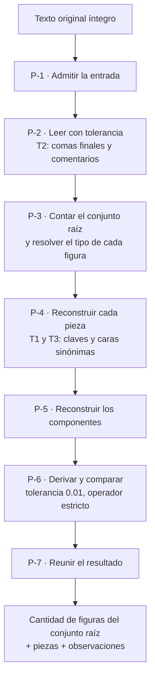

# Flujo de ejecución del validador de figuras — GeometriaFactory-Infrastructure

**Producto:** Fábrica de Geometría
**Proyecto de código:** GeometriaFactory-Infrastructure
**Documento:** Flujo-Ejecucion.md
**Versión:** 1.0
**Estado:** Aprobado
**Fecha:** 2026-08-10
**Autor:** Arquitecto de Software Senior + API Designer (AG-05)

---

## Tabla de contenido

- [1. Alcance](#1-alcance)
- [2. El pipeline en siete pasos](#2-el-pipeline-en-siete-pasos)
- [3. Qué transforma cada paso](#3-qué-transforma-cada-paso)
- [4. Las tres terminaciones posibles](#4-las-tres-terminaciones-posibles)
- [5. Tabla de derivación por tipo](#5-tabla-de-derivación-por-tipo)
- [6. Lo que el pipeline no hace](#6-lo-que-el-pipeline-no-hace)
- [7. Trazabilidad](#7-trazabilidad)
- [8. Control de cambios](#8-control-de-cambios)

---

## 1. Alcance

Este documento existe porque el tipo `library` lo pide **cuando el proyecto de código tiene un motor de procesamiento**, y éste lo tiene: el validador de figuras es el motor del producto y su pieza de más riesgo. Describe el **orden de los pasos** y **qué transforma cada uno**, que es lo que ninguna otra pieza de la cadena declara: la categoría 02 declara el contrato —qué devuelve, qué garantiza, qué escenario prueba cada cosa— y no el recorrido.

**No documenta los adaptadores de persistencia ni los dos mecanismos de seguridad**, que no son pipelines: su recorrido es una operación y su forma de terminación está en el catálogo de condiciones.

Lo que gobierna este flujo es [`ADR-06006`](Adrs/ADR-06006-Lectura-Tolerante-Y-Tabla-De-Derivacion-Por-Tipo.md), y lo que lo verifica es la batería de **10** casos de [`Arquitectura-Proyecto-Codigo.md`](Arquitectura-Proyecto-Codigo.md) §10.5.

## 2. El pipeline en siete pasos

| Paso | Qué hace | Tolerancia que aplica | Observaciones que puede emitir |
| --- | --- | --- | --- |
| **P-1** | Admitir la entrada. Un texto nulo o vacío **no es un texto del alumno**: es un defecto de la invocación | Ninguna | Ninguna. Emite `TEXTO_ORIGINAL_AUSENTE` y termina |
| **P-2** | Leer el texto **con tolerancia a comas finales y omisión de comentarios**. El texto del alumno **no es estrictamente válido y eso es un hecho del producto** | **T2** | Si no se puede leer ni con la tolerancia: **0 figuras y una observación**, nunca la condición degradada (`G-7`) |
| **P-3** | Contar las figuras del conjunto raíz —**incluidas las que después no se puedan reconstruir**— y resolver el tipo de cada una | Ninguna | Error de validación con **posición y campo `Tipo`** por cada tipo desconocido (`E-5`) |
| **P-4** | Reconstruir cada pieza con sus dimensiones, aceptando las **claves sinónimas** del ortoedro y las **dos formas de cara** del cubo | **T1**, **T3** | Error de validación con posición y campo por cada dimensión que **no se pudo leer** (`E-8`). Una dimensión presente con valor cero **se lee y no descarta la figura** (`E-6`) |
| **P-5** | Reconstruir los componentes de cada pieza con su papel, su tipo y su área declarada | **T1**, **T3** | Error de validación con posición y campo por cada componente ilegible |
| **P-6** | Derivar `Area` y `Volumen` según §5 y compararlos con los declarados | **T4**: los valores calculados erróneos **se señalan, no se rechazan ni se corrigen** | **Advertencia** con el valor declarado y el derivado, cuando la diferencia absoluta es **mayor** que 0.01 |
| **P-7** | Reunir la cantidad de figuras del conjunto raíz, las piezas reconstruidas y las observaciones, y devolverlos juntos | Ninguna | Ninguna |

**Un defecto en una figura no interrumpe el recorrido** (`G-2`). P-3 a P-6 siguen con las demás, y **la posición de la figura no reconstruida queda reservada** (`G-3`, `RC-06002`): no se compacta, porque la posición es la identidad de la pieza y una observación puede designar una posición sin pieza.

## 3. Qué transforma cada paso

| Paso | Entra | Sale |
| --- | --- | --- |
| P-1 | Texto original | El mismo texto, o la condición |
| P-2 | Texto original | Estructura leída, o estructura vacía con una observación |
| P-3 | Estructura leída | **Cantidad de figuras del conjunto raíz** y una lista de tipos resueltos, con huecos donde el tipo no se reconoció |
| P-4 | Lista de tipos resueltos | Piezas con posición, tipo y dimensiones; posiciones reservadas donde no se pudo reconstruir |
| P-5 | Piezas | Las mismas piezas con sus componentes |
| P-6 | Piezas con componentes | Las mismas piezas con `Area` y `Volumen` **declarado y derivado por separado** (`RC-06003`), más las advertencias |
| P-7 | Cantidad, piezas y observaciones | El resultado del contrato: **las tres cosas juntas** |

**La cantidad de figuras del conjunto raíz sale de P-3 y no de P-7**, y ésa es la razón por la que **no es derivable de las piezas**: el conjunto admite huecos, y sin el número producido antes de reconstruir, el dominio no tiene contra qué comprobar que la posición de una observación existe.

## 4. Las tres terminaciones posibles

| Terminación | Cuándo | Qué devuelve | Forma |
| --- | --- | --- | --- |
| **Resultado completo** | El recorrido llegó a P-7, con cero o más observaciones de cualquier especie | Cantidad, piezas y observaciones | Resultado normal. **Un texto que el alumno escribió mal termina acá**, no en la fila siguiente |
| **Negativa sin recorrido** | La entrada no es utilizable: texto nulo o vacío (P-1) | `TEXTO_ORIGINAL_AUSENTE` | Negativa sin escritura |
| **Terminación degradada** | El adaptador no pudo completar la interpretación **por una causa que no depende del texto** | `INTERPRETACION_NO_DISPONIBLE` | Terminación degradada. **No se inventan observaciones, no se devuelve un conjunto vacío como si fuera un resultado y no se informan figuras que no se contaron.** Esta capa no reintenta |

**La confusión que estas tres filas previenen es la más cara de la capa**, y `CU-06001` CA-10 existe para ella: si un texto ilegible devolviera la tercera en lugar de la primera, el producto le diría al alumno que el servicio no está disponible cuando lo que pasa es que su programa emitió algo que no se puede leer, y el alumno esperaría a que se recupere de un problema que no tiene.

**Y una cuarta cosa que no es una terminación de este pipeline: el estado del trabajo.** El motor entrega el conjunto de observaciones con su especie y **el dominio resuelve**. Sólo el error de validación impide el paso a estado `Pendiente`; la advertencia no lo impide.

**La verificación de valores no se puede pedir sin haber recorrido P-3 a P-5.** Si se la invoca sobre un conjunto sin reconstruir, termina en `CONJUNTO_DE_PIEZAS_NO_RECONSTRUIDO` y **no devuelve «0 advertencias»**: sería indistinguible de un trabajo verificado sin discrepancias, y convertiría un defecto de orquestación en un resultado creíble. Es una condición **derivada por la categoría 02**, que ninguna fuente enuncia, y esta categoría la hereda sin reabrirla.

## 5. Tabla de derivación por tipo

Es la tabla que la categoría 02 derivó a esta categoría. La rige [`ADR-06006`](Adrs/ADR-06006-Lectura-Tolerante-Y-Tabla-De-Derivacion-Por-Tipo.md) §2: **el área derivada de una pieza volumétrica es la suma de las áreas declaradas de sus componentes**, y la fórmula se usa donde no hay componentes que sumar.

Los tipos son los **seis** que los escenarios ejercitan, más el que sólo aparece como componente. Las **siete** filas están, sin agrupar.

| Tipo | Familia | Área derivada | Volumen derivado | Escenario que lo ejercita |
| --- | --- | --- | --- | --- |
| `Cilindro` | Volumétrica | **Suma de las áreas declaradas de sus componentes**: las dos bases y el lateral | Área de la base por la altura | E-1, E-7 |
| `Cubo` | Volumétrica | **Suma de las áreas declaradas de sus componentes**: las seis caras | Lado al cubo | E-1, E-3, E-4, E-5, E-7, E-8 |
| `Ortoedro` | Volumétrica | **Suma de las áreas declaradas de sus componentes**: las dos bases y los cuatro laterales | Producto de las tres dimensiones | E-1, E-2, E-7, E-8 |
| `Rectangulo` | Plana | **Fórmula**: producto de sus dos dimensiones | **No aplica** | E-6, E-7, y como componente en los demás |
| `Cuadrado` | Plana | **Fórmula**: lado al cuadrado | **No aplica** | E-7, y como componente en E-3 |
| `Circulo` | Plana | **Fórmula**: área del círculo a partir de su radio | **No aplica** | E-7, y como componente en E-1 |
| `RectanguloDesarrollado` | Componente, **nunca pieza raíz** | **Fórmula**: producto de sus dos dimensiones. Es la superficie lateral del cilindro **desenrollada** | **No aplica** | Sólo como componente `Lado` del cilindro, en E-1 y E-7 |

**Tres precisiones sobre la tabla, para que ninguna se lea como hueco:**

1. **`RectanguloDesarrollado` no tiene escenario propio y no es un olvido.** El intake declara por qué: aparece sólo como componente, así lo emite el programa, y **ninguna fuente lo documenta como salida real** en forma de pieza suelta. Su nombre es la trampa clásica del dato: no es un rectángulo cualquiera.
2. **El área declarada de cada componente se toma tal cual y no se verifica contra sus dimensiones.** Ninguna fuente declara esa verificación, y hacerla haría fallar el criterio negativo de `E-4`, que exige **cero** observaciones en total.
3. **Un tipo fuera de estas siete filas produce error de validación con posición y campo `Tipo`**, que es el escenario `E-5`. Hasta dónde llega el conjunto de tipos reconstruibles sigue siendo punto abierto del Product Owner: el análisis del que sale el intake menciona **siete** clases en un ejemplo y **diez** en el otro, y **ninguna fuente las enumera**.

## 6. Lo que el pipeline no hace

| Lo que alguien podría esperar acá | Por qué no está |
| --- | --- |
| Decidir el estado del trabajo | **Lo resuelve el dominio.** Un validador que decidiera el estado tendría dentro una regla de negocio que no le pertenece |
| Corregir un valor calculado erróneo | **T4**: se señala, no se corrige. Es el mayor valor didáctico del producto |
| Rechazar el trabajo por valores inconsistentes | Ídem: la advertencia **no bloquea** el paso a estado `Pendiente`. Sólo el error de validación lo hace |
| Descartar una figura con una dimensión en cero | **Existencia no es veracidad.** El cero es un valor presente y legible: la figura se interpreta (`E-6`) |
| Compactar las posiciones tras una figura no reconstruida | La posición **es la identidad** de la pieza (`RC-06002`), y una observación puede designar una posición sin pieza |
| Guardar el resultado | El pipeline devuelve; guardar es del adaptador de repositorio de trabajos, en otra operación y en otra unidad de trabajo |
| Hacer una petición de red o leer configuración propia | **`G-6`**, verificado con **0** peticiones en `CU-06001` CA-11. Es el reflejo estructural de `RA-02` en esta capa |
| Imponer un límite de tamaño al texto | El corte pertenece al **borde del proceso**, que **rechaza y nunca trunca** ([`ADR-06006`](Adrs/ADR-06006-Lectura-Tolerante-Y-Tabla-De-Derivacion-Por-Tipo.md) §2 punto 3) |

## 7. Trazabilidad

| Dimensión | Referencia |
| --- | --- |
| CU que materializa | [`CU-06001`](Operaciones-Internas/CU-06001-Interpretar-El-Texto-Original-Y-Reconstruir-Las-Piezas.md) —pasos P-1 a P-5 y P-7— y [`CU-06002`](Operaciones-Internas/CU-06002-Verificar-Los-Valores-Declarados-Contra-Los-Derivados.md) —paso P-6— |
| RN que sostiene | RN-06005 (produce el insumo), RN-06008 (**tramo principal**: el texto no se modifica ni cuando la interpretación falla), RN-06009 (**tramo principal**: toda observación con posición y campo) |
| Invariantes | INV-04, al que aporta el conjunto completo de observaciones con su especie |
| Garantías del contrato de la categoría 02 | Las **siete**, `G-1` a `G-7`: `G-1` en la ausencia de escritura sobre el texto, `G-2` en la continuidad del recorrido, `G-3` en las posiciones reservadas de P-3 y P-4, `G-4` en las columnas de observación de P-3 a P-5, `G-5` en P-6, `G-6` en §6 y `G-7` en la primera fila de §4 |
| Trampas del formato | Las **cuatro**: `T2` en P-2, `T1` y `T3` en P-4 y P-5, `T4` en P-6 |
| Escenarios | Los **ocho**, `E-1` a `E-8`, con el reparto de [`Arquitectura-Proyecto-Codigo.md`](Arquitectura-Proyecto-Codigo.md) §10.5 |
| ADR que lo gobierna | [`ADR-06006`](Adrs/ADR-06006-Lectura-Tolerante-Y-Tabla-De-Derivacion-Por-Tipo.md) |
| Tests previstos en 08 | La batería de **10** casos, **unitaria y sin almacén**, con una prueba por paso del pipeline; la prueba de las **2** advertencias exactas de `E-1`; la prueba de las **0** observaciones de `E-4`; y la prueba de **0** peticiones de red |

## 8. Control de cambios

| Versión | Fecha | Descripción |
| --- | --- | --- |
| 1.0 | 2026-08-10 | Emisión inicial. Declara el pipeline del validador en siete pasos con la tolerancia que aplica cada uno y las observaciones que puede emitir, la transformación de dato paso a paso, las tres terminaciones posibles con la confusión que previenen, la **tabla de derivación por tipo con sus siete filas** —que cierra el punto abierto derivado por la categoría 02—, lo que el pipeline deliberadamente no hace, y la trazabilidad contra las siete garantías, las cuatro trampas y los ocho escenarios. |
