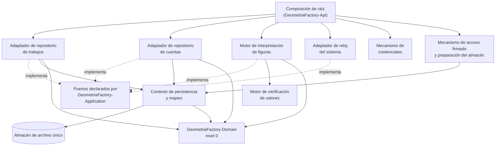

# Arquitectura técnica — GeometriaFactory-Infrastructure

**Producto:** Fábrica de Geometría
**Proyecto de código:** GeometriaFactory-Infrastructure
**Documento:** Arquitectura-Proyecto-Codigo.md
**Versión:** 1.4
**Estado:** Aprobado
**Fecha:** 2026-08-13
**Autor:** Arquitecto de Software Senior + API Designer (AG-05)
**Tipo de proyecto de código (D8):** `library`
**Trazabilidad upstream:** `PRODUCT-INTAKE-Fabrica-De-Geometria.md` **1.28** §4.1 (las **dieciséis** reglas `RN-06001` a `RN-06016`), §4.2 (modelo de estados del trabajo), §11 (riesgo `RN-B3`), §13 y §14 (composición del producto y las tres reglas de arquitectura `RA-01`, `RA-02`, `RA-03`), §15 (etapas y puertas técnicas), §16 (estructura de repositorio), §17.1.P.2 · GeometriaFactory-Domain (los **nueve** invariantes `INV-01` a `INV-09`), §17.3 completo (P.1 a P.12), §20 (los **ocho** escenarios `E-1` a `E-8`), §21 (matriz de cobertura), §22 (asunciones A-3 y A-5); `PRODUCT-MANIFEST-Fabrica-De-Geometria.md` **1.2** §2, §3 y §5 (flags de este proyecto de código, con `tiene_auth` == true y `tiene_persistencia` == true); [`../02-Especificacion-Funcional/Especificacion-Funcional.md`](../../../02-Especificacion-Funcional/_fusion/Infrastructure/Especificacion-Funcional.md) y los **diez** casos de uso de [`../02-Especificacion-Funcional/Casos-De-Uso/`](../02-Especificacion-Funcional/Casos-De-Uso/); [`../02-Especificacion-Funcional/Definicion-Contrato-Del-Validador-De-Figuras.md`](../../../02-Especificacion-Funcional/Definicion-Contrato-Del-Validador-De-Figuras.md); [`../02-Especificacion-Funcional/Modelo-Datos/Modelo-Conceptual.md`](../../../02-Especificacion-Funcional/Modelo-Datos/Modelo-Conceptual.md) y sus **siete** reglas conceptuales `RC-06001` a `RC-06007`; [`../03-UX-UI-DX/DX-Error-Messages.md`](../../../03-UX-UI-DX/_fusion/Infrastructure/DX-Error-Messages.md) (las **17** condiciones); las Fases C ya emitidas de [`GeometriaFactory-Domain`](../Domain/Arquitectura-Proyecto-Codigo.md) y de [`GeometriaFactory-Application`](../Application/Arquitectura-Proyecto-Codigo.md), que son sus dos dependencias de compilación
**Trazabilidad downstream:** `06-Backlog-Tecnico`, `08-Calidad-Y-Pruebas`, `09-Devops` y `11-Documentacion` de GeometriaFactory-Infrastructure

---

## Tabla de contenido

- [1. Objetivo](#1-objetivo)
- [2. Estilo arquitectónico](#2-estilo-arquitectónico)
  - [2.1 Alternativas descartadas](#21-alternativas-descartadas)
  - [2.2 Qué hereda de los niveles 0 y 1 y no reabre](#22-qué-hereda-de-los-niveles-0-y-1-y-no-reabre)
- [3. Vista lógica](#3-vista-lógica)
  - [3.1 Componentes](#31-componentes)
  - [3.2 Regla de dependencias interna](#32-regla-de-dependencias-interna)
  - [3.3 Cobertura de los diez casos de uso](#33-cobertura-de-los-diez-casos-de-uso)
  - [3.4 Los cuatro puertos, los dos mecanismos y la responsabilidad de arranque](#34-los-cuatro-puertos-los-dos-mecanismos-y-la-responsabilidad-de-arranque)
- [4. Vista de procesos](#4-vista-de-procesos)
- [5. Vista de despliegue](#5-vista-de-despliegue)
- [6. Vista de datos](#6-vista-de-datos)
- [7. Cross-cutting concerns](#7-cross-cutting-concerns)
- [8. Quality attributes (NFR)](#8-quality-attributes-nfr)
- [9. Riesgos arquitectónicos](#9-riesgos-arquitectónicos)
- [10. Trazabilidad](#10-trazabilidad)
  - [10.1 Componente contra caso de uso](#101-componente-contra-caso-de-uso)
  - [10.2 Las dieciséis reglas contra el lugar que las ejerce acá](#102-las-dieciséis-reglas-contra-el-lugar-que-las-ejerce-acá)
  - [10.3 Los nueve invariantes contra lo que esta capa hace por ellos](#103-los-nueve-invariantes-contra-lo-que-esta-capa-hace-por-ellos)
  - [10.4 Las tres reglas de arquitectura del producto](#104-las-tres-reglas-de-arquitectura-del-producto)
  - [10.5 Los ocho escenarios contra la batería del validador](#105-los-ocho-escenarios-contra-la-batería-del-validador)
- [11. Puntos abiertos](#11-puntos-abiertos)
- [12. Control de cambios](#12-control-de-cambios)

---

## 1. Objetivo

Documenta la arquitectura interna de `GeometriaFactory-Infrastructure`, la capa donde el producto **toca el mundo**: qué componentes tiene, cómo se reparten los **diez** casos de uso de la categoría 02, cómo se materializan los **cuatro** puertos que `GeometriaFactory-Application` declara, y qué decisiones estructurales sostienen que el validador de figuras —la pieza de más riesgo del producto— se pueda ejercer entero sin almacén y sin red. Se dirige a quien implementa los adaptadores y a las categorías 06, 08 y 09.

No documenta las reglas del producto —viven en `GeometriaFactory-Domain`—, ni la orquestación ni la autorización —viven en `GeometriaFactory-Application`—, ni la traducción a respuesta de protocolo, que es de `GeometriaFactory-Api`. Sí documenta, y es el único documento de la cadena que lo hace, el **modelo lógico del dato guardado**, en [`Modelo-Datos-Logico.md`](../../Modelo-Datos-Logico.md).

## 2. Estilo arquitectónico

**Estilo elegido: adaptadores de puerto, uno por frontera, sobre un único contexto de persistencia.** Es lo que `PRODUCT-INTAKE` §17.1.P.2 · GeometriaFactory-Infrastructure declara tomado aguas arriba —«adaptadores que implementan los puertos de Application»— y lo que [`ADR-06001`](../../Adrs/ADR-06001-Adaptadores-Por-Puerto-Sin-Repositorio-Generico.md) registra con su contexto y sus consecuencias.

En términos de esta categoría, el estilo se concreta en cinco propiedades estructurales:

1. **Un adaptador por puerto, y ninguna clase que los reúna.** Los cuatro puertos tienen cuatro implementaciones separadas; la conexión de cada uno con su adaptador es de la composición de raíz de `GeometriaFactory-Api` y no de este proyecto de código ([`ADR-06001`](../../Adrs/ADR-06001-Adaptadores-Por-Puerto-Sin-Repositorio-Generico.md)).
2. **La mitad de esta capa no toca el almacén.** El validador de figuras, la derivación de credenciales, la producción de la provisoria y la emisión del acceso firmado **no abren el archivo de datos**, y por eso se prueban unitariamente. Es la partición que hace que la batería obligatoria del producto sea barata de correr.
3. **El alcance transaccional llega decidido y acá se expresa como una unidad de trabajo por operación** (`PRODUCT-INTAKE` §17.1.P.4 · GeometriaFactory-Infrastructure; [`ADR-06002`](../../Adrs/ADR-06002-Un-Archivo-Escritor-Unico-Y-Una-Unidad-De-Trabajo-Por-Operacion.md)).
4. **Cuando un mecanismo no puede cumplir su promesa, se detiene y lo dice.** No la cumple a medias, no compone un valor por otro medio y no cae hacia un sustituto. Es la regla que gobierna las **17** condiciones de [`../03-UX-UI-DX/DX-Error-Messages.md`](../../../03-UX-UI-DX/_fusion/Infrastructure/DX-Error-Messages.md) §2.4.
5. **Ninguna decisión de negocio vive acá.** La capa provee el mecanismo; el estado, la autorización y la admisibilidad llegan resueltos ([`../02-Especificacion-Funcional/Especificacion-Funcional.md`](../../../02-Especificacion-Funcional/_fusion/Infrastructure/Especificacion-Funcional.md) §4).

### 2.1 Alternativas descartadas

Las dos primeras las descarta el intake y esta categoría no las reabre; la tercera y la cuarta las evalúa y las descarta esta categoría.

| Alternativa | A favor | En contra | Resolución |
| --- | --- | --- | --- |
| Repositorio genérico sobre el conjunto de entidades | Un solo tipo para las cinco entidades, sin escribir un adaptador por puerto | Diluye las consultas que sí importan —el listado del administrador agrupado por alumno—, y obliga a que el recorte se arme del lado del consumidor, que es justo lo que `CONSULTA_SIN_ALCANCE_DECLARADO` viene a impedir | **Descartada** por `PRODUCT-INTAKE` §17.1.P.2 · GeometriaFactory-Infrastructure |
| Acceso directo con consultas escritas a mano | Control total de cada consulta, sin capa de mapeo | Las transformaciones de esquema aplicadas al arrancar son una decisión ya tomada (`PRODUCT-INTAKE` §17.1.P.4 · GeometriaFactory-Infrastructure), y el mapeador las provee. Escribirlas a mano reabriría una decisión cerrada | **Descartada** por `PRODUCT-INTAKE` §17.1.P.2 · GeometriaFactory-Infrastructure |
| Un adaptador único que implemente los cuatro puertos | Menos tipos, una sola unidad de trabajo evidente | Reuniría en un mismo componente lo que se prueba con almacén y lo que se prueba sin él, y haría que el validador —que no toca el almacén— arrastrara la dependencia de persistencia. La batería obligatoria dejaría de correr sin base | **Descartada** por esta categoría, ver [`ADR-06001`](../../Adrs/ADR-06001-Adaptadores-Por-Puerto-Sin-Repositorio-Generico.md) §4 |
| Reintento automático dentro del adaptador ante almacén no disponible o escritura concurrente rechazada | Absorbería la limitación de escritor único sin que el consumidor se entere | La categoría 03 declara por escrito que **esta capa no reintenta** y que la decisión de reintentar es del consumidor. Un reintento acá escondería la única señal que el producto tiene de que el almacén no está, y con escritor único multiplicaría la espera en lugar de reducirla | **Descartada** por esta categoría, ver [`ADR-06002`](../../Adrs/ADR-06002-Un-Archivo-Escritor-Unico-Y-Una-Unidad-De-Trabajo-Por-Operacion.md) §4 |

### 2.2 Qué hereda de los niveles 0 y 1 y no reabre

Las dos dependencias de compilación de este proyecto de código tienen su Fase C emitida. Cinco decisiones suyas lo condicionan y **se citan, no se rehacen**.

| Decisión heredada | Dónde está | Qué obliga acá |
| --- | --- | --- |
| El dominio no lee el reloj ni el conjunto de entidades | [`Domain ADR-02006`](../../Adrs/ADR-02006-El-Dominio-No-Lee-El-Reloj-Ni-El-Conjunto.md) | Es el origen del puerto de reloj y de las **dos** preguntas sobre el conjunto que el adaptador de cuentas responde: si un correo ya está registrado y si ya existe una cuenta con papel `Administrador` |
| Los cuatro puertos son la frontera, y el cuarto no tiene identificador declarado aguas arriba | [`Application ADR-04002`](../../Adrs/ADR-04002-Cuatro-Puertos-Y-La-Frontera-Que-Declaran.md) | Esta capa **implementa cuatro adaptadores y ni uno más**. El identificador del cuarto **no lo fija esta categoría**, y §11 declara por qué: ver [`ADR-06003`](../../Adrs/ADR-06003-Comparacion-De-Correos-Y-El-Indice-Que-La-Sostiene.md) §6 y `PA-01` |
| Un caso de uso, una unidad de trabajo: el alcance lo fija la capa de aplicación | [`Application ADR-04005`](../../Adrs/ADR-04005-Un-Caso-De-Uso-Una-Unidad-De-Trabajo.md) | Acá se materializa el **mecanismo**, no el alcance: una unidad de trabajo por operación, con el todo o nada del arrastre de la baja como caso testigo |
| Toda condición prevista viaja como resultado tipado y el catálogo de condiciones es cerrado | [`Application ADR-04006`](../../Adrs/ADR-04006-Resultado-Tipado-Y-Catalogo-Cerrado-De-Condiciones.md) | Las **17** condiciones de esta capa son códigos, no excepciones ni textos, y **ninguno es un código de protocolo**: su traducción es de `GeometriaFactory-Api` |
| Ningún tipo de transferencia lleva el valor derivado de una credencial, la clave de firma ni una dirección de servicio interno | [`Contracts ADR-08004`](../../../../../Producto/Adrs/ADR-08004-Regla-De-Exposicion-De-La-Frontera.md) | Esta capa es **la que los conoce**, y por eso la prohibición de §1.4 de su catálogo de condiciones no es una recomendación de estilo: es la única forma de que aquella regla siga siendo cierta |

## 3. Vista lógica

### 3.1 Componentes

Un componente es acá un módulo con responsabilidad cohesiva, no una clase. Los **ocho** cubren los diez casos de uso de la categoría 02; uno de ellos es transversal y se declara como tal.

| Componente | Responsabilidad | Entradas | Salidas | Dependencias |
| --- | --- | --- | --- | --- |
| Contexto de persistencia y mapeo | Declarar el mapa entre las **cinco** entidades del modelo conceptual y el esquema físico de [`Modelo-Datos-Logico.md`](../../Modelo-Datos-Logico.md), y ofrecer la unidad de trabajo. **Transversal**: no implementa ningún puerto | Configuración de ubicación del almacén | Unidad de trabajo y consultas materializables | `GeometriaFactory-Domain` |
| Adaptador de repositorio de trabajos | Recuperar un trabajo, resolver la consulta **ya acotada**, materializar el resultado y ejecutar el retiro, con las dos formas de lectura —proyección de listado y detalle completo— | Pedido con su recorte declarado; entidad a materializar | Trabajo, proyección, o la condición | Contexto de persistencia y mapeo, `GeometriaFactory-Application`, `GeometriaFactory-Domain` |
| Adaptador de repositorio de cuentas | Recuperar una cuenta por su correo, responder las **dos** preguntas sobre el conjunto y materializar el resultado, **incluida la marca de cambio de contraseña pendiente** | Correo, cuenta a materializar | Cuenta, respuesta de conjunto, o la condición | Contexto de persistencia y mapeo, `GeometriaFactory-Application`, `GeometriaFactory-Domain` |
| Motor de interpretación de figuras | Leer el texto del alumno con las **cuatro** tolerancias `T1` a `T4`, reconstruir las piezas con su posición y emitir las observaciones ubicadas. **No abre el almacén y no hace red** | Texto original íntegro | Cantidad de figuras del conjunto raíz, piezas y observaciones | `GeometriaFactory-Application`, `GeometriaFactory-Domain` |
| Motor de verificación de valores | Derivar `Area` y `Volumen` según la tabla de [`Flujo-Ejecucion.md`](../../Flujo-Ejecucion.md) §5 y compararlos con los declarados, con tolerancia **0.01** y operador **estricto** | Piezas ya reconstruidas | Advertencias con el par de valores | Motor de interpretación de figuras |
| Adaptador de reloj del sistema | Devolver el momento actual. Es el contrato más corto de la capa y el que hace reproducibles los sellos en prueba | Ninguna | Momento | Ninguna |
| Mecanismo de credenciales | Derivar una contraseña, verificar una credencial contra un valor derivado y **producir la contraseña provisoria** de la habilitación y del reseteo | Contraseña en claro, o nada en la producción | Valor derivado, veredicto, o provisoria | Ninguna del producto; la fuente de material impredecible del sistema |
| Mecanismo de acceso firmado y preparación del almacén | Emitir y verificar el acceso con sus **cuatro** reclamos, y dejar el almacén en condiciones antes de la primera petición, deteniendo el arranque antes que operar sobre un almacén en el que no se puede confiar | Reclamos y clave de firma; linaje de transformaciones | Acceso, veredicto, almacén preparado, o arranque detenido | Contexto de persistencia y mapeo |

**Los ocho componentes son internos.** La superficie pública del proyecto de código es la que declara [`Contratos-Abstractions.md`](Contratos-Abstractions.md), y la partición de arriba es de responsabilidad y no de espacios de nombres, que quedan abiertos hasta el punto de control de la etapa `a` (`PRODUCT-INTAKE` §17.1.P.7 · GeometriaFactory-Infrastructure, idéntico a §17.1.P.7 · GeometriaFactory-Domain, con los nombres de tipos anclados ahí).

### 3.2 Regla de dependencias interna

Las flechas son unidireccionales y el grafo es acíclico. Cuatro precisiones que la vista tiene que dejar dichas:

1. **Ningún adaptador depende de otro adaptador.** El único par acoplado son los dos motores, y en una sola dirección: la verificación de valores **exige las piezas ya reconstruidas** y por eso `CONJUNTO_DE_PIEZAS_NO_RECONSTRUIDO` existe. La dirección inversa no existe: la interpretación no consulta la verificación.
2. **Los dos motores, el reloj y el mecanismo de credenciales no dependen del contexto de persistencia.** Es la propiedad que hace que la mitad de la batería de pruebas de esta capa sea unitaria y sin almacén, y la que sostiene el NFR de los **200 ms** de §8.
3. **La flecha hacia los puertos es de implementación y va al revés que la de dependencia.** Este proyecto de código depende de `GeometriaFactory-Application` por compilación y le implementa sus contratos; la capa de aplicación no lo nombra.
4. **La composición de raíz no es de acá.** Este proyecto de código no registra sus propios adaptadores ni decide sus ciclos de vida: los declara y `GeometriaFactory-Api` los conecta. Un registro automático desde acá haría que la frontera dejara de ser contable.

### 3.3 Cobertura de los diez casos de uso

| Componente | Casos de uso que cubre |
| --- | --- |
| Contexto de persistencia y mapeo | **Transversal**: CU-06003, CU-06004, CU-06005 y CU-06010. Ningún caso de uso que toque el almacén lo evita |
| Adaptador de repositorio de trabajos | CU-06003, CU-06004 |
| Adaptador de repositorio de cuentas | CU-06005, CU-06004 |
| Motor de interpretación de figuras | CU-06001 |
| Motor de verificación de valores | CU-06002 |
| Adaptador de reloj del sistema | CU-06009 |
| Mecanismo de credenciales | CU-06006, CU-06007 |
| Mecanismo de acceso firmado y preparación del almacén | CU-06008, CU-06010 |

Los diez casos de uso tienen componente y ningún componente queda sin caso de uso. El transversal se declara como tal y no aparece como cobertura exclusiva de ninguno.

### 3.4 Los cuatro puertos, los dos mecanismos y la responsabilidad de arranque

Los cuatro puertos son los de [`../02-Especificacion-Funcional/Especificacion-Funcional.md`](../../../02-Especificacion-Funcional/_fusion/Infrastructure/Especificacion-Funcional.md) §3, y esta tabla no los redefine: declara qué componente los materializa y qué decisión de arquitectura los gobierna.

| Frontera | Identificador declarado en el intake | Componente que la materializa | ADR |
| --- | --- | --- | --- |
| Puerto de repositorio de trabajos | `IWorkRepository` (`PRODUCT-INTAKE` §17.1.P.1 · GeometriaFactory-Infrastructure por remisión a §14) | Adaptador de repositorio de trabajos | ADR-06001, ADR-06002 |
| Puerto de validación de figuras | `IFigureValidator` (`PRODUCT-INTAKE` §14) | Motor de interpretación de figuras y Motor de verificación de valores | ADR-06006 |
| Puerto de reloj del sistema | `ISystemClock` (`PRODUCT-INTAKE` §14) | Adaptador de reloj del sistema | ADR-06002 |
| Puerto de repositorio de cuentas | **Ninguno**: el intake nombra tres puertos y no éste | Adaptador de repositorio de cuentas | ADR-06001, ADR-06003 |
| Mecanismo de credenciales | **Ninguno declarado**: no es puerto de la capa de aplicación | Mecanismo de credenciales | ADR-06004, ADR-06005 |
| Mecanismo de acceso firmado | **Ninguno declarado**: no es puerto de la capa de aplicación | Mecanismo de acceso firmado y preparación del almacén | ADR-06004 |
| Preparación del almacén | **Ninguno declarado**: no es puerto ni mecanismo | Mecanismo de acceso firmado y preparación del almacén | ADR-06007 |

**El cuarto puerto sigue sin identificador declarado, y esta categoría no lo fija.** [`Application ADR-04002`](../../Adrs/ADR-04002-Cuatro-Puertos-Y-La-Frontera-Que-Declaran.md) —que es la ADR del proyecto de código **que declara el puerto**— resolvió que el puerto existe y ató su nombre al punto de control de la etapa `a`. Fijarlo desde acá sería nombrar un tipo que este proyecto de código no declara y contradecir una decisión ya emitida. Lo que esta categoría sí hace es dejar escrito el **criterio de nombrado del adaptador** y registrar la propuesta que llega al punto de control: ver [`ADR-06003`](../../Adrs/ADR-06003-Comparacion-De-Correos-Y-El-Indice-Que-La-Sostiene.md) §6 y `PA-01` de §11.

## 4. Vista de procesos

- **Sin proceso propio.** El proyecto de código se carga dentro del proceso de `GeometriaFactory-Api`, que es la unidad desplegable que lo aloja. No abre hilos, no programa temporizadores y no atiende peticiones (`PRODUCT-INTAKE` §17.1.P.3 · GeometriaFactory-Infrastructure declara «no aplica»: no expone puntos de acceso).
- **Escritor único, por restricción del motor y no por elección.** El almacén no admite escrituras concurrentes y el intake acepta esa limitación por escrito a cambio de un despliegue sin servicio de base de datos aparte (`PRODUCT-INTAKE` §17.1.P.4 · GeometriaFactory-Infrastructure y §17.1.P.12 · GeometriaFactory-Infrastructure). La escritura que llega mientras otra tiene el almacén tomado termina en `ESCRITURA_CONCURRENTE_RECHAZADA`, que es **terminación degradada y no espera activa**.
- **Una unidad de trabajo por operación, y ninguna anidada.** El caso testigo es el arrastre de la baja: la cuenta y todos sus trabajos se retiran dentro de la misma unidad, o no se retira nada (`RC-06005`, `CU-06004` CA-05).
- **Esta capa no reintenta.** Está declarado en [`../03-UX-UI-DX/DX-Error-Messages.md`](../../../03-UX-UI-DX/_fusion/Infrastructure/DX-Error-Messages.md) §2.3 para las **4** terminaciones degradadas, y [`ADR-06002`](../../Adrs/ADR-06002-Un-Archivo-Escritor-Unico-Y-Una-Unidad-De-Trabajo-Por-Operacion.md) §4 lo registra como alternativa evaluada y descartada. Reintentar es del consumidor, que es el que sabe si la operación es repetible.
- **Los dos motores y los dos mecanismos no comparten estado entre invocaciones.** No hay caché de textos interpretados, ni de valores derivados, ni de accesos emitidos: cada invocación se resuelve entera con lo que recibe. Es lo que los hace seguros frente a invocaciones concurrentes dentro del mismo proceso.
- **Arranque detenido: la única forma de terminación que ninguna otra parte del producto tiene.** Si la preparación del almacén no se completa, el servicio **no atiende ninguna petición** (`MIGRACION_NO_APLICABLE` y `RUTA_DEL_ALMACEN_NO_DISPONIBLE`). No hay modo de sólo lectura ni arranque parcial: un servicio que atiende sobre un almacén equivocado es peor que un servicio que no arranca.

## 5. Vista de despliegue

| Aspecto | Decisión |
| --- | --- |
| Unidad de despliegue | Ninguna propia. Es una biblioteca que se compila dentro del artefacto de agrupación del producto y viaja embebida en la unidad desplegable del servidor propio, por la vía de `GeometriaFactory-Api` |
| Runtime objetivo | La plataforma común declarada para los seis proyectos de código no visores, sobre el sistema operativo del contenedor de desarrollo y del servidor del backend (`PRODUCT-INTAKE` §17.1.P.9 · GeometriaFactory-Infrastructure) |
| Dependencias de infraestructura | **Tres, y son las únicas**: el sistema de archivos donde vive el almacén, la fuente de material impredecible del sistema y la clave de firma provista desde afuera. Ninguna es un servicio de red |
| Ubicación del almacén | **Configurable, y la configuración la provee `GeometriaFactory-Api`.** En producción, en un volumen persistente y **nunca dentro de la imagen** (`PRODUCT-INTAKE` §17.1.P.4 · GeometriaFactory-Infrastructure) |
| Secretos | La clave de firma **se provee o se genera en el primer arranque y vive fuera del repositorio de código y fuera de la imagen** (`PRODUCT-INTAKE` §17.1.P.5 · GeometriaFactory-Infrastructure). Este proyecto de código **la recibe y no la busca**: si no llega, `CLAVE_DE_FIRMA_AUSENTE` |
| Ciclo de construcción | Dentro del contenedor de desarrollo, porque el equipo anfitrión no tiene el kit de desarrollo instalado (`PRODUCT-INTAKE`, encabezado de la Parte C) |
| Etapas del pipeline | `restore` → `build` → `test` → **verificación de transformaciones de esquema** (`PRODUCT-INTAKE` §17.1.P.8 · GeometriaFactory-Infrastructure). La cuarta etapa es propia de este proyecto de código |
| Puertas propias y bloqueantes | Construcción en **0** y sin advertencias; **las pruebas del validador pasan**; **las transformaciones se aplican solas sobre un almacén inexistente** —criterio de aceptación de la etapa `c`—; la cobertura alcanza los mínimos de §8 |
| Reversión | El intake declara un guion de restablecimiento que reproduce el estado de primer arranque (`PRODUCT-INTAKE` §17.1.P.8 · GeometriaFactory-Infrastructure). **No es un camino de producción**: reproduce el primer arranque, o sea un almacén vacío |
| Versionado y release | Versionado semántico y convenciones de mensaje de confirmación, con una rama y una etiqueta por etapa. Además, y es propio de acá: **cada transformación de esquema se versiona con el código de su etapa y no se edita una ya fusionada** (`PRODUCT-INTAKE` §17.1.P.7 · GeometriaFactory-Infrastructure) |
| Publicación | No se publica: `redistribuible` es false (`PRODUCT-MANIFEST` §2) |

## 6. Vista de datos

**Es la vista con más peso de este proyecto de código, y la única del producto que existe.** El flag `tiene_persistencia` vale true acá y también en `GeometriaFactory-Api`, pero aquél **delega en éste** y sólo toma de configuración la ruta del archivo y dispara la preparación al arrancar (`PRODUCT-INTAKE` §17.1.P.4 · GeometriaFactory-Api; `PRODUCT-MANIFEST` §5).

- **El modelo lógico vive en [`Modelo-Datos-Logico.md`](../../Modelo-Datos-Logico.md)**, con las **cinco** tablas, sus tipos físicos, sus **índices**, sus restricciones y la transformación inicial. Su origen conceptual es [`../02-Especificacion-Funcional/Modelo-Datos/Modelo-Conceptual.md`](../../../02-Especificacion-Funcional/Modelo-Datos/Modelo-Conceptual.md), entidad por entidad.
- **Emitirlo es un apartamiento declarado de la guía del tipo `library`**, con el mismo fundamento con el que la categoría 02 emitió su modelo conceptual: la guía lo omite para «`library` puro **sin estado**», y este proyecto de código tiene el flag de persistencia en true y el intake declara la persistencia «la responsabilidad central del proyecto de código». Omitirlo dejaría al producto sin ningún documento que describa el esquema del dato guardado.
- **Motor de archivo único, modo de diario con registro por delante y escritor único.** Las tres son decisiones del intake (§17.1.P.4 · GeometriaFactory-Infrastructure) y [`ADR-06002`](../../Adrs/ADR-06002-Un-Archivo-Escritor-Unico-Y-Una-Unidad-De-Trabajo-Por-Operacion.md) las registra con sus consecuencias.
- **Sin caché.** No hay lectura repetida que valga la pena memorizar dentro del alcance de una operación, y una caché entre operaciones reintroduciría estado compartido, que §4 descarta. Tampoco hay réplica: cuando el almacén no está, los datos no están, y el producto lo declara como estado degradado en lugar de servir algo viejo.
- **Sin partición por instancia.** Una instancia, un curso, un administrador (`INV-05`): el esquema **no lleva ninguna columna de pertenencia a instancia** y el flag `multi_tenant` es false.
- **El texto del alumno se guarda como texto en la fila del trabajo y no se consulta por su contenido** (`PRODUCT-INTAKE` §17.1.P.4 · GeometriaFactory-Infrastructure). Es lo que permite reprocesarlo si el validador mejora, y lo que hace que `RN-06008` sea verificable comparando dos cadenas.
- **Los componentes de cada pieza se persisten pese a su redundancia** —un cubo de lado 3 guarda seis caras idénticas— **porque son parte del ejercicio**, y se compensa no cargándolos nunca en las consultas de listado (`PRODUCT-INTAKE` §17.1.P.12 · GeometriaFactory-Infrastructure; `Modelo-Conceptual.md` §3.5).

## 7. Cross-cutting concerns

Todas las decisiones transversales viven acá y no repartidas por componente.

| Preocupación | Decisión | Fundamento |
| --- | --- | --- |
| Autorización | **Ninguna acá, y las dos categorías de conflicto correspondientes están vacías por eso.** Esta capa no comprueba papel ni pertenencia y no recibe la identidad del solicitante para comprobarla | [`../03-UX-UI-DX/DX-Error-Messages.md`](../../../03-UX-UI-DX/_fusion/Infrastructure/DX-Error-Messages.md) §2.2 |
| Autenticación | **Los dos mecanismos viven acá**: derivación y verificación de credenciales, y emisión y verificación del acceso firmado. **Decidir si una cuenta admite el acceso no es de acá**: llega resuelto | [`ADR-06004`](../../Adrs/ADR-06004-Derivacion-De-Clave-Anclada-Con-Parametros-Versionados.md) |
| Producción de la contraseña provisoria | **Acá, y sólo acá.** Es la delegación explícita de las tres capas de arriba: `RN-06014` es la única de las dieciséis sin tramo en la capa de aplicación, y `RN-06016` le suma el segundo consumidor sin agregar mecanismo | [`ADR-06005`](../../Adrs/ADR-06005-Contrasena-Provisoria-No-Adivinable-Y-Sin-Repetirse.md) |
| Manejo de errores | **Código, no texto y no excepción.** Las **17** condiciones son valores de enumeraciones cerradas; **ninguna es un código de protocolo** y su traducción pertenece a `GeometriaFactory-Api` | [`../03-UX-UI-DX/DX-Error-Messages.md`](../../../03-UX-UI-DX/_fusion/Infrastructure/DX-Error-Messages.md) §1.3 y §5 |
| Transacciones | **Una unidad de trabajo por operación**, que se cierra entera o no se cierra. Ninguna condición deja efecto parcial | [`ADR-06002`](../../Adrs/ADR-06002-Un-Archivo-Escritor-Unico-Y-Una-Unidad-De-Trabajo-Por-Operacion.md) |
| Registro de eventos y trazas | **Todo error que se muestre al usuario queda registrado del lado del servidor** (`PRODUCT-INTAKE` §17.1.P.10 · GeometriaFactory-Infrastructure). Es la contracara obligatoria de `RA-03`: sin ese registro, la prohibición de exponer se convierte en imposibilidad de diagnosticar. **Lo que el registro no puede llevar** está en la fila siguiente | `PRODUCT-INTAKE` §14 |
| Secretos y datos que no se registran | **Cinco cosas no entran nunca en un mensaje ni en una traza**: la clave de firma, la contraseña en claro, el valor derivado de una credencial, la contraseña provisoria producida y la ruta del almacén. Y una sexta que no es secreto y tampoco entra: **el texto original del alumno** | [`../03-UX-UI-DX/DX-Error-Messages.md`](../../../03-UX-UI-DX/_fusion/Infrastructure/DX-Error-Messages.md) §1.4 |
| Métricas | **Ninguna propia.** El flag `tiene_observabilidad_critica` es false en este proyecto de código; el único con métrica numérica de latencia hacia afuera es `GeometriaFactory-Api` | `PRODUCT-MANIFEST` §5 |
| Configuración | **Se recibe, no se busca.** La ubicación del almacén, la clave de firma y los parámetros de derivación llegan desde la composición de raíz. Este proyecto de código no lee archivos de configuración ni variables de entorno por su cuenta, y por eso `RUTA_DEL_ALMACEN_NO_DISPONIBLE` y `CLAVE_DE_FIRMA_AUSENTE` son condiciones y no valores por defecto | [`ADR-06007`](../../Adrs/ADR-06007-Transformaciones-Al-Arrancar-Con-Linaje-Inmutable.md) |
| Zona horaria y precisión de los sellos | **Los sellos se producen y se guardan en tiempo universal coordinado**, con la precisión que el puerto de reloj entrega y **sin truncarla**. La conversión a la zona de quien lee es de la superficie que lo muestra. Cierra un punto abierto de la categoría 02 | [`ADR-06002`](../../Adrs/ADR-06002-Un-Archivo-Escritor-Unico-Y-Una-Unidad-De-Trabajo-Por-Operacion.md) §2 |
| Comparación de valores numéricos | **Tolerancia absoluta de 0.01 con operador estricto**: se advierte cuando la diferencia absoluta es **mayor** que 0.01, nunca mayor o igual. **No es asunción**: el intake lo fija con su fundamento, y con «mayor o igual» el escenario `E-1` daría **3** advertencias en lugar de las **2** documentadas | `PRODUCT-INTAKE` §17.1.P.10 · GeometriaFactory-Infrastructure |
| Vocabulario | `Pendiente` se escribe **siempre calificado** —«cuenta `Pendiente`» o «trabajo en estado `Pendiente`»—, con las dos excepciones declaradas: los nombres literales de los códigos y las enumeraciones del conjunto cerrado. «Repositorio» se escribe siempre calificado, porque nombra el puerto y también el repositorio de código | `PRODUCT-INTAKE` §4.2; [`../03-UX-UI-DX/Glosario-UX.md`](../../../03-UX-UI-DX/_fusion/Infrastructure/Glosario-UX.md) |

## 8. Quality attributes (NFR)

Los tres primeros vienen rotulados **[ASUNCIÓN]** desde `PRODUCT-INTAKE` §17.1.P.6 · GeometriaFactory-Infrastructure y §17.1.P.10 · GeometriaFactory-Infrastructure, y su confirmación está pendiente del Product Owner en §22, asunciones **A-3** y **A-5**. Se usan como vigentes. Los demás los deriva esta categoría o los transcribe de una fuente que **no** los rotula como asunción, y cada fila lo declara.

| NFR | Objetivo numérico | Mecanismo de medición | ADR relacionada |
| --- | --- | --- | --- |
| Tiempo de interpretación del texto semilla | Menos de **200 ms** para el texto de **3** piezas del escenario **E-1**, medido **sin almacén** [ASUNCIÓN del intake] | Medición sobre la batería unitaria del validador, en la etapa de `test` del pipeline | [`ADR-06006`](../../Adrs/ADR-06006-Lectura-Tolerante-Y-Tabla-De-Derivacion-Por-Tipo.md) |
| Cobertura del proyecto de código | **85 %** de líneas y **80 %** de ramas [ASUNCIÓN del intake] | Informe de cobertura del pipeline, bloqueante para fusionar | [`ADR-06001`](../../Adrs/ADR-06001-Adaptadores-Por-Puerto-Sin-Repositorio-Generico.md) |
| Cobertura del validador de figuras | **95 %** de líneas [ASUNCIÓN del intake]. **Es el número más alto del producto**, y está donde la fuente señala el criterio que más veces se rompe | Informe de cobertura acotado a los dos motores, bloqueante | [`ADR-06006`](../../Adrs/ADR-06006-Lectura-Tolerante-Y-Tabla-De-Derivacion-Por-Tipo.md) |
| Tolerancia de comparación de valores | **0.01** absoluta, con operador **estricto**. **No es asunción**: sale de que el emisor redondea a 2 decimales | Caso de prueba del escenario `E-1`, que debe dar exactamente **2** advertencias y no 3 | [`ADR-06006`](../../Adrs/ADR-06006-Lectura-Tolerante-Y-Tabla-De-Derivacion-Por-Tipo.md) |
| Casos de la batería del validador que pasan | **10 de 10**, con los ocho escenarios `E-1` a `E-8` como entrada. Puerta bloqueante del pipeline [derivado de `PRODUCT-INTAKE` §17.1.P.8 · GeometriaFactory-Infrastructure y de §21] | Etapa de `test`, con la matriz de §10.5 | [`ADR-06006`](../../Adrs/ADR-06006-Lectura-Tolerante-Y-Tabla-De-Derivacion-Por-Tipo.md) |
| Peticiones de red originadas por los dos motores | Exactamente **0**. El validador recibe texto y devuelve observaciones [transcrito de `PRODUCT-INTAKE` §17.1.P.3 · GeometriaFactory-Infrastructure] | Inspección de dependencias de los dos motores, y `CU-06001` CA-11 | [`ADR-06006`](../../Adrs/ADR-06006-Lectura-Tolerante-Y-Tabla-De-Derivacion-Por-Tipo.md) |
| Aplicación de transformaciones sobre almacén inexistente | **1 de 1** intento exitoso, sin paso manual. Criterio de aceptación de la etapa `c` [transcrito de `PRODUCT-INTAKE` §17.1.P.8 · GeometriaFactory-Infrastructure] | Etapa de verificación de transformaciones del pipeline, sobre un almacén recién creado | [`ADR-06007`](../../Adrs/ADR-06007-Transformaciones-Al-Arrancar-Con-Linaje-Inmutable.md) |
| Provisorias iguales en dos producciones consecutivas | Exactamente **0**, sobre la misma cuenta y entre cuentas distintas [transcrito de `RN-06014`] | Prueba que produce **dos** provisorias sobre la misma cuenta y compara; y prueba que verifica que ninguna es derivable del nombre, del correo ni de la fecha | [`ADR-06005`](../../Adrs/ADR-06005-Contrasena-Provisoria-No-Adivinable-Y-Sin-Repetirse.md) |
| Componentes de pieza cargados en una consulta de listado | Exactamente **0**, y **0** apariciones del texto original en la proyección de listado [derivado de `PRODUCT-INTAKE` §17.1.P.12 · GeometriaFactory-Infrastructure y de `Modelo-Conceptual.md` §3.5] | Inspección de la proyección devuelta, con prueba que comprueba que la colección no viene materializada | [`ADR-06001`](../../Adrs/ADR-06001-Adaptadores-Por-Puerto-Sin-Repositorio-Generico.md) |
| Escrituras que reemplazan el texto original conservado | Exactamente **0** aceptadas [derivado de `RN-06008` y `RC-06001`] | Prueba que materializa un trabajo existente con un texto distinto y comprueba que se rechaza con la condición correspondiente | [`ADR-06002`](../../Adrs/ADR-06002-Un-Archivo-Escritor-Unico-Y-Una-Unidad-De-Trabajo-Por-Operacion.md) |
| Retiros parciales tras una baja interrumpida | Exactamente **0**: o se retira la cuenta con todos sus trabajos, o no se retira nada [derivado de `RC-06005` y `CU-06004` CA-05] | Prueba de baja con el almacén interrumpido a mitad de operación | [`ADR-06002`](../../Adrs/ADR-06002-Un-Archivo-Escritor-Unico-Y-Una-Unidad-De-Trabajo-Por-Operacion.md) |
| Mensajes y trazas que contienen un secreto, la ruta del almacén o el texto del alumno | Exactamente **0** [derivado de `RA-03` y de la categoría 03 §1.4] | Prueba de inspección sobre las 17 condiciones y sobre el registro del servidor, en las dos direcciones | [`ADR-06004`](../../Adrs/ADR-06004-Derivacion-De-Clave-Anclada-Con-Parametros-Versionados.md) |
| Cobertura del catálogo de condiciones | **100 %** de las **17** condiciones alcanzadas por al menos una prueba, y **0** condiciones emitidas que no figuren en el catálogo | Prueba de inspección que compara el conjunto emitido contra el catálogo **en las dos direcciones** | [`ADR-06001`](../../Adrs/ADR-06001-Adaptadores-Por-Puerto-Sin-Repositorio-Generico.md) |
| Advertencias de construcción | Exactamente **0** | Etapa de `build` del pipeline, puerta bloqueante para fusionar | [`ADR-06001`](../../Adrs/ADR-06001-Adaptadores-Por-Puerto-Sin-Repositorio-Generico.md) |

**No hay NFR de disponibilidad, y es correcto que no lo haya.** El intake declara «sin SLO» para este proyecto de código: el servidor es domiciliario y su caída está declarada como riesgo aceptado con estado degradado (`PRODUCT-INTAKE` §17.1.P.10 · GeometriaFactory-Infrastructure). Tampoco hay NFR de caudal: quien tiene sujeto para esa métrica es `GeometriaFactory-Api`, que es el que recibe peticiones.

## 9. Riesgos arquitectónicos

| Riesgo | Impacto | Probabilidad | Mitigación |
| --- | --- | --- | --- |
| Que el validador se escriba sin leer el análisis y no sirva para el dato que existe | **Muy alto**: es el riesgo `RN-B3` del intake, el único de negocio cuya mitigación declarada es una batería de pruebas, y su materialización deja el producto inútil para el dato real | **Alta si no se controla**, así lo declara la fuente | Las **cuatro** trampas escritas antes de leer texto, la batería de **10** casos con los ocho escenarios como entrada (§10.5), la cobertura de **95 %** del validador y [`Flujo-Ejecucion.md`](../../Flujo-Ejecucion.md), que fija el orden de los pasos y la tabla de derivación por tipo |
| Que un texto ilegible devuelva `INTERPRETACION_NO_DISPONIBLE` en lugar de una observación | Alto: el alumno vería «el servicio no está disponible» y esperaría a que se recupere de un problema que no tiene | **Alta**: la categoría 03 declara que `G-7` es la garantía que más veces se rompe al implementar | `CU-06001` CA-10 como criterio propio, y la separación explícita de §1.2 del catálogo de condiciones entre resultados y fallos |
| Que la provisoria se componga por un medio distinto de la fuente de material impredecible —un contador, la fecha, el correo— cuando esa fuente no responde | **Muy alto**: produce una provisoria adivinable, que es exactamente lo que `RN-06014` prohíbe, y **el reseteo parece haber funcionado**. Un reseteo que no se completa es recuperable; una provisoria adivinable no se nota hasta que alguien la usa | Media | [`ADR-06005`](../../Adrs/ADR-06005-Contrasena-Provisoria-No-Adivinable-Y-Sin-Repetirse.md), la condición `FUENTE_DE_ALEATORIEDAD_NO_DISPONIBLE` con su atajo prohibido escrito, y el NFR de **0** provisorias repetidas |
| Que ante la ausencia de clave de firma se genere una al vuelo o se emita sin firmar | **Muy alto**: el sistema arranca, emite accesos y nadie lo nota hasta que alguien falsifica uno | Media | [`ADR-06004`](../../Adrs/ADR-06004-Derivacion-De-Clave-Anclada-Con-Parametros-Versionados.md), la condición `CLAVE_DE_FIRMA_AUSENTE` y la prueba de que la emisión sin clave no produce acceso |
| Que la preparación del almacén, ante un esquema que no corresponde, descarte el almacén y lo cree de nuevo | **Muy alto**: deja el servicio impecable y **sin los trabajos de nadie** | Baja, pero es el atajo más destructivo del producto | [`ADR-06007`](../../Adrs/ADR-06007-Transformaciones-Al-Arrancar-Con-Linaje-Inmutable.md), la condición `MIGRACION_NO_APLICABLE` con arranque detenido, y la regla de que una transformación ya fusionada no se edita |
| Que la ubicación del almacén caiga hacia una ruta alternativa dentro de la imagen cuando el volumen no está montado | Alto: el servicio arranca, acepta trabajos de la comisión entera y **los pierde en el siguiente reemplazo de versión** | Media, porque es el comportamiento por defecto de casi cualquier biblioteca de acceso a archivos | [`ADR-06007`](../../Adrs/ADR-06007-Transformaciones-Al-Arrancar-Con-Linaje-Inmutable.md), la condición `RUTA_DEL_ALMACEN_NO_DISPONIBLE` con arranque detenido, y la regla de §7 de que la configuración se recibe y no se busca |
| Que una consulta de listado arrastre los componentes de cada pieza o el texto original | Medio: rompe el NFR de tiempo del listado del administrador, que es la pantalla más pesada del producto | **Media-alta**: es el comportamiento por defecto de cualquier carga completa de entidad | NFR de **0** componentes cargados (§8), la proyección separada del detalle en [`Contratos-Abstractions.md`](Contratos-Abstractions.md) §3, y la decisión ya tomada por [`Contracts ADR-08005`](../../../../../Producto/Adrs/ADR-08005-Proyeccion-De-Listado-Separada-Del-Detalle.md) |
| Que la unicidad del correo se sostenga sólo con la consulta previa del consumidor | Alto: dos cuentas con el mismo correo hacen que el ingreso deje de ser determinista, y `INV-01` deja de valer | Media, porque la consulta previa **no es una garantía por sí sola** y la categoría 02 lo declara | [`ADR-06003`](../../Adrs/ADR-06003-Comparacion-De-Correos-Y-El-Indice-Que-La-Sostiene.md): índice único sobre la forma normalizada, como segunda línea, con `CORREO_YA_REGISTRADO` como camino declarado |

## 10. Trazabilidad

### 10.1 Componente contra caso de uso

| Dimensión | Referencia |
| --- | --- |
| CU cubiertos | CU-06001 a CU-06010, los **diez** de [`../02-Especificacion-Funcional/Especificacion-Funcional.md`](../../../02-Especificacion-Funcional/_fusion/Infrastructure/Especificacion-Funcional.md) §5 |
| NB que sostiene | NB-00001 a NB-00009, **las nueve**, con `NB-00006`, `NB-00007` y `NB-00008` en forma parcial. Es uno de los pocos proyectos de código del producto que las cubre todas, y la causa está declarada: acá vive el mecanismo de todo lo demás |
| RN aplicables | RN-06001 a RN-06016, las **dieciséis**, con el reparto de §10.2. **Catorce** tienen tramo acá; RN-06006 y RN-06010 no. **Tres** tienen su tramo principal acá: RN-06008, RN-06009 y RN-06014 |
| Invariantes | INV-01 a INV-09, los **nueve**, con el reparto de §10.3. Ninguno se enuncia acá: los enuncia `GeometriaFactory-Domain` |
| Reglas conceptuales de modelo | RC-06001 a RC-06007, las **siete** de la categoría 02, materializadas en [`Modelo-Datos-Logico.md`](../../Modelo-Datos-Logico.md) §4 |
| ADRs que lo gobiernan | ADR-06001, ADR-06002, ADR-06003, ADR-06004, ADR-06005, ADR-06006, ADR-06007 |
| Contratos que expone | [`Contratos-Abstractions.md`](Contratos-Abstractions.md) |
| Tests previstos en 08 | Batería de **10** casos del validador con los ocho escenarios como entrada, **unitaria y sin almacén**; pruebas de integración contra el almacén real para CU-06003, CU-06004, CU-06005 y CU-06010; prueba de las **dos** provisorias distintas; prueba de emisión sin clave de firma; prueba de baja interrumpida; prueba de inspección de las 17 condiciones en las dos direcciones; prueba de inspección de que ningún mensaje ni traza lleva secreto, ruta ni texto del alumno |

### 10.2 Las dieciséis reglas contra el lugar que las ejerce acá

Las dieciséis filas están, una por regla, y ninguna se agrupa. El tramo de cada una es el que [`../02-Especificacion-Funcional/Especificacion-Funcional.md`](../../../02-Especificacion-Funcional/_fusion/Infrastructure/Especificacion-Funcional.md) §6 le asigna; esta tabla lo refleja contra el componente que lo materializa y **no lo redefine**.

| Regla | Tramo en esta capa | Componente que lo ejerce | ADR |
| --- | --- | --- | --- |
| RN-06001 Administrador único y papeles fijos | La restricción de unicidad del almacén sobre el papel `Administrador`, que impide el resultado sin explicar el camino; y el papel transportado en el acceso, sin decidir qué habilita | Adaptador de repositorio de cuentas, Mecanismo de acceso firmado | ADR-06003, ADR-06004 |
| RN-06002 Correo del alumno único | **La segunda línea de la unicidad**: el índice único del almacén, con el criterio de comparación que [`ADR-06003`](../../Adrs/ADR-06003-Comparacion-De-Correos-Y-El-Indice-Que-La-Sostiene.md) fija | Adaptador de repositorio de cuentas | ADR-06003 |
| RN-06003 Trabajo ajeno indistinguible de inexistente | **De forma negativa**: la consulta sin recorte declarado **no se resuelve**. Esta capa no comprueba pertenencia; no ofrece el camino por el que la regla se rompería | Adaptador de repositorio de trabajos | ADR-06001 |
| RN-06004 Eliminación acotada al borrador | La mitad de **borrado físico**, sin marca de borrado lógico. La acotación por estado y por papel es de la capa de aplicación | Adaptador de repositorio de trabajos | ADR-06002 |
| RN-06005 No se pasa a estado `Pendiente` con errores de validación | **Producir el insumo**: la especie de cada observación. **El estado lo resuelve el dominio** y esta capa no lo decide | Motor de interpretación de figuras, Motor de verificación de valores | ADR-06006 |
| RN-06006 Cuenta `Pendiente` o `Bloqueado` sin acceso | **Ninguno: sin tramo acá.** La admisibilidad se resuelve antes y una cuenta no admitida **no llega** a la emisión. Guardar el estado es dato, no comprobación | **Ninguno de este proyecto de código** | ADR-06004 |
| RN-06007 Baja con arrastre y confirmación escrita | La mitad de **arrastre**, con el todo o nada de la unidad de trabajo. La comparación del correo escrito es de la capa de aplicación | Adaptador de repositorio de trabajos, Adaptador de repositorio de cuentas | ADR-06002 |
| RN-06008 Texto original conservado íntegro | **Tramo principal acá.** El motor no lo devuelve corregido y el adaptador **rechaza toda escritura que lo reemplace** (`RC-06001`). Es la capa donde el texto se escribe, y por lo tanto donde puede perderse | Motor de interpretación de figuras, Adaptador de repositorio de trabajos | ADR-06002, ADR-06006 |
| RN-06009 Observación de error con posición y campo | **Tramo principal acá.** El motor produce el mensaje ubicado y **reserva la posición de la figura no reconstruida** (`RC-06002`); la verificación emite la advertencia con sus dos valores | Motor de interpretación de figuras, Motor de verificación de valores | ADR-06006 |
| RN-06010 Desenlace exclusivo del administrador y terminalidad | **Ninguno: sin tramo acá.** Esta capa guarda el estado y el comentario; quién puede cambiarlo y desde dónde lo deciden el dominio y la capa de aplicación | **Ninguno de este proyecto de código** | ADR-06002 |
| RN-06011 El administrador no ve los borradores | **De forma negativa**, igual que RN-06003: el predicado de alcance llega en el pedido y el borrador **no viaja** | Adaptador de repositorio de trabajos | ADR-06001 |
| RN-06012 El reseteo conserva la cuenta y sus trabajos | Escribir la marca **sin tocar el estado ni los trabajos**, y **por contraste** el retiro, por el que el reseteo no pasa (`RC-06005`, `RC-06007`) | Adaptador de repositorio de cuentas | ADR-06002 |
| RN-06013 Cambio forzado antes de toda otra capacidad | **Conservar la marca y hacerla viajar.** Sin ese dato, la comprobación transversal de la capa de aplicación no tendría sobre qué decidir. La comprobación **no es de acá** | Adaptador de repositorio de cuentas | ADR-06002 |
| RN-06014 La provisoria la produce el sistema | **Tramo principal, y único, acá.** El valor sale íntegramente de la fuente de material impredecible del sistema, con la longitud y el alfabeto que [`ADR-06005`](../../Adrs/ADR-06005-Contrasena-Provisoria-No-Adivinable-Y-Sin-Repetirse.md) fija, y **no se registra en ninguna traza** | Mecanismo de credenciales | ADR-06005 |
| RN-06015 Resetear no exige cuenta habilitada | **De forma estructural**: la producción **no recibe** el estado de la cuenta, de modo que no puede comprobarlo; y la escritura de la marca ocurre sobre los tres estados sin alterarlos (`RC-06007`) | Mecanismo de credenciales, Adaptador de repositorio de cuentas | ADR-06005 |
| RN-06016 Habilitar produce la provisoria | **El mismo mecanismo y el mismo valor que para el reseteo**: la invocación no lleva ningún dato del acto que la motiva, de modo que no puede distinguirlos. Y la escritura de la marca con la credencial derivada provisoria. **Quién habilita y cuándo lo decide la capa de aplicación** | Mecanismo de credenciales, Adaptador de repositorio de cuentas | ADR-06005 |

**Catorce reglas con tramo acá y dos sin él.** Las dos sin tramo son RN-06006 y RN-06010, y el motivo está declarado en sus filas y en `Especificacion-Funcional.md` §6; esta tabla lo refleja y no lo redefine. **Tres tienen su tramo principal acá** —RN-06008, RN-06009 y RN-06014—, y la consecuencia práctica es directa: si acá se hacen mal, ninguna capa de más adentro puede repararlas.

### 10.3 Los nueve invariantes contra lo que esta capa hace por ellos

Los nueve están, `INV-01` a `INV-09`, sin agrupar. **Ninguno se enuncia acá**: los enuncia `GeometriaFactory-Domain` y esta tabla declara qué aporta esta capa a cada uno.

| Invariante | Qué aporta esta capa | Componente |
| --- | --- | --- |
| INV-01 Correo único | **La segunda línea**: el índice único sobre la forma normalizada del correo, que impide el resultado aunque la consulta previa no lo haya visto | Adaptador de repositorio de cuentas |
| INV-02 Acceso sólo a los trabajos propios | **Nada por comprobación, y algo por ausencia**: no existe camino para resolver una consulta de listado sin recorte declarado, de modo que el conjunto completo de la comisión no es alcanzable desde acá | Adaptador de repositorio de trabajos |
| INV-03 Eliminación por el alumno sólo en `Borrador` y sobre trabajo propio | Igual que el anterior, más el borrado **físico** que la operación de retiro ejecuta sobre lo que ya llegó acotado | Adaptador de repositorio de trabajos |
| INV-04 Trabajo `Finalizado` sin errores de interpretación | Entregar el conjunto de observaciones **completo y con su especie**, que es el insumo con el que el dominio resuelve. **No decide el estado** | Motor de interpretación de figuras, Motor de verificación de valores |
| INV-05 Exactamente un administrador | Responder si ya existe una cuenta con papel `Administrador`, y sostenerlo con la restricción del almacén, que emite `UNICIDAD_DE_ADMINISTRADOR_VIOLADA` | Adaptador de repositorio de cuentas |
| INV-06 Cuenta `Pendiente` o `Bloqueado` sin acceso | **Nada propio, y es correcto**: la admisibilidad llega resuelta y una cuenta no admitida no alcanza la emisión del acceso. Lo que esta capa hace es **guardar y devolver el estado sin colapsarlo** | Adaptador de repositorio de cuentas |
| INV-07 Estado terminal sin salida ni cambio de contenido | **Nada por comprobación.** Esta capa guarda el estado y el comentario, que es **campo y no entidad, y sin historial** (`RC-06007`): un trabajo recibe a lo sumo un comentario porque los estados de cierre son terminales | Adaptador de repositorio de trabajos |
| INV-08 La cuenta de administrador está siempre `Habilitado` | **Nada propio, y es correcto**: esta capa no tiene operación que pueda violarlo. El acotamiento del reseteo a cuentas de alumno lo protege por el costado, y ocurre afuera | **Ninguno**: por ausencia de operación |
| INV-09 Cuenta con la marca puesta sin ninguna otra capacidad | **Conservar la marca como atributo propio, que no es un estado de cuenta** (`RC-06007`), y hacerla viajar en cada recuperación. Es el dato sin el cual la cuarta comprobación de la capa de aplicación no tendría sobre qué decidir | Adaptador de repositorio de cuentas |

### 10.4 Las tres reglas de arquitectura del producto

| Regla | Enunciado | Cómo la trata este proyecto de código |
| --- | --- | --- |
| **RA-01** | Ningún JavaScript del navegador invoca la API | **No la alcanza.** Esta capa no atiende peticiones, no expone puntos de acceso y su único consumidor declarado es la composición de raíz de `GeometriaFactory-Api`. No tiene superficie desde la que violarla |
| **RA-02** | El bundle del visor es un visualizador puro: sin configuración, sin red, sin conocimiento del sistema | **No la alcanza**, porque esta capa **no es el visor ni compone su bundle**. Lo que sí tiene es su reflejo estructural: los dos motores **no hacen red y no leen configuración propia**, verificado con **0** peticiones en `CU-06001` CA-11. No tener tramo no es incumplirla |
| **RA-03** | Todo llega al navegador a través del front y ningún mensaje expone direcciones de servicios internos | **Es la única de las tres con tramo acá, y es de disciplina y no de ignorancia**: esta capa **conoce** la ruta del almacén, la clave de firma y los valores derivados, y por eso la prohibición de la categoría 03 §1.4 es exigible con una prueba de inspección. Su contracara obligatoria es que **todo error que se muestre queda registrado del lado del servidor** |

### 10.5 Los ocho escenarios contra la batería del validador

Los **ocho** escenarios están transcriptos completos en `PRODUCT-INTAKE` §20, y la matriz de §21 los cruza contra los casos de prueba. La batería de este proyecto de código tiene **10** casos: los **nueve** obligatorios de la fuente más el décimo que §21 agregó con `E-8`, cuyo lugar de verificación incluye la etapa del validador. Esta tabla es la de [`../02-Especificacion-Funcional/Definicion-Contrato-Del-Validador-De-Figuras.md`](../../../02-Especificacion-Funcional/Definicion-Contrato-Del-Validador-De-Figuras.md) §7 con la columna que a esta categoría le toca: **qué paso del flujo lo ejercita**.

| # | Caso de prueba | Escenario | CU de la categoría 02 | Paso de [`Flujo-Ejecucion.md`](../../Flujo-Ejecucion.md) |
| --- | --- | --- | --- | --- |
| 1 | Ortoedro con clave sinónima (`T1`) | E-2 | CU-06001 | P-3 |
| 2 | Texto con comas finales (`T2`) | E-2 | CU-06001 | P-2 |
| 3 | Cubo con caras `Cuadrado` (`T3`) | E-3 | CU-06001 | P-4 |
| 4 | Cubo con caras `Rectangulo` (`T3`) | E-4 | CU-06001 | P-4 |
| 5 | Área del cubo declarada contra derivada | E-3 | CU-06002 | P-6 |
| 6 | Volumen del ortoedro declarado contra derivado | E-2, E-1 | CU-06002 | P-6 |
| 7 | Dimensión en `0` que no descarta la figura | E-6 | CU-06001 y CU-06002 | P-4 y P-6 |
| 8 | Tipo desconocido con posición y campo | E-5 | CU-06001 | P-3 |
| 9 | Texto semilla completo | E-1 | CU-06001 y CU-06002 | P-1 a P-7 |
| 10 | Dimensión no legible | E-8 | CU-06001 | P-4 |

**Los ocho escenarios están representados y ninguno queda sin caso.** `E-7` no respalda ninguno de los diez casos y se usa igual, como cobertura **adicional** declarada: es el único texto que ejercita el mapeo completo de los **seis** tipos reconstruibles y las figuras planas como piezas del conjunto raíz.

**Dos recuentos del intake que esta categoría levantó, y que la fuente ya corrigió.** Esta categoría contó los encabezados de `PRODUCT-INTAKE` §20 en lugar de copiar el rango, obtuvo **ocho** y levantó que dos lugares de la fuente decían siete. **El intake `1.18` los corrigió, y con ellos otros cuatro.** Contra su texto vivo: **§17.1.P.4 · GeometriaFactory-Infrastructure dice «ver los ocho escenarios de §20»** y **§17.1.P.6 · GeometriaFactory-Infrastructure dice «con los escenarios E-1 a E-8 de la Parte D como entrada»**. El control de cambios `1.18` acredita el origen de la corrección —«**Lo levantó la Fase C de `GeometriaFactory-Infrastructure`**, que contó los del §20 en vez de copiar el rango»— y enumera los **seis** lugares alcanzados: §16.1, §17.1.P.4 · GeometriaFactory-Infrastructure, §17.1.P.6 · GeometriaFactory-Infrastructure, §18 S-3, la nota de §20 y la lista de verificación de §23. **El recuento está cerrado en las dos puntas y no queda nada elevado**: `PA-08` de §11 queda registrado como resuelto. El número que esta categoría usa —**ocho**— no cambia; lo que cambia es que ya no hay divergencia con la fuente que lo justifique.

## 11. Puntos abiertos

| Id | Punto abierto | Quién lo cierra | Cuándo |
| --- | --- | --- | --- |
| PA-01 | El **identificador del puerto de repositorio de cuentas**. La categoría 02 de este proyecto de código lo derivó acá, pero **el puerto lo declara `GeometriaFactory-Application`** y su [`ADR-04002`](../../Adrs/ADR-04002-Cuatro-Puertos-Y-La-Frontera-Que-Declaran.md) —ya emitida— lo ató al punto de control de la etapa `a`. Esta categoría **no lo fija**, porque no puede nombrar un tipo que no declara sin contradecir una decisión emitida; lo que hace es dejar el criterio de nombrado del **adaptador** en [`ADR-06003`](../../Adrs/ADR-06003-Comparacion-De-Correos-Y-El-Indice-Que-La-Sostiene.md) §6, que es lo que sí le corresponde | El equipo en el punto de control de la etapa `a`, sobre la superficie de `GeometriaFactory-Application` | Etapa `a` |
| PA-02 | Los **nombres definitivos de tipos y de espacios de nombres**. Declarados abiertos aguas arriba y atados al punto de control de la etapa `a` | El equipo en el punto de control de la etapa `a` | Etapa `a` |
| PA-03 | **Cuál de las dos funciones de derivación de clave se ancla**, y con qué parámetros. El intake declara «PBKDF2 o Argon2» y **no elige**. [`ADR-06004`](../../Adrs/ADR-06004-Derivacion-De-Clave-Anclada-Con-Parametros-Versionados.md) fija la **forma** —parámetros versionados junto al valor derivado, sin valor por defecto silencioso— y el **criterio de elección**, y deja la elección concreta en la regla de anclaje de versiones del intake | El equipo en la etapa `a`, aplicando el criterio de [`ADR-06004`](../../Adrs/ADR-06004-Derivacion-De-Clave-Anclada-Con-Parametros-Versionados.md) §7 | Etapa `a` |
| PA-04 | **Hasta dónde llega el conjunto de tipos reconstruibles.** Los **seis** que los escenarios ejercitan son los que la pieza que dibuja sabe dibujar; el análisis del que sale el intake menciona **siete** clases en un ejemplo y **diez** en el otro, y **ninguna fuente las enumera**. Un tipo fuera del conjunto produce error de validación, que es correcto pero puede no ser lo deseado | Product Owner, con la enumeración de las clases de la actividad | Sin fecha comprometida |
| PA-05 | **RESUELTO.** El **límite de tamaño del texto que se acepta.** Esta categoría no lo fijó acá y declaró por qué —el corte pertenece al borde del proceso, y dos límites distintos harían que un texto pudiera entrar y no interpretarse—, con [`ADR-06006`](../../Adrs/ADR-06006-Lectura-Tolerante-Y-Tabla-De-Derivacion-Por-Tipo.md) §2 decidiendo que el motor **no impone límite propio**, y lo derivó a la categoría 05 de `GeometriaFactory-Api` «al emitirse». **Esa categoría está emitida y lo tomó**: [`Api ADR-00002`](../../Adrs/ADR-00002-Formato-De-Intercambio-Y-Su-Configuracion.md) §2 punto 6 fija **un solo límite para todo el producto, tomado de configuración, que rechaza y nunca trunca**, que es exactamente lo que esta categoría había exigido por escrito. **Lo que queda abierto es el número**, y no acá: vive como `PA-05` de `Api` §11, anclado en la etapa `a` | **Cerrado** por la categoría 05 de `GeometriaFactory-Api`, que recibió el hueco y lo tomó | **Resuelto** en `Api ADR-06002` §2 punto 6, 2026-08-10 |
| PA-06 | **Cómo se sostiene que la provisoria «no se repite».** `CU-06007` §10 adopta que la sostiene la impredecibilidad y **descarta** verificarla contra un registro de provisorias anteriores, porque exigiría conservarlas y el producto no guarda contraseñas en claro. [`ADR-06005`](../../Adrs/ADR-06005-Contrasena-Provisoria-No-Adivinable-Y-Sin-Repetirse.md) **hereda esa lectura y no la reabre**, y fija la longitud y el alfabeto que la hacen sostenible | Product Owner, para confirmarla o reemplazarla | Sin fecha comprometida |
| PA-07 | La **frecuencia del respaldo**. El intake la declara explícitamente «a definir por el docente». **No es una omisión de esta categoría**: es una decisión de operación que la fuente dejó abierta | Product Owner, y `09-Devops` | Sin fecha comprometida |
| PA-08 | **RESUELTO.** Los dos recuentos de escenarios que esta categoría levantó por contar los encabezados de §20 —§17.1.P.4 · GeometriaFactory-Infrastructure y §17.1.P.6 · GeometriaFactory-Infrastructure— **ya no están congelados**: `PRODUCT-INTAKE` **1.18** dice «los **ocho** escenarios de §20» y «con los escenarios **E-1 a E-8** de la Parte D como entrada», y corrige los seis lugares alcanzados. Ver §10.5 | **Cerrado** por el Product Owner sobre su propio documento | **Resuelto** en `PRODUCT-INTAKE` **1.18**, 2026-08-09 |
| PA-09 | La **fecha de última modificación de la cuenta**. El modelo del dominio **no la declara** y el consumidor no la registra; este modelo no la incorpora por su cuenta. Si el Product Owner la quisiera, entraría por el dominio y no por acá | Product Owner, y `GeometriaFactory-Domain` si decide incorporarla | Sin fecha comprometida |
| PA-10 | **RESUELTO.** La **condición derivada `CONJUNTO_DE_PIEZAS_NO_RECONSTRUIDO`**, que **ninguna fuente enunciaba** y que la categoría 02 declaró con su fundamento. **El Product Owner la confirmó tal como está**, en lugar de reemplazarla, y adoptó ese mismo fundamento: «0 advertencias» sería indistinguible de un trabajo verificado sin discrepancias, y una escena vacía sin motivo es el fallo silencioso que el producto viene a eliminar. [`Flujo-Ejecucion.md`](../../Flujo-Ejecucion.md) §4 declara el paso que la produce y **no cambia** | **Cerrado** por el Product Owner, `PRODUCT-INTAKE` **1.29** §17.3 P.11 punto 5 | **Resuelto** el **2026-08-12** |
| PA-11 | Los valores rotulados **[ASUNCIÓN]** en §8 —los 200 ms de la interpretación y las tres coberturas— siguen pendientes de confirmación del Product Owner en `PRODUCT-INTAKE` §22, asunciones **A-3** y **A-5**. Se usan como vigentes | El Product Owner sobre su propio documento | Antes de fijar la puerta de cobertura en 09 |

**Once filas: ocho abiertas y tres resueltas, `PA-05`, `PA-08` y `PA-10`.** Las tres se conservan en la tabla como filas resueltas, con su desenlace, su fecha y dónde se resolvieron, en lugar de retirarse: `PA-08` está citado desde §10.5 y desde el README de la sección, `PA-05` está citado desde `Api` §11 y desde el backlog de este proyecto de código, y retirar cualquiera de los dos dejaría un hueco en la numeración sin declarar.

**Y dos que quedaron resueltos aguas arriba y se registran para que nadie los vuelva a abrir**: el **desenlace del envío del escenario `E-8`**, que el intake fija como **error** con el trabajo en `Borrador`; y la **tolerancia de 0.01 con operador estricto**, que el intake fija con su fundamento y que esta categoría transcribe sin margen.

## 12. Control de cambios

| Versión | Fecha | Descripción |
| --- | --- | --- |
| 1.0 | 2026-08-10 | Emisión inicial de la arquitectura técnica de `GeometriaFactory-Infrastructure`. Declara el estilo con sus cuatro alternativas evaluadas —dos descartadas por el intake y dos por esta categoría— y las cinco decisiones de los niveles 0 y 1 que hereda sin reabrir, los ocho componentes con su regla de dependencias interna y su cobertura de los diez casos de uso, las siete fronteras —cuatro puertos, dos mecanismos y la responsabilidad de arranque—, las cuatro vistas mínimas con la de datos apuntando al modelo lógico emitido como apartamiento declarado, los cross-cutting concerns centralizados, catorce NFR con objetivo numérico y mecanismo de medición, ocho riesgos con mitigación, la trazabilidad de las dieciséis reglas, de los nueve invariantes, de las tres reglas de arquitectura del producto y de los ocho escenarios contra la batería de diez casos, y once puntos abiertos. Emite siete ADR individuales bajo `Adrs/`, el contrato de superficie pública, el modelo lógico de datos y el flujo de ejecución del validador. |
| 1.1 | 2026-08-10 | **Cierra el hallazgo `C-05-01` (P1) del informe de auditoría [`../../../Audit/C-05-Arquitectura-Siete-Proyectos-r1.md`](../../../../../Audit/C-05-Arquitectura-Siete-Proyectos-r1.md) 1.0.** La emisión 1.0 declaraba en **§10.5** —y elevaba al Product Owner en **`PA-08`**— que `PRODUCT-INTAKE` §17.1.P.4 · GeometriaFactory-Infrastructure decía «los siete escenarios de §20» y §17.1.P.6 · GeometriaFactory-Infrastructure «los escenarios E-1 a E-7». **Las dos citas eran falsas contra la fuente vigente**: el intake **1.18** ya dice «los **ocho** escenarios de §20» y «**E-1 a E-8** de la Parte D como entrada», y lo corrigió **porque esta misma categoría lo levantó**, en el mismo commit que emitió este documento. El defecto no fue de recuento —esta categoría contó ocho y contó bien— sino de **haber citado la fuente de memoria en vez de reabrirla el día de la emisión**. §10.5 pasa a transcribir el texto vivo de §17.1.P.4 · GeometriaFactory-Infrastructure y §17.1.P.6 · GeometriaFactory-Infrastructure, a acreditar el control de cambios 1.18 con los **seis** lugares que corrigió, y a declarar el recuento cerrado en las dos puntas. **`PA-08` pasa a fila resuelta**, con su desenlace y su fecha, y §11 declara el reparto **diez abiertas y una resuelta** sobre sus once filas; se conserva el identificador en lugar de retirarlo porque está citado desde §10.5 y desde el README de la sección. La trazabilidad de cabecera pasa a citar el intake **1.18**, que es la versión contra la que se reverificó. **Ninguna decisión de arquitectura, ningún ADR, ningún NFR, ningún riesgo y ningún otro punto abierto cambia**: el número que la categoría usa sigue siendo **ocho**. Sube minor. |
| 1.2 | 2026-08-11 | **Cierra `PA-05` de §11, cuyo destinatario ya está emitido y lo tomó.** La fila declaraba que el **límite de tamaño del texto** no se fija acá —el corte pertenece al borde del proceso, y `ADR-06006` §2 decide que el motor no impone límite propio— y lo derivaba a la categoría 05 de `GeometriaFactory-Api` «al emitirse». **`Api ADR-06002` §2 punto 6 lo tomó el 2026-08-10**, con la forma que esta categoría había exigido por escrito: **un solo límite para todo el producto, tomado de configuración, que rechaza y nunca trunca**, con el fundamento de que truncar rompe `RN-06008` en silencio. El número queda abierto, pero **no acá**: vive como `PA-05` de `Api` §11, anclado en la etapa `a`, y así lo declara la propia fila de aquella categoría. `PA-05` pasa a **fila resuelta**, con su desenlace, su fecha y dónde se resolvió, y **se conserva en lugar de retirarse** porque está citado desde `Api` §11 y desde el backlog de este proyecto de código; §11 declara el reparto **nueve abiertas y dos resueltas** sobre sus once filas. La trazabilidad de cabecera pasa a citar el intake **1.28**, que es la versión contra la que se reverificó. **`PA-03` y `PA-07` siguen abiertos y la categoría 09 declaró expresamente que no los cierra**, registrándolos como `PD-03` y `PD-04`. Ninguna decisión de arquitectura, ningún ADR, ningún NFR, ningún riesgo y ningún otro punto abierto cambia. Sube minor. |
| 1.3 | 2026-08-12 | **Absorbe la decisión (a) del Product Owner** (`PRODUCT-INTAKE` **1.29** §17.4 P.3): entran al conjunto cerrado del contrato `CONTRATO_OPERACION_EXCLUSIVA_DEL_ADMINISTRADOR` —el papel no alcanza **fuera del desenlace**: gobernar cuentas (F-03), resetear la contraseña de una cuenta de alumno (F-26) y ver el listado de la comisión (F-12)— y `CONTRATO_ESTADO_NO_PERMITE_MODIFICAR` —enviar o reeditar un trabajo en `Pendiente`, `Finalizado` o `Rechazado`—. El conjunto pasa de **quince a diecisiete vivos** sobre **veinte** identificadores emitidos, con los **tres retirados intactos y ninguno reciclado**; `GeometriaFactory-Contracts` los emite formalmente en su `Contratos-Abstractions.md` §5.1. `CONTRATO_DESENLACE_EXCLUSIVO_DEL_ADMINISTRADOR` y `CONTRATO_ESTADO_NO_PERMITE_ELIMINAR` **no cambian de enunciado**. Acá se actualizan los recuentos que citaban el conjunto, y **ninguna otra decisión, contrato o caso de prueba cambia**. **Absorbe la decisión (c) del Product Owner** (`PRODUCT-INTAKE` **1.29** §17.3 P.11 punto 5): se **confirma** la condición `CONJUNTO_DE_PIEZAS_NO_RECONSTRUIDO` tal como esta capa la había declarado, con su fundamento —cuando ninguna pieza se pudo reconstruir corresponde una condición propia, y no una lista vacía de observaciones ni una escena en blanco—. **El enunciado no cambia**: lo que cambia es que deja de ser derivación y pasa a estar enunciada por la fuente. Se cierran con su fila, su desenlace y su fecha los puntos abiertos que estas decisiones resolvían. **Alcance de la búsqueda de propagación**: `grep` sobre todo el árbol vivo de `SDD/Docs/` —excluidos `Audit/` y `_legacy/`— por «quince», «dieciocho», «catorce», «15», «18» y «14» en contexto de código del contrato, más `CONJUNTO_DE_PIEZAS_NO_RECONSTRUIDO`, `PA-XX` y «E-2 y E-5». Alcanzó **167 documentos** y **420 lugares**; en este documento, **2**. Sube minor. |
| 1.4 | 2026-08-13 | **Tramo `R-2` del plan de renombre de [`Norma-De-Nomenclatura.md`](../../../../../Producto/Norma-De-Nomenclatura.md) 1.4 §8, ejecutado contra el glosario de su §6 y no por criterio propio.** **Acto 1 · el renombre** de los **tres puertos declarados** de su §6.3 —`IRepositorioTrabajos` ⟶ `IWorkRepository`, `IValidadorFiguras` ⟶ `IFigureValidator` e `IRelojDelSistema` ⟶ `ISystemClock`—. Acá son **3 ocurrencias**, las de la tabla de puertos y adaptadores, que son **reporte de la fuente** (norma §4.1): el intake se renombró en este mismo tramo. **Ningún componente y ninguna decisión cambian.** **Cuadre `V-4` en las dos direcciones, contra la lista escrita antes de editar:** 64 ocurrencias candidatas medidas en 13 documentos con el instrumento de la norma §2.1, **63 renombradas y 1 no renombrada** —la cita textual de la línea de trazabilidad upstream de `RC-06001-Texto-Original-Escrito-Una-Sola-Vez.md`, que atribuye al `PRODUCT-INTAKE` **1.12** las palabras «`JsonOriginal` conservado íntegro y nunca reescrito» y que **renombrar falsificaría**—. `V-6` cuadró los tres nombres de archivo de `Ports/`. **Esta fila queda fuera del cuadre**, por el punto 4 de `V-4`: al describir lo que hizo reintroduce los identificadores viejos. |
