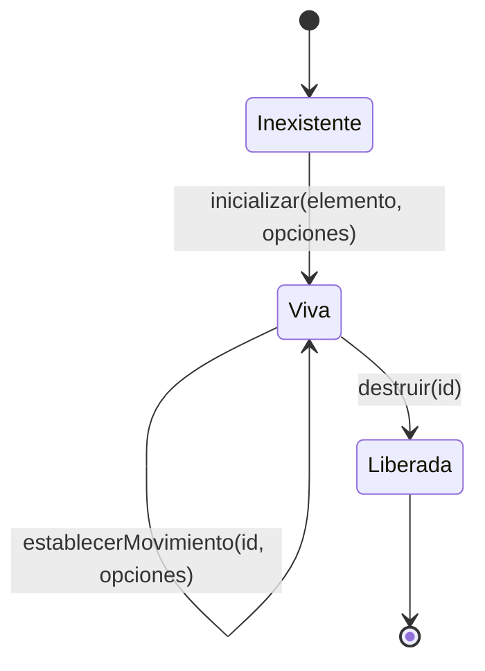

# Definición del Contrato de Fachada

**Unidad de entrega:** GeometriaFactory-Web
**Documento:** Definicion-Contrato-De-Fachada.md
**Versión:** 2.1
**Estado:** Aprobado
**Fecha:** 2026-08-09
**Autor:** Analista Funcional + API Designer (AG-02)
**Trazabilidad upstream:** `PRODUCT-INTAKE-Fabrica-De-Geometria.md` §14 (regla de arquitectura RA-02 y tabla de contratos expuestos), §17.7 P.2 (tres capas y motivo de la fachada), §17.7 P.3 (**las seis funciones declaradas**: las cinco originales más `establecerMovimiento`, que este documento acuñó por decisión del Product Owner del 2026-08-09 y que el intake consolidó en su versión 1.6), §17.7 P.4 (persistencia: prohibición explícita), §17.7 P.5 (seguridad: prohibición explícita), §17.7 P.10 (requerimientos no funcionales), §17.7 P.11 (decisiones pre-tomadas), §18 (punto de extensión y sample S-1), §20 E-1 y E-7; `00-Contexto/Vision-Producto.md` §3 (propuesta de valor) y §9 (glosario raíz); `00-Contexto/Alcance-Producto.md` §4.1 (capacidades comprometidas); `00-Contexto/Compatibilidad-Plataformas.md` §2.2 (plataforma del navegador) y §4 (alternativas para plataformas no soportadas); `01-Necesidades-Negocio/Necesidades-De-Negocio/NB-00006-Visualizacion-Dentro-Del-Producto.md` §1 (descripción de la necesidad), §4 (problema específico) y §5 (criterios de éxito)
**Trazabilidad downstream:** `Casos-De-Uso/CU-12001` a `CU-12007` de esta misma categoría; 03-UX-UI-DX (variante DX) de este proyecto de código; 05-Arquitectura-Tecnica; 06-Backlog-Tecnico; 08-Calidad-Y-Pruebas; 10-Examples (sample S-1)

---

## Tabla de contenido

- [1. Por qué existe este documento](#1-por-qué-existe-este-documento)
- [2. Vocabulario del concepto](#2-vocabulario-del-concepto)
- [3. Semántica general de la fachada](#3-semántica-general-de-la-fachada)
  - [3.1 Ciclo de vida de una instancia del visor](#31-ciclo-de-vida-de-una-instancia-del-visor)
  - [3.2 Qué garantiza la fachada en todas sus funciones](#32-qué-garantiza-la-fachada-en-todas-sus-funciones)
  - [3.3 Qué no hace la fachada en ninguna de sus funciones](#33-qué-no-hace-la-fachada-en-ninguna-de-sus-funciones)
- [4. Las seis funciones](#4-las-seis-funciones)
  - [4.1 inicializar](#41-inicializar)
  - [4.2 cargarJson](#42-cargarjson)
  - [4.3 seleccionarPieza](#43-seleccionarpieza)
  - [4.4 redimensionar](#44-redimensionar)
  - [4.5 destruir](#45-destruir)
  - [4.6 establecerMovimiento](#46-establecermovimiento)
- [5. Elementos del concepto](#5-elementos-del-concepto)
  - [5.1 Identificador de instancia](#51-identificador-de-instancia)
  - [5.2 Resultado de dibujo](#52-resultado-de-dibujo)
  - [5.3 Tipos dibujables y lectura de dimensiones](#53-tipos-dibujables-y-lectura-de-dimensiones)
  - [5.4 Disposición determinista](#54-disposición-determinista)
  - [5.5 Gobierno del movimiento automático de la escena](#55-gobierno-del-movimiento-automático-de-la-escena)
- [6. Códigos de condición de la fachada](#6-códigos-de-condición-de-la-fachada)
- [7. Compatibilidad de versión pública](#7-compatibilidad-de-versión-pública)
- [8. Trazabilidad](#8-trazabilidad)
- [9. Control de cambios](#9-control-de-cambios)

---

## 1. Por qué existe este documento

`GeometriaFactory-Visor` no tiene pantallas propias ni usuarios propios: es un archivo de guion que un componente anfitrión carga y del que invoca **seis funciones planas**. Toda su superficie pública es ese conjunto de seis funciones, de modo que el concepto técnico central del proyecto de código es el **contrato de fachada** y no un flujo de interacción.

Las seis las declara hoy PRODUCT-INTAKE §17.7 P.3. La sexta, `establecerMovimiento` (§4.6), la **acuñó este documento** por decisión del Product Owner del 2026-08-09, tomada al cerrar la validación visual de la Fase B2: prender y apagar los dos movimientos de la capacidad **F-25** con la escena andando exigía, dentro de las cinco originales, reconstruir la instancia, lo que **pierde la selección de pieza** y produce un parpadeo. **El intake la consolidó en su versión 1.6**, de modo que la fuente de las seis vuelve a ser única y es el intake; esta sección conserva su especificación.

El contrato es además el **punto de extensión declarado del producto** (PRODUCT-INTAKE §18): es lo que hace reemplazable el motor de dibujo tridimensional, porque el componente anfitrión nunca conoce los nombres internos del motor, sino sólo estas seis funciones. El sample S-1 lo ejerce entero sin ninguna pieza del backend, y es esa propiedad —y no un agregado de conveniencia— la que la fachada tiene que sostener.

Este documento fija vocabulario, semántica y elementos del concepto. Los siete casos de uso de esta categoría desarrollan cada contrato de uso con sus flujos, sus condiciones de error y sus criterios verificables; no repiten acá lo que allá se detalla.

## 2. Vocabulario del concepto

Los términos que esta categoría acuña están declarados en `Glosario-Funcional.md`. Los que ya declara el glosario raíz del producto —`Vision-Producto.md` §9— se referencian y no se redefinen. Los cuatro que ordenan la lectura de este documento son:

| Término | Sentido dentro del contrato |
| --- | --- |
| Componente anfitrión | El componente que embebe el archivo de guion e invoca sus seis funciones. Es el actor primario de todos los casos de uso de esta categoría. La fachada no sabe qué componente es, ni qué persona lo está usando |
| Elemento de dibujo | El elemento de la página sobre el que la instancia dibuja, provisto por el componente anfitrión |
| Instancia del visor | La escena viva asociada a un elemento de dibujo, creada por `inicializar` y liberada por `destruir` |
| Piezas reconstruidas | Lo que el componente anfitrión le entrega a `cargarPiezas`: las figuras del conjunto raíz **ya interpretadas** por el laboratorio, cada una con su posición, su tipo, sus dimensiones y sus componentes. Es un dato de entrada para dibujar: no se guarda, no se reescribe y **no se pide por su cuenta** |
| ~~Texto del trabajo~~ | **Retirado por [`ADR-08006`](../../../Producto/Adrs/ADR-08006-El-Visor-Recibe-Piezas-Reconstruidas-Y-No-El-Texto.md).** La fachada ya no recibe el texto del alumno: interpretarlo es del laboratorio, y tenerlo en dos lados es tener dos verdades sobre el mismo texto |

## 3. Semántica general de la fachada

### 3.1 Ciclo de vida de una instancia del visor

Reglas del ciclo de vida:

1. `inicializar` es la única función que se invoca sin identificador de instancia; las otras cinco lo exigen.
2. Una instancia liberada no vuelve a la vida: para volver a dibujar sobre el mismo elemento de dibujo, el componente anfitrión invoca `inicializar` otra vez y obtiene un identificador nuevo.
3. `cargarPiezas`, `seleccionarPieza`, `redimensionar` y `establecerMovimiento` son invocables tantas veces como el componente anfitrión quiera, en cualquier orden, sobre una instancia viva.
4. Cada invocación posterior de `cargarPiezas` reemplaza por completo el contenido dibujado de esa instancia y libera lo que la carga anterior había creado. Ese reemplazo es lo que sostiene el requerimiento de no degradar tras diez recorridos de ida y vuelta entre trabajos (PRODUCT-INTAKE §17.7 P.10).

### 3.2 Qué garantiza la fachada en todas sus funciones

| Garantía | Enunciado | Origen |
| --- | --- | --- |
| G-1 · Cero red | Ninguna función origina una petición de red, **y ningún movimiento automático de §5.5 la origina mientras corre**. El umbral es exactamente 0, medido contando peticiones **con los dos movimientos prendidos**, que es el peor caso: un bucle de dibujo en curso. Las condiciones de medición se declaran una sola vez en `Especificacion-Funcional.md` §6 | PRODUCT-INTAKE §14 (RA-02), §17.7 P.3, §17.7 P.10 |
| G-2 · Cero persistencia | Ninguna función guarda estado entre páginas ni escribe en el almacenamiento del navegador | PRODUCT-INTAKE §17.7 P.4 |
| G-3 · Sin configuración propia | Ninguna función lee configuración propia. Todo lo que la instancia necesita llega por parámetro | PRODUCT-INTAKE §17.7 P.3 |
| G-4 · Aislamiento entre instancias | Dos instancias vivas sobre elementos de dibujo distintos no comparten escena, ni selección, ni disposición | PRODUCT-INTAKE §17.7 P.2 (capa 3) |
| G-5 · Sin fallo silencioso | Toda pieza que la fachada no dibuja queda enumerada en el resultado de dibujo con su índice. Ninguna desaparece sin dejar registro | `Vision-Producto.md` §9 (fallo silencioso), NB-00006 §4 |
| G-6 · Determinismo | Dos cargas del mismo texto en instancias equivalentes producen la misma disposición y el mismo resultado de dibujo. **El determinismo es de la posición de cada pieza, derivada de su índice, y no de su orientación en un instante**: el movimiento automático de §5.5 no lo afecta | PRODUCT-INTAKE §17.7 P.10, P.11 punto 5 |
| G-7 · Terminación controlada | Ninguna condición de error deja la instancia en estado indeterminado: o la operación surte efecto completo, o la instancia queda como estaba y la condición se informa por su código | PRODUCT-INTAKE §17.7 P.2 |

### 3.3 Qué no hace la fachada en ninguna de sus funciones

| No hace | Por qué | Quién sí lo hace |
| --- | --- | --- |
| No pide ni envía datos por red | RA-02, y es lo que hace imposible violar RA-01 desde el navegador | El componente anfitrión, por sus propios medios |
| No sabe quién es la persona ni qué papel cumple, y no participa de ninguna decisión de autorización | Prohibición explícita de PRODUCT-INTAKE §17.7 P.5 | El backend del producto |
| No decide si el trabajo es válido ni emite observaciones —ni advertencias ni errores de validación— | La fachada sólo necesita saber de dónde sacar una dimensión para dibujar, y emite mallas. Esto **no es** duplicar la validación: son dos responsabilidades distintas sobre el mismo texto | El backend del producto (PRODUCT-INTAKE §17.7 P.11 punto 4) |
| No recalcula áreas ni volúmenes, y no compara valor declarado contra valor derivado | Es la capacidad de verificación del producto, que no vive en el navegador | El backend del producto |
| No conserva ni reescribe el texto del trabajo | El original se conserva íntegro donde corresponde, y la fachada no persiste nada | El backend del producto |
| No fija la ubicación, el tamaño ni el estilo del elemento de dibujo dentro de la página | Es decisión del componente anfitrión y de la categoría 03 | El componente anfitrión |
| No decide si el movimiento automático de §5.5 tiene que estar prendido, no dibuja control alguno para prenderlo y apagarlo, y **no conserva la preferencia**: la recibe y la ejerce | La preferencia es de quien mira, y guardarla violaría G-2. La fachada tampoco lee la preferencia de movimiento reducido del sistema por su cuenta, porque eso sería leer configuración propia y violaría G-3 | El componente anfitrión, que dibuja los controles, consulta la preferencia de movimiento reducido del sistema y conserva la elección |

**Precisión sobre la tolerancia de claves.** La fachada lee las dimensiones de una pieza aceptando las mismas variantes de clave que acepta el backend —`Tapas` y `Bases` como sinónimos para las bases del volumen, y caras nombradas de una u otra forma— porque de otro modo habría piezas que el producto interpreta y la escena no dibuja, que es exactamente el defecto que el producto viene a eliminar. Aceptar esas variantes es **leer una dimensión**, no validar un trabajo, y por eso no contradice la fila anterior (PRODUCT-INTAKE §17.7 P.11 punto 4).

## 4. Las seis funciones

Los nombres de las cinco primeras son los que declara PRODUCT-INTAKE §17.7 P.3 y no se cambian. El de la sexta, `establecerMovimiento`, lo acuña este documento (§4.6) siguiendo la misma forma —verbo más objeto— y queda sujeto a la consolidación del intake. Los nombres de funciones internas, de clases y de campos del resultado **no se fijan acá**: se anclan en la etapa que implementa la fachada.

### 4.1 `inicializar`

| Aspecto | Definición |
| --- | --- |
| Firma declarada | `inicializar(elemento, opciones)` |
| Qué recibe | El elemento de dibujo sobre el que montar la escena, y un conjunto de opciones provisto por el componente anfitrión —de presentación, y **el aviso de selección** ([`ADR-08007`](../../../Producto/Adrs/ADR-08007-El-Aviso-De-Seleccion-Va-En-Las-Opciones.md))—. **Dos de esas opciones están declaradas y son de gobierno del movimiento automático (§5.5)**: el estado inicial de la órbita de la cámara y el estado inicial del giro de las figuras, cada uno prendido o apagado. Ausentes o parciales, la instancia arranca con los dos movimientos **apagados**: la fachada no consulta preferencias del sistema (G-3) y el arranque quieto es el que no sorprende. Estas opciones fijan el estado **con el que la instancia nace**; cambiarlo después, con la instancia viva, es de `establecerMovimiento` (§4.6) |
| Qué devuelve | Un identificador de instancia, que el componente anfitrión conserva y usa en las otras cinco funciones |
| Qué garantiza | Que queda una instancia viva con escena, iluminación y cámara orbital, aislada de cualquier otra instancia (G-4), y que la instancia no dibuja ninguna pieza hasta que se invoque `cargarPiezas` |
| Qué no hace | No lee configuración propia (G-3), no crea el elemento de dibujo ni lo ubica en la página, y no dibuja contenido |
| Caso de uso | `CU-12001` |

### 4.2 `cargarPiezas`

> **Renombrada y cambiada de firma por [`ADR-08006`](../../../Producto/Adrs/ADR-08006-El-Visor-Recibe-Piezas-Reconstruidas-Y-No-El-Texto.md).**
> Se llamaba `cargarPiezas(id, piezas)` y recibía el texto del alumno. **El nombre cambia con la
> firma**: seguir llamándola «cargar JSON» cuando ya no recibe JSON del alumno sería el peor de los
> dos mundos —un nombre que promete una cosa y un parámetro que trae otra—.
>
> **La tolerancia del formato deja de vivir acá.** Las cuatro trampas —la clave sinónima del
> ortoedro, las comas finales, la cara del cubo con dos nombres y los valores erróneos— las resuelve
> el validador del laboratorio, con su batería obligatoria de diez casos. El bundle deja de tener
> tabla de claves sinónimas y deja de tolerar comas finales, **porque ya no las ve**.
>
> **Lo que NO cambia: el bundle no habla con el servicio de datos.** `RA-02` se conserva entero. Las
> piezas se las da su anfitrión, que es lo que siempre hizo; lo único distinto es la forma del dato.

| Aspecto | Definición |
| --- | --- |
| Firma declarada | `cargarPiezas(id, piezas)` |
| Qué recibe | El identificador de una instancia viva y **las piezas reconstruidas** del trabajo |
| Qué devuelve | El resultado de dibujo (§5.2): las piezas dibujadas con su índice y su tipo, las no dibujadas con su índice y el motivo de contrato, y la estructura del texto lista para presentarse como árbol |
| Qué garantiza | Que reemplaza por completo el contenido anterior de esa instancia y libera lo que había creado; que la disposición es determinista (G-6); que ninguna pieza desaparece sin quedar enumerada (G-5); y que el texto recibido no se conserva ni se modifica (G-2) |
| Qué no hace | No pide las piezas por su cuenta (G-1), no valida el trabajo, no emite observaciones, no recalcula valores y **no interpreta el texto del alumno, que ya no recibe** |
| Caso de uso | `CU-12002` |

**Qué pasa con la condición `DIMENSION_NO_LEGIBLE`.** Era el motivo con el que esta función
enumeraba la pieza cuya dimensión no pudo leer —el caso de `§20.E-8`, `"3,50"` escrito con la coma
decimal de la cultura del emisor—. **Con las piezas ya reconstruidas, esa pieza no llega hasta acá**:
el validador la retuvo y emitió su error de validación con posición y campo, y el trabajo quedó en
`Borrador`. La condición **se conserva declarada** para el caso en que el anfitrión entregue una
pieza con una dimensión que la fachada no pueda usar, y **deja de ser el camino normal de ese
escenario**. La frontera que `Definicion-Contrato-Del-Validador-De-Figuras.md` §8 describía en dos
mitades pasa a tener una sola: **decidir si el trabajo verifica y decidir qué se dibuja dejan de leer
el mismo texto**.

**El aviso de selección, y por qué vive acá.** `F-13` exige que la escena y el árbol se sincronicen
**en las dos direcciones**, y las seis funciones de esta fachada van todas del anfitrión hacia el
visor: ninguna avisa de vuelta. El anfitrión entrega, entre las opciones, **una función que el visor
llama cuando la persona elige una pieza en la escena**, con su posición.

**No es una séptima función, y es deliberado**: las seis son órdenes que el anfitrión da, y esto es
lo contrario. Meterlo entre ellas dejaría la superficie con seis cosas que se piden y una que se
recibe, sin nada que las distinga —y tocaría la zona de frontera que el Product Owner fijó—.

**El visor no guarda la selección ni decide qué hacer con ella**: avisa y resalta. Y `RA-02` no se
mueve: el aviso **se lo dan**, como el color de fondo.

### 4.3 `seleccionarPieza`

| Aspecto | Definición |
| --- | --- |
| Firma declarada | `seleccionarPieza(id, indice)` |
| Qué recibe | El identificador de una instancia viva y el índice de la pieza dentro del conjunto raíz del trabajo |
| Qué devuelve | La confirmación de la selección efectiva, con el índice que quedó resaltado, o la condición que impidió resaltarlo |
| Qué garantiza | Que el resaltado es exclusivo —una sola pieza resaltada por instancia— y que el índice es el mismo con el que la pieza figura en el resultado de dibujo, de modo que el componente anfitrión puede sincronizar el árbol con la escena sin traducir identidades |
| Qué no hace | No modifica la disposición, no reordena las piezas y no altera el resultado de dibujo vigente |
| Caso de uso | `CU-12003` |

### 4.4 `redimensionar`

| Aspecto | Definición |
| --- | --- |
| Firma declarada | `redimensionar(id)` |
| Qué recibe | El identificador de una instancia viva |
| Qué devuelve | La confirmación de que la escena quedó ajustada al tamaño vigente del elemento de dibujo |
| Qué garantiza | Que la relación de aspecto se recalcula contra el tamaño actual del elemento de dibujo, sin deformar las piezas ni perderlas de encuadre, y que la selección vigente y la disposición se conservan |
| Qué no hace | No observa el tamaño por su cuenta ni decide cuándo hay que ajustar: el componente anfitrión es quien invoca. No redibuja el trabajo ni vuelve a leer el texto. **No repone un elemento de dibujo que dejó de servir como superficie**: si el elemento de una instancia viva pasó a tamaño cero, la fachada informa `ELEMENTO_DE_DIBUJO_INVALIDO` en su segundo curso (§6) y deja la instancia viva, a la espera de una invocación posterior |
| Caso de uso | `CU-12004` |

### 4.5 `destruir`

| Aspecto | Definición |
| --- | --- |
| Firma declarada | `destruir(id)` |
| Qué recibe | El identificador de una instancia |
| Qué devuelve | La confirmación de la liberación |
| Qué garantiza | Que libera geometrías, materiales y el contexto gráfico de esa instancia, y que el identificador deja de ser válido. Es la función que hace que recorrer trabajos de ida y vuelta no acumule contextos gráficos |
| Qué no hace | No toca otras instancias (G-4), no borra el elemento de dibujo de la página y no deja rastro en el almacenamiento del navegador (G-2) |
| Caso de uso | `CU-12005` |

### 4.6 `establecerMovimiento`

Sexta función, acuñada por este documento el 2026-08-09 por decisión del Product Owner. Gobierna los dos movimientos automáticos de §5.5 **sobre una instancia viva**, y es la única vía de cambiarlos después de `inicializar`.

| Aspecto | Definición |
| --- | --- |
| Firma declarada | `establecerMovimiento(id, opciones)` |
| Qué recibe | El identificador de una instancia viva y el estado deseado —prendido o apagado— de la **órbita de la cámara**, del **giro de las figuras**, o de los dos. Las opciones son las mismas dos que declara `inicializar` (§4.1), con una diferencia de semántica que corresponde al momento: acá **el movimiento no nombrado conserva el estado que tenía**, porque la escena ya tiene uno, mientras que en `inicializar` lo ausente arranca apagado |
| Qué devuelve | El estado efectivo de los **dos** movimientos después de la operación, para que el componente anfitrión sincronice sus controles con lo que la escena está haciendo; o la condición que impidió aplicarla |
| Qué garantiza | Que cada movimiento nombrado queda en el estado pedido y el no nombrado en el que tenía; que **al apagar el giro de las figuras cada pieza vuelve a su orientación de partida** (§5.5 regla 5); que la disposición, la selección vigente, el encuadre, el resultado de dibujo vigente y el identificador de instancia **son exactamente los de antes** de la invocación; y que la operación es idempotente —fijar el estado que ya estaba no cambia nada— |
| Qué no hace | **No toca la escena más allá del movimiento**: no la reconstruye, no la recarga, no vuelve a leer el texto, no altera la disposición ni la selección, y no invalida el identificador. No roza el determinismo: la posición de cada pieza sigue derivada de su índice (G-6). **No emite condición nueva**: con un identificador que no corresponde a una instancia viva informa `INSTANCIA_DESCONOCIDA`, que ya existe, y los códigos de §6 siguen siendo siete. No dibuja controles, no consulta la preferencia de movimiento reducido del sistema (G-3) y no conserva la preferencia (G-2). No hace red (G-1), no lee configuración propia y no sabe quién mira |
| Caso de uso | `CU-12007` |

`CU-12006` no agrega una función más: recorre las **seis** desde una página integradora sin backend, que es la forma en que las **seis** propiedades transversales —cero red, cero persistencia, se ejercita sin backend, disposición determinista, liberación de recursos y ausencia de fallo silencioso— se verifican juntas. Su membresía, su umbral y las condiciones en que se miden se declaran una sola vez, en `Especificacion-Funcional.md` §6.

## 5. Elementos del concepto

### 5.1 Identificador de instancia

Valor opaco que `inicializar` devuelve y que las otras cinco funciones exigen. Su forma no se fija en esta categoría. Sus tres propiedades semánticas sí:

1. Identifica una instancia viva y sólo una.
2. Deja de ser válido en cuanto `destruir` retorna, y no se reutiliza para una instancia nueva.
3. Un identificador que no corresponde a ninguna instancia viva produce la condición `INSTANCIA_DESCONOCIDA` y ninguna otra consecuencia: no crea instancias, no dibuja y no rompe la instancia que sí exista.

### 5.2 Resultado de dibujo

Es lo que `cargarPiezas` devuelve. PRODUCT-INTAKE §17.7 P.3 lo llama «el resultado de la interpretación»; dentro de este proyecto de código se lo nombra **resultado de dibujo** para que no se lo confunda con el resultado de la interpretación que emite el backend, que lleva observaciones y decide si el trabajo se puede finalizar. El resultado de dibujo **no lleva observaciones**.

Contiene, en términos funcionales y sin fijar nombres de campo:

| Elemento | Semántica |
| --- | --- |
| Piezas dibujadas | Una entrada por pieza que produjo malla, con su índice en el conjunto raíz y su tipo |
| Piezas no dibujadas | Una entrada por pieza que no produjo malla, con su índice y el código de condición que lo explica. Es lo que materializa G-5 |
| Estructura del texto | La representación jerárquica del texto recibido, para que el componente anfitrión la presente como árbol colapsable |
| Condición general | El código de condición de la invocación completa cuando no se pudo dibujar nada |

### 5.3 Tipos dibujables y lectura de dimensiones

La fachada dibuja **seis tipos de pieza**, que son los que el escenario E-7 del intake ejercita como piezas del conjunto raíz: tres volumétricos —`Cilindro`, `Cubo`, `Ortoedro`— y tres planos —`Rectangulo`, `Cuadrado`, `Circulo`—.

- Una pieza de un tipo que no está en esos seis **no se dibuja** y queda enumerada con la condición `TIPO_NO_DIBUJABLE`. La fachada no la califica de error del trabajo: eso lo decide el backend.
- `RectanguloDesarrollado` aparece únicamente como componente `Lado` del cilindro y no como pieza del conjunto raíz; la fachada lo usa para leer la dimensión del cilindro y no lo dibuja como pieza suelta (PRODUCT-INTAKE §21, nota de tipos sin escenario propio).
- Las dimensiones de un volumen se leen de sus componentes según la lectura verificada en E-7: en el ortoedro, ancho y profundidad de la primera base y altura del primer lateral.
- **El cero es una dimensión legible.** Una dimensión presente con valor `0.00` **está expuesta**, de modo que la pieza que la declara **se dibuja** y no produce `DIMENSION_NO_LEGIBLE`. Lo que produce esa condición es la **ausencia** de la clave o del componente del que se lee la medida, nunca el valor que trae. La distinción no es teórica: el escenario `E-6` del intake §20 es exactamente una pieza plana con una dimensión en `0.00`, y el visualizador previo la perdía sin aviso porque evaluaba la verdad del número en lugar de su presencia. Perderla contradiría ese escenario declarado y vaciaría la garantía G-5, que es la que el producto viene a instalar. Una pieza de dimensión nula puede resultar visualmente degenerada —sin superficie apreciable—; eso es una consecuencia legítima del dato del alumno y **no autoriza a descartarla**.

### 5.4 Disposición determinista

La ubicación de cada pieza en la escena **se deriva de su índice** en el conjunto raíz del trabajo. Reemplaza el ordenamiento aleatorio del visualizador previo (PRODUCT-INTAKE §17.7 P.2 y P.11 punto 5).

Consecuencia verificable: cargar dos veces el mismo texto produce la misma disposición, comparable pieza por pieza. Es lo que le permite a quien mira dos previsualizaciones del mismo trabajo compararlas sin confundirse (NB-00006 §4).

### 5.5 Gobierno del movimiento automático de la escena

Capacidad **F-25** del alcance del producto, incorporada por el Product Owner durante la validación visual de la Fase B2. La escena admite **dos movimientos automáticos, independientes entre sí**, y la fachada es quien los gobierna: no existe ninguna otra vía de prenderlos ni de apagarlos, y el componente anfitrión **no toca la escena** para conseguirlo.

| Movimiento | Qué hace | Procedencia |
| --- | --- | --- |
| **Órbita de la cámara** | La cámara gira sola alrededor del conjunto y **las piezas quedan quietas**. Es un incremento lento del ángulo horizontal del punto de vista | **Existe en el visualizador previo** y se porta con su comportamiento (PRODUCT-INTAKE §17.7 P.2, escena con cámara orbital) |
| **Giro de las figuras** | Cada pieza rota sobre su eje vertical, **en su lugar**, sin moverse de la celda que le asignó su índice | **Capacidad nueva**: no existe en el visualizador previo, que mueve la cámara y deja las piezas quietas |

Reglas del gobierno, todas verificables:

1. **Se prenden y se apagan por separado, y pueden estar prendidos los dos a la vez.** Son dos gobiernos, no un modo con tres valores.
2. **Estado inicial por opción de `inicializar`** (§4.1). Con las opciones ausentes o parciales, los dos arrancan apagados.
3. **Cambio con la instancia viva, por la sexta función.** El componente anfitrión que necesita prender o apagar un movimiento sobre una instancia ya cargada invoca `establecerMovimiento(id, opciones)` (§4.6). El cambio **no reconstruye la instancia**: la disposición, la selección vigente, el encuadre, el resultado de dibujo y el identificador quedan como estaban, y el movimiento no nombrado conserva su estado. **El estado de los movimientos sobrevive a `cargarPiezas`**: cargar otro texto reemplaza el contenido dibujado, no el gobierno de la escena. Desarrollo completo en `CU-12007`.
4. **Ninguno de los dos altera la disposición.** El determinismo comprometido en G-6 es de la **posición** de cada pieza, derivada de su índice, y no de su orientación en un instante. Dos personas que miran el mismo trabajo con el giro prendido ven la misma disposición aunque no vean la misma orientación.
5. **Al apagar el giro de las figuras, las piezas vuelven a su orientación de partida.** Sin esa reposición, apagar el movimiento dejaría cada pieza donde el azar del tiempo la encontró, y dos personas que apagan el giro verían escenas distintas del mismo trabajo.
6. **Los dos se detienen mientras la persona arrastra la cámara**, y mientras la superficie de dibujo no está visible. El primero evita pelearle el control a quien lo tomó; el segundo es lo que impide que un movimiento invisible siga consumiendo recursos.
7. **Ninguno origina una petición de red** (G-1) y **ninguno escribe nada** (G-2): la preferencia vive en el componente anfitrión, que es quien la conserva y quien consulta la preferencia de movimiento reducido del sistema.
8. **Ninguno de los dos emite una condición.** No hay código nuevo: la lista de §6 sigue cerrada en siete. Un movimiento que no arranca porque la instancia no existe es `INSTANCIA_DESCONOCIDA` y nada más, y `establecerMovimiento` no agrega ninguno.

**Punto abierto resuelto, y consolidado aguas arriba.** La versión anterior de esta sección elevó al Product Owner que el cambio en vivo, dentro de las cinco funciones que el intake declaraba entonces, obligaba a reconstruir la instancia y a que el anfitrión repusiera la selección. **El Product Owner lo resolvió el 2026-08-09 agregando la sexta función de gobierno**, `establecerMovimiento` (§4.6), con su contrato de uso en `CU-12007`. **La consolidación que quedaba pendiente también está hecha**: `PRODUCT-INTAKE` §17.7 P.3 declara la sexta función desde su versión **1.6**, con su enunciado y con la remisión a §4.6 de este documento. No queda nada abierto en este punto.

## 6. Códigos de condición de la fachada

Los códigos son **condiciones de contrato**, no observaciones de dominio. Se declaran acá una vez y los casos de uso los referencian. Son **siete**, y esta tabla es su fuente única: un código que no figure acá no existe, y un curso nuevo se agrega como fila de curso y no como código nuevo.

| Código | Curso | Cuándo se produce | Efecto sobre la instancia |
| --- | --- | --- | --- |
| `CAPACIDAD_GRAFICA_AUSENTE` | Único | El navegador no provee la capacidad gráfica tridimensional requerida | No se crea instancia. `inicializar` no devuelve identificador |
| `ELEMENTO_DE_DIBUJO_INVALIDO` | **C-1, en creación** | El elemento recibido por `inicializar` no sirve como superficie de dibujo, o tiene tamaño nulo | **No se crea instancia** y no se devuelve identificador |
| `ELEMENTO_DE_DIBUJO_INVALIDO` | **C-2, en ajuste** | El elemento de dibujo de una instancia viva dejó de servir como superficie, o pasó a tamaño cero, al invocar `redimensionar` —por ejemplo porque el componente anfitrión lo ocultó o lo desmontó de la página— | **La instancia sigue viva**, con su escena y su selección intactas. No se recalcula nada; una invocación posterior ajusta cuando el elemento vuelva a tener tamaño |
| `INSTANCIA_DESCONOCIDA` | Único, en cinco funciones | El identificador recibido no corresponde a ninguna instancia viva, o corresponde a una ya liberada. Es también la condición que corresponde cuando se invoca `establecerMovimiento` con un identificador inválido | Ninguno: ninguna instancia cambia |
| `TEXTO_NO_LEGIBLE` | Único | El texto recibido por `cargarPiezas` no permite obtener un conjunto de piezas | La instancia queda viva y vacía: se libera lo dibujado antes y no se dibuja nada nuevo |
| `TIPO_NO_DIBUJABLE` | Único, por pieza | Una pieza del conjunto raíz declara un tipo que no está entre los seis dibujables | Esa pieza no se dibuja; las demás sí |
| `DIMENSION_NO_LEGIBLE` | Único, por pieza | Una pieza de un tipo dibujable **no expone** la dimensión necesaria para construir su malla: la clave o el componente del que se lee la medida está ausente. **Un valor de `0.00` no produce esta condición**: el cero es una dimensión legible y esa pieza se dibuja (§5.3) | Esa pieza no se dibuja; las demás sí |
| `INDICE_FUERA_DE_RANGO` | Único | El índice recibido por `seleccionarPieza` no corresponde a ninguna **pieza dibujada** del resultado de dibujo vigente. Cubre los dos casos: el índice que no está en el conjunto raíz, y el índice de una pieza que el resultado de dibujo enumera como **no dibujada**, que figura en el resultado pero no tiene malla que resaltar | Ninguno: la selección vigente se conserva |

**Por qué `ELEMENTO_DE_DIBUJO_INVALIDO` tiene dos cursos y no dos códigos.** La causa es la misma en los dos —el elemento de dibujo no sirve como superficie— y la reacción que le queda al componente anfitrión también: proveer un elemento con tamaño y volver a invocar. Lo que cambia es el momento del ciclo de vida, y con él el efecto sobre la instancia, que esta tabla declara por curso. Acuñar un segundo código habría partido una condición única en dos identificadores que el anfitrión trata igual, y habría obligado a las categorías aguas abajo a duplicar su aserción. Que un código se presente en más de una entrada de catálogo es el patrón normal aguas abajo —`INSTANCIA_DESCONOCIDA` se presenta en cinco funciones y es un solo código—: la unidad de catalogación de 03 es la función, la de este contrato es la condición.

**Los siete códigos son la lista cerrada.** Un curso nuevo se declara como fila de curso en esta tabla; un código nuevo sólo puede nacer acá, en 02, y nunca aguas abajo.

## 7. Compatibilidad de versión pública

Sección propia de este documento de concepto. `Rules-Especificacion-Funcional.md` §4.3 prevé una sección homóloga, **§17 Compatibilidad de versión pública**, como sección opcional **de los casos de uso** de tipo `library`; acá el contenido se declara una sola vez en el documento de concepto y los siete casos de uso no la repiten. Ninguno de ellos necesita llevarla.

1. **La superficie pública son seis funciones y nada más.** Agregar una función es cambio menor —así entró `establecerMovimiento` el 2026-08-09, sin romper a ningún anfitrión escrito contra las cinco anteriores—; quitar una, renombrarla o cambiar qué recibe es cambio mayor, porque rompe al componente anfitrión y al sample S-1.
2. **El identificador de instancia es opaco.** Cambiar su forma interna no es cambio de contrato mientras siga cumpliendo §5.1; que el componente anfitrión dependa de su forma es un defecto del anfitrión.
3. **El resultado de dibujo admite entradas nuevas sin subir mayor**, siempre que las ya declaradas en §5.2 conserven su semántica.
4. **Las siete garantías de §3.2 son parte del contrato**, no detalles de implementación: perder cualquiera de ellas es cambio mayor aunque las seis firmas no se toquen.
5. El artefacto que materializa este contrato es un archivo generado y **nunca se edita a mano** (PRODUCT-INTAKE §17.7 P.7). La elección del motor de dibujo y su versión es decisión de 05-Arquitectura-Tecnica.

## 8. Trazabilidad

| Dimensión | Referencia |
| --- | --- |
| Necesidad de negocio | `NB-00006` (visualización del trabajo dentro del producto); `NB-00004` en su parte de piezas efectivamente dibujadas |
| Reglas de negocio aplicables | Ninguna. Este proyecto de código no declara RN, por el motivo que declara el `README.md` de la sección |
| Casos de uso que lo desarrollan | `CU-12001`, `CU-12002`, `CU-12003`, `CU-12004`, `CU-12005`, `CU-12006`, `CU-12007` |
| Historias de usuario a generar | Las que 06-Backlog-Tecnico derive de los siete casos de uso |
| Componentes esperados | Fachada plana y servicio de dibujo, en las capas 2 y 3 de PRODUCT-INTAKE §17.7 P.2. La composición concreta la fija 05-Arquitectura-Tecnica |
| Tests previstos | 08-Calidad-Y-Pruebas: verificación de las siete garantías de §3.2, con los escenarios E-1 y E-7 como material de dibujo. **G-1 se mide con los dos movimientos de §5.5 prendidos**, que es su peor caso, según las condiciones que fija `Especificacion-Funcional.md` §6 |
| Ejemplos | 10-Examples: sample S-1, que ejerce el contrato entero sin backend |

## 9. Control de cambios

| Versión | Fecha | Cambios |
| --- | --- | --- |
| 1.0 | 2026-08-08 | Emisión inicial. Fija el vocabulario del contrato, el ciclo de vida de una instancia, las siete garantías transversales, las seis prohibiciones, la semántica de las cinco funciones declaradas por el intake, los cuatro elementos del concepto, los siete códigos de condición y la política de compatibilidad de la superficie pública. |
| 1.0 | 2026-08-08 | Correcciones absorbidas del audit `B-02-03-GeometriaFactory-Visor-r1.md`, sin subir versión por `Master-Prompt.md` §5 (documento en estado `Propuesto`). **H-01**: §6 pasa a tener columna de curso y declara los dos cursos de `ELEMENTO_DE_DIBUJO_INVALIDO` —C-1 en creación, sin instancia; C-2 en ajuste, con la instancia viva— con el fundamento de por qué es un código con dos cursos y no dos códigos; §4.4 suma la mención de la condición en «Qué no hace» de `redimensionar`. El total de códigos sigue siendo **siete**. **H-02**: §4.5 pasa a nombrar las **seis** propiedades transversales, con la membresía y los umbrales remitidos a `Especificacion-Funcional.md` §6 como lugar único. **H-09**: el enunciado de `INDICE_FUERA_DE_RANGO` pasa a decir «ninguna **pieza dibujada** del resultado de dibujo vigente», alineado con `CU-12003` paso 2, y declara que cubre el curso de la pieza enumerada como no dibujada. **H-10**: la cabecera sustituye las referencias sin sección por `Compatibilidad-Plataformas.md` §2.2 y §4, `Vision-Producto.md` §3 y §9, `Alcance-Producto.md` §4.1 y `NB-00006` §1, §4 y §5. **H-12**: §7 deja de citar `Rules-Especificacion-Funcional.md` §4.3 como fundamento de su propia existencia y declara que la sección homóloga §17 de esa regla gobierna los casos de uso, que no la repiten. |
| 1.0 | 2026-08-09 | Retroalimentación de la Fase B2 de validación de maqueta del proyecto de código `GeometriaFactory-Web`, dentro de la cual se validó este contrato por no tener maqueta propia. **Sin subir versión** por `Master-Prompt.md` §5, que lo admite mientras el documento está en estado `Propuesto`. **(a) Capacidad F-25, movimiento automático de la escena** (`PRODUCT-INTAKE` 1.5, §4 y §17.7 P.10): nace **§5.5**, que declara los dos movimientos independientes —órbita de la cámara, portada del visualizador previo, y giro de las figuras, capacidad nueva—, sus ocho reglas de gobierno y el punto abierto sobre el cambio en vivo; **§4.1** declara las dos opciones de gobierno que `inicializar` recibe y el arranque apagado ante opciones ausentes o parciales; **§3.2** precisa **G-6**, que el determinismo es de la posición derivada del índice y no de la orientación en un instante; **§3.3** suma la prohibición correspondiente: la fachada no dibuja controles, no consulta la preferencia de movimiento reducido del sistema —lo que violaría G-3— y no conserva la preferencia —lo que violaría G-2—. Los siete códigos de **§6** no cambian: ningún movimiento emite condición. **(b) El cero como dimensión legible**: **§5.3** declara que una dimensión presente con valor `0.00` está expuesta y que la pieza se dibuja, y que `DIMENSION_NO_LEGIBLE` la produce la **ausencia** de la clave y nunca el valor; **§6** replica la precisión en la fila del código. Lo motivó la validación visual: el visualizador previo evaluaba la verdad del número y perdía la figura, lo que contradice el escenario `E-6` del intake §20 y vacía la garantía G-5. |
| 1.0 | 2026-08-09 | Segunda absorción de la **Fase B2**: las **dos decisiones del Product Owner** tomadas al cerrar la validación visual de la maqueta. **Sin subir versión** por `Master-Prompt.md` §5, que lo admite mientras el documento está en estado `Propuesto`. **(a) Sexta función de la fachada.** Prender o apagar los movimientos con la escena andando se resolvía reconstruyendo la instancia, lo que **pierde la selección de pieza** y produce un parpadeo; el Product Owner decidió agregar una función de gobierno. Nace **§4.6**, `establecerMovimiento(id, opciones)`, con qué recibe —el estado deseado de uno de los dos movimientos o de los dos, y el no nombrado conserva el suyo—, qué devuelve —el estado efectivo de los dos—, qué garantiza —reposición de la orientación de partida al apagar el giro, conservación de disposición, selección, encuadre, resultado de dibujo e identificador, e idempotencia— y qué no hace —no reconstruye, no recarga, no roza el determinismo y **no emite condición nueva**—. En consecuencia: **§1** y **§4** pasan de cinco a **seis funciones** y declaran que la sexta la acuña este documento hasta que el intake la consolide; **§3.1** suma la transición al ciclo de vida y corrige las reglas 1 y 3; **§4.1** precisa que sus dos opciones fijan el estado de nacimiento y que el cambio posterior es de §4.6; **§5.1** dice «las otras cinco funciones»; **§5.5 regla 3** se reescribe sobre la sexta función y declara que el estado de los movimientos **sobrevive a `cargarPiezas`**; **§5.5 regla 8** y **§6** confirman los **siete** códigos, con `INSTANCIA_DESCONOCIDA` presente ahora en **cinco** funciones; **§7 punto 1** declara la superficie en seis y agregar una función como cambio menor; **§8** suma `CU-12007`. **El punto abierto de §5.5 queda resuelto** y su texto pasa a declarar la resolución y lo que resta consolidar en el intake. **(b) Condiciones de medición de la garantía de red.** **G-1** en §3.2 pasa a declarar que ningún movimiento origina petición mientras corre y que la medición se hace **con los dos movimientos prendidos**, su peor caso, remitiendo a `Especificacion-Funcional.md` §6 como lugar único de las condiciones. Motivo: los entornos de prueba automatizados suelen declarar preferencia de movimiento reducido, con lo que los dos movimientos arrancarían apagados y la prueba mediría el caso fácil sin ejercitar el bucle de dibujo. El umbral no cambia: sigue siendo exactamente 0. |
| 1.0 | 2026-08-09 | Corrección absorbida de la auditoría `B2-Maqueta-GeometriaFactory-Web-r1.md`, **sin subir versión** por `Master-Prompt.md` §5. **`AB2-10`**: la fecha de cabecera decía 2026-08-08 y el documento tiene entradas de control de cambios fechadas 2026-08-09; pasa a **2026-08-09**, que es cuando se lo tocó por última vez. Ningún contenido cambia. |
| 2.0 | 2026-08-16 | **Absorbe [`ADR-08006`](../../../Producto/Adrs/ADR-08006-El-Visor-Recibe-Piezas-Reconstruidas-Y-No-El-Texto.md), la decisión del Product Owner de que el visor reciba las piezas ya reconstruidas y no el texto del alumno.** §4.2 pasa de `cargarJson(id, texto)` a **`cargarPiezas(id, piezas)`**, con el nombre cambiado junto con la firma: seguir llamándola «cargar JSON» cuando ya no recibe JSON sería un nombre que promete una cosa y un parámetro que trae otra. §2 retira el término «texto del trabajo» y declara «piezas reconstruidas» en su lugar, con la constancia de por qué el anterior se fue. **La tolerancia del formato deja de vivir en el bundle**: las cuatro trampas las resuelve el validador del laboratorio con su batería de diez casos, y el bundle deja de tener tabla de claves sinónimas y de tolerar comas finales **porque ya no las ve**. La condición `DIMENSION_NO_LEGIBLE` **se conserva declarada y deja de ser el camino normal de `§20.E-8`**: esa pieza ya no llega hasta acá. **`RA-02` no se toca y se declara explícitamente**: el bundle sigue sin hacer red, sin identidad y sin pedir su dato por su cuenta —lo recibe de su anfitrión, que es lo que siempre hizo—. Sube **major**: cambia la firma de una función de la fachada. | Product Owner (decisión) · Orquestador SDD |
| 1.1 | 2026-08-09 | **Cierra el hallazgo `F26-11`** del informe de auditoría `SDD/Docs/Audit/F26-Propagacion-r1.md` 1.0, contra `PRODUCT-INTAKE` **1.9**. Tres lugares de este documento —la trazabilidad de cabecera, **§1** y **§5.5**— declaraban que el intake §17.7 P.3 **sigue declarando cinco funciones** y que la consolidación de la sexta estaba pendiente. **Ya no lo está**: el intake la consolidó en su versión **1.6**, y su §17.7 P.3 declara `establecerMovimiento(id, opciones)` como sexta función, rotulada como decisión del 2026-08-09 y remitiendo a §4.6 de este documento por su especificación. §5.5, que se titula «Punto abierto resuelto», dejaba abierto en su texto lo único que quedaba, de modo que un lector encontraba abierto lo que el título declaraba cerrado. Los tres pasajes se corrigen y §5.5 declara que no queda nada abierto en este punto. Ninguna función, garantía, prohibición, código de condición ni política de compatibilidad cambia: la superficie sigue siendo de seis funciones y siete códigos. |
| 2.1 | 2026-08-16 | **Absorbe [`ADR-08007`](../../../Producto/Adrs/ADR-08007-El-Aviso-De-Seleccion-Va-En-Las-Opciones.md)**: las opciones de `inicializar` suman **el aviso de selección**, que es la única vía del visor hacia su anfitrión y lo que permite cumplir `F-13` en su segunda dirección. **Las funciones siguen siendo seis** y ninguna cambia de firma ni de nombre: la zona de frontera `F-01a` no se toca. Se declara por qué no es una séptima función —las seis son órdenes que el anfitrión da, y un aviso es lo contrario— y que el visor **no guarda la selección**: avisa y resalta. Sube minor: amplía las opciones sin cambiar ninguna función. | Orquestador SDD |
