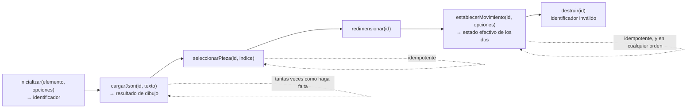

# DX — Experiencia del developer sobre la fachada del visor

**Unidad de entrega:** GeometriaFactory-Web
**Documento:** DX-Developer-Experience.md
**Versión:** 1.2
**Estado:** Aprobado
**Fecha:** 2026-08-11
**Autor:** DX Lead (AG-03)
**Variante:** DX

**Trazabilidad upstream:** `../02-Especificacion-Funcional/Definicion-Contrato-De-Fachada.md` §3.1 (ciclo de vida), §3.2 (siete garantías), §3.3 (siete prohibiciones), §4 (las **seis** funciones, con §4.6 la sexta, `establecerMovimiento`), §5 (elementos del concepto, con §5.5 el gobierno del movimiento automático de la escena), §6 (siete códigos de condición) y §7 (compatibilidad de la superficie pública); `../02-Especificacion-Funcional/Especificacion-Funcional.md` §2 y §6; `../02-Especificacion-Funcional/Casos-De-Uso/CU-12001` a `CU-12007`; `../02-Especificacion-Funcional/Glosario-Funcional.md`; `../../../00-Contexto/Vision-Producto.md` §3 y §9; `../../../00-Contexto/Alcance-Producto.md` §4.1 (capacidades F-11 y **F-13**, esta última `Must Have` desde `PRODUCT-INTAKE` **1.19**); `../../../00-Contexto/Compatibilidad-Plataformas.md` §2.2 y §2.3; `../../../01-Necesidades-Negocio/Necesidades-De-Negocio/NB-00006-Visualizacion-Dentro-Del-Producto.md` §4 y §5; `PRODUCT-INTAKE-Fabrica-De-Geometria.md` §14 (RA-01, RA-02, RA-03), §16.1, §17.7 P.2, P.3, P.4, P.5, P.6, P.7, P.8, P.10 y P.11, §18 (sample S-1 y punto de extensión), §20 E-1 y E-7
**Trazabilidad downstream:** 05-Arquitectura-Tecnica, 06-Backlog-Tecnico, 08-Calidad-Y-Pruebas, 10-Examples (sample S-1), 11-Documentacion

---

## Tabla de contenido

- [1. Rol de intervención developer](#1-rol-de-intervención-developer)
  - [1.1 Quién interviene sobre este proyecto de código](#11-quién-interviene-sobre-este-proyecto-de-código)
  - [1.2 Por qué no hay integrador externo, y qué se hace en su lugar](#12-por-qué-no-hay-integrador-externo-y-qué-se-hace-en-su-lugar)
  - [1.3 Lo primero que el rol tiene que entender](#13-lo-primero-que-el-rol-tiene-que-entender)
- [2. Onboarding por tramos](#2-onboarding-por-tramos)
- [3. Quick-start](#3-quick-start)
  - [3.1 Precondiciones del quick-start](#31-precondiciones-del-quick-start)
  - [3.2 Los cinco pasos](#32-los-cinco-pasos)
  - [3.3 Recorrido de integración mínimo que el paso 4 ejerce](#33-recorrido-de-integración-mínimo-que-el-paso-4-ejerce)
  - [3.4 Qué hace fallar el quick-start](#34-qué-hace-fallar-el-quick-start)
- [4. Diátaxis](#4-diátaxis)
  - [4.1 Los cuatro modos y dónde vive cada uno](#41-los-cuatro-modos-y-dónde-vive-cada-uno)
  - [4.2 Cómo se enlazan](#42-cómo-se-enlazan)
  - [4.3 Qué no es documentación de este proyecto de código](#43-qué-no-es-documentación-de-este-proyecto-de-código)
- [5. Mensajes de error y diagnóstico](#5-mensajes-de-error-y-diagnóstico)
- [6. Métricas DX](#6-métricas-dx)
- [7. Feedback loop](#7-feedback-loop)
- [8. Trazabilidad](#8-trazabilidad)
- [9. Control de cambios](#9-control-de-cambios)

---

## 1. Rol de intervención developer

### 1.1 Quién interviene sobre este proyecto de código

`GeometriaFactory-Visor` no tiene pantallas ni usuarios: su superficie pública son **seis funciones planas** y todo lo que alguien puede hacer con él es invocarlas. Por eso esta categoría se emite en variante DX y con **cero wireframes**, que es el mínimo que la regla fija para el tipo `library`.

Hay dos roles de intervención, y en este producto los cumple la misma persona en momentos distintos, asistida por un agente de IA que construye por etapas (`Vision-Producto.md` §2.2).

| Rol | Qué hace | Qué necesita de esta documentación |
| --- | --- | --- |
| **Developer integrador del bundle** | Embebe el archivo de guion en una superficie anfitriona e invoca las seis funciones desde ella. Sus dos anfitriones son el componente del producto que muestra el trabajo y la página integradora del sample S-1 | Saber qué funciones existen, en qué orden se invocan, qué devuelven y qué hacer del lado del anfitrión cuando la fachada informa una condición |
| **Developer mantenedor del bundle** | Modifica el interior del archivo de guion: la lectura de dimensiones, la construcción de mallas, la disposición, la liberación de recursos | Saber qué del interior es libre y qué es contrato: las **seis** firmas, las siete garantías y los siete códigos de condición no se tocan sin cambio mayor |

**Nivel de experiencia esperado.** Alguien que ya sabe embeber un archivo de guion en una página y leer un valor de retorno. No se asume conocimiento previo del motor de dibujo tridimensional, y **la documentación está escrita para que no haga falta**: si para integrar el visor hubiera que conocer el motor, el punto de extensión del producto ya estaría roto.

**Herramientas que ya conoce.** El entorno de desarrollo contenido del producto y sus guiones de construcción. `Compatibilidad-Plataformas.md` §2.3 declara que el host de desarrollo no tiene ni va a tener las herramientas de construcción: **todo el ciclo de este documento ocurre dentro del entorno contenido**, y ningún paso de acá asume nada instalado en el host.

### 1.2 Por qué no hay integrador externo, y qué se hace en su lugar

El intake declara `redistribuible` = false para este proyecto de código (§17.7) y su artefacto **no se publica** (§17.7 P.7). Los consumidores del contrato son exactamente dos, los dos internos al producto: el componente de `GeometriaFactory-Web` que embebe el archivo de guion, y la página integradora sin backend del sample S-1. No existe un integrador externo, y **esta documentación no inventa uno**.

Lo que sí existe, y es lo que reemplaza a la comunidad de integradores, son dos lectores reales:

1. **El propio developer cuando vuelve sobre esto**, semanas o meses después, sin el contexto que tenía el día que lo escribió.
2. **El agente de IA que construye por etapas**, que llega a este documento con secciones sueltas y sin haber leído el corpus entero (`Vocabulario-Rules.md` §9.2: el contexto de lectura de un subagente es la sección, no el documento).

Consecuencia de redacción, y no es un detalle de estilo: **cada sección de esta categoría se escribe para ser legible suelta**. Por eso los códigos de condición se nombran completos en cada tabla en lugar de referirse a «el error anterior», y por eso el catálogo de `DX-Error-Messages.md` repite la función afectada en cada entrada.

### 1.3 Lo primero que el rol tiene que entender

Tres enunciados. Si un integrador sólo se lleva tres cosas de toda esta categoría, son éstas, y están en este orden a propósito.

| # | Enunciado | Por qué es lo primero |
| --- | --- | --- |
| 1 | **Todo pasa por las seis funciones.** Ningún consumidor invoca funciones internas del archivo de guion, ni manipula el elemento de dibujo por su cuenta después de habérselo entregado a `inicializar` | Es lo que hace reemplazable al motor de dibujo tridimensional. Un anfitrión que toque el interior ata el producto a un motor concreto y convierte una decisión de 05-Arquitectura-Tecnica en una migración de páginas |
| 2 | **La fachada no obtiene nada por su cuenta.** No hace red, no lee configuración y no sabe quién es la persona. Todo lo que necesita llega por parámetro en cada invocación | Es `RA-02`, y `RA-02` es lo que hace imposible violar `RA-01` desde el navegador. El umbral de peticiones es exactamente 0 y no admite excepción |
| 3 | **La fachada informa, no resuelve.** Cuando algo no se puede dibujar, devuelve un código de condición y sigue viva. No reintenta, no pide datos y no emite observaciones —ni advertencias ni errores de validación—: eso es del backend | Es lo que convierte cada condición en trabajo del anfitrión, y es el motivo por el que el catálogo de errores de esta categoría dice siempre qué hacer **del lado del anfitrión** |

**Corolario del primer enunciado: el movimiento automático también pasa por las seis funciones.** La escena admite **dos movimientos automáticos independientes** —la **órbita de la cámara**, que gira el punto de vista y deja las piezas quietas, y el **giro de las figuras**, que rota cada pieza sobre su eje sin sacarla de la celda que le asignó su índice—, y los dos los gobierna la fachada y ninguna otra vía (`Definicion-Contrato-De-Fachada.md` §5.5, capacidad **F-25**). El anfitrión **no toca la escena** para prenderlos ni para apagarlos: los fija al nacer con **dos opciones declaradas de `inicializar(elemento, opciones)`** —ausentes o parciales, los dos arrancan **apagados**— y los cambia después, con la instancia viva, invocando la sexta función, **`establecerMovimiento(id, opciones)`** (§3.3 de este documento). Ninguno de los dos altera la disposición: el determinismo de G-6 es de la **posición**, derivada del índice, y no de la orientación en un instante.

**Y el corolario del corolario, que es la trampa de esta función: el control es del anfitrión y el movimiento es del bundle.** La fachada **recibe el estado deseado y lo aplica**; nada más. Del lado del anfitrión quedan las tres cosas que la fachada no puede hacer sin romper sus propias garantías:

| Del lado del anfitrión | Por qué no puede ser del bundle |
| --- | --- |
| **Dibujar el control visible** con el que alguien prende y apaga cada movimiento | La fachada no dibuja ninguna superficie propia y no fija nada de la página (`Definicion-Contrato-De-Fachada.md` §3.3). Lo que devuelve para ese control es el **estado efectivo de los dos** movimientos, que es con lo que el anfitrión lo sincroniza |
| **Consultar la preferencia de movimiento reducido** del sistema antes de pedir el movimiento | Consultarla la fachada sería **leer configuración propia** y violaría **G-3**. Es también lo que permite que una prueba prenda los dos movimientos aunque el entorno declare la preferencia |
| **Conservar la elección** de quien mira, entre vistas y entre páginas | Guardarla la fachada sería **persistir** y violaría **G-2**: el archivo de guion no escribe ninguna clave en el almacenamiento del navegador |

## 2. Onboarding por tramos

Tres tramos, cada uno con un objetivo verificable: se cierra o no se cierra, sin juicio intermedio. Los tres se recorren **dentro del entorno de desarrollo contenido**.

| Tramo | Objetivo | Verificación de cierre |
| --- | --- | --- |
| **5 minutos** | Ver el visor dibujando sin haber tocado ni una línea del producto | La página integradora del sample S-1 dibuja las **6 piezas** del escenario E-7 del intake, con los índices 0 a 5, y la pestaña de red del navegador registra **0 peticiones** originadas por la fachada |
| **30 minutos** | Entender el contrato ejerciéndolo entero, incluido lo que falla | Sobre la misma página: seleccionar la pieza de índice 3 y verla resaltada, pedir el índice 6 y obtener `INDEX_OUT_OF_RANGE` sin perder la selección vigente, cambiar el tamaño del elemento de dibujo e invocar `redimensionar`, prender los dos movimientos con `establecerMovimiento` y ver que la pieza resaltada **sigue siendo la misma**, y destruir la instancia y comprobar que cualquier invocación posterior con ese identificador —las cinco que llevan identificador, incluida `establecerMovimiento`— informa `UNKNOWN_INSTANCE` |
| **1 hora** | Modificar el interior del archivo de guion sin cambiar el contrato, y demostrar que no lo cambió | Después de reconstruir el archivo de guion con el guion de construcción corto: el escenario E-1 vuelve a dibujar sus **3 piezas, ortoedro incluido**; dos cargas seguidas del mismo texto producen la **misma disposición**; y las **seis** firmas, las siete garantías y los siete códigos siguen siendo los mismos |

**Por qué el tramo de 30 minutos incluye una condición de error y no sólo el camino feliz.** Un integrador que sólo vio el camino feliz no sabe qué hacer cuando la fachada informa, y lo primero que hace es suponer que el visor se rompió. Las condiciones de contrato de este proyecto de código no son fallas: son la forma en que un visualizador puro le devuelve el problema al único que puede resolverlo, que es el anfitrión.

**Por qué el tramo de 1 hora es de mantenedor y no de integrador.** El integrador ya terminó en el tramo de 30 minutos: con las seis funciones y el catálogo de condiciones tiene todo lo que necesita. La hora completa existe para el segundo rol, y su objetivo verificable es deliberadamente una **no-diferencia**: modificar el interior y que el contrato quede idéntico.

## 3. Quick-start

Es el camino más corto desde el repositorio hasta ver una pieza dibujada. **Cinco pasos o menos y todos dentro del entorno de desarrollo contenido**, que es la regla de reproducibilidad que el intake fija para los samples (§18).

### 3.1 Precondiciones del quick-start

1. El repositorio abierto en el entorno de desarrollo contenido del producto. Nada instalado en el host, y nada que instalar.
2. Un navegador con la **capacidad gráfica tridimensional** que `Compatibilidad-Plataformas.md` §2.2 declara requerida. Sin ella no hay instancia: `inicializar` informa `GRAPHICS_CAPABILITY_MISSING` y el recorrido de integración no arranca.
3. **Ningún servicio del backend en marcha.** No es una omisión del quick-start: es parte de lo que el quick-start demuestra (`CU-12006` §3, precondición 3).

### 3.2 Los cinco pasos

| Paso | Acción | Resultado esperado |
| --- | --- | --- |
| 1 | Ejecutar el **guion de construcción corto** del archivo de guion, `scripts/build-visor.sh`, dentro del entorno contenido | El archivo de guion queda generado, sin errores. Es el ciclo corto: no compila el resto del producto |
| 2 | Abrir la página integradora del sample S-1 en el navegador | La página carga el archivo de guion desde el mismo lugar donde está ella, ofrece un área de texto y un elemento de dibujo, y no dibuja nada todavía |
| 3 | Pegar en el área de texto el texto del escenario **E-7** del intake (`PRODUCT-INTAKE` §20.E-7) y pedir que se cargue | La escena dibuja **6 piezas** con los índices 0 a 5, una por cada tipo dibujable, y al costado aparece la estructura del texto como árbol colapsable |
| 4 | Elegir un elemento del árbol | La pieza de ese índice queda resaltada en la escena, y ninguna otra |
| 5 | Mirar la pestaña de red del navegador y el almacenamiento del navegador | **0 peticiones** originadas por la fachada, incluso mientras se rota y se acerca la escena con el mouse; **0 claves** escritas en el almacenamiento |

**Verificación del quick-start.** Los cinco pasos se ejecutan a mano antes de dar por cerrada la etapa que produce el archivo de guion, y el resultado de cada uno es observable a simple vista: no hay ningún paso cuyo éxito haya que deducir. El paso 5 es el que no se puede saltear: es el enunciado verificable de `RA-02`.

**Por qué el guion de construcción corto y no el completo.** El intake declara los dos: `scripts/build-visor.sh` produce sólo el archivo de guion, y `scripts/build.sh` lo encadena con la compilación del resto del producto (§17.7 P.8). Para trabajar sobre el visor rige el corto, y de ahí sale la diferencia entre el tramo de 5 minutos y el de 1 hora.

### 3.3 Recorrido de integración mínimo que el paso 4 ejerce

El orden no es una convención de estilo: sale del ciclo de vida de una instancia (`Definicion-Contrato-De-Fachada.md` §3.1).

Tres reglas del recorrido de integración que un integrador nuevo suele romper:

1. `inicializar` es la única función que se invoca **sin** identificador de instancia. Las otras cinco lo exigen.
2. Cada `cargarJson` **reemplaza por completo** lo dibujado antes en esa instancia y descarta la selección vigente. No hay carga incremental.
3. Una instancia destruida **no vuelve**. Para dibujar otra vez sobre el mismo elemento de dibujo se invoca `inicializar` de nuevo y se obtiene un identificador nuevo.

**Dónde entra el movimiento automático en este recorrido de integración: la sexta función.** El estado inicial de los dos movimientos viaja en el segundo parámetro de `inicializar`, y **cambiarlo con la instancia ya cargada es de `establecerMovimiento`**, que el Product Owner agregó el 2026-08-09 al cerrar la validación visual de la Fase B2 (`Definicion-Contrato-De-Fachada.md` §4.6, contrato de uso en `CU-12007`). Es la única vía de gobierno después de `inicializar`, y la que reemplaza a la reconstrucción que esta sección documentaba antes —`destruir` → `inicializar` → `cargarJson`—, que era correcta en cuanto a disposición por G-6 pero **perdía la selección vigente** y producía un parpadeo para un cambio que no lo necesita.

| Aspecto | Lo que el integrador necesita saber |
| --- | --- |
| **Firma** | `establecerMovimiento(id, opciones)`. El identificador de una instancia **viva** y el estado deseado —prendido o apagado— de la **órbita de la cámara**, del **giro de las figuras**, o de los dos |
| **Retorno** | El **estado efectivo de los dos** movimientos después de la operación, para sincronizar el control del anfitrión con lo que la escena está haciendo. No se supone: se lee del retorno |
| **Semántica de las opciones parciales** | **El movimiento no nombrado conserva el estado que tenía.** Es la diferencia con `inicializar`, donde lo ausente arranca **apagado**: allá la escena nace y hay que darle un estado; acá la escena ya tiene uno y nombrar un movimiento no es opinar sobre el otro |
| **Qué no toca** | No reconstruye la instancia, no recarga el texto, no altera la disposición ni la selección vigente ni el encuadre, y **no invalida el identificador**. Es idempotente: fijar el estado que ya estaba no cambia nada. Al **apagar el giro**, cada pieza vuelve a su orientación de partida |
| **Su única condición** | `UNKNOWN_INSTANCE`, que ya existía y que con esta función pasa a presentarse en **cinco**. **No acuña ningún código**: la lista del contrato sigue cerrada en **siete**, y el catálogo la desarrolla en `DX-Error-Messages.md`, entrada `E-VIS-13` |

Las reglas 2 y 3 de arriba **no se relajan**: cada `cargarJson` sigue reemplazando lo dibujado y descartando la selección, y una instancia destruida sigue sin volver. Lo que la sexta función agrega es que el **estado de los movimientos sobrevive a `cargarJson`**: cargar otro texto reemplaza el contenido dibujado, no el gobierno de la escena, así que un anfitrión que recarga un trabajo **no tiene que volver a pedir el movimiento**.

### 3.4 Qué hace fallar el quick-start

| Síntoma | Condición probable | Dónde está resuelto |
| --- | --- | --- |
| El paso 3 no dibuja nada y la instancia queda vacía | `UNREADABLE_TEXT` | `DX-Error-Messages.md`, entrada E-VIS-08 |
| El paso 3 dibuja menos piezas de las esperadas y el resultado de dibujo enumera las que faltan | `NON_DRAWABLE_TYPE` o `UNREADABLE_DIMENSION` | `DX-Error-Messages.md`, entradas E-VIS-09 y E-VIS-10 |
| El paso 4 no resalta nada | `INDEX_OUT_OF_RANGE` | `DX-Error-Messages.md`, entradas E-VIS-11 y E-VIS-12 |
| El paso 5 registra alguna petición | No es una condición de la fachada: es una **violación del gate** de cero red | `DX-Error-Messages.md` §4 |

## 4. Diátaxis

La documentación de este proyecto de código se organiza en los cuatro modos de Diátaxis, y **cada modo tiene un solo dueño**. La mezcla es lo que vuelve ilegible la documentación de una superficie chica: un contrato de seis funciones no tolera que la referencia esté escondida adentro de un tutorial.

### 4.1 Los cuatro modos y dónde vive cada uno

| Modo | Orientado a | Dónde vive | Contenido |
| --- | --- | --- | --- |
| **Tutorial** | Aprender | `Guia-Onboarding-Developer.md`, en esta misma categoría | El recorrido de integración de la primera hora, en orden, con un resultado visible en cada tramo. Se lee una vez |
| **How-to** | Resolver una tarea | 11-Documentacion, una entrada por tarea de integración; el sample S-1 de 10-Examples es su material ejecutable | Cómo embeber el archivo de guion, cómo sincronizar un árbol con la escena por índice, cómo liberar la instancia al cerrar una vista, cómo reaccionar a cada condición |
| **Reference** | Consultar | `../02-Especificacion-Funcional/Definicion-Contrato-De-Fachada.md` §4, §5 y §6 para el contrato, y `DX-Error-Messages.md` para el catálogo de condiciones con su diagnóstico | La verdad sobre las seis funciones, el resultado de dibujo, los siete códigos y la política de compatibilidad. **Esta categoría no reescribe el contrato: lo referencia** |
| **Explanation** | Comprender | `../../../00-Contexto/Vision-Producto.md` §3, `PRODUCT-INTAKE` §14 (RA-01 a RA-03) y §18, y `../02-Especificacion-Funcional/Definicion-Contrato-De-Fachada.md` §1 | Por qué el visor es un visualizador puro, por qué la fachada existe, y por qué el contrato es el punto de extensión del producto |

Las rutas concretas de los archivos del modo how-to las fija 11-Documentacion. Lo que esta categoría fija es **qué modo cubre qué**, y que ningún modo quede sin dueño.

### 4.2 Cómo se enlazan

- El **tutorial** termina en su sección de próximos pasos enlazando a los otros tres modos, y no repite ninguno.
- Cada **how-to** empieza declarando qué funciones de la fachada usa y enlaza al reference de cada una.
- El **reference** no enseña: cuando una entrada necesita contexto, enlaza a explanation en lugar de explicarlo ahí.
- La **explanation** no da pasos. Si un párrafo de explanation dice «entonces ejecutá», está mal ubicado y pertenece al tutorial o a un how-to.

### 4.3 Qué no es documentación de este proyecto de código

Declarado para que ningún modo se llene con material ajeno:

- Cómo se ve la superficie donde la escena queda embebida —disposición en la página, tamaño del elemento de dibujo, tratamiento del árbol al costado— es del proyecto de código anfitrión, no de éste. La fachada no fija la ubicación, el tamaño ni el estilo del elemento de dibujo (`Definicion-Contrato-De-Fachada.md` §3.3).
- El motor de dibujo tridimensional concreto y su versión son decisión de 05-Arquitectura-Tecnica. **Que esta documentación no lo nombre no es una omisión: es el punto de extensión funcionando.**
- Las observaciones sobre el trabajo del alumno —advertencias y errores de validación— son del backend. Este proyecto de código no emite ninguna de las tres, y su documentación no las explica.

## 5. Mensajes de error y diagnóstico

**Principio de redacción, en tres partes obligatorias:** qué pasó, por qué pasó y qué hacer al respecto. Ninguna entrada del catálogo se cierra sin la tercera.

Cinco principios propios de este proyecto de código, que salen de que es un visualizador puro:

1. **La fachada emite códigos, no frases para personas.** El texto que alguien lee lo compone el componente anfitrión a partir del código. La fachada no sabe quién está del otro lado ni en qué idioma lee.
2. **Toda acción sugerida es del lado del anfitrión.** El archivo de guion no puede resolver ninguna de sus condiciones por su cuenta: no pide datos, no reintenta y no consulta nada. Una acción sugerida del tipo «esperá y reintentá» sería documentar algo que el producto no hace.
3. **Ninguna condición culpa a quien invoca ni a quien mira.** Una pieza que no se dibuja no es un error del alumno: es un dato que el visor no supo convertir en malla, y el que decide si el trabajo está bien es el backend.
4. **Ninguna pieza desaparece sin registro.** Toda pieza no dibujada queda enumerada con su índice en el resultado de dibujo (garantía G-5). El fallo silencioso es exactamente lo que el producto viene a eliminar, y volver a introducirlo por vía de un mensaje ausente sería reintroducir el defecto original. Es una de las **seis propiedades transversales**, cuya membresía y cuyo umbral se declaran una sola vez en `../02-Especificacion-Funcional/Especificacion-Funcional.md` §6: este documento las invoca y no las re-enumera.
5. **Ninguna condición deja la instancia a medias** (garantía G-7): o la operación surte efecto completo, o la instancia queda como estaba y se informa el código.

Catálogo completo, con las **trece** entradas derivadas de los **siete** códigos de condición del contrato —la decimotercera es `UNKNOWN_INSTANCE` desde `establecerMovimiento`, y no es un código nuevo—: [`DX-Error-Messages.md`](DX-Error-Messages.md).

## 6. Métricas DX

No hay telemetría, y no puede haberla: el archivo de guion no hace red y no escribe en el almacenamiento del navegador. Toda medición de acá es **manual y de un solo observador**, que es coherente con un equipo de una persona más un agente de IA. Declararlo evita la métrica de adorno que nadie va a poder medir.

| Métrica | Definición | Objetivo | Cómo se mide |
| --- | --- | --- | --- |
| **TTFS** · time-to-first-success | Desde abrir el repositorio en el entorno contenido hasta ver las 6 piezas de E-7 dibujadas por la página integradora | ≤ 15 minutos la primera vez, ≤ 5 minutos con el entorno ya construido | Cronómetro sobre los cinco pasos del quick-start, anotado en el punto de control de la etapa que produce el archivo de guion |
| **TTFV** · time-to-first-value | Desde el primer éxito hasta modificar el interior del archivo de guion, reconstruirlo y ver el contrato intacto | ≤ 1 hora | Cierre del tramo de 1 hora del onboarding |
| Tasa de error de onboarding | Tramos que no cierran su objetivo verificable a la primera, sobre los 3 | 0 de 3 | Recorrido de integración del onboarding, registrado en la bitácora de la etapa |
| Cobertura del catálogo de condiciones | Códigos de condición del contrato con entrada en el catálogo y acción sugerida, sobre los 7 | 7 de 7 | Inspección de `DX-Error-Messages.md` §3 contra `Definicion-Contrato-De-Fachada.md` §6 |
| **Fugas de la fachada** | Invocaciones a nombres internos del archivo de guion, o manipulaciones del elemento de dibujo, hechas por un anfitrión por fuera de las seis funciones. Incluye tocar la escena para prender o apagar un movimiento en lugar de invocar `establecerMovimiento` | 0 | Inspección del componente anfitrión del producto y de la página integradora del sample |
| Peticiones de red originadas por la fachada | Peticiones contadas en la pestaña de red durante el recorrido de integración completo, durante los gestos sobre la escena y **con los dos movimientos automáticos prendidos** | Exactamente 0 | Pestaña de red del navegador, `CU-12006` CA-02 |

**El bucle de dibujo del movimiento automático no origina peticiones y no rompe el gate de cero red.** Ni la órbita de la cámara ni el giro de las figuras piden nada (G-1) y ninguno escribe en el almacenamiento del navegador (G-2): son cuadros que se dibujan con lo que la instancia ya tiene en memoria. Por eso la fila de arriba se mide **con los dos prendidos** —prendidos con `establecerMovimiento` sobre la instancia viva, que es la vía— y no sólo en reposo: dejar el conteo para la escena quieta sería medir el caso fácil, y son las **condiciones de medición** que declara `../02-Especificacion-Funcional/Especificacion-Funcional.md` §6 como lugar único, sin mover el umbral, que sigue siendo exactamente 0. Que el bucle exista tampoco agrega telemetría, por el mismo motivo por el que no la hay en el resto del archivo de guion. Y el que se detengan mientras alguien arrastra la cámara o mientras la superficie de dibujo no está visible (`Definicion-Contrato-De-Fachada.md` §5.5, regla 6) **no se mide acá**: no es una métrica de experiencia del rol de intervención sino un comportamiento de contrato, y su verificación es de 08-Calidad-Y-Pruebas.

Las métricas de esta tabla son de **experiencia del rol de intervención** y no reemplazan a las seis propiedades transversales del contrato, que tienen su membresía y su umbral en `../02-Especificacion-Funcional/Especificacion-Funcional.md` §6, lugar único. Las dos filas que coinciden con una de ellas —peticiones de red y, por vía del catálogo, ausencia de fallo silencioso— citan ese umbral y no lo redeclaran.

**La métrica que sostiene el punto de extensión es «fugas de la fachada».** Las otras miden si el developer llega rápido; ésa mide si el producto sigue pudiendo cambiar de motor de dibujo. Un valor distinto de 0 no es un problema de experiencia: es la pérdida de la propiedad que el intake declara como punto de extensión (§18), y se trata como defecto bloqueante y no como deuda.

## 7. Feedback loop

Sin comunidad externa que abra reportes, el lazo se cierra con cuatro vías, todas internas al producto:

| Vía | Qué recoge | Dónde se incorpora |
| --- | --- | --- |
| Recorrido de integración del quick-start al cerrar cada etapa que toca el visor | Pasos que dejaron de funcionar, tiempos reales contra los objetivos de §6 | Actualización de §3 de este documento y de `Guia-Onboarding-Developer.md` |
| Condiciones observadas al integrar que el catálogo no explicaba | Huecos entre el catálogo y lo que el anfitrión necesitaba hacer | Entrada nueva o diagnóstico corregido en `DX-Error-Messages.md`, siempre **derivada de un código existente**: un código nuevo se pide a 02, no se inventa acá |
| Retroalimentación de la **Fase B2** de validación de maqueta | Lo que el humano observa al mirar la escena y el árbol funcionando | Los artefactos afectados de esta categoría absorben el cambio con el motivo declarado en su control de cambios (`Rules-UX-UI-DX.md` §1.5). Mientras el documento está en estado `Propuesto`, `Master-Prompt.md` §5 admite absorberlo **sin subir versión**, que es lo que ocurrió en la ronda de esta fase |
| Audit de fase sobre esta categoría | Defectos de trazabilidad, de vocabulario y de cobertura | Corrección dentro de la versión en curso mientras el estado sea `Propuesto` |

## 8. Trazabilidad

| Dimensión | Referencia |
| --- | --- |
| Superficie pública documentada | Las **seis** funciones de la fachada: `inicializar`, `cargarJson`, `seleccionarPieza`, `redimensionar`, `destruir` y `establecerMovimiento` (`Definicion-Contrato-De-Fachada.md` §4, con §4.6 para la sexta). El gobierno del movimiento automático de la escena —capacidad **F-25**— entra por las opciones de `inicializar` al nacer y por `establecerMovimiento` con la instancia viva (§4.1, §4.6 y §5.5). Las **siete** garantías y los **siete** códigos no cambian |
| Rol de intervención | Developer integrador del bundle y developer mantenedor del bundle, cumplidos por la misma persona más un agente de IA (`Vision-Producto.md` §2.2). **No hay integrador externo**: `redistribuible` = false, PRODUCT-INTAKE §17.7 |
| Necesidad de negocio | `NB-00006` §4 y §5; `NB-00004` en su parte de piezas efectivamente dibujadas |
| CU origen | `CU-12001` a `CU-12007` de 02-Especificacion-Funcional; `CU-12006` es el que materializa el quick-start y `CU-12007` el contrato de uso de `establecerMovimiento`. Orden de lectura: `CU-12001` a `CU-12005`, después `CU-12007` y por último el transversal `CU-12006` (`Especificacion-Funcional.md` §3.2) |
| Reglas de negocio relevantes | Ninguna. Este proyecto de código no declara RN (`Especificacion-Funcional.md` §5.2) |
| Wireframes asociados | N/A. `tiene_ui_final` = false: variante DX con cero wireframes (`Rules-UX-UI-DX.md` §2.2, fila `library`) |
| US a generar | 06-Backlog-Tecnico: US de quick-start reproducible en cinco pasos, US de catálogo de condiciones consumible por el anfitrión y US de verificación de cero fugas de la fachada |
| Tests previstos | 08-Calidad-Y-Pruebas: recorrido de integración del quick-start como prueba de humo del archivo de guion; conteo de peticiones en 0; inspección de fugas de la fachada sobre el anfitrión y el sample |
| Catálogo de diseño aplicado | N/A para la variante DX: no hay superficie visual propia de la que heredar tokens |
| Configuración dirigida por esquema aplicada | N/A. `Definicion-Contrato-De-Fachada.md` §3.2, garantía G-3: la fachada no lee configuración propia |
| Primer arranque aplicado | N/A. No hay instancia desplegable de este proyecto de código: su artefacto es un archivo generado que se sirve como recurso estático |
| Acceso de operador único aplicado | N/A. PRODUCT-INTAKE §17.7 P.5: la fachada no sabe quién es la persona y no participa de ninguna decisión de autorización |
| Identidad de versión aplicada | N/A en esta categoría. El artefacto no tiene superficie propia donde exhibir un sello; la identidad de versión del producto se exhibe en la superficie del anfitrión |
| Modelo UX-UI aplicado en la Fase B2 | El de la maqueta de `GeometriaFactory-Web`, dentro de la cual se validó esta fachada. Este proyecto de código **no tuvo maqueta propia**, por decisión del Product Owner |
| Validación visual de maqueta | **Ejecutada y aprobada**, integrada en la maqueta de `GeometriaFactory-Web`. Lo que de ella retroalimenta a esta categoría son la capacidad **F-25** con su **sexta función**, `establecerMovimiento`, y el cero como dimensión legible, absorbidos en §1.3, §2, §3.3, §5, §6 y §8 de este documento |
| Línea de base emitida | `Linea-Base-Visual.md`, `Contrato-Datos-Maqueta.md` y `Bitacora-Validacion-Maqueta.md` se emitieron en la categoría 03 de `GeometriaFactory-Web`, que es donde corrió la maqueta, y no en esta carpeta (ver `README.md` §4) |

## 9. Control de cambios

| Versión | Fecha | Cambios |
| --- | --- | --- |
| 1.0 | 2026-08-08 | Emisión inicial. Marco DX de la fachada del visor: dos roles de intervención con la resolución explícita de la ausencia de integrador externo, tres enunciados de entrada, onboarding en tres tramos con objetivo verificable, quick-start de cinco pasos íntegramente dentro del entorno de desarrollo contenido, plan Diátaxis con dueño por modo, cinco principios de redacción de condiciones, seis métricas DX medibles sin telemetría —incluida «fugas de la fachada», que es la que sostiene el punto de extensión— y lazo de retroalimentación de cuatro vías. |
| 1.0 | 2026-08-08 | Correcciones absorbidas del audit `B-02-03-GeometriaFactory-Visor-r1.md`, sin subir versión por `Master-Prompt.md` §5 (documento en estado `Propuesto`). **H-03**: se califican las nueve ocurrencias desnudas del sustantivo «recorrido» de este documento —la tabla de contenido, el título y el cuerpo de §3.3, §3.1, §4, §6 en dos filas, §7 y §8—, que pasan a «recorrido de integración»; la tabla de contenido acompaña el cambio de título de §3.3. **H-02, de su lado**: §5 principio 4 y la nota bajo la tabla de métricas de §6 remiten a `Especificacion-Funcional.md` §6 como lugar único de la membresía y del umbral de las **seis** propiedades transversales, sin re-enumerarlas. **H-08, de su lado**: §3.4 conserva sus remisiones al catálogo, que siguen siendo válidas tras la reubicación de `E-VIS-07`. |
| 1.0 | 2026-08-09 | Retroalimentación de la Fase B2 de validación de maqueta del proyecto de código `GeometriaFactory-Web`, dentro de la cual se validó la fachada de este proyecto de código por no tener maqueta propia. **Sin subir versión** por `Master-Prompt.md` §5, que lo admite mientras el documento está en estado `Propuesto`. **Capacidad F-25, movimiento automático de la escena** (`Definicion-Contrato-De-Fachada.md` §5.5): **§1.3** suma el corolario del primer enunciado —los dos movimientos independientes, órbita de la cámara y giro de las figuras, se gobiernan por la fachada; su estado inicial llega por dos opciones de `inicializar` y con opciones ausentes o parciales arrancan apagados; la preferencia, su persistencia y la consulta de la preferencia de movimiento reducido del sistema son del anfitrión, porque hacerlas la fachada violaría G-2 y G-3—; **§3.3** declara que el cambio con la instancia viva se ejerce dentro de las cinco funciones —`destruir`, `inicializar` con las opciones nuevas y `cargarJson` con el mismo texto—, inocuo por G-6, con la advertencia de que la selección vigente no sobrevive y de que reponerla es del anfitrión, y remite al punto abierto del contrato **sin acuñar ninguna función nueva**; **§6** declara que el bucle de dibujo del movimiento **no origina peticiones** ni rompe el gate de cero red, y la fila de peticiones pasa a medirse con los dos movimientos prendidos. **§8** actualiza las tres filas de maqueta: la validación visual está **ejecutada y aprobada** dentro de la maqueta de `GeometriaFactory-Web`, y los tres artefactos de línea de base se emitieron en la categoría 03 de ese proyecto de código; la fila de superficie pública deja constancia de que F-25 **no agrega función**. **§7** alinea la vía de retroalimentación de la Fase B2 con `Master-Prompt.md` §5, que admite absorber sin subir versión mientras el estado sea `Propuesto`. Los siete códigos de condición no cambian: ningún movimiento emite condición. |
| 1.0 | 2026-08-09 | Alineación con la **sexta función de la fachada**, `establecerMovimiento(id, opciones)`, que el Product Owner decidió al cerrar la **Fase B2** y que `Definicion-Contrato-De-Fachada.md` §4.6 acuña, con contrato de uso en el **`CU-12007` nuevo** y consolidación en el intake **1.6**. **Sin subir versión** por `Master-Prompt.md` §5, que lo admite mientras el documento está en estado `Propuesto`. **(a) La superficie pasa de cinco a seis funciones**, y **las siete garantías y los siete códigos no cambian**: §1.1, §1.3 enunciado 1, la tabla de roles —con «las **seis** firmas»—, §2 tramo de 1 hora, §3.3 regla 1 —«las otras **cinco** lo exigen»—, §4, §4.1 fila del modo reference, §6 «fugas de la fachada» y §8 se recuentan. **(b) La función nueva queda documentada en §3.3**, con su **firma**, su **retorno** —el estado efectivo de los dos movimientos—, su **semántica de opciones parciales** —el movimiento no nombrado conserva su estado, a diferencia de `inicializar`, donde lo ausente arranca apagado—, lo que **no toca** —no reconstruye, no recarga, no altera disposición ni selección, no invalida el identificador y es idempotente— y su **única condición**, `INSTANCIA_DESCONOCIDA`, que **ya existía** y pasa a presentarse en **cinco** funciones. El diagrama del recorrido de integración suma su nodo, y la vía anterior —`destruir` → `inicializar` → `cargarJson`, que perdía la selección— queda declarada **reemplazada**. Se declara además que el **estado de los movimientos sobrevive a `cargarJson`**. **(c) Frontera bundle/anfitrión**: §1.3 suma la tabla que deja del lado del anfitrión el **control visible**, la **consulta de la preferencia de movimiento reducido** —consultarla la fachada violaría **G-3**— y la **conservación de la elección** —guardarla violaría **G-2**—; la fachada sólo recibe el estado deseado y lo aplica. **(d) Condiciones de medición**: §6 declara que los dos movimientos se prenden con `establecerMovimiento` para medir el conteo de peticiones, remitiendo a `Especificacion-Funcional.md` §6 como lugar único; el umbral sigue siendo exactamente 0. **(e)** §5 y §8 recogen que el catálogo pasa a **trece** entradas —la nueva es `E-VIS-13`, `INSTANCIA_DESCONOCIDA` desde `establecerMovimiento`— **sin ningún código nuevo**, y §8 declara el orden de lectura de los casos de uso, con `CU-12007` antes del transversal `CU-12006`. |
| 1.0 | 2026-08-09 | Corrección absorbida de la auditoría `B2-Maqueta-GeometriaFactory-Web-r1.md`, **sin subir versión** por `Master-Prompt.md` §5. **`AB2-10`**: la fecha de cabecera decía 2026-08-08 y el documento tiene entradas de control de cambios fechadas 2026-08-09; pasa a **2026-08-09**, que es cuando se lo tocó por última vez. Ningún contenido cambia. |
| 1.1 | 2026-08-11 | **Absorbe la promoción de F-13 a `Must Have`**, decidida por el Product Owner y registrada en `PRODUCT-INTAKE` **1.19** §4. La trazabilidad upstream remitía a `Alcance-Producto.md` **§4.2**, «capacidades declaradas con prioridad menor», y esa remisión quedó falsa: F-13 pasó a **§4.1** con el resto del alcance comprometido en la versión 1.6 de ese documento, de modo que las dos capacidades que este documento cita viven hoy en el mismo apartado. Ninguna decisión de experiencia del developer, ninguna función de la fachada y ningún mensaje cambia. Sube minor. |
| 1.2 | 2026-08-29 | **Tramo `R-3d` del renombre `F-03`, que lo cierra.** **7 línea(s)** pasan los códigos de condición de la forma castellana a la vigente, con el mapeo de [`../../../Producto/Norma-De-Nomenclatura.md`](../../../Producto/Norma-De-Nomenclatura.md) **§6.8** —101 pares— y **sin elegir ninguno acá**. Se respeta **§4.1**: no se tocan las filas de control de cambios, ni lo que está entre «…», ni **la prosa que narra el renombre** —una línea que trae la forma vieja y su par vigente está reportando, no usando—. **Ninguna palabra de prosa cambia**, verificado con el control de diff del tramo. |
