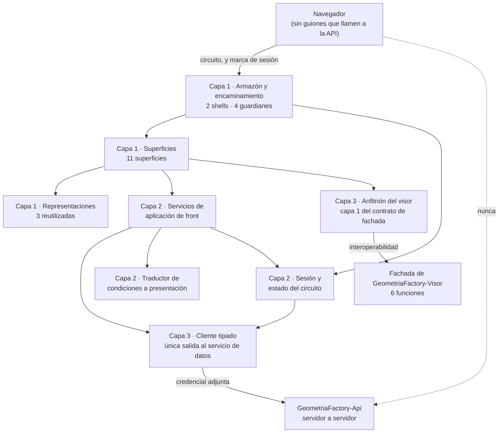
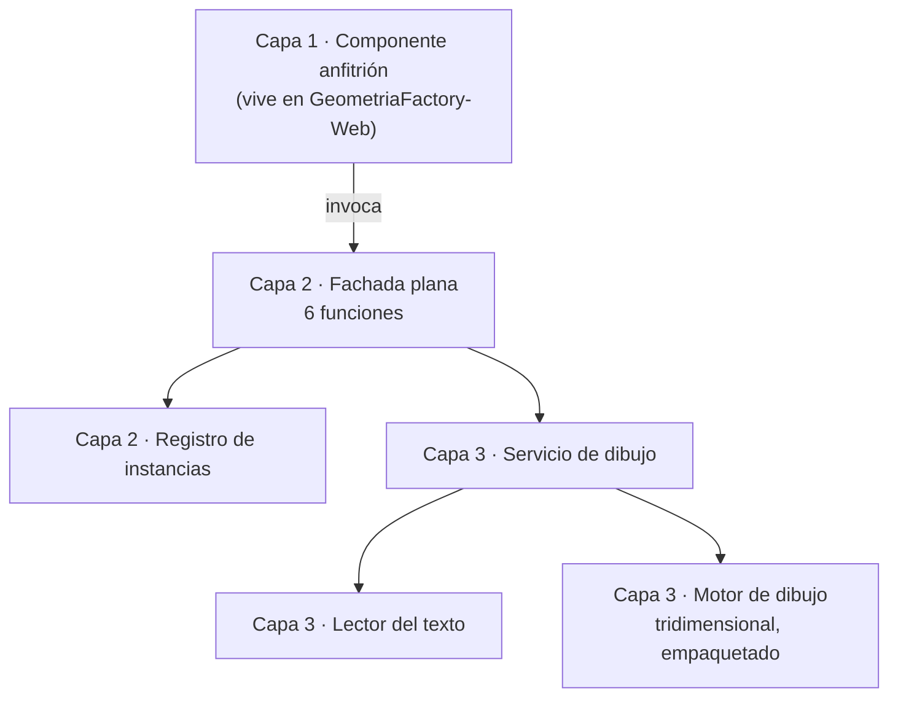

# Arquitectura de la unidad de entrega — GeometriaFactory-Web

**Producto:** Fábrica de Geometría
**Unidad de entrega:** GeometriaFactory-Web
**Documento:** Arquitectura-Unidad-Entrega.md
**Versión:** 3.6
**Estado:** Propuesto
**Fecha:** 2026-08-16
**`tipo_unidad_entrega` (D8):** `web-monolith`
**Proyectos de código que la componen:** `GeometriaFactory-Web`, `GeometriaFactory-Visor` y `GeometriaFactory-Contracts`
**Consolida a:** el documento homónimo de `GeometriaFactory-Visor`, por `Audit/Migracion-M10-Consolidacion-Fusion.md` 1.2 §4

---

## 0. Cómo leer este documento

**La unidad de entrega tiene un solo documento de esta clase**, y cada sección lleva **una subsección
por proyecto de código**, con su texto **transpuesto sin reescritura**.

**Las dos secciones de cada apartado son la del portal y la del bundle del visor.** Las dos declaran las mismas secciones: la unidad de entrega es una y el visor viaja adentro.

---

## 1. Objetivo

### 1.1 `GeometriaFactory-Web`

Documenta la arquitectura interna de `GeometriaFactory-Web`, la **pieza pública** del producto: el único punto de contacto del navegador y el anfitrión del bundle del visor. Declara sus componentes, cómo se reparten las **once** superficies, dónde vive la credencial de sesión, cómo se sostiene que **ningún guion del navegador invoque el servicio de datos** y qué pasa cuando algo se corta. Se dirige a quien implementa el front y a las categorías 06, 07, 08 y 09.

No documenta el diseño de las pantallas, que es de [`../03-UX-UI-DX/`](../03-UX-UI-DX/) y ya está emitido y validado contra una maqueta aprobada; ni las reglas del dominio, que viven en `GeometriaFactory-Domain`; ni la forma de los puntos de acceso del servicio, que es de `GeometriaFactory-Api`.

**Este proyecto de código es el lugar donde las tres reglas de arquitectura del producto se pueden violar.** Los otros seis las sostienen por construcción o no las alcanzan; acá hay navegador, hay guiones y hay una dirección de servicio que podría filtrarse en un mensaje. Por eso §10.4 no es una formalidad.

### 1.2 `GeometriaFactory-Visor`

Documenta la arquitectura interna de `GeometriaFactory-Visor`, el archivo de guion del visualizador tridimensional del producto: sus capas, su superficie de **seis** funciones, cómo se sostienen sus **siete** garantías y qué decisiones hacen que el motor de dibujo sea reemplazable sin tocar ninguna página. Se dirige a quien implementa el bundle y a las categorías 06, 08, 09 y 10.

Este proyecto de código es el único del producto fuera del ecosistema de los otros seis, y el único con `tiene_extensibilidad` == true: **el punto de extensión declarado del producto es el contrato de esta fachada** (`PRODUCT-INTAKE` §18).

## 2. Estilo arquitectónico

### 2.1 `GeometriaFactory-Web`

**Estilo elegido: monolito de presentación con render en el servidor y circuito interactivo, en tres capas internas, con un cliente tipado como única salida hacia el servicio de datos.** Es lo que `PRODUCT-INTAKE` §17.2.P.2 · GeometriaFactory-Web y §17.2.P.11 · GeometriaFactory-Web punto 1 declaran tomado aguas arriba, y lo registran [`ADR-10001`](Adrs/ADR-10001-Render-En-El-Servidor-Con-Circuito-Interactivo.md) y [`ADR-10004`](Adrs/ADR-10004-Tres-Capas-De-Presentacion.md).

Cinco propiedades estructurales lo concretan:

1. **La llamada al servicio de datos la hace el servidor de esta pieza, no el navegador.** Es lo que elimina contenido mixto, restricción de origen cruzado y exposición de la dirección del servidor propio, y es `RA-01` ([`ADR-10001`](Adrs/ADR-10001-Render-En-El-Servidor-Con-Circuito-Interactivo.md)).
2. **Sin estado propio y sin persistencia, y es deliberado.** No hay copia local, ni caché, ni réplica: cuando el servicio de datos no está, no hay nada que mostrar y se declara el estado degradado ([`ADR-10002`](Adrs/ADR-10002-Sin-Estado-Propio-Y-Sin-Persistencia.md)).
3. **La credencial de sesión vive en el estado del circuito, del lado del servidor, y nunca llega al navegador** ([`ADR-10003`](Adrs/ADR-10003-Credencial-De-Sesion-En-El-Estado-Del-Circuito.md)).
4. **Tres capas internas con dependencias unidireccionales**: superficies, servicios de aplicación de front, y las dos salidas —cliente tipado e interoperabilidad con la fachada del visor— ([`ADR-10004`](Adrs/ADR-10004-Tres-Capas-De-Presentacion.md)).
5. **El bundle del visor se opera exclusivamente por sus seis funciones**, y es esta pieza la que consulta el entorno del navegador y le manda el resultado ([`ADR-10006`](Adrs/ADR-10006-Aislamiento-Del-Visor-Tras-Su-Fachada.md)).

### 2.1 Alternativas descartadas

Las dos primeras las descarta el intake y esta categoría no las reabre; la tercera y la cuarta las evalúa y las descarta esta categoría.

| Alternativa | A favor | En contra | Resolución |
| --- | --- | --- | --- |
| Ejecutar la aplicación dentro del navegador, con las llamadas al servicio de datos hechas desde ahí | Menos carga en el servidor del hosting, sin circuito que sostener y sin reciclado de proceso que temer | **Reabre las tres propiedades de la topología** —contenido mixto, origen cruzado y exposición de la dirección del servidor propio— y obligaría a un certificado válido en un servidor de dirección dinámica | **Descartada** por `PRODUCT-INTAKE` §17.2.P.2 · GeometriaFactory-Web. Queda registrada como la **salida preferente** si `PT-01.b` o `PT-01.c` dan rojo |
| Servir el front desde el mismo contenedor del servidor propio | Un solo despliegue, sin hosting externo y sin subida por transferencia de archivos | Pierde el motivo por el que existe esta topología: el bloqueo desde la red de la facultad | **Descartada** por `PRODUCT-INTAKE` §17.2.P.2 · GeometriaFactory-Web |
| Un servicio de estado compartido en el servidor del front —caché de listados, sesión replicada— para sobrevivir al reciclado de proceso | Mitigaría `R-06`, que la fuente declara **sin mitigación en el código** | Convertiría a la pieza pública en un segundo lugar donde vive el dato del producto, que es exactamente lo que la topología evita, y abriría la pregunta de qué pasa cuando las dos copias difieren. Además el reciclado no avisa: la caché no sobreviviría igual | **Descartada** por esta categoría, ver [`ADR-10002`](Adrs/ADR-10002-Sin-Estado-Propio-Y-Sin-Persistencia.md) §4 |
| Guardar la credencial de sesión en el navegador, en almacenamiento propio o en una marca legible | Sobreviviría al reciclado del proceso del hosting y evitaría re-autenticar | Rompe el criterio de aceptación verificable de que **la credencial no aparece en el navegador**, y la pone al alcance de cualquier guion que se agregue después. Es la decisión más consecuente del producto en términos de lo que la persona puede observar | **Descartada** por esta categoría, ver [`ADR-10003`](Adrs/ADR-10003-Credencial-De-Sesion-En-El-Estado-Del-Circuito.md) §4 |

### 2.2 Qué heredan de los dos proyectos de código de nivel 0 y no se reabre

Este proyecto de código compila contra `GeometriaFactory-Contracts` y contra el bundle de `GeometriaFactory-Visor`. Las dos Fases C están emitidas, y cuatro de sus decisiones condicionan a ésta. **Se citan, no se rehacen.**

| Decisión del nivel 0 | Dónde está | Qué obliga acá |
| --- | --- | --- |
| Ningún tipo del contrato habilita a que el navegador invoque el servicio de datos: **todas** las solicitudes las arma el servidor de la unidad pública, **incluidas las que llevan credenciales en claro** | [`Contracts ADR-08004`](../../../Producto/Adrs/ADR-08004-Regla-De-Exposicion-De-La-Frontera.md) y su restricción `RT-11` | El canje, el cambio de contraseña y el reseteo salen del **servidor** de esta pieza. Ningún formulario los envía directo |
| La proyección de listado no lleva texto original, ni componentes, ni comentario; el detalle sí | [`Contracts ADR-08005`](../../../Producto/Adrs/ADR-08005-Proyeccion-De-Listado-Separada-Del-Detalle.md) | Los dos listados **no pueden** mostrar el comentario ni el texto: pedirlos obligaría a traer el detalle de cada fila. La categoría 03 ya diseñó con esa restricción |
| El bundle es un visualizador puro: **no hace red, no lee configuración y no conoce identidad**, y no consulta la preferencia de movimiento reducido | [`Visor ADR-12003`](Adrs/ADR-12003-Visualizador-Puro-Sin-Red-Ni-Identidad.md) | **Es esta pieza la que consulta el entorno del navegador** y le manda dos valores de verdad por `establecerMovimiento`. La ignorancia del bundle es una obligación de esta pieza, no una comodidad |
| La superficie del bundle son **seis** funciones planas bajo un nombre propio, y el componente anfitrión —capa 1— **vive en este proyecto de código** | [`Visor ADR-12002`](Adrs/ADR-12002-Superficie-De-Seis-Funciones-Planas.md) y [`Visor Arquitectura-Unidad-Entrega.md`](Arquitectura-Unidad-Entrega.md) §3.1 | El anfitrión es un componente **de esta** arquitectura, y su ciclo de vida —incluida la liberación— es responsabilidad de acá ([`ADR-10006`](Adrs/ADR-10006-Aislamiento-Del-Visor-Tras-Su-Fachada.md)) |

### 2.2 `GeometriaFactory-Visor`

**Estilo elegido: microkernel con fachada plana, en tres capas.** El núcleo es el servicio de dibujo, la fachada es su única puerta y el componente anfitrión vive fuera de este proyecto de código. `PRODUCT-INTAKE` §17.2.P.2 · GeometriaFactory-Visor declara las tres capas como obligatorias y como el motivo por el que la fachada existe; [`ADR-12001`](Adrs/ADR-12001-Tres-Capas-Con-Fachada-Plana.md) lo registra.

Cuatro propiedades estructurales lo concretan:

1. **Visualizador puro.** Sin red, sin persistencia, sin configuración propia y sin identidad. Es `RA-02`, y es lo que hace imposible violar `RA-01` desde el navegador ([`ADR-12003`](Adrs/ADR-12003-Visualizador-Puro-Sin-Red-Ni-Identidad.md)).
2. **Superficie de seis funciones planas y nada más**, que es todo lo que el anfitrión puede invocar ([`ADR-12002`](Adrs/ADR-12002-Superficie-De-Seis-Funciones-Planas.md)).
3. **El motor de dibujo tridimensional queda dentro de la capa 3 y empaquetado**, nunca expuesto al anfitrión y nunca traído desde una red de distribución externa ([`ADR-12004`](Adrs/ADR-12004-Motor-De-Dibujo-Empaquetado-Y-Aislado.md)).
4. **La disposición de cada pieza se deriva de su índice**, no de un ordenamiento aleatorio ([`ADR-12005`](Adrs/ADR-12005-Disposicion-Determinista-Derivada-Del-Indice.md)).

### 2.1 Alternativas descartadas

Las dos primeras las descarta el intake; la tercera la evalúa y la descarta esta categoría.

| Alternativa | A favor | En contra | Resolución |
| --- | --- | --- | --- |
| Portar el archivo del visualizador previo tal cual | Costo de trabajo casi nulo; ya funciona | Arrastraría **527 de 1101 líneas** de código inactivo —el **48 %**— más dos controles inoperantes, a un producto nuevo | **Descartada** por `PRODUCT-INTAKE` §17.2.P.2 · GeometriaFactory-Visor |
| Exponer el servicio de dibujo directamente al anfitrión, sin fachada | Una capa menos | Ataría las páginas a los nombres internos del motor de dibujo y lo volvería irreemplazable, que es exactamente lo contrario del punto de extensión que el producto declara | **Descartada** por `PRODUCT-INTAKE` §17.2.P.2 · GeometriaFactory-Visor |
| Una instancia global única en lugar de instancias identificadas | Firmas más cortas: ninguna función necesitaría identificador | Rompe la garantía **G-4** de aislamiento entre instancias, y con ella la posibilidad de tener dos escenas vivas en la misma página. Además haría que `destruir` fuera ambiguo | **Descartada** por esta categoría, ver [`ADR-12002`](Adrs/ADR-12002-Superficie-De-Seis-Funciones-Planas.md) §4 |

### 2.2 Nota de vocabulario técnico

Este documento nombra **el motor de dibujo tridimensional**, **el empaquetador** y **el archivo de guion** por su función y no por su producto, que es la convención que la categoría 02 y la 03 de este proyecto de código ya siguen. Los nombres concretos están declarados en `PRODUCT-INTAKE` §17.2.P.1 · GeometriaFactory-Visor y se anclan con su versión en la etapa que los introduce. La convención tiene una consecuencia útil además de la formal: **el motor es reemplazable por diseño**, y nombrarlo en cada documento haría más caro reemplazarlo.

## 3. Vista lógica

### 3.1 `GeometriaFactory-Web`

### 3.1 Componentes

Un componente es acá un módulo con responsabilidad cohesiva, no una página ni una clase. Los **ocho** cubren los diez casos de uso de la categoría 02 y las once superficies de la categoría 03.

| Componente | Capa | Responsabilidad | Entradas | Salidas | Dependencias |
| --- | --- | --- | --- | --- | --- |
| Armazón y encaminamiento | 1 | Los **dos** shells —acceso y trabajo—, el mapa de rutas y los **cuatro** guardianes: aprovisionamiento resuelto, sesión, papel y cambio de contraseña pendiente | Ruta pedida y estado de sesión | Superficie a mostrar, o desvío | Sesión y estado del circuito |
| Superficies | 1 | Las **once** superficies de la categoría 03, cada una con su nombre canónico, su mapa de estados y sus interacciones | Actos de la persona | Invocaciones a los servicios de aplicación de front | Servicios de aplicación de front, Representaciones, Armazón |
| Representaciones reutilizadas | 1 | Las **tres** piezas de presentación que varias superficies comparten: fila de trabajo con su insignia, lista de observaciones con el par declarado y derivado, y sello de versión | Datos ya traídos | Presentación consistente | Ninguna |
| Servicios de aplicación de front | 2 | Traducir un acto de la persona en una o más solicitudes al servicio de datos, componer el resultado para la superficie y decidir el estado a mostrar | Acto e identidad de la sesión | Datos compuestos, o condición ya traducida | Cliente tipado, Traductor de condiciones, Sesión |
| Sesión y estado del circuito | 2 | Custodiar la credencial de sesión **del lado del servidor** —en un almacén con alcance de aplicación, indexado por el identificador de la sesión—, resolver el papel vigente y **emitir y sostener la marca de sesión del navegador**: un identificador **opaco** con identidad y papel, `HttpOnly`, `Secure` y `SameSite=Strict`, que **no transporta la credencial** (`ADR-10003` §2 y §7). Y resolver el caso en que la marca sobrevive al reciclado del proceso y el almacén no, que es el estado «sesión no restablecible» de `ADR-10003` §6.1 | Resultado del canje, y la marca que el navegador presenta | Identidad de la sesión para el resto, y la credencial para el cliente tipado | Cliente tipado |
| Cliente tipado del servicio de datos | 3 | **La única salida** hacia el servicio de datos: arma la solicitud en el servidor, adjunta la credencial y devuelve el tipo del contrato o su tipo de error | Solicitud del servicio de aplicación | Tipo de transferencia, o el tipo de error del contrato | `GeometriaFactory-Contracts`, Configuración de la dirección |
| Traductor de condiciones a presentación | 2 | Convertir cada uno de los **diecisiete** códigos vivos del contrato en un mensaje de superficie, y **garantizar que ninguno lleve dirección de servicio, ruta de datos ni traza** | Tipo de error del contrato, o ausencia de respuesta | Mensaje de superficie con qué pasó, por qué y qué hacer | `GeometriaFactory-Contracts` |
| Anfitrión del visor | 3 | **Es la capa 1 del contrato de fachada del visor**: ciclo de vida de la instancia, referencia al elemento de dibujo, invocación de las **seis** funciones, controles de movimiento y consulta de la preferencia de movimiento reducido | Texto del trabajo, actos de la persona sobre la escena y el árbol | Invocaciones a la fachada, y su resultado de dibujo | Fachada de `GeometriaFactory-Visor`, y nada de su interior |

**Los ocho son internos.** Este proyecto de código **no expone contrato a nadie**: es hoja del grafo de dependencias y punto de entrada del usuario final (`PRODUCT-INTAKE` §14). Por eso esta sección no emite ningún `contratos-<area>.md`.

### 3.2 Regla de dependencias interna

Las flechas son unidireccionales y el grafo es acíclico. Cinco precisiones que la vista tiene que dejar dichas:

1. **Ninguna superficie invoca al cliente tipado.** Entre una superficie y la salida hay siempre un servicio de aplicación de front. Es lo que permite que una superficie se pueda maquetar y validar sin servicio de datos, y lo que ya hizo posible la Fase B2.
2. **Ninguna superficie invoca al interior del bundle.** Sólo el anfitrión del visor lo toca, y sólo por sus seis funciones. Ningún componente manipula el elemento de dibujo por su cuenta.
3. **El cliente tipado es la única salida.** Si aparece una segunda vía hacia el servicio de datos, `RA-01` deja de tener un lugar donde verificarse. El NFR de §8 lo cuenta.
4. **El traductor de condiciones no habla con el servicio de datos**: recibe el tipo de error ya traído. Es lo que permite ejercitarlo entero sin red.
5. **La flecha punteada del diagrama es la que nunca existe.** Se dibuja porque `RA-01` es una prohibición, y una prohibición que no se dibuja no se audita.

### 3.3 Cobertura de los diez casos de uso

| Componente | Casos de uso que cubre |
| --- | --- |
| Armazón y encaminamiento | CU-10002, CU-10003 —los guardianes de sesión y de cambio forzado—, CU-10004 FA-03 —el guardián de aprovisionamiento—, y **de forma transversal los diez**, porque toda superficie se alcanza por una ruta |
| Superficies | **Los diez**: CU-10001 a CU-10010, con el reparto de §3.4 |
| Representaciones reutilizadas | CU-10005, CU-10006, CU-10007, CU-10008, CU-10009, y el sello de versión en las once superficies |
| Servicios de aplicación de front | **Los diez**: ninguna superficie llega al servicio de datos sin pasar por acá |
| Sesión y estado del circuito | CU-10002, CU-10003, CU-10004, y **de forma transversal los diez** por el papel vigente |
| Cliente tipado del servicio de datos | CU-10001 a CU-10009. **CU-10010 no lo consume**: su superficie existe precisamente para cuando el cliente no obtiene respuesta |
| Traductor de condiciones a presentación | **Los diez**, y de manera decisiva CU-10010 |
| Anfitrión del visor | CU-10005 —previsualización previa al envío— y CU-10007 —vista de trabajo—, que son los **dos** casos de uso que consumen la fachada |

Los diez casos de uso tienen componente y ningún componente queda sin caso de uso.

### 3.4 Las once superficies contra el componente que las aloja

Las once filas están, sin agrupar. Son las de [`../03-UX-UI-DX/Experiencia-De-Uso.md`](../03-UX-UI-DX/Experiencia-De-Uso.md) §3.1 y de [`../03-UX-UI-DX/Linea-Base-Visual.md`](../03-UX-UI-DX/Linea-Base-Visual.md) §2; esta tabla no las rediseña: declara su shell, su caso de uso y qué componente de §3.1 la aloja.

| Superficie | Shell | Caso de uso origen | Consume el visor |
| --- | --- | --- | --- |
| `Aprovisionamiento-Inicial` | Acceso | CU-10004 FA-03 y FA-04 | No |
| `Registro-De-Cuenta` | Acceso | CU-10001 | No |
| `Ingreso` | Acceso | CU-10002 | No |
| `Credencial-Propia` | Acceso en establecimiento y en **cambio forzado**; trabajo en cambio voluntario | CU-10003 | No |
| `Panel-De-Trabajos-Del-Alumno` | Trabajo | CU-10006 | No |
| `Envio-De-Trabajo` | Trabajo | CU-10005 | **Sí**, en la previsualización |
| `Vista-De-Trabajo` | Trabajo | CU-10007 | **Sí**, con las seis funciones |
| `Resolucion-Del-Trabajo` | Trabajo, alojada en `Vista-De-Trabajo` | CU-10009 | No |
| `Panel-De-Cuentas` | Trabajo | CU-10004 flujo principal, FA-01, FA-02, FA-05, FA-06 y FA-07 | No |
| `Listado-De-La-Comision` | Trabajo | CU-10008 | No |
| `Estado-Degradado-Y-Reconexion` | **Los dos**, por superposición | CU-10010 | No |

**Las once son del componente Superficies**; la columna de shell dice cuál de los dos armazones las contiene, y la última cuáles pasan por el anfitrión del visor. **Sólo dos superficies de once tocan el bundle**, y eso es lo que hace que el aislamiento del visor sea barato de sostener.

### 3.2 `GeometriaFactory-Visor`

### 3.1 Componentes

Las capas 2 y 3 son de este proyecto de código. La capa 1, el componente anfitrión, **vive en `GeometriaFactory-Web`** y se declara acá porque el contrato la nombra como su actor primario.

| Componente | Capa | Responsabilidad | Entradas | Salidas | Dependencias |
| --- | --- | --- | --- | --- | --- |
| Componente anfitrión | 1, **fuera de este proyecto de código** | Ciclo de vida, referencia al elemento de dibujo, invocación de las seis funciones, controles de movimiento y consulta de la preferencia de movimiento reducido | Eventos de la persona y datos del backend | Invocaciones a la fachada | La fachada, y nada del interior |
| Fachada plana | 2 | Exponer las seis funciones, resolver el identificador de instancia y devolver resultados y condiciones | Las seis invocaciones | Identificador, resultado de dibujo, estado efectivo de los movimientos, condiciones | Registro de instancias, Servicio de dibujo |
| Registro de instancias | 2 | Asociar cada identificador con su instancia viva; invalidarlo al liberarla | Identificador | Instancia viva, o la condición `UNKNOWN_INSTANCE` | Ninguna |
| Lector del texto | 3 | Obtener del texto recibido las piezas, sus componentes y sus dimensiones, tolerando las variantes de clave del emisor | Texto del trabajo | Piezas legibles con su índice, y las no legibles con su condición | Ninguna |
| Servicio de dibujo | 3 | Escena, mallas, disposición, selección, encuadre, bucle de dibujo y liberación de recursos | Piezas legibles y órdenes de la fachada | Escena viva y resultado de dibujo | Lector del texto, Motor de dibujo |
| Motor de dibujo tridimensional | 3, **empaquetado** | Primitivas de escena, cámara, luces, geometrías y materiales | Órdenes del servicio de dibujo | Representación gráfica | Ninguna dentro del producto |

**La regla de dependencias es estricta y unidireccional**: la capa 1 no conoce el interior, la capa 2 no contiene lógica de dibujo y la capa 3 no conoce al anfitrión. El grafo es acíclico.

### 3.2 Cobertura de los siete casos de uso

| Componente | Casos de uso que cubre |
| --- | --- |
| Fachada plana | CU-12001 a CU-12007, los siete |
| Registro de instancias | CU-12001, CU-12005, y la resolución del identificador en CU-12002, CU-12003, CU-12004 y CU-12007 |
| Lector del texto | CU-12002 |
| Servicio de dibujo | CU-12001, CU-12002, CU-12003, CU-12004, CU-12005, CU-12007 |
| Motor de dibujo tridimensional | CU-12001, CU-12002, CU-12005 |

**CU-12006 es transversal**: recorre las seis funciones desde una página integradora sin backend, y por eso su componente es la fachada entera. Es además el sample S-1 del producto.

### 3.3 Qué se porta y qué no

El proyecto de código nace de un visualizador previo, y qué se conserva de él es una decisión arquitectónica y no de implementación. `PRODUCT-INTAKE` §17.2.P.2 · GeometriaFactory-Visor lo declara.

| Se porta | Con qué cambio |
| --- | --- |
| La construcción de objetos tridimensionales y sus funciones de creación por tipo | Reescritas en el lenguaje fuente del proyecto de código, dentro de la capa 3 |
| El árbol colapsable de la estructura del texto, que la fuente califica como el mejor recurso didáctico del visualizador previo | La fachada **devuelve la estructura**; la presentación del árbol es del anfitrión |
| La escena con luces y cámara orbital | Se conserva, y la órbita automática pasa a estar **gobernada** por la fachada (capacidad F-25) |

| No se porta | Motivo |
| --- | --- |
| Las cinco variantes comentadas de la función que procesa el conjunto de figuras, y las dos de la que ubica las piezas | Código inactivo: son parte del 48 % que el intake decide no arrastrar |
| La función de actualización del cilindro y los dos manejadores de alternar mallado y de centrar objetos | Referencian elementos de la página que no existen: son los dos controles inoperantes |
| Las tres bibliotecas de interfaz que el visualizador previo carga sin usar | Peso muerto, y además dependencias externas que este proyecto de código no necesita |
| El ordenamiento aleatorio de la disposición | **Se reemplaza** por posición derivada del índice ([`ADR-12005`](Adrs/ADR-12005-Disposicion-Determinista-Derivada-Del-Indice.md)) |

## 4. Vista de procesos

### 4.1 `GeometriaFactory-Web`

- **Un proceso, en el hosting público.** Es una de las dos unidades desplegables del producto. El navegador no ejecuta lógica de la aplicación: lo único que corre ahí es el dibujo del visor.
- **Un circuito interactivo por persona conectada**, sostenido sobre una conexión persistente con repliegue a un transporte de mayor latencia. El circuito **termina en el servidor de esta pieza**: no llega al servicio de datos.
- **El estado de la sesión vive en la memoria del servidor del hosting**, dentro del circuito. Es donde reside la credencial, y es también lo que se pierde cuando el proceso recicla.
- **La comunicación con el servicio de datos es petición-respuesta, servidor a servidor.** No hay sondeo, no hay conexión persistente hacia el backend y no hay actualización parcial iniciada por el servicio de datos.
- **El bucle de dibujo corre en el navegador, en un único hilo**, y no genera tráfico de circuito durante el gesto. El texto del trabajo viaja del servidor al navegador **una sola vez por trabajo**.
- **Terminación controlada de la instancia del visor.** La liberación se invoca al descartar el componente que la aloja, y **no es opcional**: sin eso, recorrer trabajos acumula contextos gráficos en el navegador.
- **Sin optimismo de interfaz.** Ninguna superficie muestra el resultado antes de la confirmación del servidor: adelantar un estado obligaría a retirarlo.
- **La reconexión y la indisponibilidad son dos tramos independientes** y no se mezclan: uno es el circuito que se cortó, el otro es el servicio de datos que no responde. Confundirlos es el error de lectura más probable de toda la pieza, y por eso son superficie propia.

### 4.2 `GeometriaFactory-Visor`

- **Un único hilo de ejecución**, el del navegador. No hay trabajo en segundo plano ni paralelismo.
- **Un bucle de dibujo por instancia viva**, que es lo que sostiene los dos movimientos automáticos de la capacidad F-25 y la interacción de rotar y acercar.
- **Dos condiciones de detención del bucle de movimiento**, declaradas en el contrato: mientras la persona arrastra la cámara, y mientras la superficie de dibujo no está visible. La primera evita pelearle el control a quien lo tomó; la segunda impide que un movimiento invisible siga consumiendo recursos.
- **La detención no cambia el estado gobernado.** El anfitrión no tiene que apagar su control porque el bucle se haya detenido solo.
- **Sin estado compartido entre instancias** (garantía G-4): dos instancias vivas no comparten escena, ni selección, ni disposición.
- **Terminación controlada** (garantía G-7): ninguna condición deja la instancia en estado indeterminado. O la operación surte efecto completo, o la instancia queda como estaba y la condición se informa por su código.
- **`destruir` corta el bucle.** Un bucle que sobreviviera a la liberación es exactamente la forma de degradación que el NFR de recorridos tiene que descartar.

## 5. Vista de despliegue

### 5.1 `GeometriaFactory-Web`

| Aspecto | Decisión |
| --- | --- |
| Unidad de despliegue | **Una propia**: la publicación de la aplicación en el hosting público, con dominio y transporte seguro. Es una de las **dos** unidades desplegables del producto |
| Qué viaja adentro | La aplicación, los tipos de `GeometriaFactory-Contracts` compilados, y **el bundle del visor como recurso estático generado**, que se copia al directorio de recursos estáticos y **nunca se edita a mano** |
| Runtime objetivo | Servidor del hosting público. **La versión de plataforma que soporta el hosting está [A VERIFICAR]**: es `PT-01.a`, y si no pasa la salida es **bajar la versión objetivo del front, no la del backend** —son dos artefactos independientes— |
| Runtime del navegador | Cualquiera con capacidad gráfica tridimensional y con conexión persistente o su repliegue. La fuente **no fija versiones mínimas**: el requisito se declara por capacidad y no por número, y sin capacidad gráfica el visor no es soportado —el resto del producto sigue disponible— |
| Dependencias de infraestructura | El servicio de datos, por dirección tomada de configuración. **Ninguna base de datos, ningún almacén de secretos propio y ningún servicio adicional** |
| Etapas del pipeline | Obtención del código → preparación de las dos cadenas de herramientas → instalación reproducible y empaquetado del bundle, con copia al directorio de recursos estáticos → publicación → inyección de la dirección del servicio de datos desde secretos → subida → **verificación de que la dirección pública responde** |
| Puertas bloqueantes | Construcción **sin advertencias**; **el bundle se genera en el mismo flujo y nunca se toma de un artefacto viejo**; y **el flujo no termina en la subida, termina comprobando que la dirección pública responde** —una subida que deja la aplicación caída y se reporta como exitosa es peor que una falla visible— |
| Disparo | Manual y por fusión a la rama principal, restringido a los cambios de este proyecto de código y del visor |
| Reversión | Volver a publicar desde la etiqueta anterior |
| Riesgo asumido | **La subida no es transaccional** (`R-03`): se despliega fuera del horario de uso |
| Publicación como paquete | No se publica: `redistribuible` es false |
| Sample propio | **Ninguno.** El guion de demostración de cada etapa, ejecutado en el navegador del equipo anfitrión, cumple ese papel (`PRODUCT-INTAKE` §16.1) |

### 5.2 `GeometriaFactory-Visor`

| Aspecto | Decisión |
| --- | --- |
| Unidad de despliegue | Ninguna propia. Su artefacto es **un archivo de guion generado**, que se copia al directorio de recursos estáticos de `GeometriaFactory-Web` y viaja dentro del despliegue de esa unidad |
| Runtime objetivo | El navegador, con capacidad gráfica tridimensional. Sin esa capacidad el visor **no es soportado**, y la fachada informa `GRAPHICS_CAPABILITY_MISSING` (`PRODUCT-INTAKE` §17.2.P.9 · GeometriaFactory-Visor) |
| Runtime de construcción | El entorno de ejecución de la cadena de herramientas del proyecto, sólo en tiempo de construcción: **en tiempo de ejecución no hay ninguno**, hay un archivo servido como recurso estático |
| Etapas del pipeline | Instalación reproducible de dependencias → empaquetado → copia al directorio de recursos estáticos del anfitrión (`PRODUCT-INTAKE` §17.2.P.8 · GeometriaFactory-Visor) |
| Puertas bloqueantes | El bundle se genera sin errores; **PT-03**, el motor de dibujo queda dentro del bundle y la página funciona sin acceso a redes de distribución externas; **PT-02**, el bundle carga en una página del anfitrión, `inicializar` crea la escena, `cargarJson` dibuja las tres figuras del escenario E-1 incluido el ortoedro, recorrer diez veces de ida y vuelta no degrada, y el árbol y la escena se sincronizan por índice |
| Ciclo corto de trabajo | Un guion propio genera sólo el bundle, para no encadenar la construcción del resto del producto en cada iteración sobre el visor |
| Publicación | No se publica en ningún repositorio de paquetes: `redistribuible` es false |
| Edición del artefacto | **Nunca a mano.** El bundle es un artefacto generado y reproducible |

## 6. Vista de datos

### 6.1 `GeometriaFactory-Web`

- **Sin persistencia, y es deliberado.** «El front no guarda estado propio: es exactamente el problema que la topología evita». Por eso **`Modelo-Datos-Logico.md` se omite**, y la omisión **no es la que la regla admite para el tipo `web-monolith`**: la regla lo marca obligatorio para este tipo D8, y se omite igual como **decisión técnica declarada**, registrada en [`ADR-10002`](Adrs/ADR-10002-Sin-Estado-Propio-Y-Sin-Persistencia.md). La categoría 02 lo pidió explícitamente en su §9 y ésta es la respuesta.
- **Sin caché y sin réplica.** No hay copia local de los datos: cuando el servicio de datos no está, no hay nada que mostrar y se declara el estado degradado. Es lo que hace que el listado vacío se distinga del fallo **por el tipo recibido y no por el conteo**.
- **Lo único que vive del lado del front es el estado del circuito**, en memoria del servidor del hosting, donde reside la credencial de sesión. El navegador conserva sólo una marca de sesión que **no la transporta**.
- **El texto original del trabajo se envía carácter por carácter tal como la persona lo pegó**, y no se reescribe en ningún punto del recorrido —ni al enviarlo, ni al mostrarlo, ni al pasarlo a la fachada del visor—.
- **Los dos listados usan la proyección y no el detalle**, de modo que no llevan texto original, ni componentes de pieza, ni comentario del administrador. Es la decisión de [`Contracts ADR-08005`](../../../Producto/Adrs/ADR-08005-Proyeccion-De-Listado-Separada-Del-Detalle.md), y esta pieza la consume sin invertirla.
- **Los veintinueve campos que la maqueta exhibe** están inventariados en [`../03-UX-UI-DX/Contrato-Datos-Maqueta.md`](../03-UX-UI-DX/Contrato-Datos-Maqueta.md), con su tipo, su ejemplo, sus superficies y su correspondencia con el modelo conceptual del dominio. **Esa correspondencia es la vista de datos de este proyecto de código** y esta sección no la duplica: la referencia.
- **Configuración, no datos.** El único parámetro configurable es la dirección del servicio de datos, que es configuración de entorno inyectada al publicar y **no** configuración que la persona fije: por eso ninguna superficie la dibuja, ni siquiera deshabilitada.

### 6.2 `GeometriaFactory-Visor`

- **Cero persistencia, y es prohibición explícita.** Garantía G-2: ninguna función guarda estado entre páginas ni escribe en el almacenamiento del navegador (`PRODUCT-INTAKE` §17.2.P.4 · GeometriaFactory-Visor). Por eso **`Modelo-Datos-Logico.md` se omite**.
- **El texto del trabajo es un dato de entrada opaco**: no se guarda, no se reescribe y no se pide por cuenta propia.
- **Estado en memoria, y sólo mientras la página vive**: por instancia, la escena, la disposición, la selección vigente, el resultado de dibujo y el estado de los dos movimientos.
- **Una asimetría deliberada del estado en memoria**: el estado de los movimientos **sobrevive a `cargarJson`**, porque cargar otro texto reemplaza el contenido dibujado y no el gobierno de la escena. La selección vigente y el resultado de dibujo, en cambio, se reemplazan.
- **La preferencia de quien mira no vive acá.** El anfitrión dibuja los controles, consulta la preferencia de movimiento reducido del sistema y conserva la elección; la fachada la recibe y la ejerce.
- **Seis tipos de pieza dibujables**: tres volumétricos y tres planos. Un tipo fuera de esos seis no se dibuja y queda enumerado con `NON_DRAWABLE_TYPE`.
- **El cero es una dimensión legible.** Lo que produce `UNREADABLE_DIMENSION` es la **ausencia** de la clave o del componente del que se lee la medida, nunca el valor que trae. El visualizador previo evaluaba la verdad del número y perdía la figura, que es lo que la garantía G-5 viene a impedir.

## 7. Cross-cutting concerns

### 7.1 `GeometriaFactory-Web`

Todas las decisiones transversales viven acá y no repartidas por superficie.

| Preocupación | Decisión | Fundamento |
| --- | --- | --- |
| Salida hacia el servicio de datos | **Una sola**, el cliente tipado, que arma la solicitud **en el servidor** y adjunta la credencial. Ningún guion del navegador la invoca | [`ADR-10001`](Adrs/ADR-10001-Render-En-El-Servidor-Con-Circuito-Interactivo.md); `RA-01` |
| Autenticación y custodia de la credencial | La credencial de sesión vive **en el estado del circuito, del lado del servidor**; el navegador conserva sólo una marca de sesión que no la transporta y que no es legible por guion | [`ADR-10003`](Adrs/ADR-10003-Credencial-De-Sesion-En-El-Estado-Del-Circuito.md) |
| Autorización | **Acá se acota lo que se ofrece, no se hace cumplir nada.** Ninguna ruta del panel es accesible sin sesión y un alumno con sesión no alcanza ninguna ruta de administrador; la verificación de pertenencia y de papel la hace el servicio de datos en cada solicitud. **La pieza pública no puede ser la última defensa de ninguna regla, porque el navegador no es confiable** | [`ADR-10003`](Adrs/ADR-10003-Credencial-De-Sesion-En-El-Estado-Del-Circuito.md); [`../02-Especificacion-Funcional/Especificacion-Funcional.md`](../02-Especificacion-Funcional/Especificacion-Funcional.md) §5 |
| Manejo de errores | **Un traductor único** convierte los **diecisiete** códigos vivos del contrato en mensaje de superficie con qué pasó, por qué y qué hacer. **Nunca una excepción sin manejar y nunca una pantalla rota** | [`ADR-10005`](Adrs/ADR-10005-Estado-Degradado-Como-Superficie.md) |
| Exposición de la infraestructura | **Ningún mensaje mostrado incluye una dirección de servicio interno, un nombre de archivo de datos ni una traza de la implementación.** El traductor es el único lugar por el que un mensaje llega a la persona, y por eso es también el único lugar donde esto se puede verificar | `RA-03`; [`ADR-10005`](Adrs/ADR-10005-Estado-Degradado-Como-Superficie.md) |
| Interoperabilidad con el bundle | **Exclusivamente por las seis funciones de la fachada**, desde el anfitrión del visor. Ningún componente accede al interior ni manipula el elemento de dibujo. **La preferencia de movimiento reducido la lee esta pieza** y la traduce a dos valores de verdad | [`ADR-10006`](Adrs/ADR-10006-Aislamiento-Del-Visor-Tras-Su-Fachada.md); `RA-02` |
| Configuración y secretos | La dirección del servicio de datos viene de configuración, **nunca embebida en el código**, y se inyecta al publicar desde secretos del repositorio. **La dirección real del servidor propio no se versiona** | [`ADR-10007`](Adrs/ADR-10007-Direccion-Del-Servicio-De-Datos-Desde-Configuracion.md) |
| Registro de eventos, trazas y métricas | **Ninguno propio.** `tiene_observabilidad_critica` es false y §17.2.P.10 · GeometriaFactory-Web no declara instrumentación: lo que la fuente sí exige es **manejo explícito** del cartel de reconexión y del estado degradado. Un registro del lado del front no tendría consumidor: no hay operador mirando el hosting | `PRODUCT-MANIFEST` §5; `PRODUCT-INTAKE` §17.2.P.10 · GeometriaFactory-Web |
| Accesibilidad | **Nivel AA de la pauta vigente es piso obligatorio, no mejora deseable**: es un producto educativo de una universidad pública. Todo estado se comunica por al menos **dos** canales, nunca sólo por color | [`../03-UX-UI-DX/Experiencia-De-Uso.md`](../03-UX-UI-DX/Experiencia-De-Uso.md) §5 |
| Internacionalización | Un solo idioma, sin infraestructura de traducción. Está desarrollado en 03 §6 y esta sección no lo reabre | [`../03-UX-UI-DX/Experiencia-De-Uso.md`](../03-UX-UI-DX/Experiencia-De-Uso.md) §6 |
| Vocabulario | «Vista» **no se reabre**: su polisemia está resuelta aguas arriba con forma calificada obligatoria. `Pendiente` va **siempre calificado** salvo en las enumeraciones del conjunto cerrado y en los identificadores literales. «Pieza» va calificada para las dos piezas desplegables. **El comentario del administrador no es una observación** | [`../03-UX-UI-DX/Glosario-UX.md`](../03-UX-UI-DX/Glosario-UX.md); [`../02-Especificacion-Funcional/Glosario-Funcional.md`](../02-Especificacion-Funcional/Glosario-Funcional.md) |

### 7.2 `GeometriaFactory-Visor`

| Preocupación | Decisión | Fundamento |
| --- | --- | --- |
| Red | **Cero peticiones**, y es la decisión que define al proyecto de código. Ni obtención de recursos, ni petición asincrónica, ni conexión persistente. Garantía G-1 | [`ADR-12003`](Adrs/ADR-12003-Visualizador-Puro-Sin-Red-Ni-Identidad.md) |
| Persistencia | **Cero escrituras** en el almacenamiento del navegador. Garantía G-2 | `PRODUCT-INTAKE` §17.2.P.4 · GeometriaFactory-Visor |
| Configuración | **Ninguna propia.** Todo lo que la instancia necesita llega por parámetro. Garantía G-3 | `PRODUCT-INTAKE` §17.2.P.3 · GeometriaFactory-Visor |
| Identidad y autorización | **Ninguna.** El bundle no sabe quién mira ni qué papel cumple, y no participa de ninguna decisión de autorización | `PRODUCT-INTAKE` §17.2.P.5 · GeometriaFactory-Visor |
| Manejo de errores | **Siete códigos de condición**, declarados una sola vez en [`../02-Especificacion-Funcional/Definicion-Contrato-De-Fachada.md`](../02-Especificacion-Funcional/Definicion-Contrato-De-Fachada.md) §6, que es su fuente única. Un código nuevo sólo puede nacer allá. Un **curso** nuevo se agrega como fila de curso y no como código | [`ADR-12002`](Adrs/ADR-12002-Superficie-De-Seis-Funciones-Planas.md) |
| Ausencia de fallo silencioso | **Toda pieza que no se dibuja queda enumerada** en el resultado de dibujo con su índice y su condición. Garantía G-5 | `Vision-Producto.md` §9 y NB-00006 |
| Registro de eventos y métricas | **Ninguno propio.** El bundle no instrumenta ni emite registros: hacerlo sería, en el mejor de los casos, escribir en la consola del navegador, y no aporta a ningún consumidor del producto | Derivado de G-1, G-2 y G-3 |
| Exposición de la infraestructura | **Ninguna posible.** El bundle no conoce ninguna dirección de servicio, de modo que no puede exponerla (`RA-03`) | [`ADR-12003`](Adrs/ADR-12003-Visualizador-Puro-Sin-Red-Ni-Identidad.md) |
| Vocabulario | «Pieza» en su forma desnuda designa cada figura del conjunto raíz del trabajo; «recorrido» se escribe siempre calificado | [`../02-Especificacion-Funcional/Especificacion-Funcional.md`](../02-Especificacion-Funcional/Especificacion-Funcional.md) §8 y [`../03-UX-UI-DX/Glosario-UX.md`](../03-UX-UI-DX/Glosario-UX.md) |

## 8. Quality attributes (NFR)

### 8.1 `GeometriaFactory-Web`

Los cuatro primeros son las **cuatro mediciones de `PT-01`**, que `PRODUCT-INTAKE` §17.2.P.10 · GeometriaFactory-Web declara como los requerimientos no funcionales de este proyecto de código y que se miden en la etapa `a`; esta tabla los toma como están y **no los redefine**. El quinto viene rotulado **[ASUNCIÓN]** en cuanto a expresarlo como puerta. Los demás los deriva esta categoría y se declaran como tales.

| NFR | Objetivo numérico | Mecanismo de medición | ADR relacionada |
| --- | --- | --- | --- |
| `PT-01.a` · El front publicado arranca y sirve la página inicial | Respuesta **200** en la dirección pública | Comprobación al final del flujo de publicación. Si no pasa, la salida es bajar la versión objetivo del front | [`ADR-10001`](Adrs/ADR-10001-Render-En-El-Servidor-Con-Circuito-Interactivo.md) |
| `PT-01.b` · Transporte del circuito | Semáforo: verde con conexión persistente; **amarillo aceptable** con el repliegue de mayor latencia, documentando la latencia percibida; rojo sin circuito. **Sólo el rojo obliga a cambiar el modelo de front** | Inspección del transporte negociado en la etapa `a` | [`ADR-10001`](Adrs/ADR-10001-Render-En-El-Servidor-Con-Circuito-Interactivo.md) |
| `PT-01.c` · Estabilidad del proceso | **20 minutos** de navegación continua sin que el proceso recicle el circuito, y reconexión funcional al cortar y restablecer la red | Recorrido cronometrado en la etapa `a`. **Es el peor escenario: no tiene mitigación en el código** (`R-06`) | [`ADR-10002`](Adrs/ADR-10002-Sin-Estado-Propio-Y-Sin-Persistencia.md) |
| `PT-01.d` · Salida hacia el backend | Una llamada de salud devuelve **datos reales** del servidor propio | Recorrido en la etapa `a`. Si no pasa, publicar el servicio de datos en un puerto convencional (`R-05`) | [`ADR-10007`](Adrs/ADR-10007-Direccion-Del-Servicio-De-Datos-Desde-Configuracion.md) |
| Pasos del guion de demostración | **100 %** de los pasos del guion de la etapa **y de todas las anteriores** se ejecutan y pasan antes del punto de control [ASUNCIÓN en cuanto a expresarlo como puerta; la regla acumulativa es de la fuente] | Ejecución del guion en el navegador del equipo anfitrión, bloqueante para el punto de control | [`ADR-10004`](Adrs/ADR-10004-Tres-Capas-De-Presentacion.md) |
| Peticiones del navegador hacia el servicio de datos | Exactamente **0** | Conteo en la pestaña de red durante un recorrido completo, **incluida la interacción con la escena y con los dos movimientos automáticos prendidos**, que es el peor caso declarado por la Fase C del visor | [`ADR-10001`](Adrs/ADR-10001-Render-En-El-Servidor-Con-Circuito-Interactivo.md) |
| Salidas del proyecto de código hacia el servicio de datos | Exactamente **1**, el cliente tipado, y **0** bibliotecas de guion agregadas que consulten servicios por su cuenta | Inspección del árbol de fuentes y de las dependencias de guion [derivado de `PRODUCT-INTAKE` §17.2.P.3 · GeometriaFactory-Web] | [`ADR-10001`](Adrs/ADR-10001-Render-En-El-Servidor-Con-Circuito-Interactivo.md) |
| Apariciones de la credencial de sesión en el navegador | Exactamente **0**, verificable con las herramientas de desarrollo | Inspección del almacenamiento, de las marcas de sesión y del contenido servido, en la etapa `c` | [`ADR-10003`](Adrs/ADR-10003-Credencial-De-Sesion-En-El-Estado-Del-Circuito.md) |
| Mensajes que exponen una dirección de servicio, una ruta de datos o una traza | Exactamente **0** sobre los **diecisiete** códigos vivos del contrato **y** sobre el camino de ausencia de respuesta | Inspección del traductor de condiciones, que es el único lugar por el que un mensaje llega a la persona [derivado de `RA-03`] | [`ADR-10005`](Adrs/ADR-10005-Estado-Degradado-Como-Superficie.md) |
| Tráfico de circuito durante la interacción con la escena | Exactamente **0**, y el texto del trabajo viaja del servidor al navegador **una sola vez por trabajo** | Conteo en la pestaña de red mientras se rota y se acerca | [`ADR-10006`](Adrs/ADR-10006-Aislamiento-Del-Visor-Tras-Su-Fachada.md) |
| Instancias del visor no liberadas | Exactamente **0** tras **10** recorridos de ida y vuelta entre trabajos, sin degradación | Puerta técnica `PT-02`, medida **con los dos movimientos prendidos**, que es su peor caso | [`ADR-10006`](Adrs/ADR-10006-Aislamiento-Del-Visor-Tras-Su-Fachada.md) |
| Invocaciones al interior del bundle | Exactamente **0**: **6 de 6** funciones de la fachada son la única vía, y **0** accesos al elemento de dibujo por fuera del anfitrión | Inspección del árbol de fuentes [derivado de `RA-02` y de `PRODUCT-INTAKE` §17.2.P.3 · GeometriaFactory-Web] | [`ADR-10006`](Adrs/ADR-10006-Aislamiento-Del-Visor-Tras-Su-Fachada.md) |
| Estados de la línea de base demostrados | **74 de 74** estados, **11 de 11** superficies, **73 de 73** componentes y **24 de 24** rutas de la línea de base visual aprobada | Las **61** filas de [`../08-Calidad-Y-Pruebas/Matriz-Sensado-Deriva.md`](../08-Calidad-Y-Pruebas/Matriz-Sensado-Deriva.md), verificadas al cierre de cada sprint de codificación | [`ADR-10004`](Adrs/ADR-10004-Tres-Capas-De-Presentacion.md) |
| Advertencias de construcción | Exactamente **0** | Etapa de construcción del flujo de publicación, puerta bloqueante | [`ADR-10007`](Adrs/ADR-10007-Direccion-Del-Servicio-De-Datos-Desde-Configuracion.md) |

**No hay NFR de cobertura de líneas, y la fuente lo declara así.** Este proyecto de código **no tiene proyecto de pruebas propio** en el árbol del repositorio: su verificación es el guion de demostración de cada etapa, acumulativo por la regla de no-regresión, más las pruebas de integración que ejercitan el servicio que consume. Si en alguna etapa se agregan pruebas automatizadas de componentes, su cobertura mínima se fija en ese momento.

**No hay umbral numérico de latencia de respuesta, y esta categoría no lo inventa.** La fuente declara puertas técnicas medidas y tolerancias percibidas —**400 ms** para abrir un listado y para abrir la vista de trabajo, según [`../03-UX-UI-DX/Experiencia-De-Uso.md`](../03-UX-UI-DX/Experiencia-De-Uso.md) §7— pero **esas tolerancias son de diseño de la espera, no compromisos de tiempo de respuesta**: dicen a partir de cuándo se muestra un indicador, no cuánto puede tardar el servidor. Fijar acá un tiempo de respuesta sería inventar un compromiso sobre un hosting cuya latencia la propia fuente declara incógnita. Queda como `PA-04` de §11, por el mismo criterio con el que la Fase C de `GeometriaFactory-Visor` dejó abierto su umbral de fluidez en lugar de inventarlo.

### 8.2 `GeometriaFactory-Visor`

Los seis primeros son las **seis propiedades transversales verificables** que [`../02-Especificacion-Funcional/Especificacion-Funcional.md`](../02-Especificacion-Funcional/Especificacion-Funcional.md) §6 declara como lugar único de su membresía, su umbral y **sus condiciones de medición**; esta tabla las toma como están y no las redefine. Los dos últimos los deriva esta categoría.

| NFR | Objetivo numérico | Mecanismo de medición | ADR relacionada |
| --- | --- | --- | --- |
| Cero red | Exactamente **0 peticiones** originadas por el archivo de guion | Conteo en la pestaña de red, **con los dos movimientos automáticos prendidos y sostenidos** —su peor caso— y también durante los gestos de rotar y acercar | [`ADR-12003`](Adrs/ADR-12003-Visualizador-Puro-Sin-Red-Ni-Identidad.md) |
| Cero persistencia | **0 claves** escritas en el almacenamiento del navegador, y ningún estado conservado entre páginas | Inspección del almacenamiento con cualquier estado de los movimientos; se comprueba además que recargar la página no repone la preferencia | [`ADR-12003`](Adrs/ADR-12003-Visualizador-Puro-Sin-Red-Ni-Identidad.md) |
| Se ejercita sin backend | Recorrido completo de las **seis** funciones con un texto pegado a mano y **0 servicios del backend disponibles** | Página integradora sin backend, que es el sample S-1 | [`ADR-12006`](Adrs/ADR-12006-Bundle-Generado-Y-Versionado-Del-Punto-De-Extension.md) |
| Disposición determinista | Dos procesados del mismo texto producen la **misma disposición**, comparable pieza por pieza | Comparación de dos procesados; **se compara posición, no orientación**, y la propiedad vale con cualquier estado de los movimientos | [`ADR-12005`](Adrs/ADR-12005-Disposicion-Determinista-Derivada-Del-Indice.md) |
| Liberación de recursos | **10 recorridos** de ida y vuelta entre trabajos sin degradación | Recorridos **con los dos movimientos prendidos**: un bucle de dibujo que sobreviviera a `destruir` es la forma de degradación que hay que descartar | [`ADR-12001`](Adrs/ADR-12001-Tres-Capas-Con-Fachada-Plana.md) |
| Ausencia de fallo silencioso | **100 %** de las piezas no dibujadas enumeradas con su índice y su condición, y **0** piezas que desaparezcan sin registro | Inspección del resultado de dibujo sobre los escenarios E-1 y E-7 | [`ADR-12002`](Adrs/ADR-12002-Superficie-De-Seis-Funciones-Planas.md) |
| Dependencias traídas de una red de distribución externa en tiempo de ejecución | Exactamente **0** | Puerta técnica **PT-03**: la página funciona sin acceso a redes externas [derivado por esta categoría del intake §15] | [`ADR-12004`](Adrs/ADR-12004-Motor-De-Dibujo-Empaquetado-Y-Aislado.md) |
| Superficie pública del bundle | Exactamente **6** funciones expuestas, bajo **1** nombre propio en el objeto global del navegador y **0** identificadores globales sueltos | Inspección del bundle generado [derivado por esta categoría del intake §17.2.P.2 · GeometriaFactory-Visor y P.11 punto 3] | [`ADR-12002`](Adrs/ADR-12002-Superficie-De-Seis-Funciones-Planas.md) |

**Por qué la propiedad de cero red declara sus condiciones de medición**, y por qué esta sección las repite en lugar de omitirlas: el umbral no cambia —sigue siendo exactamente 0— pero sin condiciones la prueba mediría el caso fácil. Los entornos de prueba automatizados suelen declarar preferencia de movimiento reducido; un anfitrión que la respeta arranca la instancia con los dos movimientos apagados, y una prueba escrita ahí quedaría en verde **sin haber ejercitado nunca el bucle de dibujo**, que es el caso donde una petición se colaría. Que la fachada **no consulte esa preferencia por su cuenta** (G-3) es lo que hace que la prueba pueda prenderlos aunque el entorno la declare.

**No hay NFR de latencia con umbral numérico.** La fuente declara «interacción fluida al rotar y acercar, sin tráfico de circuito durante el gesto» (`PRODUCT-INTAKE` §17.2.P.10 · GeometriaFactory-Visor) y no fija un valor. Esta categoría **no inventa uno**: lo deja como punto abierto PA-03 de §11, porque un umbral de cuadros por segundo inventado acá se propagaría a 08 como si fuera del producto.

## 9. Riesgos arquitectónicos

### 9.1 `GeometriaFactory-Web`

| Riesgo | Impacto | Probabilidad | Mitigación |
| --- | --- | --- | --- |
| Que aparezca un guion del navegador que llame al servicio de datos —una validación mientras se escribe, una actualización parcial, una biblioteca agregada que consulte por su cuenta— | **Muy alto**: reabre contenido mixto, restricción de origen cruzado y exposición de la dirección del servidor propio, y rompe `RA-01`, que es la regla que sostiene la topología entera | Media: es la forma habitual en que este defecto entra, y siempre por una comodidad de interfaz | NFR de **0** peticiones del navegador y de **1** sola salida (§8), con el conteo en la pestaña de red; y la regla de diseño de 03 de que **ninguna validación consulta al servidor mientras se escribe** |
| Que el proceso del hosting recicle y la persona pierda la sesión en mitad de un acto | Alto: es el peor escenario, y la fuente declara que **no tiene mitigación en el código** (`R-06`) | Media, y medida: es `PT-01.c` | No hay mitigación técnica que inventar. Lo que sí hay es tratamiento: el estado «sesión no restablecible» está diseñado como estado propio de la superficie de reconexión, y **el envío es la única acción de guardado**, de modo que un corte no deja un trabajo a medias |
| Que un mensaje mostrado a la persona lleve una dirección de servicio, una ruta de datos o una traza | Alto: viola `RA-03` y expone la topología, que es justamente lo que la partición del producto protege | Media: entra por el camino de excepción, que es el menos ensayado | Traductor de condiciones como **único** lugar por el que un mensaje llega a la persona, con su NFR de **0** en §8, y la regla de que ninguna excepción llega sin manejar |
| Que un componente termine tocando el interior del bundle porque la fachada no expone algo que una pantalla necesita | Alto: se pierde el punto de extensión declarado del producto y el motor de dibujo deja de ser reemplazable | Media: es la presión natural cuando una superficie necesita algo que las seis funciones no dan | [`ADR-10006`](Adrs/ADR-10006-Aislamiento-Del-Visor-Tras-Su-Fachada.md), el NFR de **0** invocaciones al interior, y el procedimiento que [`Visor Extensibilidad.md`](Extensibilidad.md) §5 declara para cuando falta algo en la fachada |
| Que la liberación de la instancia del visor no se invoque, y recorrer trabajos acumule contextos gráficos | Alto: degradación progresiva, que es lo que `PT-02` mide | Media: es la clase de omisión que no falla la primera vez | Restricción transversal `RT-05` de 02, que declara que **no es opcional**, y el NFR de 10 recorridos con los movimientos prendidos |
| Que una subida por transferencia de archivos deje la aplicación caída y se reporte como exitosa | Alto: el producto queda inaccesible sin que nadie se entere | Media: la subida **no es transaccional** (`R-03`) | La puerta que hace que el flujo **no termine en la subida sino en la comprobación de que la dirección pública responde**, y el despliegue fuera del horario de uso |
| Que un listado incorpore un campo del detalle «porque hace falta en la pantalla» y arrastre el texto completo de cada trabajo | Medio: el listado del administrador se vuelve pesado en el peor lugar | Alta: es la presión natural de la capa de presentación, y la Fase C de `GeometriaFactory-Contracts` ya la registró como riesgo de ese lado | [`Contracts ADR-08005`](../../../Producto/Adrs/ADR-08005-Proyeccion-De-Listado-Separada-Del-Detalle.md), que esta pieza consume sin invertir; y el diseño de 03, que ya ubicó el comentario **al abrir el trabajo** y no en el listado |

### 9.2 `GeometriaFactory-Visor`

| Riesgo | Impacto | Probabilidad | Mitigación |
| --- | --- | --- | --- |
| Que aparezca una petición de red en el bundle, por comodidad o por una dependencia que la haga por dentro | Muy alto: reabre contenido mixto, restricción de origen cruzado y exposición de la dirección del servidor propio, y rompe `RA-01` a través de `RA-02` | Baja para la primera causa, **media para la segunda** | Puerta verificable por inspección: cero ocurrencias de las tres formas de petición en el código fuente **y en el bundle generado**; más el conteo en la pestaña de red con los movimientos prendidos |
| Que el anfitrión termine dependiendo de nombres internos del motor de dibujo, y el motor deje de ser reemplazable | Alto: se pierde el punto de extensión declarado del producto | Media: es la presión natural cuando una pantalla necesita algo que la fachada no expone | [`ADR-12001`](Adrs/ADR-12001-Tres-Capas-Con-Fachada-Plana.md) y [`Extensibilidad.md`](Extensibilidad.md) §5, que declara qué se hace cuando falta algo en la fachada |
| Que un bucle de dibujo sobreviva a `destruir` y se acumule al recorrer trabajos | Alto: degradación progresiva, que es lo que `PT-02` mide | Media | NFR de liberación de recursos medido **con los movimientos prendidos**, que es su peor caso |
| Que la versión del motor de dibujo que se ancle exija una interfaz distinta de la del visualizador previo | Medio: retrabajo acotado a la capa 3 | Alta: el intake ya lo anticipa, porque el visualizador previo reimplementa la cámara orbital a mano por una carencia de su versión | [`ADR-12004`](Adrs/ADR-12004-Motor-De-Dibujo-Empaquetado-Y-Aislado.md), que confina el motor a la capa 3, y el anclaje explícito de versión que el producto exige |
| Que una pieza deje de dibujarse sin quedar enumerada | Alto: es exactamente el defecto original que NB-00006 viene a cerrar | Baja | Garantía G-5 y NFR de ausencia de fallo silencioso, con los escenarios E-1 y E-7 como material |
| Que se acuñe un código de condición aguas abajo, fuera de la categoría 02 | Medio: el conjunto deja de ser cerrado y 03 y 08 se desincronizan | Media: el catálogo de 03 ya creció de doce a trece entradas **sin** que creciera el conjunto de códigos, y esa distinción es fácil de perder | Regla declarada: los códigos son siete, su fuente única es el contrato de fachada, y un curso nuevo es fila de curso y no código |

## 10. Trazabilidad

### 10.1 `GeometriaFactory-Web`

### 10.1 Componente contra caso de uso

| Dimensión | Referencia |
| --- | --- |
| CU cubiertos | CU-10001 a CU-10010, los **diez** de [`../02-Especificacion-Funcional/Especificacion-Funcional.md`](../02-Especificacion-Funcional/Especificacion-Funcional.md) §3 |
| NB que sostiene | NB-00001 a NB-00009, **las nueve**. Ninguna queda sin caso de uso acá, y el grado en que esta pieza sostiene cada una está declarado en [`../02-Especificacion-Funcional/Especificacion-Funcional.md`](../02-Especificacion-Funcional/Especificacion-Funcional.md) §4.1 |
| Superficies | Las **once** de 03, con el reparto de §3.4 |
| RN aplicables | RN-10001 a RN-10016, las **dieciséis**, con el reparto de §10.3. **Ninguna se hace cumplir acá**: esta pieza acota lo que ofrece |
| Restricciones transversales | RT-01 a RT-13, las **trece**, con el reparto de §10.2 |
| ADRs que lo gobiernan | ADR-10001, ADR-10002, ADR-10003, ADR-10004, ADR-10005, ADR-10006, ADR-10007 |
| Contratos que expone | **Ninguno.** Es hoja del grafo y no expone contrato a nadie. Los contratos que **consume** son el de `GeometriaFactory-Contracts` y el de la fachada de `GeometriaFactory-Visor` |
| Tests previstos en 08 | El guion de demostración de cada etapa, acumulativo; las **61** filas de la matriz de sensado de deriva; el conteo de peticiones del navegador; la inspección de la credencial en el navegador; la inspección del traductor sobre los diecisiete códigos; las puertas `PT-01`, `PT-02` y `PT-03` |

### 10.2 Las trece restricciones transversales contra la decisión que las sostiene

Las trece filas están, `RT-01` a `RT-13`, sin agrupar. Son las de [`../02-Especificacion-Funcional/Especificacion-Funcional.md`](../02-Especificacion-Funcional/Especificacion-Funcional.md) §6, y esta tabla declara qué componente y qué ADR las materializan.

| Restricción | Qué exige, en una línea | Componente que la sostiene | ADR |
| --- | --- | --- | --- |
| RT-01 | Ninguna llamada al servicio de datos se origina en el navegador | Cliente tipado, como única salida | ADR-10001 |
| RT-02 | La credencial de sesión vive en el estado del circuito y no aparece nunca en el navegador | Sesión y estado del circuito | ADR-10003 |
| RT-03 | Ningún mensaje mostrado incluye dirección de servicio, nombre de archivo de datos ni traza | Traductor de condiciones a presentación | ADR-10005 |
| RT-04 | El bundle se invoca exclusivamente por sus **seis** funciones | Anfitrión del visor | ADR-10006 |
| RT-05 | La liberación de la instancia se invoca al descartar el componente que la aloja, y **no es opcional** | Anfitrión del visor | ADR-10006 |
| RT-06 | La pieza pública **no guarda estado propio**: ni copia local, ni caché, ni réplica | Servicios de aplicación de front | ADR-10002 |
| RT-07 | La indisponibilidad se presenta como **estado degradado explícito**, y el listado vacío se distingue del fallo **por el tipo recibido y no por el conteo** | Traductor de condiciones, Superficies | ADR-10005 |
| RT-08 | El texto original se envía carácter por carácter y no se reescribe en ningún punto del recorrido | Servicios de aplicación de front | ADR-10002 |
| RT-09 | Ninguna ruta del panel es accesible sin sesión, y un alumno con sesión no alcanza ninguna ruta de administrador. **Acota lo que se ofrece**; quien lo hace cumplir es el servicio de datos | Armazón y encaminamiento | ADR-10003 |
| RT-10 | Sin tráfico de circuito durante la interacción con la escena, y el texto viaja **una sola vez por trabajo** | Anfitrión del visor | ADR-10006 |
| RT-11 | Sin capacidad gráfica tridimensional la escena no es soportada, y **el resto del producto sigue disponible** | Anfitrión del visor, Superficies | ADR-10006 |
| RT-12 | Una cuenta con cambio de contraseña pendiente no llega a ninguna ruta que no sea el cambio de su propia contraseña, **y llega ahí sin sesión de trabajo** | Armazón y encaminamiento, con su cuarto guardián | ADR-10003 |
| RT-13 | El anfitrión gobierna los dos movimientos automáticos mandando **dos valores de verdad**, y el bundle no consulta nada: **la preferencia de movimiento reducido la lee esta pieza** | Anfitrión del visor | ADR-10006 |

### 10.3 Las dieciséis reglas contra este proyecto de código

Este proyecto de código **no hace cumplir ninguna regla de negocio, y no es una omisión sino la decisión declarada en la categoría 02**: el navegador no es confiable, de modo que ocultar un control, no armar una ruta o no ofrecer una acción **acotan lo que se ofrece y no hacen cumplir nada**. Lo que esta tabla declara es qué hace esta pieza por cada regla, que es una cosa distinta. Las dieciséis filas están; ninguna se agrupa.

| Regla | Qué hace esta pieza por ella | Superficie donde se observa |
| --- | --- | --- |
| RN-10001 Administrador único y papeles fijos | Ofrece el aprovisionamiento **una sola vez en la vida de la instancia** y deja de armar el formulario para siempre; y no dibuja el destino del otro papel en ninguna barra lateral, ni siquiera deshabilitado | `Aprovisionamiento-Inicial`, y los dos shells |
| RN-10002 Correo del alumno único | Presenta el rechazo del registro con un correo ya usado como error de operación, sin revelar de quién es | `Registro-De-Cuenta` |
| RN-10003 Trabajo ajeno indistinguible de inexistente | Presenta el trabajo ajeno y el identificador inexistente con **el mismo mensaje**, y verifica la acotación **forzando la solicitud sin pasar por la pantalla** | `Vista-De-Trabajo`, `Panel-De-Trabajos-Del-Alumno` |
| RN-10004 Eliminación acotada al borrador | **No dibuja el control** de eliminar cuando el estado no lo admite, en lugar de dibujarlo inhabilitado | `Panel-De-Trabajos-Del-Alumno`, `Resolucion-Del-Trabajo` |
| RN-10005 No se pasa a estado `Pendiente` con errores de validación | Presenta el estado resultante del envío con sus observaciones, y declara que la previsualización **dibuja y no verifica** | `Envio-De-Trabajo` |
| RN-10006 Cuenta `Pendiente` o `Bloqueado` sin acceso | Muestra el motivo de la situación de la cuenta al intentar ingresar, sin sesión | `Ingreso` |
| RN-10007 Baja con arrastre y confirmación escrita | Exige el correo escrito como confirmación en la superficie, y declara antes del intento qué se va a arrastrar | `Panel-De-Cuentas` |
| RN-10008 Texto original conservado íntegro | Envía el texto **carácter por carácter** tal como la persona lo pegó, y lo muestra sin reescribirlo | `Envio-De-Trabajo`, `Vista-De-Trabajo` |
| RN-10009 Observación de error con posición y campo | Presenta cada observación con su índice de figura y su campo señalado, y **nunca** mezcla las piezas no dibujadas con las observaciones | `Vista-De-Trabajo`, `Envio-De-Trabajo` |
| RN-10010 Desenlace exclusivo del administrador y terminalidad | No ofrece salida de los dos estados terminales a ningún papel, y aloja el bloque de decisión sólo cuando quien mira es el administrador y el trabajo está en estado `Pendiente` | `Resolucion-Del-Trabajo` |
| RN-10011 El administrador no ve los borradores | No los pide: el listado de la comisión se trae ya acotado, y pedir un borrador por dirección directa devuelve «no encontrado» | `Listado-De-La-Comision` |
| RN-10012 El reseteo conserva la cuenta y sus trabajos | Declara en la superficie, **antes del intento**, que el reseteo no pierde ningún trabajo, que es lo que corrige la fricción más cara que el producto tenía | `Panel-De-Cuentas`, `Ingreso` |
| RN-10013 Cambio forzado antes de toda otra capacidad | El **cuarto guardián**: mientras la marca esté puesta, la única ruta alcanzable es el cambio de la propia contraseña, y se llega **sin sesión de trabajo**, en el shell de acceso y sin barra lateral | `Credencial-Propia`, curso de cambio forzado |
| RN-10014 La provisoria la produce el sistema | **Ningún campo de contraseña en el formulario de reseteo**, y la provisoria producida se le muestra al administrador para que la comunique | `Panel-De-Cuentas` |
| RN-10015 Resetear no exige cuenta habilitada | **Por ausencia**: la superficie no condiciona la operación de reseteo al estado de la cuenta y no declara ningún motivo por ese concepto | `Panel-De-Cuentas` |
| RN-10016 Habilitar produce la provisoria | Muestra la provisoria **también al habilitar**, con el mismo tratamiento que en el reseteo, y por eso el curso de primer ingreso recorre **el mismo formulario de tres campos** que los otros dos | `Panel-De-Cuentas`, `Credencial-Propia` |

### 10.4 Las tres reglas de arquitectura del producto

| Regla | Enunciado | Cómo la trata este proyecto de código |
| --- | --- | --- |
| **RA-01** | Ningún JavaScript del navegador invoca la API | **Es la regla que este proyecto de código tiene que sostener activamente**, y el único del producto que puede violarla: es el que sirve el navegador. Se sostiene con una sola salida —el cliente tipado, que arma la solicitud en el servidor—, con la prohibición de agregar bibliotecas de guion que consulten servicios por su cuenta, y con el conteo de **0** peticiones del navegador |
| **RA-02** | El bundle del visor es un visualizador puro: sin configuración, sin red, sin conocimiento del sistema | **La sostiene desde el otro lado.** La pureza del bundle es una propiedad suya, pero **es esta pieza la que la hace posible**: consulta el entorno del navegador, lee la preferencia de movimiento reducido, la traduce a dos valores de verdad y se los manda. Si esta pieza dejara de hacerlo, el bundle tendría que consultar, y ahí `RA-02` se rompería |
| **RA-03** | Todo llega al navegador a través del front y ningún mensaje expone direcciones de servicios internos | **Es suya en las dos mitades.** La primera: descargas, archivos, imágenes y redirecciones se sirven desde el dominio del front, que a su vez los pide al servicio de datos con el cliente tipado. La segunda: **ningún mensaje mostrado incluye una dirección de servicio interno**, y el traductor de condiciones es el único lugar por el que un mensaje llega a la persona, lo que la hace verificable en un solo punto |

### 10.2 `GeometriaFactory-Visor`

### 10.1 Componente contra caso de uso

| Dimensión | Referencia |
| --- | --- |
| CU cubiertos | CU-12001 a CU-12007, los siete de [`../02-Especificacion-Funcional/Especificacion-Funcional.md`](../02-Especificacion-Funcional/Especificacion-Funcional.md) §3 |
| NB que sostiene | **NB-00006**, que es su necesidad, y **NB-00004** parcialmente, sólo en la parte de que las piezas se dibujen |
| RN aplicables | **Ninguna.** Un visualizador puro no tiene reglas de dominio: las decide el backend. Lo que tiene son condiciones de contrato, que no son reglas de negocio |
| ADRs que lo gobiernan | ADR-12001, ADR-12002, ADR-12003, ADR-12004, ADR-12005, ADR-12006 |
| Contratos que expone | [`Contratos-Abstractions.md`](Contratos-Abstractions.md), y el punto de extensión en [`Extensibilidad.md`](Extensibilidad.md) |
| Tests previstos en 08 | Verificación de las **siete** garantías; las **seis** propiedades transversales con sus condiciones de medición; los escenarios **E-1** y **E-7** como material de dibujo; y las dos puertas técnicas `PT-02` y `PT-03` |

### 10.2 Las siete garantías contra el componente que las sostiene

Las siete filas están, `G-1` a `G-7`, sin agrupar. Son las de [`../02-Especificacion-Funcional/Definicion-Contrato-De-Fachada.md`](../02-Especificacion-Funcional/Definicion-Contrato-De-Fachada.md) §3.2, y esta tabla declara qué componente las sostiene y qué ADR las gobierna.

| Garantía | Enunciado, en una línea | Componente que la sostiene | ADR |
| --- | --- | --- | --- |
| G-1 · Cero red | Ninguna función ni ningún movimiento origina una petición | Todos, por ausencia; se verifica sobre el bundle entero | ADR-12003 |
| G-2 · Cero persistencia | Ninguna función escribe en el almacenamiento del navegador | Todos, por ausencia | ADR-12003 |
| G-3 · Sin configuración propia | Todo lo que la instancia necesita llega por parámetro | Fachada plana | ADR-12002, ADR-12003 |
| G-4 · Aislamiento entre instancias | Dos instancias vivas no comparten escena, ni selección, ni disposición | Registro de instancias, Servicio de dibujo | ADR-12002 |
| G-5 · Sin fallo silencioso | Toda pieza no dibujada queda enumerada con su índice | Lector del texto, Servicio de dibujo | ADR-12002 |
| G-6 · Determinismo | La misma entrada produce la misma **posición** de cada pieza, no la misma orientación | Servicio de dibujo | ADR-12005 |
| G-7 · Terminación controlada | O la operación surte efecto completo, o la instancia queda como estaba | Fachada plana | ADR-12002 |

**Las siete garantías son parte del contrato, no detalles de implementación**: perder cualquiera es cambio mayor aunque las seis firmas no se toquen.

### 10.3 Las tres reglas de arquitectura del producto

| Regla | Enunciado | Cómo la trata este proyecto de código |
| --- | --- | --- |
| **RA-01** | Ningún JavaScript del navegador invoca la API | **No la alcanza directamente y la sostiene por construcción.** Este proyecto de código es el JavaScript del navegador del producto, y al no hacer red no puede invocar nada. Su contribución a la seguridad es **negativa por diseño** |
| **RA-02** | El bundle del visor es un visualizador puro: sin configuración, sin red, sin conocimiento del sistema | **Es su regla.** La materializan las garantías G-1, G-2 y G-3 y las siete prohibiciones del contrato de fachada. **La sexta función no la afloja**: el anfitrión pasa dos valores de verdad, y el bundle no consulta la preferencia de movimiento reducido ni conserva la elección |
| **RA-03** | Todo llega al navegador a través del front y ningún mensaje expone direcciones de servicios internos | **La cumple por ignorancia, no por disciplina**: el bundle no conoce ninguna dirección de servicio, así que ninguna de sus siete condiciones puede exponerla. Se declara para que no deje de ser cierto si alguna vez se le pasara una por parámetro |

## 11. Puntos abiertos

### 11.1 `GeometriaFactory-Web`

> **Correspondencia con `Root-Rules.md` §12.2.** La columna **`Punto abierto`** realiza sus campos
> **1 · qué falta** —el enunciado en negrita— y **2 · por qué no se puede hoy** —el desarrollo que
> sigue—; **`Quién lo cierra`** realiza el campo 3 y **`En qué evento se cierra`** el campo 4.
> **`Estado` no es un campo de §12.2**: deriva de su tabla de escalamiento y se declara como tal.

| Id | Punto abierto | Quién lo cierra | En qué evento se cierra (artefacto y sección) | Estado |
| --- | --- | --- | --- | --- |
| PA-01 | La **versión exacta de la biblioteca de componentes de interfaz**. La fuente la deja explícitamente **[A VERIFICAR]** y declara que se ancla al crear el andamiaje y se registra en ese momento | El equipo, al crear el andamiaje | `src/GeometriaFactory.Web/GeometriaFactory.Web.csproj`, apartamiento declarado | **Cerrado** el 2026-08-20 · **A2b, por lectura**: **no hay biblioteca, y es una decisión** — el `.csproj` declara que *«la etapa `b` decide NO INTRODUCIR MudBlazor»* |
| PA-02 | La **versión de plataforma que soporta el hosting**, **[A VERIFICAR]** en la fuente. Es `PT-01.a`, y si no pasa la salida es bajar la versión objetivo del front y no la del backend | La medición de `PT-01.a` | [`../../../00-Contexto/Roadmap-Producto.md`](../../../00-Contexto/Roadmap-Producto.md) §2.1, **fase `i` · Despliegue real**, que es donde `PT-05` se mide contra el hosting real | **Vigente, y su evento reasignado el 2026-08-27** por el parche `P-06` de la mesa (hallazgo `H-05`). **No es una decisión y por eso nunca pudo cerrarse en la etapa `a`**: la fuente la rotula `[A VERIFICAR]`, y `A3-Decisiones-Del-Product-Owner.md` §4 declara que las marcas `[A VERIFICAR]` **se resuelven midiendo, no decidiendo**. El evento pasa del punto de control de la etapa `a` —cerrado el 2026-08-13 sin registrarla— a la **fase `i`**, que es la que la contesta y **no ocurrió**. Deja de estar vencida |
| PA-03 | **RESUELTO.** El **formato de intercambio y su configuración**. Esta categoría declaró que **no se puede decidir de un solo lado** y que la decisión pertenece al productor, la categoría 05 de `GeometriaFactory-Api`, «al emitirse». **Esa categoría está emitida y la tomó**: [`Api ADR-00002`](../../GeometriaFactory-Api/05-Arquitectura-Tecnica/Adrs/ADR-00002-Formato-De-Intercambio-Y-Su-Configuracion.md) §2 fija **seis reglas de formato que obligan a los dos extremos** —nombres literales, conjuntos cerrados por nombre, nulos emitidos, decimales sin cultura, lectura estricta y un único límite de tamaño de cuerpo que rechaza y nunca trunca— y declara que la coincidencia la verifica la batería de integración contra el servicio real. **Esta pieza la adopta, que es exactamente lo que esta fila comprometía** | **Cerrado** por la categoría 05 de `GeometriaFactory-Api`, con esta pieza como consumidor | **Resuelto** en `Api ADR-00002`, 2026-08-10 — **identificador corregido el 2026-08-27** por el parche `P-03` de la mesa (hallazgo `H-03`): decía `ADR-10002`, que existe y es otro (`ADR-10002 · Sin estado propio y sin persistencia`, de esta misma unidad), mientras el enlace de la columna anterior ya apuntaba al correcto | **Cerrado** |
| PA-04 | El **umbral numérico de tiempo de respuesta**. Ninguna fuente lo declara: lo que hay son puertas técnicas medidas y **tolerancias percibidas de 400 ms** que dicen a partir de cuándo se muestra un indicador, no cuánto puede tardar el servidor. Esta categoría **no inventa uno**, porque un valor puesto acá se propagaría a 08 como si fuera del producto | El Product Owner, o la categoría 08 al fijar su guion de medición, después de `PT-01` | [`../../../../../changelog.md`](../../../../../changelog.md), etapa `a` § «Decidido en esta etapa, y elevado al punto de control» | **VENCIDO.** La etapa `a` cerró el **2026-08-13** y el punto sigue abierto |
| PA-05 | El **punto de quiebre principal en 768 px** y la **proporción próxima a 4:3 de la escena**, los dos rotulados **[ASUNCIÓN]** por la categoría 03 y sujetos a la validación visual. La maqueta se aprobó, de modo que quedaron ejercidos; lo que sigue abierto es si se confirman como valores del producto | El Product Owner sobre la línea de base visual | `src/GeometriaFactory.Web/wwwroot/css/app.css`, versión angosta | **Cerrado** el 2026-08-20 · **A2b, por lectura**: el `@media (max-width: 768px)` está escrito, con la marca `[ASUNCIÓN de 03]` al lado |
| PA-06 | El **volumen de la comisión**, **[A VERIFICAR]**: el diseño de los dos listados supone decenas y no cientos, y por eso **no incorpora paginación**. Si resultara mucho mayor, la superficie afectada es `Listado-De-La-Comision` y el cambio es acotado | El Product Owner | **Decisión del Product Owner, 2026-08-20** · `Audit/A3-Decisiones-Del-Product-Owner.md` `D5` | **Cerrado por INCOGNOSCIBLE** el 2026-08-20 · El Product Owner declara que **el dato no se sabe ni se puede saber de antemano**. No se fija número. **Consecuencia declarada**: el caudal de **20 pet/min** de `05` §8 pierde su fundamento —se derivaba de «una comisión operando durante una clase»— y queda **provisorio hasta que `PT-05` lo mida sobre el uso real** |
| PA-07 | **RESUELTO.** Si el **bundle generado se versiona en el repositorio o se ignora**. La categoría 05 de `GeometriaFactory-Visor` lo derivó a 09 y alcanzaba a esta pieza porque el bundle vive en su directorio de recursos estáticos. **09 está emitida y lo cerró**: [`../../GeometriaFactory-Visor/09-Devops/Entornos-Deploy.md`](../09-Devops/Entornos-Deploy.md) §2 decide que **el bundle no se versiona; se ignora y lo genera la canalización antes de publicar**, y [`../09-Devops/Entornos-Deploy.md`](../09-Devops/Entornos-Deploy.md) §2 **adopta la decisión desde el lado del anfitrión sin reabrirla** y resuelve su consecuencia operativa | **Cerrado** por la categoría 09 de `GeometriaFactory-Visor`, adoptado por la 09 de este proyecto de código | **Resuelto** el 2026-08-11, al emitirse las dos categorías 09 | **Cerrado** |

**Siete filas: cinco abiertas —`PA-01`, `PA-02`, `PA-04`, `PA-05` y `PA-06`— y dos resueltas, `PA-03` y `PA-07`.** Las dos filas resueltas **se conservan en la tabla en lugar de retirarse**, con su desenlace, su fecha y dónde se resolvieron: `PA-03` está citada desde `GeometriaFactory-Contracts` y desde `Api ADR-10002`, `PA-07` desde las dos categorías 09, y retirarlas dejaría dos huecos de numeración sin declarar. **`PA-04` —el umbral numérico de tiempo de respuesta— sigue abierto**, y las categorías 08 y 09 de este proyecto de código declararon expresamente que no lo cierran.

### 11.2 `GeometriaFactory-Visor`

| Id | Punto abierto | Quién lo cierra | En qué evento se cierra (artefacto y sección) | Estado |
| --- | --- | --- | --- | --- |
| PA-01 | La **versión del motor de dibujo tridimensional** que se adopta. El intake declara que se ancla y se registra, y que si es posterior a la del visualizador previo se documenta el cambio de interfaz que exija | El equipo, al implementar la capa 3 | `visor/package.json`, dependencia `three` | **Cerrado** el 2026-08-20 · **A2b, por lectura**: anclado en **`"three": "0.169.0"`** |
| PA-02 | Los **nombres definitivos** de las funciones internas, de las clases y de los campos del resultado de dibujo. La categoría 02 los declara no fijados; los nombres de las seis funciones de la fachada, en cambio, **sí están fijados** por el intake §17.7 P.3 | El equipo, en la etapa que implementa la fachada | [`../../../Producto/Norma-De-Nomenclatura.md`](../../../Producto/Norma-De-Nomenclatura.md) **§6.23**, la capa 3 del visor | **Cerrado** el 2026-08-20 · **A2, por lectura**: §6.23 fija `ResultadoDeDibujo`⟶`DrawOutcome`, `PiezaNoDibujada`⟶`UndrawnPiece` y `mallaDe`⟶`meshFor` |
| PA-03 | El **umbral numérico de fluidez de la interacción**. Ninguna fuente lo declara, y esta categoría no lo inventa. Hasta que exista, la propiedad se verifica de forma cualitativa junto con `PT-02` | El Product Owner, o la categoría 08 al fijar su guion de medición | [`../../../../../changelog.md`](../../../../../changelog.md), etapa `g` § «Decidido en esta etapa, y elevado al punto de control» | **VENCIDO.** La etapa `g` cerró el **2026-08-17** y el punto sigue abierto |
| PA-04 | La **versión mínima de navegador**. La fuente no la fija: el requisito se declara **por capacidad** —capacidad gráfica tridimensional— y no por versión | El Product Owner sobre su propio documento | **Falta declarar el evento** | **No conforme con §12.2**: sin evento de cierre, nada lo puede vencer. **A declarar por el Product Owner** |
| PA-05 | **RESUELTO.** Si el bundle generado **se versiona en el repositorio o se ignora**. El intake §17.2.P.7 · GeometriaFactory-Visor admitía las dos y le ponía condición a cada una, y esta categoría lo derivó a 09 «al emitirse». **09 está emitida y lo cerró**: [`../09-Devops/Entornos-Deploy.md`](../09-Devops/Entornos-Deploy.md) §2 decide que **el bundle no se versiona en el repositorio: se ignora, y lo genera la canalización antes de publicar**, con cuatro fundamentos verificables y cuatro exigencias operativas. `GeometriaFactory-Web` adoptó la misma decisión desde el lado del anfitrión y con eso cerró su `PA-07` | **Cerrado** por la categoría 09 de este proyecto de código | **Resuelto** en `09-Devops/Entornos-Deploy.md` **1.0**, 2026-08-11 | **Cerrado** |

**Cinco filas: cuatro abiertas —`PA-01` a `PA-04`— y una resuelta, `PA-05`.** La fila resuelta **se conserva en la tabla en lugar de retirarse**, con su desenlace, su fecha y dónde se resolvió: está citada desde la categoría 09 de este proyecto de código y desde la de `GeometriaFactory-Web`, y retirarla dejaría un hueco de numeración sin declarar.

## 12. Control de cambios

| Versión | Fecha | Cambios |
| --- | --- | --- |
| 2.0 | 2026-08-16 | **Consolidación de la fusión.** Pasa a ser el documento de la **unidad de entrega**, absorbiendo el de `GeometriaFactory-Visor`, con su texto transpuesto sin reescritura. Entra §0. Sube **major**. |
| 3.0 | 2026-08-19 | **Migración normativa 9.12 → 10.0, fase M4.** Las **12** filas de puntos abiertos pasan a la forma de `Root-Rules.md` **§12.2**: la columna «Cuándo» —que nombraba **momentos**— se reemplaza por **«En qué evento se cierra (artefacto y sección)»** y entra la columna **«Estado»**. Un momento no deja rastro que alguien pueda abrir, y un cierre que nadie comprueba no ocurre. **Al nombrar el artefacto, 8 quedaron VENCIDAS**: su evento apunta a un punto de control de etapa ya cerrada o a la categoría 09 ya emitida. **1** quedan **sin evento declarado** —decían «sin fecha comprometida»— y §12.2 exige uno: **se marcan como no conformes y quedan para el Product Owner**, porque inventarles un evento sería exactamente lo que esta migración vino a impedir. **Ningún punto abierto se cierra acá y ninguno se inventa**: la migración los vuelve contables. Sube **major**: cambia la estructura de la tabla. | Orquestador de migración normativa SDD |
| 3.1 | 2026-08-20 | **Conversión de nomenclatura, `N-01`.** La columna que la fase M4 emitió como «Dónde se cierra» pasa a **«En qué evento se cierra (artefacto y sección)»**, que es como `Root-Rules.md` **7.0** §12.2 nombra literalmente su **campo 4**. No es cosmético: *«dónde»* nombra un **lugar** y el campo nombra un **evento**, y esa distinción es la que §12.2 existe para sostener. Entra además la **nota de correspondencia** de los cuatro campos con las cinco columnas, que declara que `Punto abierto` realiza los campos **1 y 2** juntos y que **`Estado` no es un campo de §12.2** sino un derivado de su tabla de escalamiento. **Se declara en lugar de partir la columna**, porque partirla obligaría a reescribir la prosa de las filas que `Informe-Migracion-9.12-a-10.0.md` `A7` verificó **idénticas**. **Ninguna fila cambia de contenido, de estado ni de recuento.** Plan en `Audit/Plan-Conversion-Nomenclatura-Item-Diferido.md`. Sube **minor**: cambia un rótulo y entra una nota; la estructura de la tabla no se toca. | Orquestador SDD |
| 3.2 | 2026-08-20 | **Paso `A2` del plan de cierre**: **1** punto(s) abierto(s) **cerrados por lectura del árbol**, cada uno con **cita al artefacto que ya tenía la decisión**. Ninguno se cerró por criterio propio: por la pregunta previa de `Master-Prompt.md` §8.1, una respuesta que se sostiene con cita literal **es trabajo propio y no detención**. Los que remitían a un caso de uso **se verificaron abriendo el `CU`**, que era la condición que `Clasificacion-Pendientes-A1.md` §4 puso: una fila que dice «el `CU` lo adopta» **no prueba que el `CU` lo diga**. **Ningún enunciado de punto abierto se tocó** y ninguna decisión se inventó. Sube minor. | Orquestador SDD |
| 3.3 | 2026-08-20 | **Segunda pasada del paso `A2`**: **3** punto(s) abierto(s) cerrados **por lectura del árbol**, sobre las familias que `Audit/A3-Decisiones-Del-Product-Owner.md` §1 dejó verificadas. Cada uno cita **el archivo que ya tenía la decisión** — el motor de dibujo anclado en `three 0.169.0`, `PBKDF2` en `PasswordDerivation.cs`, el `@media` de 768 px en `app.css`, `EmailIdentity.Normalize`, los 18 puntos de acceso, las herramientas de cada stage en los guiones, y **la biblioteca de componentes, que no existe porque la etapa `b` decidió no introducirla** y su `.csproj` lo declara como apartamiento. **Ninguno se cerró por criterio propio** y **ningún enunciado de punto abierto se tocó**. Sube minor. | Orquestador SDD |
| 3.4 | 2026-08-20 | **1** punto(s) abierto(s) **cerrados por decisión del Product Owner** del 2026-08-20, sobre `Audit/A3-Decisiones-Del-Product-Owner.md`: el **volumen de la comisión** queda cerrado **por incognoscible** —el dato no se sabe ni se puede saber de antemano, y no se fija número—; el **límite de tamaño del cuerpo** adopta **el valor por omisión del servidor**, con la obligación derivada de declararlo explícitamente cuando se toque la composición; y el **mutation score** se cierra **con un no**, dejando `CV-19` declarado sin medir. **Ningún enunciado de punto abierto se tocó.** Sube minor. | Orquestador SDD |
| 3.5 | 2026-08-27 | **Parches `P-03` y `P-06` de la mesa de evaluación del 2026-08-27** ([`../../../Audit/Mesa-2026-08-27.md`](../../../Audit/Mesa-2026-08-27.md)). **`PA-03` corrige el identificador de su evidencia de cierre** (hallazgo `H-03`, ancla **E2**, nivel **P2**): decía «Resuelto en `Api ADR-10002`» y **`ADR-10002` existe y es otro** —«Sin estado propio y sin persistencia», de esta misma unidad—; el correcto es `ADR-00002`, al que el enlace de la columna anterior ya apuntaba bien. Ningún verificador de enlaces podía detectarlo, porque no hay enlace. **`PA-02`, la versión de plataforma del hosting, deja de estar vencida** (hallazgo `H-05`, ancla **E4**): su evento pasa a la **fase `i`**, que es donde se mide. **Vencidos de este documento: de 3 a 2.** |
| 3.6 | 2026-08-29 | **Tramo `R-3c` del renombre `F-03`**, reactivado por el Product Owner el 2026-08-29 y registrado en [`../../../Producto/Norma-De-Nomenclatura.md`](../../../Producto/Norma-De-Nomenclatura.md) §8. **4 línea(s)** pasan los códigos de condición de la forma castellana a la vigente, con el mapeo de **§6.8** —101 pares— y **sin elegir ninguno acá**. Se respeta **§4.1**: no se tocan las filas de control de cambios, ni lo que está entre «…», ni los informes de `Audit/`. **Ninguna palabra de prosa cambia**, verificado con el control de diff del tramo. |
