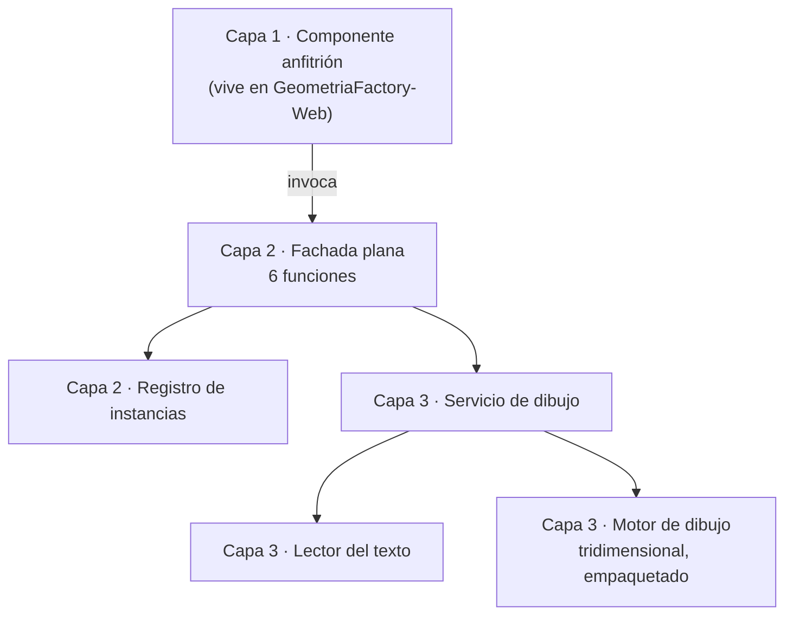

# Arquitectura técnica — GeometriaFactory-Visor

**Producto:** Fábrica de Geometría
**Proyecto de código:** GeometriaFactory-Visor
**Documento:** Arquitectura-Proyecto-Codigo.md
**Versión:** 1.1
**Estado:** Aprobado
**Fecha:** 2026-08-11
**Autor:** Arquitecto de Software Senior + API Designer (AG-05)
**Tipo de proyecto de código (D8):** `library`
**Trazabilidad upstream:** `PRODUCT-INTAKE-Fabrica-De-Geometria.md` **1.28** §4 (capacidades F-11, F-13 y **F-25**), §13 y §14 (composición y las tres reglas de arquitectura `RA-01`, `RA-02`, `RA-03`), §15 (puertas técnicas `PT-02` y `PT-03`), §16 y §16.1 (estructura de repositorio y sample), §17.7 completo (P.1 a P.12, con las **seis** funciones de P.3), §18 (punto de extensión y sample S-1), §20 E-1 y E-7; `PRODUCT-MANIFEST-Fabrica-De-Geometria.md` **1.2** §2, §3 y §5; [`../02-Especificacion-Funcional/Definicion-Contrato-De-Fachada.md`](../../../02-Especificacion-Funcional/Definicion-Contrato-De-Fachada.md), [`../02-Especificacion-Funcional/Especificacion-Funcional.md`](../../../02-Especificacion-Funcional/_fusion/Visor/Especificacion-Funcional.md) y los siete casos de uso de [`../02-Especificacion-Funcional/Casos-De-Uso/`](../02-Especificacion-Funcional/Casos-De-Uso/); [`../03-UX-UI-DX/DX-Developer-Experience.md`](../../../03-UX-UI-DX/DX-Developer-Experience.md) y [`../03-UX-UI-DX/DX-Error-Messages.md`](../../../03-UX-UI-DX/DX-Error-Messages.md)
**Trazabilidad downstream:** `06-Backlog-Tecnico`, `08-Calidad-Y-Pruebas`, `09-Devops`, `10-Examples` (sample S-1) y `11-Documentacion` de GeometriaFactory-Visor

---

## Tabla de contenido

- [1. Objetivo](#1-objetivo)
- [2. Estilo arquitectónico](#2-estilo-arquitectónico)
  - [2.1 Alternativas descartadas](#21-alternativas-descartadas)
  - [2.2 Nota de vocabulario técnico](#22-nota-de-vocabulario-técnico)
- [3. Vista lógica](#3-vista-lógica)
  - [3.1 Componentes](#31-componentes)
  - [3.2 Cobertura de los siete casos de uso](#32-cobertura-de-los-siete-casos-de-uso)
  - [3.3 Qué se porta y qué no](#33-qué-se-porta-y-qué-no)
- [4. Vista de procesos](#4-vista-de-procesos)
- [5. Vista de despliegue](#5-vista-de-despliegue)
- [6. Vista de datos](#6-vista-de-datos)
- [7. Cross-cutting concerns](#7-cross-cutting-concerns)
- [8. Quality attributes (NFR)](#8-quality-attributes-nfr)
- [9. Riesgos arquitectónicos](#9-riesgos-arquitectónicos)
- [10. Trazabilidad](#10-trazabilidad)
  - [10.1 Componente contra caso de uso](#101-componente-contra-caso-de-uso)
  - [10.2 Las siete garantías contra el componente que las sostiene](#102-las-siete-garantías-contra-el-componente-que-las-sostiene)
  - [10.3 Las tres reglas de arquitectura del producto](#103-las-tres-reglas-de-arquitectura-del-producto)
- [11. Puntos abiertos](#11-puntos-abiertos)
- [12. Control de cambios](#12-control-de-cambios)

---

## 1. Objetivo

Documenta la arquitectura interna de `GeometriaFactory-Visor`, el archivo de guion del visualizador tridimensional del producto: sus capas, su superficie de **seis** funciones, cómo se sostienen sus **siete** garantías y qué decisiones hacen que el motor de dibujo sea reemplazable sin tocar ninguna página. Se dirige a quien implementa el bundle y a las categorías 06, 08, 09 y 10.

Este proyecto de código es el único del producto fuera del ecosistema de los otros seis, y el único con `tiene_extensibilidad` == true: **el punto de extensión declarado del producto es el contrato de esta fachada** (`PRODUCT-INTAKE` §18).

## 2. Estilo arquitectónico

**Estilo elegido: microkernel con fachada plana, en tres capas.** El núcleo es el servicio de dibujo, la fachada es su única puerta y el componente anfitrión vive fuera de este proyecto de código. `PRODUCT-INTAKE` §17.2.P.2 · GeometriaFactory-Visor declara las tres capas como obligatorias y como el motivo por el que la fachada existe; [`ADR-12001`](../../Adrs/ADR-12001-Tres-Capas-Con-Fachada-Plana.md) lo registra.

Cuatro propiedades estructurales lo concretan:

1. **Visualizador puro.** Sin red, sin persistencia, sin configuración propia y sin identidad. Es `RA-02`, y es lo que hace imposible violar `RA-01` desde el navegador ([`ADR-12003`](../../Adrs/ADR-12003-Visualizador-Puro-Sin-Red-Ni-Identidad.md)).
2. **Superficie de seis funciones planas y nada más**, que es todo lo que el anfitrión puede invocar ([`ADR-12002`](../../Adrs/ADR-12002-Superficie-De-Seis-Funciones-Planas.md)).
3. **El motor de dibujo tridimensional queda dentro de la capa 3 y empaquetado**, nunca expuesto al anfitrión y nunca traído desde una red de distribución externa ([`ADR-12004`](../../Adrs/ADR-12004-Motor-De-Dibujo-Empaquetado-Y-Aislado.md)).
4. **La disposición de cada pieza se deriva de su índice**, no de un ordenamiento aleatorio ([`ADR-12005`](../../Adrs/ADR-12005-Disposicion-Determinista-Derivada-Del-Indice.md)).

### 2.1 Alternativas descartadas

Las dos primeras las descarta el intake; la tercera la evalúa y la descarta esta categoría.

| Alternativa | A favor | En contra | Resolución |
| --- | --- | --- | --- |
| Portar el archivo del visualizador previo tal cual | Costo de trabajo casi nulo; ya funciona | Arrastraría **527 de 1101 líneas** de código inactivo —el **48 %**— más dos controles inoperantes, a un producto nuevo | **Descartada** por `PRODUCT-INTAKE` §17.2.P.2 · GeometriaFactory-Visor |
| Exponer el servicio de dibujo directamente al anfitrión, sin fachada | Una capa menos | Ataría las páginas a los nombres internos del motor de dibujo y lo volvería irreemplazable, que es exactamente lo contrario del punto de extensión que el producto declara | **Descartada** por `PRODUCT-INTAKE` §17.2.P.2 · GeometriaFactory-Visor |
| Una instancia global única en lugar de instancias identificadas | Firmas más cortas: ninguna función necesitaría identificador | Rompe la garantía **G-4** de aislamiento entre instancias, y con ella la posibilidad de tener dos escenas vivas en la misma página. Además haría que `destruir` fuera ambiguo | **Descartada** por esta categoría, ver [`ADR-12002`](../../Adrs/ADR-12002-Superficie-De-Seis-Funciones-Planas.md) §4 |

### 2.2 Nota de vocabulario técnico

Este documento nombra **el motor de dibujo tridimensional**, **el empaquetador** y **el archivo de guion** por su función y no por su producto, que es la convención que la categoría 02 y la 03 de este proyecto de código ya siguen. Los nombres concretos están declarados en `PRODUCT-INTAKE` §17.2.P.1 · GeometriaFactory-Visor y se anclan con su versión en la etapa que los introduce. La convención tiene una consecuencia útil además de la formal: **el motor es reemplazable por diseño**, y nombrarlo en cada documento haría más caro reemplazarlo.

## 3. Vista lógica

### 3.1 Componentes

Las capas 2 y 3 son de este proyecto de código. La capa 1, el componente anfitrión, **vive en `GeometriaFactory-Web`** y se declara acá porque el contrato la nombra como su actor primario.

| Componente | Capa | Responsabilidad | Entradas | Salidas | Dependencias |
| --- | --- | --- | --- | --- | --- |
| Componente anfitrión | 1, **fuera de este proyecto de código** | Ciclo de vida, referencia al elemento de dibujo, invocación de las seis funciones, controles de movimiento y consulta de la preferencia de movimiento reducido | Eventos de la persona y datos del backend | Invocaciones a la fachada | La fachada, y nada del interior |
| Fachada plana | 2 | Exponer las seis funciones, resolver el identificador de instancia y devolver resultados y condiciones | Las seis invocaciones | Identificador, resultado de dibujo, estado efectivo de los movimientos, condiciones | Registro de instancias, Servicio de dibujo |
| Registro de instancias | 2 | Asociar cada identificador con su instancia viva; invalidarlo al liberarla | Identificador | Instancia viva, o la condición `INSTANCIA_DESCONOCIDA` | Ninguna |
| Lector del texto | 3 | Obtener del texto recibido las piezas, sus componentes y sus dimensiones, tolerando las variantes de clave del emisor | Texto del trabajo | Piezas legibles con su índice, y las no legibles con su condición | Ninguna |
| Servicio de dibujo | 3 | Escena, mallas, disposición, selección, encuadre, bucle de dibujo y liberación de recursos | Piezas legibles y órdenes de la fachada | Escena viva y resultado de dibujo | Lector del texto, Motor de dibujo |
| Motor de dibujo tridimensional | 3, **empaquetado** | Primitivas de escena, cámara, luces, geometrías y materiales | Órdenes del servicio de dibujo | Representación gráfica | Ninguna dentro del producto |

**La regla de dependencias es estricta y unidireccional**: la capa 1 no conoce el interior, la capa 2 no contiene lógica de dibujo y la capa 3 no conoce al anfitrión. El grafo es acíclico.

### 3.2 Cobertura de los siete casos de uso

| Componente | Casos de uso que cubre |
| --- | --- |
| Fachada plana | CU-12001 a CU-12007, los siete |
| Registro de instancias | CU-12001, CU-12005, y la resolución del identificador en CU-12002, CU-12003, CU-12004 y CU-12007 |
| Lector del texto | CU-12002 |
| Servicio de dibujo | CU-12001, CU-12002, CU-12003, CU-12004, CU-12005, CU-12007 |
| Motor de dibujo tridimensional | CU-12001, CU-12002, CU-12005 |

**CU-12006 es transversal**: recorre las seis funciones desde una página integradora sin backend, y por eso su componente es la fachada entera. Es además el sample S-1 del producto.

### 3.3 Qué se porta y qué no

El proyecto de código nace de un visualizador previo, y qué se conserva de él es una decisión arquitectónica y no de implementación. `PRODUCT-INTAKE` §17.2.P.2 · GeometriaFactory-Visor lo declara.

| Se porta | Con qué cambio |
| --- | --- |
| La construcción de objetos tridimensionales y sus funciones de creación por tipo | Reescritas en el lenguaje fuente del proyecto de código, dentro de la capa 3 |
| El árbol colapsable de la estructura del texto, que la fuente califica como el mejor recurso didáctico del visualizador previo | La fachada **devuelve la estructura**; la presentación del árbol es del anfitrión |
| La escena con luces y cámara orbital | Se conserva, y la órbita automática pasa a estar **gobernada** por la fachada (capacidad F-25) |

| No se porta | Motivo |
| --- | --- |
| Las cinco variantes comentadas de la función que procesa el conjunto de figuras, y las dos de la que ubica las piezas | Código inactivo: son parte del 48 % que el intake decide no arrastrar |
| La función de actualización del cilindro y los dos manejadores de alternar mallado y de centrar objetos | Referencian elementos de la página que no existen: son los dos controles inoperantes |
| Las tres bibliotecas de interfaz que el visualizador previo carga sin usar | Peso muerto, y además dependencias externas que este proyecto de código no necesita |
| El ordenamiento aleatorio de la disposición | **Se reemplaza** por posición derivada del índice ([`ADR-12005`](../../Adrs/ADR-12005-Disposicion-Determinista-Derivada-Del-Indice.md)) |

## 4. Vista de procesos

- **Un único hilo de ejecución**, el del navegador. No hay trabajo en segundo plano ni paralelismo.
- **Un bucle de dibujo por instancia viva**, que es lo que sostiene los dos movimientos automáticos de la capacidad F-25 y la interacción de rotar y acercar.
- **Dos condiciones de detención del bucle de movimiento**, declaradas en el contrato: mientras la persona arrastra la cámara, y mientras la superficie de dibujo no está visible. La primera evita pelearle el control a quien lo tomó; la segunda impide que un movimiento invisible siga consumiendo recursos.
- **La detención no cambia el estado gobernado.** El anfitrión no tiene que apagar su control porque el bucle se haya detenido solo.
- **Sin estado compartido entre instancias** (garantía G-4): dos instancias vivas no comparten escena, ni selección, ni disposición.
- **Terminación controlada** (garantía G-7): ninguna condición deja la instancia en estado indeterminado. O la operación surte efecto completo, o la instancia queda como estaba y la condición se informa por su código.
- **`destruir` corta el bucle.** Un bucle que sobreviviera a la liberación es exactamente la forma de degradación que el NFR de recorridos tiene que descartar.

## 5. Vista de despliegue

| Aspecto | Decisión |
| --- | --- |
| Unidad de despliegue | Ninguna propia. Su artefacto es **un archivo de guion generado**, que se copia al directorio de recursos estáticos de `GeometriaFactory-Web` y viaja dentro del despliegue de esa unidad |
| Runtime objetivo | El navegador, con capacidad gráfica tridimensional. Sin esa capacidad el visor **no es soportado**, y la fachada informa `CAPACIDAD_GRAFICA_AUSENTE` (`PRODUCT-INTAKE` §17.2.P.9 · GeometriaFactory-Visor) |
| Runtime de construcción | El entorno de ejecución de la cadena de herramientas del proyecto, sólo en tiempo de construcción: **en tiempo de ejecución no hay ninguno**, hay un archivo servido como recurso estático |
| Etapas del pipeline | Instalación reproducible de dependencias → empaquetado → copia al directorio de recursos estáticos del anfitrión (`PRODUCT-INTAKE` §17.2.P.8 · GeometriaFactory-Visor) |
| Puertas bloqueantes | El bundle se genera sin errores; **PT-03**, el motor de dibujo queda dentro del bundle y la página funciona sin acceso a redes de distribución externas; **PT-02**, el bundle carga en una página del anfitrión, `inicializar` crea la escena, `cargarJson` dibuja las tres figuras del escenario E-1 incluido el ortoedro, recorrer diez veces de ida y vuelta no degrada, y el árbol y la escena se sincronizan por índice |
| Ciclo corto de trabajo | Un guion propio genera sólo el bundle, para no encadenar la construcción del resto del producto en cada iteración sobre el visor |
| Publicación | No se publica en ningún repositorio de paquetes: `redistribuible` es false |
| Edición del artefacto | **Nunca a mano.** El bundle es un artefacto generado y reproducible |

## 6. Vista de datos

- **Cero persistencia, y es prohibición explícita.** Garantía G-2: ninguna función guarda estado entre páginas ni escribe en el almacenamiento del navegador (`PRODUCT-INTAKE` §17.2.P.4 · GeometriaFactory-Visor). Por eso **`Modelo-Datos-Logico.md` se omite**.
- **El texto del trabajo es un dato de entrada opaco**: no se guarda, no se reescribe y no se pide por cuenta propia.
- **Estado en memoria, y sólo mientras la página vive**: por instancia, la escena, la disposición, la selección vigente, el resultado de dibujo y el estado de los dos movimientos.
- **Una asimetría deliberada del estado en memoria**: el estado de los movimientos **sobrevive a `cargarJson`**, porque cargar otro texto reemplaza el contenido dibujado y no el gobierno de la escena. La selección vigente y el resultado de dibujo, en cambio, se reemplazan.
- **La preferencia de quien mira no vive acá.** El anfitrión dibuja los controles, consulta la preferencia de movimiento reducido del sistema y conserva la elección; la fachada la recibe y la ejerce.
- **Seis tipos de pieza dibujables**: tres volumétricos y tres planos. Un tipo fuera de esos seis no se dibuja y queda enumerado con `TIPO_NO_DIBUJABLE`.
- **El cero es una dimensión legible.** Lo que produce `DIMENSION_NO_LEGIBLE` es la **ausencia** de la clave o del componente del que se lee la medida, nunca el valor que trae. El visualizador previo evaluaba la verdad del número y perdía la figura, que es lo que la garantía G-5 viene a impedir.

## 7. Cross-cutting concerns

| Preocupación | Decisión | Fundamento |
| --- | --- | --- |
| Red | **Cero peticiones**, y es la decisión que define al proyecto de código. Ni obtención de recursos, ni petición asincrónica, ni conexión persistente. Garantía G-1 | [`ADR-12003`](../../Adrs/ADR-12003-Visualizador-Puro-Sin-Red-Ni-Identidad.md) |
| Persistencia | **Cero escrituras** en el almacenamiento del navegador. Garantía G-2 | `PRODUCT-INTAKE` §17.2.P.4 · GeometriaFactory-Visor |
| Configuración | **Ninguna propia.** Todo lo que la instancia necesita llega por parámetro. Garantía G-3 | `PRODUCT-INTAKE` §17.2.P.3 · GeometriaFactory-Visor |
| Identidad y autorización | **Ninguna.** El bundle no sabe quién mira ni qué papel cumple, y no participa de ninguna decisión de autorización | `PRODUCT-INTAKE` §17.2.P.5 · GeometriaFactory-Visor |
| Manejo de errores | **Siete códigos de condición**, declarados una sola vez en [`../02-Especificacion-Funcional/Definicion-Contrato-De-Fachada.md`](../../../02-Especificacion-Funcional/Definicion-Contrato-De-Fachada.md) §6, que es su fuente única. Un código nuevo sólo puede nacer allá. Un **curso** nuevo se agrega como fila de curso y no como código | [`ADR-12002`](../../Adrs/ADR-12002-Superficie-De-Seis-Funciones-Planas.md) |
| Ausencia de fallo silencioso | **Toda pieza que no se dibuja queda enumerada** en el resultado de dibujo con su índice y su condición. Garantía G-5 | `Vision-Producto.md` §9 y NB-00006 |
| Registro de eventos y métricas | **Ninguno propio.** El bundle no instrumenta ni emite registros: hacerlo sería, en el mejor de los casos, escribir en la consola del navegador, y no aporta a ningún consumidor del producto | Derivado de G-1, G-2 y G-3 |
| Exposición de la infraestructura | **Ninguna posible.** El bundle no conoce ninguna dirección de servicio, de modo que no puede exponerla (`RA-03`) | [`ADR-12003`](../../Adrs/ADR-12003-Visualizador-Puro-Sin-Red-Ni-Identidad.md) |
| Vocabulario | «Pieza» en su forma desnuda designa cada figura del conjunto raíz del trabajo; «recorrido» se escribe siempre calificado | [`../02-Especificacion-Funcional/Especificacion-Funcional.md`](../../../02-Especificacion-Funcional/_fusion/Visor/Especificacion-Funcional.md) §8 y [`../03-UX-UI-DX/Glosario-UX.md`](../../../03-UX-UI-DX/_fusion/Visor/Glosario-UX.md) |

## 8. Quality attributes (NFR)

Los seis primeros son las **seis propiedades transversales verificables** que [`../02-Especificacion-Funcional/Especificacion-Funcional.md`](../../../02-Especificacion-Funcional/_fusion/Visor/Especificacion-Funcional.md) §6 declara como lugar único de su membresía, su umbral y **sus condiciones de medición**; esta tabla las toma como están y no las redefine. Los dos últimos los deriva esta categoría.

| NFR | Objetivo numérico | Mecanismo de medición | ADR relacionada |
| --- | --- | --- | --- |
| Cero red | Exactamente **0 peticiones** originadas por el archivo de guion | Conteo en la pestaña de red, **con los dos movimientos automáticos prendidos y sostenidos** —su peor caso— y también durante los gestos de rotar y acercar | [`ADR-12003`](../../Adrs/ADR-12003-Visualizador-Puro-Sin-Red-Ni-Identidad.md) |
| Cero persistencia | **0 claves** escritas en el almacenamiento del navegador, y ningún estado conservado entre páginas | Inspección del almacenamiento con cualquier estado de los movimientos; se comprueba además que recargar la página no repone la preferencia | [`ADR-12003`](../../Adrs/ADR-12003-Visualizador-Puro-Sin-Red-Ni-Identidad.md) |
| Se ejercita sin backend | Recorrido completo de las **seis** funciones con un texto pegado a mano y **0 servicios del backend disponibles** | Página integradora sin backend, que es el sample S-1 | [`ADR-12006`](../../Adrs/ADR-12006-Bundle-Generado-Y-Versionado-Del-Punto-De-Extension.md) |
| Disposición determinista | Dos procesados del mismo texto producen la **misma disposición**, comparable pieza por pieza | Comparación de dos procesados; **se compara posición, no orientación**, y la propiedad vale con cualquier estado de los movimientos | [`ADR-12005`](../../Adrs/ADR-12005-Disposicion-Determinista-Derivada-Del-Indice.md) |
| Liberación de recursos | **10 recorridos** de ida y vuelta entre trabajos sin degradación | Recorridos **con los dos movimientos prendidos**: un bucle de dibujo que sobreviviera a `destruir` es la forma de degradación que hay que descartar | [`ADR-12001`](../../Adrs/ADR-12001-Tres-Capas-Con-Fachada-Plana.md) |
| Ausencia de fallo silencioso | **100 %** de las piezas no dibujadas enumeradas con su índice y su condición, y **0** piezas que desaparezcan sin registro | Inspección del resultado de dibujo sobre los escenarios E-1 y E-7 | [`ADR-12002`](../../Adrs/ADR-12002-Superficie-De-Seis-Funciones-Planas.md) |
| Dependencias traídas de una red de distribución externa en tiempo de ejecución | Exactamente **0** | Puerta técnica **PT-03**: la página funciona sin acceso a redes externas [derivado por esta categoría del intake §15] | [`ADR-12004`](../../Adrs/ADR-12004-Motor-De-Dibujo-Empaquetado-Y-Aislado.md) |
| Superficie pública del bundle | Exactamente **6** funciones expuestas, bajo **1** nombre propio en el objeto global del navegador y **0** identificadores globales sueltos | Inspección del bundle generado [derivado por esta categoría del intake §17.2.P.2 · GeometriaFactory-Visor y P.11 punto 3] | [`ADR-12002`](../../Adrs/ADR-12002-Superficie-De-Seis-Funciones-Planas.md) |

**Por qué la propiedad de cero red declara sus condiciones de medición**, y por qué esta sección las repite en lugar de omitirlas: el umbral no cambia —sigue siendo exactamente 0— pero sin condiciones la prueba mediría el caso fácil. Los entornos de prueba automatizados suelen declarar preferencia de movimiento reducido; un anfitrión que la respeta arranca la instancia con los dos movimientos apagados, y una prueba escrita ahí quedaría en verde **sin haber ejercitado nunca el bucle de dibujo**, que es el caso donde una petición se colaría. Que la fachada **no consulte esa preferencia por su cuenta** (G-3) es lo que hace que la prueba pueda prenderlos aunque el entorno la declare.

**No hay NFR de latencia con umbral numérico.** La fuente declara «interacción fluida al rotar y acercar, sin tráfico de circuito durante el gesto» (`PRODUCT-INTAKE` §17.2.P.10 · GeometriaFactory-Visor) y no fija un valor. Esta categoría **no inventa uno**: lo deja como punto abierto PA-03 de §11, porque un umbral de cuadros por segundo inventado acá se propagaría a 08 como si fuera del producto.

## 9. Riesgos arquitectónicos

| Riesgo | Impacto | Probabilidad | Mitigación |
| --- | --- | --- | --- |
| Que aparezca una petición de red en el bundle, por comodidad o por una dependencia que la haga por dentro | Muy alto: reabre contenido mixto, restricción de origen cruzado y exposición de la dirección del servidor propio, y rompe `RA-01` a través de `RA-02` | Baja para la primera causa, **media para la segunda** | Puerta verificable por inspección: cero ocurrencias de las tres formas de petición en el código fuente **y en el bundle generado**; más el conteo en la pestaña de red con los movimientos prendidos |
| Que el anfitrión termine dependiendo de nombres internos del motor de dibujo, y el motor deje de ser reemplazable | Alto: se pierde el punto de extensión declarado del producto | Media: es la presión natural cuando una pantalla necesita algo que la fachada no expone | [`ADR-12001`](../../Adrs/ADR-12001-Tres-Capas-Con-Fachada-Plana.md) y [`Extensibilidad.md`](../../Extensibilidad.md) §5, que declara qué se hace cuando falta algo en la fachada |
| Que un bucle de dibujo sobreviva a `destruir` y se acumule al recorrer trabajos | Alto: degradación progresiva, que es lo que `PT-02` mide | Media | NFR de liberación de recursos medido **con los movimientos prendidos**, que es su peor caso |
| Que la versión del motor de dibujo que se ancle exija una interfaz distinta de la del visualizador previo | Medio: retrabajo acotado a la capa 3 | Alta: el intake ya lo anticipa, porque el visualizador previo reimplementa la cámara orbital a mano por una carencia de su versión | [`ADR-12004`](../../Adrs/ADR-12004-Motor-De-Dibujo-Empaquetado-Y-Aislado.md), que confina el motor a la capa 3, y el anclaje explícito de versión que el producto exige |
| Que una pieza deje de dibujarse sin quedar enumerada | Alto: es exactamente el defecto original que NB-00006 viene a cerrar | Baja | Garantía G-5 y NFR de ausencia de fallo silencioso, con los escenarios E-1 y E-7 como material |
| Que se acuñe un código de condición aguas abajo, fuera de la categoría 02 | Medio: el conjunto deja de ser cerrado y 03 y 08 se desincronizan | Media: el catálogo de 03 ya creció de doce a trece entradas **sin** que creciera el conjunto de códigos, y esa distinción es fácil de perder | Regla declarada: los códigos son siete, su fuente única es el contrato de fachada, y un curso nuevo es fila de curso y no código |

## 10. Trazabilidad

### 10.1 Componente contra caso de uso

| Dimensión | Referencia |
| --- | --- |
| CU cubiertos | CU-12001 a CU-12007, los siete de [`../02-Especificacion-Funcional/Especificacion-Funcional.md`](../../../02-Especificacion-Funcional/_fusion/Visor/Especificacion-Funcional.md) §3 |
| NB que sostiene | **NB-00006**, que es su necesidad, y **NB-00004** parcialmente, sólo en la parte de que las piezas se dibujen |
| RN aplicables | **Ninguna.** Un visualizador puro no tiene reglas de dominio: las decide el backend. Lo que tiene son condiciones de contrato, que no son reglas de negocio |
| ADRs que lo gobiernan | ADR-12001, ADR-12002, ADR-12003, ADR-12004, ADR-12005, ADR-12006 |
| Contratos que expone | [`Contratos-Abstractions.md`](../../Contratos-Abstractions.md), y el punto de extensión en [`Extensibilidad.md`](../../Extensibilidad.md) |
| Tests previstos en 08 | Verificación de las **siete** garantías; las **seis** propiedades transversales con sus condiciones de medición; los escenarios **E-1** y **E-7** como material de dibujo; y las dos puertas técnicas `PT-02` y `PT-03` |

### 10.2 Las siete garantías contra el componente que las sostiene

Las siete filas están, `G-1` a `G-7`, sin agrupar. Son las de [`../02-Especificacion-Funcional/Definicion-Contrato-De-Fachada.md`](../../../02-Especificacion-Funcional/Definicion-Contrato-De-Fachada.md) §3.2, y esta tabla declara qué componente las sostiene y qué ADR las gobierna.

| Garantía | Enunciado, en una línea | Componente que la sostiene | ADR |
| --- | --- | --- | --- |
| G-1 · Cero red | Ninguna función ni ningún movimiento origina una petición | Todos, por ausencia; se verifica sobre el bundle entero | ADR-12003 |
| G-2 · Cero persistencia | Ninguna función escribe en el almacenamiento del navegador | Todos, por ausencia | ADR-12003 |
| G-3 · Sin configuración propia | Todo lo que la instancia necesita llega por parámetro | Fachada plana | ADR-12002, ADR-12003 |
| G-4 · Aislamiento entre instancias | Dos instancias vivas no comparten escena, ni selección, ni disposición | Registro de instancias, Servicio de dibujo | ADR-12002 |
| G-5 · Sin fallo silencioso | Toda pieza no dibujada queda enumerada con su índice | Lector del texto, Servicio de dibujo | ADR-12002 |
| G-6 · Determinismo | La misma entrada produce la misma **posición** de cada pieza, no la misma orientación | Servicio de dibujo | ADR-12005 |
| G-7 · Terminación controlada | O la operación surte efecto completo, o la instancia queda como estaba | Fachada plana | ADR-12002 |

**Las siete garantías son parte del contrato, no detalles de implementación**: perder cualquiera es cambio mayor aunque las seis firmas no se toquen.

### 10.3 Las tres reglas de arquitectura del producto

| Regla | Enunciado | Cómo la trata este proyecto de código |
| --- | --- | --- |
| **RA-01** | Ningún JavaScript del navegador invoca la API | **No la alcanza directamente y la sostiene por construcción.** Este proyecto de código es el JavaScript del navegador del producto, y al no hacer red no puede invocar nada. Su contribución a la seguridad es **negativa por diseño** |
| **RA-02** | El bundle del visor es un visualizador puro: sin configuración, sin red, sin conocimiento del sistema | **Es su regla.** La materializan las garantías G-1, G-2 y G-3 y las siete prohibiciones del contrato de fachada. **La sexta función no la afloja**: el anfitrión pasa dos valores de verdad, y el bundle no consulta la preferencia de movimiento reducido ni conserva la elección |
| **RA-03** | Todo llega al navegador a través del front y ningún mensaje expone direcciones de servicios internos | **La cumple por ignorancia, no por disciplina**: el bundle no conoce ninguna dirección de servicio, así que ninguna de sus siete condiciones puede exponerla. Se declara para que no deje de ser cierto si alguna vez se le pasara una por parámetro |

## 11. Puntos abiertos

| Id | Punto abierto | Quién lo cierra | Cuándo |
| --- | --- | --- | --- |
| PA-01 | La **versión del motor de dibujo tridimensional** que se adopta. El intake declara que se ancla y se registra, y que si es posterior a la del visualizador previo se documenta el cambio de interfaz que exija | El equipo, al implementar la capa 3 | Antes de comprometer la etapa `g`, que es cuando se miden `PT-02` y `PT-03` |
| PA-02 | Los **nombres definitivos** de las funciones internas, de las clases y de los campos del resultado de dibujo. La categoría 02 los declara no fijados; los nombres de las seis funciones de la fachada, en cambio, **sí están fijados** por el intake §17.7 P.3 | El equipo, en la etapa que implementa la fachada | Etapa `g` |
| PA-03 | El **umbral numérico de fluidez de la interacción**. Ninguna fuente lo declara, y esta categoría no lo inventa. Hasta que exista, la propiedad se verifica de forma cualitativa junto con `PT-02` | El Product Owner, o la categoría 08 al fijar su guion de medición | Antes de cerrar la etapa `g` |
| PA-04 | La **versión mínima de navegador**. La fuente no la fija: el requisito se declara **por capacidad** —capacidad gráfica tridimensional— y no por versión | El Product Owner sobre su propio documento | Sin fecha comprometida |
| PA-05 | **RESUELTO.** Si el bundle generado **se versiona en el repositorio o se ignora**. El intake §17.2.P.7 · GeometriaFactory-Visor admitía las dos y le ponía condición a cada una, y esta categoría lo derivó a 09 «al emitirse». **09 está emitida y lo cerró**: [`../09-Devops/Entornos-Deploy.md`](../../../09-Devops/_fusion/Visor/Entornos-Deploy.md) §2 decide que **el bundle no se versiona en el repositorio: se ignora, y lo genera la canalización antes de publicar**, con cuatro fundamentos verificables y cuatro exigencias operativas. `GeometriaFactory-Web` adoptó la misma decisión desde el lado del anfitrión y con eso cerró su `PA-07` | **Cerrado** por la categoría 09 de este proyecto de código | **Resuelto** en `09-Devops/Entornos-Deploy.md` **1.0**, 2026-08-11 |

**Cinco filas: cuatro abiertas —`PA-01` a `PA-04`— y una resuelta, `PA-05`.** La fila resuelta **se conserva en la tabla en lugar de retirarse**, con su desenlace, su fecha y dónde se resolvió: está citada desde la categoría 09 de este proyecto de código y desde la de `GeometriaFactory-Web`, y retirarla dejaría un hueco de numeración sin declarar.

## 12. Control de cambios

| Versión | Fecha | Descripción |
| --- | --- | --- |
| 1.0 | 2026-08-10 | Emisión inicial de la arquitectura técnica de `GeometriaFactory-Visor`. Declara el estilo de microkernel con fachada plana en tres capas con sus tres alternativas evaluadas, los seis componentes con su regla de dependencias, qué se porta y qué no del visualizador previo, las cuatro vistas mínimas, los cross-cutting centralizados, ocho NFR —las seis propiedades transversales de 02 con sus condiciones de medición, más dos derivados—, seis riesgos con mitigación, la trazabilidad de las siete garantías y de las tres reglas de arquitectura del producto, y cinco puntos abiertos, incluido el umbral de fluidez que esta categoría deliberadamente no inventa. Emite seis ADR individuales, el contrato de la fachada, el flujo de ejecución del dibujo y el documento de extensibilidad. |
| 1.1 | 2026-08-11 | **Cierra `PA-05` de §11, que la categoría 09 resolvió al emitirse.** La fila preguntaba si el bundle generado se versiona en el repositorio o se ignora, declaraba que el intake §17.2.P.7 · GeometriaFactory-Visor admite las dos formas y ataba el desenlace a la emisión de 09. **09 está emitida y decidió**: `09-Devops/Entornos-Deploy.md` §2 fija que **el bundle no se versiona; se ignora y lo genera la canalización antes de publicar**, con cuatro fundamentos verificables, y `09-Devops/Pipeline-CI-CD.md` y `09-Devops/Estrategia-Versionado.md` sacan su consecuencia —el artefacto se regenera y no se restaura—. `GeometriaFactory-Web` adoptó la misma decisión desde el lado del anfitrión, cerrando su propio `PA-07`. `PA-05` pasa a **fila resuelta**, con su desenlace, su fecha y dónde se resolvió, y **se conserva en la tabla en lugar de retirarse** porque está citada desde dos categorías 09; §11 gana la línea de reparto **cuatro abiertas y una resuelta**. La trazabilidad de cabecera pasa a citar el intake **1.28**, que es la versión contra la que se reverificó el punto. **`PA-03` —el umbral numérico de fluidez— sigue abierto, y las categorías 08 y 09 declararon expresamente que no lo cierran.** Ninguna decisión de arquitectura, ninguna ADR, ningún NFR, ningún riesgo y ningún otro punto abierto cambia. Sube minor. |
