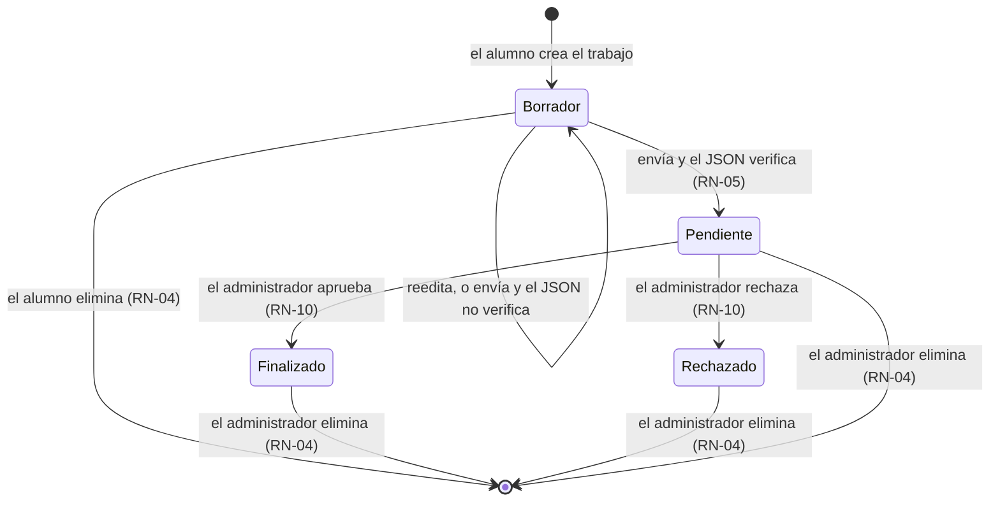
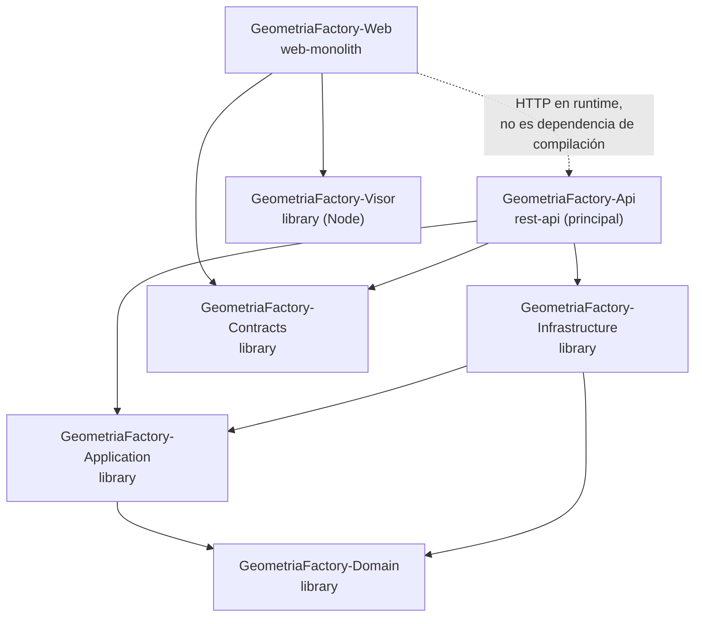
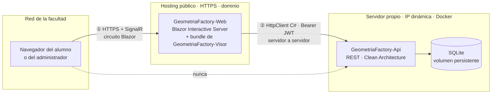

# PRODUCT-INTAKE — Fábrica de Geometría

**Plantilla de referencia:** `PRODUCT-INTAKE-template.md` versión 2.1 (Framework SDD)

## Cabecera del documento

| Campo | Valor |
|---|---|
| `Nombre-Producto` | Fábrica de Geometría |
| `Raiz-Codigo` | `GeometriaFactory` |
| `Artefacto-Agrupacion` | `GeometriaFactory.sln` |
| Product Owner | Docente de Programación 2 (TUP), responsable de la cátedra y de la Actividad 1 |
| Cliente / Stakeholder principal | Cátedra de Programación 2 — alumnos de la comisión y el propio docente como administrador |
| Repositorio | `https://github.com/hdcm-dev/Lab-Geometria.git` |
| Lead técnico | El mismo docente, asistido por agente IA (Requerimientos Técnicos §1: «1 docente + agente IA») |
| Documento | `PRODUCT-INTAKE-Fabrica-De-Geometria.md` |
| Versión | 1.23 |
| Fecha | 2026-08-11 |
| Stack principal | .NET 10 — Blazor Interactive Server (front) + API REST con Clean Architecture (backend) + TypeScript/webpack (visor 3D) |
| Estado | Borrador |

> Este documento captura qué quiere el cliente, cómo se compone el producto y cómo se construye cada proyecto de código.
> El orquestador deriva de §13 el `PRODUCT-MANIFEST` canónico; no se completa el manifiesto a mano.

### Nota sobre los cuatro planos de identidad

Cuatro planos, más el nombre del repositorio, que no es ninguno de ellos y conviene no confundir con la identidad del producto:

| Plano | Valor | Cómo se obtiene |
|---|---|---|
| Negocio — `Nombre-Producto` | **Fábrica de Geometría** | Decisión del Product Owner (2026-08-08). En prosa, en español, según D1 |
| Documentación — `Slug-Producto` | `Fabrica-De-Geometria` | **Derivado** de `Nombre-Producto` con el algoritmo de `Master-Prompt.md` §3.2. Nombra a este archivo |
| Código — `Raiz-Codigo` | `GeometriaFactory` | **Declarado** por el Product Owner (2026-08-08). Nombra a los siete proyectos de código: `GeometriaFactory.Api`, `GeometriaFactory.Domain`, … |
| Código — `Artefacto-Agrupacion` | `GeometriaFactory.sln` | Derivado de `Raiz-Codigo` más la extensión del ecosistema .NET |
| (no es un plano) Repositorio | `Lab-Geometria` | **Convención de agrupación de repositorios del docente**: el prefijo `Lab` agrupa los repositorios de aplicaciones de laboratorio para ejercitación didáctica, y `Geometria` es el dominio de esta. No designa al producto ni a su código |

**Por qué el nombre del repositorio no manda acá.** `PRODUCT-INTAKE-template.md` §13 dice que si el repositorio ya existe, `Raiz-Codigo` se toma de él y no se inventa. La regla apunta a preservar una identidad de código preexistente, y en este repositorio **no hay ninguna**: contiene sólo un `README.md` con el título y un `.gitignore` (AN §2.1). `Lab-Geometria` es una etiqueta de agrupación del propietario del repositorio, no una raíz de espacios de nombres en uso, así que la decisión de identidad de código queda abierta y la toma el Product Owner.

**Independencia verificada.** `Master-Prompt.md` §3.2 declara validación bloqueante: si `Slug-Producto` y `Raiz-Codigo` resultan la misma cadena salvo por la puntuación, el orquestador se detiene. Acá `Fabrica-De-Geometria` y `GeometriaFactory` no comparten forma: el nombre de negocio no fue completado con un nombre de artefacto de código.

**Coherencia con la fuente.** Requerimientos Técnicos nombraba a la solución `Lab.Geometria` en §1, §4.1, §4.2, §9.1, §11 y §14. El Product Owner autorizó el renombre y esas veintiocho ocurrencias pasaron a `GeometriaFactory` en el propio documento de requerimientos, de modo que fuente e intake declaran hoy la misma identidad de código y no hay divergencia que arrastrar (§22, A-1).

---

## Tabla de contenido

- [Cabecera del documento](#cabecera-del-documento)
  - [Nota sobre los cuatro planos de identidad](#nota-sobre-los-cuatro-planos-de-identidad)
- [Fuentes de este intake y regla de veracidad](#fuentes-de-este-intake-y-regla-de-veracidad)
- [Parte A — Negocio del producto](#parte-a--negocio-del-producto)
  - [§1 Idea y problema](#1-idea-y-problema)
  - [§2 Audiencia y stakeholders](#2-audiencia-y-stakeholders)
  - [§3 Propuesta de valor y diferenciación](#3-propuesta-de-valor-y-diferenciación)
  - [§4 Alcance funcional pretendido (MoSCoW)](#4-alcance-funcional-pretendido-moscow)
    - [§4.1 Reglas de negocio declaradas (RN-01 a RN-16)](#41-reglas-de-negocio-declaradas-rn-01-a-rn-16)
    - [§4.2 Modelo de estados del trabajo](#42-modelo-de-estados-del-trabajo)
  - [§5 Historias de usuario](#5-historias-de-usuario)
  - [§6 Flujos típicos](#6-flujos-típicos)
  - [§7 Casos límite y «qué pasa si»](#7-casos-límite-y-qué-pasa-si)
  - [§8 Métricas de éxito desde el negocio](#8-métricas-de-éxito-desde-el-negocio)
  - [§9 Lo que NO es este producto (exclusiones)](#9-lo-que-no-es-este-producto-exclusiones)
  - [§10 Restricciones del cliente](#10-restricciones-del-cliente)
  - [§11 Riesgos detectados desde el negocio](#11-riesgos-detectados-desde-el-negocio)
  - [§12 Glosario del dominio del cliente](#12-glosario-del-dominio-del-cliente)
- [Parte B — Composición del producto](#parte-b--composición-del-producto)
  - [§13 Proyectos de código del producto](#13-proyectos-de-código-del-producto)
  - [§14 Estilo arquitectónico del producto](#14-estilo-arquitectónico-del-producto)
  - [§15 Esquema de descomposición y delivery](#15-esquema-de-descomposición-y-delivery)
  - [§16 Estructura de repositorio del producto](#16-estructura-de-repositorio-del-producto)
    - [§16.1 Materialización de `/samples`](#161-materialización-de-samples)
- [Parte C — Técnica por proyecto de código](#parte-c--técnica-por-proyecto-de-código)
  - [§17.1 GeometriaFactory-Domain](#171-geometriafactory-domain)
  - [§17.2 GeometriaFactory-Application](#172-geometriafactory-application)
  - [§17.3 GeometriaFactory-Infrastructure](#173-geometriafactory-infrastructure)
  - [§17.4 GeometriaFactory-Contracts](#174-geometriafactory-contracts)
  - [§17.5 GeometriaFactory-Api](#175-geometriafactory-api)
  - [§17.6 GeometriaFactory-Web](#176-geometriafactory-web)
  - [§17.7 GeometriaFactory-Visor](#177-geometriafactory-visor)
  - [§18 Estrategia de demo / samples](#18-estrategia-de-demo--samples)
- [Parte D — Anexos de datos](#parte-d--anexos-de-datos)
  - [§20 Anexo A — Escenarios con ejemplos completos](#20-anexo-a--escenarios-con-ejemplos-completos)
    - [§20.E-1 · JSON semilla del visor: tres piezas y dos advertencias](#20e-1--json-semilla-del-visor-tres-piezas-y-dos-advertencias)
    - [§20.E-2 · Ortoedro(7,7,21) tal como lo emite el programa del alumno](#20e-2--ortoedro7721-tal-como-lo-emite-el-programa-del-alumno)
    - [§20.E-3 · Cubo(3) de Ejemplo1: caras `Cuadrado` y área declarada 36.00](#20e-3--cubo3-de-ejemplo1-caras-cuadrado-y-área-declarada-3600)
    - [§20.E-4 · Cubo(3) de Ejemplo2: caras `Rectangulo` y área declarada 54.00](#20e-4--cubo3-de-ejemplo2-caras-rectangulo-y-área-declarada-5400)
    - [§20.E-5 · Tipo desconocido: error con índice de figura y campo](#20e-5--tipo-desconocido-error-con-índice-de-figura-y-campo)
    - [§20.E-6 · Dimensión en 0.00: la figura no se descarta](#20e-6--dimensión-en-000-la-figura-no-se-descarta)
    - [§20.E-7 · Cobertura de los seis tipos dibujables](#20e-7--cobertura-de-los-seis-tipos-dibujables)
    - [§20.E-8 · Dimensión no legible: la pieza no se dibuja y se enumera](#20e-8--dimensión-no-legible-la-pieza-no-se-dibuja-y-se-enumera)
  - [§21 Anexo B — Cobertura de campos y trazabilidad de los ejemplos](#21-anexo-b--cobertura-de-campos-y-trazabilidad-de-los-ejemplos)
- [§19 Checklist de completitud del intake](#19-checklist-de-completitud-del-intake)
- [§22 Supuestos declarados y puntos a confirmar](#22-supuestos-declarados-y-puntos-a-confirmar)
- [Trazabilidad downstream](#trazabilidad-downstream)
- [Control de cambios](#control-de-cambios)

---

## Fuentes de este intake y regla de veracidad

Este documento integra tres fuentes, todas del repositorio de documentación `Lab-Geometria.Documentacion`:

| Id | Fuente | Qué aporta |
|---|---|---|
| **RF** | `PROMPTs/03-Ejecutar-Prompt-Integrador-Documento-Intake/INPUTs/Requerimientos-Funcionales.md` | Decisiones funcionales y de planeamiento cerradas: RF-01 a RF-20, RN-01 a RN-09, estados, mapa de navegación, etapas `a` a `g` |
| **RT** | `PROMPTs/03-Ejecutar-Prompt-Integrador-Documento-Intake/INPUTs/Requerimientos-Tecnicos.md` | Decisiones técnicas cerradas: topología, plataforma, arquitectura, contrato de datos, dominio, visor, autenticación, persistencia, pruebas, puertas técnicas PT-01 a PT-05, despliegue, riesgos R-01 a R-10 |
| **AN** | `Analisis/Analisis-Actividad-Documento-Integrador.md` | Análisis final integrado del ecosistema existente (Actividad 1 + visor JSON 3D): contrato de datos verificado, defectos D1 a D19, verificación numérica y los JSON completos del anexo §14 |

Regla aplicada, heredada de las tres fuentes: **toda afirmación de este intake cita su origen** (`RF §x`, `RT §x`, `AN §x`). Lo que proviene de una definición del docente y no de evidencia del código va rotulado **[DECISIÓN]**; lo que este documento asume porque ninguna fuente lo declara va rotulado **[ASUNCIÓN]** y se repite en §22. No se incorporó ningún dato que no esté en las tres fuentes.

Los escenarios de instancia de la Parte D se transcriben completos desde `AN §14` y `RT §6.4`, no por referencia: `Intake-Rules.md` §5 (regla de autocontención) prohíbe que un dato del intake quede respaldado únicamente en un archivo externo, porque el orquestador aguas abajo no lo resuelve.

---

# Parte A — Negocio del producto

## §1 Idea y problema

Los alumnos de Programación 2 construyen, en la Actividad 1, una aplicación de escritorio Windows Forms que modela figuras geométricas planas y volumétricas y las serializa a JSON con un método `Describir()` (AN §4, §5). Para ver el resultado en tres dimensiones existe una página estática separada, `tools_json_figure_viewer`, donde el alumno pega el texto a mano (AN §7).

Hoy la cadena completa es: modelar en C#, copiar el texto del `TextBox`, pegarlo en una página estática y verlo en 3D (RF §1). Esa cadena no tiene identidad, no tiene persistencia y no tiene entrega (AN §3.1, §10.4 D18). El trabajo del alumno vive en un portapapeles: no queda guardado, no tiene dueño, no tiene estado y el docente no puede revisarlo salvo mirando la pantalla del alumno. Si el alumno cierra la página, no queda nada.

A eso se suma un problema de fondo que el análisis verificó numéricamente: los valores calculados que emiten los ejemplos de la actividad son **incorrectos en dos casos concretos y reproducibles** —el área del cubo usa `4·l²` en lugar de `6·l²` (AN §10.2 D3) y el volumen del ortoedro ignora el largo (AN §10.2 D4)—, y nada en la cadena actual se lo señala al alumno. El visor tampoco ayuda: exige la clave `Bases` cuando el programa emite `Tapas`, de modo que **ningún ortoedro generado por la aplicación se dibuja**, y falla en silencio (AN §10.1 D1, §13.3).

Si esto no se construye, la Actividad 1 sigue terminando en un texto que se pega en una página suelta: el docente sigue sin poder revisar entregas y el error de fórmula del alumno sigue sin hacerse visible sobre su propio trabajo, que es donde tendría valor didáctico (AN §12.2.2).

## §2 Audiencia y stakeholders

| Rol | Nombre o cargo | Categoría | Responsabilidad principal |
|---|---|---|---|
| Product Owner | El docente de la cátedra | Propietario | Redacta y aprueba este intake; arbitra prioridades y exclusiones; valida cada punto de control de etapa (RF §9.3) |
| Dueño del problema | La cátedra de Programación 2 | Propietario | Padece la falta de entrega y de revisión; decide el rumbo del laboratorio |
| Equipo de desarrollo | **1 persona** (el docente) más un agente IA (RT §1) | Implementador | Construye y mantiene. El agente IA desarrolla por etapas; el humano valida y fusiona (RT §16) |
| Alumno | Alumno de la comisión | Beneficiario | Carga sus trabajos con el JSON de su Actividad 1, los previsualiza en 3D y los entrega (RF §2) |
| Administrador | El mismo docente, con cuenta única de administrador | Beneficiario y operador | Autoriza, bloquea y da de baja cuentas; revisa, filtra y agrupa los trabajos de todos los alumnos (RF §2) |

**Cantidad de personas del equipo de desarrollo: `equipo_n = 1`.** Se lee de RT §1, «Cantidad de desarrolladores: 1 docente + agente IA»: el agente no es una persona del equipo, de modo que el valor es 1. Es el dato del que `Master-Prompt.md` §4 deriva el flag `equipo_n` y, con él, que la categoría 07 emita únicamente `Mini-Plan.md`.

**Actores indirectos:** no hay. No existen áreas de auditoría, legal ni soporte: el alcance es un laboratorio de aula (RT §1).

**Nota sobre el doble papel del docente.** Product Owner, lead técnico, único desarrollador humano y administrador del sistema son la misma persona. No se fusionan las filas porque las responsabilidades sí son distintas y el punto de control de cada etapa es explícitamente el momento en que el docente cambia de sombrero: valida como cliente lo que construyó como equipo (RF §9.2).

## §3 Propuesta de valor y diferenciación

Lo que el cliente hace hoy y por qué no le alcanza: el circuito «modelar → copiar → pegar → mirar» funciona para ver una figura, pero no produce una entrega. No hay usuario, no hay trabajo, no hay estado ni historial (AN §3.1, §10.4 D18).

Promesa central: **el trabajo del alumno queda guardado, tiene dueño, tiene estado y se entrega** (RF §1), sin pedirle al alumno que cambie una coma del JSON que ya produce su programa (RT §6.1).

| # | Diferenciador | Fundamento |
|---|---|---|
| D-1 | El JSON del alumno se acepta **tal como lo emite su programa**: comas finales, clave `Tapas` en el ortoedro y caras `Cuadrado` o `Rectangulo` indistintamente | RT §6.3 T1 a T3. El servicio se adapta al dato, no al revés |
| D-2 | El sistema **señala** las discrepancias entre el valor declarado y el derivado de las dimensiones, sin corregirlas ni rechazarlas | RF §3.3, RT §6.5. Es el mayor valor didáctico del servicio: el alumno ve sobre su propio trabajo que su cubo declara 36.00 donde la geometría dice 54.00 |
| D-3 | **Los ortoedros se dibujan**, cosa que hoy no ocurre con ninguno generado por la aplicación | AN §10.1 D1. Es una línea de tolerancia de claves la que lo desbloquea (AN §12.2.1) |
| D-4 | Previsualización 3D y árbol del JSON **dentro** de la aplicación, sobre el trabajo cargado, para el alumno y para el administrador | RF-14, RF-19 |
| D-5 | El administrador ve, filtra y agrupa **todos** los trabajos por alumno, sin pedirle a nadie que le mande nada | RF-18 |

## §4 Alcance funcional pretendido (MoSCoW)

Las capacidades Must Have son la traducción directa de los requerimientos RF-01 a RF-20, que la fuente declara cerrados. Las Should, Could y Won't salen de RF §10 (etapa `i` y siguientes, que la fuente numeraba `h`) y de RF §8 (fuera de alcance). Las cuatro capacidades del circuito de revisión incorporadas el 2026-08-08 no vienen de RF: son decisión del Product Owner de esa fecha.

| ID | Capacidad | MoSCoW | Origen |
|---|---|---|---|
| F-01 | Configurar la cuenta de administrador en el primer arranque, y sólo mientras no exista ninguna | Must Have | RF-01, RF-02, RN-01 |
| F-02 | Registro de alumno con correo, nombre y apellido, sin elegir contraseña | Must Have | RF-03, RF-04 |
| F-03 | Habilitar, bloquear, rehabilitar y dar de baja física cuentas de alumno desde el panel del administrador | Must Have | RF-05, RF-08, RN-07 |
| F-04 | Establecer contraseña en el primer ingreso efectivo del alumno, sin envío de correo. **El alumno se identifica con la contraseña provisoria que el sistema produce al habilitarlo** —el mismo mecanismo del reseteo (F-26)— y la cambia por el camino que RN-13 ya fija | Must Have | RF-06, RF-07, RN-16 [PRECISADO 2026-08-09] |
| F-05 | Inicio y cierre de sesión, y cambio de contraseña exigiendo la actual | Must Have | RF-09, RF-10 |
| F-06 | Cargar un trabajo con nombre, fecha, descripción y el JSON de figuras, con identificador propio | Must Have | RF-11, RF-12 |
| F-07 | Reeditar y eliminar el trabajo **sólo mientras está en `Borrador`**, que es el estado en el que queda cuando el JSON no verifica | Must Have | RF-15, RF-17, RN-04 [DECISIÓN 2026-08-08] |
| F-08 | Listar los trabajos propios con su estado `Borrador` / `Pendiente` / `Finalizado` / `Rechazado` | Must Have | RF-16 [DECISIÓN 2026-08-08] |
| F-09 | Validar el JSON con la tolerancia de claves del emisor real y reportar errores con índice de figura y campo | Must Have | RF-13, RN-09, RT §6.3 |
| F-10 | Verificar `Area` y `Volumen` recalculándolos desde las dimensiones y emitir advertencias que no bloquean | Must Have | RF-20, RN-05, RT §6.5 |
| F-11 | Previsualizar el trabajo en 3D y ver la estructura del JSON como árbol colapsable | Must Have | RF-14, RF-19 |
| F-12 | Listado para el administrador de todos los trabajos **excepto los que están en `Borrador`**, con agrupación y filtro por alumno | Must Have | RF-18 [DECISIÓN 2026-08-08] |
| F-22 | **Enviar** el trabajo: acción única que interpreta el JSON y, si verifica, lo pasa a `Pendiente`; si no verifica, lo deja en `Borrador` con sus errores localizados | Must Have | RF-13, RF-15 [DECISIÓN 2026-08-08] |
| F-23 | **Aprobar o rechazar** un trabajo en `Pendiente`, facultad exclusiva del administrador: aprobar lo pasa a `Finalizado` y rechazar a `Rechazado`, ambos terminales | Must Have | [DECISIÓN 2026-08-08] |
| F-24 | **Eliminar cualquier trabajo que el administrador ve**, en cualquier estado, con borrado físico | Must Have | [DECISIÓN 2026-08-08] |
| F-26 | **Resetear la contraseña de un alumno**, desde el mismo panel donde el administrador lo habilita, lo bloquea y lo da de baja. El administrador acciona el reseteo y **el sistema produce una contraseña provisoria** que la pantalla le muestra para que se la comunique al alumno; el panel **no lleva campo de contraseña**. El alumno **está obligado a cambiarla en su próximo ingreso**: hasta que no la cambie no accede a ninguna otra ruta. **El reseteo no exige que la cuenta esté habilitada**: procede sobre `Pendiente`, `Habilitado` y `Bloqueado`, porque opera sobre la credencial y no sobre el estado. **La cuenta y todos sus trabajos se conservan** | **Must Have** | [DECISIÓN 2026-08-09]. Retira la exclusión X-2 y reescribe el caso límite CL-7. Cierra un agujero que hacía inutilizable el laboratorio al primer olvido: el único camino declarado hasta hoy era dar de baja y volver a dar de alta, y por RN-07 **eso eliminaba todos los trabajos del alumno** |
| F-25 | **Movimiento automático de la escena, con dos controles independientes**: órbita de la cámara alrededor del conjunto, y giro de cada pieza sobre su eje. Los dos se detienen mientras la persona arrastra. El anfitrión los gobierna **enviando dos valores de verdad** por la fachada; el bundle **no consulta nada**, y en particular no lee la preferencia de movimiento reducido del navegador, que consulta el anfitrión | **Must Have** | [DECISIÓN 2026-08-09, **originada en la validación visual de la Fase B2**]. La órbita de la cámara **existe en el visor actual** y se porta; el **giro de las piezas no existe** y es capacidad nueva, pedida por el Product Owner al mirar la maqueta. **Subida a `Must Have` el 2026-08-09**: la animación es comportamiento propio del bundle y vive en su mismo bucle de dibujo, la órbita **ya existe en el visor actual** —diferirla sería portar quitando algo que hoy funciona, o sea una regresión—, y tres propiedades transversales del visor fijan su condición de medición con los movimientos prendidos. Lo opcional es que la persona los prenda o los apague, no que el producto los tenga |
| F-13 | Sincronización árbol ⇄ escena por índice de pieza y disposición determinista entre procesados | **Must Have** | RF §10 etapa `g`, AN §10.4 D10. [DECISIÓN 2026-08-10: **sube de `Should Have` a `Must Have`**. No es un cambio de ambición sino el reconocimiento de algo que ya era cierto: §17.7 P.8 incluye estas dos propiedades entre lo que la puerta técnica **PT-02** mide **antes** de comprometer la etapa `g`, y una puerta que no pasa detiene la planificación. Con prioridad `Should` la capacidad era diferible en el papel e indiferible en los hechos, que es la peor combinación: nadie la planifica y sin embargo bloquea. Lo levantaron **dos proyectos desde los dos lados de la fachada** —`GeometriaFactory-Visor` y `GeometriaFactory-Web`— en la Fase D. Es el mismo caso que **F-25** en 1.7 y se resuelve igual] |
| F-14 | Despliegue real: front publicado por FTP en el hosting y backend en el servidor propio, con PT-05 medida desde la facultad | Should Have | RF §10 etapa `h`, hoy etapa `i`, RT §13, §14 |
| F-15 | Panel de resumen del administrador: cantidad de trabajos por alumno y por estado | Could Have | RF §10 etapa `h` |
| F-16 | Exportar el trabajo (JSON original y captura de la escena) | Could Have | RF §10 etapa `h`, AN §12.5 P2 |
| F-17 | Modo despiece: expandir un volumen y ver sus caras separadas | Could Have | AN §12.5 P1 |
| F-18 | Notificaciones por correo y recuperación de contraseña olvidada | Won't Have v1 | RF-07, RF §8 |
| F-19 | Múltiples administradores, roles configurables y permisos finos | Won't Have v1 | RF §8, RN-01 |
| F-20 | Edición o corrección del JSON del alumno desde la aplicación | Won't Have v1 | RN-08, RF §8 |
| F-21 | **Comentario escrito del administrador** sobre el trabajo, opcional tanto al aprobar como al rechazar | **Must Have** | [DECISIÓN 2026-08-08]. Estaba en `Won't Have v1` y excluida en X-5 por «no fue pedido»; el Product Owner la pidió y la exclusión se retira. **No es calificación**: es texto libre, sin nota ni escala |

### §4.1 Reglas de negocio declaradas (RN-01 a RN-16)

Las nueve reglas están cerradas por RF §7 y se transcriben acá **completas**, porque la versión anterior de este intake las citaba por identificador sin enunciarlas y dos de ellas —RN-02 y RN-06— no aparecían en ninguna sección. Sin enunciado, ninguna categoría aguas abajo puede derivarlas.

| Id | Enunciado | Cómo se verifica |
|---|---|---|
| RN-01 | Existe **exactamente un** administrador. Su alta sólo es posible mientras no exista ninguno | Intentar la ruta de alta inicial con administrador existente redirige a inicio de sesión |
| RN-02 | El correo del alumno es **único** | Registrar dos veces el mismo correo se rechaza con mensaje explícito |
| RN-03 | Un alumno **sólo ve y opera sus propios trabajos** | Pedir el trabajo de otro alumno por su identificador devuelve «no encontrado», no «no autorizado» |
| RN-04 | El alumno elimina sus trabajos **sólo en `Borrador`**. El **administrador elimina cualquier trabajo que ve**, en cualquier estado, con borrado físico | La acción no se ofrece al alumno en otros estados **y** se rechaza en el backend si se fuerza. El borrado del administrador se verifica sobre un trabajo en `Pendiente` [DECISIÓN 2026-08-08] |
| RN-05 | Un trabajo **no pasa a `Pendiente` con errores de interpretación** del JSON. Las advertencias **sí** lo permiten | Enviar un trabajo con tipo desconocido lo deja en `Borrador`; enviar uno con advertencias de valor lo pasa a `Pendiente` [DECISIÓN 2026-08-08: el corte se adelanta del cierre al envío] |
| RN-06 | Una cuenta `Pendiente` o `Bloqueada` **no obtiene sesión** | Intentar ingresar con una cuenta recién registrada devuelve el motivo, sin sesión |
| RN-07 | La **baja física** de una cuenta elimina la cuenta y **todos sus trabajos**, y exige confirmación explícita escribiendo el correo de la cuenta | Se verifica que no quede ningún trabajo del alumno dado de baja |
| RN-08 | El **JSON original del alumno se conserva íntegro** y nunca se reescribe | El texto guardado es idéntico al pegado |
| RN-09 | Los mensajes de error de validación indican **índice de figura y campo**, nunca un texto genérico | Cargar un tipo desconocido produce el índice y el campo `Tipo` |

**Reglas nuevas que no existían en RF §7**, declaradas por el Product Owner. Las dos primeras —**RN-10** y **RN-11**— las introduce el **circuito de revisión** el 2026-08-08. Las cuatro siguientes —**RN-12** a **RN-15**— las introduce el **reseteo de contraseña** (F-26) el 2026-08-09. La séptima —**RN-16**— la introduce la **identificación en el primer ingreso** el 2026-08-09, y unifica la credencial inicial con el mecanismo del reseteo. Se listan en el orden en que se decidieron. [ROTULADO CORREGIDO **dos veces** el 2026-08-09: primero decía «Dos reglas nuevas» encabezando **seis** filas, y tras corregirlo volvió a quedar corto al entrar RN-16, con lo cual encabezaba **siete**. El rótulo enumera tandas y por eso envejece cada vez que entra una: si entra una octava regla, esta frase hay que tocarla otra vez.]

| Id | Enunciado | Cómo se verifica |
|---|---|---|
| RN-10 | **Sólo el administrador aprueba o rechaza** un trabajo, y sólo desde `Pendiente`. `Finalizado` y `Rechazado` son terminales: ninguna transición sale de ellos | Un alumno que fuerce la transición contra el backend es rechazado |
| RN-11 | El administrador **no ve los trabajos en `Borrador`**: no forman parte de su flujo de trabajo | El listado del administrador sobre un alumno con un borrador y un pendiente devuelve sólo el pendiente |
| RN-14 | **La contraseña provisoria la produce el sistema, no la escribe el administrador**, y la superficie se la muestra para que se la comunique. La provisoria **no es adivinable** y **no se repite** entre cuentas ni entre reseteos de la misma cuenta | Dos reseteos consecutivos sobre la misma cuenta producen provisorias distintas, y ninguna es derivable del nombre, del correo ni de la fecha [DECISIÓN 2026-08-09: si la escribe el docente, en la práctica termina siendo la misma clave para toda la comisión, y el panel cargaría con un campo de contraseña ajena] |
| RN-15 | **Resetear no exige que la cuenta esté habilitada.** Procede sobre `Pendiente`, `Habilitado` y `Bloqueado`: es una operación sobre la credencial y **no una transición de la máquina de estados de la cuenta**, de modo que no altera el estado ni requiere un orden previo. Sigue sin admitirse sobre la cuenta de administrador (INV-08) | Resetear una cuenta `Bloqueado` funciona y la deja `Bloqueado`; habilitar y resetear en cualquiera de los dos órdenes termina igual [DECISIÓN 2026-08-09: el administrador no tiene que acordarse de una secuencia] |
| RN-12 | **El reseteo de contraseña conserva la cuenta y sus trabajos.** El sistema produce una contraseña **provisoria**; la cuenta queda marcada como *con cambio de contraseña pendiente* y **conserva su estado de habilitación**, su papel, su identidad y **todos sus trabajos con sus estados y comentarios**. Resetear no es dar de baja: no dispara RN-07 | Un alumno con tres trabajos —uno en `Borrador`, uno en `Rechazado` y uno en `Finalizado`— conserva los tres, con sus comentarios, después del reseteo. Se autentica con la provisoria, cambia la contraseña y los ve [DECISIÓN 2026-08-09] |
| RN-16 | **Habilitar una cuenta produce una contraseña provisoria**, con las mismas propiedades y el mismo tratamiento que la del reseteo (RN-14): el sistema la produce, la pantalla se la muestra al administrador para que se la comunique, y la cuenta queda con **cambio de contraseña pendiente** (INV-09). En consecuencia **no existe ninguna escritura anónima de credencial**: toda operación que fija o cambia una contraseña ocurre con la cuenta ya autenticada. [PRECISADO 2026-08-09: la redacción de 1.13 decía «ninguna escritura anónima **en el sistema**», que era falso —el **registro de cuenta** de RF-03 es anónimo por diseño y así debe seguir: es como el alumno entra al laboratorio—. Lo que RN-16 elimina es la escritura anónima **de contraseña**, que es la que abría el agujero] | Habilitar a un alumno y entrar con la provisoria lleva al cambio obligatorio y a ninguna otra ruta. No hay ningún punto de acceso que acepte un correo y una contraseña nueva sin credencial [DECISIÓN 2026-08-09: la alternativa —un punto anónimo con correo y contraseña elegida— dejaba que cualquiera que conociera un correo habilitado le fijara la contraseña a esa cuenta antes que su dueño. Además unifica: un solo mecanismo de credencial inicial en vez de dos] |
| RN-13 | **Mientras la contraseña provisoria no se cambie, la cuenta no llega a ninguna otra parte del sistema.** **Se autentica pero no obtiene sesión de trabajo**: el sistema reconoce la credencial provisoria y, en lugar de admitirla, la deriva al cambio de contraseña, que es lo único que puede hacer. Una vez cambiada, entra con normalidad. [PRECISADO 2026-08-09: la versión 1.7 decía «ingresa», que se leía como que obtenía sesión. Emitir sesión a una cuenta que por INV-09 no ejerce ninguna capacidad es contradictorio, y la diferencia es observable en la API; se resuelve del lado de no emitirla, que además es el paralelo exacto del primer ingreso con contraseña no fijada.] Al cambiarla, la marca se levanta y la cuenta opera con normalidad. La contraseña nueva la elige el alumno y **el administrador no la conoce** | Un alumno reseteado que intenta abrir el listado de trabajos o enviar uno termina en el cambio de contraseña, sin haber leído ni escrito nada. Después de cambiarla, la misma navegación funciona [DECISIÓN 2026-08-09] |

### §4.2 Modelo de estados del trabajo



| Estado | Qué significa | Lo edita el alumno | Lo elimina el alumno | Lo ve el administrador | Comentario del administrador |
|---|---|---|---|---|---|
| `Borrador` | El JSON todavía no verifica, o el trabajo recién se creó | **Sí** | **Sí** | **No** (RN-11) | — |
| `Pendiente` | Enviado con JSON interpretado sin errores, a la espera de revisión | No | No | Sí | — |
| `Finalizado` | Aprobado por el administrador. Terminal | No | No | Sí | opcional |
| `Rechazado` | Rechazado por el administrador. Terminal | No | No | Sí | opcional |

**Tres consecuencias que el Product Owner aceptó explícitamente al decidir este modelo:**

1. **`Rechazado` es terminal y el alumno no puede editarlo ni eliminarlo.** Corregir un rechazo significa **cargar un trabajo nuevo**; el rechazado queda como registro del intento. Un alumno que rebote varias veces acumula trabajos rechazados que sólo el administrador puede quitar.
2. **`Borrador` significa exactamente «el JSON no verificó».** Al unificarse guardar y enviar en una sola acción (F-22), el alumno **no puede** conservar en borrador un trabajo cuyo JSON sí verifica: ese envío lo pasa a `Pendiente`.
3. **El comentario es opcional en los dos casos**, así que un alumno puede recibir un rechazo sin explicación escrita. El estado le informa que no fue aceptado; el motivo queda a criterio del administrador en cada caso.

**Colisión de vocabulario que esto obliga a gobernar.** `Pendiente` nombra a la vez un estado de **cuenta** —registrada y todavía no habilitada— y un estado de **trabajo** —enviado y a la espera de revisión—. Los dos sentidos conviven en las mismas secciones, así que en toda la documentación generada el término se escribe **siempre calificado**: «cuenta `Pendiente`» o «trabajo en estado `Pendiente`». La forma desnuda no se usa.

## §5 Historias de usuario

1. Como **alumno**, quiero cargar el JSON que produjo mi programa de la Actividad 1 junto con un nombre, una fecha y una descripción, para que mi trabajo quede guardado con mi nombre y no se pierda al cerrar la página (RF-11, RF-12).
2. Como **alumno**, quiero previsualizar mi trabajo en 3D y ver su árbol antes de entregarlo, para darme cuenta de si modelé lo que quería modelar (RF-14).
3. Como **alumno**, quiero guardar un borrador aunque mi JSON todavía esté incompleto o roto, para no perder lo hecho mientras corrijo mi programa (RF-15).
4. Como **alumno**, quiero que el sistema me diga en qué figura y en qué campo está el problema, para no tener que adivinar dónde falla mi salida (RN-09).
5. Como **alumno**, quiero ver la advertencia de que mi cubo declara 36.00 donde la geometría dice 54.00, para descubrir el error de fórmula sobre mi propio trabajo (RF §3.3).
6. Como **administrador**, quiero habilitar las cuentas que se registran y bloquear las que corresponda, para controlar quién entra al laboratorio sin depender del correo (RF-05, RF-08).
7. Como **administrador**, quiero ver los trabajos de la comisión agrupados y filtrados por alumno, sin los borradores que los alumnos todavía están armando, para revisar la entrega de una sola vez (RF-18, RN-11).
7.1. Como **administrador**, quiero aprobar o rechazar cada trabajo que recibo y poder dejarle un comentario al alumno, para que la entrega tenga un desenlace explícito y no quede sólo depositada (F-21, F-23) [DECISIÓN 2026-08-08].
8. Como **administrador**, quiero abrir cualquier trabajo con el mismo visor 3D y el mismo árbol que ve el alumno, para revisar exactamente lo que él entregó (RF-19).

## §6 Flujos típicos

**Flujo 1 — Alta de alumno de punta a punta, sin correo (el 80 % del arranque de la cursada).** El alumno entra a la aplicación y se registra con su correo, su nombre y su apellido; no elige contraseña. El sistema le dice que su cuenta quedó pendiente de autorización. Intenta ingresar y el sistema le informa explícitamente que todavía está pendiente. El docente entra como administrador, ve la cuenta en su panel y la habilita. El alumno vuelve a intentar ingresar y esta vez el sistema le pide establecer su contraseña. La establece y accede a su panel de trabajos, vacío. (RF §5.1.)

**Flujo 2 — Carga de un trabajo (el flujo más frecuente durante la cursada).** El alumno abre «Nuevo trabajo», completa nombre, fecha y descripción, y pega el texto que le devolvió el `TextBox` de su aplicación de escritorio. Pide previsualizar: el visor dibuja sus figuras en 3D y despliega el árbol del JSON al costado. **Envía**, que es la única acción de guardado (F-22): el sistema interpreta el JSON completo y decide el estado. Si verifica, el trabajo pasa a `Pendiente` y le muestra las advertencias de valores calculados, que no lo bloquean. Si no verifica, queda en `Borrador` con los errores localizados por índice de figura y campo, y el alumno corrige y vuelve a enviar cuantas veces haga falta. (RF §5.2, RN-05.)

**Flujo 2.1 — Revisión por el administrador** [DECISIÓN 2026-08-08]. El docente abre su listado, que muestra los trabajos en `Pendiente`, `Finalizado` y `Rechazado` de toda la comisión, agrupados y filtrables por alumno, y **no muestra borradores** (RN-11). Abre un trabajo en `Pendiente`, lo mira en 3D y como árbol, y decide: lo **aprueba**, con lo que pasa a `Finalizado`, o lo **rechaza**, con lo que pasa a `Rechazado`. En cualquiera de los dos casos puede dejar un **comentario** escrito, que es opcional. Los dos estados son terminales: el alumno los ve y no los edita, y si su trabajo fue rechazado corrige cargando uno nuevo. El administrador también puede **eliminar** cualquier trabajo que ve, en cualquier estado, y el trabajo desaparece.

Con el escenario **E-2** —la salida real de `Ortoedro(7, 7, 21)`— el resultado es el de RT §6.4: parseo exitoso pese a las dos comas finales, lectura de las bases por la clave `Tapas`, área verificada sin observación y **una advertencia de volumen**, declarado 343.00 contra derivado 1029.00.

**Flujo 3 — Revisión por el administrador.** El docente ingresa, abre el listado de trabajos, agrupa por alumno y filtra por el alumno que quiere revisar. Abre un trabajo y ve exactamente lo mismo que vio el alumno: los datos, el JSON, el canvas 3D y el árbol, con sus advertencias. Cierra y pasa al siguiente. (RF-18, RF-19.)

**Flujo 4 — El caso incómodo, con datos reales.** El alumno carga el JSON semilla de tres piezas (escenario **E-1**): un cilindro, un cubo y un ortoedro. El sistema interpreta las tres, las dibuja y le devuelve **dos advertencias**: una de área en el cubo, que declara 36.00 donde la geometría da 54.00, y una de volumen en el ortoedro, que declara 343.00 donde da 1029.00. El área del ortoedro **no** produce observación, porque el valor declarado coincide con el derivado. El trabajo **pasa a `Pendiente` con** las dos advertencias; ninguna lo bloquea, y queda a la espera de la revisión del administrador. (RF §5.3, §20.E-1, RN-05.)

Este escenario ejercita el camino feliz de la lectura de claves y no las tolerancias del formato: su texto fue editado a mano y trae `"Bases"` en el ortoedro y ninguna coma final, a diferencia de lo que emite el programa del alumno (§20.E-1). Las dos trampas del formato —la clave `"Tapas"` y las comas finales— las ejercita **E-2**, donde además el ortoedro es el que el visor original no dibuja.

## §7 Casos límite y «qué pasa si»

| # | Pregunta | Respuesta del cliente | Origen |
|---|---|---|---|
| CL-1 | ¿Qué pasa si dos personas operan a la vez sobre la base? | SQLite no admite escrituras concurrentes: el backend opera como **escritor único**, con modo de diario WAL y un `DbContext` por operación. El alcance de aula hace que la concurrencia real sea baja | RT §10 |
| CL-2 | ¿Qué pasa si se pierde la conexión en medio de una operación? | Son dos tramos independientes. Si se corta el circuito navegador↔front, la página avisa y reconecta, y el backend ni se entera. Si falla el tramo front↔API, la acción falla con **estado degradado explícito**, nunca con una excepción sin manejar, y el circuito sigue vivo | RT §2.3, §2.6, R-08 |
| CL-3 | ¿Qué pasa si el JSON llega mal formado o incompleto? | El trabajo **queda en `Borrador`** con su texto crudo conservado y no pasa a `Pendiente`: el envío es una sola acción y el estado lo decide la interpretación del JSON. El mensaje indica índice de figura y campo, nunca un texto genérico. El alumno corrige y vuelve a enviar | RF-15, RN-05, RN-09 [DECISIÓN 2026-08-08: el corte pasa del cierre al envío] |
| CL-10 | ¿Qué pasa si el administrador rechaza un trabajo y el alumno quiere corregirlo? | **Carga un trabajo nuevo.** `Rechazado` es terminal: el alumno no lo edita ni lo elimina, y queda como registro del intento. Sólo el administrador puede quitarlo | [DECISIÓN 2026-08-08], RN-04, RN-10, INV-07 |
| CL-11 | ¿Qué pasa si el administrador rechaza sin escribir un comentario? | Es válido: el comentario es opcional en los dos desenlaces. El alumno ve el estado `Rechazado` y sabe que no fue aceptado, aunque no tenga el motivo por escrito | [DECISIÓN 2026-08-08], F-21 |
| CL-4 | ¿Qué pasa si el valor calculado que trae el JSON está mal? | **No se corrige ni se rechaza: se señala** como advertencia, y el trabajo **pasa a `Pendiente` igual**. Es deliberado, y es el mayor valor didáctico del servicio. Que el administrador después lo apruebe o lo rechace es una decisión suya y no del validador | RF-20, RT §6.5, RN-05 |
| CL-5 | ¿Qué pasa si un alumno pide por URL el trabajo de otro? | Devuelve «no encontrado», no «no autorizado»: no se confirma la existencia del recurso ajeno. Se verifica por pertenencia en el backend, no sólo ocultando el botón en la interfaz | RN-03, INV-02 |
| CL-6 | ¿Qué pasa si alguien quiere borrar su cuenta o sus datos? | La baja física la ejecuta el administrador, elimina la cuenta **y todos sus trabajos**, y exige confirmación escribiendo el correo de la cuenta | RF-08, RN-07 |
| CL-7 | ¿Qué pasa si el alumno olvida su contraseña? | **El administrador se la resetea** desde su panel (F-26): el sistema produce una contraseña provisoria que él le comunica, y el alumno **está obligado a cambiarla en su próximo ingreso**. La cuenta y todos sus trabajos **se conservan**. No hay recuperación autónoma, porque no hay correo | RF §8, F-26 [DECISIÓN 2026-08-09] |
| CL-8 | ¿Qué pasa si el servidor propio se queda sin luz o sin internet? | El front sigue en pie y muestra estado degradado; los datos no están disponibles hasta que el servidor vuelva. No hay réplica ni caché de datos en el front | RT §14 («el front no guarda estado propio»), R-08 |
| CL-9 | ¿Qué pasa si cambia la IP dinámica del servidor propio? | El front queda apuntando a la nada. Mitigación recomendada: DDNS. Con IP directa, cada cambio obliga a redesplegar el front por FTP | RT §2.6, R-04 |

## §8 Métricas de éxito desde el negocio

Las fuentes no declaran una tabla de métricas de negocio. Las cuatro siguientes se **derivan** de criterios que las fuentes sí declaran de forma numérica o binaria, y cada una cita ese origen. Eran tres hasta el 2026-08-08, cuando la de cierre del circuito se partió en entrega y aprobación. Los valores objetivo quedan sujetos a confirmación del Product Owner (§22, A-2).

| Criterio | Métrica | Target | Plazo | Origen de la derivación |
|---|---|---|---|---|
| Avance del producto | Etapas cerradas con OK explícito del agente humano en su punto de control, **sobre todas las etapas comprometidas** (`a` a `h`) | **8 de 8** [DECISIÓN 2026-08-09: se cuentan todas las comprometidas, no siete. Con siete, el producto podía declararse completo con una etapa comprometida sin construir] | Sin plazo calendario: RT §1 declara «sin plazo; el avance se mide por etapas cerradas» | RF §10, RT §1 |
| **Entrega** del alumno | Alumnos habilitados que llegan a tener al menos un trabajo en `Pendiente` o posterior, sobre el total de alumnos habilitados | ≥ 80 % [ASUNCIÓN] | Al cierre de la cursada en que se use por primera vez | RF §4.2. **Partida el 2026-08-08**: mide lo que depende del alumno, y `Pendiente` es el primer estado que expresa una entrega efectiva, porque exige JSON interpretado sin errores (RN-05) |
| **Aprobación** del administrador | Trabajos en `Pendiente` que reciben desenlace —`Finalizado` o `Rechazado`— sobre el total de trabajos que llegaron a `Pendiente` | 100 % [ASUNCIÓN] | Al cierre de la cursada en que se use por primera vez | [DECISIÓN 2026-08-08]. Mide lo que depende del administrador: que ninguna entrega quede sin revisar. El target es 100 % y no un porcentaje menor porque un trabajo entregado y nunca revisado es exactamente el problema que el producto viene a resolver |
| Valor didáctico efectivamente entregado | Advertencias de valor declarado contra derivado que el sistema muestra sobre trabajos reales de alumnos | ≥ 1 advertencia visible por alumno que cargue un cubo de Ejemplo1 o un ortoedro | Primera entrega de la cursada | RF §3.3 y AN §9.2: los defectos D3 y D4 están presentes en el 100 % de esas figuras, de modo que la métrica mide que el sistema las **muestre**, no que existan |

Estas son métricas de resultado de negocio. Las técnicas —latencia, disponibilidad, cobertura— viven en §17 P.10 de cada proyecto de código y no se mezclan acá.

## §9 Lo que NO es este producto (exclusiones)

| # | Exclusión | Justificación | ¿Cuándo podría incorporarse? |
|---|---|---|---|
| X-1 | Notificaciones por correo | [DECISIÓN] RF-07: el flujo de contraseña está diseñado para **evitar** el envío de correo. La contraseña no se transporta nunca: la elige el alumno en su primer ingreso efectivo | No previsto. Incorporarlo cambiaría RF-06 |
| ~~X-2~~ | ~~Recuperación de contraseña olvidada~~ | **Exclusión retirada el 2026-08-09.** Su justificación era que sin correo no hay canal de recuperación, y su salida declarada —dar de baja y volver a dar de alta— **destruía todos los trabajos del alumno** (RN-07). El Product Owner incorporó **F-26**: el administrador resetea la contraseña desde su panel, con una provisoria que el alumno debe cambiar en su próximo ingreso. **Sigue excluida la recuperación autónoma por correo**, que es lo que X-1 impide | — |
| X-3 | Múltiples administradores, roles configurables, permisos finos | La aplicación es **básica** [DECISIÓN, RF §1]: el modelo es de dos roles fijos y de un único administrador (RN-01, INV-05) | No previsto en este alcance |
| X-4 | Corrección o edición del JSON del alumno desde la aplicación | RN-08: el JSON original se conserva íntegro y nunca se reescribe. El formato es premisa fija (AN §12.1) y es la única fuente fiel del trabajo | No previsto: contradice la premisa |
| ~~X-5~~ | ~~Calificación o devolución escrita del administrador sobre el trabajo~~ | **Exclusión retirada el 2026-08-08.** Su justificación era «no fue pedido» y su condición de reingreso era «si el docente lo pide». El Product Owner lo pidió, y la capacidad entra al alcance comprometido como **F-21**, `Must Have`. Lo que sigue excluido es la **calificación**: el comentario es texto libre, sin nota ni escala | — |
| X-6 | Modo despiece, exportación de imágenes y URL compartible del visor | Propuestas de AN §12.5 que no entraron en este alcance | Candidatos declarados de la etapa `h` (RF §10) |
| X-7 | Ambientación a un problema real (depósito, costos, capacidades) | Propuesta de AN §12.3; no forma parte de esta aplicación | Candidato de la etapa `h` |
| X-8 | Segundo factor de autenticación | No fue pedido; la elección de autenticación (ROPC) no lo bloquea | No previsto |
| X-9 | Pasarela de reenvío `/api/*` en el front | [DECISIÓN, RT §2.4] Hoy ningún JavaScript del navegador toca la API (RA-01), de modo que la pasarela sólo consumiría el recurso más escaso del plan gratuito. Queda **especificada** para adoptarla sin rediseño | Si aparece descarga de archivos, carga directa desde el navegador o migración a WebAssembly |
| X-10 | Túnel saliente con dominio propio para el backend | [DECISIÓN, RT §15.1] Resolvería R-02, R-04 y R-05 de una vez, pero exige un dominio propio y **debilita la premisa de la topología**: si la API queda alcanzable desde la facultad, el front en el hosting deja de ser necesario | Reevaluar si aparece un dominio propio o si PT-01 obliga a mover el front |

## §10 Restricciones del cliente

| Restricción | Definición | Origen |
|---|---|---|
| **Fecha objetivo** | **Sin fecha**, justificado: «sin plazo; el avance se mide por etapas cerradas». El ritmo lo fija el punto de control de cada etapa, que es un cuello por diseño | RT §1 |
| **Presupuesto** | **Sin presupuesto monetario asignado.** Las tres piezas de infraestructura son de costo cero declarado: hosting gratuito de somee.com, servidor domiciliario propio ya existente y trabajo del docente más agente IA. No hay compra de licencias ni de servicios en el alcance | RT §1, §2.1, §14 |
| **Red de la facultad** | La red de la facultad **bloquea el acceso a direcciones dinámicas** [DECISIÓN, contexto del docente]. Es la restricción que ordena toda la topología | RT §2.1 |
| **Servidor propio sin IP estática** | El servidor domiciliario no tiene IP fija. Se admite apuntar a la IP directa [DECISIÓN: «la IP dinámica realmente no cambia tanto»], con DDNS como recomendación | RT §2.1, §2.6 |
| **Hosting gratuito sin estado persistente** | El hosting público resetea el estado persistente, por eso los datos no pueden vivir ahí | RT §2.1 |
| **Host de desarrollo sin SDK de .NET** | El host Linux de desarrollo **no tiene ni va a tener** instalado el SDK de .NET [DECISIÓN]. Todo el ciclo ocurre dentro de un Dev Container; ningún guion puede asumir `dotnet` en el host | RT §5.1 |
| **Formato de entrada no negociable** | El JSON lo produce el alumno con `Describir()` y su formato es el que está. El servicio se adapta al dato, nunca al revés | RT §6.1, AN §12.1 |
| **Despliegue manual del backend** | El despliegue del backend lo ejecuta **el docente, a mano** [DECISIÓN]. El agente IA entrega el `Dockerfile` y el `compose.yaml`; no ejecuta el despliegue | RT §13 |
| **Etapas en serie** | No se abre la rama de una etapa antes de que se haya fusionado la anterior. Sin OK explícito no se avanza | RT §1, §16 |
| **Normativa** | No aplica ninguna normativa de compliance (GDPR, PCI, HIPAA, SOC2, ISO 27001). Es un laboratorio de aula con cuentas creadas para la materia | RT §9.3 (alcance declarado); ninguna fuente menciona normativa |

## §11 Riesgos detectados desde el negocio

| Id | Riesgo | Probabilidad | Impacto | Mitigación |
|---|---|---|---|---|
| RN-B1 | **Los alumnos no pueden alcanzar la aplicación desde la red de la facultad**, que es el escenario de uso previsto. Es el riesgo que motiva la topología entera | Media | **Alto**: sin acceso, el laboratorio no existe | PT-05, verificación de campo desde la facultad. RT §12 recomienda no relegarla al final: cuanto antes se mida, más barato es reaccionar |
| RN-B2 | **El hosting gratuito no sostiene el front** (no arranca, no establece circuito, o recicla el proceso cada pocos minutos) | Media | **Alto**: obliga a cambiar el modelo de front, con costo de rediseño | PT-01 medida **en la etapa `a`**, en sus cuatro partes por separado, porque fallan por separado. Salidas documentadas en RT §12 (Blazor WebAssembly con pasarela, o servir el front desde el servidor propio) |
| RN-B3 | **El validador se escribe sin leer el análisis** y rechaza el dato real de los alumnos: es la falla que más veces se repite, porque el JSON del alumno no es JSON estrictamente válido | Alta si no se controla | **Alto**: la aplicación no sirve para el dato que existe | Batería obligatoria de nueve casos de prueba con datos verificados (RT §11), y los escenarios **E-1 a E-8** de la Parte D como fixtures. RF §10 etapa `f` lo marca como el criterio que más se rompe |
| RN-B4 | El servidor domiciliario se cae (corte de luz o de internet) durante una clase | Media | Medio: la clase pierde el laboratorio ese día | Estado degradado explícito en el front (RT §2.6). No hay alta disponibilidad ni la va a haber: es un laboratorio de aula |
| RN-B5 | **Las credenciales de los alumnos viajan en claro en el tramo front→API** si ese salto va por HTTP plano | Alta (es el diseño actual) | Alto en confidencialidad | **Aceptado por escrito** [DECISIÓN, RT §9.3]: el alcance es de aula y las cuentas se crean para la materia. Salida documentada, no adoptada: túnel saliente (RT §15.1) |
| ~~RN-B6~~ | ~~El alumno pierde su trabajo por olvidar la contraseña, sin canal de recuperación~~ | — | — | **Riesgo cerrado el 2026-08-09.** Se apoyaba en las exclusiones X-1 y **X-2**, y X-2 fue retirada por **F-26**: el administrador resetea la contraseña, la cuenta y todos sus trabajos se conservan (RN-12) y no hace falta dar de baja a nadie. La mitigación que declaraba —advertir al alumno antes de la baja— **quedó sin objeto**, porque la baja dejó de ser el remedio del olvido. Lo que sobrevive de X-1 es la ausencia de recuperación **autónoma**: el alumno depende del administrador, y eso está declarado en CL-7, no acá |

## §12 Glosario del dominio del cliente

| Término | Definición | Sinónimos y notas |
|---|---|---|
| **Trabajo** | Unidad que carga el alumno: nombre, fecha, descripción y el JSON de un conjunto de piezas a manufacturar. Tiene identificador propio y estado | Es lo que el alumno entrega en el laboratorio (RF §12). **No** es una «unidad de entrega» en el sentido de `Vocabulario-Rules.md` §2: es un registro de datos, no algo que se despliegue ni se publique |
| **Pieza** | Cada figura del array raíz del JSON del trabajo. Su identidad es su índice en ese array, porque el JSON no trae identificador | «Figura» en el vocabulario del análisis (AN §8.1) |
| **Componente** | Figura plana que forma parte de una pieza: tapa, cara, base, lateral o lado | RT §17.1 |
| **Actividad 1** | El trabajo práctico de la cátedra en el que el alumno modela figuras en C# y las serializa con `Describir()`. Es el **emisor** del JSON que consume este producto | AN §4, §5 |
| **`Describir()`** | Método que cada clase de figura implementa en la Actividad 1 y que devuelve su representación JSON como texto. Su salida no es JSON estrictamente válido | AN §8, RT §6.1 |
| **Advertencia** | Discrepancia entre un valor declarado en el JSON y el derivado de las dimensiones. **No impide que el trabajo pase a `Pendiente`** | RF §12, RT §6.5 |
| **Enviar** | La **única** acción de guardado del alumno. Interpreta el JSON y decide el estado: `Pendiente` si verifica, `Borrador` si no. No existe una acción separada de «guardar sin enviar» | F-22 [DECISIÓN 2026-08-08] |
| **Aprobar / Rechazar** | Las dos decisiones del administrador sobre un trabajo en `Pendiente`, y su facultad exclusiva. Aprobar equivale a **cerrar** el trabajo | F-23, RN-10 [DECISIÓN 2026-08-08] |
| **Comentario** | Texto libre y opcional que el administrador deja al aprobar o al rechazar. **No es una calificación**: no lleva nota ni escala. No confundir con los comentarios que el validador tolera **dentro** del JSON del alumno, que son sintaxis del texto de entrada y no tienen relación | F-21 [DECISIÓN 2026-08-08] |
| **Error de validación** | Defecto que impide interpretar el JSON como figuras. **Impide que el trabajo pase a `Pendiente`**: el trabajo queda en `Borrador` y el alumno corrige y vuelve a enviar | RF §12, RN-05 [DECISIÓN 2026-08-08] |
| **Valor declarado / valor derivado** | El que trae el JSON del alumno / el que recalcula el sistema desde las dimensiones de la figura | RF §12 |
| **Tapa** | Cada uno de los dos círculos que cierran un cilindro. En el ortoedro, la clave `"Tapas"` se usa —erróneamente— para las bases, y ese error es el que impide que el visor actual dibuje ortoedros | AN §13.1, RT §6.3 T1 |
| **Rectángulo desarrollado** | Superficie lateral del cilindro desenrollada: `Ancho = 2πr`, `Largo = altura`. El nombre no lo sugiere; es una trampa clásica para el consumidor del dato | AN §8.2 |
| **Coma final** | Coma antes del cierre de un array u objeto. La emite el programa del alumno y el JSON estricto la rechaza. Se tolera por diseño | AN §10.1 D2, RT §6.3 T2 |
| **Fallo silencioso** | Error que no produce mensaje: en el visor actual, la figura simplemente no aparece. Es lo que el producto viene a eliminar | AN §13.3 |
| **Hito interno (`HI`) / Hito demostrable (`HD`)** | Etapa que valida el agente humano y no se muestra al cliente / etapa que se ejecuta y se recorre delante del cliente | RF §9.2 |
| **Punto de control** | Detención obligatoria al cerrar una etapa, a la espera del OK explícito. No se avanza sin él | RF §9.3 |

### §12.1 Choque de vocabulario con los términos normativos del framework

`Intake-Rules.md` §5 exige verificar si el glosario del dominio usa alguno de los seis términos normativos de `Vocabulario-Rules.md` §2 —producto, unidad de entrega, módulo, solución de código, proyecto de código, proyecto— con un sentido propio del negocio. Verificación término por término:

| Término normativo | ¿Aparece en el dominio del cliente? | Resolución |
|---|---|---|
| producto | No. El dominio habla de «aplicación», «laboratorio» y «trabajo» | Sin choque |
| unidad de entrega | No en el dominio. El dominio dice que el alumno «entrega» un trabajo, que es un acto, no un artefacto desplegable | Sin choque, con una precisión que evita el error de lectura: las unidades de entrega de este producto en el sentido de `Vocabulario-Rules.md` §2 son los **dos servicios desplegables**, `GeometriaFactory-Api` y `GeometriaFactory-Web` (§13, §14). El Trabajo del alumno **no** lo es, y su entrada de §12 lo declara explícitamente para que ninguna categoría aguas abajo lo tome por tal |
| módulo | No | Sin choque |
| solución de código | No, en el dominio. **Sí en las fuentes técnicas**: RT §1 rotula un nombre como «nombre de la solución», en el sentido de agrupador `.sln` de .NET | Sin choque de dominio. Es un uso técnico del ecosistema, resuelto en la nota de identidad de la cabecera: ese valor es `Raiz-Codigo` = `GeometriaFactory` y su agrupador es `Artefacto-Agrupacion` = `GeometriaFactory.sln` |
| proyecto de código | No | Sin choque |
| **proyecto** | **Sí, con sentido propio y ambiguo entre dos lecturas**: en las fuentes «proyecto» designa tanto un `.csproj` de la solución .NET (RT §4.2) como los proyectos `Ejemplo1` y `Ejemplo2` de la Actividad 1, que son el emisor del dato y **no forman parte de este producto** (AN §2.2) | **Se declara el choque.** En este intake y en toda la documentación generada: «proyecto de código» designa exclusivamente la unidad de compilación del producto, y los proyectos de la Actividad 1 se nombran siempre como **`Ejemplo1`** y **`Ejemplo2`**, con esos nombres propios y nunca como «los proyectos». La palabra «proyecto» a secas no se usa |

---
# Parte B — Composición del producto

## §13 Proyectos de código del producto

La composición se lee directamente de RT §4.1 y §4.2, que declaran Clean Architecture en el backend, **dos procesos desplegables** porque van a servidores distintos, y el proyecto Node.js del visor.

| `Nombre-Proyecto-Codigo` | `tipo_proyecto_codigo` (D8) | Rol en el producto | Dependencias | `redistribuible` |
|---|---|---|---|---|
| **GeometriaFactory-Api** (principal) | `rest-api` | Host REST desplegado en el servidor propio: endpoints, autenticación JWT y aplicación de migraciones al arrancar | GeometriaFactory-Application, GeometriaFactory-Infrastructure, GeometriaFactory-Contracts | false |
| **GeometriaFactory-Web** | `web-monolith` | Front Blazor Interactive Server con MudBlazor, desplegado en el hosting público. Es el único punto de contacto del navegador | GeometriaFactory-Contracts, GeometriaFactory-Visor | false |
| **GeometriaFactory-Domain** | `library` | Entidades e invariantes del dominio (Alumno, Trabajo, Pieza, Componente, Observación). Sin dependencias | — | false |
| **GeometriaFactory-Application** | `library` | Casos de uso y puertos (`IRepositorioTrabajos`, `IValidadorFiguras`, `IRelojDelSistema`) | GeometriaFactory-Domain | false |
| **GeometriaFactory-Infrastructure** | `library` | EF Core con SQLite, seguridad (derivación de clave y emisión de JWT) y validador de figuras | GeometriaFactory-Application, GeometriaFactory-Domain | false |
| **GeometriaFactory-Contracts** | `library` | DTOs de la API. Referenciado por Api y por Web, y es lo que impide que el front conozca el dominio | — | false |
| **GeometriaFactory-Visor** | `library` | Proyecto Node.js/TypeScript que produce el bundle del visor 3D. Es un **visualizador puro**: sin configuración, sin red y sin conocimiento del sistema (RA-02) | — | false |

**Proyecto de código principal:** `GeometriaFactory-Api`. Es el que sostiene el dato, las reglas de negocio y la única base de datos del producto (RT §10: «el front no tiene base de datos»).

**Grafo de dependencias (acíclico).** La regla de Clean Architecture es que las dependencias apuntan siempre hacia adentro, `Api → Infrastructure → Application → Domain`, y `Domain` sin dependencias (RT §4.1):



La arista `Web → Api` es de **runtime**, no de compilación: el front habla con la API por HTTP con `HttpClient` y tipos de `Contracts` (RT §4.1). Por eso no aparece en la columna de dependencias y no introduce ciclo.

**Orden topológico:**

- nivel 0: GeometriaFactory-Domain, GeometriaFactory-Contracts, GeometriaFactory-Visor
- nivel 1: GeometriaFactory-Application, GeometriaFactory-Web
- nivel 2: GeometriaFactory-Infrastructure
- nivel 3: GeometriaFactory-Api

**Ningún proyecto de código se publica como paquete redistribuible.** No hay nada en las fuentes que declare publicación en un feed: los dos artefactos entregables son una imagen Docker y una publicación subida por FTP (RT §4.1).

### Perfil de convención de nombres de código

| Parámetro | Valor | Notas |
|---|---|---|
| `Raiz-Codigo` | `GeometriaFactory` | **Declarado**, no derivado: decisión del Product Owner del 2026-08-08, ya reflejada en RT §1 y §4.2. Ver la nota de identidad de la cabecera |
| Separador de segmentos | `.` | Convención de espacios de nombres de .NET |
| Prefijo de paquetes redistribuibles | `Aplicada` (valor por defecto del framework) | Sin uso: no hay redistribuibles |
| Extensión del agrupador | `.sln` | Compone `Artefacto-Agrupacion` = `GeometriaFactory.sln` (RT §4.2) |

Identidades de código resultantes, que coinciden con los directorios de §16:

| `Nombre-Proyecto-Codigo` | `Identidad-Codigo` | Path |
|---|---|---|
| GeometriaFactory-Domain | `GeometriaFactory.Domain` | `src/GeometriaFactory.Domain/` |
| GeometriaFactory-Application | `GeometriaFactory.Application` | `src/GeometriaFactory.Application/` |
| GeometriaFactory-Infrastructure | `GeometriaFactory.Infrastructure` | `src/GeometriaFactory.Infrastructure/` |
| GeometriaFactory-Contracts | `GeometriaFactory.Contracts` | `src/GeometriaFactory.Contracts/` |
| GeometriaFactory-Api | `GeometriaFactory.Api` | `src/GeometriaFactory.Api/` |
| GeometriaFactory-Web | `GeometriaFactory.Web` | `src/GeometriaFactory.Web/` |
| GeometriaFactory-Visor | `geometriafactory-visor` | `visor/` |

**Excepción declarada para GeometriaFactory-Visor.** Es el único proyecto de código que no pertenece al ecosistema .NET: es un paquete Node.js con TypeScript y webpack (RT §3, §8.2). Dos consecuencias, ambas tomadas de la fuente y no de una preferencia:

1. Su identidad de código no sigue `<Raiz-Codigo>.<Sufijo>` sino la convención de `package.json`, que es minúscula con guiones. Aplicar `GeometriaFactory.Visor` produciría un nombre de paquete npm inválido.
2. Su carpeta es `visor/` en la raíz del repositorio, no `src/geometriafactory-visor/`, porque así lo fija el árbol de RT §4.2. No entra en `/src` para que la solución .NET y el proyecto Node no compartan raíz de herramientas.

Su salida, `visor.bundle.js`, se copia a `src/GeometriaFactory.Web/wwwroot/js/` y **no se edita a mano**: es un artefacto generado (RT §5.2 R6).

## §14 Estilo arquitectónico del producto

La composición responde a una restricción externa, no a una preferencia de estilo. El servidor propio no tiene IP estática y la red de la facultad bloquea el acceso a direcciones dinámicas; a la vez, el hosting gratuito con dominio público y HTTPS resetea el estado persistente (RT §2.1). De ahí la partición: **el front vive donde no lo bloquean y los datos viven donde persisten**.



**Qué expone cada proyecto de código a sus dependientes:**

| Proyecto de código | Contrato que expone | A quién |
|---|---|---|
| GeometriaFactory-Domain | Entidades, invariantes **INV-01 a INV-09** —los nueve que §17.1.P.2 declara— y transiciones de estado. Sin dependencias hacia afuera | Application, Infrastructure |
| GeometriaFactory-Application | Casos de uso y **puertos** (`IRepositorioTrabajos`, `IValidadorFiguras`, `IRelojDelSistema`). Es quien define el contrato que Infrastructure implementa: la dependencia se invierte | Api, Infrastructure |
| GeometriaFactory-Infrastructure | Implementaciones de los puertos: EF Core sobre SQLite, hash de contraseña, emisión de JWT y validador de figuras. No la referencia nadie más que la composición de raíz de Api | Api |
| GeometriaFactory-Contracts | **DTOs de la API.** Es el contrato compartido entre los dos procesos desplegables y el único tipo que cruza la frontera HTTP | Api, Web |
| GeometriaFactory-Api | Endpoints REST con `Bearer` JWT, sobre los DTOs de Contracts | Web, por HTTP |
| GeometriaFactory-Web | Páginas y componentes. No expone contrato a nadie: es hoja del grafo y punto de entrada del usuario final | — |
| GeometriaFactory-Visor | **Fachada plana `main.ts`**: `inicializar`, `cargarJson`, `seleccionarPieza`, `redimensionar`, `destruir` y `establecerMovimiento` — **seis**, las que §17.7 P.3 declara desde 1.6. Es todo lo que Blazor puede invocar del bundle | Web, por interoperabilidad JS |

**Por qué esta descomposición y no otra.**

Contra un monolito único que sirva front y API desde el mismo proceso: no es posible sin renunciar a una de las dos restricciones. Ese proceso tendría que vivir o en el hosting —y perdería los datos, que se resetean— o en el servidor propio —y quedaría bloqueado desde la facultad—. La partición en dos procesos desplegables es la respuesta a la topología, y RT §4.1 la declara como tal.

Contra más microservicios: no hay nada que separar. El backend tiene un solo modelo, una sola base y un solo escritor (RT §10). Partirlo agregaría despliegues sin resolver ningún problema, en un producto que las fuentes declaran **básica** (RT §1).

Las cuatro bibliotecas del backend no son una partición arbitraria: son las capas de Clean Architecture, y su valor concreto acá es que el validador de figuras —la pieza con más reglas verificadas y más casos de prueba (RT §11)— quede aislado detrás de un puerto y se pueda probar sin base de datos ni HTTP.

**Tres reglas de arquitectura gobiernan la composición y son de nivel producto**, no de un proyecto de código:

| Regla | Enunciado | Por qué es de producto |
|---|---|---|
| **RA-01** | Ningún JavaScript del navegador invoca la API | Es lo que sostiene las tres propiedades de la topología: sin contenido mixto, sin CORS y sin exposición de la IP del servidor propio (RT §2.2). Romperla en un solo proyecto de código las reabre las tres |
| **RA-02** | El bundle del visor es un **visualizador puro**: sin configuración, sin red, sin conocimiento del sistema | Es lo que hace imposible violar RA-01 desde el navegador (RT §8.3) |
| **RA-03** | Todo lo que el navegador deba obtener del backend pasa por el front | Descargas, imágenes y redirecciones se sirven desde el dominio del front; los mensajes de error nunca incluyen direcciones de servicios internos (RT §2.5) |

## §15 Esquema de descomposición y delivery

**Estrategia: vertical slicing con walking skeleton previo**, declarada explícitamente en RF §9.1: cada etapa corta en vertical una funcionalidad acotada y la entrega operativa de punta a punta, atravesando todas las capas (interfaz → API → aplicación → dominio → datos). **No se planifican etapas por capa técnica**: el criterio de corte no es «qué capa toca ahora» sino «qué puede hacer el usuario al terminar esta etapa que antes no podía».

**¿El primer sprint entrega valor demostrable end-to-end a través de la jerarquía? Sí, con una precisión.** Las dos primeras etapas son hitos internos (`HI`) y no se muestran al cliente: la `a` es el walking skeleton —devcontainer, estructura de proyectos, endpoint de salud en la API consumido por una página de salud en el front, bundle vacío pero real— y la `b` es la cáscara del front. **Desde la etapa `c` en adelante, todas son hitos demostrables (`HD`) sin excepción**: si una etapa planificada no produce algo que el cliente pueda recorrer, está mal cortada y debe redividirse (RF §9.2).

La etapa `a` ya atraviesa la jerarquía completa —front, contratos, API y los tres proyectos de código de backend— aunque su carga funcional sea un endpoint de salud. Ese es exactamente el propósito del walking skeleton: probar el camino antes de recorrerlo con peso.

| Orden | Etapa | Tipo | Qué habilita el usuario al cerrarla | Capacidades §4 |
|---|---|---|---|---|
| `a` | Andamiaje de la solución | `HI` | (interno) La solución compila y los dos servicios se ejecutan desde los scripts, dentro del devcontainer. **Se mide PT-01 en sus cuatro partes y PT-04** | — |
| `b` | Cáscara del front | `HI` | (interno) Todas las rutas navegables con pantallas de marcador de posición, según el maquetado | — |
| `c` | Administrador: alta inicial y sesión | `HD` | Configurar el administrador en el primer arranque, entrar, cambiar contraseña y salir, persistido | F-01, F-05 |
| `d` | Alumno: registro, habilitación y primer ingreso | `HD` | Registrarse, ser habilitado y entrar estableciendo contraseña, sin correo | F-02, F-03, F-04 |
| `e` | Alta de trabajo y vista de trabajos | `HD` | Cargar, listar, reeditar y eliminar trabajos propios; el administrador ve los de toda la comisión **menos los borradores**, agrupados y filtrados | F-06, F-07, F-08, F-12 |
| `f` | Importación y validación del JSON | `HD` | Que el JSON real del alumno se interprete al **enviar**, muestre sus advertencias y el trabajo pase a `Pendiente`, o quede en `Borrador` con sus errores localizados | F-09, F-10, F-22 |
| `g` | Visualización 3D y árbol del JSON | `HD` | Ver el trabajo en 3D y como árbol, dentro de la aplicación, para ambos roles | F-11, F-13 |
| `h` | **Circuito de revisión del administrador** | `HD` | Que el administrador apruebe o rechace un trabajo en `Pendiente`, deje su comentario opcional y elimine cualquier trabajo que ve; y que el alumno vea el desenlace y el comentario en su listado | F-21, F-23, F-24 [DECISIÓN 2026-08-08] |
| `i…` | Pendientes | `HD` | Se planifican con la plantilla completa cuando `h` esté cerrada y demostrada | F-14 a F-17 |

**El orden respeta el orden topológico de §13**: la etapa `a` construye los siete proyectos de código en su esqueleto, y de ahí en adelante cada etapa agrega comportamiento sobre esa estructura ya validada.

**Reglas de delivery que las fuentes declaran y que condicionan al plan de sprint aguas abajo** (RF §9.4, §11; RT §16):

1. **No-regresión acumulativa.** Al cerrar cada etapa deben seguir pasando, sin correcciones, los guiones de todas las anteriores.
2. **Punto de control bloqueante.** El orquestador se detiene, presenta el guion y espera OK explícito. Una etapa no está terminada sin pruebas automatizadas de las reglas de negocio que introdujo (RT §11).
3. **Informe de cierre antes del punto de control**, en `Lab-Geometria.Documentacion/Avances/<orden>-<etapa>.md`, con las trece secciones obligatorias de RF §11, y su índice en `Avances/README.md`. Es autocontenido: se lee sin abrir el análisis ni el código.
4. **Una rama y un pull request por etapa**; el pull request *es* el punto de control. Etapas en serie: no se abre la rama de una etapa antes de fusionar la anterior.
5. **Datos de prueba reales.** Todo guion que involucre JSON usa las salidas verificadas del análisis o del propio `Ejemplo2`. **No se inventan JSON de prueba** — de ahí que los escenarios de la Parte D sean parte del contrato de este intake.

**Puertas técnicas que condicionan la planificación.** Una puerta que no pasa **detiene la planificación de las etapas que dependen de ella**; no se arrastra como deuda (RT §12).

| Puerta | Dónde se mide | Qué condiciona |
|---|---|---|
| PT-01 (a, b, c, d) | Etapa `a`, **antes que cualquier otra cosa** | El modelo de front entero. Sólo 🔴 en el transporte o falla de estabilidad obligan a cambiarlo; un repliegue a long polling **no es motivo de rediseño** |
| PT-04 | Etapa `a` | Que la imagen del backend se construya y arranque desde el devcontainer |
| PT-02, PT-03 | Antes de comprometer la etapa `g` | Que el visor funcione embebido y que Three.js quede dentro del bundle, sin CDN |
| PT-05 | Etapa `i` (despliegue real) | Valida la premisa completa de la topología. RT §12 recomienda no relegarla. **El 2026-08-08 la letra corrió de `h` a `i`** al insertarse el circuito de revisión como etapa `h`; la puerta sigue atada al despliegue real, no a la letra |

## §16 Estructura de repositorio del producto

El árbol de código se toma literal de RT §4.2. Las rutas del framework no se eligen: las fija `Master-Prompt.md` §3.5.

```text
Lab-Geometria/                         nombre del repositorio, no del producto (ver nota de identidad)
├── GeometriaFactory.sln
├── src/
│   ├── GeometriaFactory.Domain/          entidades, invariantes; sin dependencias
│   ├── GeometriaFactory.Application/     casos de uso y puertos
│   ├── GeometriaFactory.Infrastructure/  EF Core + SQLite, seguridad, validador de figuras
│   ├── GeometriaFactory.Contracts/       DTOs de la API; referenciado por Api y por Web
│   ├── GeometriaFactory.Api/             host REST, autenticación, migraciones al arrancar
│   └── GeometriaFactory.Web/             Blazor Interactive Server + MudBlazor
│       └── wwwroot/js/                destino del bundle generado (no se edita a mano)
├── visor/                             proyecto Node.js del visor (TypeScript + webpack)
│   ├── package.json
│   ├── webpack.config.js
│   ├── src/
│   │   ├── main.ts                    fachada externa expuesta a Blazor
│   │   └── visor/                     port del visor de tools_json_figure_viewer
│   └── dist/                          bundle → se copia a Web/wwwroot/js/
├── tests/
│   ├── GeometriaFactory.Domain.Tests/
│   ├── GeometriaFactory.Application.Tests/
│   └── GeometriaFactory.Integration.Tests/
├── samples/                           ver §16.1
├── deploy/
│   ├── Dockerfile                     backend, multietapa
│   └── compose.yaml                   despliegue desde Git en destino
├── .devcontainer/devcontainer.json
├── .vscode/launch.json                depuración por F5, separada de los scripts
├── .github/workflows/deploy-front-ftp.yml
├── scripts/                           build.sh, run-api.sh, run-web.sh, build-visor.sh,
│                                      migrate.sh, test.sh, reset-db.sh
├── changelog.md
└── SDD/
    ├── Intake/                        este documento y el PRODUCT-MANIFEST derivado
    ├── Docs/                          categorías 00-11 (por proyecto de código bajo Proyectos/)
    └── Maquetas/                      sólo si algún proyecto de código ejecuta la Fase B2
```

**Correspondencia con §13:** los seis proyectos de código .NET tienen su carpeta en `/src` con su `Identidad-Codigo` exacta; el séptimo, `GeometriaFactory-Visor`, vive en `visor/` por la excepción declarada en §13. La estructura sigue las convenciones del ecosistema: `.sln` en la raíz, `src/` y `tests/` separados, un `.csproj` por carpeta.

**Los proyectos de `tests/` no son proyectos de código del producto.** Son la materialización de la estrategia de testing de cada proyecto de código (§17 P.6) y por eso no aparecen en §13: no tienen rol de producto ni se despliegan.

### §16.1 Materialización de `/samples`

Los tipos D8 presentes en §13 son `rest-api`, `web-monolith` y `library`.

| Proyecto de código | Tipo D8 | Qué hay en `/samples` |
|---|---|---|
| GeometriaFactory-Api | `rest-api` | Colección de peticiones HTTP reproducible con los escenarios **E-1 a E-8** como cuerpo: alta de trabajo, envío con JSON válido e inválido, y aprobación y rechazo por el administrador, con los códigos de respuesta esperados |
| GeometriaFactory-Visor | `library` | **Página integradora sin backend**: un HTML que carga el bundle y un JSON pegado a mano y dibuja. Es una propiedad exigida explícitamente por RT §8.3 y por el criterio de aceptación de la etapa `g`, no un agregado de conveniencia |
| GeometriaFactory-Web | `web-monolith` | No produce sample propio: el guion de demostración de cada etapa, ejecutado en el navegador del host, cumple ese papel (RF §9.3) |
| Domain, Contracts | `library` | **`/samples/domain/` y `/samples/contracts/`** [AMPLIADO 2026-08-11]. La redacción anterior —«sin samples propios: no son consumidas por integradores externos»— resolvía bien la pregunta de la **audiencia externa** y de ahí se seguía que no hacían falta samples. La Fase G mostró que hay una **segunda audiencia declarada** por la guía de la categoría: el equipo que construye y los agentes que codifican contra la especificación. Y hay una consecuencia mecánica: sin categoría 10 estos dos quedan **sin ninguna sonda de deriva**, porque tampoco tienen maqueta. Su verificación sigue viviendo en `tests/`; los samples no la reemplazan, la ilustran |
| Application, Infrastructure | `library` | Sin samples propios: no son consumidas por integradores externos, sólo por Api. Su verificación vive en `tests/`. **Queda por revisar si les alcanza el mismo argumento que a Domain y Contracts** cuando su Fase G se emita |

---
# Parte C — Técnica por proyecto de código

Siete bloques, uno por cada proyecto de código de §13, en orden topológico. Cada uno es autocontenido.

**Decisiones técnicas comunes a los seis proyectos de código .NET**, declaradas una vez acá y citadas desde cada bloque para no repetirlas: plataforma **.NET 10** (RT §3, coherente con la actividad, que ya usa `net10.0-windows`); **regla de anclaje de versiones** —toda versión de paquete se fija explícitamente en el `.csproj` o `package.json` y se anota en RT §3 en la etapa que la introduce; un cambio de versión mayor es una decisión que se documenta, nunca el efecto colateral de una actualización—; y **todo el ciclo ocurre dentro del devcontainer**, porque el host no tiene el SDK (RT §5.1).

**Sobre los valores numéricos de P.6 y P.10.** Las fuentes declaran qué se prueba (RT §11) y qué se mide como puerta técnica (RT §12), pero no fijan porcentajes de cobertura ni umbrales de latencia. Los números de esos apartados van rotulados **[ASUNCIÓN]** y se listan en §22 para que el Product Owner los confirme. Se eligieron altos donde la fuente señala criticidad —el validador de figuras— y modestos donde el alcance de aula no justifica exigencia.

---

## §17.1 GeometriaFactory-Domain

| Campo | Valor |
|---|---|
| `Nombre-Proyecto-Codigo` | GeometriaFactory-Domain |
| `Identidad-Codigo` | `GeometriaFactory.Domain` |
| `tipo_proyecto_codigo` (D8) | `library` |
| Rol | Entidades e invariantes del dominio. Es el centro de la regla de dependencias |
| `redistribuible` | false |

### §17.1.P.1 Stack tecnológico
C# sobre **.NET 10**, biblioteca de clases. **Sin dependencias core**: es la condición que RT §4.1 declara para esta capa («`Domain` sin dependencias»). No referencia EF Core, ni el framework web, ni bibliotecas de serialización.

### §17.1.P.2 Estilo arquitectónico del proyecto de código
Modelo de dominio con entidades e invariantes explícitas, centro de una arquitectura hexagonal/Clean (RT §4.1). Alternativas descartadas: (1) **modelo anémico con la lógica en los servicios de aplicación** —descartado porque las invariantes INV-01 a INV-07 y las transiciones de estado son precisamente lo que hay que poder probar sin infraestructura—; (2) **entidades de EF Core como modelo de dominio** —descartado porque ataría el dominio al proveedor de persistencia y violaría la regla de dependencias hacia adentro—.

**Invariantes del dominio, transcriptos completos de RT §7.3.** La versión anterior de este intake nombraba el rango «INV-01 a INV-06» sin enunciar ninguno, y atribuía a INV-04 un contenido que no le corresponde. Un invariante es una afirmación que tiene que ser verdadera **siempre**, sin importar la operación ni quién la ejecute; es lo que el dominio hace cumplir aunque la petición llegue por fuera de la interfaz.

| Id | Enunciado | Regla de negocio que sostiene |
|---|---|---|
| INV-01 | El correo del alumno es único en todo el sistema | RN-02 |
| INV-02 | Un alumno sólo accede a sus propios trabajos. No existe consulta que devuelva trabajos de otro alumno a un rol de alumno | RN-03 |
| INV-03 | Un trabajo **eliminado por un alumno** estaba en `Borrador` y le pertenecía | RN-04 [DECISIÓN 2026-08-08: acotado al alumno, porque el borrado del administrador alcanza cualquier estado y el enunciado anterior habría quedado falso] |
| INV-04 | Un trabajo `Finalizado` tiene JSON interpretado sin errores (puede tener advertencias) | RN-05 |
| INV-05 | Existe exactamente un administrador configurado; su alta sólo es posible mientras no exista ninguno | RN-01 |
| INV-06 | Un alumno en estado `Pendiente` o `Bloqueado` no obtiene token | RN-06 |
| INV-07 | Un trabajo en `Finalizado` o en `Rechazado` no cambia de estado ni de contenido | RN-10 [DECISIÓN 2026-08-08: nuevo, sostiene la terminalidad de los dos estados de cierre] |
| INV-09 | Una cuenta con la marca de **cambio de contraseña pendiente** no ejerce ninguna capacidad del sistema salvo cambiar su propia contraseña. La marca la ponen **únicamente** las dos operaciones que producen una contraseña provisoria —el **reseteo** (RN-14) y la **habilitación** (RN-16)— y la levanta **únicamente** el cambio efectivo hecho por la propia cuenta [CORREGIDO el 2026-08-09: decía «únicamente el reseteo», redacción de 1.7 que quedó falsa al entrar RN-16 en 1.13, que pone la misma marca al habilitar y cita a este invariante al hacerlo] | RN-12, RN-13, F-26 [DECISIÓN 2026-08-09]. Es lo que hace que la provisoria sea provisoria: sin este invariante, una clave que el administrador conoce quedaría sirviendo indefinidamente para operar como el alumno |
| INV-08 | La cuenta con papel `Administrador` está **siempre** `Habilitado`: nace habilitada, ninguna operación la lleva a `Pendiente` ni a `Bloqueado`, y no admite baja. Toda cuenta con papel `Alumno` nace `Pendiente` | RN-01, RN-06 [DECISIÓN 2026-08-09: **adoptado**. No proviene de las fuentes; lo propuso la categoría 02 de `GeometriaFactory-Domain` después de que la familia de defectos que su ausencia habilita se abriera **dos veces por puertas distintas** —dejar nacer `Pendiente` a esa cuenta, y permitir bloquearla después—, las dos terminando con la instancia sin nadie capaz de habilitar, desbloquear ni revisar. Cierra la familia en lugar de tapar cada puerta] |

**Nueve invariantes desde el 2026-08-09.** Los invariantes no son reglas distintas de las de §4.1: son las mismas vistas desde el dominio. La regla declara qué decidió el negocio; el invariante declara qué condición sobre los datos no puede romperse nunca. **Dieciséis reglas desde el 2026-08-09: diez con invariante asociado y seis sin él.** Las seis que no lo tienen —RN-07 baja física, RN-08 texto íntegro, RN-09 error con ubicación, **RN-11** alcance de la consulta del administrador, **RN-14** producción de la provisoria y **RN-15** independencia del estado— no lo tienen porque describen comportamientos, o alcances de consulta, y no condiciones permanentes sobre el estado. **RN-12, RN-13 y RN-16 sí lo tienen, y es INV-09**, que es lo que la columna de ese invariante declara. [CORREGIDO el 2026-08-09: esta lista nombraba a **RN-12** en el lugar de RN-11, con lo cual la prosa contradecía a su propia tabla y a `GeometriaFactory-Domain`, que cuenta nueve reglas con invariante y seis sin él.]

### §17.1.P.3 Comunicación e integración
**No aplica.** No expone protocolos ni contratos externos: sus tipos los consumen Application e Infrastructure por referencia de proyecto. No cruza ninguna frontera de proceso.

### §17.1.P.4 Persistencia
**No aplica.** El dominio no conoce el motor de persistencia. El modelo de datos que lo refleja (RT §7.1) lo materializa Infrastructure.

### §17.1.P.5 Seguridad y autenticación
No implementa autenticación. Sí modela las reglas que la condicionan: el estado de la cuenta (`Pendiente` / `Habilitado` / `Bloqueado`) y el invariante **INV-06**, que un alumno `Pendiente` o `Bloqueado` no obtiene token. No maneja secretos: la contraseña llega ya derivada y se guarda como `HashContrasena`, nulo hasta el primer ingreso (RT §7.1).

### §17.1.P.6 Estrategia de testing
Cubierto por `tests/GeometriaFactory.Domain.Tests`, con pruebas unitarias puras y sin dobles: los invariantes §7.3 y las transiciones de estado de trabajo y de cuenta (RT §11).
**Cobertura mínima: 90 % de líneas y 85 % de ramas** [ASUNCIÓN]. Es el proyecto de código con el número más alto del producto porque no tiene dependencias que dificulten la prueba y porque sus invariantes son la última defensa de las reglas RN-01 a RN-09.

### §17.1.P.7 Estrategia de versionado y release
**SemVer 2.0.0 y Conventional Commits sin excepciones.** La versión la calcula la herramienta que se ancle en la etapa `a` y se registra en RT §3 en ese momento. No se publica en ningún feed: se compila dentro de `GeometriaFactory.sln`. Branching: una rama por etapa a partir de la principal, con etiqueta al fusionar (RT §16).

### §17.1.P.8 Pipeline CI/CD
Stages: restore → build → test. Quality gates bloqueantes para fusionar: `scripts/build.sh` termina en **0 y sin advertencias** (RT §5.4), `scripts/test.sh` pasa entero, y la cobertura alcanza el mínimo de P.6. El pull request de la etapa **es** el punto de control (RT §16). Rollback: la etiqueta de la etapa anterior permite volver a cualquier demostración.

### §17.1.P.9 Compatibilidad y plataformas target
`net10.0` sin sufijo de plataforma; se ejecuta en Linux, que es el SO del devcontainer y el del servidor del backend (RT §5.4). Toda combinación no listada se considera no soportada. En particular **no** apunta a `net10.0-windows`: eso es de la Actividad 1, que es el emisor del dato y no forma parte de este producto.

### §17.1.P.10 Requerimientos no funcionales (NFR)
Sin NFR de runtime propios: no atiende peticiones ni abre conexiones. El único NFR medible es de construcción: **la batería de pruebas de dominio completa en menos de 10 segundos** [ASUNCIÓN], para que la regla de no-regresión de RF §9.4 sea barata de ejercer en cada etapa. Sin observabilidad propia: no registra ni instrumenta.

### §17.1.P.11 Decisiones técnicas pre-tomadas (pre-ADR)
1. **La reconstrucción del dominio puede ajustarse a un modelo realista** [DECISIÓN del docente, RT §7.1]: el formato de entrada es fijo, la representación interna no. Alternativa descartada: espejar el JSON tal cual, que arrastraría su redundancia (AN §9.4).
2. **La identidad de la pieza es su índice en el array raíz**, porque el JSON no trae identificador (AN §8.1) y el índice alcanza para selección y resaltado.
3. **Se guardan por separado el valor declarado y el derivado** en `PIEZA`, que es lo que hace posible la verificación de RT §6.5 sin recalcular en cada consulta.
4. **La familia plana/volumétrica no se persiste**: se deriva de `Tipo` por tabla de consulta.
Queda abierto para la etapa `a`: los nombres definitivos de tipos y espacios de nombres, que se validan en su punto de control.

### §17.1.P.12 Restricciones técnicas y trade-offs aceptados
Se renuncia a la comodidad de anotar las entidades con atributos de mapeo y de serialización, a cambio de que el dominio se pueda probar y cambiar sin tocar infraestructura. Se acepta la duplicación aparente entre las entidades y los DTOs de `GeometriaFactory.Contracts`: es deliberada, y es lo que impide que un cambio de dominio rompa el contrato HTTP.

---

## §17.2 GeometriaFactory-Application

| Campo | Valor |
|---|---|
| `Nombre-Proyecto-Codigo` | GeometriaFactory-Application |
| `Identidad-Codigo` | `GeometriaFactory.Application` |
| `tipo_proyecto_codigo` (D8) | `library` |
| Rol | Casos de uso y puertos. Define el contrato que Infrastructure implementa |
| `redistribuible` | false |

### §17.2.P.1 Stack tecnológico
C# sobre **.NET 10**. Dependencia core única: `GeometriaFactory.Domain`. No referencia EF Core ni el framework web: los puertos `IRepositorioTrabajos`, `IValidadorFiguras` e `IRelojDelSistema` (RT §4.1) son la frontera.

### §17.2.P.2 Estilo arquitectónico del proyecto de código
Casos de uso con **inversión de dependencias**: la capa de aplicación declara los puertos y la infraestructura los implementa. Alternativas descartadas: (1) **servicios que usan directamente el `DbContext`** —descartado porque haría imposible probar la autorización por pertenencia sin base de datos, que es justo lo que RT §11 exige probar—; (2) **mediador con handlers y pipeline de comportamientos** —descartado por sobre-ingeniería para el alcance declarado como básica (RT §1)—.

### §17.2.P.3 Comunicación e integración
**No aplica** hacia afuera del proceso. Hacia adentro expone sus casos de uso a `GeometriaFactory.Api` y sus puertos a `GeometriaFactory.Infrastructure`. El versionado de esos contratos es el del ensamblado: son referencias de proyecto dentro de la misma solución, y un cambio incompatible rompe la compilación, que es la señal más temprana posible.

### §17.2.P.4 Persistencia
**No aplica directamente.** Declara el puerto de repositorio y el alcance de la unidad de trabajo: **un `DbContext` por operación** (RT §10), que del lado de la aplicación se expresa como un caso de uso, una transacción.

### §17.2.P.5 Seguridad y autenticación
Acá vive la **verificación de pertenencia**, que es distinta de la autorización por rol y no la reemplaza: «el rol no alcanza; un alumno autenticado no debe poder leer el trabajo de otro cambiando el identificador en la petición» (RT §9.2). Materializa INV-02 e INV-03, y la respuesta ante un recurso ajeno es «no encontrado», no «no autorizado» (RN-03). No maneja secretos.

### §17.2.P.6 Estrategia de testing
`tests/GeometriaFactory.Application.Tests`: casos de uso con repositorios simulados, con foco en la autorización por pertenencia (RT §11).
**Cobertura mínima: 85 % de líneas y 80 % de ramas** [ASUNCIÓN]. Pirámide del proyecto de código: 100 % unitarias; la integración vive en `GeometriaFactory.Integration.Tests`, que pertenece a la Api.

### §17.2.P.7 Estrategia de versionado y release
Idéntica a §17.1.P.7: SemVer 2.0.0, Conventional Commits, sin publicación en feed, una rama y una etiqueta por etapa.

### §17.2.P.8 Pipeline CI/CD
Idéntico a §17.1.P.8. Quality gate propio y bloqueante: **ninguna prueba de esta capa toca la base de datos real**; si una lo hace, está mal ubicada y pertenece a integración.

### §17.2.P.9 Compatibilidad y plataformas target
`net10.0`, Linux. Sin dependencias de plataforma.

### §17.2.P.10 Requerimientos no funcionales (NFR)
El caso de uso de validación de un trabajo —el más pesado, porque recorre todas las piezas y sus componentes— **resuelve en menos de 500 ms para el JSON semilla de 3 piezas del escenario E-1** [ASUNCIÓN], medido sin acceso a base. Las consultas de listado **nunca cargan los componentes** (RT §7.2): es una decisión de modelado con efecto directo en el tiempo de respuesta del listado del administrador.

### §17.2.P.11 Decisiones técnicas pre-tomadas (pre-ADR)
1. **El validador de figuras es un puerto, no una dependencia concreta** (RT §4.1): es lo que permite probar los **diez** casos de la batería aislando la lógica de tolerancia de claves.
2. **La verificación de valores produce observaciones de dos niveles**, `Error` y `Advertencia`, y sólo el primero impide que el trabajo pase a `Pendiente` (RT §6.5, RN-05).
3. **El reloj es un puerto** (`IRelojDelSistema`), para que las fechas de alta y modificación sean verificables en prueba.

### §17.2.P.12 Restricciones técnicas y trade-offs aceptados
Se renuncia a consultar la base con proyecciones ad-hoc desde el caso de uso, a cambio de poder probarlo entero con dobles. Se acepta escribir a mano el mapeo entre entidades y DTOs.

---

## §17.3 GeometriaFactory-Infrastructure

| Campo | Valor |
|---|---|
| `Nombre-Proyecto-Codigo` | GeometriaFactory-Infrastructure |
| `Identidad-Codigo` | `GeometriaFactory.Infrastructure` |
| `tipo_proyecto_codigo` (D8) | `library` |
| Rol | EF Core con SQLite, seguridad y validador de figuras |
| `redistribuible` | false |

### §17.3.P.1 Stack tecnológico
C# sobre **.NET 10**. Dependencias core: **Entity Framework Core con proveedor SQLite** (RT §3), la biblioteca de derivación de clave (PBKDF2 o Argon2, RT §9.2) y la de emisión de JWT. `dotnet-ef` se instala como **herramienta local del repositorio**, para que su versión quede versionada junto al código (RT §5.3). Versiones exactas ancladas en la etapa `a` y registradas en RT §3 (regla de anclaje).

### §17.3.P.2 Estilo arquitectónico del proyecto de código
Adaptadores que implementan los puertos de Application. Alternativas descartadas: (1) **repositorio genérico sobre `DbSet<T>`** —descartado porque diluye las consultas que sí importan, como el listado del administrador agrupado por alumno—; (2) **acceso directo con SQL escrito a mano** —descartado porque las migraciones automáticas al arrancar (RT §10) son una decisión tomada y EF Core las provee—.

### §17.3.P.3 Comunicación e integración
**No aplica**: no expone endpoints. Consume el sistema de archivos donde vive el archivo SQLite y nada más. En particular, **el validador de figuras no hace red**: recibe texto y devuelve observaciones.

### §17.3.P.4 Persistencia
Es la responsabilidad central del proyecto de código (RT §10):

| Aspecto | Definición |
|---|---|
| Motor | **SQLite**, archivo único, exclusivamente en el backend |
| Ubicación | Configurable. En producción, en un **volumen persistente**, nunca dentro de la imagen |
| Modo de diario | **WAL** |
| Concurrencia de escritura | **Escritor único**: SQLite no admite escrituras concurrentes |
| Alcance del `DbContext` | Uno por operación |
| Versionado del esquema | **Migraciones de EF Core, aplicadas automáticamente al arrancar** sobre base inexistente o desactualizada |
| Almacenamiento del JSON | Como texto en la fila del trabajo. No se usa `json1` ni consultas sobre el contenido |
| Multi-tenant | **No.** Una instancia, un curso, un administrador (INV-05) |
| Respaldo | Copia del archivo con WAL activo, consistente. Frecuencia a definir por el docente |

El modelo de datos es el de RT §7.1: `ALUMNO`, `TRABAJO`, `PIEZA`, `COMPONENTE` y `OBSERVACION`, con `JsonOriginal` conservado íntegro y nunca reescrito (RN-08).

**Ampliación del 2026-08-09: sellos de tiempo del trabajo** [DECISIÓN del Product Owner]. `TRABAJO` suma **fecha de creación** y **fecha de última modificación**, además de la `Fecha` que el alumno declara en el formulario. Son tres cosas distintas y no se confunden: la `Fecha` es un dato que el alumno escribe, y las otras dos las registra el sistema. Las produce el consumidor a través del puerto de reloj, para que sean verificables en prueba (§17.2 P.11 punto 3).

**El JSON del alumno no lleva fechas y no se le agrega ninguna** [DECISIÓN 2026-08-09]. El texto que produce `Describir()` contiene únicamente figuras con sus dimensiones y sus valores calculados —ver los ocho escenarios de §20—, y el producto **no lo modifica** (RN-08). Los sellos viven en la fila del trabajo, nunca dentro del texto conservado.

**Ampliación del 2026-08-08 por el circuito de revisión.** `TRABAJO` suma el estado `Rechazado` a su conjunto cerrado —que pasa a `Borrador`, `Pendiente`, `Finalizado`, `Rechazado`— y un campo de **comentario del administrador**, texto libre y nulable, con la fecha y el identificador de quien lo dejó. El comentario **no es una entidad aparte ni lleva historial**: `Finalizado` y `Rechazado` son terminales (INV-07), así que un trabajo recibe a lo sumo un comentario y un campo alcanza. No se confunde con `OBSERVACION`, que es lo que el validador emite sobre la geometría y sí es entidad propia con varias filas por trabajo.

### §17.3.P.5 Seguridad y autenticación
Acá viven las dos piezas sensibles: **derivación de la contraseña** con PBKDF2 o Argon2 —nunca en claro ni con resumen simple— y **emisión del JWT** firmado con clave simétrica HS256 (RT §9.2). La **clave de firma se genera o se provee en el primer arranque y vive fuera del repositorio y fuera de la imagen**: variable de entorno o archivo montado (RT §9.2, §13). Ningún secreto entra al repositorio, ni en CI/CD (RT §16).

### §17.3.P.6 Estrategia de testing
El validador de figuras se prueba con la **batería obligatoria de diez casos** —los nueve de RT §11 más el décimo que §21 agrega para la dimensión no legible—, con los escenarios **E-1 a E-8** de la Parte D como entrada. La persistencia real contra SQLite se prueba desde `GeometriaFactory.Integration.Tests`.
**Cobertura mínima: 85 % de líneas y 80 % de ramas en el conjunto del proyecto de código, y 95 % de líneas en el validador de figuras** [ASUNCIÓN]. El número más alto del producto está donde RF §10 etapa `f` señala el criterio que más veces se rompe.

### §17.3.P.7 Estrategia de versionado y release
Idéntica a §17.1.P.7. Además: **cada migración de EF Core se versiona con el código de su etapa**; no se editan migraciones ya fusionadas.

### §17.3.P.8 Pipeline CI/CD
Stages: restore → build → test → verificación de migraciones. Quality gates bloqueantes: build en 0 sin advertencias; las **diez** pruebas del validador pasan; **las migraciones se aplican solas sobre una base inexistente** (criterio de aceptación de la etapa `c`); la cobertura alcanza los mínimos de P.6. Rollback: `scripts/reset-db.sh` reproduce el estado de primer arranque.

### §17.3.P.9 Compatibilidad y plataformas target
`net10.0`, Linux (devcontainer y servidor propio). SQLite en su versión embebida por el proveedor de EF Core, anclada en la etapa `a`.

### §17.3.P.10 Requerimientos no funcionales (NFR)
- **Validación completa del JSON semilla de 3 piezas (E-1) en menos de 200 ms** [ASUNCIÓN].
- **Comparación de valores con tolerancia absoluta de 0.01**, nunca por igualdad exacta de punto flotante (RT §6.5). Este número **no** es asunción: sale de que el emisor redondea a 2 decimales (AN §9.3).
- **El operador es estricto: se emite advertencia cuando la diferencia absoluta es MAYOR que 0.01, no mayor o igual** [DECISIÓN 2026-08-09]. La precisión no es teórica: en el escenario semilla **E-1**, el área del cilindro declara 113.10 y la suma de sus componentes da 113.09, con una diferencia de **exactamente 0.01**. Con el operador estricto ese caso **no** produce advertencia y el escenario da las **dos** que §20.E-1 declara; con «mayor o igual» daría **tres** y el caso de prueba canónico del producto fallaría. Toda implementación y todo caso de prueba usan el operador estricto.
- Disponibilidad: sin SLO. El servidor es domiciliario y su caída está declarada como riesgo aceptado con estado degradado (R-08).
- Observabilidad: registro del lado del servidor de todo error que se muestre al usuario, porque **el mensaje visible nunca puede incluir la dirección de un servicio interno** (RA-03).

### §17.3.P.11 Decisiones técnicas pre-tomadas (pre-ADR)
1. **El validador nace sabiendo las cuatro trampas del formato** T1 a T4 (RT §6.3): acepta `Bases` o `Tapas` como sinónimos en el ortoedro, parsea con `AllowTrailingCommas` y omisión de comentarios, acepta caras `Cuadrado` o `Rectangulo`, y **no rechaza los valores calculados erróneos: los señala**.
2. **El JSON original se conserva íntegro** (RN-08), lo que permite reprocesar si el validador mejora.
3. **Migraciones aplicadas al arrancar** (RT §10), no por un paso manual de despliegue.
4. **SQLite y no un motor cliente-servidor**: es archivo único en un volumen, coherente con un despliegue domiciliario de un contenedor.

### §17.3.P.12 Restricciones técnicas y trade-offs aceptados
Se acepta la limitación de **escritor único** de SQLite a cambio de un despliegue sin servicio de base de datos aparte. Se acepta persistir los componentes de cada pieza pese a su redundancia (un `Cubo(3)` serializa 6 caras idénticas para expresar un solo número, AN §9.4) porque **son parte del ejercicio**; se compensa no cargándolos nunca en las consultas de listado (RT §7.2).

---

## §17.4 GeometriaFactory-Contracts

| Campo | Valor |
|---|---|
| `Nombre-Proyecto-Codigo` | GeometriaFactory-Contracts |
| `Identidad-Codigo` | `GeometriaFactory.Contracts` |
| `tipo_proyecto_codigo` (D8) | `library` |
| Rol | DTOs de la API, compartidos por los dos procesos desplegables |
| `redistribuible` | false |

### §17.4.P.1 Stack tecnológico
C# sobre **.NET 10**, biblioteca de tipos de datos. **Sin dependencias**: no referencia el dominio. Es lo que impide que el front conozca las entidades.

### §17.4.P.2 Estilo arquitectónico del proyecto de código
Tipos de transferencia planos, sin comportamiento. Alternativas descartadas: (1) **compartir las entidades de dominio entre Api y Web** —descartado porque acoplaría el front a cambios internos del dominio y filtraría al navegador campos que no le corresponden, como `HashContrasena`—; (2) **generar el cliente desde OpenAPI** —descartado por costo de cadena de herramientas frente a un contrato que consumen dos proyectos de código de la misma solución—.

### §17.4.P.3 Comunicación e integración
Es **el** contrato de comunicación del producto: define el payload JSON que viaja entre `GeometriaFactory.Web` y `GeometriaFactory.Api` por HTTP con `Bearer` (RT §4.1, §9.1). Política de cambios incompatibles: como los dos extremos se compilan contra el mismo ensamblado, un cambio incompatible **rompe la compilación** antes de romper el runtime. La regla operativa es que Api y Web se despliegan juntos ante un cambio de contrato; no hay versionado de endpoints en este alcance porque no hay clientes de terceros.

### §17.4.P.4 Persistencia
**No aplica.**

### §17.4.P.5 Seguridad y autenticación
No implementa autenticación, pero **es donde se decide qué se expone**. Regla: ningún DTO incluye el hash de contraseña, la clave de firma ni ninguna dirección de servicio interno (RA-03). El DTO de respuesta de error lleva texto neutro y, cuando corresponde, índice de figura y campo (RN-09), nunca la dirección del servicio que falló.

### §17.4.P.6 Estrategia de testing
No tiene pruebas propias: son tipos sin comportamiento. Se ejercitan íntegramente desde `GeometriaFactory.Integration.Tests`, que golpea la API real por HTTP con `WebApplicationFactory` (RT §11).
**Cobertura mínima: no aplica como gate propio**; el gate equivalente y bloqueante es que **el 100 % de los DTOs esté ejercitado por al menos una prueba de integración** [ASUNCIÓN].

### §17.4.P.7 Estrategia de versionado y release
Idéntica a §17.1.P.7. Un cambio incompatible en un DTO es **breaking** y sube major del producto en `changelog.md`, aunque no se publique en ningún feed.

### §17.4.P.8 Pipeline CI/CD
Stages: restore → build. Quality gate bloqueante: **compila sin advertencias y sin referencias hacia `GeometriaFactory.Domain`**; una referencia de ese tipo se rechaza en revisión, porque es la vía por la que el acoplamiento vuelve.

### §17.4.P.9 Compatibilidad y plataformas target
`net10.0`, Linux. Se carga en los dos procesos: el del hosting y el del servidor propio.

### §17.4.P.10 Requerimientos no funcionales (NFR)
Sin NFR de runtime propios. Un NFR estructural, verificable por inspección: **el payload de listado de trabajos no incluye ni el `JsonOriginal` ni los componentes de las piezas** [ASUNCIÓN derivada de RT §7.2], para que el listado del administrador no arrastre el texto completo de cada trabajo.

### §17.4.P.11 Decisiones técnicas pre-tomadas (pre-ADR)
1. **Existe un ensamblado de contratos separado** (RT §4.1), en lugar de definir los DTOs dentro de la Api.
2. **El texto crudo del JSON viaja como cadena**, sin interpretarse en el contrato: la interpretación es del backend y el dibujo del bundle.

### §17.4.P.12 Restricciones técnicas y trade-offs aceptados
Se acepta duplicar forma entre entidades y DTOs a cambio de desacoplar los dos procesos. Se renuncia a un contrato descrito en OpenAPI y a clientes generados: con dos consumidores compilados juntos, el costo no se paga.

---

## §17.5 GeometriaFactory-Api

| Campo | Valor |
|---|---|
| `Nombre-Proyecto-Codigo` | GeometriaFactory-Api |
| `Identidad-Codigo` | `GeometriaFactory.Api` |
| `tipo_proyecto_codigo` (D8) | `rest-api` |
| Rol | Host REST desplegado en el servidor propio. **Proyecto de código principal** |
| `redistribuible` | false |

### §17.5.P.1 Stack tecnológico
ASP.NET Core sobre **.NET 10**. Dependencias core: `GeometriaFactory.Application`, `GeometriaFactory.Infrastructure` y `GeometriaFactory.Contracts`; autenticación **JWT Bearer**. Se ejecuta como contenedor Docker sobre Linux (RT §13). En desarrollo escucha por **HTTP sin certificado**, para evitar la fricción del certificado de confianza dentro del contenedor (RT §5.3).

### §17.5.P.2 Estilo arquitectónico del proyecto de código
Host delgado: endpoints REST que traducen petición a caso de uso y resultado a DTO, más la composición de raíz que conecta puertos con adaptadores. Alternativas descartadas: (1) **API con lógica en los controladores** —descartado porque haría inseparable la verificación de pertenencia de la capa HTTP y volvería obligatoria una prueba de integración para cada regla—; (2) **backend-for-frontend que devuelva vistas ya armadas** —descartado porque el front es Interactive Server y arma sus vistas en el servidor del hosting; un BFF agregaría un salto sin quitar ninguno—.

### §17.5.P.3 Comunicación e integración
| Aspecto | Definición |
|---|---|
| Protocolo | HTTP/HTTPS, petición-respuesta, **sin estado**. `Authorization: Bearer <token>` |
| Formato | JSON, con los DTOs de `GeometriaFactory.Contracts` |
| Quién la consume | **Únicamente `GeometriaFactory.Web`, servidor a servidor.** El navegador nunca la alcanza (RA-01) |
| WebSockets | **No expone ni requiere WebSockets**: el circuito de Blazor termina en el front y no llega al backend (RT §2.3). Es criterio de aceptación de la etapa `a` |
| CORS | No hace falta: la API no recibe peticiones del navegador (RT §2.2) |
| Endpoint de autenticación | `POST /auth/token` con correo y contraseña |
| Salud | Endpoint de salud, consumido por la página de salud del front y por el `healthcheck` del `compose.yaml` |
| Versionado del contrato | El del ensamblado de contratos (§17.4.P.3). Sin clientes de terceros, no hay versionado de rutas |

### §17.5.P.4 Persistencia
Delega en `GeometriaFactory.Infrastructure` (§17.3.P.4). Responsabilidad propia y declarada: **aplicar las migraciones al arrancar** (RT §4.2, §10) y tomar de configuración la ruta del archivo SQLite, que en producción apunta a un volumen persistente.

### §17.5.P.5 Seguridad y autenticación
**ROPC con JWT Bearer** [DECISIÓN explícita del docente, RT §9.1]:

| Aspecto | Definición |
|---|---|
| Flujo | El front recibe correo y contraseña del formulario y los canjea en `POST /auth/token`. El token vive en el estado del circuito, del lado del servidor del front: **nunca llega al navegador** |
| Formato | JWT firmado con clave simétrica **HS256** |
| Reclamos | Identificador de usuario, correo, **rol** (`Alumno` / `Administrador`), expiración |
| Vigencia | Corta. Renovación por reingreso; **sin token de refresco** en este alcance |
| Respuestas | `401` genérico ante credenciales inválidas, **sin revelar cuál campo falló** (RF-10); `403` con motivo ante cuenta `Pendiente` o `Bloqueada` |
| Autorización | Por rol en cada endpoint **más** verificación de pertenencia (INV-02, INV-03). El rol no alcanza |
| Secretos | Clave de firma por variable de entorno o archivo montado, **fuera del repositorio y fuera de la imagen** (RT §9.2, §13). En CI/CD, como secreto del repositorio; nunca en el archivo del workflow |
| Compliance | No aplica ninguna normativa (§10) |

**Nota de seguridad registrada como decisión consciente, no como omisión** (RT §9.3): ROPC está desaconsejado por OAuth 2.1 porque obliga a la aplicación intermedia a manejar la contraseña en claro. Acá se acepta porque el intermediario es el propio front del mismo sistema, el tramo navegador→front es HTTPS y el alcance es un laboratorio de aula. El tramo front→API va **en claro** si ese salto es HTTP plano: es el riesgo R-02, aceptado por escrito, con el túnel saliente de RT §15.1 como salida documentada y no adoptada.

### §17.5.P.6 Estrategia de testing
Pirámide del proyecto de código: **60 % integración, 40 % unitarias** [ASUNCIÓN] —invertida respecto de lo habitual y a propósito, porque lo que este proyecto de código aporta es cableado, y el cableado se verifica ejerciéndolo—. `GeometriaFactory.Integration.Tests` golpea la **API real por HTTP con `WebApplicationFactory`** contra SQLite real (RT §11).
**Cobertura mínima: 75 % de líneas y 70 % de ramas** [ASUNCIÓN].
Pruebas de contrato hacia otros proyectos de código: las de integración cubren el contrato con `GeometriaFactory.Contracts` extremo a extremo.
Criterio bloqueante tomado de la fuente: **la eliminación de un trabajo que no está en `Borrador` o que no pertenece al solicitante se verifica forzando la petición a la API, no sólo por la interfaz** (RF §10 etapa `e`).

### §17.5.P.7 Estrategia de versionado y release
SemVer 2.0.0 y Conventional Commits sin excepciones. Una rama y un pull request por etapa; **cada etapa cerrada y fusionada recibe una etiqueta**, para poder volver a cualquier demostración (RT §16). El `changelog.md` se actualiza en la rama de la etapa, no después de la fusión. Canal de entrega: imagen Docker construida **en destino desde el repositorio Git** con `docker compose`, sin publicar en un registro (RT §13).

### §17.5.P.8 Pipeline CI/CD
| Stage | Quality gate |
|---|---|
| build | `scripts/build.sh` termina en **0 y sin advertencias** |
| test | `scripts/test.sh` pasa entero, incluidas las **diez** pruebas del validador |
| cobertura | Mínimos de P.6 alcanzados |
| imagen | **PT-04**: la imagen se construye con `deploy/Dockerfile` **multietapa** y arranca desde el devcontainer, aplica migraciones sobre base vacía y responde salud |
| despliegue | **Manual, por el docente** [DECISIÓN, RT §13]. El agente IA entrega el `Dockerfile` y el `compose.yaml` y no ejecuta el despliegue |

Ambientes: desarrollo (devcontainer) y producción (servidor propio). Reemplazo de versión: *detener y arrancar*, con ventana de indisponibilidad; sin proxy inverso no hay despliegue con solapamiento (RT §13). Rollback: volver a la etiqueta anterior y reconstruir. **Ningún secreto entra al repositorio.**

### §17.5.P.9 Compatibilidad y plataformas target
`net10.0`, Linux exclusivamente: devcontainer, imagen de producción y servidor propio son Linux (RT §5.4). La imagen final lleva **sólo el entorno de ejecución**, sin SDK ni depurador, y **no tiene linaje con la imagen del devcontainer** (RT §5.2 R5). Un puerto publicado hacia el router es el único punto de entrada al servidor propio.

### §17.5.P.10 Requerimientos no funcionales (NFR)
- **Latencia p99 de una operación de listado: por debajo de 500 ms medida en el servidor** [ASUNCIÓN], sin contar el tramo de internet doméstico, que no está bajo control.
- **Throughput mínimo: 20 peticiones por minuto sostenidas** [ASUNCIÓN], derivado del uso previsto (una comisión operando durante una clase) y de la limitación de escritor único de SQLite.
- **Disponibilidad: sin SLO.** El servidor es domiciliario; su caída es el riesgo R-08 y se responde con estado degradado en el front, no con redundancia.
- **Arranque en frío: aplica migraciones y responde salud en menos de 30 segundos** [ASUNCIÓN], para que el `healthcheck` del `compose.yaml` sirva de algo.
- Observabilidad: registro estructurado del lado del servidor de cada error y de cada intento de acceso rechazado. **Ningún mensaje mostrado al usuario incluye direcciones de servicios internos** (RA-03).

### §17.5.P.11 Decisiones técnicas pre-tomadas (pre-ADR)
1. **API REST en proceso separado con Clean Architecture** [DECISIÓN, RT §3, §4.1], porque los dos artefactos van a servidores distintos.
2. **ROPC con JWT** [DECISIÓN del docente, RT §9.1], con su nota de seguridad registrada.
3. **La API no soporta WebSockets ni sesiones persistentes**: es REST sin estado (RT §2.3).
4. **La pasarela de reenvío no se implementa** [DECISIÓN, RT §2.4], y queda especificada.
5. **Despliegue construyendo en destino desde Git**, para evitar publicar la imagen en un registro. Con una advertencia **[A VERIFICAR]** de la fuente: exige que el motor de contenedores del destino resuelva la referencia al repositorio y tenga credenciales si es privado; debe probarse una vez antes de depender del mecanismo (RT §13).
Queda abierto: la versión exacta de los paquetes, que se ancla en la etapa `a`.

### §17.5.P.12 Restricciones técnicas y trade-offs aceptados
Se acepta una **ventana de indisponibilidad** en cada reemplazo de versión, a cambio de no montar un proxy inverso. Se acepta el **escritor único** de SQLite. Se acepta que el tramo front→API viaje en claro (R-02). No soporta carga concurrente alta ni multi-tenant, y no pretende hacerlo: el alcance es de aula (RT §1).

---

## §17.6 GeometriaFactory-Web

| Campo | Valor |
|---|---|
| `Nombre-Proyecto-Codigo` | GeometriaFactory-Web |
| `Identidad-Codigo` | `GeometriaFactory.Web` |
| `tipo_proyecto_codigo` (D8) | `web-monolith` |
| Rol | Front Blazor Interactive Server en el hosting público. Único punto de contacto del navegador |
| `redistribuible` | false |

### §17.6.P.1 Stack tecnológico
ASP.NET Core sobre **.NET 10** con **Blazor**, páginas **Interactive Server** [DECISIÓN, RT §3]. Componentes de interfaz: **MudBlazor**, cuya versión exacta **se ancla al crear el andamiaje y se registra en RT §3 en ese momento** —la fuente la deja explícitamente **[A VERIFICAR]** porque no se puede contrastar contra el registro de paquetes en este entorno—. Dependencias core: `GeometriaFactory.Contracts` y el bundle de `GeometriaFactory-Visor`, que llega como archivo a `wwwroot/js/`.

### §17.6.P.2 Estilo arquitectónico del proyecto de código
Componentes Blazor con un **cliente tipado de la API** (`HttpClient` con `Bearer`) y una capa de interoperabilidad JS que habla **sólo** con la fachada del bundle. Alternativas descartadas, y esta es la decisión más consecuente del producto: (1) **Blazor WebAssembly** —descartado porque reabre las tres propiedades de la topología: contenido mixto, CORS y exposición de la IP del servidor propio, y obligaría a HTTPS válido en un servidor de IP dinámica (RT §2.2). Está registrada como la **salida preferente** si PT-01.b o PT-01.c dan rojo—; (2) **servir el front desde el propio contenedor del servidor propio** —descartado porque pierde el motivo por el que existe esta topología: el bloqueo desde la facultad—.

### §17.6.P.3 Comunicación e integración
| Tramo | Definición |
|---|---|
| Navegador ↔ front | HTTPS + SignalR (WebSocket, o repliegue a long polling). Es el **circuito**, y termina acá: no llega al backend (RT §2.3) |
| Front ↔ API | `HttpClient` en C#, petición-respuesta, `Bearer`. La dirección base se toma de configuración (`ApiBaseUrl`), **nunca embebida en el código** (RT §2.6) |
| Front ↔ bundle del visor | `IJSRuntime` contra la fachada de `main.js`: `inicializar`, `cargarJson`, `seleccionarPieza`, `redimensionar`, `destruir` y `establecerMovimiento` — **las seis** que §17.7 P.3 declara (RT §8.4, ampliado en 1.6) |
| Prohibido | **Ningún JavaScript del navegador invoca la API** (RA-01). No se agregan bibliotecas JS que consulten servicios por su cuenta |

**Regla de aislamiento del visor** (RT §4.2): el JavaScript del visor se consume **exclusivamente** a través de `main.js`. Ningún componente Blazor invoca funciones internas del bundle ni manipula el `canvas` por su cuenta. Es lo que permite reemplazar el motor 3D sin tocar las páginas.

### §17.6.P.4 Persistencia
**No aplica, y es deliberado.** «El front no guarda estado propio: es exactamente el problema que la topología evita» (RT §14). Lo único que vive del lado del front es el estado del circuito, en memoria del servidor del hosting, donde reside el token (RT §9.1).

### §17.6.P.5 Seguridad y autenticación
El front recibe las credenciales del formulario por HTTPS y las canjea contra `POST /auth/token`. Guarda el token **en el estado del circuito, del lado del servidor**; el navegador sólo maneja una cookie de sesión `HttpOnly`, `Secure`, `SameSite=Strict` (RT §9.2). **El token JWT no aparece en el navegador**, y eso es criterio de aceptación verificable con las herramientas de desarrollo (RF §10 etapa `c`).

Protección de rutas: ninguna ruta del panel es accesible sin sesión, y un alumno autenticado no accede a ninguna ruta de administrador. Secretos: `ApiBaseUrl` y credenciales de FTP viven como secretos del repositorio y se inyectan en la publicación; **la dirección real del servidor propio no se versiona** (RT §14, §16).

**RA-03 aplicada acá**: descargas, archivos, imágenes y redirecciones se sirven desde el dominio del front, que a su vez los pide a la API con `HttpClient`. Los mensajes de error mostrados al usuario nunca incluyen direcciones de servicios internos.

### §17.6.P.6 Estrategia de testing
No tiene proyecto de pruebas propio en el árbol de RT §4.2. Su verificación es **el guion de demostración de cada etapa**, ejecutado en el navegador del host y acumulativo por la regla de no-regresión (RF §9.4), más las pruebas de integración que ejercitan la API que consume.
**Gate bloqueante y numérico en lugar de cobertura de líneas: el 100 % de los pasos del guion de demostración de la etapa y de todas las anteriores se ejecuta y pasa antes del punto de control** [ASUNCIÓN en cuanto a expresarlo como gate; la regla acumulativa es de RF §9.4]. Si en alguna etapa se agregan pruebas automatizadas de componentes, su cobertura mínima se fija en ese momento y se registra acá.

### §17.6.P.7 Estrategia de versionado y release
SemVer 2.0.0 y Conventional Commits sin excepciones; rama, pull request y etiqueta por etapa (RT §16). Canal de entrega: **workflow de GitHub Actions que publica y sube por FTP** al hosting, disparado manualmente y por fusión a la rama principal, restringido a cambios bajo `src/GeometriaFactory.Web/`, `visor/` y **`src/GeometriaFactory.Contracts/`** (RT §14, ampliado el 2026-08-11).

**Por qué el contrato entra en el filtro** [DECISIÓN 2026-08-11]. RT §14 enumeraba dos rutas, y el proyecto de contratos **es entrada de compilación del front** (§13). Con dos rutas existía un caso silencioso: tocar el contrato, no tocar el front, fusionar, y **publicar un front compilado contra el contrato anterior** —que compila, porque el front no cambió, y falla recién contra la API—. Lo levantó la Fase F al resolver el punto abierto `PD-01`.

**Orden de salida cuando front y backend cambian juntos: primero el backend** [DECISIÓN 2026-08-11]. Ninguna fuente lo elegía, y el intervalo entre los dos despliegues es una ventana de inconsistencia. Se elige el backend primero porque **una API nueva normalmente acepta lo que mandaba el front anterior**, mientras que un front nuevo contra una API vieja le pide algo que todavía no existe y el alumno ve el error. El orden **no vuelve automático el despliegue conjunto**: el front se publica al fusionar y el backend se despliega a mano, de modo que la coordinación sigue siendo un acto humano y el intervalo se minimiza, no se elimina.

### §17.6.P.8 Pipeline CI/CD
Pasos del workflow (RT §14): checkout → `setup-dotnet` .NET 10 → `setup-node` y `npm ci` en `visor/` → webpack genera el bundle y lo copia a `wwwroot/js` → `dotnet publish -c Release` → inyección de `ApiBaseUrl` desde secretos → subida FTP → **verificación de que la URL pública responde 200**.

Quality gates bloqueantes: build sin advertencias; bundle generado en el mismo workflow, nunca tomado de un artefacto viejo; **el workflow no termina en la subida, termina comprobando que la URL pública responde** —una subida por FTP que deja la aplicación caída y se reporta como exitosa es peor que una falla visible (RT §14)—. Rollback: volver a publicar desde la etiqueta anterior. Riesgo asumido: **la subida por FTP no es transaccional** (R-03); se despliega fuera del horario de uso.

### §17.6.P.9 Compatibilidad y plataformas target
Servidor: hosting gratuito somee.com con servidor de información, HTTPS y dominio público. **La versión de .NET que soporta el hosting está [A VERIFICAR]**: es PT-01.a, y si no pasa la salida es **bajar la versión objetivo del front, no la del backend** —son dos artefactos independientes (RT §12)—.
Navegador: cualquiera con soporte de **WebGL** y de WebSockets o long polling. La fuente no fija versiones mínimas; se declara el requisito por capacidad y no por número de versión, y toda combinación sin WebGL se considera no soportada, porque sin él no hay visor.

### §17.6.P.10 Requerimientos no funcionales (NFR)
Los NFR de este proyecto de código **son las cuatro mediciones de PT-01**, que la fuente declara y que se miden en la etapa `a` (RT §12):

| Id | Criterio | Umbral | Si no pasa |
|---|---|---|---|
| PT-01.a | El front publicado arranca y sirve la página inicial | **200** en la URL pública | Bajar la versión objetivo del front |
| PT-01.b | Transporte del circuito | Semáforo: 🟢 WebSockets · 🟡 long polling **aceptable**, se documenta la latencia percibida · 🔴 sin circuito | Sólo 🔴 obliga a cambiar el modelo de front |
| PT-01.c | Estabilidad del proceso | **20 minutos** de navegación continua sin que el proceso recicle el circuito, y reconexión funcional al cortar y restablecer la red | Es el peor escenario: **no tiene mitigación en el código** (R-06) |
| PT-01.d | Salida hacia el backend | Una llamada de salud devuelve datos reales del servidor propio | Publicar la API en un puerto convencional (R-05). **La pasarela no ayuda acá** |

Además: **durante la interacción 3D no hay tráfico de circuito hacia el servidor** (RT §8.4). El JSON viaja del servidor al navegador **una sola vez por trabajo**, en la invocación de `cargarJson`; ni el árbol ni la escena se re-renderizan desde el servidor.
Observabilidad: manejo explícito del cartel de reconexión y del **estado degradado** cuando la API no responde, nunca una excepción sin manejar (RT §2.6).

### §17.6.P.11 Decisiones técnicas pre-tomadas (pre-ADR)
1. **Blazor Interactive Server** [DECISIÓN, RT §3], por la razón técnica de RT §2.2 y no por preferencia de estilo: la llamada a la API la hace el servidor del front, lo que elimina contenido mixto, CORS y exposición de la IP.
2. **MudBlazor** como sistema de componentes [DECISIÓN], sin estilos improvisados fuera del sistema visual (criterio de aceptación de la etapa `b`).
3. **La dirección de la API viene de configuración**, admitiendo IP directa [DECISIÓN: «la IP dinámica realmente no cambia tanto»], con DDNS como recomendación (RT §2.6).
4. **Maquetado de dos columnas en la página de trabajo**: datos y texto del JSON a la izquierda; canvas 3D arriba y árbol del JSON abajo a la derecha. Es la disposición del visor actual, **ya probada en el aula** (RF §7, AN §7.2).
5. **`destruir` se invoca en `DisposeAsync` del componente**, no opcional bajo Interactive Server: sin eso, navegar entre trabajos acumula contextos WebGL en el navegador (RT §8.4).

### §17.6.P.12 Restricciones técnicas y trade-offs aceptados
Se acepta depender de un hosting gratuito, con el reciclado de proceso como riesgo sin mitigación en el código (R-06), a cambio de tener dominio público y HTTPS donde la facultad no bloquea. Se acepta que un repliegue a **long polling** degrade la latencia percibida al tipear; **no es motivo de rediseño** (R-07). Se renuncia a ejecutar lógica en el navegador —salvo el dibujo del visor— para no reabrir RA-01.

---

## §17.7 GeometriaFactory-Visor

| Campo | Valor |
|---|---|
| `Nombre-Proyecto-Codigo` | GeometriaFactory-Visor |
| `Identidad-Codigo` | `geometriafactory-visor` (paquete Node; excepción declarada en §13) |
| `tipo_proyecto_codigo` (D8) | `library` |
| Rol | Bundle JavaScript del visor 3D. **Visualizador puro** (RA-02) |
| `redistribuible` | false |

### §17.7.P.1 Stack tecnológico
**TypeScript** como lenguaje fuente, transpilado por **webpack** [DECISIÓN, RT §3, §8.2]. **Three.js entra como dependencia de `package.json`, no por CDN**, y termina dentro del bundle: el front debe funcionar sin acceso a CDN externos (PT-03). El visor original usa **r128** por CDN (`index.html:230`); la versión que se adopte se ancla y se registra en RT §3, y si es posterior a r128 se documenta el cambio de API que exija —el visor actual reimplementa la cámara orbital a mano porque r128 no trae `OrbitControls` (AN §10.4 D19)—. Node.js en versión LTS anclada, provista por la característica `node` del devcontainer; `npm` corre **dentro del devcontainer**.

### §17.7.P.2 Estilo arquitectónico del proyecto de código
**Tres capas, obligatorias, y es el motivo por el que existe `main.ts`** (RT §8.4):

| Capa | Archivo | Responsabilidad | Qué no hace |
|---|---|---|---|
| 1. Componente Blazor | `VisorFiguras.razor` (vive en Web) | Ciclo de vida, referencia al `canvas`, invocaciones `IJSRuntime` | No conoce Three.js ni nombres internos del bundle |
| 2. Fachada externa | `main.ts` → `visor.bundle.js` | Funciones planas invocables desde Blazor | No contiene lógica de dibujo |
| 3. Servicio del visor | clase del bundle | Escena, mallas, árbol, layout | No conoce Blazor |

Alternativas descartadas: (1) **portar `js/visor.js` tal cual** —descartado porque arrastraría 527 de 1101 líneas de código inactivo, el 48 % (AN §10.3 D8), más dos controles inoperantes—; (2) **exponer el servicio del visor directamente a Blazor sin fachada** —descartado porque ataría las páginas a los nombres internos del motor 3D y haría irreemplazable a Three.js—.

**Qué se porta y qué no** (RT §8.1): se portan `create3DObject` y las funciones `create*`, el árbol JSON colapsable (`createJSONTree`, «el mejor recurso didáctico del visor») y la escena con luces y cámara orbital. **No se portan** las cinco variantes comentadas de `processObjectArray`, las dos de `getRandomPosition`, `updateCylinder()`, los manejadores `toggleWireframe` y `centerObjects` —referencian elementos inexistentes—, ni jQuery, Popper y Bootstrap JS, cargados sin uso. El layout con `sort(() => Math.random() - 0.5)` **se reemplaza** por posición derivada del índice (AN §10.4 D10).

### §17.7.P.3 Comunicación e integración
Contrato de la fachada, con los nombres definitivos a fijar en la etapa que la implementa (RT §8.4):

| Función expuesta | Propósito |
|---|---|
| `inicializar(elemento, opciones)` | Crea la escena sobre el `canvas` y devuelve un identificador de instancia |
| `cargarJson(id, texto)` | Procesa el JSON y dibuja; devuelve el resultado de la interpretación |
| `seleccionarPieza(id, indice)` | Resalta la pieza del índice indicado (sincroniza árbol ⇄ escena) |
| `redimensionar(id)` | Recalcula la relación de aspecto |
| `destruir(id)` | Libera geometrías, materiales y el contexto WebGL |
| `establecerMovimiento(id, opciones)` | Prende o apaga los dos movimientos automáticos de **F-25** sobre una instancia viva, **sin reconstruirla**: no recarga el texto, no altera la disposición ni la selección vigente, y devuelve el estado efectivo de los dos. Lo no nombrado conserva su estado. **Sexta función** [DECISIÓN 2026-08-09]. Su especificación vive en `Definicion-Contrato-De-Fachada.md` §4.6 |

La salida se expone como **biblioteca en `window` con un nombre propio, sin globales sueltas** (RT §8.2). **El bundle no hace ninguna llamada de red** —ni `fetch`, ni `XMLHttpRequest`, ni `WebSocket`— y no lee configuración propia (RA-02).

### §17.7.P.4 Persistencia
**No aplica, y es prohibición explícita**: el bundle no guarda estado entre páginas ni escribe en el almacenamiento del navegador (RT §8.3).

### §17.7.P.5 Seguridad y autenticación
**No aplica, y también es prohibición explícita**: el bundle no sabe quién es el usuario ni qué rol tiene, y no participa de ninguna decisión de autorización (RT §8.3). Su contribución a la seguridad del producto es negativa por diseño —no hacer red—: es lo que hace imposible que aparezca un `fetch` del navegador hacia la API y que vuelvan contenido mixto, CORS y exposición de la IP.

### §17.7.P.6 Estrategia de testing
Se ejercita **sin backend**, con un JSON pegado a mano en una página de prueba: es la propiedad que hoy tiene `tools_json_figure_viewer` y que RT §8.3 exige no perder. Es también el sample de §16.1.
**Gate bloqueante y verificable por inspección, en lugar de cobertura de líneas: cero ocurrencias de `fetch`, `XMLHttpRequest` y `WebSocket` en el código fuente de `visor/` y en el bundle generado** [ASUNCIÓN en cuanto a expresarlo como gate automatizable; la regla es de RA-02 y ya es criterio de aceptación de la etapa `g`]. Se verifica además por la pestaña de red del navegador: durante la interacción 3D **no hay ni una sola petición hacia la API**.
Casos de dibujo verificados con los escenarios E-1 y E-7 de la Parte D: las tres figuras del JSON semilla se dibujan, **ortoedro incluido**.

### §17.7.P.7 Estrategia de versionado y release
SemVer 2.0.0 en `package.json` y Conventional Commits, igual que el resto del producto. **No se publica en npm.** Su artefacto es `visor.bundle.js`, y **es un artefacto generado**: si se versiona en el repositorio, se versiona como salida reproducible; si se ignora, `scripts/build.sh` lo genera antes de publicar (RT §5.2 R6). Nunca se edita a mano.

### §17.7.P.8 Pipeline CI/CD
Stages: `npm ci` → webpack → copia a `src/GeometriaFactory.Web/wwwroot/js/`. `scripts/build-visor.sh` hace sólo el bundle, para el ciclo corto de trabajo sobre el visor; `scripts/build.sh` lo encadena con la compilación de la solución. Quality gates bloqueantes: el bundle se genera sin errores; **PT-03** —Three.js dentro del bundle, la página funciona sin acceso a CDN—; **PT-02** —el bundle carga en una página Blazor Interactive Server, `inicializar` crea la escena, `cargarJson` dibuja las tres figuras de E-1 incluido el ortoedro, navegar y volver 10 veces no degrada, y el árbol y la escena se sincronizan por índice—.

### §17.7.P.9 Compatibilidad y plataformas target
Navegadores con **WebGL**. Node.js LTS anclado, sólo en tiempo de construcción: en runtime no hay Node, hay un archivo JavaScript servido desde `wwwroot`. La fuente no fija versiones mínimas de navegador; se declara el requisito por capacidad, y sin WebGL el visor no es soportado.

### §17.7.P.10 Requerimientos no funcionales (NFR)
- **Movimiento automático opcional** (F-25): la fachada expone el gobierno de los dos movimientos **por función propia, sin reconstruir la instancia**, y no alteran la disposición. El determinismo que este proyecto de código garantiza es de la **posición** de cada pieza, derivada de su índice, no de su orientación en un instante [DECISIÓN 2026-08-09].
- **Cero peticiones de red** originadas por el bundle. Es el NFR más importante del proyecto de código y se mide contando peticiones en la pestaña de red: el umbral es exactamente 0, **medido con los dos movimientos automáticos prendidos y sostenidos**, que es su peor caso porque el bucle de dibujo corre de continuo [DECISIÓN 2026-08-09]. Medirlo con los movimientos apagados —lo que ocurre por defecto en un entorno que declara preferencia de movimiento reducido— dejaría la prueba en verde sin haber ejercitado nunca el bucle (RA-01, RA-02).
- **Sin degradación tras 10 navegaciones de ida y vuelta entre trabajos** (RT §12 PT-02): `destruir` libera geometrías, materiales y el contexto WebGL.
- **Disposición determinista**: procesar el mismo trabajo dos veces produce la misma disposición (cierra AN D10). Se verifica comparando dos procesados.
- Interacción fluida al rotar y acercar con el mouse, **sin tráfico de circuito durante el gesto** (RT §8.4).

### §17.7.P.11 Decisiones técnicas pre-tomadas (pre-ADR)
1. **El bundle es un visualizador puro** (RA-02, RT §8.3): recibe objetos genéricos por interoperabilidad y dibuja. Sostiene RA-01, se prueba sin backend y es reemplazable.
2. **Three.js empaquetado, no por CDN** (PT-03).
3. **Un único bundle expuesto como biblioteca en `window`**, sin globales sueltas.
4. **El bundle tolera las mismas claves que el backend** (T1, T3) y **eso no es duplicar la validación**: el backend decide si el trabajo es válido y emite observaciones; el bundle sólo necesita saber de dónde sacar una dimensión para dibujar, y emite mallas (RT §8.3).
5. **Posición derivada del índice** en lugar del `sort` aleatorio del visor original.

### §17.7.P.12 Restricciones técnicas y trade-offs aceptados
Se renuncia a que el visor pida datos por su cuenta —lo que sería más simple de implementar— porque eso reabriría contenido mixto, CORS y exposición de la IP (R-10). Se acepta el peso de Three.js dentro del bundle a cambio de funcionar sin acceso a CDN. Se acepta reescribir el port en TypeScript en lugar de copiar el archivo original, con el costo de trabajo que implica: portar tal cual arrastraría el 48 % de código muerto y dos controles inoperantes a una solución nueva.

---

## §18 Estrategia de demo / samples

| # | Sample | Proyecto de código que ilustra | Complejidad | Vínculo con `/src` |
|---|---|---|---|---|
| S-1 | **Página de prueba del visor sin backend**: un HTML que carga `visor.bundle.js`, un `textarea` donde se pega un JSON y un canvas | GeometriaFactory-Visor | Baja | Consume el bundle generado desde `visor/`, el mismo archivo que se copia a `wwwroot/js/`. Es la propiedad que hoy tiene `tools_json_figure_viewer` y que RT §8.3 exige conservar |
| S-2 | **Colección de peticiones HTTP de la API**: alta de trabajo, envío que verifica y envío que no, y aprobación y rechazo por el administrador, con los cuerpos de E-2 y E-5 y los códigos de respuesta esperados | GeometriaFactory-Api | Media | Golpea los endpoints reales de `src/GeometriaFactory.Api/` con los DTOs de `GeometriaFactory.Contracts` |
| S-3 | **Juego de datos de los ocho escenarios** de la Parte D, en archivos sueltos, listos para pegar en el formulario de carga o para usar como cuerpo en S-2 | GeometriaFactory-Infrastructure (validador) | Baja | Es la entrada de las nueve pruebas de RT §11 y de los guiones de demostración de las etapas `f` y `g` |

**Reproducibilidad: cinco pasos o menos, y todos dentro del devcontainer** (RT §5.1, §5.4). S-1: `scripts/build-visor.sh`, abrir el HTML, pegar un JSON, mirar. S-2: `scripts/reset-db.sh`, `scripts/run-api.sh`, ejecutar la colección. S-3 no requiere pasos: son archivos.

**El sample que demuestra el punto de extensión principal es S-1.** El punto de extensión del producto es el contrato de la fachada del visor (`inicializar`, `cargarJson`, `seleccionarPieza`, `redimensionar`, `destruir` y `establecerMovimiento`, las **seis** que §17.7 P.3 declara desde 1.6): S-1 lo ejerce entero sin ninguna pieza del backend, que es exactamente la propiedad que hace reemplazable al motor 3D.

**No hay sample de flujo de usuario final**, y es deliberado: ese papel lo cumple el guion de demostración de cada etapa, que se ejecuta en el navegador del host delante del cliente (RF §9.3).

---
# Parte D — Anexos de datos

Las fuentes aportan ejemplos de instancia completos, de modo que esta parte es obligatoria y los transcribe enteros. Los ocho escenarios están citados desde el cuerpo (§6, §7, §16.1, §17.2 P.10, §17.3 P.6, §17.3 P.10, §17.5 P.6, §17.7 P.6, §18) y ninguno queda huérfano.

**Los ocho escenarios forman una única línea de tiempo**, de la carga más simple a la más incómoda: E-2 es el trabajo mínimo que un alumno entrega, E-3 y E-4 son el mismo cubo emitido por los dos ejemplos de la cátedra y explican por qué uno advierte y el otro no, E-1 es la lista completa de seis figuras, E-5 y E-6 son los bordes del validador, y E-7 cubre los seis tipos que el visor sabe dibujar, y **E-8** es el borde del visor, no el del validador.

## §20 Anexo A — Escenarios con ejemplos completos

### §20.E-1 · JSON semilla del visor: tres piezas y dos advertencias

Procedencia: `Lab-Geometria.Documentacion/Analisis/Analisis-Actividad-Documento-Integrador.md` §14.1, que a su vez lo transcribe íntegro de `tools_json_figure_viewer/index.html`, líneas 32-153. Estado: **medido** — es el texto exacto que trae el `<textarea>` del visor y que se procesa al cargar la página; sus valores se contrastaron carácter por carácter contra la verificación numérica de AN §9.1.

**Contexto.** Es el JSON con el que hoy arranca el visor cuando alguien abre la página, y el que todo el mundo ve primero. Corresponde a `Cilindro(3,3)`, `Cubo(3)` y `Ortoedro(7,7,21)` de **Ejemplo1**. En la vida del sistema aparece en el paso 11 del guion de la etapa `f` y en los pasos 1 a 5 de la etapa `g`.

**Qué ejercita.** El camino completo de RF-13, RF-14 y RF-20: parseo, reconstrucción de tres piezas con sus componentes, verificación de `Area` y `Volumen`, y dibujo de las tres figuras. Pone a prueba dos casos incómodos: el cubo trae `"Area": 36.00`, valor de la fórmula defectuosa `4·l²` de Ejemplo1 (AN §10.2 D3), y el ortoedro trae `"Volumen": 343.00` en lugar de 1029.00 (AN §10.2 D4). Además tiene una particularidad que hay que conocer para no sacar conclusiones equivocadas: **este texto fue editado a mano** —la clave del ortoedro dice `"Bases"` cuando el programa emite `"Tapas"`, y no tiene comas finales aunque el programa las produce (AN §14.1)—, de modo que ejercita el camino feliz de la lectura de claves, no la tolerancia T1 ni T2. Para eso están E-2 y E-3.

```json
[ 
  {
  "Tipo": "Cilindro", 
  "Tapas": 
  [
    {  
  "Tipo":"Circulo", 
  "Radio": 3.00, 
  "Area": 28.27
}, 
    {  
  "Tipo":"Circulo", 
  "Radio": 3.00, 
  "Area": 28.27
}
  ],
  "Lado": 
{ 
  "Tipo": "RectanguloDesarrollado", 
  "Largo": 3.00, 
  "Ancho": 18.85, 
  "Area": 56.55
},
  "Area": 113.10,
  "Volumen": 84.82
},
  {  
  "Tipo": "Cubo", 
  "Caras": 
  [
    { "Tipo":"Cuadrado", "Largo": 3.00, "Ancho": 3.00, "Area": 9.00 }, 
    { "Tipo":"Cuadrado", "Largo": 3.00, "Ancho": 3.00, "Area": 9.00 }, 
    { "Tipo":"Cuadrado", "Largo": 3.00, "Ancho": 3.00, "Area": 9.00 }, 
    { "Tipo":"Cuadrado", "Largo": 3.00, "Ancho": 3.00, "Area": 9.00 }, 
    { "Tipo":"Cuadrado", "Largo": 3.00, "Ancho": 3.00, "Area": 9.00 }, 
    { "Tipo":"Cuadrado", "Largo": 3.00, "Ancho": 3.00, "Area": 9.00 }
  ],  
  "Area": 36.00,
  "Volumen": 27.00
},
  {  
  "Tipo": "Ortoedro", 
  "Bases": 
  [
    { "Tipo": "Rectangulo", "Largo": 7.00, "Ancho": 7.00, "Area": 49.00 }, 
    { "Tipo": "Rectangulo", "Largo": 7.00, "Ancho": 7.00, "Area": 49.00 }
  ],
  "Laterales": 
    [
      { "Tipo": "Rectangulo", "Largo": 21.00, "Ancho": 7.00, "Area": 147.00 }, 
      { "Tipo": "Rectangulo", "Largo": 21.00, "Ancho": 7.00, "Area": 147.00 }, 
      { "Tipo": "Rectangulo", "Largo": 21.00, "Ancho": 7.00, "Area": 147.00 }, 
      { "Tipo": "Rectangulo", "Largo": 21.00, "Ancho": 7.00, "Area": 147.00 }
    ],
  "Area": 686.00,
  "Volumen": 343.00
}
]
```

**Qué verificar.**
1. Se interpretan **3 piezas**: `Cilindro`, `Cubo`, `Ortoedro`, con índices 0, 1 y 2.
2. El cilindro se interpreta con 2 tapas `Circulo` y 1 `Lado` de tipo `RectanguloDesarrollado`, y **no produce ninguna observación**: sus fórmulas son correctas (AN §9.1).
3. El cubo produce **una advertencia de área**: declarada 36.00, derivada 54.00 (`6·3²`).
4. El ortoedro produce **una advertencia de volumen**: declarado 343.00, derivado 1029.00 (`7·7·21`). Su área **no** produce observación: `2·49 + 4·147 = 686.00` coincide con lo declarado.
5. Total: **3 piezas y 2 advertencias**, que es el resultado esperado que RT §11 declara para este caso.
6. Ninguna observación es de severidad `Error`, de modo que el trabajo **pasa a `Pendiente` al enviarlo** (RN-05).
7. En el visor se dibujan **las tres figuras**, ortoedro incluido, y procesar el mismo trabajo dos veces produce la **misma disposición**.

### §20.E-2 · Ortoedro(7,7,21) tal como lo emite el programa del alumno

Procedencia: `Requerimientos-Tecnicos.md` §6.4, reconstrucción determinista de AN §14.2 sobre las plantillas de `Describir()` de `Ejemplo2/Models/Ortoedro.cs`. Estado: **derivado** — los valores se recomputaron de forma independiente aplicando las fórmulas del código (AN §9) y la forma del texto se reprodujo desde las plantillas de cadena interpolada; no es una captura de una ejecución del programa, porque los proyectos son `net10.0-windows` y no se ejecutaron en el entorno de análisis (AN §2.3).

**Contexto.** Es el trabajo mínimo que un alumno entrega: una sola pieza, pegada tal como salió del `TextBox` de su aplicación de escritorio. Aparece como paso 1 del guion de la etapa `f` y como dato del flujo 2 de §6.

**Qué ejercita.** Las dos trampas del formato que rompen a un validador ingenuo, juntas y en el mismo texto: **T1**, la clave `"Tapas"` donde el visor original exige `"Bases"` —es la línea que desbloquea el renderizado de todos los ortoedros (AN §12.2.1)—, y **T2**, las dos comas finales, que hacen que el texto **no sea JSON estrictamente válido**. Ejercita además T4: el volumen declarado es incorrecto y debe producir advertencia, no rechazo.

```text
[
{
  "Tipo": "Ortoedro",
  "Tapas":
  [
    { "Tipo": "Rectangulo", "Largo": 7.00, "Ancho": 7.00, "Area": 49.00 },
    { "Tipo": "Rectangulo", "Largo": 7.00, "Ancho": 7.00, "Area": 49.00 }
  ],
  "Laterales":
    [
      { "Tipo": "Rectangulo", "Largo": 21.00, "Ancho": 7.00, "Area": 147.00 },
      { "Tipo": "Rectangulo", "Largo": 21.00, "Ancho": 7.00, "Area": 147.00 },
      { "Tipo": "Rectangulo", "Largo": 21.00, "Ancho": 7.00, "Area": 147.00 },
      { "Tipo": "Rectangulo", "Largo": 21.00, "Ancho": 7.00, "Area": 147.00 },
    ],
  "Area": 686.00,
  "Volumen": 343.00
},
]
```

> El bloque va rotulado como `text` y no como `json` a propósito: **no es JSON estrictamente válido**. Un resaltador estricto lo marcaría como error, y ese error es justamente lo que el sistema debe tolerar.

**Qué verificar.**
1. **El parseo tiene éxito pese a las dos comas finales** (T2): se parsea con tolerancia a comas finales y omisión de comentarios.
2. Se reconoce el tipo `Ortoedro`.
3. **Las bases se leen desde la clave `Tapas`** (T1). Con un validador ingenuo, acá es donde falla.
4. La estructura reconstruida tiene **1 pieza, 2 bases y 4 laterales**.
5. `Area`: derivada `2·49 + 4·147 = 686.00`, igual a la declarada → **sin observación**.
6. `Volumen`: derivado `7·7·21 = 1029.00` contra declarado 343.00 → **advertencia**, no error.
7. El trabajo **pasa a `Pendiente` con la advertencia asociada** (RN-05).
8. En el visor, **el ortoedro se dibuja**. Hoy, en el visor original, ningún ortoedro generado por la aplicación se dibuja (AN §10.1 D1).

### §20.E-3 · Cubo(3) de Ejemplo1: caras `Cuadrado` y área declarada 36.00

Procedencia: `Analisis-Actividad-Documento-Integrador.md` §14.1 (segundo elemento del array del JSON semilla, `index.html` líneas 96-110) y §14.2. Estado: **medido** — el valor `"Area": 36.00` está literalmente en `index.html:100`, y AN §9.2 lo confirma como salida de la fórmula defectuosa `4·l²` de `Ejemplo1/Models/Cubo.cs:22`.

**Contexto.** Es la figura que le da al producto su mayor valor didáctico. Aparece como paso 4 del guion de la etapa `f`.

**Qué ejercita.** **T3** por el lado de Ejemplo1: las caras llevan `"Tipo": "Cuadrado"`. Y **T4** en su forma más visible: el área declarada es incorrecta y el sistema debe señalarla sin corregirla ni rechazar el trabajo. Es el caso incómodo por excelencia, porque el dato erróneo es un dato **correctamente emitido** por el programa del alumno: no hay nada malformado que detectar, sólo un número que no se corresponde con la geometría.

```json
{
  "Tipo": "Cubo", 
  "Caras": 
  [
    { "Tipo":"Cuadrado", "Largo": 3.00, "Ancho": 3.00, "Area": 9.00 }, 
    { "Tipo":"Cuadrado", "Largo": 3.00, "Ancho": 3.00, "Area": 9.00 }, 
    { "Tipo":"Cuadrado", "Largo": 3.00, "Ancho": 3.00, "Area": 9.00 }, 
    { "Tipo":"Cuadrado", "Largo": 3.00, "Ancho": 3.00, "Area": 9.00 }, 
    { "Tipo":"Cuadrado", "Largo": 3.00, "Ancho": 3.00, "Area": 9.00 }, 
    { "Tipo":"Cuadrado", "Largo": 3.00, "Ancho": 3.00, "Area": 9.00 }
  ],  
  "Area": 36.00,
  "Volumen": 27.00
}
```

**Qué verificar.**
1. Las caras con `"Tipo": "Cuadrado"` se interpretan (T3). El campo que se usa para dibujar es `Largo`.
2. **Advertencia de área**: declarada 36.00, derivada 54.00. El mensaje debe expresar los dos valores, no un texto genérico.
3. `Volumen` declarado 27.00 = derivado `3³` → **sin observación**.
4. El trabajo **no se rechaza** ni se corrige el valor: RN-08 exige que el JSON original se conserve íntegro.
5. La comparación se hace con **tolerancia absoluta de 0.01**, no por igualdad exacta de punto flotante.

### §20.E-4 · Cubo(3) de Ejemplo2: caras `Rectangulo` y área declarada 54.00

Procedencia: `Analisis-Actividad-Documento-Integrador.md` §14.3, derivado de las plantillas de `Ejemplo2/Models/Cubo.cs` y de la verificación numérica de §9.2. Estado: **derivado** — mismos parámetros que E-3, con los valores recomputados según la jerarquía de clases de Ejemplo2, que hereda la fórmula correcta (AN §5.3).

**Contexto.** Es el mismo cubo de lado 3 que E-3, emitido por el otro ejemplo de la cátedra. Aparece como paso 5 del guion de la etapa `f`, inmediatamente después de E-3, y el contraste entre los dos es el que hace visible el defecto.

**Qué ejercita.** **T3** por el lado de Ejemplo2: las mismas caras llevan `"Tipo": "Rectangulo"` en lugar de `"Cuadrado"`. Y el criterio negativo, que es más difícil de acertar que el positivo: acá el sistema **no debe** emitir advertencia, porque el área declarada sí coincide con la geometría. Un validador que advirtiera siempre pasaría E-3 y fallaría este.

```json
{  
  "Tipo": "Cubo", 
  "Caras": 
  [
    {"Tipo": "Rectangulo", "Largo": 3.00, "Ancho": 3.00, "Area": 9.00}, 
    {"Tipo": "Rectangulo", "Largo": 3.00, "Ancho": 3.00, "Area": 9.00},
    {"Tipo": "Rectangulo", "Largo": 3.00, "Ancho": 3.00, "Area": 9.00}, 
    {"Tipo": "Rectangulo", "Largo": 3.00, "Ancho": 3.00, "Area": 9.00}, 
    {"Tipo": "Rectangulo", "Largo": 3.00, "Ancho": 3.00, "Area": 9.00}, 
    {"Tipo": "Rectangulo", "Largo": 3.00, "Ancho": 3.00, "Area": 9.00}
  ],  
  "Area": 54.00,
  "Volumen": 27.00
}
```

**Qué verificar.**
1. Las caras con `"Tipo": "Rectangulo"` se interpretan igual que las `Cuadrado` de E-3 (T3): ambas traen `Largo`, que es lo que se usa.
2. **Sin advertencia de área**: declarada 54.00 = derivada `6·3²`.
3. Sin advertencia de volumen: 27.00 = `3³`.
4. **Cero observaciones en total.** Comparado con E-3, es la prueba de que la verificación mide la geometría y no la forma del texto.

### §20.E-5 · Tipo desconocido: error con índice de figura y campo

Procedencia: `Requerimientos-Tecnicos.md` §11, fila «`Tipo` desconocido → `"Tipo": "Piramide"` → **Error** con índice y campo», y §6.4 («contraejemplo — qué sí es un error de importación»). Estado: **reconstruido** — la fuente declara el caso de prueba y el valor del discriminante, pero no transcribe un payload; el JSON de abajo se compone con ese valor y con la forma de array raíz que el resto de los escenarios documenta, para que la fixture sea ejecutable. **No es una salida de ningún programa**: `Piramide` no existe en la Actividad 1 (AN §2.2 lista las siete clases de Ejemplo1 y las diez de Ejemplo2, y ninguna es una pirámide).

**Contexto.** Aparece como paso 7 del guion de la etapa `f` y como el trabajo que el paso 9 intenta enviar y no logra pasar a `Pendiente`. Representa al alumno que agrega una figura por su cuenta, o que se equivoca al escribir el discriminante.

**Qué ejercita.** RN-09 y RN-05 juntas: que el mensaje de error **ubique** el defecto y que un error impida pasar a `Pendiente` y deje el trabajo en `Borrador`. El primer elemento del array es válido a propósito: obliga a que el índice reportado sea 1 y no 0, que es la forma de comprobar que el índice se calcula y no se informa siempre el primero.

```json
[
  {
    "Tipo": "Cubo",
    "Caras": [
      { "Tipo": "Cuadrado", "Largo": 3.00, "Ancho": 3.00, "Area": 9.00 },
      { "Tipo": "Cuadrado", "Largo": 3.00, "Ancho": 3.00, "Area": 9.00 },
      { "Tipo": "Cuadrado", "Largo": 3.00, "Ancho": 3.00, "Area": 9.00 },
      { "Tipo": "Cuadrado", "Largo": 3.00, "Ancho": 3.00, "Area": 9.00 },
      { "Tipo": "Cuadrado", "Largo": 3.00, "Ancho": 3.00, "Area": 9.00 },
      { "Tipo": "Cuadrado", "Largo": 3.00, "Ancho": 3.00, "Area": 9.00 }
    ],
    "Area": 54.00,
    "Volumen": 27.00
  },
  { "Tipo": "Piramide", "Largo": 5.00, "Ancho": 5.00, "Area": 25.00 }
]
```

**Qué verificar.**
1. Se produce una observación de severidad **`Error`**, no de advertencia.
2. El mensaje indica **índice de figura 1** y **campo `Tipo`**. Nunca un texto genérico: el visor actual usa un `alert()` sin ubicación (AN §10.4 D12) y el backend no repite ese error.
3. La primera pieza, que es válida, se interpreta igual: un error en un elemento no descarta el resto del análisis.
4. **El trabajo queda en `Borrador`** con su texto conservado (RF-15) y **no pasa a `Pendiente`** (RN-05).
5. Otros textos que deben producir el mismo tratamiento de error, declarados en RT §6.4: un elemento sin `Tipo`, un array raíz vacío, y un texto que no parsea ni con tolerancia.

### §20.E-6 · Dimensión en 0.00: la figura no se descarta

Procedencia: `Requerimientos-Tecnicos.md` §11, fila «Dimensión en `0` → `"Largo": 0.00` → **No** descarta la figura: se compara por existencia, no por veracidad», que remite al hallazgo D13 del análisis. Estado: **reconstruido** — la fuente declara el caso y el valor del campo; el payload se compone alrededor de él para que la fixture sea ejecutable. El valor `0.00` está marcado como reconstruido dentro del propio escenario.

**Contexto.** Es el borde del validador: la figura degenerada que un alumno produce cuando su programa recibe un parámetro sin cargar. Aparece en la batería de nueve casos de RT §11, no en el guion de demostración.

**Qué ejercita.** El criterio de **existencia contra veracidad**: el validador comprueba que el campo esté, no que su valor tenga sentido geométrico. Descartar la figura por tener una dimensión en cero sería aplicar un juicio que ninguna regla pidió, y dejaría al alumno sin ver su propio error.

```json
[
  { "Tipo": "Rectangulo", "Largo": 0.00, "Ancho": 5.00, "Area": 0.00 }
]
```

**Qué verificar.**
1. La figura **se interpreta**: no se descarta ni se reporta como error de estructura.
2. Se produce, a lo sumo, una **advertencia** por el valor derivado, nunca un `Error` de interpretación.
3. El trabajo pasa a `Pendiente`, porque no hay error de interpretación (RN-05).
4. Si el dibujo de una figura de dimensión cero no es visible en la escena, eso **no** constituye una falla del validador: son dos responsabilidades distintas (RT §8.3).

### §20.E-7 · Cobertura de los seis tipos dibujables

Procedencia: `Analisis-Actividad-Documento-Integrador.md` §14.4, «JSON mínimo válido para probar el visor sin la aplicación de escritorio». Estado: **derivado** — el análisis lo compuso a partir de los seis tipos que `create3DObject` sabe dibujar y de las claves que el visor realmente exige, con los valores calculados de forma coherente (el ortoedro se dibuja con `ancho = Bases[0].Largo = 6`, `profundidad = Bases[0].Ancho = 4` y `altura = Laterales[0].Ancho = 8`, coherente con el volumen declarado de 192.00).

**Contexto.** Es el juego de datos del sample S-1: el JSON que se pega en la página de prueba del bundle para verificar el visor **sin backend**. Nótese que usa `"Bases"`, no `"Tapas"`: está escrito contra lo que el visor original exige, no contra lo que el programa del alumno emite.

**Qué ejercita.** La cobertura completa del mapeo `Tipo` → malla: los tres tipos volumétricos (`Cilindro`, `Cubo`, `Ortoedro`) y los tres planos (`Rectangulo`, `Cuadrado`, `Circulo`). Es el único escenario que ejercita las figuras planas **como piezas del array raíz** y no como componentes de un volumen.

```json
[
  {
    "Tipo": "Cilindro",
    "Tapas": [
      { "Tipo": "Circulo", "Radio": 3.00, "Area": 28.27 },
      { "Tipo": "Circulo", "Radio": 3.00, "Area": 28.27 }
    ],
    "Lado": { "Tipo": "RectanguloDesarrollado", "Largo": 5.00, "Ancho": 18.85, "Area": 94.25 },
    "Area": 150.80,
    "Volumen": 141.37
  },
  {
    "Tipo": "Cubo",
    "Caras": [
      { "Tipo": "Cuadrado", "Largo": 4.00, "Ancho": 4.00, "Area": 16.00 },
      { "Tipo": "Cuadrado", "Largo": 4.00, "Ancho": 4.00, "Area": 16.00 },
      { "Tipo": "Cuadrado", "Largo": 4.00, "Ancho": 4.00, "Area": 16.00 },
      { "Tipo": "Cuadrado", "Largo": 4.00, "Ancho": 4.00, "Area": 16.00 },
      { "Tipo": "Cuadrado", "Largo": 4.00, "Ancho": 4.00, "Area": 16.00 },
      { "Tipo": "Cuadrado", "Largo": 4.00, "Ancho": 4.00, "Area": 16.00 }
    ],
    "Area": 96.00,
    "Volumen": 64.00
  },
  {
    "Tipo": "Ortoedro",
    "Bases": [
      { "Tipo": "Rectangulo", "Largo": 6.00, "Ancho": 4.00, "Area": 24.00 },
      { "Tipo": "Rectangulo", "Largo": 6.00, "Ancho": 4.00, "Area": 24.00 }
    ],
    "Laterales": [
      { "Tipo": "Rectangulo", "Largo": 6.00, "Ancho": 8.00, "Area": 48.00 },
      { "Tipo": "Rectangulo", "Largo": 6.00, "Ancho": 8.00, "Area": 48.00 },
      { "Tipo": "Rectangulo", "Largo": 4.00, "Ancho": 8.00, "Area": 32.00 },
      { "Tipo": "Rectangulo", "Largo": 4.00, "Ancho": 8.00, "Area": 32.00 }
    ],
    "Area": 208.00,
    "Volumen": 192.00
  },
  { "Tipo": "Rectangulo", "Largo": 6.00, "Ancho": 3.00, "Area": 18.00 },
  { "Tipo": "Cuadrado",   "Largo": 4.00, "Ancho": 4.00, "Area": 16.00 },
  { "Tipo": "Circulo",    "Radio": 2.50, "Area": 19.63 }
]
```

**Qué verificar.**
1. Se dibujan **seis piezas**, una por cada tipo soportado.
2. Se interpreta con la clave `Bases` en el ortoedro, igual que con `Tapas` (T1 acepta las dos como sinónimos).
3. El ortoedro se dibuja con `ancho = 6`, `profundidad = 4` y `altura = 8`, coherente con el volumen declarado de 192.00.
4. **Todo esto ocurre sin backend**, con el bundle cargado en una página estática y el JSON pegado a mano: es la propiedad de `tools_json_figure_viewer` que RT §8.3 exige no perder.
5. Durante la prueba, la pestaña de red **no muestra ninguna petición** originada por el bundle (RA-02).

### §20.E-8 · Dimensión no legible: la pieza no se dibuja y se enumera

Procedencia: `Definicion-Contrato-De-Fachada.md`, condición `DIMENSION_NO_LEGIBLE`, y la validación visual de la Fase B2, que la demostró con un texto compuesto a mano. Estado: **reconstruido** — la condición está declarada en el contrato del visor desde su primera versión, pero ninguna fuente transcribía un payload que la disparara. El JSON de abajo se compone con el modo de falla **que la aplicación del alumno produce de verdad**: `double.ToString()` bajo cultura `es-AR` escribe la coma como separador decimal, y `3,50` dentro de un texto JSON deja de ser un número y pasa a ser una cadena. **No es una salida capturada**, y se rotula así.

**Contexto.** Cierra el hueco que la versión 1.5 dejó abierto: de las siete condiciones del contrato de fachada, `DIMENSION_NO_LEGIBLE` era **la única sin escenario propio en §20 ni fila en §21**. [DECISIÓN 2026-08-09: se incorpora el escenario, en lugar de dejar la condición declarada sin dato de prueba.]

**Qué ejercita.** La frontera entre el validador y el visor, que es distinta y se confunde fácil. El primer elemento es válido a propósito: el bundle **dibuja lo que puede dibujar** y no aborta la escena entera por una pieza ilegible. Y ejercita la corrección de fondo del visor portado, que fallaba en silencio: acá la pieza no dibujada **se enumera con su índice y su código**, que es lo que permite que la persona entienda por qué ve dos figuras cuando pegó tres.

```json
[
  {
    "Tipo": "Ortoedro",
    "Bases": [
      { "Tipo": "Rectangulo", "Largo": 6.00, "Ancho": 4.00, "Area": 24.00 },
      { "Tipo": "Rectangulo", "Largo": 6.00, "Ancho": 4.00, "Area": 24.00 }
    ],
    "Altura": 8.00,
    "Area": 208.00,
    "Volumen": 192.00
  },
  {
    "Tipo": "Cubo",
    "Caras": [
      { "Tipo": "Cuadrado", "Largo": "3,50", "Ancho": "3,50", "Area": 12.25 }
    ],
    "Area": 73.50,
    "Volumen": 42.875
  }
]
```

**Qué verificar.**
1. El ortoedro del índice 0 **se dibuja**. La escena no queda vacía ni la carga se aborta.
2. La pieza del índice 1 **no se dibuja**, y el resultado de `cargarJson` la reporta con **índice 1** y código `DIMENSION_NO_LEGIBLE`, nombrando el campo `Largo`.
3. El código es `DIMENSION_NO_LEGIBLE` y **no** `JSON_INVALIDO`: el texto es JSON sintácticamente válido, y lo que falla es la lectura de un valor. Confundir los dos códigos es el error que este escenario detecta.
4. **La distinción de responsabilidad**: el visor informa por qué no dibujó una pieza; **decidir si el trabajo pasa a `Pendiente` es del validador**, no del bundle (RA-02).
5. **El desenlace del envío es error, no advertencia** [DECISIÓN 2026-08-09]. El trabajo **queda en `Borrador`** y no pasa a `Pendiente`, con el mensaje localizado por índice de figura y campo que exige RN-09. El fundamento es que una dimensión ilegible **no es un valor mal calculado sino un valor que no se pudo leer**: la diferencia con las advertencias de §20.E-3 es que allá el sistema entiende lo que el alumno escribió y discrepa del resultado, y acá no lo entiende. Dejarlo pasar como advertencia entregaría al docente un trabajo con una pieza invisible, y el alumno se enteraría de que le faltaba una figura recién al ver el rechazo. Es además el modo de falla **más probable** de todos los escenarios, porque lo produce la configuración regional de la máquina y no un error de programación del alumno.
6. El árbol del JSON **muestra las dos piezas**, incluida la que no se dibujó. Se lee lo que el alumno escribió, no lo que la escena logró representar.

## §21 Anexo B — Cobertura de campos y trazabilidad de los ejemplos

La matriz cruza la batería obligatoria —los **nueve** casos de RT §11 más el **décimo** que esta sección agregó el 2026-08-09 para la dimensión no legible, **diez** en total— contra el escenario de §20 que la ejercita. Se deriva de esa tabla y de los guiones de demostración de RF §10.

| Caso de prueba (RT §11) | Escenario | Resultado esperado | Dónde se ejercita |
|---|---|---|---|
| Ortoedro con clave `Tapas` (T1) | **E-2** | Interpretado correctamente | Etapa `f`, paso 1 |
| Texto con comas finales (T2) | **E-2** | Parseo exitoso | Etapa `f`, paso 1 |
| Cubo de Ejemplo1, caras `Cuadrado` (T3) | **E-3** | Interpretado | Etapa `f`, paso 4 |
| Cubo de Ejemplo2, caras `Rectangulo` (T3) | **E-4** | Interpretado | Etapa `f`, paso 5 |
| Área de `Cubo(3)` de Ejemplo1 (D3) | **E-3** | Advertencia: declarada 36.00, derivada 54.00 | Etapa `f`, paso 4 |
| Volumen de `Ortoedro(7,7,21)` (D4) | **E-2**, **E-1** | Advertencia: declarado 343.00, derivado 1029.00 | Etapa `f`, pasos 1 y 11 |
| Dimensión en `0` (D13) | **E-6** | No descarta la figura | Batería de RT §11 |
| `Tipo` desconocido | **E-5** | Error con índice y campo | Etapa `f`, pasos 7 y 9 |
| JSON semilla del visor completo | **E-1** | 3 figuras, 2 advertencias | Etapa `f`, paso 11; etapa `g`, pasos 1 a 5 |
| Dimensión no legible | **E-8** | En el visor, la pieza no se dibuja y se enumera con índice y código. En el validador, **error**: el trabajo queda en `Borrador` | Etapas `f` y `g` [DECISIÓN 2026-08-09] |

Cobertura de invariantes y reglas de negocio por escenario:

| Invariante o regla | Escenario que la ejercita |
|---|---|
| RN-05 — un trabajo no pasa a `Pendiente` con errores de interpretación; las advertencias sí lo permiten | E-5 (rechaza), E-1, E-2, E-3 (aceptan con advertencias) |
| RN-08 — el JSON original se conserva íntegro y nunca se reescribe | Los siete: ningún escenario espera que el texto guardado difiera del pegado. **Corregido el 2026-08-08**: esta fila atribuía la regla a INV-04, que enuncia otra cosa —un trabajo `Finalizado` tiene JSON interpretado sin errores, §17.1.P.2—. RN-08 no tiene invariante asociado |
| RN-09 — todo mensaje de error indica índice de figura y campo | E-5 |
| RF-20 — verificación de valores calculados con tolerancia 0.01 | E-1, E-2, E-3 (advierten), E-4, E-6 (no advierten de área/volumen declarados correctos) |
| RA-02 — el bundle no hace red y se ejercita sin backend | E-7 |
| Contrato de fachada — las siete condiciones tienen escenario | E-1 a E-8. **`DIMENSION_NO_LEGIBLE` la cubre E-8**, incorporado el 2026-08-09; hasta 1.6 era la única condición sin dato de prueba |
| T1 a T4 (RT §6.3) | T1: E-2, E-7 · T2: E-2 · T3: E-3, E-4 · T4: E-1, E-2, E-3 |

**Tipos de figura sin escenario propio.** `RectanguloDesarrollado` aparece sólo como componente `Lado` del cilindro (E-1, E-7), nunca como pieza raíz, y así lo emite el programa. No se agregó un escenario que lo use como pieza suelta porque **ninguna fuente lo documenta como salida real**, y el intake no inventa datos.

---

## §19 Checklist de completitud del intake

Negocio (Parte A):
- [x] La cabecera tiene nombre de producto, Product Owner, cliente, fecha y estado.
- [x] §1 describe un problema concreto y qué pasa si no se construye.
- [x] §2 tiene al menos un stakeholder por categoría con rol explícito, identifica al Product Owner como rol distinto del dueño del problema, y declara la cantidad de personas del equipo de desarrollo (`equipo_n = 1`).
- [x] §4 tiene al menos un ítem en cada categoría MoSCoW y el Must Have es el mínimo razonable: son las dieciséis capacidades Must Have: las doce que traducen RF-01 a RF-20 —sin las cuales el trabajo no se carga, no se valida ni se ve— más las cuatro del circuito de revisión incorporadas el 2026-08-08 (F-21, F-22, F-23, F-24), sin las cuales la entrega no tiene desenlace.
- [x] §5 tiene 9 historias en formato `Como/quiero/para`, cubriendo los dos roles, incluida la de revisión del administrador.
- [x] §7 lista 9 casos límite con su respuesta del cliente.
- [x] §8 tiene 4 métricas SMART de negocio con target y plazo, cada una con el origen de su derivación declarado y su asunción registrada en §22. La de cierre del circuito se partió el 2026-08-08 en entrega y aprobación, porque el circuito de revisión separó lo que depende del alumno de lo que depende del administrador.
- [x] §9 lista 9 exclusiones vigentes con justificación, más X-5 retirada el 2026-08-08 con el registro de su retiro y de la condición de reingreso que se cumplió.
- [x] §10 declara presupuesto («sin presupuesto monetario asignado», con las tres piezas de costo cero) y fecha objetivo («sin fecha», justificado por el avance medido en etapas cerradas).
- [x] §11 lista 6 riesgos con probabilidad, impacto y mitigación.
- [x] §12 define 14 términos del dominio, y §12.1 verifica el choque de vocabulario contra los seis términos normativos, declarando el de «proyecto» con su resolución.

Composición (Parte B):
- [x] §13 enumera los 7 proyectos de código, cada uno con uno de los 8 valores D8, señala el principal (`GeometriaFactory-Api`) y el grafo de dependencias es acíclico.
- [x] §13 declara el perfil de convención de nombres; no hay colisión de `Nombre-Proyecto-Codigo` ni de `Identidad-Codigo`; la excepción de `GeometriaFactory-Visor` está declarada con su fundamento.
- [x] §14 describe la composición y los contratos entre proyectos de código, coherentes con las aristas de §13.
- [x] §15 garantiza valor demostrable end-to-end: la etapa `a` atraviesa la jerarquía completa como walking skeleton y de la `c` en adelante toda etapa es hito demostrable.
- [x] §16 publica el árbol `tree` derivado de la jerarquía y de la convención de nombres, con §16.1.

Técnica por proyecto de código (Parte C):
- [x] §17 está completo para los 7 proyectos de código de §13 (identidad + P.1 a P.12).
- [x] Cada proyecto de código: P.6 declara cobertura mínima numérica o el gate numérico equivalente cuando no hay código de producción que cubrir (Contracts, Web, Visor); P.7 adopta SemVer 2.0.0 y Conventional Commits; P.8 enumera quality gates bloqueantes; P.9 declara plataformas y versiones mínimas o el requisito por capacidad cuando la fuente no fija número; P.10 expresa NFR con métricas numéricas.

Anexos de datos (Parte D):
- [x] Los **ocho** identificadores citados en el cuerpo (E-1 a E-8) tienen su JSON completo en §20, y ningún escenario de §20 queda huérfano.
- [x] Ningún dato del intake se respalda únicamente en una referencia a un archivo externo: los JSON de las fuentes están transcriptos.
- [x] Cada escenario de §20 declara procedencia (archivo y sección o líneas) y estado del enum cerrado (`medido`, `declarado`, `derivado`, `reconstruido`), y lleva sus cuatro bloques: contexto, qué ejercita, JSON y qué verificar.

General:
- [x] No hay vocabulario del dominio fuente del bootstrap ni stacks hardcodeados en texto normativo del framework (D7): este documento vive en el repositorio destino y no modifica ningún archivo de `IA.SDD`.
- [x] El control de cambios refleja la versión y fecha del documento.

**Pendiente no bloqueante:** los ítems rotulados **[ASUNCIÓN]** en §8, §17 P.6 y §17 P.10 están completos y son numéricos —de modo que no detienen la validación de intake— pero esperan confirmación del Product Owner. Están listados en §22.

---

## §22 Supuestos declarados y puntos a confirmar

Sección propia de este intake, fuera de la plantilla. Existe porque las fuentes son extensas y precisas en lo técnico pero no declaran algunos campos que el framework exige, y la alternativa —dejarlos vacíos— detendría al orquestador con una batería de preguntas. Cada asunción está completa y es utilizable; ninguna contradice a las fuentes.

**A-1 ya no es una asunción**: la identidad del producto la decidió el Product Owner el 2026-08-08 y la fila queda como registro de la decisión y de la acción que dispara sobre las fuentes. Las asunciones vivas son A-2 a A-5.

| Id | Asunción | Dónde | Qué la motiva | Si el Product Owner la cambia |
|---|---|---|---|---|
| A-1 | **Resuelta, ya no es asunción.** `Nombre-Producto` = «Fábrica de Geometría» y `Raiz-Codigo` = `GeometriaFactory`, por decisión del Product Owner del 2026-08-08 | Cabecera, §13 | El nombre de negocio lo decidió el PO; la raíz de código también, y reemplaza al `Lab.Geometria` que declaraban las fuentes. El repositorio sigue llamándose `Lab-Geometria` por la convención de agrupación de repositorios del docente | **Sin acción pendiente sobre la identidad de código:** con autorización explícita del PO, las veintiocho ocurrencias de `Lab.Geometria` en Requerimientos Técnicos ya se actualizaron. Queda a criterio del PO si el título en prosa «Lab Geometría» de los dos documentos de requerimientos pasa a «Fábrica de Geometría» |
| A-2 | Los targets de las cuatro métricas de negocio (**8 de 8 etapas** [corregido el 2026-08-09: decía «7 de 7», residuo de antes de que §8 pasara a contar todas las etapas comprometidas], ≥ 80 % de alumnos que entregan, 100 % de entregas revisadas, ≥ 1 advertencia por alumno) | §8 | Ninguna fuente fija métricas de negocio; los criterios de los que se derivan sí están declarados | Sólo cambia §8 y lo que la categoría 01 derive de ahí |
| A-3 | Coberturas mínimas: 90/85 en Domain, 85/80 en Application, 85/80 con 95 en el validador de Infrastructure, 75/70 en Api | §17 P.6 | RT §11 declara qué se prueba pero no con qué umbral. Los números son altos donde la fuente señala criticidad | Cambia el gate del pipeline de esos proyectos de código |
| A-4 | Gates no basados en cobertura de líneas para Contracts, Web y Visor (100 % de DTOs ejercitados, 100 % de pasos de guion, cero llamadas de red) | §17 P.6 | Son proyectos de código sin lógica propia que cubrir, o cuya verificación la fuente define de otra forma | Cambia la forma del gate, no su carácter bloqueante |
| A-5 | NFR numéricos: 500 ms de validación en Application, 200 ms en el validador, p99 de 500 ms y 20 peticiones por minuto en la Api, 30 s de arranque en frío, 10 s de la batería de dominio | §17 P.10 | RT §12 define puertas técnicas medidas pero no umbrales de latencia ni de throughput. Los valores se eligieron acordes al uso previsto: una comisión durante una clase | Cambia lo que la categoría 08 verifique como NFR-tests |

**Lo que NO es asunción y conviene no confundir:** la tolerancia de 0.01 (sale de que el emisor redondea a 2 decimales, AN §9.3), los 20 minutos de PT-01.c, el semáforo de PT-01.b y los umbrales de las cinco puertas técnicas están declarados en las fuentes y se transcriben sin cambio.

**Marcas [A VERIFICAR] heredadas de las fuentes**, que no son asunciones de este documento sino incógnitas que las fuentes declaran y que se resuelven midiendo, no decidiendo: la versión exacta de MudBlazor (RT §3), las capacidades del hosting gratuito (PT-01), la viabilidad de construir la imagen en destino desde Git (RT §13) y la disponibilidad de un dominio propio para el túnel saliente (RT §15.1).

---

## Trazabilidad downstream

| Sección del intake | Destino | Documento downstream típico |
|---|---|---|
| §1 a §12 (negocio) | `00-Contexto/`, `01-Necesidades-Negocio/` | Visión, alcance y NB-XX del laboratorio |
| §13 (proyectos de código) | `PRODUCT-MANIFEST` derivado; todas las categorías por proyecto de código | Manifiesto canónico de los 7 proyectos de código; selector de variantes D8 |
| §14 estilo de producto | `SDD/Docs/Producto/` y `05-Arquitectura-Tecnica/` | Vista de producto, contratos inter-proyecto, ADR de la topología y de RA-01 a RA-03 |
| §15 descomposición | `07-Plan-Sprint/` | `Mini-Plan.md` (porque `equipo_n = 1`), con las etapas `a` a `g` y sus puntos de control |
| §16 estructura | `05-Arquitectura-Tecnica/`, `11-Documentacion/` | Árbol de la solución, README de carpeta |
| §17 P.x por proyecto de código | `05`, `08`, `09`, `00` | ADRs, estrategia de testing, pipeline, NFR |
| §18 samples | `10-Examples/` | `Ejemplo-XX.md` de los tres samples |
| §20–§21 anexos de datos | `02-Especificacion-Funcional/`, `08-Calidad-Y-Pruebas/`, `10-Examples/` | Modelo conceptual con ejemplos, fixtures de las nueve pruebas de RT §11, contratos de verificación |

**Flags derivables de este intake** (`Master-Prompt.md` §4), para lectura del orquestador:

| Flag | Valor propuesto | Origen |
|---|---|---|
| `equipo_n` | **1** | §2 |
| `usa_llm` | false en los 7 | Ningún P.11 declara uso de LLM. La categoría 04 se omite |
| `tiene_ui_final` | true en GeometriaFactory-Web; false en los otros 6 | `tipo_proyecto_codigo` |
| `tiene_auth` | true en Api, Web, Infrastructure, Application y Domain (por INV-06); false en Contracts y Visor | §17 P.5 |
| `tiene_persistencia` | true en Infrastructure y Api; false en los otros 5 | §17 P.4 |
| `multi_tenant` | false en los 7 | §17.3 P.4 |
| `requiere_compliance` | false | §10: ninguna normativa aplica |
| `tiene_portal_developers` | false | Ningún proyecto de código declara SDK público ni portal |
| `tiene_extensibilidad` | true en GeometriaFactory-Visor (la fachada de `main.ts` es un punto de extensión declarado); false en los otros 6 | §17.7 P.2, §18 |
| `tiene_observabilidad_critica` | false: no hay SLO de disponibilidad y el p99 declarado no es de sistema crítico | §17.5 P.10 |
| `requiere_maqueta` | Propuesto **true** para GeometriaFactory-Web. El maquetado de RF §7 está declarado y la etapa `b` es un hito interno de validación visual contra él. **A confirmar por el humano** | RF §7, RF §10 etapa `b` |

---

## Control de cambios

| Versión | Fecha | Cambios | Autor |
|---|---|---|---|
| 1.23 | 2026-08-11 | **Domain y Contracts pasan a tener `/samples` propios**, elevado por la Fase G. §16.1 los agrupaba con las otras dos bibliotecas bajo «sin samples propios: no son consumidas por integradores externos», que respondía bien a la pregunta de la audiencia **externa**. La guía de la categoría 10 declara una **segunda audiencia** —el equipo que construye y los agentes que codifican contra la especificación— y la de deriva exige matriz de sensado a todo proyecto con categoría 10: sin ella, estos dos quedaban **sin ninguna sonda**, porque tampoco tienen maqueta. Se separan de `Application` e `Infrastructure`, cuya Fase G todavía no se emitió y para las que queda anotada la misma revisión. La verificación sigue viviendo en `tests/`: los samples la ilustran, no la reemplazan. Sube minor y archiva: 1.22 ya fue citada como insumo. | Orquestador SDD, sobre elevación de la Fase G |
| 1.22 | 2026-08-11 | **Dos decisiones de despliegue del Product Owner**, elevadas por la Fase F. **(a) El proyecto de contratos entra en el filtro de rutas** del flujo que publica el front. Con las dos rutas que RT §14 enumeraba existía un caso silencioso —tocar el contrato, no tocar el front, fusionar, y publicar un front compilado contra el contrato anterior, que compila y falla recién contra la API—, y el contrato **es entrada de compilación del front** por §13. **(b) Cuando front y backend salen juntos, primero el backend**, porque una API nueva normalmente acepta lo que mandaba el front anterior, mientras que al revés el alumno ve el error. Ninguna fuente elegía el orden. Queda declarado que el orden **no vuelve automático** el despliegue conjunto: el front sale al fusionar y el backend a mano, así que la coordinación sigue siendo humana y el intervalo se minimiza en vez de eliminarse. Sube minor y archiva: 1.21 ya fue citada como insumo. | Product Owner (decisiones) · Orquestador SDD (registro) |
| 1.21 | 2026-08-11 | **Quinta ocurrencia de la familia «recuento congelado», y la fecha de cabecera.** **(a)** §17.6.P.3, en la fila «Front ↔ bundle del visor» de su tabla de integraciones, seguía enumerando **cinco** funciones de la fachada cuando §17.7 P.3 declara **seis** desde 1.6. Es la misma celda-de-tabla de siempre —ya corregida en §14 por 1.16 y 1.17, en §18 por 1.11, y en los rangos de escenarios por 1.18—, y esta vez **la fuente contradecía a su propio downstream**: la categoría 05 viva de `GeometriaFactory-Web` ya usa «6 de 6». Lo levantó la Fase F de nivel 0, que no la propagó. **(b)** La **fecha de cabecera** decía 2026-08-08 mientras la última fila de control de cambios era del 2026-08-11: la cabecera no se movió en veinte versiones. Ninguna decisión cambia. Sube minor y archiva: 1.20 ya fue citada como insumo. | Orquestador SDD |
| 1.20 | 2026-08-11 | **La batería del validador quedó descrita como de nueve casos cuando tiene diez.** §21 agregó el décimo el 2026-08-09, al incorporarse el escenario **E-8**, y **cinco lugares** siguieron diciendo nueve: los dos quality gates de §17.3.P.8 y §17.5.P.8, la forma de verificación de §17.3.P.6, el fundamento del puerto en **§17.2.P.11** y el encabezado de la propia §21. Lo levantó la Fase E de `GeometriaFactory-Infrastructure` y `-Api`, que **aplicaron diez y no bajaron la batería a nueve para que coincidiera con la redacción**, dejándolo declarado en sus documentos. Es el cuarto conjunto de la fuente que envejece igual, después de las funciones de la fachada, los invariantes de Domain y los rangos de escenarios, y otra vez son gates, celdas y encabezados. Ninguna decisión cambia. Sube minor y archiva: 1.19 ya fue citada como insumo. | Orquestador SDD |
| 1.19 | 2026-08-10 | **F-13 sube de `Should Have` a `Must Have`**, decidido por el Product Owner. La sincronización árbol ⇄ escena por índice y la disposición determinista estaban declaradas diferibles mientras §17.7 P.8 las incluía en lo que **PT-02** mide antes de comprometer la etapa `g`. Una puerta que no pasa detiene la planificación, de modo que la capacidad era diferible en el papel e **indiferible en los hechos**: nadie la planificaba y sin embargo bloqueaba. Lo levantaron dos proyectos desde los dos lados de la fachada —`GeometriaFactory-Visor` en su Fase D y `GeometriaFactory-Web` como su punto abierto `PA-02`—, ninguno de los dos repriorizando por su cuenta. Es el segundo caso idéntico después de **F-25** en 1.7, y el patrón vale anotarlo: **una capacidad citada por una puerta técnica no puede ser `Should Have`**. Sube minor y archiva: 1.18 ya fue citada como insumo. | Product Owner (decisión) · Orquestador SDD (registro) |
| 1.18 | 2026-08-09 | **Los rangos de escenarios congelados en E-7.** Seis lugares de la fuente —§16.1, §17.3.P.4, §17.3.P.6, §18 S-3, la nota de §20 y la lista de verificación de §23— seguían diciendo «los **siete** escenarios» o «E-1 a **E-7**», cuando §20 tiene **ocho** desde que 1.7 incorporó **E-8**. Lo levantó la Fase C de `GeometriaFactory-Infrastructure`, que contó los del §20 en vez de copiar el rango. Es el tercer conjunto de la fuente que envejece del mismo modo, después de las funciones de la fachada y de los invariantes de Domain, y los seis lugares son enumeraciones y celdas: **la fuente enumera sus conjuntos en más lugares de los que actualiza cuando crecen**. Ninguna decisión cambia. Sube minor y archiva: 1.17 ya fue citada como insumo. | Orquestador SDD |
| 1.17 | 2026-08-09 | **Segundo recuento viejo en la misma celda de §14.** La tabla «qué expone cada proyecto de código» declaraba que `GeometriaFactory-Domain` expone «invariantes **INV-01 a INV-06**», cuando §17.1.P.2 declara **nueve** desde que entraron INV-07, INV-08 e INV-09. Lo levantó la Fase C de `GeometriaFactory-Application`, que citó §17.1.P.2 en vez de propagar el rango viejo. Es el mismo defecto que 1.16 corrigió en la fila de al lado, y el hecho de que fueran **dos filas de la misma tabla** confirma el patrón: §14 es un resumen que enumera, y **todo lo que enumera envejece cada vez que crece un conjunto**. Ninguna decisión cambia. Sube minor y archiva: 1.16 ya fue citada como insumo. | Orquestador SDD |
| 1.16 | 2026-08-09 | **Último residuo de la sexta función de la fachada.** §14, en su tabla «qué expone cada proyecto de código», seguía enumerando **cinco** funciones del visor mientras §17.7 P.3 declara **seis** desde la versión 1.6 y §18 ya se había corregido en 1.11. Lo levantó la Fase C de `GeometriaFactory-Visor`, que citó §17.7 P.3 —la sección que lleva el contrato— en vez de propagar el recuento viejo. Es el tercer lugar de la fuente donde la misma decisión quedó a medias, y es exactamente el modo de falla que el corpus viene mostrando: **la decisión llega, el recuento sobrevive en lo que no se lee como texto corrido**, acá una celda de tabla. Ninguna decisión cambia. Sube minor y archiva: 1.15 ya fue citada como insumo. | Orquestador SDD |
| 1.15 | 2026-08-09 | **Tres defectos de la propia fuente**, levantados por `Coherencia-Corpus-r1.md` y por la corrección que lo siguió. **(a)** El título y el ancla de §4.1 decían «RN-01 a **RN-09**» sobre una sección de **dieciséis** reglas: el rango quedó congelado en la emisión y nunca se movió, pese a siete reglas nuevas. **(b) El más importante**: RN-16 afirmaba que «no existe ninguna escritura anónima **en el sistema**», y eso **es falso** — el **registro de cuenta** de RF-03 es anónimo por diseño y así debe seguir, porque es como el alumno entra al laboratorio. Lo que RN-16 elimina es la escritura anónima **de credencial**. La afirmación de más se propagó a los siete proyectos antes de que nadie la mirara, que es el riesgo de enunciar una garantía más ancha que la decisión que la sostiene. **(c)** El rótulo de la segunda tabla de §4.1 volvió a quedar corto al entrar RN-16 —encabezaba siete filas enumerando seis—, el mismo defecto que 1.11 ya había corregido una vez; se reescribe declarando que enumera tandas y que envejece con cada una. Ninguna decisión cambia. Sube minor y archiva: 1.14 ya fue citada como insumo. | Orquestador SDD |
| 1.14 | 2026-08-09 | **Dos contradicciones internas que dejó la entrada de RN-16**, levantadas por la propagación de 1.13 a los siete proyectos. **(a)** El enunciado de **INV-09** en §17.1.P.2 seguía diciendo que la marca de cambio pendiente «la pone **únicamente** el reseteo del administrador» —redacción de 1.7— mientras RN-16 declara que **habilitar también la pone**, y cita a ese mismo invariante al hacerlo. La fuente se contradecía a sí misma en el punto exacto que la propagación tenía que transcribir; los proyectos propagaron la decisión y no la letra, dejando constancia. Corregido: la marca la ponen las **dos** operaciones que producen provisoria. **(b)** La prosa de §17.1.P.2 cerraba en **quince** reglas con «seis sin invariante»; con RN-16 son **dieciséis: diez con invariante y seis sin él**. Ninguna decisión cambia: los dos son defectos de transcripción de la fuente. Sube minor y archiva: 1.13 ya fue citada como insumo. | Orquestador SDD |
| 1.13 | 2026-08-09 | **Identificación de la cuenta en el primer ingreso**, resuelta por el Product Owner. La emisión de la Fase B de `GeometriaFactory-Api` levantó que establecer la contraseña del primer ingreso era **la única escritura de la superficie que ocurría sin credencial**, y que ninguna fuente declaraba cómo viaja la identidad en esa operación: un punto anónimo que aceptara correo y contraseña nueva habría permitido fijarle la contraseña a cualquier cuenta habilitada antes que su dueño. Se resuelve con **RN-16**: habilitar produce una contraseña provisoria, con el mismo mecanismo y el mismo tratamiento que el reseteo de F-26, y el alumno la cambia por el camino que RN-13 ya fija. Dos consecuencias: **no queda ninguna escritura anónima en el sistema**, y el producto tiene **un solo mecanismo de credencial inicial** en lugar de dos. F-04 se precisa en consecuencia. Sube minor y archiva: 1.12 ya fue citada como insumo. | Product Owner (decisión) · Orquestador SDD (registro) |
| 1.12 | 2026-08-09 | **Desenlace del envío para `E-8`**, resuelto por el Product Owner. El escenario declaraba expresamente que «no prescribe el desenlace del envío», y la emisión de la Fase B de `GeometriaFactory-Infrastructure` levantó que sin esa decisión el validador no tenía resultado declarado para el modo de falla **más probable** del producto —el que produce la configuración regional de la máquina, no un error del alumno—. Se resuelve como **error**: el trabajo queda en `Borrador` con el mensaje localizado por índice y campo. El fundamento es que una dimensión ilegible no es un valor mal calculado sino un valor que **no se pudo leer**, y dejarla pasar como advertencia entregaría al docente un trabajo con una pieza invisible que el alumno descubriría recién al ver el rechazo. Sube minor y archiva: 1.11 ya fue citada como insumo. | Product Owner (decisión) · Orquestador SDD (registro) |
| 1.11 | 2026-08-09 | **Tres residuos de forma que dejó la incorporación de F-26**, levantados por `F26-Propagacion-r2.md` y por la revisión del manifiesto. **(a)** El rótulo de §4.1 decía «**Dos** reglas nuevas que el circuito de revisión introduce» encabezando **seis** filas: no se actualizó cuando entraron las cuatro del reseteo, y atribuía al circuito de revisión reglas que introdujo F-26. Reescrito distinguiendo las dos tandas por fecha y por origen. **(b)** La prosa de §17.1.P.2 nombraba a **RN-12** entre las reglas sin invariante, cuando la que corresponde ahí es **RN-11**: la prosa contradecía a su propia tabla —la columna de INV-09 asigna RN-12 y RN-13— y a `GeometriaFactory-Domain`, que cuenta nueve con invariante y seis sin él. La auditoría había diagnosticado el defecto como un error de conteo; era un identificador equivocado. **(c)** §18 enumeraba **cinco** funciones de la fachada al describir el punto de extensión, contra las **seis** que §17.7 P.3 declara desde 1.6. Ninguna decisión cambia: los tres son defectos de transcripción. Sube minor y archiva: 1.10 ya fue citada como insumo. | Orquestador SDD |
| 1.10 | 2026-08-09 | **Dos residuos que dejó 1.9, levantados por la corrección del rechazo de `F26-Propagacion-r1.md`.** **(a)** El riesgo **RN-B6** —«el alumno pierde su trabajo por olvidar la contraseña»— seguía declarado con su mitigación «advertirlo antes de dar de baja», apoyado en X-1 y **X-2**, treinta y seis líneas debajo de la fila que retira X-2. Se cierra: F-26 conserva la cuenta y sus trabajos, de modo que la baja dejó de ser el remedio del olvido y la mitigación quedó sin objeto. Lo que sobrevive de X-1 —que no hay recuperación autónoma— vive en CL-7. **(b)** La asunción **A-2** de §22 seguía enunciando «7 de 7 etapas» contra el §8 que desde 1.7 dice **8 de 8**; la contradicción hacía que cinco documentos de nivel producto declararan abierto un punto ya resuelto. Sube minor y archiva: 1.9 ya fue citada como insumo. | Orquestador SDD |
| 1.9 | 2026-08-09 | **Registro de las dos decisiones del Product Owner que la versión 1.8 propagó sin escribir.** La auditoría `F26-Propagacion-r1.md` las levantó como P0, y con razón: cuatro proyectos de código las declaraban ratificadas mientras la fuente decía lo contrario. El defecto es del orquestador, que propagó hacia adentro sin cerrar hacia afuera. **(a) La provisoria la produce el sistema** — entra **RN-14**, con la propiedad exigida: no adivinable y sin repetirse entre cuentas ni entre reseteos. El fundamento es que si la escribe el docente termina siendo la misma clave para toda la comisión, y el panel cargaría con un campo de contraseña ajena. Se corrigen las tres afirmaciones de F-26, RN-12 y CL-7 que decían que la fija el administrador. **(b) Resetear no exige cuenta habilitada** — entra **RN-15**: procede sobre `Pendiente`, `Habilitado` y `Bloqueado`, porque opera sobre la credencial y no es una transición de la máquina de estados; el administrador no tiene que acordarse de una secuencia. Sigue sin admitirse sobre la cuenta de administrador, y **INV-08 no se toca**. Sube minor y archiva: 1.8 ya fue citada como insumo. | Product Owner (decisiones) · Orquestador SDD (registro tardío, ver el informe de auditoría) |
| 1.8 | 2026-08-09 | **Dos correcciones a la emisión 1.7**, encontradas por la propagación que esa misma versión disparó. **(a)** §17.1.P.2 declaraba «Ocho invariantes» en la prosa contra una tabla de **nueve**, y enumeraba «las tres reglas sin invariante» sin considerar a RN-12 ni a RN-13: la prosa no se actualizó al entrar INV-09. Corregido a nueve, con cuatro reglas sin invariante y RN-13 asociada a INV-09. **(b) RN-13 decía que la cuenta reseteada «ingresa»**, que se leía como que obtenía sesión de trabajo. Emitir sesión a una cuenta que por INV-09 no ejerce ninguna capacidad es contradictorio, y la diferencia **es observable**. Se precisa: la credencial provisoria se reconoce y deriva al cambio, sin sesión de trabajo, que es el paralelo exacto del primer ingreso con contraseña no fijada. Sube minor y archiva: 1.7 ya fue citada como insumo. | Orquestador SDD, sobre hallazgos de la propagación a `GeometriaFactory-Domain` y `GeometriaFactory-Contracts` |
| 1.7 | 2026-08-09 | **Consolidación de cinco decisiones del Product Owner**, tomadas al revisar los entregables de la Fase B2. **(a) Reseteo de contraseña por el administrador** — entra **F-26** `Must Have`: el administrador ve a todos sus alumnos y desde el mismo panel los habilita, los bloquea, los da de baja y **les resetea la clave**, fijando una **provisoria que el alumno debe cambiar en su próximo ingreso**. Retira la exclusión **X-2** y reescribe el caso límite **CL-7**. Cierra un agujero de diseño, no agrega comodidad: el único camino declarado hasta 1.6 era dar de baja y volver a dar de alta, y por RN-07 **eso borraba todos los trabajos del alumno**, de modo que el primer olvido de contraseña costaba la cursada entera. **(b) F-25 sube a `Must Have`** — el movimiento automático es comportamiento propio del bundle y vive en su mismo bucle de dibujo; además la órbita **ya existe en el visor actual**, así que diferirla sería portar quitando algo que hoy funciona. **(c) Frontera del movimiento** — el anfitrión manda **dos valores de verdad** por la fachada y el bundle **no consulta nada**: la preferencia de movimiento reducido la lee el anfitrión, no el visor. Esto no afloja la garantía del contrato: la confirma. **(d) Escenario E-8** — se incorpora para `DIMENSION_NO_LEGIBLE`, que era la única de las siete condiciones del contrato de fachada sin dato de prueba; el pedido quedó abierto en 1.5. **(e) Objetivo de avance** — pasa de «7 de 7 etapas» a **«8 de 8, todas las comprometidas»**: con siete, el producto podía declararse completo con una etapa comprometida sin construir. Sube minor: agrega una capacidad `Must Have`, sube la prioridad de otra, retira una exclusión, agrega un escenario y corrige un objetivo, sin invalidar ninguna decisión previa. | Product Owner (decisiones) · Orquestador SDD (consolidación) |
| 1.6 | 2026-08-09 | **Consolidación de la propagación de la Fase B2** al contrato del visor, con dos decisiones del Product Owner. **(a) Sexta función de la fachada**: §17.7 P.3 declaraba cinco y suma `establecerMovimiento(id, opciones)`, que prende o apaga los dos movimientos de F-25 **sobre una instancia viva y sin reconstruirla**. La alternativa —destruir, reinicializar con opciones nuevas y recargar— **perdía la selección de pieza** y producía un parpadeo cada vez que la persona tocaba una casilla. No abre ningún código de condición: los siete siguen cerrados y con identificador inválido corresponde el que ya existe. **(b) Condición de medición del NFR de cero peticiones de red**: el umbral no cambia —exactamente 0— pero pasa a medirse **con los dos movimientos prendidos**, que es el peor caso. El motivo es que un entorno de prueba automatizado suele declarar preferencia de movimiento reducido, con lo cual los movimientos arrancan apagados y la prueba quedaría en verde sin haber ejercitado nunca el bucle de dibujo. Sube minor: amplía la superficie declarada de un proyecto de código y precisa la condición de medición de un NFR, sin cambiar ningún umbral ni invalidar decisiones previas. | Product Owner (decisiones) · Orquestador SDD (consolidación) |
| 1.5 | 2026-08-09 | **Retroalimentación de la Fase B2**, validación visual de la maqueta de `GeometriaFactory-Web` con el visor integrado, aprobada por el Product Owner tras cuatro iteraciones. **(a)** Entra **F-25**, movimiento automático de la escena con dos controles independientes: la órbita de la cámara, que **existe en el visor actual** y se porta, y el **giro de cada pieza sobre su eje, que no existe y es capacidad nueva** pedida al mirar la maqueta. `Should Have`, por ser comodidad de lectura y no capacidad de entrega. **(b)** §17.7 P.10 declara que el movimiento automático no altera la disposición: el determinismo exigido es de la **posición** derivada del índice, no de la orientación. **(c)** Queda abierto un pedido de escenario: de las siete condiciones del contrato de fachada, **`DIMENSION_NO_LEGIBLE` es la única sin escenario propio en §20 ni fila en §21**; la maqueta lo demostró con un texto compuesto y corresponde decidir si se incorpora un escenario **E-8** o si la condición queda declarada sin dato de prueba. Sube minor: agrega una capacidad `Should Have` y precisa un NFR, sin invalidar ninguna decisión previa. | Product Owner (validación visual) · Orquestador SDD (consolidación) |
| 1.4 | 2026-08-09 | Tres decisiones del Product Owner, consolidadas en una sola intervención. **(a) INV-08 adoptado** (§17.1.P.2): la cuenta con papel `Administrador` está siempre `Habilitado` y no admite baja; toda cuenta de alumno nace `Pendiente`. Los invariantes vigentes pasan de siete a **ocho**. No proviene de las fuentes: lo propuso la categoría 02 de `GeometriaFactory-Domain` tras dos hallazgos independientes —uno **P0**, que dejaba nacer `Pendiente` a esa cuenta y mataba la instancia en el primer arranque, y uno **P1**, que permitía bloquearla después— que terminaban en la misma condición sin salida por puertas distintas. **(b) Sellos de tiempo del trabajo** (§17.3 P.4): `TRABAJO` suma fecha de creación y fecha de última modificación, producidas por el puerto de reloj, distintas de la `Fecha` que el alumno declara; y se declara explícitamente que **el JSON del alumno no lleva fechas y no se le agrega ninguna**, porque el texto se conserva íntegro (RN-08). **(c) Operador de comparación de la tolerancia** (§17.3 P.10): se fija **estricto**, mayor que 0.01 y no mayor o igual. La precisión la volvió decisiva el propio escenario semilla: el área del cilindro de E-1 declara 113.10 y sus componentes suman 113.09, diferencia de exactamente 0.01, de modo que el operador decide si el escenario canónico produce dos advertencias —lo documentado— o tres. Sube minor: adopta un invariante y precisa dos reglas sin invalidar ninguna decisión previa; ningún proyecto de código cambia y el `PRODUCT-MANIFEST` no se re-deriva. | Product Owner (decisiones) · Orquestador SDD (consolidación) |
| 1.3 | 2026-08-08 | **Circuito de revisión del administrador** [DECISIÓN del Product Owner]. Es el cambio de alcance de esta versión y su origen es una batería de preguntas del orquestador sobre invariantes y reglas sin enunciado. Alcanza a §4, §4.1 y §4.2 nuevas, §6, §7, §9, §12 y §17.1.P.2. **Capacidades**: F-21 pasa de `Won't Have v1` a `Must Have` como **comentario** del administrador —texto libre, opcional, sin nota ni escala— y con ella se **retira la exclusión X-5**, cuya condición de reingreso declarada era «si el docente lo pide»; entran F-22 (enviar como acción única), F-23 (aprobar o rechazar, facultad exclusiva del administrador) y F-24 (eliminación de cualquier trabajo que el administrador ve); F-07, F-08 y F-12 se reescriben. **Estados**: se agrega `Rechazado`, terminal como `Finalizado`; `Borrador` pasa a significar «el JSON no verificó» al unificarse guardar y enviar en una sola acción. **Reglas**: RN-04 admite el borrado del administrador en cualquier estado, RN-05 adelanta su corte del cierre al envío, y entran RN-10 (sólo el administrador aprueba o rechaza, y los estados de cierre son terminales) y RN-11 (el administrador no ve borradores). **Invariantes**: INV-03 se acota a la eliminación por parte de un alumno, para que el borrado del administrador no lo vuelva falso, y entra INV-07 (los estados de cierre no cambian). Tres consecuencias quedan declaradas y aceptadas en §4.2: corregir un rechazo obliga a cargar un trabajo nuevo, no se puede conservar en borrador un trabajo cuyo JSON verifica, y un rechazo puede no llevar explicación escrita. Sube minor y no major: agrega capacidades y precisa reglas sin invalidar ninguna decisión previa, y ningún proyecto de código de §13 cambia, de modo que el `PRODUCT-MANIFEST` no se re-deriva. | Product Owner (decisión) · Orquestador SDD (consolidación) |
| 1.3 | 2026-08-08 | Actualización §4.1 y §17.1.P.2: consolidación de las respuestas del Product Owner a la batería de ambigüedades que AG-02 devolvió al emitir la categoría 02 de `GeometriaFactory-Domain`. El intake declaraba las series «RN-01 a RN-09» e «INV-01 a INV-06» **sin transcribir ningún enunciado**: siete reglas eran reconstruibles de citas dispersas, **RN-02 y RN-06 no aparecían en ninguna sección**, y de los seis invariantes sólo cuatro tenían contenido inferible, con **INV-04 mal atribuido** en §21 al texto conservado íntegro cuando enuncia que un trabajo `Finalizado` no tiene errores de interpretación. §4.1 transcribe las nueve reglas con su criterio de verificación y §17.1.P.2 los invariantes con su enunciado y la regla que cada uno sostiene, más la declaración de que invariantes y reglas no son conjuntos distintos sino la misma decisión vista desde el negocio y desde el dominio. Los enunciados provienen de `Requerimientos-Funcionales.md` §7 y `Requerimientos-Tecnicos.md` §7.3, verificados por el orquestador contra las fuentes. Motivo: sin enunciado, ninguna categoría aguas abajo podía derivarlos, y la documentación de dominio ya emitida había propagado la atribución errónea de INV-04 en seis lugares. | Product Owner (confirmación) · Orquestador SDD (consolidación) |
| 1.2 | 2026-08-08 | Actualización §12 y §12.1: resolución del hallazgo **HI-2** del informe de auditoría `SDD/Docs/Audit/A-00-01-r1.md`, elevado al Product Owner y aprobado por él. La entrada «Trabajo» de §12 usaba el término normativo **«unidad de entrega»** con el referente del dominio, mientras la fila de verificación de §12.1 declaraba que ese término no aparecía, contra el procedimiento de `Vocabulario-Rules.md` §6. `Vocabulario-Rules.md` §2 delimita la unidad de entrega por poder desplegarse o publicarse de forma independiente, y el Trabajo del alumno es un registro de datos. §12 pasa a decir «es lo que el alumno entrega en el laboratorio» y declara explícitamente que no es una unidad de entrega en el sentido normativo; §12.1 precisa que las unidades de entrega del producto son los dos servicios desplegables. Motivo: la contradicción se había propagado a la Fase A como hallazgo H-02 y habría vuelto a copiarse del origen en cada categoría siguiente. Sube minor: precisa una sección ya aprobada sin cambiar ninguna decisión de negocio. | Orquestador SDD |
| 1.2 | 2026-08-08 | Actualización §6, flujo 4: resolución del hallazgo **HI-1** del informe de auditoría `SDD/Docs/Audit/A-00-01-r1.md`, elevado al Product Owner y aprobado por él. El flujo describía el escenario E-1 como «seis figuras: tres cilindros, dos cubos y un ortoedro» con «tres advertencias», mientras §20.E-1 —rotulado `medido` y contrastado carácter por carácter— transcribe **tres piezas y dos advertencias**. Manda §20 por llevar rótulo de procedencia medida. El flujo pasa a declarar las tres piezas y las dos advertencias con sus valores declarados y derivados, y se le agrega la precisión de que E-1 no ejercita las tolerancias del formato —su texto fue editado a mano y trae `"Bases"` sin comas finales—, que son las que ejercita E-2. Motivo: §6 es la sección que la categoría 02 lee para derivar flujos y la 08 para armar casos de prueba, y el número equivocado alimentaría un caso inexistente. Sube minor: corrige una sección ya aprobada sin cambiar ninguna decisión funcional. | Orquestador SDD |
| 1.1 | 2026-08-08 | Identidad del producto decidida por el Product Owner, que resuelve la asunción A-1. `Nombre-Producto` pasa a **Fábrica de Geometría** (`Slug-Producto` derivado: `Fabrica-De-Geometria`, que renombra este archivo) y `Raiz-Codigo` pasa de `Lab.Geometria` a **`GeometriaFactory`**, con `Artefacto-Agrupacion` = `GeometriaFactory.sln`. Alcanza a la cabecera, a los siete `Nombre-Proyecto-Codigo` e `Identidad-Codigo` de §13, al árbol de §16, a los siete bloques de §17, a §18 y a la trazabilidad downstream. La nota de identidad de la cabecera se reescribe como tabla de los cuatro planos y declara que **`Lab-Geometria` es el nombre del repositorio, no un plano de identidad**: el prefijo `Lab` agrupa los repositorios de aplicaciones de laboratorio didáctico del docente. Sube minor: no cambia ninguna decisión funcional ni técnica, sólo la identidad con la que se nombran. | Product Owner (decisión) · Agente IA (aplicación) |
| 1.0 | 2026-08-08 | Intake unificado inicial del producto, integrado a partir de los Requerimientos Funcionales, los Requerimientos Técnicos y el Análisis Final Integrado del ecosistema Geometría. Declara 7 proyectos de código, los siete escenarios de datos de la Parte D transcriptos completos, y las cinco asunciones de §22. | Agente IA sobre el material del Product Owner |

